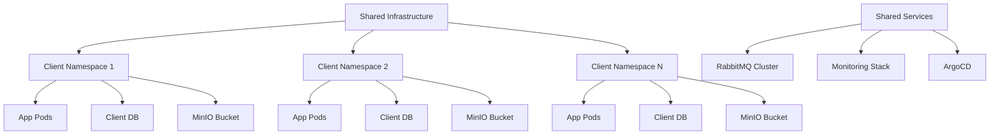
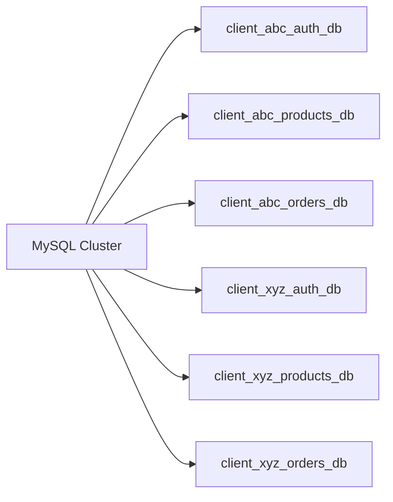
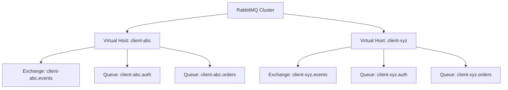
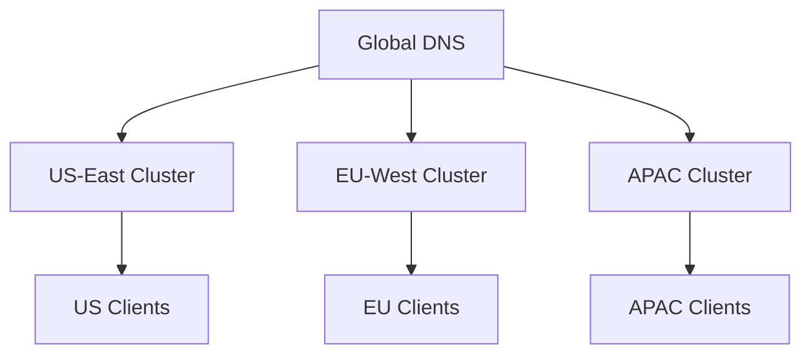

# Multi-Tenant B2B SaaS Architecture

## Overview

Collect & Verything operates as a multi-tenant B2B SaaS platform where each client receives their own isolated e-commerce website instance. The architecture ensures complete data isolation, resource management, and scalability through Kubernetes namespace-based tenant separation.

## Core Tenant Model

### Websites Table Structure

```sql
CREATE TABLE websites (
  id BIGINT PRIMARY KEY AUTO_INCREMENT,
  name VARCHAR(255) NOT NULL,
  domain VARCHAR(255) UNIQUE NOT NULL,
  created_at TIMESTAMP,
  updated_at TIMESTAMP,
  deleted_at TIMESTAMP NULL
);
```

**Key Principles:**
- One website record = One tenant/client
- Unique domain per tenant
- Soft deletes for data retention and compliance

### Tenant Identification

**Primary Identifier**: Domain name
- Example: `client-abc.collectverything.com`
- Custom domains: `shop.client-abc.com`

**Secondary Identifier**: Website ID
- Internal reference across all microservices
- Propagated via RabbitMQ events

## Multi-Tenant Kubernetes Architecture

### Namespace Isolation Strategy



### Namespace Architecture

**Shared Infrastructure Namespace**: `e-commerce-shared`
- RabbitMQ cluster
- ArgoCD deployment controller
- Prometheus/Grafana monitoring
- Jaeger distributed tracing
- External Secrets Operator

**Client Namespace Pattern**: `e-commerce-client-{client-id}`
- Example: `e-commerce-client-abc`
- Example: `e-commerce-client-xyz`

**Per-Client Resources**:
```yaml
apiVersion: v1
kind: Namespace
metadata:
  name: e-commerce-client-abc
  labels:
    tenant: client-abc
    tier: premium
    environment: production
    managed-by: argocd
  annotations:
    domain: client-abc.collectverything.com
    subscription-tier: premium
    created-date: "2025-01-15"
    billing-id: "sub_abc123"
```

## Resource Isolation Levels

### 1. Network Isolation

**Network Policies per Client Namespace**:
```yaml
apiVersion: networking.k8s.io/v1
kind: NetworkPolicy
metadata:
  name: client-isolation
  namespace: e-commerce-client-abc
spec:
  podSelector: {}
  policyTypes:
  - Ingress
  - Egress
  ingress:
  - from:
    - namespaceSelector:
        matchLabels:
          name: ingress-nginx
  - from:
    - podSelector: {}
  egress:
  - to:
    - namespaceSelector:
        matchLabels:
          name: e-commerce-shared
    ports:
    - protocol: TCP
      port: 5672  # RabbitMQ
  - to:
    - namespaceSelector:
        matchLabels:
          name: kube-system
    ports:
    - protocol: TCP
      port: 53  # DNS
```

**Isolation Rules**:
- Clients cannot communicate with each other
- Clients can only access shared infrastructure (RabbitMQ, monitoring)
- Ingress controller can route to all client namespaces
- DNS resolution allowed for service discovery

### 2. Database Isolation

**Strategy**: Database-per-tenant within shared MySQL cluster



**Database Naming Convention**:
- Pattern: `{client_id}_{service}_db`
- Example: `client_abc_auth_db`, `client_abc_products_db`
- Isolated credentials per client via Kubernetes secrets

**Connection Management**:
```yaml
apiVersion: v1
kind: Secret
metadata:
  name: auth-db-credentials
  namespace: e-commerce-client-abc
type: Opaque
stringData:
  DB_HOST: "mysql.e-commerce-shared.svc.cluster.local"
  DB_PORT: "3306"
  DB_DATABASE: "client_abc_auth_db"
  DB_USERNAME: "client_abc_auth_user"
  DB_PASSWORD: "generated_secure_password"
```

### 3. Object Storage Isolation

**MinIO Bucket Strategy**: Bucket-per-tenant

```
minio/
├── client-abc-products/
│   ├── product-images/
│   └── product-documents/
├── client-abc-sav/
│   └── support-attachments/
├── client-abc-newsletters/
│   └── email-templates/
├── client-xyz-products/
├── client-xyz-sav/
└── client-xyz-newsletters/
```

**Access Control**:
- IAM policies per client bucket
- Presigned URLs scoped to tenant
- Bucket policies preventing cross-tenant access

```json
{
  "Version": "2012-10-17",
  "Statement": [
    {
      "Effect": "Allow",
      "Principal": {
        "AWS": ["arn:aws:iam::*:user/client-abc-app"]
      },
      "Action": ["s3:GetObject", "s3:PutObject", "s3:DeleteObject"],
      "Resource": ["arn:aws:s3:::client-abc-products/*"]
    }
  ]
}
```

### 4. Compute Resource Isolation

**Resource Quotas per Client Namespace**:
```yaml
apiVersion: v1
kind: ResourceQuota
metadata:
  name: client-quota
  namespace: e-commerce-client-abc
spec:
  hard:
    requests.cpu: "4"
    requests.memory: "8Gi"
    limits.cpu: "8"
    limits.memory: "16Gi"
    persistentvolumeclaims: "10"
    services.loadbalancers: "1"
    pods: "50"
```

**Limit Ranges per Pod**:
```yaml
apiVersion: v1
kind: LimitRange
metadata:
  name: pod-limits
  namespace: e-commerce-client-abc
spec:
  limits:
  - max:
      cpu: "2"
      memory: "4Gi"
    min:
      cpu: "100m"
      memory: "128Mi"
    default:
      cpu: "500m"
      memory: "512Mi"
    defaultRequest:
      cpu: "250m"
      memory: "256Mi"
    type: Container
```

## Service Mesh Architecture

### Shared Services Access Pattern

**RabbitMQ Multi-Tenancy**:


**Virtual Host Isolation**:
- One RabbitMQ virtual host per client
- Pattern: `/client-{client-id}`
- Isolated exchanges, queues, and bindings
- Separate credentials per virtual host

**Event Publishing**:
```json
{
  "event": "order.created",
  "tenant_id": "client-abc",
  "website_id": 123,
  "timestamp": "2025-01-15T10:30:00Z",
  "payload": {
    "order_id": 456,
    "total": 99.99
  }
}
```

## Ingress and Routing

### Domain-Based Routing

```yaml
apiVersion: networking.k8s.io/v1
kind: Ingress
metadata:
  name: client-abc-ingress
  namespace: e-commerce-client-abc
  annotations:
    cert-manager.io/cluster-issuer: "letsencrypt-prod"
spec:
  ingressClassName: nginx
  tls:
  - hosts:
    - client-abc.collectverything.com
    secretName: client-abc-tls
  rules:
  - host: client-abc.collectverything.com
    http:
      paths:
      - path: /
        pathType: Prefix
        backend:
          service:
            name: api-gateway
            port:
              number: 8100
```

**Routing Logic**:
1. Nginx Ingress Controller receives request
2. Domain extracted: `client-abc.collectverything.com`
3. Routes to namespace: `e-commerce-client-abc`
4. API Gateway receives request in client namespace
5. Website ID resolved from domain via websites-service
6. All downstream operations scoped to website ID

## Monitoring and Observability

### Per-Tenant Metrics

**Prometheus Label Strategy**:
```yaml
- job_name: 'kubernetes-pods'
  relabel_configs:
  - source_labels: [__meta_kubernetes_namespace]
    regex: e-commerce-client-(.+)
    target_label: tenant_id
  - source_labels: [__meta_kubernetes_pod_label_tenant]
    target_label: tenant
  - source_labels: [__meta_kubernetes_pod_label_tier]
    target_label: subscription_tier
```

**Grafana Dashboards**:
- Global dashboard: all clients aggregated
- Per-client dashboard: `tenant_id="client-abc"`
- Metrics isolation via label filtering

**Key Metrics per Tenant**:
- Request rate (req/s)
- Error rate (%)
- Response time (p50, p95, p99)
- Resource usage (CPU, memory, storage)
- Database connections
- RabbitMQ queue depth

### Distributed Tracing

**Jaeger Tenant Context**:
```json
{
  "trace_id": "abc123def456",
  "span_id": "789xyz",
  "tags": {
    "tenant.id": "client-abc",
    "tenant.tier": "premium",
    "website.id": "123",
    "website.domain": "client-abc.collectverything.com"
  }
}
```

## Security Considerations

### RBAC per Tenant

**Client Admin Role**:
```yaml
apiVersion: rbac.authorization.k8s.io/v1
kind: Role
metadata:
  name: client-admin
  namespace: e-commerce-client-abc
rules:
- apiGroups: [""]
  resources: ["pods", "pods/log", "services", "configmaps"]
  verbs: ["get", "list", "watch"]
- apiGroups: ["apps"]
  resources: ["deployments", "replicasets"]
  verbs: ["get", "list", "watch"]
```

**Access Patterns**:
- Platform operators: full access to all namespaces
- Client admins: read-only access to their namespace
- Application pods: access via service accounts with minimal permissions

### Secrets Management

**External Secrets Operator**:
```yaml
apiVersion: external-secrets.io/v1beta1
kind: ExternalSecret
metadata:
  name: client-db-credentials
  namespace: e-commerce-client-abc
spec:
  secretStoreRef:
    name: aws-secrets-manager
    kind: ClusterSecretStore
  target:
    name: auth-db-credentials
  data:
  - secretKey: DB_PASSWORD
    remoteRef:
      key: /e-commerce/client-abc/auth-db-password
```

**Secret Rotation**:
- Automated 90-day rotation
- Zero-downtime credential updates
- Audit trail via AWS Secrets Manager

## Scaling Strategy

### Horizontal Pod Autoscaling

**Per-Service HPA**:
```yaml
apiVersion: autoscaling/v2
kind: HorizontalPodAutoscaler
metadata:
  name: api-gateway-hpa
  namespace: e-commerce-client-abc
spec:
  scaleTargetRef:
    apiVersion: apps/v1
    kind: Deployment
    name: api-gateway
  minReplicas: 2
  maxReplicas: 10
  metrics:
  - type: Resource
    resource:
      name: cpu
      target:
        type: Utilization
        averageUtilization: 70
  - type: Resource
    resource:
      name: memory
      target:
        type: Utilization
        averageUtilization: 80
```

### Vertical Scaling

**Tier-Based Scaling**:
- Standard: 2-3 replicas per service
- Premium: 3-6 replicas per service
- Business: 6-15 replicas per service

**Resource Allocation**:
- Standard: 2 CPU, 4 GB RAM
- Premium: 6 CPU, 12 GB RAM
- Business: 12+ CPU, 24+ GB RAM

## Data Residency and Compliance

### Geographic Isolation

**Multi-Region Deployment**:


**Region Selection**:
- EU clients: `e-commerce-client-abc` in EU cluster
- US clients: `e-commerce-client-xyz` in US cluster
- Data never crosses regional boundaries

### Compliance per Tenant

**GDPR Compliance**:
- Data residency enforcement
- Right to erasure via soft deletes
- Data portability via export APIs
- Consent management in auth-service

**PCI-DSS Compliance**:
- No card data stored in application
- Payment tokens only
- PCI-compliant payment gateway integration
- Audit logs for all payment operations

## Backup and Disaster Recovery

### Per-Tenant Backups

**Database Backups**:
```yaml
apiVersion: batch/v1
kind: CronJob
metadata:
  name: db-backup
  namespace: e-commerce-client-abc
spec:
  schedule: "0 2 * * *"  # Daily at 2 AM
  jobTemplate:
    spec:
      template:
        spec:
          containers:
          - name: backup
            image: mysql:8.0
            command:
            - /bin/sh
            - -c
            - mysqldump -h mysql.e-commerce-shared -u $DB_USER -p$DB_PASSWORD
              client_abc_auth_db | gzip > /backup/auth_db_$(date +%Y%m%d).sql.gz
            volumeMounts:
            - name: backup-storage
              mountPath: /backup
          volumes:
          - name: backup-storage
            persistentVolumeClaim:
              claimName: backup-pvc
```

**Backup Retention**:
- Daily backups: 30 days
- Weekly backups: 12 weeks
- Monthly backups: 12 months

**Disaster Recovery SLA**:
- RPO (Recovery Point Objective): 24 hours
- RTO (Recovery Time Objective): 4 hours

## Cost Allocation

### Resource Tagging

**Cost Tracking Labels**:
```yaml
metadata:
  labels:
    tenant: client-abc
    tier: premium
    cost-center: "CC-ABC-001"
    billing-id: "sub_abc123"
    department: "retail"
```

**Metrics for Billing**:
- CPU hours consumed
- Memory GB hours consumed
- Storage GB per month
- Network egress GB
- API requests count
- Database transactions count

### Showback Reports

**Monthly Cost Breakdown**:
```
Client: client-abc
Tier: Premium
Period: 2025-01

Base Fee: 124.99 EUR

Resource Usage:
  - CPU: 6 cores (within quota)
  - Memory: 12 GB (within quota)
  - Storage: 145 GB (within 150 GB quota)
  - Sites: 3 (within limit)

Overages: 0.00 EUR

Total: 124.99 EUR
```

## Migration Strategy

### Onboarding New Tenant

**Automated Provisioning** (covered in 02-provisioning-workflow.md):
1. Subscription created in billing system
2. ArgoCD ApplicationSet generates namespace
3. Databases created with tenant prefix
4. MinIO buckets created with IAM policies
5. RabbitMQ virtual host configured
6. Ingress rules deployed
7. Monitoring dashboards created
8. Client receives access credentials

### Offboarding Tenant

**Deprovisioning Steps**:
1. Subscription cancelled in billing system
2. Website marked as `deleted_at` (soft delete)
3. Namespace marked for deletion (30-day grace period)
4. Final backup created and archived
5. Resources released after grace period
6. Data retention per compliance requirements

**Data Retention**:
- Active clients: indefinite
- Cancelled clients: 30 days grace period
- Deleted clients: 7 years for compliance (archived)

## Summary

**Key Architectural Principles**:
- Complete tenant isolation via Kubernetes namespaces
- Database-per-tenant with shared MySQL cluster
- Bucket-per-tenant in MinIO object storage
- Virtual host per tenant in RabbitMQ
- Network policies preventing cross-tenant communication
- Domain-based ingress routing
- Per-tenant monitoring and observability
- Automated provisioning and deprovisioning
- Cost allocation and showback reporting
- Multi-region support for data residency
- Comprehensive backup and disaster recovery

**Production Readiness**:
- Scales to 1000+ concurrent tenants
- Sub-100ms tenant routing overhead
- 99.95% uptime SLA per tenant
- Automated scaling and self-healing
- Complete audit trail for compliance
