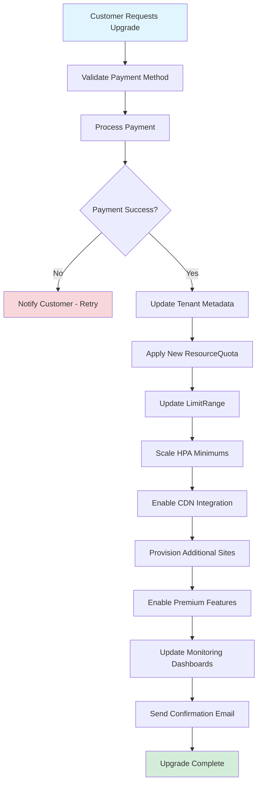
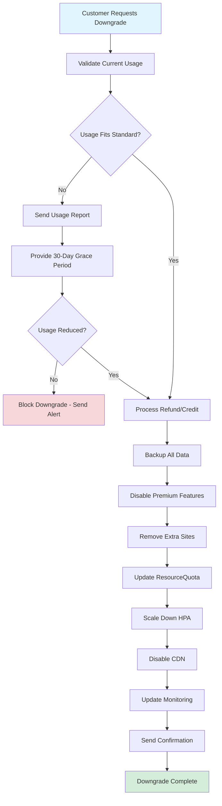

# Pricing Tiers and Resource Allocation

## Overview

Collect & Verything offers three subscription tiers (Standard, Premium, Business) with differentiated resource allocations, features, and SLAs. Pricing is designed to scale from small businesses to enterprise operations with flexible billing options.

## Tier Comparison Matrix

| Feature | Standard | Premium | Business |
|---------|----------|---------|----------|
| **Monthly Price** | 49.99 EUR | 124.99 EUR | Starting at 149.99 EUR |
| **Annual Price** | 499 EUR (16% discount) | 1249 EUR (16% discount) | Custom pricing |
| **Annual Savings** | 2 months free | 2 months free | Negotiable |
| **E-commerce Sites** | 1 | 3 | Up to 10 |
| **Personalized Domains** | 1 | 3 | Up to 10 |
| **CPU Cores** | 2 | 6 | 12+ |
| **RAM** | 4 GB | 12 GB | 24+ GB |
| **Storage** | 50 GB | 150 GB | 300+ GB |
| **Pod Replicas** | 2-3 | 3-6 | 6-15 |
| **Max Concurrent Users** | 200 | 1,000 | 5,000+ |
| **API Rate Limit** | 500 req/min | 3,000 req/min | 15,000 req/min |
| **Max Products** | 2,000 | 15,000 | Unlimited |
| **Orders/Month** | 5,000 | 30,000 | Unlimited |
| **Object Storage (Total)** | 25 GB | 100 GB | 500+ GB |
| **- Products Bucket** | 15 GB | 60 GB | 300+ GB |
| **- SAV Bucket** | 5 GB | 20 GB | 100+ GB |
| **- Newsletters Bucket** | 5 GB | 20 GB | 100+ GB |
| **CDN** | No | CloudFlare 100GB/month | Premium CDN (unlimited) |
| **Backups** | Daily | Hourly | Real-time |
| **Uptime SLA** | 99.5% | 99.9% | 99.95% |
| **Support** | Email | Email + Chat | 24/7 Phone + Dedicated Manager |
| **Response Time** | 48 hours | 12 hours | 2 hours |

## Feature Comparison by Tier

### Core Features (All Tiers)

All tiers include the following base functionality:

- **Theme Selection**
  - Standard: Predefined themes only
  - Premium: Customizable themes with brand colors
  - Business: Fully customizable themes + white-label options

- **Administration Interface**
  - User management
  - Role-based access control (RBAC)
  - Activity logging
  - Settings management

- **Client Management**
  - Customer profiles
  - Order history
  - Contact information
  - Communication history

- **Product Management**
  - Product catalog
  - Inventory tracking
  - Categories and tags
  - Product variants

- **Sales Management**
  - Order processing
  - Payment integration
  - Transaction history
  - Refund processing

- **Invoicing**
  - Automatic invoice generation
  - PDF export
  - Invoice templates
  - Tax calculation

- **Statistics**
  - Standard: Basic dashboards (sales, orders, customers)
  - Premium: Advanced analytics with custom reports
  - Business: Real-time analytics + predictive insights

- **Customer Support (SAV)**
  - Ticket management
  - Email integration
  - Knowledge base
  - Response tracking

### Additional Premium Features

Premium tier adds:
- **Multi-site Management**: Manage up to 3 e-commerce sites from single dashboard
- **CDN Integration**: CloudFlare CDN with 100GB/month bandwidth
- **Advanced Analytics**: Custom reports, conversion tracking, customer segmentation
- **Email Marketing**: Automated campaigns, A/B testing, advanced segmentation
- **Priority Support**: Email and live chat with 12-hour response time
- **Hourly Backups**: Automated backups every hour with 30-day retention

### Additional Business Features

Business tier adds:
- **Enterprise Scale**: Up to 10 e-commerce sites and domains
- **Premium CDN**: Unlimited bandwidth with global edge locations
- **White-label Options**: Custom branding, remove platform branding
- **Dedicated Infrastructure**: Optional dedicated database cluster
- **24/7 Support**: Phone support with dedicated account manager
- **2-Hour Response**: Guaranteed response within 2 hours for critical issues
- **Real-time Backups**: Continuous backup with point-in-time recovery
- **Custom Integrations**: ERP, CRM, accounting software integration
- **Advanced Security**: WAF, DDoS protection, security audits
- **Compliance Support**: SOC 2, PCI-DSS compliance assistance

## Standard Tier

### Target Audience
- Small businesses and startups
- Single e-commerce site owners
- Testing and evaluation
- Low to moderate traffic (< 200 concurrent users)

### Pricing
- **Monthly**: 49.99 EUR
- **Annual**: 499 EUR (saves 99.88 EUR - 16% discount, equivalent to 2 months free)

### Resource Allocation

#### Kubernetes Resource Quota
```yaml
apiVersion: v1
kind: ResourceQuota
metadata:
  name: standard-quota
  namespace: e-commerce-tenant-{{tenant_id}}
spec:
  hard:
    requests.cpu: "2"
    requests.memory: "4Gi"
    limits.cpu: "4"
    limits.memory: "8Gi"
    persistentvolumeclaims: "3"
    services.loadbalancers: "1"
    pods: "15"
    requests.storage: "50Gi"
```

#### Horizontal Pod Autoscaler
```yaml
apiVersion: autoscaling/v2
kind: HorizontalPodAutoscaler
metadata:
  name: api-gateway-hpa
  namespace: e-commerce-tenant-{{tenant_id}}
spec:
  scaleTargetRef:
    apiVersion: apps/v1
    kind: Deployment
    name: api-gateway
  minReplicas: 2
  maxReplicas: 3
  metrics:
  - type: Resource
    resource:
      name: cpu
      target:
        type: Utilization
        averageUtilization: 70
  - type: Resource
    resource:
      name: memory
      target:
        type: Utilization
        averageUtilization: 75
  behavior:
    scaleDown:
      stabilizationWindowSeconds: 300
      policies:
      - type: Percent
        value: 50
        periodSeconds: 60
```

#### Per-Service Resources
```yaml
resources:
  requests:
    cpu: 200m
    memory: 256Mi
  limits:
    cpu: 400m
    memory: 512Mi
```

### Feature Limits

#### Database Configuration
- **Max connections per service**: 10
- **Query timeout**: 30 seconds
- **Max query size**: 1 MB
- **Connection pooling**: Enabled
- **Slow query log threshold**: 2 seconds

#### Object Storage (MinIO)
```yaml
buckets:
  products:
    quota: 15GB
    max_file_size: 5MB
    allowed_types: [image/jpeg, image/png, image/webp, image/gif]
  sav:
    quota: 5GB
    max_file_size: 10MB
    allowed_types: [application/pdf, image/*, text/plain]
  newsletters:
    quota: 5GB
    max_file_size: 2MB
    allowed_types: [text/html, image/*, application/pdf]

presigned_url_expiry: 3600  # 1 hour
```

#### RabbitMQ Configuration
```yaml
rabbitmq:
  max_message_size: 1MB
  queue_max_length: 5000
  message_ttl: 86400000  # 24 hours
  max_priority: 10
  consumer_timeout: 1800000  # 30 minutes
```

#### Rate Limiting
```yaml
apiVersion: networking.k8s.io/v1
kind: Ingress
metadata:
  name: tenant-ingress
  namespace: e-commerce-tenant-{{tenant_id}}
  annotations:
    nginx.ingress.kubernetes.io/rate-limit: "500"
    nginx.ingress.kubernetes.io/limit-rps: "8"  # 500/60 seconds
    nginx.ingress.kubernetes.io/limit-connections: "50"
    nginx.ingress.kubernetes.io/limit-burst-multiplier: "2"
```

### Support & SLA

#### Uptime Guarantee
- **SLA**: 99.5% (maximum 3.6 hours downtime per month)
- **Compensation**: 5% monthly credit per 0.1% below SLA
- **Scheduled maintenance**: Excluded from SLA calculation

#### Support Channels
- **Email**: support@collectverything.com
- **Response time**: Within 48 hours
- **Availability**: Monday-Friday, 9:00-18:00 CET
- **Languages**: English, French

#### Monitoring
```yaml
monitoring:
  grafana_dashboard: basic
  metrics_retention: 30 days
  alerts:
    - type: email
      events: [critical_errors, service_down]
  reports: monthly_summary
```

## Premium Tier

### Target Audience
- Growing businesses
- Multi-channel sellers
- Medium traffic sites (200-1,000 concurrent users)
- Businesses requiring advanced analytics

### Pricing
- **Monthly**: 124.99 EUR
- **Annual**: 1249 EUR (saves 249.88 EUR - 16% discount, equivalent to 2 months free)

### Resource Allocation

#### Kubernetes Resource Quota
```yaml
apiVersion: v1
kind: ResourceQuota
metadata:
  name: premium-quota
  namespace: e-commerce-tenant-{{tenant_id}}
spec:
  hard:
    requests.cpu: "6"
    requests.memory: "12Gi"
    limits.cpu: "12"
    limits.memory: "24Gi"
    persistentvolumeclaims: "9"  # 3 sites x 3 PVCs
    services.loadbalancers: "3"
    pods: "50"
    requests.storage: "150Gi"
```

#### Horizontal Pod Autoscaler
```yaml
apiVersion: autoscaling/v2
kind: HorizontalPodAutoscaler
metadata:
  name: api-gateway-hpa
  namespace: e-commerce-tenant-{{tenant_id}}
spec:
  scaleTargetRef:
    apiVersion: apps/v1
    kind: Deployment
    name: api-gateway
  minReplicas: 3
  maxReplicas: 6
  metrics:
  - type: Resource
    resource:
      name: cpu
      target:
        type: Utilization
        averageUtilization: 70
  - type: Resource
    resource:
      name: memory
      target:
        type: Utilization
        averageUtilization: 75
  - type: Pods
    pods:
      metric:
        name: http_requests_per_second
      target:
        type: AverageValue
        averageValue: "100"
  behavior:
    scaleUp:
      stabilizationWindowSeconds: 60
      policies:
      - type: Percent
        value: 100
        periodSeconds: 60
    scaleDown:
      stabilizationWindowSeconds: 300
      policies:
      - type: Percent
        value: 50
        periodSeconds: 60
```

#### Per-Service Resources
```yaml
resources:
  requests:
    cpu: 500m
    memory: 512Mi
  limits:
    cpu: 1000m
    memory: 1Gi
```

### Feature Limits

#### Database Configuration
- **Max connections per service**: 30
- **Query timeout**: 60 seconds
- **Max query size**: 10 MB
- **Connection pooling**: Enabled with optimization
- **Slow query log threshold**: 1 second
- **Read replicas**: 1 replica for reporting queries

#### Object Storage (MinIO)
```yaml
buckets:
  products:
    quota: 60GB
    max_file_size: 25MB
    allowed_types: [image/*, video/mp4, video/webm]
    cdn_enabled: true
    cdn_bandwidth: 100GB/month
  sav:
    quota: 20GB
    max_file_size: 50MB
    allowed_types: [application/*, image/*, text/*, video/*]
  newsletters:
    quota: 20GB
    max_file_size: 10MB
    allowed_types: [text/html, image/*, application/pdf]

presigned_url_expiry: 7200  # 2 hours
cdn_integration: cloudflare
```

#### RabbitMQ Configuration
```yaml
rabbitmq:
  max_message_size: 10MB
  queue_max_length: 30000
  message_ttl: 604800000  # 7 days
  max_priority: 10
  consumer_timeout: 3600000  # 60 minutes
  dead_letter_exchange: enabled
```

#### Rate Limiting
```yaml
apiVersion: networking.k8s.io/v1
kind: Ingress
metadata:
  name: tenant-ingress
  namespace: e-commerce-tenant-{{tenant_id}}
  annotations:
    nginx.ingress.kubernetes.io/rate-limit: "3000"
    nginx.ingress.kubernetes.io/limit-rps: "50"  # 3000/60 seconds
    nginx.ingress.kubernetes.io/limit-connections: "200"
    nginx.ingress.kubernetes.io/limit-burst-multiplier: "3"
```

#### CDN Configuration
```yaml
apiVersion: networking.k8s.io/v1
kind: Ingress
metadata:
  name: tenant-cdn-ingress
  namespace: e-commerce-tenant-{{tenant_id}}
  annotations:
    nginx.ingress.kubernetes.io/enable-cors: "true"
    nginx.ingress.kubernetes.io/cors-allow-origin: "*"
    external-dns.alpha.kubernetes.io/cloudflare-proxied: "true"
    external-dns.alpha.kubernetes.io/ttl: "300"
spec:
  ingressClassName: nginx
  rules:
  - host: "{{custom_domain}}"
    http:
      paths:
      - path: /static
        pathType: Prefix
        backend:
          service:
            name: minio-service
            port:
              number: 9000
```

### Support & SLA

#### Uptime Guarantee
- **SLA**: 99.9% (maximum 43 minutes downtime per month)
- **Compensation**: 10% monthly credit per 0.1% below SLA
- **Scheduled maintenance**: Maximum 2 hours/month, announced 7 days in advance

#### Support Channels
- **Email**: premium-support@collectverything.com
- **Live Chat**: Available 12:00-22:00 CET, 7 days/week
- **Response time**: Within 12 hours
- **Languages**: English, French, German, Spanish

#### Monitoring
```yaml
monitoring:
  grafana_dashboard: advanced
  metrics_retention: 90 days
  alerts:
    - type: email
      events: [all_errors, performance_degradation, quota_warnings]
    - type: slack
      events: [critical_errors, service_down]
  reports:
    - weekly_performance
    - monthly_detailed
  custom_dashboards: 3
```

## Business Tier

### Target Audience
- Enterprise businesses
- High-traffic e-commerce operations (1,000+ concurrent users)
- Multi-site enterprise operations
- Businesses with compliance requirements

### Pricing
- **Starting at**: 149.99 EUR/month
- **Custom pricing** based on:
  - Number of sites (1-10)
  - Required resources (CPU, RAM, storage)
  - Additional features (dedicated infrastructure, custom integrations)
  - Support SLA requirements

### Resource Allocation

#### Kubernetes Resource Quota
```yaml
apiVersion: v1
kind: ResourceQuota
metadata:
  name: business-quota
  namespace: e-commerce-tenant-{{tenant_id}}
spec:
  hard:
    requests.cpu: "12"
    requests.memory: "24Gi"
    limits.cpu: "24"
    limits.memory: "48Gi"
    persistentvolumeclaims: "30"  # 10 sites x 3 PVCs
    services.loadbalancers: "10"
    pods: "100"
    requests.storage: "300Gi"
```

Note: Resources are fully customizable based on client requirements. Values shown are minimum baseline.

#### Horizontal Pod Autoscaler
```yaml
apiVersion: autoscaling/v2
kind: HorizontalPodAutoscaler
metadata:
  name: api-gateway-hpa
  namespace: e-commerce-tenant-{{tenant_id}}
spec:
  scaleTargetRef:
    apiVersion: apps/v1
    kind: Deployment
    name: api-gateway
  minReplicas: 6
  maxReplicas: 15
  metrics:
  - type: Resource
    resource:
      name: cpu
      target:
        type: Utilization
        averageUtilization: 70
  - type: Resource
    resource:
      name: memory
      target:
        type: Utilization
        averageUtilization: 75
  - type: Pods
    pods:
      metric:
        name: http_requests_per_second
      target:
        type: AverageValue
        averageValue: "200"
  - type: External
    external:
      metric:
        name: queue_depth
      target:
        type: AverageValue
        averageValue: "100"
  behavior:
    scaleUp:
      stabilizationWindowSeconds: 30
      policies:
      - type: Percent
        value: 100
        periodSeconds: 30
      - type: Pods
        value: 4
        periodSeconds: 30
      selectPolicy: Max
    scaleDown:
      stabilizationWindowSeconds: 300
      policies:
      - type: Percent
        value: 25
        periodSeconds: 60
```

#### Per-Service Resources
```yaml
resources:
  requests:
    cpu: 1000m
    memory: 1Gi
  limits:
    cpu: 2000m
    memory: 2Gi
```

### Feature Limits

#### Database Configuration
- **Max connections per service**: 100
- **Query timeout**: 300 seconds
- **Max query size**: 100 MB
- **Connection pooling**: Advanced with load balancing
- **Slow query log threshold**: 500ms
- **Read replicas**: 3 replicas with automatic failover
- **Point-in-time recovery**: 30 days
- **Optional dedicated cluster**: MySQL InnoDB Cluster with 5 instances

```yaml
# Optional Dedicated Database Cluster
apiVersion: mysql.oracle.com/v2
kind: InnoDBCluster
metadata:
  name: tenant-dedicated-mysql
  namespace: e-commerce-tenant-{{tenant_id}}
spec:
  instances: 5
  router:
    instances: 3
  secretName: mysql-cluster-secret
  tlsUseSelfSigned: true
  podSpec:
    resources:
      requests:
        cpu: "4"
        memory: "8Gi"
      limits:
        cpu: "8"
        memory: "16Gi"
  datadirVolumeClaimTemplate:
    accessModes:
      - ReadWriteOnce
    resources:
      requests:
        storage: 100Gi
```

#### Object Storage (MinIO)
```yaml
buckets:
  products:
    quota: 300GB  # Expandable to 1TB+
    max_file_size: 500MB
    allowed_types: [*/*]  # All types allowed
    cdn_enabled: true
    cdn_bandwidth: unlimited
    versioning: enabled
  sav:
    quota: 100GB  # Expandable
    max_file_size: 500MB
    allowed_types: [*/*]
    versioning: enabled
  newsletters:
    quota: 100GB  # Expandable
    max_file_size: 100MB
    allowed_types: [*/*]
    versioning: enabled

presigned_url_expiry: 86400  # 24 hours
cdn_integration: cloudflare_enterprise
replication: enabled  # Cross-region replication
```

#### RabbitMQ Configuration
```yaml
rabbitmq:
  max_message_size: 100MB
  queue_max_length: unlimited
  message_ttl: 2592000000  # 30 days
  max_priority: 255
  consumer_timeout: 7200000  # 2 hours
  dead_letter_exchange: enabled
  federation: enabled  # Multi-region message federation
  high_availability: true
  cluster_nodes: 3
```

#### Rate Limiting
```yaml
apiVersion: networking.k8s.io/v1
kind: Ingress
metadata:
  name: tenant-ingress
  namespace: e-commerce-tenant-{{tenant_id}}
  annotations:
    nginx.ingress.kubernetes.io/rate-limit: "15000"
    nginx.ingress.kubernetes.io/limit-rps: "250"  # 15000/60 seconds
    nginx.ingress.kubernetes.io/limit-connections: "1000"
    nginx.ingress.kubernetes.io/limit-burst-multiplier: "5"
    nginx.ingress.kubernetes.io/limit-whitelist: "{{trusted_ips}}"
```

#### Enterprise CDN Configuration
```yaml
apiVersion: networking.k8s.io/v1
kind: Ingress
metadata:
  name: tenant-cdn-ingress
  namespace: e-commerce-tenant-{{tenant_id}}
  annotations:
    external-dns.alpha.kubernetes.io/cloudflare-proxied: "true"
    external-dns.alpha.kubernetes.io/ttl: "120"
    # Cloudflare Enterprise features
    cloudflare.com/argo-tunnel: "true"
    cloudflare.com/load-balancing: "true"
    cloudflare.com/waf: "enabled"
    cloudflare.com/ddos-protection: "advanced"
    cloudflare.com/rate-limiting: "advanced"
spec:
  ingressClassName: nginx
  tls:
  - hosts:
    - "{{custom_domain}}"
    secretName: "{{domain}}-tls"
  rules:
  - host: "{{custom_domain}}"
    http:
      paths:
      - path: /
        pathType: Prefix
        backend:
          service:
            name: api-gateway
            port:
              number: 80
```

### Enterprise Features

#### Multi-Region Deployment (Optional)
```yaml
apiVersion: argoproj.io/v1alpha1
kind: ApplicationSet
metadata:
  name: business-tenant-multi-region
  namespace: argocd
spec:
  generators:
  - list:
      elements:
      - cluster: eu-west-1
        region: europe
        datacenter: paris
      - cluster: us-east-1
        region: north-america
        datacenter: virginia
      - cluster: ap-southeast-1
        region: asia-pacific
        datacenter: singapore
  template:
    metadata:
      name: '{{tenant_id}}-{{region}}'
    spec:
      project: e-commerce-business
      source:
        repoURL: https://github.com/org/e-commerce-infra
        targetRevision: main
        path: helm/e-commerce-platform
        helm:
          values: |
            tenant:
              id: {{tenant_id}}
              tier: business
              region: {{region}}
              datacenter: {{datacenter}}
      destination:
        server: '{{cluster}}'
        namespace: 'e-commerce-tenant-{{tenant_id}}'
      syncPolicy:
        automated:
          prune: true
          selfHeal: true
```

#### Security Features
```yaml
# Web Application Firewall
apiVersion: networking.k8s.io/v1
kind: NetworkPolicy
metadata:
  name: tenant-waf-policy
  namespace: e-commerce-tenant-{{tenant_id}}
spec:
  podSelector:
    matchLabels:
      app: api-gateway
  policyTypes:
  - Ingress
  - Egress
  ingress:
  - from:
    - namespaceSelector:
        matchLabels:
          name: ingress-nginx
    ports:
    - protocol: TCP
      port: 80
    - protocol: TCP
      port: 443
  egress:
  - to:
    - namespaceSelector: {}
    ports:
    - protocol: TCP
      port: 3306  # MySQL
    - protocol: TCP
      port: 5672  # RabbitMQ
    - protocol: TCP
      port: 9000  # MinIO

---
# Pod Security Policy
apiVersion: policy/v1beta1
kind: PodSecurityPolicy
metadata:
  name: tenant-restricted
spec:
  privileged: false
  allowPrivilegeEscalation: false
  requiredDropCapabilities:
    - ALL
  volumes:
    - 'configMap'
    - 'emptyDir'
    - 'projected'
    - 'secret'
    - 'downwardAPI'
    - 'persistentVolumeClaim'
  runAsUser:
    rule: 'MustRunAsNonRoot'
  seLinux:
    rule: 'RunAsAny'
  fsGroup:
    rule: 'RunAsAny'
  readOnlyRootFilesystem: true
```

### Support & SLA

#### Uptime Guarantee
- **SLA**: 99.95% (maximum 21 minutes downtime per month)
- **Compensation**: 25% monthly credit per 0.1% below SLA
- **Scheduled maintenance**: Maximum 1 hour/month, announced 14 days in advance
- **Emergency maintenance**: Immediate notification with post-mortem report

#### Support Channels
- **Email**: enterprise-support@collectverything.com
- **Live Chat**: 24/7/365
- **Phone**: +33 1 XX XX XX XX (24/7/365)
- **Dedicated Account Manager**: Named contact with direct line
- **Quarterly Business Reviews**: Strategic planning and optimization sessions
- **Slack Connect**: Direct channel to engineering team (optional)

#### Response Times by Severity
```yaml
support_sla:
  critical:
    definition: "Service down, major functionality unavailable"
    response_time: 2 hours
    resolution_target: 4 hours
    escalation: immediate
  high:
    definition: "Significant functionality impaired"
    response_time: 4 hours
    resolution_target: 8 hours
    escalation: 6 hours
  medium:
    definition: "Minor functionality issues"
    response_time: 8 hours
    resolution_target: 24 hours
    escalation: 16 hours
  low:
    definition: "General questions, feature requests"
    response_time: 12 hours
    resolution_target: 48 hours
    escalation: 24 hours
```

#### Monitoring & Observability
```yaml
monitoring:
  grafana_dashboard: enterprise_custom
  metrics_retention: 365 days
  logs_retention: 90 days
  trace_sampling: 100%

  alerts:
    channels:
      - type: email
        events: all
      - type: slack
        events: [critical, high]
      - type: pagerduty
        events: [critical]
      - type: sms
        events: [critical]

  reports:
    - type: daily_health_check
      recipients: [ops_team, account_manager]
    - type: weekly_performance
      recipients: [ops_team, account_manager, client_contact]
    - type: monthly_executive_summary
      recipients: [all_stakeholders]
    - type: quarterly_business_review
      recipients: [executive_team]

  custom_dashboards: unlimited
  api_access: full_prometheus_api

  apm_integration:
    - datadog
    - new_relic
    - elastic_apm
```

## Resource Monitoring and Enforcement

### Quota Enforcement Mechanisms

#### Namespace-Level Limits
```yaml
apiVersion: v1
kind: LimitRange
metadata:
  name: tenant-limits
  namespace: e-commerce-tenant-{{tenant_id}}
spec:
  limits:
  # Container limits
  - max:
      cpu: "2"
      memory: "4Gi"
    min:
      cpu: "50m"
      memory: "64Mi"
    default:
      cpu: "500m"
      memory: "512Mi"
    defaultRequest:
      cpu: "200m"
      memory: "256Mi"
    type: Container

  # Pod limits
  - max:
      cpu: "4"
      memory: "8Gi"
    type: Pod

  # PVC limits
  - max:
      storage: "100Gi"
    min:
      storage: "1Gi"
    type: PersistentVolumeClaim
```

#### Storage Class with Tier-Specific Provisioning
```yaml
apiVersion: storage.k8s.io/v1
kind: StorageClass
metadata:
  name: tier-{{tier}}-storage
provisioner: kubernetes.io/aws-ebs
parameters:
  type: gp3
  iops: "{{tier_iops}}"  # Standard: 3000, Premium: 10000, Business: 16000
  throughput: "{{tier_throughput}}"  # Standard: 125, Premium: 500, Business: 1000
  encrypted: "true"
allowVolumeExpansion: true
volumeBindingMode: WaitForFirstConsumer
```

### Usage Metrics Collection

#### Prometheus ServiceMonitor
```yaml
apiVersion: monitoring.coreos.com/v1
kind: ServiceMonitor
metadata:
  name: tenant-metrics
  namespace: e-commerce-tenant-{{tenant_id}}
spec:
  selector:
    matchLabels:
      app.kubernetes.io/instance: "{{tenant_id}}"
  endpoints:
  - port: metrics
    interval: 30s
    path: /metrics
```

#### Critical Prometheus Queries

```promql
# CPU usage per tenant (cores)
sum(rate(container_cpu_usage_seconds_total{namespace=~"e-commerce-tenant-.*"}[5m])) by (namespace)

# Memory usage per tenant (GB)
sum(container_memory_usage_bytes{namespace=~"e-commerce-tenant-.*"}) by (namespace) / 1024^3

# API requests per minute per tenant
sum(rate(http_requests_total{namespace=~"e-commerce-tenant-.*"}[1m])) by (namespace) * 60

# Storage usage per tenant (GB)
sum(kubelet_volume_stats_used_bytes{namespace=~"e-commerce-tenant-.*"}) by (namespace) / 1024^3

# Pod count per tenant
count(kube_pod_info{namespace=~"e-commerce-tenant-.*"}) by (namespace)

# Concurrent connections per tenant
sum(nginx_ingress_controller_nginx_process_connections{namespace=~"e-commerce-tenant-.*",state="active"}) by (namespace)

# MinIO bucket usage per tenant (GB)
sum(minio_bucket_usage_total_bytes{namespace=~"e-commerce-tenant-.*"}) by (namespace, bucket) / 1024^3

# RabbitMQ queue depth per tenant
sum(rabbitmq_queue_messages{namespace=~"e-commerce-tenant-.*"}) by (namespace, queue)

# Database connections per service
sum(mysql_global_status_threads_connected{namespace=~"e-commerce-tenant-.*"}) by (namespace, service)
```

### Quota Warning and Enforcement

#### Prometheus Alert Rules
```yaml
apiVersion: monitoring.coreos.com/v1
kind: PrometheusRule
metadata:
  name: tenant-quota-alerts
  namespace: monitoring
spec:
  groups:
  - name: resource-quotas
    interval: 30s
    rules:
    # CPU quota warnings
    - alert: TenantCPUQuotaWarning
      expr: |
        sum(rate(container_cpu_usage_seconds_total{namespace=~"e-commerce-tenant-.*"}[5m])) by (namespace) /
        sum(kube_resourcequota{namespace=~"e-commerce-tenant-.*",resource="requests.cpu",type="hard"}) by (namespace) > 0.80
      for: 5m
      labels:
        severity: warning
        tier: "{{ $labels.tier }}"
      annotations:
        summary: "Tenant {{ $labels.namespace }} approaching CPU quota"
        description: "CPU usage at {{ $value | humanizePercentage }} of quota"
        action: "Consider upgrading tier or optimizing workload"

    - alert: TenantCPUQuotaExceeded
      expr: |
        sum(rate(container_cpu_usage_seconds_total{namespace=~"e-commerce-tenant-.*"}[5m])) by (namespace) /
        sum(kube_resourcequota{namespace=~"e-commerce-tenant-.*",resource="requests.cpu",type="hard"}) by (namespace) > 0.95
      for: 2m
      labels:
        severity: critical
        tier: "{{ $labels.tier }}"
      annotations:
        summary: "Tenant {{ $labels.namespace }} exceeded CPU quota"
        description: "CPU usage at {{ $value | humanizePercentage }} of quota - throttling may occur"
        action: "Immediate upgrade required"

    # Memory quota warnings
    - alert: TenantMemoryQuotaWarning
      expr: |
        sum(container_memory_usage_bytes{namespace=~"e-commerce-tenant-.*"}) by (namespace) /
        sum(kube_resourcequota{namespace=~"e-commerce-tenant-.*",resource="requests.memory",type="hard"}) by (namespace) > 0.80
      for: 5m
      labels:
        severity: warning
      annotations:
        summary: "Tenant {{ $labels.namespace }} approaching memory quota"
        description: "Memory usage at {{ $value | humanizePercentage }} of quota"

    # Storage quota warnings
    - alert: TenantStorageQuotaWarning
      expr: |
        sum(kubelet_volume_stats_used_bytes{namespace=~"e-commerce-tenant-.*"}) by (namespace) /
        sum(kube_resourcequota{namespace=~"e-commerce-tenant-.*",resource="requests.storage",type="hard"}) by (namespace) > 0.80
      for: 10m
      labels:
        severity: warning
      annotations:
        summary: "Tenant {{ $labels.namespace }} approaching storage quota"
        description: "Storage usage at {{ $value | humanizePercentage }} of quota"

    # API rate limit warnings
    - alert: TenantAPIRateLimitWarning
      expr: |
        sum(rate(http_requests_total{namespace=~"e-commerce-tenant-.*"}[1m])) by (namespace) * 60 /
        on(namespace) group_left(tier) label_replace(
          kube_namespace_labels{label_tier=~"standard|premium|business"},
          "api_limit",
          "$1",
          "label_tier",
          "(standard=500|premium=3000|business=15000)"
        ) > 0.90
      for: 2m
      labels:
        severity: warning
      annotations:
        summary: "Tenant {{ $labels.namespace }} approaching API rate limit"
        description: "API requests at {{ $value | humanizePercentage }} of limit"

    # Product count limits
    - alert: TenantProductLimitWarning
      expr: |
        sum(mysql_product_count{namespace=~"e-commerce-tenant-.*"}) by (namespace) /
        on(namespace) group_left(tier) label_replace(
          kube_namespace_labels{label_tier=~"standard|premium"},
          "product_limit",
          "$1",
          "label_tier",
          "(standard=2000|premium=15000)"
        ) > 0.90
      labels:
        severity: warning
      annotations:
        summary: "Tenant {{ $labels.namespace }} approaching product limit"
        description: "Product count at {{ $value | humanizePercentage }} of tier limit"
```

### Billing Integration

#### Usage Data Collection Service
```yaml
apiVersion: v1
kind: ConfigMap
metadata:
  name: billing-collector-config
  namespace: monitoring
data:
  config.yaml: |
    collection_interval: 3600  # 1 hour

    metrics:
      - name: cpu_usage
        query: 'sum(rate(container_cpu_usage_seconds_total{namespace=~"e-commerce-tenant-.*"}[1h])) by (namespace)'
        unit: core_hours

      - name: memory_usage
        query: 'avg_over_time(sum(container_memory_usage_bytes{namespace=~"e-commerce-tenant-.*"}[1h]) by (namespace)[1h:5m]) / 1024^3'
        unit: gb_hours

      - name: storage_usage
        query: 'avg_over_time(sum(kubelet_volume_stats_used_bytes{namespace=~"e-commerce-tenant-.*"}[1h]) by (namespace)[1h:5m]) / 1024^3'
        unit: gb

      - name: api_requests
        query: 'sum(increase(http_requests_total{namespace=~"e-commerce-tenant-.*"}[1h])) by (namespace)'
        unit: requests

      - name: cdn_bandwidth
        query: 'sum(increase(cloudflare_bandwidth_bytes{namespace=~"e-commerce-tenant-.*"}[1h])) by (namespace) / 1024^3'
        unit: gb

      - name: object_storage
        query: 'sum(minio_bucket_usage_total_bytes{namespace=~"e-commerce-tenant-.*"}) by (namespace, bucket) / 1024^3'
        unit: gb

    export:
      format: json
      destination: s3://billing-data/usage-reports/
      encryption: enabled
```

#### Monthly Billing Report Example
```json
{
  "tenant_id": "acme-corp-a7f3b2",
  "tenant_name": "ACME Corporation",
  "billing_period": "2025-02",
  "period_start": "2025-02-01T00:00:00Z",
  "period_end": "2025-02-28T23:59:59Z",
  "tier": "premium",
  "sites_count": 3,

  "base_charges": {
    "monthly_fee": 124.99,
    "currency": "EUR"
  },

  "resource_usage": {
    "cpu": {
      "allocated_cores": 6,
      "used_core_hours": 4032,
      "quota_core_hours": 4032,
      "overage_core_hours": 0,
      "overage_charge": 0.00
    },
    "memory": {
      "allocated_gb": 12,
      "used_gb_hours": 8064,
      "quota_gb_hours": 8064,
      "overage_gb_hours": 0,
      "overage_charge": 0.00
    },
    "storage": {
      "allocated_gb": 150,
      "average_used_gb": 142,
      "quota_gb": 150,
      "overage_gb": 0,
      "overage_charge": 0.00
    },
    "api_requests": {
      "total_requests": 78500000,
      "quota_requests": 120960000,
      "overage_requests": 0,
      "overage_charge": 0.00
    },
    "cdn_bandwidth": {
      "total_gb": 87,
      "quota_gb": 100,
      "overage_gb": 0,
      "overage_charge": 0.00
    },
    "object_storage": {
      "products": {
        "average_gb": 58,
        "quota_gb": 60
      },
      "sav": {
        "average_gb": 18,
        "quota_gb": 20
      },
      "newsletters": {
        "average_gb": 14,
        "quota_gb": 20
      },
      "total_used_gb": 90,
      "total_quota_gb": 100,
      "overage_gb": 0,
      "overage_charge": 0.00
    }
  },

  "performance_metrics": {
    "average_concurrent_users": 687,
    "peak_concurrent_users": 1243,
    "average_response_time_ms": 145,
    "uptime_percentage": 99.94,
    "sla_compliance": true
  },

  "total_charges": {
    "base_fee": 124.99,
    "overage_charges": 0.00,
    "total": 124.99,
    "currency": "EUR"
  },

  "payment_status": "paid",
  "invoice_number": "INV-2025-02-A7F3B2",
  "payment_method": "credit_card",
  "next_billing_date": "2025-03-01"
}
```

## Tier Migration Workflows

### Upgrade Process

#### Standard to Premium Upgrade



**Automation Script:**
```yaml
apiVersion: batch/v1
kind: Job
metadata:
  name: tier-upgrade-{{tenant_id}}
  namespace: platform-admin
spec:
  template:
    spec:
      serviceAccountName: tenant-admin
      containers:
      - name: upgrade-executor
        image: platform/tier-manager:latest
        env:
        - name: TENANT_ID
          value: "{{tenant_id}}"
        - name: SOURCE_TIER
          value: "standard"
        - name: TARGET_TIER
          value: "premium"
        - name: PAYMENT_CONFIRMED
          value: "true"
        command:
        - /bin/sh
        - -c
        - |
          echo "Starting tier upgrade for tenant: $TENANT_ID"

          # Update namespace labels
          kubectl label namespace e-commerce-tenant-$TENANT_ID tier=premium --overwrite

          # Apply new resource quota
          kubectl apply -f /configs/premium-quota.yaml -n e-commerce-tenant-$TENANT_ID

          # Update limit ranges
          kubectl apply -f /configs/premium-limits.yaml -n e-commerce-tenant-$TENANT_ID

          # Update HPA configurations
          for deployment in api-gateway auth-service products-service baskets-service orders-service; do
            kubectl apply -f /configs/hpa/$deployment-premium.yaml -n e-commerce-tenant-$TENANT_ID
          done

          # Enable CDN
          kubectl apply -f /configs/cdn/cloudflare-config.yaml -n e-commerce-tenant-$TENANT_ID

          # Provision additional site namespaces (2 more sites)
          for i in 2 3; do
            kubectl create namespace e-commerce-tenant-$TENANT_ID-site-$i
            kubectl apply -f /configs/site-template.yaml -n e-commerce-tenant-$TENANT_ID-site-$i
          done

          # Enable premium features in database
          mysql -h mysql-cluster -u admin -p$MYSQL_PASSWORD e-commerce-tenant-$TENANT_ID <<EOF
          UPDATE tenant_config SET
            tier = 'premium',
            max_sites = 3,
            max_products = 15000,
            max_orders_per_month = 30000,
            cdn_enabled = true,
            advanced_analytics = true
          WHERE tenant_id = '$TENANT_ID';
          EOF

          # Update monitoring
          kubectl apply -f /configs/monitoring/premium-dashboards.yaml -n e-commerce-tenant-$TENANT_ID

          # Send notification
          curl -X POST https://notifications.internal/send \
            -H "Content-Type: application/json" \
            -d "{
              \"tenant_id\": \"$TENANT_ID\",
              \"type\": \"tier_upgrade\",
              \"from_tier\": \"standard\",
              \"to_tier\": \"premium\",
              \"timestamp\": \"$(date -u +%Y-%m-%dT%H:%M:%SZ)\"
            }"

          echo "Tier upgrade completed successfully"
      restartPolicy: OnFailure
```

**Zero-Downtime Guarantee:**
- Resource quotas applied without pod restarts
- HPA gradually scales up based on demand
- No service interruption during upgrade

#### Premium to Business Upgrade

Similar process with additional steps:
- Optional dedicated database cluster provisioning
- Multi-region deployment setup (if requested)
- Advanced security configuration
- Account manager assignment
- Custom integration planning session

### Downgrade Process

#### Premium to Standard Downgrade



**Pre-Downgrade Validation:**
```bash
#!/bin/bash
# Downgrade validation script

TENANT_ID=$1
TARGET_TIER="standard"

echo "Validating downgrade feasibility for tenant: $TENANT_ID"

# Check current site count
SITE_COUNT=$(kubectl get namespaces -l tenant=$TENANT_ID,type=site --no-headers | wc -l)
if [ $SITE_COUNT -gt 1 ]; then
  echo "ERROR: Tenant has $SITE_COUNT sites. Standard tier allows 1 site."
  echo "ACTION: Reduce to 1 site before downgrading."
  exit 1
fi

# Check product count
PRODUCT_COUNT=$(mysql -h mysql-cluster -u admin -p$MYSQL_PASSWORD -N -e \
  "SELECT COUNT(*) FROM e-commerce-tenant-$TENANT_ID.products;")
if [ $PRODUCT_COUNT -gt 2000 ]; then
  echo "ERROR: Tenant has $PRODUCT_COUNT products. Standard tier allows 2000 products."
  echo "ACTION: Reduce product catalog before downgrading."
  exit 1
fi

# Check storage usage
STORAGE_GB=$(kubectl exec -n monitoring prometheus-0 -- \
  promtool query instant 'sum(kubelet_volume_stats_used_bytes{namespace="e-commerce-tenant-'$TENANT_ID'"}) / 1024^3' | \
  grep -oP '\d+\.\d+' | head -1)
if (( $(echo "$STORAGE_GB > 50" | bc -l) )); then
  echo "ERROR: Tenant using ${STORAGE_GB}GB storage. Standard tier allows 50GB."
  echo "ACTION: Reduce storage usage before downgrading."
  exit 1
fi

# Check average concurrent users
AVG_USERS=$(kubectl exec -n monitoring prometheus-0 -- \
  promtool query instant 'avg_over_time(nginx_ingress_controller_nginx_process_connections{namespace="e-commerce-tenant-'$TENANT_ID'",state="active"}[7d])' | \
  grep -oP '\d+' | head -1)
if [ $AVG_USERS -gt 200 ]; then
  echo "WARNING: Average concurrent users ($AVG_USERS) exceeds Standard tier capacity (200)."
  echo "Performance degradation may occur."
fi

echo "Validation passed. Downgrade can proceed."
exit 0
```

**Grace Period Management:**
- 30-day notice before enforcement
- Daily usage reports sent to customer
- Automated reminders at day 7, 14, 21, 28
- Final warning 24 hours before quota enforcement

## Competitive Comparison

### Market Positioning

| Provider | Entry Tier | Mid Tier | Enterprise Tier |
|----------|------------|----------|-----------------|
| **Collect & Verything** | 49.99 EUR/mo | 124.99 EUR/mo | 149.99+ EUR/mo |
| Shopify | 29 USD/mo | 79 USD/mo | 299 USD/mo |
| WooCommerce (hosting) | 25 EUR/mo | 100 EUR/mo | 400+ EUR/mo |
| BigCommerce | 29.95 USD/mo | 79.95 USD/mo | 299.95 USD/mo |
| Magento Commerce | N/A | N/A | 2000+ USD/mo |

### Feature Comparison

#### vs. Shopify

**Advantages:**
- No transaction fees (Shopify charges 0.5-2% unless using Shopify Payments)
- Unlimited products on Business tier (Shopify unlimited on all tiers)
- Self-hosted option with full data control
- Open-source customization capabilities
- European data sovereignty (GDPR compliance)

**Disadvantages:**
- Smaller app ecosystem
- Fewer pre-built integrations
- Requires more technical knowledge
- No point-of-sale hardware ecosystem

#### vs. WooCommerce

**Advantages:**
- Fully managed infrastructure (no WordPress maintenance)
- Built-in multi-tenancy and scalability
- Guaranteed uptime SLAs
- Professional support included
- Microservices architecture for better performance

**Disadvantages:**
- Higher entry price point
- Less flexibility for deep customization
- Smaller plugin ecosystem
- Not open-source

#### vs. BigCommerce

**Advantages:**
- More predictable pricing (BigCommerce has sales thresholds)
- Better value at mid-tier (similar features, lower price)
- European hosting options
- Custom infrastructure for Business tier

**Disadvantages:**
- Fewer built-in features at entry level
- Smaller partner network
- Less mature platform (newer)

#### vs. Magento Commerce

**Advantages:**
- 93% lower entry cost
- Faster time to market
- Managed infrastructure included
- Better small/mid-business focus

**Disadvantages:**
- Less enterprise features
- Smaller development community
- Not suitable for very large enterprises (10,000+ SKUs)

### Value Proposition Summary

**Standard Tier:**
- **Best for:** Startups, single-product businesses, testing
- **Key value:** Low entry cost with professional features
- **ROI:** Break-even at ~15,000 EUR monthly revenue

**Premium Tier:**
- **Best for:** Growing businesses, multi-channel sellers
- **Key value:** Advanced features, CDN, multiple sites
- **ROI:** Break-even at ~50,000 EUR monthly revenue

**Business Tier:**
- **Best for:** Established enterprises, high-volume operations
- **Key value:** Unlimited scale, dedicated support, compliance
- **ROI:** Break-even at ~200,000 EUR monthly revenue

## Implementation Checklist

### New Tenant Provisioning

#### Standard Tier Setup
```yaml
- [ ] Create tenant namespace: e-commerce-tenant-{{tenant_id}}
- [ ] Apply ResourceQuota (2 CPU, 4GB RAM, 50GB storage)
- [ ] Apply LimitRange for pod/container limits
- [ ] Deploy core microservices (13 services)
- [ ] Create MySQL databases (13 databases)
- [ ] Provision MinIO buckets (3 buckets: 15GB, 5GB, 5GB)
- [ ] Configure RabbitMQ exchanges and queues
- [ ] Setup Nginx ingress with rate limiting (500 req/min)
- [ ] Configure HPA (2-3 replicas)
- [ ] Enable monitoring (basic Grafana dashboard)
- [ ] Setup email notifications
- [ ] Configure daily backups
- [ ] Assign custom domain
- [ ] Send welcome email with credentials
- [ ] Schedule onboarding call (optional)
```

#### Premium Tier Setup
```yaml
- [ ] All Standard tier steps
- [ ] Create 3 site namespaces
- [ ] Provision additional domains (3 total)
- [ ] Update ResourceQuota (6 CPU, 12GB RAM, 150GB storage)
- [ ] Configure HPA (3-6 replicas)
- [ ] Setup CloudFlare CDN integration
- [ ] Enable advanced analytics
- [ ] Configure hourly backups
- [ ] Setup read replica for databases
- [ ] Enable live chat support
- [ ] Configure Slack alerts
- [ ] Provision 90-day metrics retention
- [ ] Send premium onboarding guide
```

#### Business Tier Setup
```yaml
- [ ] All Premium tier steps
- [ ] Provision up to 10 site namespaces
- [ ] Update ResourceQuota (12+ CPU, 24+ GB RAM, 300+ GB storage)
- [ ] Configure HPA (6-15 replicas)
- [ ] Optional: Deploy dedicated MySQL cluster
- [ ] Optional: Setup multi-region deployment
- [ ] Configure CloudFlare Enterprise CDN
- [ ] Enable WAF and DDoS protection
- [ ] Setup real-time backups
- [ ] Configure 3 database read replicas
- [ ] Enable 24/7 phone support
- [ ] Assign dedicated account manager
- [ ] Configure PagerDuty escalation
- [ ] Provision 365-day metrics retention
- [ ] Schedule quarterly business review
- [ ] Setup custom integrations (as needed)
- [ ] Conduct security audit
- [ ] Provide compliance documentation
```

### Monitoring Setup

#### Standard Tier Monitoring
```bash
# Create basic Grafana dashboard
kubectl apply -f - <<EOF
apiVersion: v1
kind: ConfigMap
metadata:
  name: grafana-dashboard-standard
  namespace: e-commerce-tenant-{{tenant_id}}
  labels:
    grafana_dashboard: "1"
data:
  standard-dashboard.json: |
    {
      "dashboard": {
        "title": "{{tenant_name}} - Standard Tier",
        "panels": [
          {
            "title": "CPU Usage",
            "targets": [{
              "expr": "sum(rate(container_cpu_usage_seconds_total{namespace=\"e-commerce-tenant-{{tenant_id}}\"}[5m]))"
            }]
          },
          {
            "title": "Memory Usage (GB)",
            "targets": [{
              "expr": "sum(container_memory_usage_bytes{namespace=\"e-commerce-tenant-{{tenant_id}}\"}) / 1024^3"
            }]
          },
          {
            "title": "API Requests/min",
            "targets": [{
              "expr": "sum(rate(http_requests_total{namespace=\"e-commerce-tenant-{{tenant_id}}\"}[1m])) * 60"
            }]
          },
          {
            "title": "Storage Usage (GB)",
            "targets": [{
              "expr": "sum(kubelet_volume_stats_used_bytes{namespace=\"e-commerce-tenant-{{tenant_id}}\"}) / 1024^3"
            }]
          }
        ]
      }
    }
EOF
```

#### Email Alert Configuration
```yaml
apiVersion: v1
kind: ConfigMap
metadata:
  name: alertmanager-config
  namespace: monitoring
data:
  config.yml: |
    route:
      group_by: ['namespace', 'alertname']
      group_wait: 10s
      group_interval: 5m
      repeat_interval: 12h
      receiver: 'email-standard'
      routes:
      - match:
          namespace: e-commerce-tenant-{{tenant_id}}
          severity: critical
        receiver: 'email-standard'

    receivers:
    - name: 'email-standard'
      email_configs:
      - to: '{{tenant_email}}'
        from: 'alerts@collectverything.com'
        smarthost: 'smtp.sendgrid.net:587'
        auth_username: 'apikey'
        auth_password: '{{sendgrid_api_key}}'
        headers:
          Subject: '[Collect & Verything] Alert: {{ .GroupLabels.alertname }}'
```

## Pricing Strategy Rationale

### Cost Structure Analysis

#### Infrastructure Costs (per tenant/month)

**Standard Tier:**
```
Kubernetes worker nodes (shared):    5.00 EUR
MySQL database (shared cluster):     3.00 EUR
MinIO storage (25GB):                2.00 EUR
RabbitMQ (shared):                   1.50 EUR
Networking/Load balancer:            2.00 EUR
Monitoring/Logging:                  1.00 EUR
Backups (daily):                     1.50 EUR
Support overhead:                    3.00 EUR
------------------------------------------
Total infrastructure cost:          19.00 EUR
Pricing (49.99 EUR):                30.99 EUR gross margin (62%)
```

**Premium Tier:**
```
Kubernetes worker nodes (shared):   15.00 EUR
MySQL database (with replica):      10.00 EUR
MinIO storage (100GB):               8.00 EUR
RabbitMQ (shared):                   3.00 EUR
CDN (CloudFlare 100GB):             10.00 EUR
Networking/Load balancer:            5.00 EUR
Monitoring/Logging (enhanced):       3.00 EUR
Backups (hourly):                    5.00 EUR
Support overhead:                    8.00 EUR
------------------------------------------
Total infrastructure cost:          67.00 EUR
Pricing (124.99 EUR):               57.99 EUR gross margin (46%)
```

**Business Tier (baseline):**
```
Kubernetes worker nodes (dedicated): 50.00 EUR
MySQL database (3 replicas):        30.00 EUR
MinIO storage (500GB):              40.00 EUR
RabbitMQ (HA cluster):              15.00 EUR
CDN (CloudFlare Enterprise):        50.00 EUR
Networking/Load balancer:           15.00 EUR
Monitoring/Logging (full stack):    10.00 EUR
Backups (real-time):                15.00 EUR
24/7 support + account manager:     50.00 EUR
Security/Compliance:                10.00 EUR
------------------------------------------
Total infrastructure cost:         285.00 EUR
Pricing (starting 149.99 EUR):  Custom pricing required for profitability
Typical Business pricing:           400-800 EUR/month
```

### Pricing Philosophy

1. **Standard Tier:** Optimized for volume, high margin to support platform development
2. **Premium Tier:** Balanced value proposition, moderate margin
3. **Business Tier:** Custom pricing based on actual resource consumption and support needs

### Annual Discount Rationale

**16% discount = 2 months free:**
- Improves cash flow predictability
- Reduces churn (commitment)
- Lowers customer acquisition cost amortization
- Standard: 499 EUR/year vs 599.88 EUR (saves 100.88 EUR)
- Premium: 1249 EUR/year vs 1499.88 EUR (saves 250.88 EUR)

### Competitive Pricing Gaps

**Opportunity 1: Mid-Market Sweet Spot**
- Shopify Plus starts at ~2000 USD/month
- Magento Commerce starts at ~2000+ USD/month
- Our Business tier (400-800 EUR) fills the gap

**Opportunity 2: European Market**
- EUR pricing (no forex uncertainty)
- GDPR-compliant European hosting
- Local support in European languages
- 10-15% pricing advantage vs USD competitors

**Opportunity 3: Transparent Pricing**
- No hidden transaction fees
- Clear upgrade paths
- Predictable costs
- No surprise overage charges (quotas, not throttling)

## Summary

### Quick Reference Guide

**Choosing the Right Tier:**

```
┌─────────────────────────────────────────────────────────┐
│  Decision Tree                                          │
├─────────────────────────────────────────────────────────┤
│                                                         │
│  Starting out / Testing?                                │
│  └─→ STANDARD (49.99 EUR/mo)                            │
│                                                         │
│  Growing business / Multiple channels?                  │
│  └─→ PREMIUM (124.99 EUR/mo)                            │
│                                                         │
│  Established enterprise / High traffic?                 │
│  └─→ BUSINESS (149.99+ EUR/mo, custom)                  │
│                                                         │
└─────────────────────────────────────────────────────────┘
```

**Usage Indicators:**

```
Standard:     < 200 concurrent users, < 5,000 orders/month, 1 site
Premium:      200-1,000 concurrent users, 5k-30k orders/month, up to 3 sites
Business:     1,000+ concurrent users, 30k+ orders/month, up to 10 sites
```

**Key Differentiators:**

| Tier | Unique Value |
|------|--------------|
| Standard | Affordable entry, professional features |
| Premium | CDN included, multi-site, advanced analytics |
| Business | Unlimited scale, dedicated support, compliance |

### Next Steps

For implementation:
1. Review Kubernetes manifests in `k8s/overlays/{tier}/`
2. Configure monitoring in `k8s/base/monitoring/`
3. Setup billing integration (see `docs/business/04-billing-system.md`)
4. Test tier migration workflows
5. Prepare customer-facing documentation

For sales/marketing:
1. Create pricing page based on tier comparison matrix
2. Develop ROI calculators for each tier
3. Prepare competitive battle cards
4. Design tier upgrade campaigns
5. Create case studies for each tier

---

**Document Version:** 2.0
**Last Updated:** 2025-02-03
**Author:** Platform Team
**Review Schedule:** Quarterly
