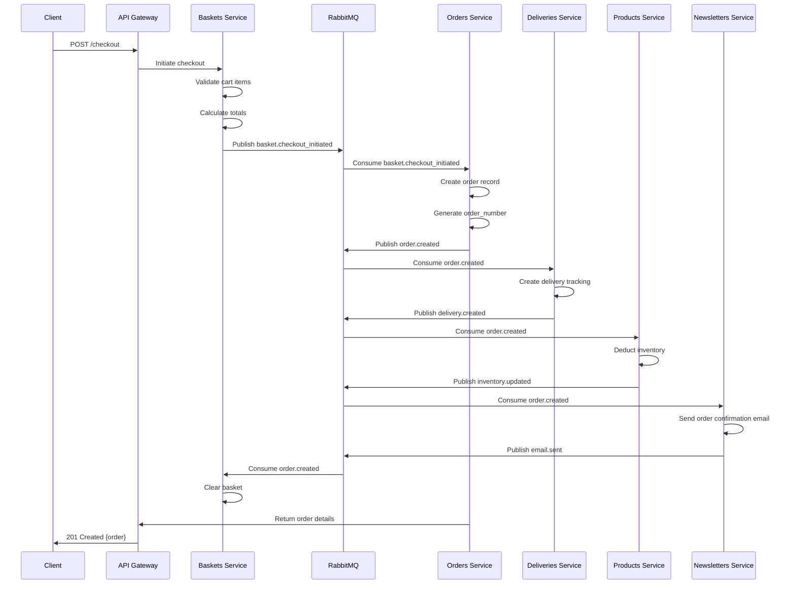
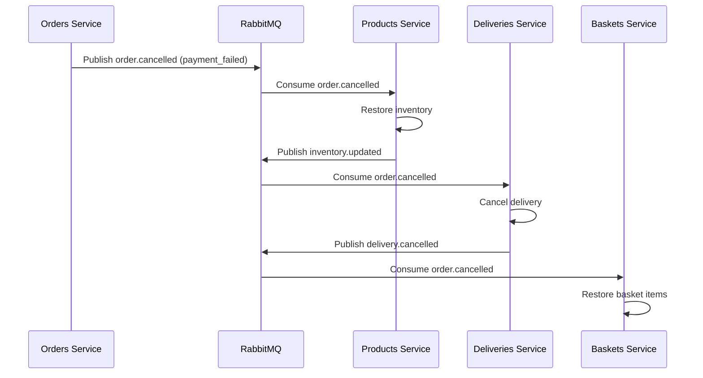
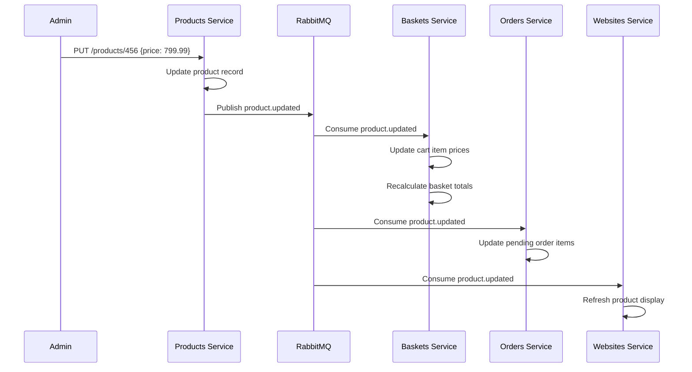
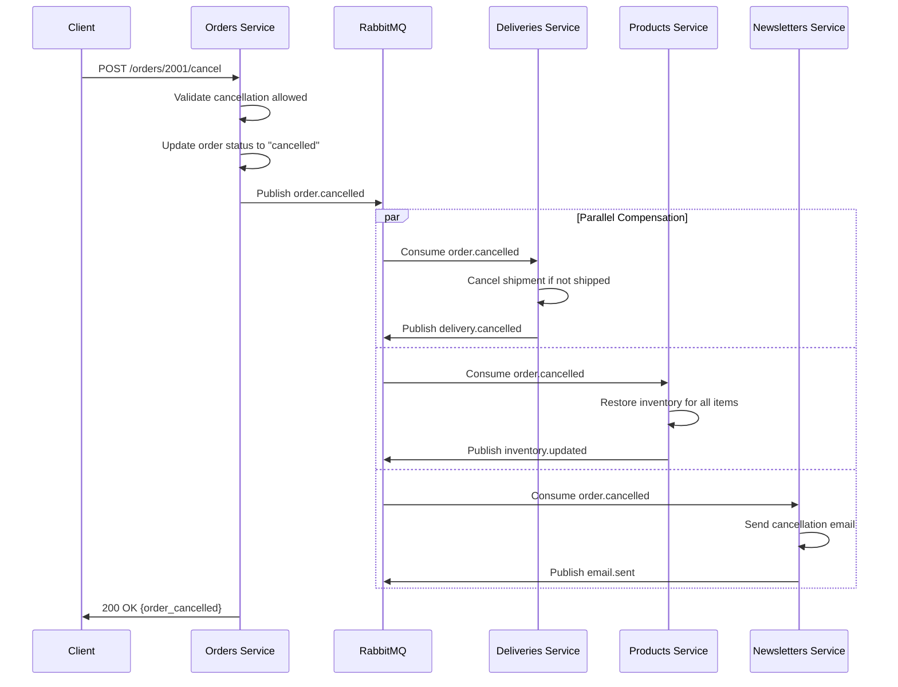
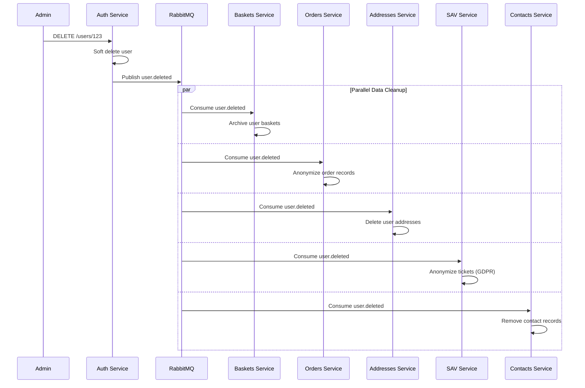
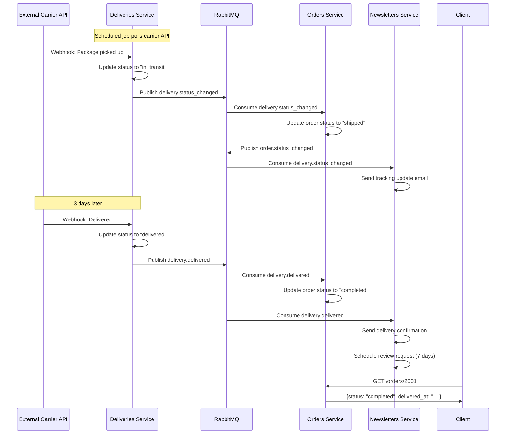

# Database Relationships and Inter-Service Communication

## Table of Contents
- [Overview](#overview)
- [Communication Architecture](#communication-architecture)
- [RabbitMQ Event Catalog](#rabbitmq-event-catalog)
- [Cross-Service Workflows](#cross-service-workflows)
- [Data Consistency Patterns](#data-consistency-patterns)
- [Error Handling and Retry Logic](#error-handling-and-retry-logic)
- [Event Payload Specifications](#event-payload-specifications)

## Overview

This document details how services communicate and maintain data consistency in a fully asynchronous, event-driven architecture. All cross-service communication occurs through RabbitMQ message broker, implementing eventual consistency and saga patterns.

**Key Principles:**
- No direct database connections between services
- All communication via RabbitMQ topic exchanges
- Idempotent message handlers
- Saga pattern for distributed transactions
- Event sourcing for audit trail

## Communication Architecture

### RabbitMQ Topology

```mermaid
graph TB
    subgraph "API Gateway"
        AG[API Gateway<br/>Port 8100]
    end

    subgraph "RabbitMQ Broker"
        EX[microservices_exchange<br/>Type: topic]

        Q_AUTH[auth.queue]
        Q_ADDR[addresses.queue]
        Q_PROD[products.queue]
        Q_BASK[baskets.queue]
        Q_ORD[orders.queue]
        Q_DEL[deliveries.queue]
        Q_NEWS[newsletters.queue]
        Q_SAV[sav.queue]
        Q_CONT[contacts.queue]
        Q_QUES[questions.queue]
        Q_WEB[websites.queue]
    end

    subgraph "Microservices"
        AUTH[auth-service]
        ADDR[addresses-service]
        PROD[products-service]
        BASK[baskets-service]
        ORD[orders-service]
        DEL[deliveries-service]
        NEWS[newsletters-service]
        SAV[sav-service]
        CONT[contacts-service]
        QUES[questions-service]
        WEB[websites-service]
    end

    AG -->|HTTP Request| EX

    EX -->|Routing Key| Q_AUTH
    EX -->|Routing Key| Q_ADDR
    EX -->|Routing Key| Q_PROD
    EX -->|Routing Key| Q_BASK
    EX -->|Routing Key| Q_ORD
    EX -->|Routing Key| Q_DEL
    EX -->|Routing Key| Q_NEWS
    EX -->|Routing Key| Q_SAV
    EX -->|Routing Key| Q_CONT
    EX -->|Routing Key| Q_QUES
    EX -->|Routing Key| Q_WEB

    Q_AUTH -->|Consume| AUTH
    Q_ADDR -->|Consume| ADDR
    Q_PROD -->|Consume| PROD
    Q_BASK -->|Consume| BASK
    Q_ORD -->|Consume| ORD
    Q_DEL -->|Consume| DEL
    Q_NEWS -->|Consume| NEWS
    Q_SAV -->|Consume| SAV
    Q_CONT -->|Consume| CONT
    Q_QUES -->|Consume| QUES
    Q_WEB -->|Consume| WEB

    AUTH -.->|Publish Events| EX
    ADDR -.->|Publish Events| EX
    PROD -.->|Publish Events| EX
    BASK -.->|Publish Events| EX
    ORD -.->|Publish Events| EX
    DEL -.->|Publish Events| EX
    NEWS -.->|Publish Events| EX
    SAV -.->|Publish Events| EX
    CONT -.->|Publish Events| EX
    QUES -.->|Publish Events| EX
    WEB -.->|Publish Events| EX
```



### Exchange Configuration
```
Name: microservices_exchange
Type: topic
Durable: true
Auto-delete: false
Internal: false
```

### Routing Key Pattern
```
<service>.<entity>.<action>

Examples:
- auth.user.created
- products.product.updated
- orders.order.created
- deliveries.delivery.shipped
```

### Queue Configuration
Each service has a dedicated queue:
```
Durable: true
Auto-delete: false
Exclusive: false
Prefetch: 10 messages
Message TTL: 3600 seconds (1 hour)
Max Retry: 3 attempts
```

## RabbitMQ Event Catalog

### Auth Service Events

#### user.created
**Publisher:** auth-service
**Subscribers:** All services (for local user cache)
**Routing Key:** `auth.user.created`

**Payload:**
```json
{
  "event_id": "uuid-v4",
  "event_type": "user.created",
  "timestamp": "2025-10-03T10:30:00Z",
  "version": "1.0",
  "data": {
    "user_id": 123,
    "email": "user@example.com",
    "name": "John Doe",
    "created_at": "2025-10-03T10:30:00Z"
  },
  "metadata": {
    "correlation_id": "request-uuid",
    "causation_id": "causing-event-uuid",
    "user_agent": "Mozilla/5.0...",
    "ip_address": "192.168.1.1"
  }
}
```

**Subscribers:**
- baskets-service: Create empty basket for new user
- addresses-service: Initialize address book
- orders-service: Enable order placement
- sav-service: Enable ticket creation
- contacts-service: Add to contact management

---

#### user.updated
**Publisher:** auth-service
**Subscribers:** All services with user cache
**Routing Key:** `auth.user.updated`

**Payload:**
```json
{
  "event_id": "uuid-v4",
  "event_type": "user.updated",
  "timestamp": "2025-10-03T10:35:00Z",
  "version": "1.0",
  "data": {
    "user_id": 123,
    "updated_fields": {
      "name": "John Smith",
      "email": "john.smith@example.com"
    },
    "updated_at": "2025-10-03T10:35:00Z"
  },
  "metadata": {
    "correlation_id": "request-uuid",
    "causation_id": "causing-event-uuid"
  }
}
```

**Subscribers:**
- All services: Invalidate cached user data
- newsletters-service: Update subscriber info
- contacts-service: Sync contact records

---

#### user.deleted
**Publisher:** auth-service
**Subscribers:** All services
**Routing Key:** `auth.user.deleted`

**Payload:**
```json
{
  "event_id": "uuid-v4",
  "event_type": "user.deleted",
  "timestamp": "2025-10-03T11:00:00Z",
  "version": "1.0",
  "data": {
    "user_id": 123,
    "deleted_at": "2025-10-03T11:00:00Z",
    "soft_delete": true
  },
  "metadata": {
    "correlation_id": "request-uuid"
  }
}
```

**Subscribers:**
- baskets-service: Archive user baskets
- orders-service: Anonymize order history
- addresses-service: Remove addresses
- sav-service: Anonymize support tickets

---

#### role.assigned
**Publisher:** auth-service
**Subscribers:** Services with role-based access
**Routing Key:** `auth.role.assigned`

**Payload:**
```json
{
  "event_id": "uuid-v4",
  "event_type": "role.assigned",
  "timestamp": "2025-10-03T10:40:00Z",
  "version": "1.0",
  "data": {
    "user_id": 123,
    "role_id": 5,
    "role_name": "customer_service_agent",
    "permissions": ["tickets.view", "tickets.update"]
  }
}
```

**Subscribers:**
- sav-service: Update agent assignment pool
- contacts-service: Grant contact access

---

### Products Service Events

#### product.created
**Publisher:** products-service
**Subscribers:** baskets-service, orders-service, websites-service
**Routing Key:** `products.product.created`

**Payload:**
```json
{
  "event_id": "uuid-v4",
  "event_type": "product.created",
  "timestamp": "2025-10-03T09:00:00Z",
  "version": "1.0",
  "data": {
    "product_id": 456,
    "name": "Laptop Pro 15",
    "ref": "LAP-PRO-15-001",
    "price_ht": 999.99,
    "stock": 50,
    "brand_id": 10,
    "vat_rate": 20.0,
    "created_at": "2025-10-03T09:00:00Z"
  }
}
```

**Subscribers:**
- baskets-service: Enable product addition to carts
- orders-service: Enable product ordering
- websites-service: Display product on site

---

#### product.updated
**Publisher:** products-service
**Subscribers:** baskets-service, orders-service
**Routing Key:** `products.product.updated`

**Payload:**
```json
{
  "event_id": "uuid-v4",
  "event_type": "product.updated",
  "timestamp": "2025-10-03T09:30:00Z",
  "version": "1.0",
  "data": {
    "product_id": 456,
    "updated_fields": {
      "price_ht": 899.99,
      "stock": 45
    },
    "updated_at": "2025-10-03T09:30:00Z"
  }
}
```

**Subscribers:**
- baskets-service: Update cart item prices
- orders-service: Adjust pending order calculations

---

#### product.deleted
**Publisher:** products-service
**Subscribers:** baskets-service, orders-service
**Routing Key:** `products.product.deleted`

**Payload:**
```json
{
  "event_id": "uuid-v4",
  "event_type": "product.deleted",
  "timestamp": "2025-10-03T10:00:00Z",
  "version": "1.0",
  "data": {
    "product_id": 456,
    "deleted_at": "2025-10-03T10:00:00Z",
    "soft_delete": true
  }
}
```

**Subscribers:**
- baskets-service: Remove from active carts, mark unavailable
- orders-service: Mark product as discontinued

---

#### inventory.updated
**Publisher:** products-service
**Subscribers:** baskets-service, orders-service
**Routing Key:** `products.inventory.updated`

**Payload:**
```json
{
  "event_id": "uuid-v4",
  "event_type": "inventory.updated",
  "timestamp": "2025-10-03T12:00:00Z",
  "version": "1.0",
  "data": {
    "product_id": 456,
    "previous_stock": 50,
    "new_stock": 35,
    "change": -15,
    "reason": "order_placed"
  }
}
```

**Subscribers:**
- baskets-service: Validate cart item availability
- orders-service: Update order fulfillment status

---

### Baskets Service Events

#### basket.created
**Publisher:** baskets-service
**Subscribers:** orders-service (for tracking)
**Routing Key:** `baskets.basket.created`

**Payload:**
```json
{
  "event_id": "uuid-v4",
  "event_type": "basket.created",
  "timestamp": "2025-10-03T11:00:00Z",
  "version": "1.0",
  "data": {
    "basket_id": 789,
    "user_id": 123,
    "amount": 0.00,
    "created_at": "2025-10-03T11:00:00Z"
  }
}
```

---

#### basket.item_added
**Publisher:** baskets-service
**Subscribers:** products-service (for analytics)
**Routing Key:** `baskets.item.added`

**Payload:**
```json
{
  "event_id": "uuid-v4",
  "event_type": "basket.item_added",
  "timestamp": "2025-10-03T11:05:00Z",
  "version": "1.0",
  "data": {
    "basket_id": 789,
    "basket_item_id": 1001,
    "product_id": 456,
    "quantity": 2,
    "unit_price": 899.99,
    "total": 1799.98
  }
}
```

**Subscribers:**
- products-service: Track product popularity, reserve inventory

---

#### basket.item_removed
**Publisher:** baskets-service
**Subscribers:** products-service
**Routing Key:** `baskets.item.removed`

**Payload:**
```json
{
  "event_id": "uuid-v4",
  "event_type": "basket.item_removed",
  "timestamp": "2025-10-03T11:10:00Z",
  "version": "1.0",
  "data": {
    "basket_id": 789,
    "basket_item_id": 1001,
    "product_id": 456,
    "quantity": 2
  }
}
```

**Subscribers:**
- products-service: Release reserved inventory

---

#### basket.checkout_initiated
**Publisher:** baskets-service
**Subscribers:** orders-service (critical)
**Routing Key:** `baskets.checkout.initiated`

**Payload:**
```json
{
  "event_id": "uuid-v4",
  "event_type": "basket.checkout_initiated",
  "timestamp": "2025-10-03T11:20:00Z",
  "version": "1.0",
  "data": {
    "basket_id": 789,
    "user_id": 123,
    "items": [
      {
        "product_id": 456,
        "quantity": 2,
        "unit_price_ht": 899.99,
        "vat_rate": 20.0
      }
    ],
    "promo_codes": ["WELCOME10"],
    "total_amount_ht": 1799.98,
    "total_discount": 179.99,
    "vat_amount": 359.99,
    "total_amount_ttc": 1979.98,
    "billing_address_id": 50,
    "shipping_address_id": 51
  },
  "metadata": {
    "correlation_id": "checkout-uuid-v4",
    "requires_response": true,
    "response_queue": "baskets.checkout.response"
  }
}
```

**Subscribers:**
- orders-service: Create order from basket

---

#### basket.abandoned
**Publisher:** baskets-service (scheduled job)
**Subscribers:** newsletters-service (for remarketing)
**Routing Key:** `baskets.basket.abandoned`

**Payload:**
```json
{
  "event_id": "uuid-v4",
  "event_type": "basket.abandoned",
  "timestamp": "2025-10-03T13:00:00Z",
  "version": "1.0",
  "data": {
    "basket_id": 789,
    "user_id": 123,
    "total_amount": 1979.98,
    "item_count": 2,
    "last_updated": "2025-10-02T11:20:00Z",
    "abandoned_duration_hours": 24
  }
}
```

**Subscribers:**
- newsletters-service: Trigger cart abandonment email campaign

---

### Orders Service Events

#### order.created
**Publisher:** orders-service
**Subscribers:** deliveries-service, products-service, newsletters-service, baskets-service
**Routing Key:** `orders.order.created`

**Payload:**
```json
{
  "event_id": "uuid-v4",
  "event_type": "order.created",
  "timestamp": "2025-10-03T11:25:00Z",
  "version": "1.0",
  "data": {
    "order_id": 2001,
    "order_number": "ORD-2025-10-03-2001",
    "user_id": 123,
    "status_id": 1,
    "status_name": "pending",
    "items": [
      {
        "order_item_id": 3001,
        "product_id": 456,
        "quantity": 2,
        "unit_price_ht": 899.99,
        "vat_rate": 20.0,
        "total_ht": 1799.98,
        "vat_amount": 359.99,
        "total_ttc": 2159.97
      }
    ],
    "total_amount_ht": 1799.98,
    "total_amount_ttc": 2159.97,
    "total_discount": 179.99,
    "vat_amount": 359.99,
    "billing_address_id": 50,
    "shipping_address_id": 51,
    "created_at": "2025-10-03T11:25:00Z"
  },
  "metadata": {
    "correlation_id": "checkout-uuid-v4",
    "causation_id": "basket.checkout_initiated-event-id"
  }
}
```

**Subscribers:**
- deliveries-service: Create delivery tracking
- products-service: Deduct stock from inventory
- newsletters-service: Send order confirmation email
- baskets-service: Clear basket after successful order

---

#### order.status_changed
**Publisher:** orders-service
**Subscribers:** deliveries-service, newsletters-service, sav-service
**Routing Key:** `orders.order.status_changed`

**Payload:**
```json
{
  "event_id": "uuid-v4",
  "event_type": "order.status_changed",
  "timestamp": "2025-10-03T12:00:00Z",
  "version": "1.0",
  "data": {
    "order_id": 2001,
    "order_number": "ORD-2025-10-03-2001",
    "user_id": 123,
    "previous_status": "pending",
    "new_status": "confirmed",
    "changed_at": "2025-10-03T12:00:00Z"
  }
}
```

**Subscribers:**
- deliveries-service: Update delivery status
- newsletters-service: Send status update email
- sav-service: Link to related support tickets

---

#### order.cancelled
**Publisher:** orders-service
**Subscribers:** deliveries-service, products-service, newsletters-service
**Routing Key:** `orders.order.cancelled`

**Payload:**
```json
{
  "event_id": "uuid-v4",
  "event_type": "order.cancelled",
  "timestamp": "2025-10-03T13:00:00Z",
  "version": "1.0",
  "data": {
    "order_id": 2001,
    "order_number": "ORD-2025-10-03-2001",
    "user_id": 123,
    "items": [
      {
        "product_id": 456,
        "quantity": 2
      }
    ],
    "cancellation_reason": "customer_request",
    "cancelled_at": "2025-10-03T13:00:00Z"
  }
}
```

**Subscribers:**
- deliveries-service: Cancel shipment
- products-service: Restore inventory
- newsletters-service: Send cancellation confirmation

---

### Deliveries Service Events

#### delivery.created
**Publisher:** deliveries-service
**Subscribers:** orders-service
**Routing Key:** `deliveries.delivery.created`

**Payload:**
```json
{
  "event_id": "uuid-v4",
  "event_type": "delivery.created",
  "timestamp": "2025-10-03T11:30:00Z",
  "version": "1.0",
  "data": {
    "delivery_id": 5001,
    "tracking_number": "TRACK-2025-10-03-5001",
    "order_id": 2001,
    "status_id": 1,
    "status_name": "pending",
    "delivery_method": "standard",
    "estimated_delivery_date": "2025-10-10T00:00:00Z",
    "shipping_cost": 9.99
  }
}
```

**Subscribers:**
- orders-service: Update order with delivery info

---

#### delivery.shipped
**Publisher:** deliveries-service
**Subscribers:** orders-service, newsletters-service
**Routing Key:** `deliveries.delivery.shipped`

**Payload:**
```json
{
  "event_id": "uuid-v4",
  "event_type": "delivery.shipped",
  "timestamp": "2025-10-04T08:00:00Z",
  "version": "1.0",
  "data": {
    "delivery_id": 5001,
    "tracking_number": "TRACK-2025-10-03-5001",
    "order_id": 2001,
    "carrier_name": "DHL Express",
    "carrier_tracking_number": "DHL123456789",
    "shipped_at": "2025-10-04T08:00:00Z",
    "estimated_delivery_date": "2025-10-08T00:00:00Z"
  }
}
```

**Subscribers:**
- orders-service: Update order status to "shipped"
- newsletters-service: Send shipment notification email

---

#### delivery.delivered
**Publisher:** deliveries-service
**Subscribers:** orders-service, newsletters-service
**Routing Key:** `deliveries.delivery.delivered`

**Payload:**
```json
{
  "event_id": "uuid-v4",
  "event_type": "delivery.delivered",
  "timestamp": "2025-10-07T14:30:00Z",
  "version": "1.0",
  "data": {
    "delivery_id": 5001,
    "tracking_number": "TRACK-2025-10-03-5001",
    "order_id": 2001,
    "actual_delivery_date": "2025-10-07T14:30:00Z",
    "recipient_name": "John Doe",
    "delivery_notes": "Left at front door"
  }
}
```

**Subscribers:**
- orders-service: Update order status to "completed"
- newsletters-service: Send delivery confirmation, request review

---

### SAV Service Events

#### ticket.created
**Publisher:** sav-service
**Subscribers:** newsletters-service
**Routing Key:** `sav.ticket.created`

**Payload:**
```json
{
  "event_id": "uuid-v4",
  "event_type": "ticket.created",
  "timestamp": "2025-10-03T15:00:00Z",
  "version": "1.0",
  "data": {
    "ticket_id": 7001,
    "ticket_number": "TIC-2025-10-03-7001",
    "user_id": 123,
    "subject": "Product defect",
    "priority": "high",
    "status": "open",
    "order_id": 2001,
    "category": "product_issue"
  }
}
```

**Subscribers:**
- newsletters-service: Send ticket confirmation email

---

#### ticket.assigned
**Publisher:** sav-service
**Subscribers:** auth-service (for agent notification)
**Routing Key:** `sav.ticket.assigned`

**Payload:**
```json
{
  "event_id": "uuid-v4",
  "event_type": "ticket.assigned",
  "timestamp": "2025-10-03T15:10:00Z",
  "version": "1.0",
  "data": {
    "ticket_id": 7001,
    "ticket_number": "TIC-2025-10-03-7001",
    "assigned_to": 999,
    "assigned_by": 888,
    "assigned_at": "2025-10-03T15:10:00Z"
  }
}
```

---

#### ticket.resolved
**Publisher:** sav-service
**Subscribers:** newsletters-service
**Routing Key:** `sav.ticket.resolved`

**Payload:**
```json
{
  "event_id": "uuid-v4",
  "event_type": "ticket.resolved",
  "timestamp": "2025-10-04T10:00:00Z",
  "version": "1.0",
  "data": {
    "ticket_id": 7001,
    "ticket_number": "TIC-2025-10-03-7001",
    "user_id": 123,
    "resolved_at": "2025-10-04T10:00:00Z",
    "resolution_time_hours": 19
  }
}
```

**Subscribers:**
- newsletters-service: Send resolution notification

---

### Newsletters Service Events

#### email.sent
**Publisher:** newsletters-service
**Subscribers:** contacts-service (for tracking)
**Routing Key:** `newsletters.email.sent`

**Payload:**
```json
{
  "event_id": "uuid-v4",
  "event_type": "email.sent",
  "timestamp": "2025-10-03T12:00:00Z",
  "version": "1.0",
  "data": {
    "email_id": "uuid-v4",
    "recipient": "user@example.com",
    "user_id": 123,
    "template": "order_confirmation",
    "subject": "Your order has been confirmed",
    "campaign_id": 100,
    "sent_at": "2025-10-03T12:00:00Z"
  }
}
```

---

#### campaign.completed
**Publisher:** newsletters-service
**Subscribers:** contacts-service
**Routing Key:** `newsletters.campaign.completed`

**Payload:**
```json
{
  "event_id": "uuid-v4",
  "event_type": "campaign.completed",
  "timestamp": "2025-10-03T16:00:00Z",
  "version": "1.0",
  "data": {
    "campaign_id": 100,
    "campaign_name": "October Promotion",
    "emails_sent": 5000,
    "completed_at": "2025-10-03T16:00:00Z"
  }
}
```

---

## Cross-Service Workflows

### 1. Checkout Workflow (Basket to Order)



**Event Flow:**
1. `basket.checkout_initiated` -> orders-service
2. `order.created` -> deliveries-service, products-service, newsletters-service, baskets-service
3. `delivery.created` -> orders-service (update)
4. `inventory.updated` -> baskets-service, orders-service (validation)
5. `email.sent` -> contacts-service (tracking)

**Rollback Scenario (Payment Failed):**


---

### 2. Product Update Propagation



---

### 3. Order Cancellation Saga



---

### 4. User Deletion Cascade



---

### 5. Delivery Tracking Workflow



---

## Data Consistency Patterns

### Eventual Consistency

Services achieve consistency through asynchronous event processing:

**Timeline:**
```
T0: Order created in orders-service
T1: order.created event published to RabbitMQ
T2: Deliveries-service consumes event, creates delivery (T2 = T1 + 50ms)
T3: Products-service consumes event, deducts inventory (T3 = T1 + 100ms)
T4: Newsletters-service sends email (T4 = T1 + 500ms)
```

**Consistency Window:** Typically < 1 second for critical operations

---

### Idempotency

All message handlers must be idempotent using these strategies:

#### 1. Event ID Deduplication
```php
public function handle(array $message): void
{
    $eventId = $message['event_id'];

    // Check if already processed
    if (ProcessedEvent::where('event_id', $eventId)->exists()) {
        Log::info("Event {$eventId} already processed, skipping");
        return;
    }

    DB::transaction(function () use ($message, $eventId) {
        // Process message
        $this->processOrder($message['data']);

        // Mark as processed
        ProcessedEvent::create(['event_id' => $eventId]);
    });
}
```

#### 2. Natural Idempotency
```php
public function updateUserCache(array $userData): void
{
    // Upsert is naturally idempotent
    User::updateOrCreate(
        ['id' => $userData['user_id']],
        [
            'email' => $userData['email'],
            'name' => $userData['name']
        ]
    );
}
```

#### 3. Version-Based Idempotency
```php
public function updateInventory(int $productId, int $quantity, string $version): void
{
    $product = Product::lockForUpdate()->find($productId);

    if ($product->version === $version) {
        $product->stock -= $quantity;
        $product->version = Str::uuid(); // New version
        $product->save();
    }
    // If versions don't match, update already applied
}
```

---

### Saga Pattern Implementation

Complex workflows use saga pattern with compensating transactions:

**Order Checkout Saga:**
```php
class CheckoutSaga
{
    private array $compensations = [];

    public function execute(array $basketData): Order
    {
        try {
            // Step 1: Create order
            $order = $this->createOrder($basketData);
            $this->compensations[] = fn() => $this->cancelOrder($order);

            // Step 2: Reserve inventory
            $this->reserveInventory($order->items);
            $this->compensations[] = fn() => $this->releaseInventory($order->items);

            // Step 3: Create delivery
            $delivery = $this->createDelivery($order);
            $this->compensations[] = fn() => $this->cancelDelivery($delivery);

            // Step 4: Process payment (external service)
            $payment = $this->processPayment($order);
            $this->compensations[] = fn() => $this->refundPayment($payment);

            // Success - commit all
            $this->clearCompensations();
            return $order;

        } catch (Exception $e) {
            // Failure - run compensations in reverse order
            $this->compensate();
            throw $e;
        }
    }

    private function compensate(): void
    {
        foreach (array_reverse($this->compensations) as $compensation) {
            try {
                $compensation();
            } catch (Exception $e) {
                Log::error("Compensation failed: " . $e->getMessage());
            }
        }
    }
}
```

---

### Data Synchronization Strategies

#### 1. User Cache Synchronization
Services maintain local user cache for performance:

```php
// Auth service publishes user events
Event::dispatch(new UserCreated($user));
Event::dispatch(new UserUpdated($user));
Event::dispatch(new UserDeleted($user));

// Other services synchronize local cache
class SyncUserCacheHandler
{
    public function handleUserCreated(array $userData): void
    {
        User::create([
            'id' => $userData['user_id'],
            'email' => $userData['email'],
            'name' => $userData['name']
        ]);
    }

    public function handleUserUpdated(array $userData): void
    {
        User::where('id', $userData['user_id'])
            ->update($userData['updated_fields']);
    }

    public function handleUserDeleted(array $userData): void
    {
        User::where('id', $userData['user_id'])->delete();
    }
}
```

#### 2. Product Data Synchronization
Baskets and orders cache product data:

```php
class SyncProductDataHandler
{
    public function handleProductUpdated(array $productData): void
    {
        // Update basket items with new price
        BasketItem::where('product_id', $productData['product_id'])
            ->each(function ($item) use ($productData) {
                $item->update([
                    'unit_price' => $productData['updated_fields']['price_ht'] ?? $item->unit_price
                ]);
            });

        // Recalculate basket totals
        $this->recalculateBasketTotals($item->basket_id);
    }
}
```

---

## Error Handling and Retry Logic

### Retry Configuration

```yaml
retry_policy:
  max_attempts: 3
  backoff_strategy: exponential
  initial_delay: 1s
  max_delay: 60s
  multiplier: 2

dead_letter_queue:
  enabled: true
  queue: dead_letter_queue
  ttl: 7 days
```

### Retry Logic Implementation

```php
class RabbitMQConsumer
{
    private int $maxRetries = 3;

    public function consume(AMQPMessage $message): void
    {
        try {
            $data = json_decode($message->getBody(), true);
            $retryCount = $message->get('application_headers')['x-retry-count'] ?? 0;

            // Process message
            $this->handler->handle($data);

            // Acknowledge success
            $message->ack();

        } catch (Exception $e) {
            $retryCount++;

            if ($retryCount < $this->maxRetries) {
                // Requeue with exponential backoff
                $delay = pow(2, $retryCount) * 1000; // milliseconds
                $this->requeueWithDelay($message, $delay, $retryCount);
            } else {
                // Max retries exceeded, send to dead letter queue
                $this->sendToDeadLetterQueue($message, $e);
                $message->ack(); // Remove from original queue
            }
        }
    }

    private function requeueWithDelay(
        AMQPMessage $message,
        int $delayMs,
        int $retryCount
    ): void {
        $headers = new AMQPTable([
            'x-retry-count' => $retryCount,
            'x-delay' => $delayMs
        ]);

        $message->set('application_headers', $headers);

        $this->channel->basic_publish(
            $message,
            'delayed_exchange',
            $message->getRoutingKey()
        );

        $message->ack(); // Remove from original queue
    }

    private function sendToDeadLetterQueue(
        AMQPMessage $message,
        Exception $error
    ): void {
        $data = json_decode($message->getBody(), true);

        FailedMessage::create([
            'message_id' => $data['event_id'],
            'queue' => $message->getRoutingKey(),
            'payload' => $message->getBody(),
            'error_message' => $error->getMessage(),
            'error_trace' => $error->getTraceAsString(),
            'retry_count' => $this->maxRetries,
            'failed_at' => now()
        ]);

        Log::error("Message failed after {$this->maxRetries} retries", [
            'event_id' => $data['event_id'],
            'error' => $error->getMessage()
        ]);
    }
}
```

### Error Categories and Handling

| Error Type | Retry Strategy | Dead Letter | Example |
|------------|----------------|-------------|---------|
| Transient Network | Yes (exponential backoff) | After 3 retries | Database connection timeout |
| Invalid Payload | No | Immediate | Malformed JSON |
| Business Logic | No | Immediate | Product not found |
| External Service | Yes (with circuit breaker) | After 5 retries | Payment gateway timeout |
| Concurrency | Yes (with jitter) | After 3 retries | Optimistic locking conflict |

---

### Circuit Breaker Pattern

```php
class CircuitBreaker
{
    private int $failureThreshold = 5;
    private int $timeout = 60; // seconds
    private string $state = 'closed'; // closed, open, half_open

    public function call(callable $operation)
    {
        if ($this->state === 'open') {
            if ($this->shouldAttemptReset()) {
                $this->state = 'half_open';
            } else {
                throw new CircuitBreakerOpenException();
            }
        }

        try {
            $result = $operation();
            $this->onSuccess();
            return $result;
        } catch (Exception $e) {
            $this->onFailure();
            throw $e;
        }
    }

    private function onSuccess(): void
    {
        if ($this->state === 'half_open') {
            $this->state = 'closed';
            $this->resetFailureCount();
        }
    }

    private function onFailure(): void
    {
        $this->incrementFailureCount();

        if ($this->getFailureCount() >= $this->failureThreshold) {
            $this->state = 'open';
            $this->setOpenTimestamp();
        }
    }
}
```

---

## Event Payload Specifications

### Standard Event Schema

All events follow this structure:

```json
{
  "event_id": "uuid-v4",
  "event_type": "service.entity.action",
  "timestamp": "ISO 8601 datetime",
  "version": "semantic version (e.g., 1.0, 2.1)",
  "data": {
    "entity_specific_fields": "..."
  },
  "metadata": {
    "correlation_id": "uuid for request tracing",
    "causation_id": "uuid of event that caused this event",
    "user_id": "user who triggered action (optional)",
    "ip_address": "client IP (optional)",
    "user_agent": "client user agent (optional)"
  }
}
```

### Event Versioning

When event schemas evolve:

**Version 1.0:**
```json
{
  "event_type": "products.product.updated",
  "version": "1.0",
  "data": {
    "product_id": 456,
    "price_ht": 899.99
  }
}
```

**Version 2.0 (adds currency):**
```json
{
  "event_type": "products.product.updated",
  "version": "2.0",
  "data": {
    "product_id": 456,
    "price_ht": 899.99,
    "currency": "EUR"
  }
}
```

**Consumers must handle multiple versions:**
```php
public function handle(array $event): void
{
    $version = $event['version'];

    match($version) {
        '1.0' => $this->handleV1($event),
        '2.0' => $this->handleV2($event),
        default => throw new UnsupportedVersionException($version)
    };
}
```

---

## Monitoring and Observability

### Message Tracking

Messages are tracked in `messages_broker.messages` table:

```sql
SELECT
    message_id,
    type,
    queue,
    status,
    retry_count,
    created_at,
    consumed_at,
    TIMESTAMPDIFF(SECOND, published_at, consumed_at) as processing_time_seconds
FROM messages
WHERE DATE(created_at) = CURDATE()
ORDER BY created_at DESC;
```

### Key Metrics

```yaml
message_throughput:
  metric: messages_per_second
  alert_threshold: < 100 msg/s

processing_latency:
  metric: time_from_publish_to_consume
  alert_threshold: > 5 seconds

retry_rate:
  metric: (retried_messages / total_messages) * 100
  alert_threshold: > 5%

dead_letter_rate:
  metric: (dead_letter_messages / total_messages) * 100
  alert_threshold: > 1%

queue_depth:
  metric: messages_in_queue
  alert_threshold: > 1000 messages
```

### Distributed Tracing

Correlation IDs enable request tracing across services:

```php
// API Gateway generates correlation_id
$correlationId = Str::uuid();

// Passed in event metadata
$event = [
    'event_id' => Str::uuid(),
    'metadata' => [
        'correlation_id' => $correlationId
    ]
];

// All subsequent events maintain correlation_id
// Enables full request trace in logs
Log::info("Processing order", [
    'correlation_id' => $correlationId,
    'order_id' => $order->id
]);
```

---

## Best Practices

### Event Design

1. **Events are facts, not commands:** Name events in past tense (e.g., `order.created`, not `create.order`)
2. **Include all necessary data:** Avoid requiring consumers to make additional queries
3. **Keep events immutable:** Never modify published events
4. **Version events:** Support multiple versions during migration periods

### Consumer Design

1. **Idempotent handlers:** All handlers must safely handle duplicate messages
2. **Fast processing:** Aim for < 100ms processing time per message
3. **Graceful degradation:** Services continue operating if event processing fails
4. **Error isolation:** Failed message handling doesn't crash consumer

### Performance

1. **Batch processing:** Group related operations when possible
2. **Connection pooling:** Reuse RabbitMQ connections
3. **Prefetch optimization:** Tune prefetch count based on processing speed
4. **Message compression:** Compress large payloads (> 10KB)

### Security

1. **Encrypt sensitive data:** PII in messages should be encrypted
2. **Validate payloads:** Schema validation before processing
3. **Authentication:** Verify message source authenticity
4. **Audit trail:** Log all message processing for compliance
