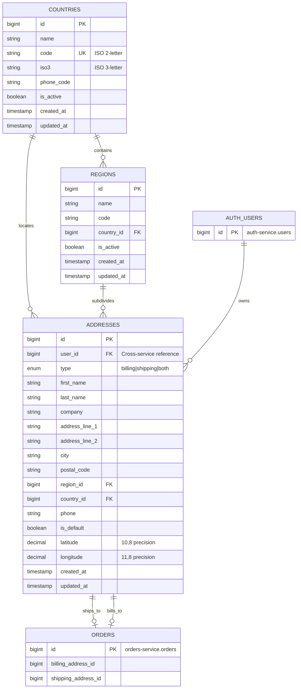

# Addresses Service Database

## Table of Contents
- [Overview](#overview)
- [Database Information](#database-information)
- [Entity Relationship Diagram](#entity-relationship-diagram)
- [Table Specifications](#table-specifications)
- [Business Rules](#business-rules)
- [RabbitMQ Events](#rabbitmq-events)
- [Cross-Service References](#cross-service-references)
- [Indexing Strategy](#indexing-strategy)
- [Query Patterns](#query-patterns)
- [Data Integrity](#data-integrity)

## Overview

The addresses-service manages geographic data and user addresses with support for multiple address types (billing, shipping, or both). It provides a hierarchical structure of countries, regions, and addresses with geolocation capabilities.

**Purpose:** Centralized address management and geographic validation for the e-commerce platform

**Key Capabilities:**
- Country and region (state/province) management with ISO standards
- Multi-type address support (billing, shipping, both)
- Default address designation per user
- Geolocation storage (latitude/longitude)
- Phone number association with addresses
- Cross-service address referencing for orders and deliveries

## Database Information

**Database Name:** addresses_service
**External Port:** 3333 (development access)
**Character Set:** utf8mb4
**Collation:** utf8mb4_unicode_ci
**Engine:** InnoDB

**Connection Details:**
```env
DB_HOST=addresses-mysql
DB_PORT=3306
DB_DATABASE=addresses_service
DB_USERNAME=root
DB_PASSWORD=rootpass
```

**External Access:**
```bash
mysql -h 127.0.0.1 -P 3333 -u root -p addresses_service
# Password: rootpass
```

## Entity Relationship Diagram



## Table Specifications

### 1. countries

Geographic country definitions following ISO 3166 standards.

**Columns:**

| Column | Type | Constraints | Description |
|--------|------|-------------|-------------|
| id | BIGINT UNSIGNED | PRIMARY KEY, AUTO_INCREMENT | Unique country identifier |
| name | VARCHAR(255) | NOT NULL | Country full name |
| code | VARCHAR(2) | NOT NULL, UNIQUE | ISO 3166-1 alpha-2 code |
| iso3 | VARCHAR(3) | NULL | ISO 3166-1 alpha-3 code |
| phone_code | VARCHAR(10) | NULL | International dialing code |
| is_active | BOOLEAN | DEFAULT TRUE | Country availability status |
| created_at | TIMESTAMP | NULL | Record creation timestamp |
| updated_at | TIMESTAMP | NULL | Record modification timestamp |

**Indexes:**
- PRIMARY KEY (id)
- UNIQUE KEY (code)
- INDEX (code, is_active)

**Sample Data:**
```sql
INSERT INTO countries (name, code, iso3, phone_code, is_active) VALUES
('United States', 'US', 'USA', '+1', true),
('Canada', 'CA', 'CAN', '+1', true),
('United Kingdom', 'GB', 'GBR', '+44', true),
('France', 'FR', 'FRA', '+33', true);
```

---

### 2. regions

States, provinces, or administrative divisions within countries.

**Columns:**

| Column | Type | Constraints | Description |
|--------|------|-------------|-------------|
| id | BIGINT UNSIGNED | PRIMARY KEY, AUTO_INCREMENT | Unique region identifier |
| name | VARCHAR(255) | NOT NULL | Region full name |
| code | VARCHAR(255) | NULL | Region abbreviation/code |
| country_id | BIGINT UNSIGNED | FOREIGN KEY, NOT NULL | Reference to countries.id |
| is_active | BOOLEAN | DEFAULT TRUE | Region availability status |
| created_at | TIMESTAMP | NULL | Record creation timestamp |
| updated_at | TIMESTAMP | NULL | Record modification timestamp |

**Foreign Keys:**
- country_id REFERENCES countries(id) ON DELETE CASCADE

**Indexes:**
- PRIMARY KEY (id)
- FOREIGN KEY (country_id)
- INDEX (country_id, is_active)
- UNIQUE KEY (country_id, code)

**Sample Data:**
```sql
INSERT INTO regions (name, code, country_id) VALUES
('California', 'CA', 1),
('New York', 'NY', 1),
('Ontario', 'ON', 2),
('Quebec', 'QC', 2);
```

---

### 3. addresses

User addresses with type classification and geolocation support.

**Columns:**

| Column | Type | Constraints | Description |
|--------|------|-------------|-------------|
| id | BIGINT UNSIGNED | PRIMARY KEY, AUTO_INCREMENT | Unique address identifier |
| user_id | BIGINT UNSIGNED | NOT NULL | Cross-service reference to auth-service.users |
| type | ENUM | NOT NULL, DEFAULT 'both' | Address type: 'billing', 'shipping', 'both' |
| first_name | VARCHAR(255) | NOT NULL | Recipient first name |
| last_name | VARCHAR(255) | NOT NULL | Recipient last name |
| company | VARCHAR(255) | NULL | Company name (optional) |
| address_line_1 | VARCHAR(255) | NOT NULL | Primary street address |
| address_line_2 | VARCHAR(255) | NULL | Secondary address line (apt, suite) |
| city | VARCHAR(255) | NOT NULL | City name |
| postal_code | VARCHAR(20) | NOT NULL | Postal/ZIP code |
| region_id | BIGINT UNSIGNED | FOREIGN KEY, NULL | Reference to regions.id |
| country_id | BIGINT UNSIGNED | FOREIGN KEY, NOT NULL | Reference to countries.id |
| phone | VARCHAR(255) | NULL | Contact phone number |
| is_default | BOOLEAN | DEFAULT FALSE | Default address flag per user |
| latitude | DECIMAL(10,8) | NULL | Geographic latitude (-90 to 90) |
| longitude | DECIMAL(11,8) | NULL | Geographic longitude (-180 to 180) |
| created_at | TIMESTAMP | NULL | Record creation timestamp |
| updated_at | TIMESTAMP | NULL | Record modification timestamp |

**Foreign Keys:**
- region_id REFERENCES regions(id) ON DELETE SET NULL
- country_id REFERENCES countries(id) ON DELETE CASCADE

**Indexes:**
- PRIMARY KEY (id)
- FOREIGN KEY (region_id)
- FOREIGN KEY (country_id)
- INDEX (user_id, type)
- INDEX (user_id, is_default)
- INDEX (country_id, region_id)

**Enum Values:**
- type: 'billing', 'shipping', 'both'

**Sample Data:**
```sql
INSERT INTO addresses (user_id, type, first_name, last_name, address_line_1, city, postal_code, country_id, region_id, is_default) VALUES
(1, 'both', 'John', 'Doe', '123 Main St', 'Los Angeles', '90001', 1, 1, true),
(1, 'shipping', 'John', 'Doe', '456 Work Ave', 'San Francisco', '94102', 1, 1, false);
```

## Business Rules

### Address Type Classification

**Type Definitions:**
- **billing:** Address used exclusively for billing/invoicing
- **shipping:** Address used exclusively for delivery/shipment
- **both:** Address can be used for both billing and shipping

**Type Logic:**
```php
// Model constants
Address::TYPE_BILLING  = 'billing'
Address::TYPE_SHIPPING = 'shipping'
Address::TYPE_BOTH     = 'both'

// Query scopes
Address::billing()->get();   // Returns addresses with type 'billing' OR 'both'
Address::shipping()->get();  // Returns addresses with type 'shipping' OR 'both'
```

### Default Address Management

**Rules:**
- Each user can have ONE default address
- Setting is_default=true on new address automatically clears previous default
- Default address is returned first in address lists
- If no default exists, first address becomes implicit default

**Implementation:**
```php
// Before saving new default address
if ($address->is_default) {
    Address::where('user_id', $address->user_id)
        ->where('id', '!=', $address->id)
        ->update(['is_default' => false]);
}
```

### Geolocation Data

**Coordinate Precision:**
- Latitude: DECIMAL(10,8) - Range: -90.00000000 to 90.00000000
- Longitude: DECIMAL(11,8) - Range: -180.00000000 to 180.00000000

**Usage:**
- Optional geocoding of addresses for delivery optimization
- Distance calculation between addresses
- Map display and route planning
- Integration with delivery-service for logistics

### Region Optionality

**Behavior:**
- region_id is nullable (some countries don't use regions)
- ON DELETE SET NULL preserves address if region deleted
- Application validates region belongs to specified country

### Cross-Service User Reference

**Important:**
- user_id references auth-service.users.id
- NO database foreign key constraint (microservice boundary)
- Data consistency maintained via RabbitMQ events
- Service validates user existence via API calls or event cache

## RabbitMQ Events

### Published Events

#### 1. AddressCreated

**Routing Key:** `address.created`

**Payload:**
```json
{
  "event": "AddressCreated",
  "timestamp": "2025-10-03T12:34:56Z",
  "data": {
    "address_id": 123,
    "user_id": 456,
    "type": "both",
    "first_name": "John",
    "last_name": "Doe",
    "address_line_1": "123 Main St",
    "address_line_2": null,
    "city": "Los Angeles",
    "postal_code": "90001",
    "region_id": 1,
    "country_id": 1,
    "phone": "+1-555-0100",
    "is_default": true,
    "latitude": 34.05223390,
    "longitude": -118.24368490
  }
}
```

**Subscribers:**
- orders-service (caches address for order creation)
- deliveries-service (uses for delivery routing)

---

#### 2. AddressUpdated

**Routing Key:** `address.updated`

**Payload:**
```json
{
  "event": "AddressUpdated",
  "timestamp": "2025-10-03T13:45:10Z",
  "data": {
    "address_id": 123,
    "user_id": 456,
    "changes": {
      "city": {"old": "Los Angeles", "new": "San Francisco"},
      "postal_code": {"old": "90001", "new": "94102"}
    },
    "full_address": {
      "address_id": 123,
      "type": "both",
      "first_name": "John",
      "last_name": "Doe",
      "address_line_1": "123 Main St",
      "city": "San Francisco",
      "postal_code": "94102",
      "region_id": 1,
      "country_id": 1,
      "is_default": true
    }
  }
}
```

**Subscribers:**
- orders-service (updates cached address data)
- deliveries-service (updates delivery addresses)

---

#### 3. AddressDeleted

**Routing Key:** `address.deleted`

**Payload:**
```json
{
  "event": "AddressDeleted",
  "timestamp": "2025-10-03T14:20:30Z",
  "data": {
    "address_id": 123,
    "user_id": 456,
    "type": "billing",
    "deleted_at": "2025-10-03T14:20:30Z"
  }
}
```

**Subscribers:**
- orders-service (marks address as unavailable)
- deliveries-service (flags deliveries using deleted address)

---

#### 4. DefaultAddressChanged

**Routing Key:** `address.default.changed`

**Payload:**
```json
{
  "event": "DefaultAddressChanged",
  "timestamp": "2025-10-03T15:10:45Z",
  "data": {
    "user_id": 456,
    "previous_default_id": 100,
    "new_default_id": 123
  }
}
```

**Subscribers:**
- baskets-service (updates checkout default address)
- orders-service (updates user default for future orders)

### Consumed Events

#### 1. UserCreated

**Source:** auth-service
**Routing Key:** `user.created`
**Action:** No direct action (addresses created on demand)

---

#### 2. UserDeleted

**Source:** auth-service
**Routing Key:** `user.deleted`
**Action:**
- Delete all addresses for user_id
- Publish AddressDeleted events for each deleted address

```php
// Event handler
$addresses = Address::where('user_id', $userId)->get();
foreach ($addresses as $address) {
    $this->publishEvent('address.deleted', $address);
    $address->delete();
}
```

## Cross-Service References

### Referenced By Other Services

**orders-service:**
- Stores billing_address_id and shipping_address_id
- Caches address snapshot at order creation time
- Subscribes to AddressUpdated for current orders

**deliveries-service:**
- Uses shipping address from orders
- Calculates delivery routes using geolocation
- Validates delivery zones

**baskets-service:**
- Suggests default addresses during checkout
- Pre-fills address forms

### References to Other Services

**auth-service:**
- user_id references auth-service.users.id
- NO database FK constraint (microservice isolation)
- Validates user existence via UserCreated/UserDeleted events

## Indexing Strategy

### Performance-Critical Indexes

**1. User Address Lookups**
```sql
INDEX idx_user_type (user_id, type)
```
Optimizes queries: "Get all billing addresses for user X"

**2. Default Address Retrieval**
```sql
INDEX idx_user_default (user_id, is_default)
```
Optimizes queries: "Get user's default address"

**3. Geographic Queries**
```sql
INDEX idx_geographic (country_id, region_id)
```
Optimizes queries: "Get all addresses in California, USA"

**4. Country Activation**
```sql
INDEX idx_country_active (code, is_active)
```
Optimizes queries: "Get active countries for dropdown"

**5. Region Lookups**
```sql
INDEX idx_region_country (country_id, is_active)
UNIQUE KEY idx_region_unique (country_id, code)
```
Optimizes queries: "Get regions for country" and ensures unique region codes per country

## Query Patterns

### Common Queries

**1. Get User's Default Address**
```php
$address = Address::where('user_id', $userId)
    ->where('is_default', true)
    ->first();
```

**2. Get All Shipping Addresses for User**
```php
$addresses = Address::forUser($userId)
    ->shipping()
    ->with(['country', 'region'])
    ->get();
```

**3. Get Billing Addresses in Active Countries**
```php
$addresses = Address::billing()
    ->whereHas('country', function($query) {
        $query->where('is_active', true);
    })
    ->with(['country', 'region'])
    ->get();
```

**4. Get Active Regions for Country**
```php
$regions = Region::where('country_id', $countryId)
    ->where('is_active', true)
    ->orderBy('name')
    ->get();
```

**5. Search Addresses by Postal Code**
```php
$addresses = Address::where('postal_code', 'LIKE', $postalCode . '%')
    ->where('country_id', $countryId)
    ->with(['country', 'region'])
    ->get();
```

**6. Distance-Based Address Search**
```php
// Find addresses within radius (requires geolocation)
$addresses = Address::whereNotNull('latitude')
    ->whereNotNull('longitude')
    ->selectRaw("*,
        (6371 * acos(cos(radians(?)) * cos(radians(latitude)) *
        cos(radians(longitude) - radians(?)) +
        sin(radians(?)) * sin(radians(latitude)))) AS distance",
        [$lat, $lng, $lat])
    ->having('distance', '<', $radiusKm)
    ->orderBy('distance')
    ->get();
```

### Optimized Queries with Eager Loading

**Avoid N+1 Problem:**
```php
// BAD: N+1 queries
$addresses = Address::all();
foreach ($addresses as $address) {
    echo $address->country->name; // +1 query per address
    echo $address->region->name;  // +1 query per address
}

// GOOD: Eager loading
$addresses = Address::with(['country', 'region'])->get();
foreach ($addresses as $address) {
    echo $address->country->name; // No additional query
    echo $address->region->name;  // No additional query
}
```

## Data Integrity

### Within-Service Integrity

**Foreign Key Constraints:**
- regions.country_id → countries.id (CASCADE DELETE)
- addresses.country_id → countries.id (CASCADE DELETE)
- addresses.region_id → regions.id (SET NULL on delete)

**Cascade Behavior:**
```sql
-- Deleting country removes all regions and addresses
DELETE FROM countries WHERE id = 1;
-- Cascades to:
--   - All regions in that country (CASCADE)
--   - All addresses in that country (CASCADE)

-- Deleting region preserves addresses but nullifies region_id
DELETE FROM regions WHERE id = 10;
-- Results in:
--   - Addresses keep country_id but region_id becomes NULL
```

### Cross-Service Integrity

**Event-Driven Consistency:**

1. **User Deletion Flow:**
```
auth-service: DELETE user(id=456)
    |
    v
auth-service: PUBLISH UserDeleted(user_id=456)
    |
    v
addresses-service: CONSUME UserDeleted
    |
    v
addresses-service: DELETE addresses WHERE user_id=456
    |
    v
addresses-service: PUBLISH AddressDeleted for each address
    |
    v
orders-service/deliveries-service: UPDATE references
```

2. **Address Validation:**
- Service validates user exists via cached user data
- If user not in cache, queries auth-service via API Gateway
- Rejects address creation for non-existent users

### Idempotency

All message handlers are idempotent:
```php
// Example: UserDeleted handler
public function handleUserDeleted($event) {
    $userId = $event['data']['user_id'];

    // Idempotent: safe to run multiple times
    $addresses = Address::where('user_id', $userId)->get();

    if ($addresses->isEmpty()) {
        return; // Already processed
    }

    foreach ($addresses as $address) {
        $this->publishEvent('address.deleted', $address);
        $address->delete();
    }
}
```

### Data Validation

**Application-Level Checks:**
```php
// Address validation rules
'user_id' => 'required|integer',
'type' => 'required|in:billing,shipping,both',
'first_name' => 'required|string|max:255',
'last_name' => 'required|string|max:255',
'address_line_1' => 'required|string|max:255',
'city' => 'required|string|max:255',
'postal_code' => 'required|string|max:20',
'country_id' => 'required|exists:countries,id',
'region_id' => 'nullable|exists:regions,id',
'phone' => 'nullable|string|max:255',
'latitude' => 'nullable|numeric|between:-90,90',
'longitude' => 'nullable|numeric|between:-180,180',
```

**Custom Validation:**
```php
// Ensure region belongs to country
public function validateRegionCountry($regionId, $countryId) {
    if ($regionId) {
        $region = Region::find($regionId);
        if (!$region || $region->country_id !== $countryId) {
            throw new ValidationException('Region does not belong to country');
        }
    }
}
```

## Performance Considerations

### Caching Strategy

**Countries and Regions:**
```php
// Cache countries (rarely change)
Cache::remember('countries.active', 3600, function() {
    return Country::where('is_active', true)->get();
});

// Cache regions by country
Cache::remember('regions.country.' . $countryId, 3600, function() use ($countryId) {
    return Region::where('country_id', $countryId)
        ->where('is_active', true)
        ->get();
});
```

**User Default Address:**
```php
// Cache user's default address
Cache::remember('address.default.' . $userId, 600, function() use ($userId) {
    return Address::forUser($userId)->default()->first();
});

// Invalidate on update
Cache::forget('address.default.' . $userId);
```

### Query Optimization

**Pagination:**
```php
// Paginate large result sets
$addresses = Address::forUser($userId)
    ->with(['country', 'region'])
    ->paginate(20);
```

**Selective Column Loading:**
```php
// Load only needed columns
$addresses = Address::select('id', 'user_id', 'type', 'city', 'country_id')
    ->where('user_id', $userId)
    ->get();
```

### Database Tuning

**Recommended MySQL Configuration:**
```ini
# my.cnf optimizations
innodb_buffer_pool_size = 1G
innodb_log_file_size = 256M
query_cache_type = 1
query_cache_size = 64M
```

## Backup and Recovery

**Backup Command:**
```bash
# Backup addresses database
docker-compose exec addresses-mysql mysqldump -u root -prootpass addresses_service > addresses_backup.sql

# Restore from backup
docker-compose exec -T addresses-mysql mysql -u root -prootpass addresses_service < addresses_backup.sql
```

**Critical Tables Priority:**
1. addresses (user data - highest priority)
2. countries (reference data - medium priority)
3. regions (reference data - medium priority)

## Security Considerations

**Data Privacy:**
- Addresses contain PII (Personally Identifiable Information)
- GDPR compliance: Delete addresses on user deletion request
- Encrypt sensitive fields in production (phone, company)

**Access Control:**
- Users can only access their own addresses
- Admin roles can view/manage all addresses
- API Gateway enforces JWT authentication

**SQL Injection Prevention:**
- All queries use Eloquent ORM parameter binding
- No raw SQL with user input
- Prepared statements for all database operations

## Migration and Seeding

**Run Migrations:**
```bash
docker-compose exec addresses-service php artisan migrate
```

**Seed Development Data:**
```bash
docker-compose exec addresses-service php artisan db:seed
```

**Rollback:**
```bash
docker-compose exec addresses-service php artisan migrate:rollback
```

## Monitoring

**Key Metrics:**
- Addresses per user (average, max)
- Default address update frequency
- Geographic distribution of addresses
- Query performance (avg response time)
- Event publishing lag

**Health Check Query:**
```sql
-- Check database health
SELECT
    (SELECT COUNT(*) FROM countries) as country_count,
    (SELECT COUNT(*) FROM regions) as region_count,
    (SELECT COUNT(*) FROM addresses) as address_count,
    (SELECT COUNT(*) FROM addresses WHERE is_default = true) as default_addresses;
```
