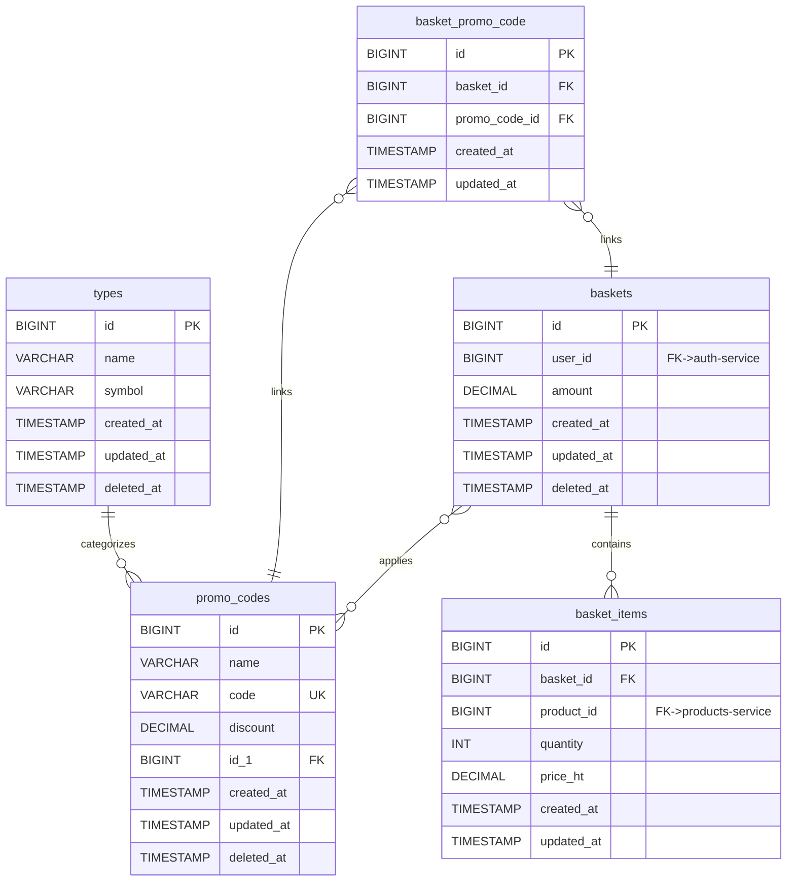

# Baskets Service Database Documentation

## Table of Contents
- [Overview](#overview)
- [Database Information](#database-information)
- [Entity Relationship Diagram](#entity-relationship-diagram)
- [Table Schemas](#table-schemas)
- [Architecture Details](#architecture-details)
- [Amount Calculation Logic](#amount-calculation-logic)
- [Events Published](#events-published)
- [Events Consumed](#events-consumed)
- [Cross-Service References](#cross-service-references)
- [Indexes and Performance](#indexes-and-performance)

## Overview

The baskets-service database (`baskets_service_db`) manages shopping cart functionality including cart items, promotional codes, and amount calculations. This service handles the complete shopping cart lifecycle from item addition through checkout initiation, with support for promo code discounts and abandoned cart tracking.

**Service:** baskets-service
**Database:** baskets_service_db
**External Port:** 3319
**Total Tables:** 5 (3 business, 1 pivot, 1 reference)

**Key Capabilities:**
- Shopping cart management per user
- Product item tracking with quantity and pricing
- Promo code application with type-based restrictions
- Automatic amount calculation with discounts
- Cart abandonment detection
- Soft deletes for baskets and promo codes
- Cross-service product synchronization

## Database Information

### Connection Details
```bash
Host: localhost (in Docker network: mysql-baskets)
Port: 3319 (external), 3306 (internal)
Database: baskets_service_db
Charset: utf8mb4
Collation: utf8mb4_unicode_ci
Engine: InnoDB
```

### Environment Configuration
```bash
DB_CONNECTION=mysql
DB_HOST=mysql-baskets
DB_PORT=3306
DB_DATABASE=baskets_service_db
DB_USERNAME=baskets_user
DB_PASSWORD=baskets_pass
```

## Entity Relationship Diagram



```
┌─────────────────────────────────────────────────────────────────────┐
│                     BASKETS SERVICE DATABASE                        │
│                    baskets_service_db (5 tables)                    │
└─────────────────────────────────────────────────────────────────────┘

┌──────────────────────────────────────────────────────────────────────┐
│                    PROMO CODE MANAGEMENT                             │
└──────────────────────────────────────────────────────────────────────┘

    ┌────────────┐
    │   types    │
    ├────────────┤
    │ id     PK  │
    │ name       │
    │ symbol     │
    │ created_at │
    │ updated_at │
    │ deleted_at │
    └──────┬─────┘
           │
           │ id_1 (type_id)
           ▼
    ┌────────────┐
    │ promo_codes│
    ├────────────┤
    │ id     PK  │
    │ name       │
    │ code   UK  │
    │ discount   │
    │ id_1   FK  │───┐ References types.id
    │ created_at │   │
    │ updated_at │   │
    │ deleted_at │   │
    └──────┬─────┘   │
           │         │
           └─────────┘

┌──────────────────────────────────────────────────────────────────────┐
│                      SHOPPING CART CORE                              │
└──────────────────────────────────────────────────────────────────────┘

    ┌────────────────────────────┐
    │         baskets            │
    ├────────────────────────────┤
    │ id              PK         │
    │ user_id         INDEX      │──── References auth-service (no FK)
    │ amount          decimal    │     Synchronized via events
    │ created_at                 │
    │ updated_at                 │
    │ deleted_at                 │
    └──────────┬─────────────────┘
               │
               │ basket_id
        ┌──────┴──────┬──────────────────┐
        │             │                  │
        ▼             ▼                  ▼
┌──────────────┐ ┌───────────────┐ ┌────────────────────┐
│basket_items  │ │basket_promo   │ │ (promo_codes)      │
│              │ │_code (PIVOT)  │ │                    │
├──────────────┤ ├───────────────┤ └────────────────────┘
│ id       PK  │ │ id        PK  │
│ basket_id FK │ │ basket_id FK  │
│ product_id   │ │ promo_code_id │
│ quantity     │ │   FK          │
│ price_ht     │ │ created_at    │
│ created_at   │ │ updated_at    │
│ updated_at   │ │ UNIQUE(basket,│
└──────────────┘ │   promo_code) │
    │            └───────────────┘
    │
    │ product_id
    └────────────── References products-service (no FK)
                    Synchronized via ProductUpdated events

LEGEND:
────────  Relationship / Foreign Key
PK        Primary Key
FK        Foreign Key
UK        Unique Constraint
INDEX     Database Index
```

## Table Schemas

### 1. types
Categorization system for promo codes.

| Column | Type | Constraints | Description |
|--------|------|-------------|-------------|
| id | BIGINT UNSIGNED | PK, AUTO_INCREMENT | Type ID |
| name | VARCHAR(255) | NOT NULL | Type name |
| symbol | VARCHAR(255) | NOT NULL | Type symbol/code |
| created_at | TIMESTAMP | NULLABLE | Record creation timestamp |
| updated_at | TIMESTAMP | NULLABLE | Last update timestamp |
| deleted_at | TIMESTAMP | NULLABLE | Soft delete timestamp |

**Indexes:**
- PRIMARY KEY (id)

**Business Rules:**
- Soft deletes enabled
- Used to categorize promo codes by type (e.g., percentage, fixed amount)
- Symbol provides short reference code

**Examples:**
- name: "Percentage Discount", symbol: "PCT"
- name: "Fixed Amount", symbol: "FIX"
- name: "Free Shipping", symbol: "SHIP"

---

### 2. promo_codes
Promotional discount codes with type categorization.

| Column | Type | Constraints | Description |
|--------|------|-------------|-------------|
| id | BIGINT UNSIGNED | PK, AUTO_INCREMENT | Promo code ID |
| name | VARCHAR(255) | NOT NULL | Promo code name |
| code | VARCHAR(255) | NOT NULL, UNIQUE | Unique promo code |
| discount | DECIMAL(8,2) | NOT NULL | Discount amount or percentage |
| id_1 | BIGINT UNSIGNED | NULLABLE, FK | Type reference (types.id) |
| created_at | TIMESTAMP | NULLABLE | Record creation timestamp |
| updated_at | TIMESTAMP | NULLABLE | Last update timestamp |
| deleted_at | TIMESTAMP | NULLABLE | Soft delete timestamp |

**Foreign Keys:**
- id_1 -> types(id) ON DELETE RESTRICT

**Indexes:**
- PRIMARY KEY (id)
- UNIQUE (code)
- INDEX (id_1)

**Business Rules:**
- Soft deletes enabled
- Code must be unique across active promo codes
- Discount interpretation depends on type (percentage vs fixed)
- Type reference allows categorization and validation rules
- Many-to-many with baskets via basket_promo_code pivot

**Example Records:**
```json
{
  "id": 1,
  "name": "Summer Sale",
  "code": "SUMMER2024",
  "discount": 20.00,
  "id_1": 1
}
```
Interpretation: If type.symbol = "PCT", discount is 20% off

---

### 3. baskets (CORE)
Shopping cart entity with user association and calculated amount.

| Column | Type | Constraints | Description |
|--------|------|-------------|-------------|
| id | BIGINT UNSIGNED | PK, AUTO_INCREMENT | Basket ID |
| user_id | BIGINT UNSIGNED | NOT NULL, INDEX | User reference (auth-service) |
| amount | DECIMAL(10,2) | NOT NULL, DEFAULT 0 | Total amount after discounts |
| created_at | TIMESTAMP | NULLABLE | Basket creation timestamp |
| updated_at | TIMESTAMP | NULLABLE | Last update timestamp |
| deleted_at | TIMESTAMP | NULLABLE | Soft delete timestamp |

**Indexes:**
- PRIMARY KEY (id)
- INDEX (user_id)

**Business Rules:**
- Soft deletes enabled
- One active basket per user (enforce at application level)
- amount automatically calculated from items and promo codes
- user_id references auth-service (no FK constraint, different database)
- Amount updated automatically when items or promo codes change

**Model Relationships:**
- hasMany: BasketItem
- belongsToMany: PromoCode (via basket_promo_code)

**Model Methods:**
```php
calculateTotal()         // Recalculate and save amount
getSubtotalAttribute()   // Get subtotal before discounts
getTotalDiscountAttribute() // Get total discount amount
```

**Lifecycle:**
1. Created when user adds first item
2. Updated as items added/removed or promo codes applied
3. Soft deleted after checkout or abandonment cleanup
4. Hard deleted after retention period

---

### 4. basket_items
Individual product items within a basket.

| Column | Type | Constraints | Description |
|--------|------|-------------|-------------|
| id | BIGINT UNSIGNED | PK, AUTO_INCREMENT | Basket item ID |
| basket_id | BIGINT UNSIGNED | NOT NULL, FK | Basket reference (baskets.id) |
| product_id | BIGINT UNSIGNED | NOT NULL | Product reference (products-service) |
| quantity | INTEGER | NOT NULL, DEFAULT 1 | Item quantity |
| price_ht | DECIMAL(8,2) | NOT NULL | Price excluding tax (cached) |
| created_at | TIMESTAMP | NULLABLE | Item addition timestamp |
| updated_at | TIMESTAMP | NULLABLE | Last update timestamp |

**Foreign Keys:**
- basket_id -> baskets(id) ON DELETE CASCADE

**Indexes:**
- PRIMARY KEY (id)
- INDEX (basket_id, product_id)

**Business Rules:**
- Cascade delete when basket deleted
- product_id references products-service (no FK, different database)
- price_ht cached from products-service at time of addition
- quantity must be positive integer
- Automatically recalculates basket.amount on save/delete

**Model Relationships:**
- belongsTo: Basket

**Model Methods:**
```php
getLineTotalAttribute() // Returns price_ht * quantity
```

**Model Events:**
```php
static::saved()   // Triggers basket->calculateTotal()
static::deleted() // Triggers basket->calculateTotal()
```

**Synchronization Logic:**
- Listen to ProductUpdated: Update cached price_ht
- Listen to StockUpdated: Validate availability
- Listen to ProductDeleted: Remove from basket

---

### 5. basket_promo_code (Pivot)
Many-to-many relationship between baskets and promo codes.

| Column | Type | Constraints | Description |
|--------|------|-------------|-------------|
| id | BIGINT UNSIGNED | PK, AUTO_INCREMENT | Pivot ID |
| basket_id | BIGINT UNSIGNED | NOT NULL, FK | Basket reference |
| promo_code_id | BIGINT UNSIGNED | NOT NULL, FK | Promo code reference |
| created_at | TIMESTAMP | NULLABLE | Application timestamp |
| updated_at | TIMESTAMP | NULLABLE | Last update timestamp |

**Foreign Keys:**
- basket_id -> baskets(id) ON DELETE CASCADE
- promo_code_id -> promo_codes(id) ON DELETE CASCADE

**Indexes:**
- PRIMARY KEY (id)
- UNIQUE (basket_id, promo_code_id)

**Business Rules:**
- Unique constraint prevents duplicate promo code application
- Cascade delete on both sides
- Timestamps track when promo code applied
- Multiple promo codes can be applied to one basket (business logic may restrict)

**Application Logic:**
```php
// Apply promo code
$basket->promoCodes()->attach($promoCodeId);
$basket->calculateTotal(); // Recalculate with discount

// Remove promo code
$basket->promoCodes()->detach($promoCodeId);
$basket->calculateTotal(); // Recalculate without discount
```

## Architecture Details

### Shopping Cart Design

The baskets-service implements a stateful shopping cart system with the following characteristics:

**Cart Lifecycle:**
1. **Creation**: Implicit creation when user adds first item
2. **Active State**: Items added/removed, promo codes applied
3. **Checkout**: Cart data transferred to orders-service
4. **Completion**: Soft delete after successful checkout
5. **Abandonment**: Tracked for remarketing, cleaned up after period

**Cart Isolation:**
- One active basket per user (enforced at application level)
- User can only access their own basket (JWT authentication)
- Admin users can view all baskets for support purposes

### Amount Calculation Architecture

**Calculation Flow:**
```
1. Calculate Subtotal:
   SUM(basket_items.price_ht * basket_items.quantity)

2. Calculate Total Discount:
   SUM(promo_codes.discount) -- Interpretation based on type

3. Calculate Final Amount:
   MAX(0, Subtotal - Total_Discount)

4. Update baskets.amount with final result
```

**Automatic Recalculation Triggers:**
- BasketItem saved (quantity/price changed)
- BasketItem deleted (item removed)
- PromoCode attached (discount applied)
- PromoCode detached (discount removed)

**Implementation in Basket Model:**
```php
public function calculateTotal()
{
    // Step 1: Calculate subtotal from items
    $subtotal = $this->items->sum(function ($item) {
        return $item->price_ht * $item->quantity;
    });

    // Step 2: Sum all promo code discounts
    $discount = $this->promoCodes->sum('discount');

    // Step 3: Calculate final amount (never negative)
    $total = max(0, $subtotal - $discount);

    // Step 4: Persist to database
    $this->update(['amount' => $total]);

    return $total;
}
```

### Promo Code System

**Type-Based Discount Interpretation:**

1. **Percentage Discounts (type.symbol = "PCT"):**
   ```php
   $discount = ($subtotal * $promoCode->discount) / 100;
   ```

2. **Fixed Amount Discounts (type.symbol = "FIX"):**
   ```php
   $discount = $promoCode->discount;
   ```

**Validation Rules:**
- Unique code enforcement via database constraint
- Type-based business logic validation
- Single-use vs multi-use (implement via usage tracking)
- Expiration dates (add valid_from, valid_until columns)
- Minimum order amount (add min_order_amount column)

**Future Enhancements:**
```sql
ALTER TABLE promo_codes ADD COLUMN valid_from TIMESTAMP;
ALTER TABLE promo_codes ADD COLUMN valid_until TIMESTAMP;
ALTER TABLE promo_codes ADD COLUMN min_order_amount DECIMAL(10,2);
ALTER TABLE promo_codes ADD COLUMN max_usage INT;
ALTER TABLE promo_codes ADD COLUMN current_usage INT DEFAULT 0;
```

### Soft Deletes Strategy

**Enabled on:**
- **baskets**: Preserve checkout history for analytics
- **types**: Maintain promo code categorization history
- **promo_codes**: Keep promotional campaign records

**Retention Strategy:**
```sql
-- Cleanup old soft-deleted baskets (90 days)
DELETE FROM baskets
WHERE deleted_at IS NOT NULL
  AND deleted_at < DATE_SUB(NOW(), INTERVAL 90 DAY);

-- Cleanup abandoned baskets (30 days)
DELETE FROM baskets
WHERE updated_at < DATE_SUB(NOW(), INTERVAL 30 DAY)
  AND deleted_at IS NULL;
```

## Amount Calculation Logic

### Subtotal Calculation

**Formula:**
```
Subtotal = SUM(item.price_ht * item.quantity) FOR ALL items IN basket
```

**Eloquent Implementation:**
```php
// Via Accessor in Basket Model
public function getSubtotalAttribute()
{
    return $this->items->sum(function ($item) {
        return $item->price_ht * $item->quantity;
    });
}

// Usage
$basket->subtotal; // Returns calculated subtotal
```

**Example:**
```
Item 1: price_ht = 50.00, quantity = 2  -> 100.00
Item 2: price_ht = 30.00, quantity = 1  ->  30.00
Item 3: price_ht = 15.00, quantity = 3  ->  45.00
                                    Subtotal: 175.00
```

### Discount Calculation

**Formula:**
```
Total_Discount = SUM(promo_code.discount) FOR ALL promo_codes IN basket
```

**Discount Type Interpretation:**

**Percentage Type (PCT):**
```php
// For promo code with discount = 20.00 and type.symbol = "PCT"
$discountAmount = ($subtotal * 20.00) / 100;
// If subtotal = 175.00: discountAmount = 35.00
```

**Fixed Amount Type (FIX):**
```php
// For promo code with discount = 25.00 and type.symbol = "FIX"
$discountAmount = 25.00;
// Direct fixed discount regardless of subtotal
```

**Multiple Promo Codes:**
```php
// Basket with 2 promo codes
PromoCode 1: type="PCT", discount=10.00  -> 10% off = 17.50
PromoCode 2: type="FIX", discount=15.00  -> 15.00 off
Total Discount: 17.50 + 15.00 = 32.50
```

**Eloquent Implementation:**
```php
// Via Accessor in Basket Model
public function getTotalDiscountAttribute()
{
    return $this->promoCodes->sum(function ($promoCode) {
        if ($promoCode->type->symbol === 'PCT') {
            return ($this->subtotal * $promoCode->discount) / 100;
        }
        return $promoCode->discount; // FIX type
    });
}
```

### Final Amount Calculation

**Formula:**
```
Final_Amount = MAX(0, Subtotal - Total_Discount)
```

**Rules:**
- Amount cannot be negative (MAX function ensures floor of 0)
- Stored in baskets.amount column
- Persisted to database for performance

**Complete Example:**
```
Given:
  Item 1: 50.00 x 2 = 100.00
  Item 2: 30.00 x 1 =  30.00
  Item 3: 15.00 x 3 =  45.00
  Subtotal:           175.00

  PromoCode 1 (PCT): 10% off -> 17.50
  PromoCode 2 (FIX): 15.00 off
  Total Discount:     32.50

Calculation:
  amount = MAX(0, 175.00 - 32.50)
  amount = 142.50

Result:
  baskets.amount = 142.50
```

### Recalculation Triggers

**Automatic Triggers via Model Events:**

```php
// In BasketItem Model
protected static function booted()
{
    // Trigger when item saved (added or updated)
    static::saved(function ($item) {
        $item->basket->calculateTotal();
    });

    // Trigger when item deleted (removed)
    static::deleted(function ($item) {
        $item->basket->calculateTotal();
    });
}
```

**Manual Triggers:**
```php
// When promo code applied
$basket->promoCodes()->attach($promoCodeId);
$basket->calculateTotal();

// When promo code removed
$basket->promoCodes()->detach($promoCodeId);
$basket->calculateTotal();

// When product price updated (via event)
$basketItem->update(['price_ht' => $newPrice]);
// calculateTotal() triggered automatically
```

### Edge Cases

**Empty Basket:**
```
Subtotal: 0.00
Discount: 0.00
Amount: 0.00
```

**Discount Exceeds Subtotal:**
```
Subtotal: 50.00
Discount: 75.00
Amount: MAX(0, 50.00 - 75.00) = 0.00
```

**No Promo Codes:**
```
Subtotal: 175.00
Discount: 0.00
Amount: 175.00
```

**Quantity Update:**
```
Before: Item (price=25.00, qty=2) -> subtotal=50.00, amount=50.00
Update: qty=3
After:  Item (price=25.00, qty=3) -> subtotal=75.00, amount=75.00
Automatically recalculated via BasketItem::saved event
```

## Events Published

The baskets-service publishes events to RabbitMQ for inter-service communication.

### Event Schema

All events follow standard message format:
```json
{
  "event": "basket.checkout.initiated",
  "timestamp": "2025-10-03T14:30:00Z",
  "data": {
    "basket_id": 42,
    "user_id": 7,
    "amount": 142.50,
    "items_count": 3
  }
}
```

### 1. CheckoutInitiated
**Queue:** baskets.checkout.initiated
**Published:** When user proceeds to checkout

**Payload:**
```json
{
  "event": "basket.checkout.initiated",
  "timestamp": "2025-10-03T14:30:00Z",
  "data": {
    "basket_id": 42,
    "user_id": 7,
    "amount": 142.50,
    "subtotal": 175.00,
    "discount": 32.50,
    "items": [
      {
        "product_id": 15,
        "quantity": 2,
        "price_ht": 50.00,
        "line_total": 100.00
      },
      {
        "product_id": 23,
        "quantity": 1,
        "price_ht": 30.00,
        "line_total": 30.00
      }
    ],
    "promo_codes": ["SUMMER2024"],
    "created_at": "2025-10-01T10:00:00Z"
  }
}
```

**Consumers:**
- orders-service: Create new order from basket data
- products-service: Reserve stock for checkout
- analytics-service: Track conversion funnel

---

### 2. BasketAbandoned
**Queue:** baskets.abandoned
**Published:** When basket inactive for threshold period (e.g., 24 hours)

**Payload:**
```json
{
  "event": "basket.abandoned",
  "timestamp": "2025-10-03T14:30:00Z",
  "data": {
    "basket_id": 42,
    "user_id": 7,
    "amount": 142.50,
    "items_count": 3,
    "last_activity": "2025-10-02T14:30:00Z",
    "hours_since_activity": 24,
    "promo_codes_applied": true
  }
}
```

**Consumers:**
- newsletters-service: Send abandonment reminder email
- analytics-service: Track abandonment metrics
- remarketing-service: Trigger retargeting campaigns

**Detection Logic:**
```php
// Scheduled job runs hourly
$abandonedBaskets = Basket::where('updated_at', '<', now()->subHours(24))
    ->whereNull('deleted_at')
    ->whereDoesntHave('orders') // No order created
    ->get();

foreach ($abandonedBaskets as $basket) {
    publishEvent('basket.abandoned', $basket->toArray());
}
```

---

### 3. ItemAdded
**Queue:** baskets.item.added
**Published:** When product added to basket

**Payload:**
```json
{
  "event": "basket.item.added",
  "timestamp": "2025-10-03T14:30:00Z",
  "data": {
    "basket_id": 42,
    "user_id": 7,
    "item_id": 128,
    "product_id": 15,
    "quantity": 2,
    "price_ht": 50.00,
    "new_subtotal": 175.00,
    "new_amount": 142.50
  }
}
```

**Consumers:**
- analytics-service: Track add-to-cart events
- recommendations-service: Update user preferences
- products-service: Update cart metrics for product

---

### 4. ItemRemoved
**Queue:** baskets.item.removed
**Published:** When product removed from basket

**Payload:**
```json
{
  "event": "basket.item.removed",
  "timestamp": "2025-10-03T14:30:00Z",
  "data": {
    "basket_id": 42,
    "user_id": 7,
    "product_id": 15,
    "quantity_removed": 2,
    "new_subtotal": 75.00,
    "new_amount": 57.50,
    "reason": "user_action"
  }
}
```

**Consumers:**
- analytics-service: Track removal patterns
- recommendations-service: Understand preferences
- products-service: Update cart metrics

### RabbitMQ Configuration

**Exchange:** baskets_exchange (topic)
**Routing Keys:**
- basket.checkout.initiated
- basket.abandoned
- basket.item.added
- basket.item.removed

**Consumer Queues:**
- orders-service: baskets.events.orders
- newsletters-service: baskets.events.newsletters
- analytics-service: baskets.events.analytics
- products-service: baskets.events.products

## Events Consumed

The baskets-service consumes events from other services.

### 1. UserCreated (from auth-service)
**Queue:** auth.user.created
**Purpose:** Initialize user basket context

**Payload:**
```json
{
  "event": "user.created",
  "data": {
    "user_id": 7,
    "email": "user@example.com",
    "created_at": "2025-10-03T14:30:00Z"
  }
}
```

**Handler Logic:**
```php
// Pre-create empty basket for new user (optional)
Basket::create([
    'user_id' => $event['data']['user_id'],
    'amount' => 0
]);
```

**Rationale:**
- Ensures user_id exists before basket operations
- Validates user_id references for basket creation
- No foreign key constraint (different database)

---

### 2. ProductUpdated (from products-service)
**Queue:** products.updated
**Purpose:** Synchronize cached product pricing

**Payload:**
```json
{
  "event": "product.updated",
  "data": {
    "product_id": 15,
    "ref": "PROD-001",
    "price_ht": 55.00,
    "previous_price_ht": 50.00,
    "updated_at": "2025-10-03T14:30:00Z"
  }
}
```

**Handler Logic:**
```php
// Update cached price in basket items
$basketItems = BasketItem::where('product_id', $event['data']['product_id'])->get();

foreach ($basketItems as $item) {
    $item->update(['price_ht' => $event['data']['price_ht']]);
    // calculateTotal() triggered automatically via model event
}
```

**Impact:**
- Keeps basket pricing current with product catalog
- Automatic amount recalculation via model events
- Prevents pricing inconsistencies at checkout

---

### 3. ProductDeleted (from products-service)
**Queue:** products.deleted
**Purpose:** Remove unavailable products from baskets

**Payload:**
```json
{
  "event": "product.deleted",
  "data": {
    "product_id": 15,
    "ref": "PROD-001",
    "deleted_at": "2025-10-03T14:30:00Z",
    "reason": "discontinued"
  }
}
```

**Handler Logic:**
```php
// Remove product from all baskets
$basketItems = BasketItem::where('product_id', $event['data']['product_id'])->get();

foreach ($basketItems as $item) {
    $item->delete();
    // calculateTotal() triggered automatically via model event

    // Optionally notify user
    notifyUser($item->basket->user_id, 'Product removed from cart: discontinued');
}
```

**Impact:**
- Prevents checkout with unavailable products
- Maintains cart data integrity
- User notification improves experience

---

### 4. StockUpdated (from products-service)
**Queue:** products.stock.updated
**Purpose:** Validate basket item availability

**Payload:**
```json
{
  "event": "stock.updated",
  "data": {
    "product_id": 15,
    "stock": 2,
    "previous_stock": 10,
    "change": -8
  }
}
```

**Handler Logic:**
```php
// Check if any baskets have quantities exceeding available stock
$basketItems = BasketItem::where('product_id', $event['data']['product_id'])
    ->where('quantity', '>', $event['data']['stock'])
    ->get();

foreach ($basketItems as $item) {
    if ($event['data']['stock'] === 0) {
        // Out of stock: remove from basket
        $item->delete();
        notifyUser($item->basket->user_id, 'Product out of stock: removed from cart');
    } else {
        // Adjust quantity to available stock
        $item->update(['quantity' => $event['data']['stock']]);
        notifyUser($item->basket->user_id, "Quantity adjusted to available stock: {$event['data']['stock']}");
    }
}
```

**Impact:**
- Prevents checkout with unavailable quantities
- Automatic basket adjustment maintains consistency
- User notification prevents checkout confusion

## Cross-Service References

### Referenced BY Other Services

#### orders-service
```sql
-- orders table
CREATE TABLE orders (
    basket_id BIGINT UNSIGNED,    -- References baskets.id
    -- Basket snapshot at checkout time
    -- NO foreign key constraint (different database)
);
```

**Synchronization:**
- Listen to CheckoutInitiated: Create order from basket data
- Basket data copied/snapshotted to order
- Original basket soft deleted after order creation

---

### References TO Other Services

#### auth-service
```sql
-- baskets table
CREATE TABLE baskets (
    user_id BIGINT UNSIGNED NOT NULL,  -- References users.id in auth-service
    -- NO foreign key constraint (different database)
);
```

**Synchronization:**
- Listen to UserCreated: Validate user existence
- user_id validated at application level
- JWT authentication ensures user context

---

#### products-service
```sql
-- basket_items table
CREATE TABLE basket_items (
    product_id BIGINT UNSIGNED NOT NULL,  -- References products.id in products-service
    price_ht DECIMAL(8,2) NOT NULL,       -- Cache of products.price_ht
    -- NO foreign key constraint (different database)
);
```

**Synchronization:**
- Listen to ProductUpdated: Update cached price_ht
- Listen to StockUpdated: Validate availability
- Listen to ProductDeleted: Remove from baskets
- product_id validated via events

## Indexes and Performance

### Strategic Indexes

#### baskets Table
```sql
INDEX (user_id)  -- User basket lookup
```

**Query Optimization:**
```sql
-- Get active basket for user
SELECT * FROM baskets
WHERE user_id = 7
  AND deleted_at IS NULL
LIMIT 1;
```

**Performance Benefits:**
- Fast user basket retrieval (primary operation)
- Efficient user basket existence checks
- Supports abandoned cart queries

---

#### basket_items Table
```sql
INDEX (basket_id, product_id)  -- Composite for item lookup
```

**Query Optimization:**
```sql
-- Check if product already in basket
SELECT * FROM basket_items
WHERE basket_id = 42
  AND product_id = 15
LIMIT 1;

-- Get all items for basket (for amount calculation)
SELECT * FROM basket_items
WHERE basket_id = 42;

-- Find all baskets containing a product (for sync)
SELECT * FROM basket_items
WHERE product_id = 15;
```

**Performance Benefits:**
- Fast duplicate product detection
- Efficient basket item listing
- Product synchronization queries optimized

---

#### promo_codes Table
```sql
UNIQUE (code)     -- Enforce unique codes
INDEX (id_1)      -- Type lookup
```

**Query Optimization:**
```sql
-- Validate promo code
SELECT * FROM promo_codes
WHERE code = 'SUMMER2024'
  AND deleted_at IS NULL
LIMIT 1;

-- Get promo codes by type
SELECT * FROM promo_codes
WHERE id_1 = 1  -- Type ID
  AND deleted_at IS NULL;
```

---

#### basket_promo_code Table (Pivot)
```sql
UNIQUE (basket_id, promo_code_id)  -- Prevent duplicates
```

**Query Optimization:**
```sql
-- Check if promo code already applied
SELECT * FROM basket_promo_code
WHERE basket_id = 42
  AND promo_code_id = 5
LIMIT 1;

-- Get all promo codes for basket
SELECT * FROM basket_promo_code
WHERE basket_id = 42;
```

**Performance Benefits:**
- Prevent duplicate promo code application
- Fast existence checks
- Efficient JOIN operations for discount calculation

### Performance Recommendations

1. **Basket Queries:**
   - Always include deleted_at IS NULL for active baskets
   - Use user_id index for user basket lookup
   - Consider caching active basket per user

2. **Amount Calculation:**
   - Eager load relationships for calculation: `$basket->load('items', 'promoCodes')`
   - Cache calculated amount in baskets.amount column
   - Recalculate only on triggers (item change, promo change)

3. **Item Operations:**
   - Use composite index (basket_id, product_id) for duplicate checks
   - Batch item updates when possible
   - Lazy load items only when needed for display

4. **Promo Code Validation:**
   - Cache active promo codes (rarely change)
   - Use unique code index for validation
   - Consider Redis for promo code lookup

5. **Abandoned Cart Detection:**
   - Index on updated_at for abandonment queries
   - Run scheduled job off-peak hours
   - Batch event publishing for efficiency

**Suggested Additional Indexes:**
```sql
-- For abandonment detection
CREATE INDEX idx_updated_at ON baskets (updated_at, deleted_at);

-- For checkout analytics
CREATE INDEX idx_created_at ON baskets (created_at);

-- For promo code usage tracking
CREATE INDEX idx_promo_applied ON basket_promo_code (promo_code_id, created_at);
```

---

**Document Version:** 1.0
**Last Updated:** 2025-10-03
**Database Version:** MySQL 8.0
**Laravel Version:** 12.x
