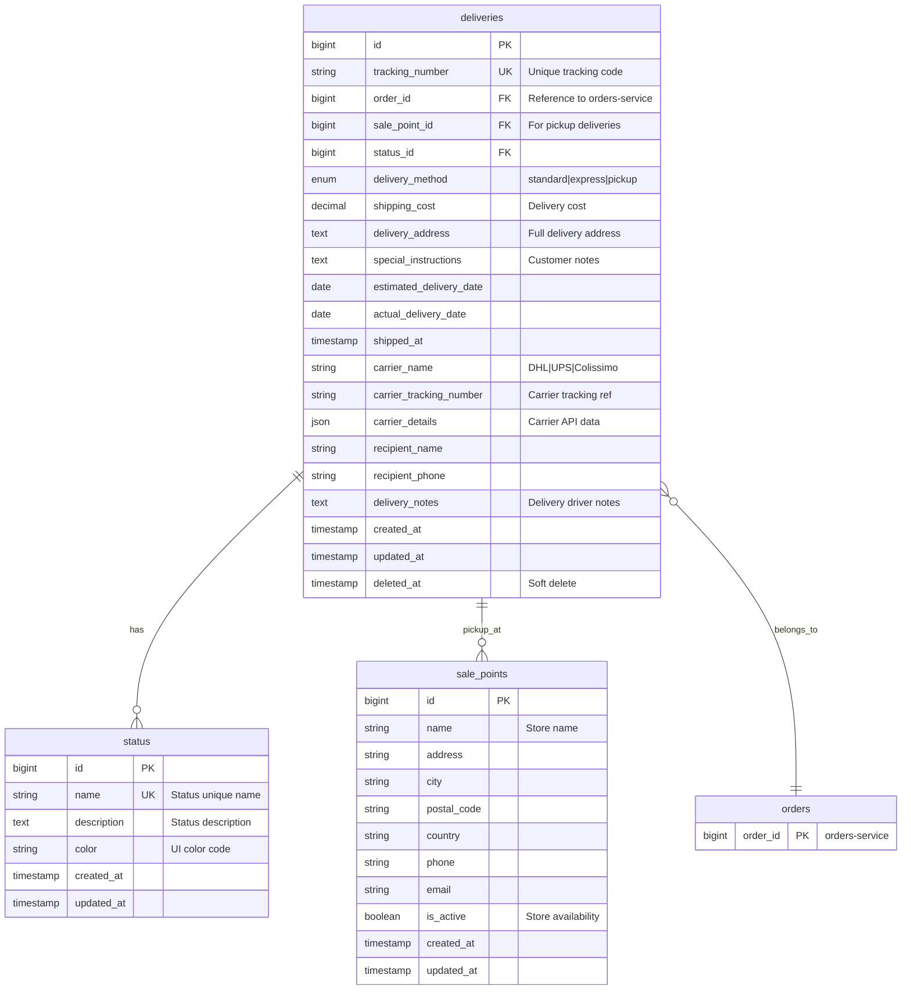
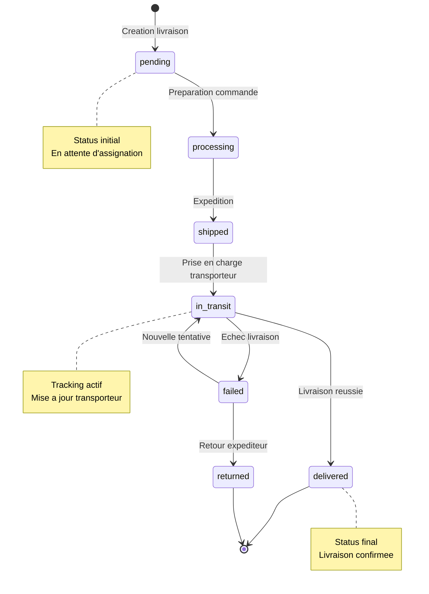

# Deliveries Service Database Documentation

## Vue d'ensemble

La base de donnees `deliveries_service_db` gere le suivi complet des livraisons pour la plateforme e-commerce. Elle assure le tracking des commandes depuis l'expedition jusqu'a la livraison finale, en integrant les transporteurs externes (DHL, UPS, Colissimo) et en gerant les points de vente pour le retrait en magasin.

**Port MySQL**: 3320

**Responsabilites principales**:
- Suivi des livraisons avec numerotation unique
- Gestion des statuts de livraison en temps reel
- Integration avec les API des transporteurs
- Support des methodes de livraison (standard, express, pickup)
- Gestion des points de vente pour retrait
- Historique complet des evenements de livraison

## Diagramme ER (Entity-Relationship)



## Schema detaille des tables

### Table: status

Definit les etats possibles d'une livraison avec representation visuelle.

| Colonne | Type | Contraintes | Description |
|---------|------|-------------|-------------|
| id | BIGINT | PK, AUTO_INCREMENT | Identifiant unique |
| name | VARCHAR(50) | UNIQUE, NOT NULL | Nom du statut |
| description | TEXT | NULLABLE | Description detaillee |
| color | VARCHAR(20) | NULLABLE | Code couleur (ex: #28a745) |
| created_at | TIMESTAMP | NOT NULL | Date de creation |
| updated_at | TIMESTAMP | NOT NULL | Date de mise a jour |

**Index**:
- PRIMARY KEY (id)
- UNIQUE KEY (name)

**Statuts standard**:

| Statut | Description | Couleur | Utilisation |
|--------|-------------|---------|-------------|
| pending | En attente de traitement | #6c757d | Livraison creee, pas encore assignee |
| processing | Preparation en cours | #ffc107 | Commande preparee pour expedition |
| shipped | Expedie | #17a2b8 | Colis pris en charge par transporteur |
| in_transit | En transit | #007bff | Colis en cours d'acheminement |
| delivered | Livre | #28a745 | Livraison effectuee avec succes |
| failed | Echec de livraison | #dc3545 | Tentative de livraison echouee |
| returned | Retourne | #fd7e14 | Colis retourne a l'expediteur |

### Table: sale_points

Points de vente physiques pour le retrait en magasin (click & collect).

| Colonne | Type | Contraintes | Description |
|---------|------|-------------|-------------|
| id | BIGINT | PK, AUTO_INCREMENT | Identifiant unique |
| name | VARCHAR(255) | NOT NULL | Nom du point de vente |
| address | TEXT | NOT NULL | Adresse complete |
| city | VARCHAR(100) | NOT NULL | Ville |
| postal_code | VARCHAR(20) | NOT NULL | Code postal |
| country | VARCHAR(100) | NOT NULL | Pays |
| phone | VARCHAR(20) | NULLABLE | Telephone du magasin |
| email | VARCHAR(255) | NULLABLE | Email de contact |
| is_active | BOOLEAN | DEFAULT true | Disponibilite du point |
| created_at | TIMESTAMP | NOT NULL | Date de creation |
| updated_at | TIMESTAMP | NOT NULL | Date de mise a jour |

**Index**:
- PRIMARY KEY (id)
- INDEX (is_active)
- INDEX (postal_code)

**Cas d'usage**:
- Retrait en magasin (click & collect)
- Localisation des points de retrait
- Gestion de la disponibilite des points

### Table: deliveries

Table principale contenant toutes les informations de livraison.

| Colonne | Type | Contraintes | Description |
|---------|------|-------------|-------------|
| id | BIGINT | PK, AUTO_INCREMENT | Identifiant unique |
| tracking_number | VARCHAR(100) | UNIQUE, NOT NULL | Numero de suivi unique |
| order_id | BIGINT | NOT NULL, INDEX | Reference commande (orders-service) |
| sale_point_id | BIGINT | FK, NULLABLE | Point de vente (si pickup) |
| status_id | BIGINT | FK, NOT NULL | Statut actuel |
| delivery_method | ENUM | NOT NULL | standard/express/pickup |
| shipping_cost | DECIMAL(10,2) | NOT NULL | Cout de livraison |
| delivery_address | TEXT | NULLABLE | Adresse de livraison complete |
| special_instructions | TEXT | NULLABLE | Instructions speciales client |
| estimated_delivery_date | DATE | NULLABLE | Date estimee de livraison |
| actual_delivery_date | DATE | NULLABLE | Date reelle de livraison |
| shipped_at | TIMESTAMP | NULLABLE | Date d'expedition |
| carrier_name | VARCHAR(100) | NULLABLE | Nom du transporteur |
| carrier_tracking_number | VARCHAR(255) | NULLABLE | Numero tracking transporteur |
| carrier_details | JSON | NULLABLE | Details API transporteur |
| recipient_name | VARCHAR(255) | NULLABLE | Nom du destinataire |
| recipient_phone | VARCHAR(20) | NULLABLE | Tel du destinataire |
| delivery_notes | TEXT | NULLABLE | Notes livreur |
| created_at | TIMESTAMP | NOT NULL | Date de creation |
| updated_at | TIMESTAMP | NOT NULL | Date de mise a jour |
| deleted_at | TIMESTAMP | NULLABLE | Soft delete |

**Index**:
- PRIMARY KEY (id)
- UNIQUE KEY (tracking_number)
- INDEX (order_id)
- FOREIGN KEY (sale_point_id) REFERENCES sale_points(id)
- FOREIGN KEY (status_id) REFERENCES status(id)
- INDEX (status_id, created_at)
- INDEX (carrier_name)
- INDEX (estimated_delivery_date)
- INDEX (deleted_at)

**Enumeration delivery_method**:
- `standard`: Livraison standard (5-7 jours)
- `express`: Livraison express (24-48h)
- `pickup`: Retrait en point de vente

**Champ carrier_details (JSON)**:
```json
{
  "carrier_api_response": {
    "events": [
      {
        "timestamp": "2025-01-15T10:30:00Z",
        "status": "in_transit",
        "location": "Centre de tri Paris"
      }
    ],
    "current_location": {
      "city": "Paris",
      "country": "FR"
    },
    "signature_required": true
  }
}
```

## Relations inter-services

### Relation avec orders-service

**Champ**: `deliveries.order_id`

**Type**: Foreign Key logique (inter-service)

**Communication**:
- Via RabbitMQ (asynchrone)
- Event-driven architecture

**Evenements consommes**:
- `OrderConfirmed`: Creation d'une livraison pending
- `OrderCancelled`: Annulation de la livraison associee

**Evenements publies**:
- `DeliveryCreated`: Notification de creation de livraison
- `DeliveryShipped`: Notification d'expedition
- `DeliveryInTransit`: Mise a jour du statut en transit
- `DeliveryDelivered`: Notification de livraison effectuee

**Exemple de flux**:
```
1. orders-service publie OrderConfirmed (order_id: 12345)
2. deliveries-service consomme l'evenement
3. Creation deliveries (order_id: 12345, status: pending)
4. deliveries-service publie DeliveryCreated
5. orders-service met a jour le statut de commande
```

## Etats de livraison (State Machine)

### Transitions d'etats



### Regles de transition

| De | Vers | Condition | Action |
|----|------|-----------|--------|
| pending | processing | Commande validee | Assignation preparation |
| processing | shipped | Colis pret | Generation tracking transporteur |
| shipped | in_transit | Prise en charge | Activation tracking externe |
| in_transit | delivered | Livraison OK | Notification client + orders-service |
| in_transit | failed | Echec livraison | Notification + planification retry |
| failed | in_transit | Nouvelle tentative | Reset estimations |
| failed | returned | Abandon | Notification retour |

### Validations metier

**Changement de statut**:
- Impossible de passer de `delivered` a un autre statut
- `shipped_at` obligatoire pour passer a `shipped`
- `carrier_tracking_number` requis pour `in_transit`
- `actual_delivery_date` requis pour `delivered`

**Methode de livraison**:
- `pickup`: `sale_point_id` obligatoire, `delivery_address` non requis
- `standard`/`express`: `delivery_address` obligatoire, `sale_point_id` null

## Integration transporteurs

### Transporteurs supportes

#### DHL

**API**: DHL Express API
**Endpoints**:
- Tracking: `/tracking/{tracking_number}`
- Creation expedition: `/shipments`

**Fonctionnalites**:
- Suivi en temps reel
- Estimation de livraison
- Preuve de livraison (POD)
- Gestion des retours

**Mapping statuts DHL -> deliveries**:
- `SHIPMENT_PICKED_UP` -> `shipped`
- `TRANSIT` -> `in_transit`
- `DELIVERED` -> `delivered`
- `RETURNED_TO_SHIPPER` -> `returned`

#### UPS

**API**: UPS Tracking API
**Endpoints**:
- Tracking: `/track/v1/details/{tracking_number}`
- Validation adresse: `/addressvalidation`

**Fonctionnalites**:
- Suivi multi-colis
- Validation adresses
- Calcul frais de port
- Gestion des exceptions

**Mapping statuts UPS -> deliveries**:
- `DISPATCHED` -> `shipped`
- `IN_TRANSIT` -> `in_transit`
- `DELIVERED` -> `delivered`
- `EXCEPTION` -> `failed`

#### Colissimo (La Poste)

**API**: Colissimo Web Services
**Endpoints**:
- Suivi: `/tracking/rest/v2/tracking/{tracking_number}`
- Generation etiquette: `/sls-ws/SlsServiceWS`

**Fonctionnalites**:
- Suivi France et international
- Point relais
- Contre-remboursement
- Assurance

**Mapping statuts Colissimo -> deliveries**:
- `DISPATCHED` -> `shipped`
- `TRANSIT` -> `in_transit`
- `DELIVERED` -> `delivered`
- `DISTRIBUTED_BY_RELAY` -> `delivered` (via point relais)

### Synchronisation tracking

**Strategie**: Polling avec webhooks

**Processus**:
1. Creation livraison -> appel API transporteur
2. Stockage `carrier_tracking_number`
3. Job recurrent (toutes les 30 min) pour livraisons actives
4. Webhook transporteur pour evenements critiques
5. Mise a jour `carrier_details` (JSON) avec donnees API

**Job Laravel**: `UpdateCarrierTrackingJob`
```php
// Pseudo-code
$activeDeliveries = Delivery::whereIn('status_id', [shipped, in_transit])->get();
foreach ($activeDeliveries as $delivery) {
    $carrierData = CarrierService::track($delivery->carrier_tracking_number);
    $delivery->update([
        'carrier_details' => $carrierData,
        'status_id' => mapCarrierStatus($carrierData['status'])
    ]);
    event(new DeliveryStatusUpdated($delivery));
}
```

## Evenements RabbitMQ

### Evenements publies

#### DeliveryCreated

**Exchange**: `deliveries.events`
**Routing Key**: `delivery.created`

**Payload**:
```json
{
  "event": "DeliveryCreated",
  "timestamp": "2025-01-15T10:00:00Z",
  "data": {
    "delivery_id": 123,
    "tracking_number": "DEL-2025-001-ABC",
    "order_id": 456,
    "delivery_method": "standard",
    "status": "pending",
    "shipping_cost": 5.99,
    "estimated_delivery_date": "2025-01-22"
  }
}
```

**Consommateurs**:
- `orders-service`: Mise a jour statut commande
- `notifications-service`: Email confirmation expedition

#### DeliveryShipped

**Exchange**: `deliveries.events`
**Routing Key**: `delivery.shipped`

**Payload**:
```json
{
  "event": "DeliveryShipped",
  "timestamp": "2025-01-16T09:30:00Z",
  "data": {
    "delivery_id": 123,
    "tracking_number": "DEL-2025-001-ABC",
    "order_id": 456,
    "carrier_name": "DHL",
    "carrier_tracking_number": "DHL123456789",
    "shipped_at": "2025-01-16T09:30:00Z",
    "estimated_delivery_date": "2025-01-20"
  }
}
```

**Consommateurs**:
- `orders-service`: Statut commande "shipped"
- `notifications-service`: Email tracking client

#### DeliveryInTransit

**Exchange**: `deliveries.events`
**Routing Key**: `delivery.in_transit`

**Payload**:
```json
{
  "event": "DeliveryInTransit",
  "timestamp": "2025-01-17T14:00:00Z",
  "data": {
    "delivery_id": 123,
    "tracking_number": "DEL-2025-001-ABC",
    "carrier_tracking_number": "DHL123456789",
    "current_location": {
      "city": "Paris",
      "country": "FR"
    },
    "estimated_delivery_date": "2025-01-20"
  }
}
```

**Consommateurs**:
- `notifications-service`: Notification push mise a jour tracking

#### DeliveryDelivered

**Exchange**: `deliveries.events`
**Routing Key**: `delivery.delivered`

**Payload**:
```json
{
  "event": "DeliveryDelivered",
  "timestamp": "2025-01-20T11:45:00Z",
  "data": {
    "delivery_id": 123,
    "tracking_number": "DEL-2025-001-ABC",
    "order_id": 456,
    "actual_delivery_date": "2025-01-20",
    "delivery_notes": "Remis en main propre",
    "signature": true
  }
}
```

**Consommateurs**:
- `orders-service`: Statut commande "completed"
- `notifications-service`: Email confirmation livraison
- `reviews-service`: Invitation a laisser un avis

#### DeliveryFailed

**Exchange**: `deliveries.events`
**Routing Key**: `delivery.failed`

**Payload**:
```json
{
  "event": "DeliveryFailed",
  "timestamp": "2025-01-20T18:00:00Z",
  "data": {
    "delivery_id": 123,
    "tracking_number": "DEL-2025-001-ABC",
    "order_id": 456,
    "failure_reason": "Destinataire absent",
    "retry_scheduled": "2025-01-21T10:00:00Z"
  }
}
```

**Consommateurs**:
- `orders-service`: Statut "delivery_issue"
- `notifications-service`: SMS/Email alerte client

### Evenements consommes

#### OrderConfirmed

**Source**: `orders-service`
**Exchange**: `orders.events`
**Routing Key**: `order.confirmed`

**Action**: Creation automatique d'une livraison avec statut `pending`

#### OrderCancelled

**Source**: `orders-service`
**Exchange**: `orders.events`
**Routing Key**: `order.cancelled`

**Action**: Soft delete de la livraison associee si statut `pending` ou `processing`

## Performances et optimisation

### Index strategiques

**Requetes frequentes**:
```sql
-- Recherche par tracking number (unique)
SELECT * FROM deliveries WHERE tracking_number = 'DEL-2025-001-ABC';

-- Livraisons actives pour synchronisation
SELECT * FROM deliveries
WHERE status_id IN (3, 4) -- shipped, in_transit
AND deleted_at IS NULL;

-- Historique livraisons commande
SELECT * FROM deliveries WHERE order_id = 456;

-- Livraisons point de vente
SELECT d.* FROM deliveries d
JOIN sale_points sp ON d.sale_point_id = sp.id
WHERE sp.is_active = true AND d.delivery_method = 'pickup';
```

**Index crees**:
- `tracking_number` (UNIQUE): Recherche instantanee
- `order_id`: Historique client
- `status_id, created_at`: Job synchronisation
- `carrier_name`: Statistiques transporteurs
- `estimated_delivery_date`: Planning livraisons

### Volumetrie estimee

**Croissance**:
- 10,000 livraisons/jour
- Retention 2 ans (7.3M enregistrements)
- Soft delete (pas de suppression physique)

**Strategie de partitionnement**:
```sql
-- Partition par annee
ALTER TABLE deliveries
PARTITION BY RANGE (YEAR(created_at)) (
    PARTITION p2024 VALUES LESS THAN (2025),
    PARTITION p2025 VALUES LESS THAN (2026),
    PARTITION p2026 VALUES LESS THAN (2027)
);
```

### Archivage

**Regles**:
- Livraisons > 2 ans -> archivage vers S3/MinIO
- Conservation hot data 2 ans
- Acces cold data via API d'archivage

## Securite et conformite

### Protection des donnees

**Donnees sensibles**:
- `recipient_name`: Donnees personnelles (RGPD)
- `recipient_phone`: Donnees de contact (RGPD)
- `delivery_address`: Adresse complete (RGPD)

**Mesures**:
- Chiffrement en transit (TLS 1.3)
- Chiffrement au repos (MySQL encryption)
- Acces role-based (JWT + Spatie Permission)
- Audit logs des acces donnees sensibles

### Conformite RGPD

**Droit a l'oubli**:
- Soft delete par defaut
- Anonymisation apres 3 ans
- Suppression physique sur demande explicite

**Minimisation des donnees**:
- Collecte uniquement donnees necessaires
- Conservation limitee dans le temps
- Partage restreint avec transporteurs

### Audit trail

**Suivi des modifications**:
- Laravel Auditing pour table deliveries
- Log des changements de statut
- Tracabilite complete via RabbitMQ events

## Maintenance et monitoring

### Healthchecks

**Endpoints**:
- `/health/database`: Connexion MySQL
- `/health/rabbitmq`: Connexion message broker
- `/health/carriers`: API transporteurs

**Metriques cles**:
- Taux de livraison reussie (> 95%)
- Delai moyen de livraison (< 7 jours standard)
- Taux d'echec livraison (< 2%)

### Jobs recurrents

**UpdateCarrierTrackingJob**:
- Frequence: Toutes les 30 minutes
- Cible: Livraisons `shipped` et `in_transit`
- Timeout: 10 secondes par API call

**CleanupOldDeliveriesJob**:
- Frequence: Quotidien (2h du matin)
- Action: Archivage livraisons > 2 ans

**GenerateDeliveryReportJob**:
- Frequence: Quotidien
- Rapport: Statistiques livraisons (KPIs)

## Exemples d'utilisation

### Creation d'une livraison

```php
// Event handler: OrderConfirmed
$delivery = Delivery::create([
    'tracking_number' => 'DEL-' . now()->format('Y-m-d') . '-' . Str::random(6),
    'order_id' => $order->id,
    'status_id' => Status::where('name', 'pending')->first()->id,
    'delivery_method' => $order->delivery_method,
    'shipping_cost' => $order->shipping_cost,
    'delivery_address' => $order->shipping_address,
    'recipient_name' => $order->customer_name,
    'recipient_phone' => $order->customer_phone,
    'estimated_delivery_date' => now()->addDays(7)
]);

event(new DeliveryCreated($delivery));
```

### Expedition avec transporteur

```php
// Appel API DHL
$dhlResponse = DhlService::createShipment([
    'recipient' => $delivery->recipient_name,
    'address' => $delivery->delivery_address,
    'service' => $delivery->delivery_method
]);

$delivery->update([
    'status_id' => Status::where('name', 'shipped')->first()->id,
    'carrier_name' => 'DHL',
    'carrier_tracking_number' => $dhlResponse['tracking_number'],
    'carrier_details' => $dhlResponse,
    'shipped_at' => now()
]);

event(new DeliveryShipped($delivery));
```

### Mise a jour tracking

```php
// Job recurrent
$carrierData = CarrierService::track($delivery->carrier_tracking_number);

if ($carrierData['status'] === 'DELIVERED') {
    $delivery->update([
        'status_id' => Status::where('name', 'delivered')->first()->id,
        'actual_delivery_date' => $carrierData['delivered_at'],
        'delivery_notes' => $carrierData['delivery_notes'],
        'carrier_details' => $carrierData
    ]);

    event(new DeliveryDelivered($delivery));
}
```

### Retrait en point de vente

```php
$delivery = Delivery::create([
    'tracking_number' => 'DEL-PICKUP-' . Str::random(8),
    'order_id' => $order->id,
    'sale_point_id' => $salePoint->id,
    'status_id' => Status::where('name', 'processing')->first()->id,
    'delivery_method' => 'pickup',
    'shipping_cost' => 0,
    'recipient_name' => $order->customer_name,
    'recipient_phone' => $order->customer_phone
]);

// Notification client: commande prete au retrait
event(new DeliveryReadyForPickup($delivery));
```

## Conclusion

La base de donnees `deliveries_service_db` fournit une infrastructure robuste pour la gestion complete du cycle de vie des livraisons. L'integration avec les transporteurs externes, la communication asynchrone via RabbitMQ et les transitions d'etats controlees garantissent une tracabilite exhaustive et une experience client optimale.

**Points cles**:
- Architecture event-driven pour decouplage services
- Support multi-transporteurs avec API unifiee
- Gestion flexible des methodes de livraison
- Soft delete et conformite RGPD
- Monitoring temps reel via carrier tracking

---

*Document genere pour le projet e-commerce microservices - deliveries-service*
*Derniere mise a jour: 2025-01-15*
