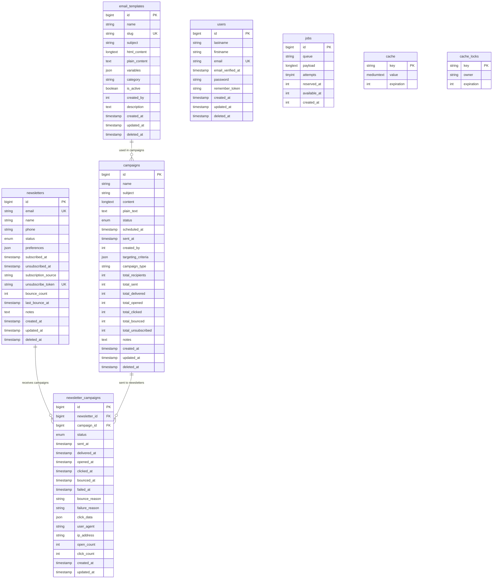

# Newsletters Service Database Documentation

## Table of Contents
- [Overview](#overview)
- [Database Configuration](#database-configuration)
- [Entity Relationship Diagram](#entity-relationship-diagram)
- [Table Specifications](#table-specifications)
- [Email Campaign Management](#email-campaign-management)
- [Email Tracking and Analytics](#email-tracking-and-analytics)
- [Template System](#template-system)
- [MinIO Integration](#minio-integration)
- [RabbitMQ Events Published](#rabbitmq-events-published)
- [Cross-Service Relationships](#cross-service-relationships)
- [Indexes and Performance](#indexes-and-performance)
- [Backup and Maintenance](#backup-and-maintenance)

## Overview

The newsletters-service manages email marketing campaigns, subscriber management, and email delivery tracking for the e-commerce platform. It provides comprehensive email campaign orchestration with detailed analytics tracking (opens, clicks, bounces) and a flexible template system with dynamic variables.

**Service Details:**
- Database Name: `newsletters_service_db`
- External Port: 3321 (for debugging and database clients)
- Container Port: 3306
- Service Port: 8009
- Framework: Laravel 12 with PHP 8.3+
- Object Storage: MinIO bucket 'newsletters' for templates and assets

**Primary Responsibilities:**
- Subscriber list management with preference tracking
- Email campaign creation, scheduling, and sending
- Email delivery tracking (sent, opened, clicked, bounced)
- Template management with dynamic variable substitution
- Email analytics and reporting
- Unsubscribe token management for one-click opt-out
- Bounce rate monitoring and subscriber status management

## Database Configuration

**Connection Details (from .env):**
```env
DB_CONNECTION=mysql
DB_HOST=newsletters-mysql
DB_PORT=3306
DB_DATABASE=newsletters_service_db
DB_USERNAME=newsletters_user
DB_PASSWORD=newsletters_password

# External access for debugging
EXTERNAL_PORT=3321
```

**Docker Service Configuration:**
```yaml
newsletters-mysql:
  image: mysql:8.0
  ports:
    - "3321:3306"
  environment:
    MYSQL_DATABASE: newsletters_service_db
    MYSQL_USER: newsletters_user
    MYSQL_PASSWORD: newsletters_password
    MYSQL_ROOT_PASSWORD: root_password
```

**Character Set and Collation:**
```sql
CHARACTER SET: utf8mb4
COLLATION: utf8mb4_unicode_ci
```

**MinIO Configuration:**
```env
MINIO_ENDPOINT=http://minio:9000
MINIO_ACCESS_KEY=admin
MINIO_SECRET_KEY=adminpass123
MINIO_BUCKET=newsletters
MINIO_REGION=us-east-1
```

## Entity Relationship Diagram



## Table Specifications

### Core Tables

#### newsletters
Subscriber management with preferences and status tracking.

**Columns:**
| Column | Type | Constraints | Description |
|--------|------|-------------|-------------|
| id | BIGINT UNSIGNED | PRIMARY KEY, AUTO_INCREMENT | Unique subscriber identifier |
| email | VARCHAR(255) | NOT NULL, UNIQUE, INDEXED | Subscriber's email address |
| name | VARCHAR(255) | NULLABLE | Subscriber's full name |
| phone | VARCHAR(255) | NULLABLE | Subscriber's phone number |
| status | ENUM | NOT NULL, INDEXED | Subscription status (subscribed, unsubscribed, pending, bounced) |
| preferences | JSON | NULLABLE | Subscriber preferences and interests |
| subscribed_at | TIMESTAMP | NULLABLE, INDEXED | Subscription timestamp |
| unsubscribed_at | TIMESTAMP | NULLABLE | Unsubscription timestamp |
| subscription_source | VARCHAR(255) | NULLABLE | Source of subscription (website, checkout, api, etc.) |
| unsubscribe_token | VARCHAR(255) | NULLABLE, UNIQUE | Token for one-click unsubscribe |
| bounce_count | INT | NOT NULL, DEFAULT 0 | Number of email bounces |
| last_bounce_at | TIMESTAMP | NULLABLE | Last bounce timestamp |
| notes | TEXT | NULLABLE | Admin notes about subscriber |
| created_at | TIMESTAMP | NULLABLE, INDEXED | Record creation timestamp |
| updated_at | TIMESTAMP | NULLABLE | Record last update timestamp |
| deleted_at | TIMESTAMP | NULLABLE | Soft delete timestamp |

**Indexes:**
```sql
PRIMARY KEY (id)
UNIQUE KEY newsletters_email_unique (email)
UNIQUE KEY newsletters_unsubscribe_token_unique (unsubscribe_token)
INDEX newsletters_status_index (status)
INDEX newsletters_subscribed_at_index (subscribed_at)
INDEX newsletters_created_at_index (created_at)
```

**Business Rules:**
- Email must be unique across all subscribers
- Status transitions: pending -> subscribed -> unsubscribed
- Bounced status automatically set after 3+ bounces
- Unsubscribe token generated on first subscription
- One-click unsubscribe uses unsubscribe_token for security
- Preferences stored as JSON for flexible category management
- Subscription source tracks origin for analytics

**Status Workflow:**
```
pending -> subscribed (via email confirmation)
subscribed -> unsubscribed (user request)
subscribed -> bounced (3+ bounce threshold)
bounced -> subscribed (manual reactivation after verification)
```

**Sample Data:**
```json
{
  "id": 1,
  "email": "subscriber@example.com",
  "name": "Jane Doe",
  "phone": "+1234567890",
  "status": "subscribed",
  "preferences": {
    "categories": ["new_products", "promotions", "newsletters"],
    "frequency": "weekly",
    "topics": ["electronics", "books"]
  },
  "subscribed_at": "2025-10-03T10:00:00Z",
  "unsubscribed_at": null,
  "subscription_source": "checkout",
  "unsubscribe_token": "a1b2c3d4e5f6g7h8i9j0",
  "bounce_count": 0,
  "last_bounce_at": null,
  "notes": null,
  "created_at": "2025-10-03T10:00:00Z",
  "updated_at": "2025-10-03T10:00:00Z",
  "deleted_at": null
}
```

---

#### campaigns
Email campaign orchestration and tracking.

**Columns:**
| Column | Type | Constraints | Description |
|--------|------|-------------|-------------|
| id | BIGINT UNSIGNED | PRIMARY KEY, AUTO_INCREMENT | Unique campaign identifier |
| name | VARCHAR(255) | NOT NULL | Campaign name (internal reference) |
| subject | VARCHAR(255) | NOT NULL | Email subject line |
| content | LONGTEXT | NOT NULL | HTML email content |
| plain_text | TEXT | NULLABLE | Plain text version of email |
| status | ENUM | NOT NULL, INDEXED | Campaign status (draft, scheduled, sending, sent, cancelled, failed) |
| scheduled_at | TIMESTAMP | NULLABLE, INDEXED | Campaign scheduled send time |
| sent_at | TIMESTAMP | NULLABLE, INDEXED | Campaign actual send completion time |
| created_by | INT | NULLABLE, INDEXED | User ID who created the campaign |
| targeting_criteria | JSON | NULLABLE | Criteria for recipient selection |
| campaign_type | VARCHAR(255) | NOT NULL, INDEXED, DEFAULT 'newsletter' | Campaign category (newsletter, promotional, transactional, etc.) |
| total_recipients | INT | NOT NULL, DEFAULT 0 | Total selected recipients |
| total_sent | INT | NOT NULL, DEFAULT 0 | Total emails successfully sent |
| total_delivered | INT | NOT NULL, DEFAULT 0 | Total emails delivered (no bounce) |
| total_opened | INT | NOT NULL, DEFAULT 0 | Total unique opens |
| total_clicked | INT | NOT NULL, DEFAULT 0 | Total unique clicks |
| total_bounced | INT | NOT NULL, DEFAULT 0 | Total bounces |
| total_unsubscribed | INT | NOT NULL, DEFAULT 0 | Total unsubscribes from this campaign |
| notes | TEXT | NULLABLE | Campaign notes and description |
| created_at | TIMESTAMP | NULLABLE | Record creation timestamp |
| updated_at | TIMESTAMP | NULLABLE | Record last update timestamp |
| deleted_at | TIMESTAMP | NULLABLE | Soft delete timestamp |

**Indexes:**
```sql
PRIMARY KEY (id)
INDEX campaigns_status_index (status)
INDEX campaigns_scheduled_at_index (scheduled_at)
INDEX campaigns_sent_at_index (sent_at)
INDEX campaigns_campaign_type_index (campaign_type)
INDEX campaigns_created_by_index (created_by)
```

**Business Rules:**
- Status progression: draft -> scheduled -> sending -> sent
- Status can transition to cancelled or failed at any point
- Scheduled campaigns queued for sending at scheduled_at time
- Content supports HTML with template variable substitution
- Plain text version auto-generated if not provided
- Targeting criteria filter recipients by preferences, status, etc.
- Campaign metrics updated in real-time as events occur
- Soft delete preserves campaign history for analytics

**Campaign Status Workflow:**
```
draft -> scheduled (user schedules campaign)
scheduled -> sending (queue worker starts sending)
sending -> sent (all emails processed)
sending -> failed (critical error during send)
* -> cancelled (user cancellation)
```

**Targeting Criteria Example:**
```json
{
  "status": ["subscribed"],
  "preferences.categories": ["promotions"],
  "subscription_source": ["website", "checkout"],
  "exclude_bounced": true,
  "min_subscribed_days": 7
}
```

**Sample Data:**
```json
{
  "id": 1,
  "name": "October 2025 Product Launch",
  "subject": "Exciting New Products Just Arrived!",
  "content": "<html><body><h1>New Products</h1>...</body></html>",
  "plain_text": "New Products\n\n...",
  "status": "sent",
  "scheduled_at": "2025-10-03T10:00:00Z",
  "sent_at": "2025-10-03T10:05:00Z",
  "created_by": 1,
  "targeting_criteria": {
    "status": ["subscribed"],
    "preferences.categories": ["new_products"]
  },
  "campaign_type": "newsletter",
  "total_recipients": 5000,
  "total_sent": 4998,
  "total_delivered": 4950,
  "total_opened": 2475,
  "total_clicked": 1237,
  "total_bounced": 48,
  "total_unsubscribed": 12,
  "notes": "Product launch campaign Q4 2025",
  "created_at": "2025-10-01T14:00:00Z",
  "updated_at": "2025-10-03T12:00:00Z",
  "deleted_at": null
}
```

---

#### newsletter_campaigns
Pivot table tracking individual email deliveries with detailed tracking.

**Columns:**
| Column | Type | Constraints | Description |
|--------|------|-------------|-------------|
| id | BIGINT UNSIGNED | PRIMARY KEY, AUTO_INCREMENT | Unique delivery record identifier |
| newsletter_id | BIGINT UNSIGNED | NOT NULL, INDEXED, FK | Subscriber identifier |
| campaign_id | BIGINT UNSIGNED | NOT NULL, INDEXED, FK | Campaign identifier |
| status | ENUM | NOT NULL, INDEXED | Delivery status (pending, sent, delivered, opened, clicked, bounced, failed) |
| sent_at | TIMESTAMP | NULLABLE, INDEXED | Email sent timestamp |
| delivered_at | TIMESTAMP | NULLABLE | Email delivered timestamp (no bounce) |
| opened_at | TIMESTAMP | NULLABLE, INDEXED | First email open timestamp |
| clicked_at | TIMESTAMP | NULLABLE, INDEXED | First link click timestamp |
| bounced_at | TIMESTAMP | NULLABLE | Bounce timestamp |
| failed_at | TIMESTAMP | NULLABLE | Failure timestamp |
| bounce_reason | VARCHAR(255) | NULLABLE | Bounce reason (hard bounce, soft bounce, etc.) |
| failure_reason | VARCHAR(255) | NULLABLE | Failure reason |
| click_data | JSON | NULLABLE | Detailed click tracking data |
| user_agent | VARCHAR(255) | NULLABLE | User agent from open/click |
| ip_address | VARCHAR(255) | NULLABLE | IP address from open/click |
| open_count | INT | NOT NULL, DEFAULT 0 | Total number of opens |
| click_count | INT | NOT NULL, DEFAULT 0 | Total number of clicks |
| created_at | TIMESTAMP | NULLABLE | Record creation timestamp |
| updated_at | TIMESTAMP | NULLABLE | Record last update timestamp |

**Indexes:**
```sql
PRIMARY KEY (id)
INDEX newsletter_campaigns_newsletter_id_campaign_id_index (newsletter_id, campaign_id)
INDEX newsletter_campaigns_status_index (status)
INDEX newsletter_campaigns_sent_at_index (sent_at)
INDEX newsletter_campaigns_opened_at_index (opened_at)
INDEX newsletter_campaigns_clicked_at_index (clicked_at)
UNIQUE KEY unique_newsletter_campaign (newsletter_id, campaign_id)
FOREIGN KEY (newsletter_id) REFERENCES newsletters(id) ON DELETE CASCADE
FOREIGN KEY (campaign_id) REFERENCES campaigns(id) ON DELETE CASCADE
```

**Business Rules:**
- Unique constraint prevents duplicate sends to same subscriber per campaign
- Status progression: pending -> sent -> delivered -> opened -> clicked
- Bounced or failed status terminates progression
- opened_at and clicked_at record first occurrence only
- open_count and click_count track repeat actions
- click_data stores URL, timestamp, and context for each click
- Foreign key cascade delete removes records when newsletter or campaign deleted
- User agent and IP collected for analytics (anonymized after 90 days)

**Delivery Status Workflow:**
```
pending -> sent (email sent to MTA)
sent -> delivered (MTA confirms delivery)
delivered -> opened (tracking pixel loaded)
opened -> clicked (link clicked)

sent -> bounced (MTA reports bounce)
sent -> failed (send error)
```

**Click Data Structure:**
```json
{
  "clicks": [
    {
      "url": "https://example.com/product/123",
      "timestamp": "2025-10-03T10:15:00Z",
      "click_id": "c1b2c3d4",
      "link_text": "View Product"
    },
    {
      "url": "https://example.com/unsubscribe",
      "timestamp": "2025-10-03T10:16:00Z",
      "click_id": "d2c3d4e5",
      "link_text": "Unsubscribe"
    }
  ]
}
```

**Sample Data:**
```json
{
  "id": 1,
  "newsletter_id": 1,
  "campaign_id": 1,
  "status": "clicked",
  "sent_at": "2025-10-03T10:05:00Z",
  "delivered_at": "2025-10-03T10:05:30Z",
  "opened_at": "2025-10-03T10:15:00Z",
  "clicked_at": "2025-10-03T10:16:00Z",
  "bounced_at": null,
  "failed_at": null,
  "bounce_reason": null,
  "failure_reason": null,
  "click_data": {
    "clicks": [
      {
        "url": "https://example.com/product/123",
        "timestamp": "2025-10-03T10:16:00Z"
      }
    ]
  },
  "user_agent": "Mozilla/5.0 (Windows NT 10.0; Win64; x64)",
  "ip_address": "192.168.1.100",
  "open_count": 3,
  "click_count": 2,
  "created_at": "2025-10-03T10:05:00Z",
  "updated_at": "2025-10-03T10:16:00Z"
}
```

---

#### email_templates
Reusable email templates with dynamic variable substitution.

**Columns:**
| Column | Type | Constraints | Description |
|--------|------|-------------|-------------|
| id | BIGINT UNSIGNED | PRIMARY KEY, AUTO_INCREMENT | Unique template identifier |
| name | VARCHAR(255) | NOT NULL | Template name (human-readable) |
| slug | VARCHAR(255) | NOT NULL, UNIQUE, INDEXED | Template slug (machine-readable identifier) |
| subject | VARCHAR(255) | NOT NULL | Default email subject line |
| html_content | LONGTEXT | NOT NULL | HTML template content with variables |
| plain_content | TEXT | NULLABLE | Plain text template content |
| variables | JSON | NULLABLE | Available variables for substitution |
| category | VARCHAR(255) | NOT NULL, INDEXED, DEFAULT 'newsletter' | Template category (newsletter, transactional, promotional) |
| is_active | BOOLEAN | NOT NULL, INDEXED, DEFAULT TRUE | Template active status |
| created_by | INT | NULLABLE | User ID who created template |
| description | TEXT | NULLABLE | Template description and usage notes |
| created_at | TIMESTAMP | NULLABLE | Record creation timestamp |
| updated_at | TIMESTAMP | NULLABLE | Record last update timestamp |
| deleted_at | TIMESTAMP | NULLABLE | Soft delete timestamp |

**Indexes:**
```sql
PRIMARY KEY (id)
UNIQUE KEY email_templates_slug_unique (slug)
INDEX email_templates_slug_index (slug)
INDEX email_templates_category_index (category)
INDEX email_templates_is_active_index (is_active)
```

**Business Rules:**
- Slug must be unique and URL-safe (lowercase, hyphens)
- Templates support variable substitution using double curly braces {{variable}}
- Variables defined in JSON for validation and editor hints
- HTML content must be responsive and email-client compatible
- Plain text version auto-generated if not provided
- Only active templates available for campaign creation
- Soft delete preserves templates used in historical campaigns
- Templates stored in MinIO for version control and asset management

**Variable Substitution:**
```html
<!-- Template HTML Content -->
<h1>Hello {{subscriber_name}}!</h1>
<p>Check out our latest {{product_category}}:</p>
<a href="{{product_url}}">{{product_name}}</a>
<p>Price: {{product_price}}</p>

<!-- Variables JSON -->
{
  "subscriber_name": {
    "type": "string",
    "required": true,
    "description": "Subscriber's first name"
  },
  "product_category": {
    "type": "string",
    "required": true,
    "description": "Product category name"
  },
  "product_url": {
    "type": "string",
    "required": true,
    "description": "Product detail page URL"
  },
  "product_name": {
    "type": "string",
    "required": true,
    "description": "Product name"
  },
  "product_price": {
    "type": "string",
    "required": true,
    "description": "Formatted product price"
  }
}
```

**Sample Data:**
```json
{
  "id": 1,
  "name": "Product Launch Announcement",
  "slug": "product-launch-announcement",
  "subject": "Introducing {{product_name}} - Available Now!",
  "html_content": "<html><body><h1>Hello {{subscriber_name}}!</h1>...</body></html>",
  "plain_content": "Hello {{subscriber_name}}!\n\n...",
  "variables": {
    "subscriber_name": {
      "type": "string",
      "required": true
    },
    "product_name": {
      "type": "string",
      "required": true
    },
    "product_url": {
      "type": "string",
      "required": true
    }
  },
  "category": "promotional",
  "is_active": true,
  "created_by": 1,
  "description": "Template for new product launch announcements",
  "created_at": "2025-09-01T10:00:00Z",
  "updated_at": "2025-09-15T14:30:00Z",
  "deleted_at": null
}
```

---

### Standard Laravel Tables

#### users
Local cache of user data from auth-service for performance optimization.

**Columns:**
| Column | Type | Constraints | Description |
|--------|------|-------------|-------------|
| id | BIGINT UNSIGNED | PRIMARY KEY | User identifier (synced from auth-service) |
| lastname | VARCHAR(255) | NOT NULL | User's last name |
| firstname | VARCHAR(255) | NOT NULL | User's first name |
| email | VARCHAR(255) | NOT NULL, UNIQUE | User's email address |
| email_verified_at | TIMESTAMP | NULLABLE | Email verification timestamp |
| password | VARCHAR(255) | NOT NULL | Password hash (unused in newsletters-service) |
| remember_token | VARCHAR(100) | NULLABLE | Remember token (unused in newsletters-service) |
| created_at | TIMESTAMP | NULLABLE | Record creation timestamp |
| updated_at | TIMESTAMP | NULLABLE | Record last update timestamp |
| deleted_at | TIMESTAMP | NULLABLE | Soft delete timestamp |

**Business Rules:**
- Synchronized from auth-service via RabbitMQ events
- Eventual consistency model (updates within 1 second)
- Supports subscriber-user linking for personalization
- Password field unused (authentication handled by auth-service)

---

#### jobs
Queue for asynchronous email sending and processing.

**Columns:**
| Column | Type | Constraints | Description |
|--------|------|-------------|-------------|
| id | BIGINT UNSIGNED | PRIMARY KEY, AUTO_INCREMENT | Job identifier |
| queue | VARCHAR(255) | NOT NULL, INDEXED | Queue name (email, campaign, tracking) |
| payload | LONGTEXT | NOT NULL | Serialized job data |
| attempts | TINYINT UNSIGNED | NOT NULL | Execution attempt count |
| reserved_at | INT UNSIGNED | NULLABLE | Job reservation timestamp |
| available_at | INT UNSIGNED | NOT NULL | Job availability timestamp |
| created_at | INT UNSIGNED | NOT NULL | Job creation timestamp |

**Business Rules:**
- email queue: Individual email sending (priority)
- campaign queue: Campaign orchestration
- tracking queue: Open/click event processing
- Max 3 retry attempts before moving to failed_jobs

---

#### cache
Application cache for performance optimization.

**Columns:**
| Column | Type | Constraints | Description |
|--------|------|-------------|-------------|
| key | VARCHAR(255) | PRIMARY KEY | Cache key |
| value | MEDIUMTEXT | NOT NULL | Serialized cached value |
| expiration | INT | NOT NULL | Expiration timestamp |

**Business Rules:**
- Stores campaign recipient lists during sending
- Caches subscriber counts for dashboard
- TTL: 5 minutes for counts, 1 hour for lists

---

#### cache_locks
Distributed locking for concurrent operations.

**Columns:**
| Column | Type | Constraints | Description |
|--------|------|-------------|-------------|
| key | VARCHAR(255) | PRIMARY KEY | Lock key |
| owner | VARCHAR(255) | NOT NULL | Lock owner identifier |
| expiration | INT | NOT NULL | Lock expiration timestamp |

**Business Rules:**
- Prevents duplicate campaign sends
- Locks during bounce processing
- 5-minute lock timeout

---

## Email Campaign Management

### Campaign Creation Workflow

#### 1. Draft Creation
```php
// Create campaign draft
$campaign = Campaign::create([
    'name' => 'October Product Launch',
    'subject' => 'New Products Available!',
    'content' => $htmlContent,
    'plain_text' => $plainText,
    'status' => 'draft',
    'campaign_type' => 'promotional',
    'created_by' => auth()->id()
]);
```

#### 2. Recipient Selection
```php
// Apply targeting criteria
$recipients = Newsletter::where('status', 'subscribed')
    ->whereJsonContains('preferences->categories', 'new_products')
    ->where('bounce_count', '<', 3)
    ->get();

$campaign->update([
    'total_recipients' => $recipients->count(),
    'targeting_criteria' => [
        'status' => ['subscribed'],
        'preferences.categories' => ['new_products'],
        'max_bounce_count' => 2
    ]
]);
```

#### 3. Campaign Scheduling
```php
// Schedule campaign
$campaign->update([
    'status' => 'scheduled',
    'scheduled_at' => now()->addHours(24)
]);

// Dispatch to queue at scheduled time
SendScheduledCampaign::dispatch($campaign)
    ->delay($campaign->scheduled_at);
```

#### 4. Campaign Sending
```php
// Queue worker processes campaign
public function handle(Campaign $campaign): void
{
    $campaign->update(['status' => 'sending']);

    $recipients = $this->getRecipients($campaign);

    foreach ($recipients as $newsletter) {
        // Create delivery record
        NewsletterCampaign::create([
            'newsletter_id' => $newsletter->id,
            'campaign_id' => $campaign->id,
            'status' => 'pending'
        ]);

        // Queue individual email
        SendCampaignEmail::dispatch($campaign, $newsletter);
    }
}
```

#### 5. Individual Email Sending
```php
public function handle(Campaign $campaign, Newsletter $newsletter): void
{
    try {
        // Personalize content
        $content = $this->substituteVariables(
            $campaign->content,
            $newsletter
        );

        // Send email with tracking
        Mail::to($newsletter->email)
            ->send(new CampaignEmail(
                $campaign,
                $content,
                $this->generateTrackingPixel($newsletter, $campaign),
                $this->wrapLinksWithTracking($content, $newsletter, $campaign)
            ));

        // Update delivery record
        NewsletterCampaign::where([
            'newsletter_id' => $newsletter->id,
            'campaign_id' => $campaign->id
        ])->update([
            'status' => 'sent',
            'sent_at' => now()
        ]);

        // Update campaign counters
        $campaign->increment('total_sent');

    } catch (Exception $e) {
        // Handle send failure
        NewsletterCampaign::where([
            'newsletter_id' => $newsletter->id,
            'campaign_id' => $campaign->id
        ])->update([
            'status' => 'failed',
            'failed_at' => now(),
            'failure_reason' => $e->getMessage()
        ]);

        Log::error('Campaign email send failed', [
            'campaign_id' => $campaign->id,
            'newsletter_id' => $newsletter->id,
            'error' => $e->getMessage()
        ]);
    }
}
```

#### 6. Campaign Completion
```php
// Check if all emails processed
public function checkCampaignCompletion(Campaign $campaign): void
{
    $pending = NewsletterCampaign::where('campaign_id', $campaign->id)
        ->where('status', 'pending')
        ->count();

    if ($pending === 0) {
        $campaign->update([
            'status' => 'sent',
            'sent_at' => now()
        ]);

        // Publish completion event
        event(new CampaignSent($campaign));
    }
}
```

---

### Campaign Cancellation

```php
public function cancelCampaign(Campaign $campaign): void
{
    if (!in_array($campaign->status, ['draft', 'scheduled', 'sending'])) {
        throw new CampaignException('Campaign cannot be cancelled');
    }

    // Cancel pending sends
    NewsletterCampaign::where('campaign_id', $campaign->id)
        ->where('status', 'pending')
        ->delete();

    $campaign->update([
        'status' => 'cancelled',
        'notes' => $campaign->notes . "\nCancelled at " . now()
    ]);
}
```

---

## Email Tracking and Analytics

### Tracking Pixel Implementation

#### Open Tracking
```php
// Generate tracking pixel
public function generateTrackingPixel(Newsletter $newsletter, Campaign $campaign): string
{
    $token = base64_encode(json_encode([
        'newsletter_id' => $newsletter->id,
        'campaign_id' => $campaign->id,
        'timestamp' => now()->timestamp
    ]));

    return sprintf(
        '',
        config('app.url'),
        $token
    );
}

// Track open event
public function trackOpen(string $token, Request $request): Response
{
    $data = json_decode(base64_decode($token), true);

    $record = NewsletterCampaign::where([
        'newsletter_id' => $data['newsletter_id'],
        'campaign_id' => $data['campaign_id']
    ])->first();

    if ($record && $record->status !== 'opened') {
        $record->update([
            'status' => 'opened',
            'opened_at' => now(),
            'user_agent' => $request->userAgent(),
            'ip_address' => $request->ip()
        ]);

        Campaign::find($data['campaign_id'])->increment('total_opened');
    }

    // Increment open count for repeat opens
    $record->increment('open_count');

    // Return 1x1 transparent pixel
    return response(base64_decode(
        'R0lGODlhAQABAIAAAAAAAP///yH5BAEAAAAALAAAAAABAAEAAAIBRAA7'
    ))->header('Content-Type', 'image/gif');
}
```

---

### Click Tracking

```php
// Wrap links with tracking
public function wrapLinksWithTracking(
    string $content,
    Newsletter $newsletter,
    Campaign $campaign
): string {
    $dom = new DOMDocument();
    $dom->loadHTML($content);

    foreach ($dom->getElementsByTagName('a') as $link) {
        $originalUrl = $link->getAttribute('href');

        // Skip unsubscribe links
        if (str_contains($originalUrl, '/unsubscribe')) {
            continue;
        }

        $trackingUrl = $this->generateTrackingUrl(
            $originalUrl,
            $newsletter,
            $campaign
        );

        $link->setAttribute('href', $trackingUrl);
    }

    return $dom->saveHTML();
}

// Generate tracking URL
public function generateTrackingUrl(
    string $url,
    Newsletter $newsletter,
    Campaign $campaign
): string {
    $token = base64_encode(json_encode([
        'newsletter_id' => $newsletter->id,
        'campaign_id' => $campaign->id,
        'url' => $url,
        'timestamp' => now()->timestamp
    ]));

    return route('track.click', ['token' => $token]);
}

// Track click event
public function trackClick(string $token, Request $request): RedirectResponse
{
    $data = json_decode(base64_decode($token), true);

    $record = NewsletterCampaign::where([
        'newsletter_id' => $data['newsletter_id'],
        'campaign_id' => $data['campaign_id']
    ])->first();

    if ($record) {
        // Record first click
        if (!$record->clicked_at) {
            $record->update([
                'status' => 'clicked',
                'clicked_at' => now()
            ]);

            Campaign::find($data['campaign_id'])->increment('total_clicked');
        }

        // Append click to click_data
        $clickData = $record->click_data ?? ['clicks' => []];
        $clickData['clicks'][] = [
            'url' => $data['url'],
            'timestamp' => now()->toIso8601String()
        ];

        $record->update(['click_data' => $clickData]);
        $record->increment('click_count');
    }

    // Redirect to original URL
    return redirect($data['url']);
}
```

---

### Bounce Handling

```php
// Process bounce notification (webhook from email provider)
public function handleBounce(Request $request): JsonResponse
{
    $email = $request->input('email');
    $bounceType = $request->input('type'); // hard, soft
    $reason = $request->input('reason');

    $newsletter = Newsletter::where('email', $email)->first();

    if (!$newsletter) {
        return response()->json(['status' => 'ignored'], 200);
    }

    // Update subscriber bounce count
    $newsletter->increment('bounce_count');
    $newsletter->update(['last_bounce_at' => now()]);

    // Update delivery record
    $recentCampaign = NewsletterCampaign::where('newsletter_id', $newsletter->id)
        ->whereNotNull('sent_at')
        ->whereNull('bounced_at')
        ->latest('sent_at')
        ->first();

    if ($recentCampaign) {
        $recentCampaign->update([
            'status' => 'bounced',
            'bounced_at' => now(),
            'bounce_reason' => $bounceType . ': ' . $reason
        ]);

        Campaign::find($recentCampaign->campaign_id)->increment('total_bounced');
    }

    // Auto-unsubscribe after 3 hard bounces
    if ($bounceType === 'hard' && $newsletter->bounce_count >= 3) {
        $newsletter->update([
            'status' => 'bounced',
            'notes' => 'Auto-unsubscribed due to repeated hard bounces'
        ]);
    }

    return response()->json(['status' => 'processed'], 200);
}
```

---

### Analytics Queries

#### Campaign Performance Report
```sql
SELECT
    c.id,
    c.name,
    c.sent_at,
    c.total_recipients,
    c.total_sent,
    c.total_delivered,
    c.total_opened,
    c.total_clicked,
    c.total_bounced,
    c.total_unsubscribed,
    ROUND((c.total_delivered / c.total_sent) * 100, 2) AS delivery_rate,
    ROUND((c.total_opened / c.total_delivered) * 100, 2) AS open_rate,
    ROUND((c.total_clicked / c.total_opened) * 100, 2) AS click_through_rate,
    ROUND((c.total_bounced / c.total_sent) * 100, 2) AS bounce_rate
FROM campaigns c
WHERE c.status = 'sent'
ORDER BY c.sent_at DESC
LIMIT 10;
```

#### Subscriber Engagement Score
```sql
SELECT
    n.id,
    n.email,
    COUNT(nc.id) AS campaigns_received,
    SUM(CASE WHEN nc.opened_at IS NOT NULL THEN 1 ELSE 0 END) AS total_opens,
    SUM(CASE WHEN nc.clicked_at IS NOT NULL THEN 1 ELSE 0 END) AS total_clicks,
    ROUND(
        (SUM(CASE WHEN nc.opened_at IS NOT NULL THEN 1 ELSE 0 END) /
         COUNT(nc.id)) * 100,
        2
    ) AS engagement_rate
FROM newsletters n
LEFT JOIN newsletter_campaigns nc ON n.id = nc.newsletter_id
WHERE n.status = 'subscribed'
GROUP BY n.id, n.email
HAVING campaigns_received > 0
ORDER BY engagement_rate DESC
LIMIT 100;
```

---

## Template System

### Variable Substitution Engine

```php
public function substituteVariables(string $content, Newsletter $newsletter): string
{
    $variables = [
        'subscriber_name' => $newsletter->name ?? 'Valued Customer',
        'subscriber_email' => $newsletter->email,
        'unsubscribe_url' => $this->generateUnsubscribeUrl($newsletter),
        'preferences_url' => route('preferences', $newsletter->id),
        'company_name' => config('app.name'),
        'company_address' => config('company.address'),
        'current_year' => date('Y')
    ];

    // Replace variables in content
    foreach ($variables as $key => $value) {
        $content = str_replace('{{'.$key.'}}', $value, $content);
    }

    return $content;
}
```

---

### Template Validation

```php
public function validateTemplate(EmailTemplate $template): array
{
    $errors = [];

    // Check required variables
    preg_match_all('/{{(\w+)}}/', $template->html_content, $matches);
    $usedVariables = array_unique($matches[1]);

    $definedVariables = array_keys($template->variables ?? []);

    $undefinedVariables = array_diff($usedVariables, $definedVariables);

    if (!empty($undefinedVariables)) {
        $errors[] = 'Undefined variables: ' . implode(', ', $undefinedVariables);
    }

    // Validate HTML structure
    libxml_use_internal_errors(true);
    $dom = new DOMDocument();
    $dom->loadHTML($template->html_content);

    if (libxml_get_last_error()) {
        $errors[] = 'Invalid HTML structure';
    }

    // Check for unsubscribe link
    if (!str_contains($template->html_content, '{{unsubscribe_url}}')) {
        $errors[] = 'Template must include unsubscribe link';
    }

    return $errors;
}
```

---

## MinIO Integration

### Bucket Structure
```
newsletters/
├── templates/
│   ├── {template-slug}/
│   │   ├── v{version}/
│   │   │   ├── index.html
│   │   │   ├── plain.txt
│   │   │   └── metadata.json
│   │   └── assets/
│   │       ├── logo.png
│   │       ├── header.jpg
│   │       └── styles.css
├── campaigns/
│   ├── {campaign-id}/
│   │   ├── content.html
│   │   ├── recipients.csv
│   │   └── report.json
└── assets/
    ├── images/
    └── attachments/
```

### Template Storage

```php
// Store template in MinIO
public function storeTemplate(EmailTemplate $template): void
{
    $s3 = Storage::disk('minio');
    $basePath = "templates/{$template->slug}/v{$template->version}";

    // Store HTML content
    $s3->put("{$basePath}/index.html", $template->html_content);

    // Store plain text
    $s3->put("{$basePath}/plain.txt", $template->plain_content);

    // Store metadata
    $s3->put("{$basePath}/metadata.json", json_encode([
        'template_id' => $template->id,
        'version' => $template->version,
        'variables' => $template->variables,
        'created_at' => $template->created_at,
        'created_by' => $template->created_by
    ]));

    // Generate presigned URL for preview
    $previewUrl = $s3->temporaryUrl(
        "{$basePath}/index.html",
        now()->addHours(1)
    );

    $template->update(['preview_url' => $previewUrl]);
}

// Load template from MinIO
public function loadTemplate(string $slug, int $version = null): array
{
    $s3 = Storage::disk('minio');

    // Get latest version if not specified
    if (!$version) {
        $versions = $s3->allDirectories("templates/{$slug}");
        $version = max(array_map(
            fn($v) => (int)str_replace('v', '', basename($v)),
            $versions
        ));
    }

    $basePath = "templates/{$slug}/v{$version}";

    return [
        'html' => $s3->get("{$basePath}/index.html"),
        'plain' => $s3->get("{$basePath}/plain.txt"),
        'metadata' => json_decode($s3->get("{$basePath}/metadata.json"), true)
    ];
}
```

---

### Asset Management

```php
// Upload template assets
public function uploadAsset(Request $request, EmailTemplate $template): JsonResponse
{
    $file = $request->file('asset');
    $s3 = Storage::disk('minio');

    $path = "templates/{$template->slug}/assets/{$file->hashName()}";

    $s3->put($path, file_get_contents($file), 'public');

    // Generate permanent public URL
    $url = $s3->url($path);

    return response()->json([
        'url' => $url,
        'path' => $path,
        'filename' => $file->getClientOriginalName()
    ]);
}
```

---

## RabbitMQ Events Published

### Exchange Configuration
```yaml
exchange: microservices_exchange
type: topic
durable: true
```

### Published Events

#### 1. CampaignScheduled
Published when campaign is scheduled for sending.

**Routing Key:** `newsletters.campaign.scheduled`

**Payload:**
```json
{
  "event_id": "a1b2c3d4-e5f6-47g8-h9i0-j1k2l3m4n5o6",
  "event_type": "campaign.scheduled",
  "timestamp": "2025-10-03T10:00:00Z",
  "version": "1.0",
  "data": {
    "campaign_id": 1,
    "campaign_name": "October Product Launch",
    "scheduled_at": "2025-10-04T10:00:00Z",
    "total_recipients": 5000,
    "campaign_type": "promotional"
  }
}
```

---

#### 2. CampaignSent
Published when campaign sending is complete.

**Routing Key:** `newsletters.campaign.sent`

**Payload:**
```json
{
  "event_id": "b2c3d4e5-f6g7-58h9-i0j1-k2l3m4n5o6p7",
  "event_type": "campaign.sent",
  "timestamp": "2025-10-04T10:30:00Z",
  "version": "1.0",
  "data": {
    "campaign_id": 1,
    "campaign_name": "October Product Launch",
    "sent_at": "2025-10-04T10:30:00Z",
    "total_recipients": 5000,
    "total_sent": 4998,
    "total_failed": 2
  }
}
```

---

#### 3. EmailOpened
Published when subscriber opens email.

**Routing Key:** `newsletters.email.opened`

**Payload:**
```json
{
  "event_id": "c3d4e5f6-g7h8-69i0-j1k2-l3m4n5o6p7q8",
  "event_type": "email.opened",
  "timestamp": "2025-10-04T11:00:00Z",
  "version": "1.0",
  "data": {
    "newsletter_id": 1,
    "campaign_id": 1,
    "email": "subscriber@example.com",
    "opened_at": "2025-10-04T11:00:00Z"
  }
}
```

---

#### 4. EmailClicked
Published when subscriber clicks link in email.

**Routing Key:** `newsletters.email.clicked`

**Payload:**
```json
{
  "event_id": "d4e5f6g7-h8i9-70j1-k2l3-m4n5o6p7q8r9",
  "event_type": "email.clicked",
  "timestamp": "2025-10-04T11:05:00Z",
  "version": "1.0",
  "data": {
    "newsletter_id": 1,
    "campaign_id": 1,
    "email": "subscriber@example.com",
    "clicked_url": "https://example.com/product/123",
    "clicked_at": "2025-10-04T11:05:00Z"
  }
}
```

---

#### 5. SubscriberUnsubscribed
Published when subscriber unsubscribes.

**Routing Key:** `newsletters.subscriber.unsubscribed`

**Payload:**
```json
{
  "event_id": "e5f6g7h8-i9j0-81k2-l3m4-n5o6p7q8r9s0",
  "event_type": "subscriber.unsubscribed",
  "timestamp": "2025-10-04T12:00:00Z",
  "version": "1.0",
  "data": {
    "newsletter_id": 1,
    "email": "subscriber@example.com",
    "unsubscribed_at": "2025-10-04T12:00:00Z",
    "reason": "too_frequent",
    "campaign_id": 1
  }
}
```

---

## Cross-Service Relationships

### Logical Foreign Keys

#### user_id References
```sql
-- campaigns.created_by
FOREIGN KEY (logical): created_by -> auth_service_db.users.id

-- email_templates.created_by
FOREIGN KEY (logical): created_by -> auth_service_db.users.id
```

---

## Indexes and Performance

### Query Performance Targets
```yaml
subscriber_lookup: < 10ms
campaign_metrics: < 50ms
tracking_event: < 20ms
analytics_report: < 500ms
```

### Index Usage Optimization

```sql
-- Optimized subscriber search
SELECT * FROM newsletters
WHERE email = 'subscriber@example.com'
AND status = 'subscribed';
-- Uses: newsletters_email_unique + newsletters_status_index

-- Optimized campaign metrics
SELECT * FROM campaigns
WHERE status = 'sent'
AND sent_at >= DATE_SUB(NOW(), INTERVAL 30 DAY)
ORDER BY sent_at DESC;
-- Uses: campaigns_status_index + campaigns_sent_at_index

-- Optimized engagement query
SELECT * FROM newsletter_campaigns
WHERE campaign_id = 1
AND status IN ('opened', 'clicked')
ORDER BY opened_at DESC;
-- Uses: newsletter_campaigns_campaign_id_index + newsletter_campaigns_status_index
```

---

## Backup and Maintenance

### Backup Strategy

```bash
#!/bin/bash
# Daily backup at 3 AM
TIMESTAMP=$(date +%Y%m%d_%H%M%S)
BACKUP_DIR="/backups/newsletters-service"
BACKUP_FILE="${BACKUP_DIR}/newsletters_service_db_${TIMESTAMP}.sql"

mkdir -p ${BACKUP_DIR}

docker exec newsletters-mysql mysqldump \
  --user=newsletters_user \
  --password=newsletters_password \
  --single-transaction \
  --routines \
  --triggers \
  --databases newsletters_service_db \
  > ${BACKUP_FILE}

gzip ${BACKUP_FILE}

# Retention: 30 days
find ${BACKUP_DIR} -name "*.sql.gz" -mtime +30 -delete

echo "Backup completed: ${BACKUP_FILE}.gz"
```

---

### Maintenance Tasks

#### Clean Expired Data
```sql
-- Remove old tracking data (90 days)
DELETE FROM newsletter_campaigns
WHERE sent_at < DATE_SUB(NOW(), INTERVAL 90 DAY);

-- Archive old campaigns
UPDATE campaigns
SET deleted_at = NOW()
WHERE status = 'sent'
AND sent_at < DATE_SUB(NOW(), INTERVAL 365 DAY);

-- Clean bounce records
UPDATE newsletters
SET bounce_count = 0,
    last_bounce_at = NULL
WHERE status = 'bounced'
AND last_bounce_at < DATE_SUB(NOW(), INTERVAL 180 DAY);
```

---

## Related Documentation

- [Global Database Architecture](../00-global-database-architecture.md)
- [MinIO Object Storage Documentation](../../minio/MINIO.md)
- [RabbitMQ Message Broker Guide](../../architecture/rabbitmq-architecture.md)
- [API Documentation](../../api/README.md)

---

**Document Version:** 1.0
**Last Updated:** 2025-10-03
**Maintainer:** Development Team
