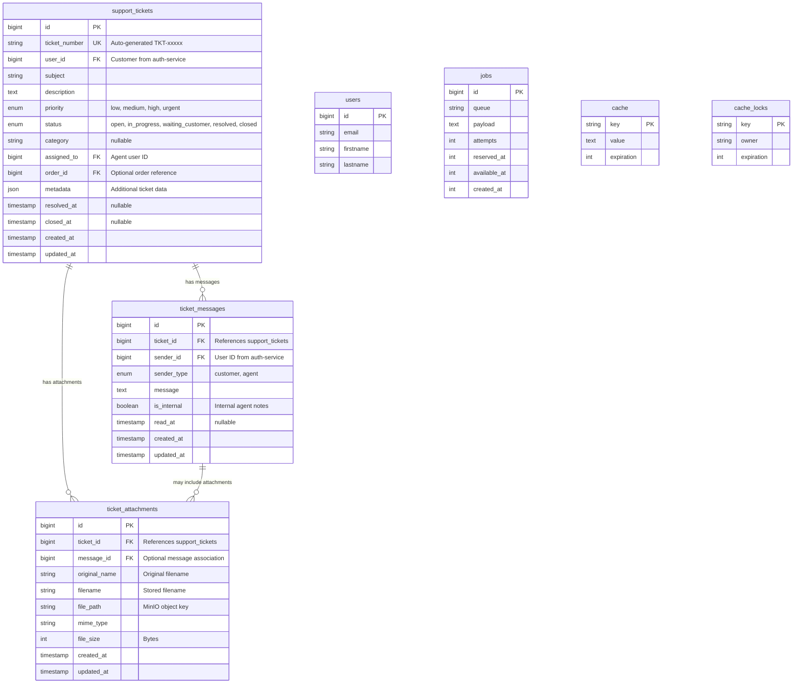
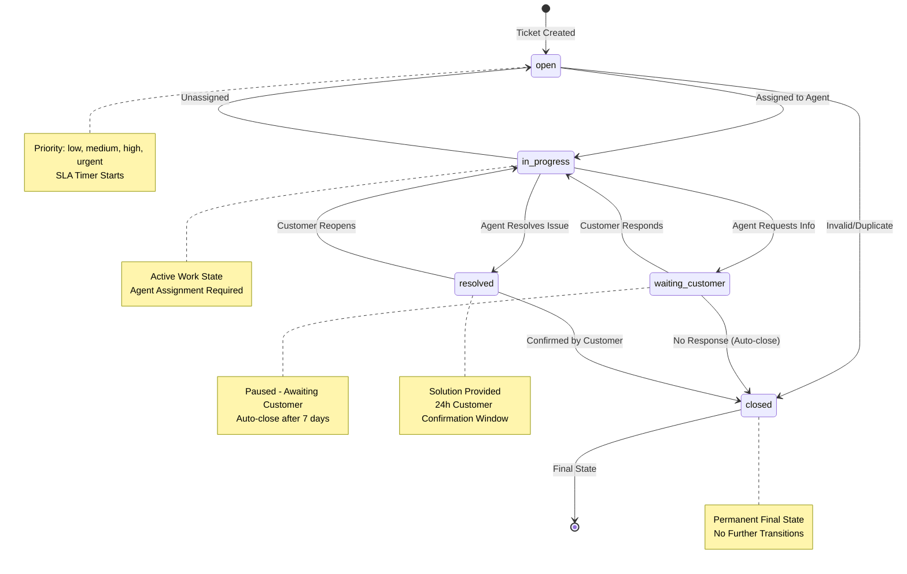

# SAV Service Database Documentation

## Table of Contents
- [Overview](#overview)
- [Database Configuration](#database-configuration)
- [Entity Relationship Diagram](#entity-relationship-diagram)
- [Table Specifications](#table-specifications)
- [Ticket Status State Machine](#ticket-status-state-machine)
- [Priority System and SLA](#priority-system-and-sla)
- [MinIO Integration](#minio-integration)
- [RabbitMQ Events Published](#rabbitmq-events-published)
- [Cross-Service Relationships](#cross-service-relationships)
- [Indexes and Performance](#indexes-and-performance)
- [Security Considerations](#security-considerations)
- [Backup and Maintenance](#backup-and-maintenance)

## Overview

The sav-service (Service Apres-Vente / Customer Service) manages customer support tickets, messages, and attachments for the e-commerce platform. It provides comprehensive ticket lifecycle management from creation to resolution and closure.

**Service Details:**
- Database Name: `sav_service_db`
- External Port: 3322 (for debugging and database clients)
- Container Port: 3306
- Service Port: 8008
- Framework: Laravel 12 with PHP 8.3+
- Storage: MinIO S3-compatible storage (bucket: 'sav')

**Primary Responsibilities:**
- Customer support ticket management
- Multi-party conversation threading (customer and agent)
- File attachment handling via MinIO object storage
- Priority-based SLA tracking
- Ticket assignment and agent workload distribution
- Internal notes and public responses
- Order-related support ticket tracking
- Real-time status updates via RabbitMQ events

## Database Configuration

**Connection Details (from .env):**
```env
DB_CONNECTION=mysql
DB_HOST=sav-db
DB_PORT=3306
DB_DATABASE=sav_service_db
DB_USERNAME=root
DB_PASSWORD=root

# External access for debugging
EXTERNAL_PORT=3322
```

**Docker Service Configuration:**
```yaml
sav-mysql:
  image: mysql:8.0
  ports:
    - "3322:3306"
  environment:
    MYSQL_DATABASE: sav_service_db
    MYSQL_ROOT_PASSWORD: root_password
```

**Character Set and Collation:**
```sql
CHARACTER SET: utf8mb4
COLLATION: utf8mb4_unicode_ci
```

## Entity Relationship Diagram



## Table Specifications

### support_tickets

Primary table managing customer support tickets with complete lifecycle tracking.

**Columns:**

| Column | Type | Constraints | Description |
|--------|------|-------------|-------------|
| id | BIGINT UNSIGNED | PRIMARY KEY, AUTO_INCREMENT | Unique ticket identifier |
| ticket_number | VARCHAR(255) | UNIQUE, NOT NULL | Human-readable ticket reference (TKT-xxxxx) |
| user_id | BIGINT UNSIGNED | NOT NULL, INDEXED | Customer ID from auth-service |
| subject | VARCHAR(255) | NOT NULL | Ticket subject line |
| description | TEXT | NOT NULL | Detailed problem description |
| priority | ENUM | NOT NULL, DEFAULT 'medium', INDEXED | low, medium, high, urgent |
| status | ENUM | NOT NULL, DEFAULT 'open', INDEXED | open, in_progress, waiting_customer, resolved, closed |
| category | VARCHAR(255) | NULLABLE | Ticket categorization (e.g., 'billing', 'shipping', 'product') |
| assigned_to | BIGINT UNSIGNED | NULLABLE, INDEXED | Agent user ID responsible for ticket |
| order_id | BIGINT UNSIGNED | NULLABLE, INDEXED | Related order from orders-service |
| metadata | JSON | NULLABLE | Additional structured data (tags, custom fields) |
| resolved_at | TIMESTAMP | NULLABLE | When ticket was marked resolved |
| closed_at | TIMESTAMP | NULLABLE | When ticket was permanently closed |
| created_at | TIMESTAMP | NOT NULL | Ticket creation timestamp |
| updated_at | TIMESTAMP | NOT NULL | Last modification timestamp |

**Indexes:**
- PRIMARY KEY (id)
- UNIQUE (ticket_number)
- INDEX (user_id) - Fast customer ticket lookup
- INDEX (status) - Filter tickets by status
- INDEX (priority) - Priority-based querying
- INDEX (assigned_to) - Agent workload queries
- INDEX (order_id) - Order-related ticket lookup

**Business Rules:**
- Ticket number auto-generated on creation: `TKT-{UNIQUE_ID}`
- Priority determines SLA response time expectations
- Status transitions follow state machine (see diagram below)
- resolved_at automatically set when status changes to 'resolved'
- closed_at automatically set when status changes to 'closed'
- assigned_to triggers status change to 'in_progress' if currently 'open'

### ticket_messages

Conversation thread for tickets supporting both public customer messages and internal agent notes.

**Columns:**

| Column | Type | Constraints | Description |
|--------|------|-------------|-------------|
| id | BIGINT UNSIGNED | PRIMARY KEY, AUTO_INCREMENT | Unique message identifier |
| ticket_id | BIGINT UNSIGNED | FOREIGN KEY, NOT NULL, INDEXED | Parent ticket reference |
| sender_id | BIGINT UNSIGNED | NOT NULL, INDEXED | User ID from auth-service |
| sender_type | ENUM | NOT NULL | customer, agent |
| message | TEXT | NOT NULL | Message content |
| is_internal | BOOLEAN | NOT NULL, DEFAULT false | Internal agent notes (not visible to customer) |
| read_at | TIMESTAMP | NULLABLE | When message was read by recipient |
| created_at | TIMESTAMP | NOT NULL | Message creation timestamp |
| updated_at | TIMESTAMP | NOT NULL | Last modification timestamp |

**Foreign Keys:**
- ticket_id REFERENCES support_tickets(id) ON DELETE CASCADE

**Indexes:**
- PRIMARY KEY (id)
- INDEX (ticket_id) - Fast message lookup by ticket
- INDEX (sender_id) - Sender-based queries

**Business Rules:**
- is_internal=true messages only visible to agents
- New customer message triggers status change from 'waiting_customer' to 'in_progress'
- read_at tracks message acknowledgment for unread count calculations
- Cascade delete when parent ticket is deleted

### ticket_attachments

File attachments associated with tickets or specific messages, stored in MinIO object storage.

**Columns:**

| Column | Type | Constraints | Description |
|--------|------|-------------|-------------|
| id | BIGINT UNSIGNED | PRIMARY KEY, AUTO_INCREMENT | Unique attachment identifier |
| ticket_id | BIGINT UNSIGNED | FOREIGN KEY, NOT NULL, INDEXED | Parent ticket reference |
| message_id | BIGINT UNSIGNED | FOREIGN KEY, NULLABLE, INDEXED | Optional message association |
| original_name | VARCHAR(255) | NOT NULL | Original uploaded filename |
| filename | VARCHAR(255) | NOT NULL | Sanitized stored filename |
| file_path | VARCHAR(255) | NOT NULL | MinIO object storage key/path |
| mime_type | VARCHAR(255) | NOT NULL | File MIME type |
| file_size | INT UNSIGNED | NOT NULL | File size in bytes |
| created_at | TIMESTAMP | NOT NULL | Upload timestamp |
| updated_at | TIMESTAMP | NOT NULL | Last modification timestamp |

**Foreign Keys:**
- ticket_id REFERENCES support_tickets(id) ON DELETE CASCADE
- message_id REFERENCES ticket_messages(id) ON DELETE CASCADE

**Indexes:**
- PRIMARY KEY (id)
- INDEX (ticket_id) - Fast attachment lookup by ticket
- INDEX (message_id) - Message-specific attachments

**Business Rules:**
- Files physically stored in MinIO bucket 'sav'
- file_path contains MinIO object key for retrieval
- Supported MIME types validated on upload (see MinIO Integration section)
- Model boot hook deletes MinIO object when record is deleted
- Maximum file size enforced (configurable, default 10MB)
- message_id nullable allows ticket-level attachments not tied to specific message

### Laravel Standard Tables

**users:** Minimal user reference table (synced from auth-service)
- id, email, firstname, lastname

**jobs:** Laravel queue jobs table for asynchronous processing
- id, queue, payload, attempts, reserved_at, available_at, created_at

**cache:** Laravel cache storage
- key, value, expiration

**cache_locks:** Laravel cache locks for atomic operations
- key, owner, expiration

## Ticket Status State Machine

The ticket lifecycle follows a strict state machine with defined transitions:



**State Definitions:**

1. **open**: Initial state when ticket is created
   - Awaiting agent assignment
   - SLA timer begins
   - Visible in unassigned queue

2. **in_progress**: Active work by assigned agent
   - Agent actively investigating/resolving
   - Can transition to waiting_customer or resolved
   - Agent assignment required for this state

3. **waiting_customer**: Awaiting customer response
   - Agent requested additional information
   - SLA timer paused
   - Auto-closes after 7 days of inactivity

4. **resolved**: Solution provided, awaiting confirmation
   - Agent marked ticket as resolved
   - 24-hour customer confirmation window
   - Auto-closes if no response or reopening

5. **closed**: Final permanent state
   - No further state transitions allowed
   - Historical record maintained
   - Can be referenced but not modified

**Transition Triggers:**

| From State | To State | Trigger | Automated |
|------------|----------|---------|-----------|
| open | in_progress | Agent assignment | Yes |
| open | closed | Marked invalid/duplicate | No |
| in_progress | waiting_customer | Agent requests info | No |
| in_progress | resolved | Agent provides solution | No |
| waiting_customer | in_progress | Customer responds | Yes |
| waiting_customer | closed | 7 days no response | Yes |
| resolved | closed | Customer confirms or 24h timeout | Yes/No |
| resolved | in_progress | Customer reopens | No |

## Priority System and SLA

Support tickets use a 4-level priority system with corresponding SLA (Service Level Agreement) targets.

**Priority Levels:**

| Priority | Label | Response SLA | Resolution SLA | Description |
|----------|-------|--------------|----------------|-------------|
| low | Low | 48 hours | 7 days | General inquiries, minor issues |
| medium | Medium | 24 hours | 3 days | Standard support requests (default) |
| high | High | 4 hours | 1 day | Significant impact on customer |
| urgent | Urgent | 1 hour | 4 hours | Critical issues, payment failures, order blocks |

**SLA Timer Rules:**

1. **Start Time**: Ticket creation timestamp (created_at)
2. **Pause Conditions**: Status = 'waiting_customer' (paused until customer responds)
3. **Business Hours**: 24/7 continuous (no business hour adjustments)
4. **Stop Conditions**: Status reaches 'resolved' or 'closed'

**SLA Breach Handling:**
- Automated escalation notifications via RabbitMQ events
- Priority auto-upgrade if response SLA breached (e.g., medium -> high)
- Dashboard visibility for managers to monitor SLA compliance
- Historical SLA breach data tracked in metadata JSON field

**Priority Assignment Logic:**

Default priority is 'medium'. Auto-upgrade to higher priority based on:
- Order value > 500 EUR: high
- Payment failure tickets: urgent
- VIP customer flag: +1 priority level
- Repeat issue (>3 tickets same category): high
- Agent manual override always permitted

## MinIO Integration

The SAV service uses MinIO S3-compatible object storage for ticket attachment management.

**Bucket Configuration:**
- Bucket Name: `sav`
- Region: us-east-1
- Access: Private (presigned URLs for temporary access)
- Versioning: Enabled
- Lifecycle: No auto-deletion (manual management)

**MinIO Connection:**
```env
AWS_ACCESS_KEY_ID=admin
AWS_SECRET_ACCESS_KEY=adminpass123
AWS_DEFAULT_REGION=us-east-1
AWS_BUCKET=sav
AWS_ENDPOINT=http://minio:9000
AWS_USE_PATH_STYLE_ENDPOINT=true
```

**File Upload Workflow:**

1. **Client Request**: Upload request with file to SAV service API
2. **Validation**: Check file type, size, and scan for malware
3. **Sanitization**: Generate safe filename, preserve original_name
4. **Storage**: Upload to MinIO bucket with structured path
5. **Database Record**: Create ticket_attachments record with MinIO path
6. **Response**: Return attachment ID and presigned URL for access

**File Path Structure:**
```
sav/
├── tickets/
│   ├── {ticket_id}/
│   │   ├── {filename_hash}.{extension}
│   │   └── ...
│   └── ...
└── temp/
    └── {upload_session_id}/
```

**Allowed File Types:**

| Category | MIME Types | Max Size |
|----------|------------|----------|
| Images | image/jpeg, image/png, image/gif, image/webp | 5 MB |
| Documents | application/pdf | 10 MB |
| Office | application/msword, .docx, .xlsx, text/csv | 10 MB |
| Text | text/plain | 2 MB |
| Archives | application/zip (restricted) | 20 MB |

**Blocked File Types:**
- Executables: .exe, .bat, .sh, .cmd
- Scripts: .js, .php, .py (except in archives)
- Dangerous formats: .iso, .dmg, .app

**Security Measures:**
1. **File Type Validation**: Verify MIME type matches file extension
2. **Virus Scanning**: Optional ClamAV integration for uploaded files
3. **Presigned URLs**: Temporary access URLs (15-minute expiration)
4. **Access Control**: URLs validated against user_id authorization
5. **Content Disposition**: Force download for unknown file types

**Presigned URL Generation:**
```php
// Generate 15-minute temporary access URL
$url = Storage::disk('s3')->temporaryUrl(
    $attachment->file_path,
    now()->addMinutes(15)
);
```

**Attachment Deletion:**
- Database delete triggers MinIO object deletion via model boot hook
- Orphan cleanup job runs weekly to remove unused MinIO objects
- Soft-delete support: Mark as deleted but preserve file for 30 days

## RabbitMQ Events Published

The SAV service publishes events to RabbitMQ for cross-service coordination and notification.

**Exchange Configuration:**
- Exchange: `sav_exchange`
- Type: topic
- Durable: true

**Published Events:**

### TicketCreated
Published when a new support ticket is created.

**Routing Key:** `sav.ticket.created`

**Payload:**
```json
{
  "event": "TicketCreated",
  "timestamp": "2025-10-03T10:30:00Z",
  "data": {
    "ticket_id": 123,
    "ticket_number": "TKT-ABC123",
    "user_id": 456,
    "subject": "Order not received",
    "priority": "high",
    "status": "open",
    "order_id": 789,
    "category": "shipping"
  }
}
```

**Consumers:**
- **notifications-service**: Send confirmation email to customer
- **analytics-service**: Track support volume metrics

### TicketAssigned
Published when a ticket is assigned to an agent.

**Routing Key:** `sav.ticket.assigned`

**Payload:**
```json
{
  "event": "TicketAssigned",
  "timestamp": "2025-10-03T10:35:00Z",
  "data": {
    "ticket_id": 123,
    "ticket_number": "TKT-ABC123",
    "assigned_to": 10,
    "assigned_by": 5,
    "previous_status": "open",
    "new_status": "in_progress"
  }
}
```

**Consumers:**
- **notifications-service**: Notify assigned agent
- **analytics-service**: Track agent workload

### TicketStatusChanged
Published on any ticket status transition.

**Routing Key:** `sav.ticket.status_changed`

**Payload:**
```json
{
  "event": "TicketStatusChanged",
  "timestamp": "2025-10-03T11:00:00Z",
  "data": {
    "ticket_id": 123,
    "ticket_number": "TKT-ABC123",
    "user_id": 456,
    "previous_status": "in_progress",
    "new_status": "waiting_customer",
    "changed_by": 10,
    "reason": "Requested additional shipping information"
  }
}
```

**Consumers:**
- **notifications-service**: Notify customer of status change
- **analytics-service**: Track ticket lifecycle metrics

### TicketResolved
Published when a ticket is marked as resolved.

**Routing Key:** `sav.ticket.resolved`

**Payload:**
```json
{
  "event": "TicketResolved",
  "timestamp": "2025-10-03T12:00:00Z",
  "data": {
    "ticket_id": 123,
    "ticket_number": "TKT-ABC123",
    "user_id": 456,
    "resolved_by": 10,
    "resolution_time_minutes": 90,
    "sla_met": true,
    "category": "shipping"
  }
}
```

**Consumers:**
- **notifications-service**: Send resolution confirmation to customer
- **analytics-service**: Calculate SLA compliance and agent performance

### MessageAdded
Published when a new message is added to a ticket.

**Routing Key:** `sav.ticket.message_added`

**Payload:**
```json
{
  "event": "MessageAdded",
  "timestamp": "2025-10-03T10:45:00Z",
  "data": {
    "ticket_id": 123,
    "ticket_number": "TKT-ABC123",
    "message_id": 567,
    "sender_id": 10,
    "sender_type": "agent",
    "is_internal": false,
    "has_attachments": true,
    "attachment_count": 2
  }
}
```

**Consumers:**
- **notifications-service**: Real-time notification to customer or agent
- **websocket-service**: Push notification for live updates

### TicketSLABreach
Published when a ticket breaches SLA thresholds.

**Routing Key:** `sav.ticket.sla_breach`

**Payload:**
```json
{
  "event": "TicketSLABreach",
  "timestamp": "2025-10-03T13:00:00Z",
  "data": {
    "ticket_id": 123,
    "ticket_number": "TKT-ABC123",
    "priority": "high",
    "sla_type": "response",
    "expected_minutes": 240,
    "actual_minutes": 300,
    "assigned_to": 10
  }
}
```

**Consumers:**
- **notifications-service**: Escalation alert to managers
- **analytics-service**: SLA compliance tracking

## Cross-Service Relationships

The SAV service has foreign key references to other microservices via RabbitMQ synchronization.

**External References:**

### auth-service
- **support_tickets.user_id**: Customer who created ticket
- **support_tickets.assigned_to**: Agent user ID handling ticket
- **ticket_messages.sender_id**: User who sent message

**Synchronization:**
- User creation/update events consumed from auth-service
- Minimal user data cached locally (id, email, firstname, lastname)
- JWT token validation for authenticated requests

### orders-service
- **support_tickets.order_id**: Related order for order-specific issues

**Synchronization:**
- Order events consumed for context (order delivered, payment failed)
- Order ID validation before ticket creation
- Order details enrichment in ticket metadata

**Data Consistency:**
- User and order references validated via RabbitMQ queries
- Soft references (no database foreign keys to external services)
- Graceful degradation if external service unavailable
- Periodic reconciliation jobs for data consistency

**Example Ticket Creation Flow:**
1. Customer creates ticket via API with order_id
2. SAV service validates order_id via RabbitMQ request to orders-service
3. If valid, ticket created with order metadata enrichment
4. TicketCreated event published for cross-service notification
5. notifications-service sends confirmation email using auth-service user data

## Indexes and Performance

**Query Optimization:**

The database schema includes strategic indexes for common query patterns:

1. **Customer Ticket Lookup**
   - Index: support_tickets(user_id)
   - Query: "Show all tickets for customer X"
   - Performance: O(log n) index scan

2. **Status-Based Filtering**
   - Index: support_tickets(status)
   - Query: "List all open tickets" or "Show in_progress tickets"
   - Performance: Fast status filtering for dashboard views

3. **Priority Queue**
   - Index: support_tickets(priority)
   - Query: "Get urgent tickets" or "Order by priority"
   - Performance: Efficient priority-based sorting

4. **Agent Workload**
   - Index: support_tickets(assigned_to)
   - Query: "Show tickets assigned to agent X"
   - Performance: Fast agent-specific queries

5. **Order-Related Tickets**
   - Index: support_tickets(order_id)
   - Query: "Find all tickets for order Y"
   - Performance: Quick order-ticket correlation

6. **Ticket Conversation Threading**
   - Index: ticket_messages(ticket_id)
   - Query: "Load all messages for ticket Z"
   - Performance: Fast message retrieval for conversation view

7. **Attachment Retrieval**
   - Index: ticket_attachments(ticket_id, message_id)
   - Query: "Get attachments for ticket or specific message"
   - Performance: Efficient attachment loading

**Composite Index Opportunities:**

For advanced query patterns, consider adding:
- `support_tickets(status, priority)` - Status-filtered priority queues
- `support_tickets(assigned_to, status)` - Agent workload by status
- `ticket_messages(ticket_id, created_at)` - Chronological message ordering

**Query Performance Targets:**
- Single ticket lookup: < 5ms
- Ticket list (50 records): < 50ms
- Message thread load: < 20ms
- Full-text search (future): < 200ms

**Monitoring:**
- Slow query log enabled (queries > 100ms)
- Query execution plan analysis for N+1 prevention
- Redis cache for frequently accessed tickets

## Security Considerations

**Authentication and Authorization:**
1. **JWT Token Validation**: All requests validate JWT from auth-service
2. **Role-Based Access**: Customers see only own tickets, agents see assigned tickets
3. **Admin Access**: Full ticket visibility restricted to admin role
4. **API Rate Limiting**: 60 requests per minute per user

**Data Protection:**
1. **PII Encryption**: Sensitive data in metadata JSON encrypted at rest
2. **Secure Attachments**: MinIO presigned URLs with 15-minute expiration
3. **SQL Injection Prevention**: Eloquent ORM parameterized queries
4. **XSS Protection**: Message content sanitized before storage and display

**Audit Trail:**
- All status changes logged in metadata JSON
- Agent actions recorded with user_id and timestamp
- File access logged for compliance (who accessed which attachment)

**GDPR Compliance:**
- User deletion cascade deletes all tickets and messages
- Right to access: Export endpoint for user's ticket history
- Data retention: Closed tickets retained for 7 years (configurable)

## Backup and Maintenance

**Database Backup Strategy:**
```bash
# Daily automated backup
docker-compose exec mysql mysqldump -u root -proot_password sav_service_db > backups/sav_$(date +%Y%m%d).sql

# Incremental binlog backup every 6 hours
docker-compose exec mysql mysqlbinlog /var/lib/mysql/binlog > backups/sav_binlog_$(date +%Y%m%d_%H%M).log
```

**MinIO Backup:**
- Weekly full bucket snapshot via `mc mirror` to backup region
- Versioning enabled for file recovery
- Orphan file cleanup job removes unlinked attachments

**Maintenance Tasks:**

1. **Weekly Jobs:**
   - Orphan attachment cleanup (MinIO objects without DB record)
   - SLA breach audit and reporting
   - Cache table cleanup (old entries removed)

2. **Monthly Jobs:**
   - Database optimization (ANALYZE TABLE, OPTIMIZE TABLE)
   - Archive old closed tickets (>1 year) to cold storage
   - Aggregate analytics data export

3. **On-Demand:**
   - Ticket merge (duplicate ticket consolidation)
   - Bulk status update for mass changes
   - Data export for customer requests

**Monitoring Checklist:**
- [ ] Database connection pool utilization
- [ ] Table size growth rate
- [ ] Index usage statistics
- [ ] Slow query identification
- [ ] MinIO storage capacity
- [ ] RabbitMQ message delivery rates
- [ ] SLA compliance metrics

**Recovery Procedures:**
1. **Database Corruption**: Restore from last automated backup, replay binlog
2. **Accidental Deletion**: Restore specific tickets from backup using ticket_id
3. **MinIO Data Loss**: Restore from weekly bucket snapshot
4. **Service Outage**: RabbitMQ message queue retains unprocessed events

---

**Document Version:** 1.0
**Last Updated:** 2025-10-03
**Maintainer:** DevOps Team
**Review Cycle:** Quarterly
