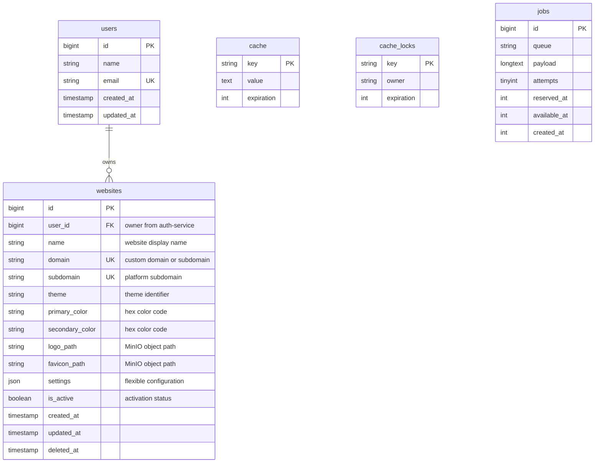

# Websites Service Database Documentation

## Table of Contents
- [Overview](#overview)
- [Database Configuration](#database-configuration)
- [Entity Relationship Diagram](#entity-relationship-diagram)
- [Table Specifications](#table-specifications)
- [Multi-Tenant Architecture](#multi-tenant-architecture)
- [Theme and Branding System](#theme-and-branding-system)
- [Settings Configuration](#settings-configuration)
- [RabbitMQ Events Published](#rabbitmq-events-published)
- [Cross-Service Relationships](#cross-service-relationships)
- [Indexes and Performance](#indexes-and-performance)
- [Security Considerations](#security-considerations)
- [Backup and Maintenance](#backup-and-maintenance)

## Overview

The websites-service manages multi-tenant B2B SaaS website configurations, enabling each business client to have their own customized e-commerce website with unique branding, domains, and settings. This service is the foundation of the multi-tenant architecture, where each client operates their own independent online store.

**Service Details:**
- Database Name: `websites_service_db`
- External Port: 3325 (for debugging and database clients)
- Container Port: 3306
- Service Port: 8012
- Framework: Laravel 12 with PHP 8.3+
- Architecture Pattern: Multi-tenant B2B SaaS

**Primary Responsibilities:**
- Website instance creation and management for B2B clients
- Domain and subdomain configuration (custom domains or platform subdomains)
- Theme and branding customization per website
- Flexible settings storage via JSON configuration
- Website activation and lifecycle management
- Cross-service website context propagation via RabbitMQ

**Multi-Tenant Model:**
Each B2B client receives one dedicated website instance with:
- Unique domain (custom domain or platform subdomain)
- Independent theme and branding
- Custom configuration settings
- Isolated customer data and catalog

## Database Configuration

**Connection Details (from .env):**
```env
DB_CONNECTION=mysql
DB_HOST=websites-mysql
DB_PORT=3306
DB_DATABASE=websites_service_db
DB_USERNAME=websites_user
DB_PASSWORD=websites_password

# External access for debugging
EXTERNAL_PORT=3325
```

**Docker Service Configuration:**
```yaml
websites-mysql:
  image: mysql:8.0
  ports:
    - "3325:3306"
  environment:
    MYSQL_DATABASE: websites_service_db
    MYSQL_USER: websites_user
    MYSQL_PASSWORD: websites_password
    MYSQL_ROOT_PASSWORD: root_password
```

**Character Set and Collation:**
```sql
CHARACTER SET: utf8mb4
COLLATION: utf8mb4_unicode_ci
```

## Entity Relationship Diagram



## Table Specifications

### websites

**Purpose:** Core table storing website configurations for each B2B client.

**Columns:**
| Column | Type | Nullable | Default | Description |
|--------|------|----------|---------|-------------|
| id | BIGINT UNSIGNED | NO | AUTO_INCREMENT | Primary key |
| user_id | BIGINT UNSIGNED | NO | - | Owner reference (auth-service user) |
| name | VARCHAR(255) | NO | - | Website display name |
| domain | VARCHAR(255) | NO | - | Custom domain or platform subdomain |
| subdomain | VARCHAR(255) | NO | - | Platform subdomain (e.g., clientname.platform.com) |
| theme | VARCHAR(100) | YES | 'default' | Theme identifier |
| primary_color | VARCHAR(7) | YES | '#000000' | Primary brand color (hex) |
| secondary_color | VARCHAR(7) | YES | '#FFFFFF' | Secondary brand color (hex) |
| logo_path | VARCHAR(500) | YES | NULL | MinIO logo path |
| favicon_path | VARCHAR(500) | YES | NULL | MinIO favicon path |
| settings | JSON | YES | NULL | Flexible configuration storage |
| is_active | BOOLEAN | NO | TRUE | Website activation status |
| created_at | TIMESTAMP | YES | NULL | Creation timestamp |
| updated_at | TIMESTAMP | YES | NULL | Last update timestamp |
| deleted_at | TIMESTAMP | YES | NULL | Soft delete timestamp |

**Indexes:**
- PRIMARY KEY: `id`
- UNIQUE KEY: `domain` (ensures domain uniqueness)
- UNIQUE KEY: `subdomain` (ensures subdomain uniqueness)
- INDEX: `user_id` (foreign key relationship)
- INDEX: `is_active` (active website filtering)
- INDEX: `created_at` (chronological queries)
- INDEX: `deleted_at` (soft delete queries)

**Constraints:**
- `user_id` references auth-service users (logical foreign key)
- `domain` must be unique across all websites
- `subdomain` must be unique across all websites
- Either `domain` or `subdomain` must be set

### users

**Purpose:** Laravel authentication table (standard).

**Columns:**
| Column | Type | Nullable | Default | Description |
|--------|------|----------|---------|-------------|
| id | BIGINT UNSIGNED | NO | AUTO_INCREMENT | Primary key |
| name | VARCHAR(255) | NO | - | User full name |
| email | VARCHAR(255) | NO | - | Email address |
| email_verified_at | TIMESTAMP | YES | NULL | Email verification timestamp |
| password | VARCHAR(255) | NO | - | Hashed password |
| remember_token | VARCHAR(100) | YES | NULL | Remember me token |
| created_at | TIMESTAMP | YES | NULL | Creation timestamp |
| updated_at | TIMESTAMP | YES | NULL | Last update timestamp |

**Indexes:**
- PRIMARY KEY: `id`
- UNIQUE KEY: `email`

### cache

**Purpose:** Laravel cache storage (standard).

**Columns:**
| Column | Type | Nullable | Default | Description |
|--------|------|----------|---------|-------------|
| key | VARCHAR(255) | NO | - | Cache key |
| value | MEDIUMTEXT | NO | - | Cached value |
| expiration | INT | NO | - | Expiration timestamp |

**Indexes:**
- PRIMARY KEY: `key`

### cache_locks

**Purpose:** Laravel cache locking mechanism (standard).

**Columns:**
| Column | Type | Nullable | Default | Description |
|--------|------|----------|---------|-------------|
| key | VARCHAR(255) | NO | - | Lock key |
| owner | VARCHAR(255) | NO | - | Lock owner |
| expiration | INT | NO | - | Expiration timestamp |

**Indexes:**
- PRIMARY KEY: `key`

### jobs

**Purpose:** Laravel queue job storage (standard).

**Columns:**
| Column | Type | Nullable | Default | Description |
|--------|------|----------|---------|-------------|
| id | BIGINT UNSIGNED | NO | AUTO_INCREMENT | Primary key |
| queue | VARCHAR(255) | NO | - | Queue name |
| payload | LONGTEXT | NO | - | Job payload |
| attempts | TINYINT UNSIGNED | NO | - | Attempt count |
| reserved_at | INT UNSIGNED | YES | NULL | Reservation timestamp |
| available_at | INT UNSIGNED | NO | - | Availability timestamp |
| created_at | INT UNSIGNED | NO | - | Creation timestamp |

**Indexes:**
- PRIMARY KEY: `id`
- INDEX: `queue`

## Multi-Tenant Architecture

The websites-service implements a B2B SaaS multi-tenant model where each business client receives a dedicated website instance.

### Tenant Isolation Model

**One Website Per B2B Client:**
```
Client A -> Website 1 (clienta.platform.com or clienta.com)
  - Unique branding
  - Independent customer base
  - Separate product catalog context
  - Custom domain support

Client B -> Website 2 (clientb.platform.com or custom.domain.com)
  - Different branding
  - Isolated customer data
  - Separate configuration
  - Custom domain support
```

### Domain Configuration Strategies

**Strategy 1: Platform Subdomain**
```
subdomain: "clienta"
domain: "clienta.platform.com"
DNS: CNAME pointing to platform infrastructure
SSL: Wildcard certificate (*.platform.com)
```

**Strategy 2: Custom Domain**
```
subdomain: "clienta" (fallback)
domain: "www.clientdomain.com"
DNS: A record pointing to platform IP
SSL: Per-domain certificate (Let's Encrypt)
```

**Strategy 3: Hybrid (Both Active)**
```
subdomain: "clienta.platform.com" (primary)
domain: "www.clientdomain.com" (alias)
Redirect: Custom domain -> Platform subdomain (SEO)
```

### Tenant Context Propagation

When a request arrives at the API Gateway:
1. Extract domain from HTTP Host header
2. Query websites-service for website by domain
3. Inject website context into RabbitMQ message
4. All downstream services receive website_id for tenant isolation

**Example RabbitMQ Message:**
```json
{
  "event": "order.created",
  "website_id": 42,
  "website_context": {
    "domain": "clienta.platform.com",
    "theme": "modern-retail",
    "branding": {
      "primary_color": "#3B82F6",
      "logo_url": "https://minio.platform.com/products/logos/clienta.png"
    }
  },
  "payload": {
    "order_id": 1234,
    "customer_id": 567
  }
}
```

## Theme and Branding System

Each website has customizable visual identity to match the B2B client's brand.

### Theme Selection

**Predefined Themes:**
- `default`: Platform default theme
- `modern-retail`: Clean modern e-commerce design
- `classic-shop`: Traditional online store layout
- `minimal-boutique`: Minimalist high-end design
- `corporate-b2b`: Business-oriented catalog

**Theme Structure:**
```json
{
  "theme": "modern-retail",
  "version": "2.1.0",
  "layout": "grid",
  "fonts": {
    "primary": "Inter",
    "secondary": "Roboto"
  }
}
```

### Color Branding

**Primary and Secondary Colors:**
```php
// Stored as hex color codes
'primary_color' => '#3B82F6',   // Brand primary (buttons, links)
'secondary_color' => '#1E293B', // Brand secondary (headings, accents)
```

**Color Application:**
- Primary: Call-to-action buttons, links, active states
- Secondary: Headings, borders, secondary UI elements
- Generated palette: System auto-generates shades and tints

### Logo and Favicon Storage

**MinIO Integration:**
```
Bucket: products (shared with product images)
Path structure:
  /websites/logos/{website_id}/{filename}
  /websites/favicons/{website_id}/{filename}

Example:
  logo_path: "/websites/logos/42/logo-clienta.png"
  favicon_path: "/websites/favicons/42/favicon.ico"
```

**Supported Formats:**
- Logo: PNG, SVG, JPEG (recommended: SVG for scalability)
- Favicon: ICO, PNG (16x16, 32x32, 192x192 for different contexts)

**Presigned URLs:**
Logos and favicons served via MinIO presigned URLs with configurable expiration.

## Settings Configuration

The `settings` JSON column provides flexible configuration storage for website-specific options.

### Settings Schema

**Example Configuration:**
```json
{
  "general": {
    "site_title": "Client A Online Store",
    "tagline": "Quality Products Delivered",
    "timezone": "America/New_York",
    "language": "en",
    "currency": "USD"
  },
  "contact": {
    "support_email": "support@clienta.com",
    "phone": "+1-555-0100",
    "address": "123 Business St, City, State 12345"
  },
  "features": {
    "enable_blog": true,
    "enable_reviews": true,
    "enable_wishlist": false,
    "enable_live_chat": true
  },
  "seo": {
    "meta_description": "Shop quality products at Client A",
    "meta_keywords": "online store, products, shopping",
    "google_analytics_id": "UA-123456789-1",
    "facebook_pixel_id": "123456789"
  },
  "checkout": {
    "require_account": false,
    "guest_checkout": true,
    "default_shipping_method": "standard"
  },
  "email": {
    "from_name": "Client A Store",
    "from_email": "noreply@clienta.com",
    "smtp_override": null
  },
  "integrations": {
    "payment_gateway": "stripe",
    "shipping_provider": "shippo",
    "crm": "salesforce"
  },
  "advanced": {
    "maintenance_mode": false,
    "debug_mode": false,
    "custom_css": "",
    "custom_js": "",
    "robots_txt": "User-agent: *\nAllow: /"
  }
}
```

### Settings Access Patterns

**Laravel Model Casting:**
```php
protected $casts = [
    'settings' => 'array',
];

// Access settings
$website->settings['general']['currency'];  // "USD"
$website->settings['features']['enable_blog'];  // true
```

**Default Settings:**
New websites created with sensible defaults, overridable by client.

### Settings Validation

**Validation Rules:**
- Currency: Must be valid ISO 4217 code
- Timezone: Must be valid PHP timezone identifier
- Language: Must be supported locale
- Email: Must be valid email format
- Colors: Must be valid hex color codes

## RabbitMQ Events Published

The websites-service publishes events to notify other services of website lifecycle changes.

### WebsiteCreated

**Published when:** New website is created for B2B client.

**Exchange:** `websites.events`
**Routing Key:** `website.created`

**Payload:**
```json
{
  "event": "website.created",
  "timestamp": "2025-10-03T14:30:00Z",
  "data": {
    "website_id": 42,
    "user_id": 123,
    "name": "Client A Store",
    "domain": "clienta.platform.com",
    "subdomain": "clienta",
    "theme": "modern-retail",
    "is_active": true,
    "created_at": "2025-10-03T14:30:00Z"
  }
}
```

**Consuming Services:**
- **orders-service**: Create website context for order processing
- **products-service**: Initialize product catalog context
- **newsletters-service**: Set up email templates with branding

### WebsiteActivated

**Published when:** Website is activated (made publicly accessible).

**Exchange:** `websites.events`
**Routing Key:** `website.activated`

**Payload:**
```json
{
  "event": "website.activated",
  "timestamp": "2025-10-03T15:00:00Z",
  "data": {
    "website_id": 42,
    "domain": "clienta.platform.com",
    "activated_at": "2025-10-03T15:00:00Z"
  }
}
```

**Consuming Services:**
- **api-gateway**: Enable routing for domain
- **deliveries-service**: Activate delivery options for website
- **sav-service**: Enable customer support for website

### WebsiteDeactivated

**Published when:** Website is deactivated (maintenance or suspension).

**Exchange:** `websites.events`
**Routing Key:** `website.deactivated`

**Payload:**
```json
{
  "event": "website.deactivated",
  "timestamp": "2025-10-03T16:00:00Z",
  "data": {
    "website_id": 42,
    "domain": "clienta.platform.com",
    "reason": "maintenance",
    "deactivated_at": "2025-10-03T16:00:00Z"
  }
}
```

**Consuming Services:**
- **api-gateway**: Display maintenance page
- **orders-service**: Pause order processing
- **newsletters-service**: Pause automated emails

### DomainChanged

**Published when:** Website domain or subdomain is updated.

**Exchange:** `websites.events`
**Routing Key:** `website.domain.changed`

**Payload:**
```json
{
  "event": "website.domain.changed",
  "timestamp": "2025-10-03T17:00:00Z",
  "data": {
    "website_id": 42,
    "old_domain": "clienta.platform.com",
    "new_domain": "www.clientdomain.com",
    "old_subdomain": "clienta",
    "new_subdomain": "clienta",
    "changed_at": "2025-10-03T17:00:00Z"
  }
}
```

**Consuming Services:**
- **api-gateway**: Update routing configuration
- **newsletters-service**: Update email links and branding
- **sav-service**: Update support ticket references

### WebsiteUpdated

**Published when:** Website settings or branding is updated.

**Exchange:** `websites.events`
**Routing Key:** `website.updated`

**Payload:**
```json
{
  "event": "website.updated",
  "timestamp": "2025-10-03T18:00:00Z",
  "data": {
    "website_id": 42,
    "changed_fields": ["theme", "primary_color", "settings"],
    "theme": "classic-shop",
    "primary_color": "#10B981",
    "updated_at": "2025-10-03T18:00:00Z"
  }
}
```

**Consuming Services:**
- **newsletters-service**: Update email templates with new branding
- **products-service**: Refresh cached website context
- **orders-service**: Update order confirmation branding

## Cross-Service Relationships

The websites-service has logical relationships with other microservices.

### With auth-service

**Relationship:** Each website is owned by a user from auth-service.

**Reference:** `websites.user_id` -> `auth_service_db.users.id` (logical FK)

**Data Flow:**
1. User registers via auth-service
2. Admin creates website for user
3. User manages their website settings
4. User can own multiple websites (multi-store support)

**Event Synchronization:**
- `user.deleted` -> Deactivate or transfer ownership of websites

### With products-service

**Relationship:** Products belong to specific websites (tenant isolation).

**Context Propagation:**
- Products filtered by `website_id` for catalog display
- Inventory managed per website
- Pricing can vary by website

**Data Flow:**
1. Website created
2. Products-service creates catalog context
3. Admin adds products to website catalog
4. Customers see products for their website only

### With orders-service

**Relationship:** Orders are placed within website context.

**Context Propagation:**
- Every order includes `website_id`
- Order confirmation emails use website branding
- Order processing follows website-specific rules

**Data Flow:**
1. Customer places order on clienta.com
2. Order created with `website_id: 42`
3. Order service retrieves website branding
4. Confirmation email sent with correct logo and colors

### With newsletters-service

**Relationship:** Newsletter templates and campaigns are website-specific.

**Context Propagation:**
- Email templates use website branding
- From address and name from website settings
- Subscribers segmented by website

**Data Flow:**
1. Website branding updated
2. WebsiteUpdated event published
3. Newsletters-service updates email templates
4. Future campaigns use new branding

### With deliveries-service

**Relationship:** Delivery options configured per website.

**Context Propagation:**
- Shipping rates vary by website
- Delivery tracking branded per website
- Website address used for return labels

### With sav-service

**Relationship:** Customer support tickets scoped to website.

**Context Propagation:**
- Support tickets include website context
- Response templates use website branding
- Support team assigned per website

## Indexes and Performance

### Primary Indexes

**websites.id (PRIMARY KEY):**
- Clustered index for primary key lookups
- Used for direct website retrieval

**websites.domain (UNIQUE):**
- Ensures domain uniqueness
- Critical for request routing
- Most frequent query pattern

**websites.subdomain (UNIQUE):**
- Ensures subdomain uniqueness
- Used for platform subdomain routing

### Secondary Indexes

**websites.user_id:**
- Foreign key relationship index
- Used for user website listings
- Supports multi-store queries

**websites.is_active:**
- Filtering active websites
- Used in routing and visibility checks

**websites.created_at:**
- Chronological ordering
- Analytics and reporting queries

**websites.deleted_at:**
- Soft delete queries
- Supports recovery and auditing

### Query Optimization Patterns

**Common Query 1: Domain Lookup (Request Routing)**
```sql
SELECT * FROM websites
WHERE domain = 'clienta.platform.com'
AND is_active = 1
AND deleted_at IS NULL;
```
Performance: < 5ms (indexed unique lookup)

**Common Query 2: User Websites**
```sql
SELECT * FROM websites
WHERE user_id = 123
AND deleted_at IS NULL
ORDER BY created_at DESC;
```
Performance: < 10ms (indexed with order)

**Common Query 3: Active Websites Count**
```sql
SELECT COUNT(*) FROM websites
WHERE is_active = 1
AND deleted_at IS NULL;
```
Performance: < 5ms (indexed count)

### Caching Strategy

**Redis Cache Keys:**
```
website:domain:{domain}           # TTL: 1 hour
website:id:{id}                   # TTL: 1 hour
website:user:{user_id}:list       # TTL: 15 minutes
website:active:count              # TTL: 5 minutes
website:settings:{id}             # TTL: 30 minutes
```

**Cache Invalidation:**
- On website update: Clear all related cache keys
- On domain change: Clear old and new domain keys
- On activation change: Clear count caches

## Security Considerations

### Domain Validation

**Custom Domain Verification:**
Before activating custom domain:
1. DNS record verification (TXT record with token)
2. SSL certificate provisioning (Let's Encrypt)
3. HTTP(S) connectivity test
4. Domain ownership confirmation

**Subdomain Security:**
- Subdomain format validation (alphanumeric + hyphens)
- Reserved subdomain blacklist (admin, api, www, mail, etc.)
- Length limits (3-63 characters)

### Settings Security

**JSON Injection Prevention:**
- Validate JSON structure before storage
- Sanitize custom CSS and JavaScript
- Escape output in email templates

**Sensitive Data:**
- API keys stored encrypted in settings
- Payment gateway credentials encrypted
- SMTP credentials encrypted

### Access Control

**Authorization Rules:**
- Users can only access their own websites
- Admin role required for user transfer
- Platform admin can manage all websites

**API Security:**
- JWT authentication required
- Rate limiting per website (1000 req/min)
- CORS configured per domain

### Soft Deletes

**Rationale:**
- Prevent accidental data loss
- Enable website recovery
- Maintain audit trail
- Support compliance requirements

**Recovery Process:**
1. Locate soft-deleted website by ID
2. Verify ownership and authorization
3. Restore with `deleted_at = NULL`
4. Publish WebsiteActivated event

## Backup and Maintenance

### Backup Strategy

**Daily Automated Backups:**
```bash
# Backup command
docker-compose exec websites-mysql mysqldump \
  -u websites_user -pwebsites_password \
  websites_service_db > backups/websites_$(date +%Y%m%d).sql

# Retention: 30 days
```

**Critical Tables:**
- `websites`: Core website configurations
- `users`: Authentication data (also backed up by auth-service)

**Backup Verification:**
- Weekly restore tests to staging environment
- Validate domain uniqueness after restore
- Test settings JSON integrity

### Maintenance Tasks

**Weekly:**
- Analyze query performance
- Review slow query log
- Clean expired cache entries
- Update statistics for query optimizer

**Monthly:**
- Optimize tables (ANALYZE TABLE websites)
- Review and archive old audit logs
- Clean soft-deleted records (>90 days)
- Review and update indexes

**Quarterly:**
- Database size analysis and capacity planning
- Review security access logs
- Update backup retention policies
- Performance benchmarking

### Monitoring and Alerts

**Key Metrics:**
- Active website count
- Domain lookup latency (< 10ms target)
- Settings JSON size distribution
- Cache hit rate (> 90% target)
- Failed domain verifications

**Alert Thresholds:**
- Domain lookup > 50ms: WARNING
- Cache hit rate < 80%: WARNING
- Failed domain verifications > 10/hour: CRITICAL
- Disk usage > 80%: WARNING

### Disaster Recovery

**Recovery Time Objective (RTO):** 1 hour
**Recovery Point Objective (RPO):** 24 hours

**Recovery Steps:**
1. Restore latest backup to new database instance
2. Update service .env with new connection
3. Clear all Redis caches
4. Publish WebsiteActivated events for all active websites
5. Verify domain routing
6. Test representative website access

**Failover Strategy:**
- Primary: Production database
- Secondary: Standby replica with replication lag < 1 second
- Tertiary: Daily backup restore

---

**Document Version:** 1.0
**Last Updated:** 2025-10-03
**Maintained By:** Platform Engineering Team
