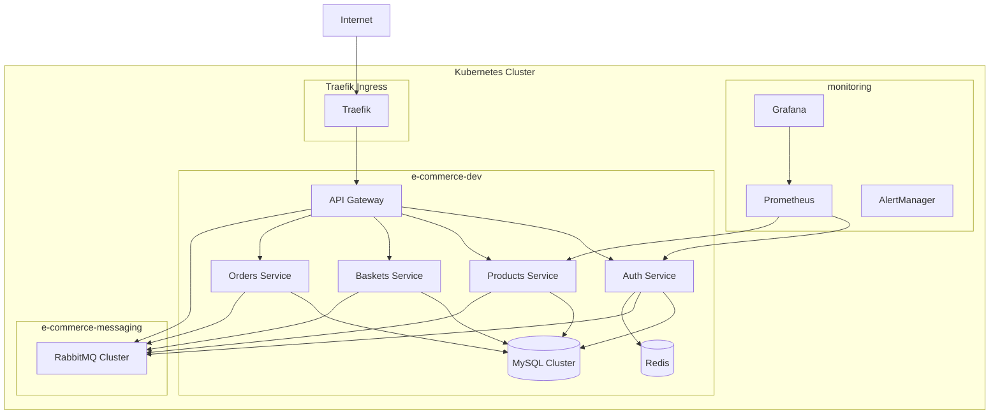

# 🚀 Kubernetes Quick Start Guide - E-commerce Microservices

## 📋 Prérequis

### Outils Requis
```bash
# Kubernetes CLI
kubectl version --client

# Helm 3.x
helm version

# Kustomize (intégré dans kubectl 1.14+)
kubectl kustomize --help

# Docker (pour build local)
docker version
```

### Cluster Kubernetes
- **Minimum**: Kubernetes 1.26+
- **Nodes**: 3+ nodes recommandés
- **Resources**: 8 CPU, 16GB RAM minimum par environnement

## 🎯 Déploiement Rapide

### 1. Clone et Préparation
```bash
git clone <votre-repo>
cd e-commerce-back

# Vérifier la structure
tree k8s/ -L 3
```

### 2. Configuration des Secrets
```bash
# Créer les secrets pour development (remplacer par vos vraies valeurs)
kubectl create secret generic global-secrets \
  --from-literal=JWT_SECRET="your-super-secret-jwt-key" \
  --from-literal=APP_KEY="base64:your-laravel-app-key" \
  --from-literal=DB_ROOT_PASSWORD="secure-root-password" \
  --from-literal=RABBITMQ_USER="admin" \
  --from-literal=RABBITMQ_PASSWORD="secure-rabbitmq-password" \
  -n e-commerce-dev
```

### 3. Déploiement Development
```bash
# Utiliser le script automatique
./k8s/scripts/deploy.sh deploy development

# OU manuellement avec Kustomize
kubectl apply -k k8s/overlays/development

# Vérifier le déploiement
kubectl get pods -n e-commerce-dev -w
```

### 4. Accès aux Services
```bash
# Port-forward vers l'API Gateway
kubectl port-forward svc/api-gateway 8080:80 -n e-commerce-dev

# Tester l'API
curl http://localhost:8080/api/health

# Port-forward vers Grafana (si monitoring déployé)
kubectl port-forward svc/grafana 3000:3000 -n monitoring
```

## 🏗️ Architecture Déployée



## 📊 Monitoring et Observabilité

### Dashboards Grafana
- **E-commerce Overview**: Métriques business (commandes, revenus, utilisateurs)
- **Business Metrics**: KPIs e-commerce (conversion, panier moyen, abandons)
- **Infrastructure**: Resources Kubernetes, performances conteneurs

### Métriques Disponibles
```bash
# Voir les métriques d'un service
kubectl port-forward svc/auth-service 9090:9090 -n e-commerce-dev
curl http://localhost:9090/metrics
```

### Logs
```bash
# Logs d'un service spécifique
kubectl logs -f deployment/auth-service -n e-commerce-dev

# Logs de tous les services
kubectl logs -f -l component=microservice -n e-commerce-dev
```

## 🔧 Commandes Utiles

### Services Management
```bash
# Lister tous les services
kubectl get svc -n e-commerce-dev

# Scaler un service
kubectl scale deployment auth-service --replicas=3 -n e-commerce-dev

# Redémarrer un service
kubectl rollout restart deployment/auth-service -n e-commerce-dev

# Status du rollout
kubectl rollout status deployment/auth-service -n e-commerce-dev
```

### Debugging
```bash
# Exec dans un pod
kubectl exec -it deployment/auth-service -n e-commerce-dev -- bash

# Décrire un pod problématique
kubectl describe pod <pod-name> -n e-commerce-dev

# Events du namespace
kubectl get events -n e-commerce-dev --sort-by='.lastTimestamp'
```

### Base de Données
```bash
# Connexion à MySQL
kubectl exec -it mysql-cluster-0 -n e-commerce-dev -- mysql -u root -p

# Backup de base
kubectl exec mysql-cluster-0 -n e-commerce-dev -- mysqldump -u root -p auth_service_db > backup.sql
```

### RabbitMQ
```bash
# Management UI
kubectl port-forward svc/rabbitmq-management 15672:15672 -n e-commerce-messaging

# Queues status
kubectl exec -it rabbitmq-cluster-server-0 -n e-commerce-messaging -- rabbitmqctl list_queues
```

## 🚀 Déploiement en Staging/Production

### Staging
```bash
# Déployer en staging
./k8s/scripts/deploy.sh deploy staging

# Avec des services spécifiques
./k8s/scripts/deploy.sh deploy staging --services api-gateway,auth-service
```

### Production
```bash
# Configuration des secrets production via External Secrets
kubectl apply -f k8s/manifests/security/external-secrets.yaml

# Déploiement production (nécessite approbation manuelle)
./k8s/scripts/deploy.sh deploy production
```

## 🛡️ Sécurité

### Network Policies
```bash
# Vérifier les policies actives
kubectl get networkpolicy -n e-commerce-dev

# Tester la connectivité
kubectl run netshoot --rm -i --tty --image nicolaka/netshoot -n e-commerce-dev
```

### Secrets Management
```bash
# Lister les secrets
kubectl get secrets -n e-commerce-dev

# Voir un secret (base64 décodé)
kubectl get secret global-secrets -n e-commerce-dev -o jsonpath='{.data.JWT_SECRET}' | base64 -d
```

## 🔄 CI/CD Integration

### GitHub Actions
Les workflows automatiques se déclenchent sur:
- **Push sur develop** → Déploiement automatique en development
- **Push sur main** → Déploiement automatique en staging
- **Tag release** → Déploiement en production (avec approbation manuelle)

### Variables d'Environnement Requises
```bash
# Dans GitHub Secrets
KUBECONFIG_DEV          # Base64 du kubeconfig development
KUBECONFIG_STAGING      # Base64 du kubeconfig staging  
KUBECONFIG_PROD         # Base64 du kubeconfig production
DOCKER_REGISTRY         # Registry Docker (ex: ghcr.io)
SLACK_WEBHOOK_URL       # Pour notifications
```

## 🆘 Troubleshooting

### Problèmes Courants

#### Services ne démarrent pas
```bash
# Vérifier les logs
kubectl logs -f deployment/auth-service -n e-commerce-dev

# Vérifier les events
kubectl get events -n e-commerce-dev --sort-by='.lastTimestamp'

# Vérifier la configuration
kubectl describe configmap global-config -n e-commerce-dev
```

#### Base de données inaccessible
```bash
# Status du cluster MySQL
kubectl get mysql -n e-commerce-dev

# Logs MySQL
kubectl logs -f mysql-cluster-0 -n e-commerce-dev

# Test de connexion
kubectl run mysql-client --rm -i --tty --image mysql:8.0 -n e-commerce-dev -- mysql -h mysql-service -u root -p
```

#### RabbitMQ problèmes
```bash
# Status du cluster
kubectl get rabbitmqcluster -n e-commerce-messaging

# Logs RabbitMQ
kubectl logs -f rabbitmq-cluster-server-0 -n e-commerce-messaging

# Reset du cluster (en dernier recours)
kubectl delete rabbitmqcluster rabbitmq-cluster -n e-commerce-messaging
kubectl apply -f k8s/manifests/messaging/rabbitmq-cluster.yaml
```

### Performance Issues
```bash
# CPU/Memory usage
kubectl top pods -n e-commerce-dev

# HPA status
kubectl get hpa -n e-commerce-dev

# Métriques détaillées
kubectl port-forward svc/prometheus 9090:9090 -n monitoring
# Puis aller sur http://localhost:9090
```

## 📚 Documentation Complémentaire

- **[Helm Charts](./helm/README.md)**: Configuration des charts Helm
- **[Kustomize](./k8s/README.md)**: Overlays par environnement
- **[Monitoring](./k8s/manifests/monitoring/README.md)**: Configuration Prometheus/Grafana
- **[Security](./k8s/manifests/security/README.md)**: Network Policies et Secrets

## 🎯 Next Steps

1. **Configurer External Secrets** avec votre provider (Vault/AWS/GCP)
2. **Personnaliser les dashboards** Grafana selon vos KPIs
3. **Configurer les alertes** en production
4. **Mettre en place le backup** automatique des bases de données
5. **Optimiser les resources** selon votre charge réelle