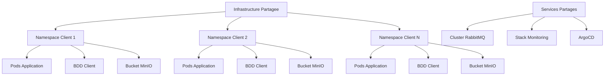
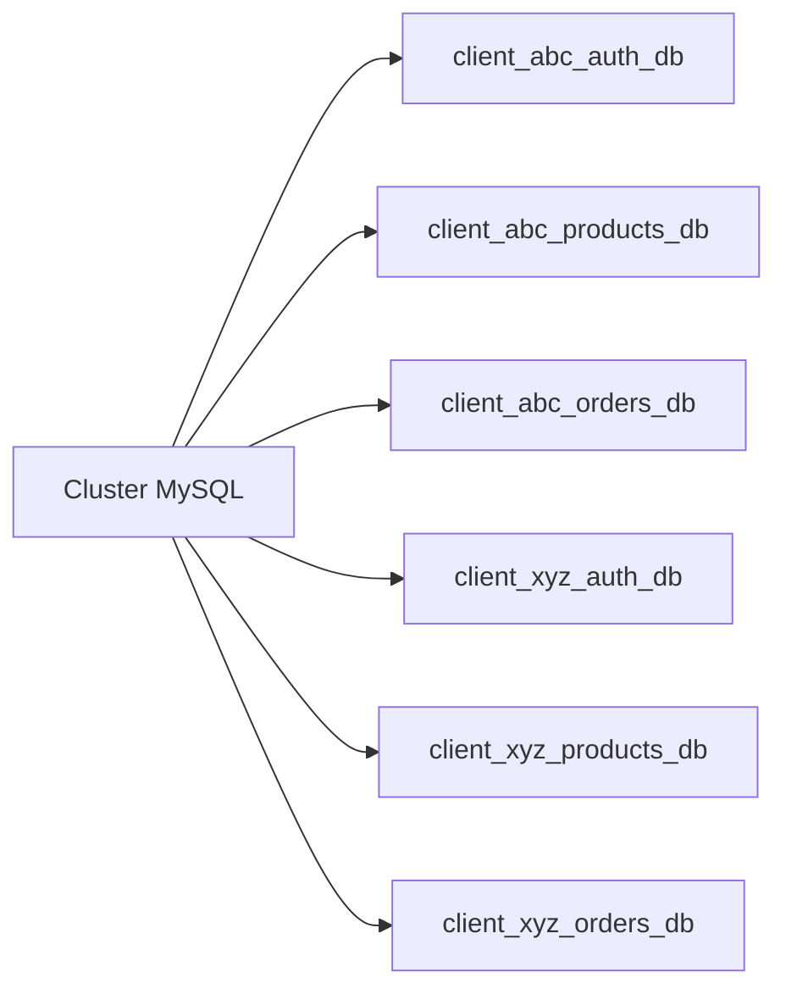
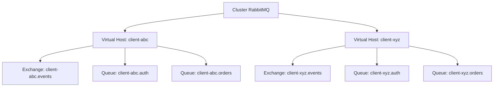
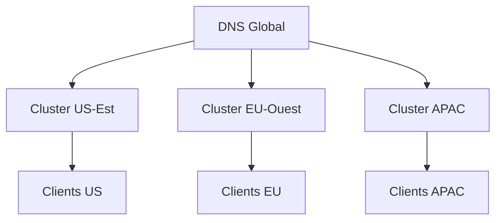

# Architecture SaaS B2B Multi-Tenant

## Vue d'ensemble

Collect & Verything fonctionne comme une plateforme SaaS B2B multi-tenant ou chaque client recoit sa propre instance isolee de site e-commerce. L'architecture garantit une isolation complete des donnees, une gestion des ressources et une evolutivite grace a la separation des tenants basee sur les namespaces Kubernetes.

## Modele de Tenant Principal

### Structure de la Table Websites

```sql
CREATE TABLE websites (
  id BIGINT PRIMARY KEY AUTO_INCREMENT,
  name VARCHAR(255) NOT NULL,
  domain VARCHAR(255) UNIQUE NOT NULL,
  created_at TIMESTAMP,
  updated_at TIMESTAMP,
  deleted_at TIMESTAMP NULL
);
```

**Principes cles :**
- Un enregistrement website = Un tenant/client
- Domaine unique par tenant
- Suppressions logiques pour la retention de donnees et la conformite

### Identification du Tenant

**Identifiant principal** : Nom de domaine
- Exemple : `client-abc.collectverything.com`
- Domaines personnalises : `shop.client-abc.com`

**Identifiant secondaire** : ID du website
- Reference interne a travers tous les microservices
- Propage via les evenements RabbitMQ

## Architecture Kubernetes Multi-Tenant

### Strategie d'Isolation par Namespace



### Architecture des Namespaces

**Namespace d'Infrastructure Partagee** : `e-commerce-shared`
- Cluster RabbitMQ
- Controleur de deploiement ArgoCD
- Monitoring Prometheus/Grafana
- Tracing distribue Jaeger
- External Secrets Operator

**Pattern de Namespace Client** : `e-commerce-client-{client-id}`
- Exemple : `e-commerce-client-abc`
- Exemple : `e-commerce-client-xyz`

**Ressources par Client** :
```yaml
apiVersion: v1
kind: Namespace
metadata:
  name: e-commerce-client-abc
  labels:
    tenant: client-abc
    tier: premium
    environment: production
    managed-by: argocd
  annotations:
    domain: client-abc.collectverything.com
    subscription-tier: premium
    created-date: "2025-01-15"
    billing-id: "sub_abc123"
```

## Niveaux d'Isolation des Ressources

### 1. Isolation Reseau

**Politiques Reseau par Namespace Client** :
```yaml
apiVersion: networking.k8s.io/v1
kind: NetworkPolicy
metadata:
  name: client-isolation
  namespace: e-commerce-client-abc
spec:
  podSelector: {}
  policyTypes:
  - Ingress
  - Egress
  ingress:
  - from:
    - namespaceSelector:
        matchLabels:
          name: ingress-nginx
  - from:
    - podSelector: {}
  egress:
  - to:
    - namespaceSelector:
        matchLabels:
          name: e-commerce-shared
    ports:
    - protocol: TCP
      port: 5672  # RabbitMQ
  - to:
    - namespaceSelector:
        matchLabels:
          name: kube-system
    ports:
    - protocol: TCP
      port: 53  # DNS
```

**Regles d'Isolation** :
- Les clients ne peuvent pas communiquer entre eux
- Les clients peuvent uniquement acceder a l'infrastructure partagee (RabbitMQ, monitoring)
- Le controleur Ingress peut router vers tous les namespaces clients
- Resolution DNS autorisee pour la decouverte de services

### 2. Isolation Base de Donnees

**Strategie** : Base de donnees par tenant dans un cluster MySQL partage



**Convention de Nommage des Bases de Donnees** :
- Pattern : `{client_id}_{service}_db`
- Exemple : `client_abc_auth_db`, `client_abc_products_db`
- Identifiants isoles par client via secrets Kubernetes

**Gestion des Connexions** :
```yaml
apiVersion: v1
kind: Secret
metadata:
  name: auth-db-credentials
  namespace: e-commerce-client-abc
type: Opaque
stringData:
  DB_HOST: "mysql.e-commerce-shared.svc.cluster.local"
  DB_PORT: "3306"
  DB_DATABASE: "client_abc_auth_db"
  DB_USERNAME: "client_abc_auth_user"
  DB_PASSWORD: "generated_secure_password"
```

### 3. Isolation Stockage Objet

**Strategie MinIO Bucket** : Bucket par tenant

```
minio/
├── client-abc-products/
│   ├── product-images/
│   └── product-documents/
├── client-abc-sav/
│   └── support-attachments/
├── client-abc-newsletters/
│   └── email-templates/
├── client-xyz-products/
├── client-xyz-sav/
└── client-xyz-newsletters/
```

**Controle d'Acces** :
- Politiques IAM par bucket client
- URLs presignees limitees au tenant
- Politiques de bucket empechant l'acces inter-tenants

```json
{
  "Version": "2012-10-17",
  "Statement": [
    {
      "Effect": "Allow",
      "Principal": {
        "AWS": ["arn:aws:iam::*:user/client-abc-app"]
      },
      "Action": ["s3:GetObject", "s3:PutObject", "s3:DeleteObject"],
      "Resource": ["arn:aws:s3:::client-abc-products/*"]
    }
  ]
}
```

### 4. Isolation Ressources de Calcul

**Quotas de Ressources par Namespace Client** :
```yaml
apiVersion: v1
kind: ResourceQuota
metadata:
  name: client-quota
  namespace: e-commerce-client-abc
spec:
  hard:
    requests.cpu: "4"
    requests.memory: "8Gi"
    limits.cpu: "8"
    limits.memory: "16Gi"
    persistentvolumeclaims: "10"
    services.loadbalancers: "1"
    pods: "50"
```

**Limites de Plage par Pod** :
```yaml
apiVersion: v1
kind: LimitRange
metadata:
  name: pod-limits
  namespace: e-commerce-client-abc
spec:
  limits:
  - max:
      cpu: "2"
      memory: "4Gi"
    min:
      cpu: "100m"
      memory: "128Mi"
    default:
      cpu: "500m"
      memory: "512Mi"
    defaultRequest:
      cpu: "250m"
      memory: "256Mi"
    type: Container
```

## Architecture Service Mesh

### Pattern d'Acces aux Services Partages

**Multi-Tenancy RabbitMQ** :


**Isolation des Virtual Hosts** :
- Un virtual host RabbitMQ par client
- Pattern : `/client-{client-id}`
- Exchanges, queues et bindings isoles
- Identifiants separes par virtual host

**Publication d'Evenements** :
```json
{
  "event": "order.created",
  "tenant_id": "client-abc",
  "website_id": 123,
  "timestamp": "2025-01-15T10:30:00Z",
  "payload": {
    "order_id": 456,
    "total": 99.99
  }
}
```

## Ingress et Routage

### Routage Base sur le Domaine

```yaml
apiVersion: networking.k8s.io/v1
kind: Ingress
metadata:
  name: client-abc-ingress
  namespace: e-commerce-client-abc
  annotations:
    cert-manager.io/cluster-issuer: "letsencrypt-prod"
spec:
  ingressClassName: nginx
  tls:
  - hosts:
    - client-abc.collectverything.com
    secretName: client-abc-tls
  rules:
  - host: client-abc.collectverything.com
    http:
      paths:
      - path: /
        pathType: Prefix
        backend:
          service:
            name: api-gateway
            port:
              number: 8100
```

**Logique de Routage** :
1. Le controleur Nginx Ingress recoit la requete
2. Domaine extrait : `client-abc.collectverything.com`
3. Route vers le namespace : `e-commerce-client-abc`
4. L'API Gateway recoit la requete dans le namespace client
5. ID du website resolu depuis le domaine via websites-service
6. Toutes les operations en aval limitees a l'ID du website

## Monitoring et Observabilite

### Metriques par Tenant

**Strategie de Labels Prometheus** :
```yaml
- job_name: 'kubernetes-pods'
  relabel_configs:
  - source_labels: [__meta_kubernetes_namespace]
    regex: e-commerce-client-(.+)
    target_label: tenant_id
  - source_labels: [__meta_kubernetes_pod_label_tenant]
    target_label: tenant
  - source_labels: [__meta_kubernetes_pod_label_tier]
    target_label: subscription_tier
```

**Tableaux de Bord Grafana** :
- Tableau de bord global : tous les clients agreges
- Tableau de bord par client : `tenant_id="client-abc"`
- Isolation des metriques via filtrage par label

**Metriques Cles par Tenant** :
- Taux de requetes (req/s)
- Taux d'erreur (%)
- Temps de reponse (p50, p95, p99)
- Utilisation des ressources (CPU, memoire, stockage)
- Connexions base de donnees
- Profondeur des files RabbitMQ

### Tracing Distribue

**Contexte Tenant Jaeger** :
```json
{
  "trace_id": "abc123def456",
  "span_id": "789xyz",
  "tags": {
    "tenant.id": "client-abc",
    "tenant.tier": "premium",
    "website.id": "123",
    "website.domain": "client-abc.collectverything.com"
  }
}
```

## Considerations de Securite

### RBAC par Tenant

**Role Admin Client** :
```yaml
apiVersion: rbac.authorization.k8s.io/v1
kind: Role
metadata:
  name: client-admin
  namespace: e-commerce-client-abc
rules:
- apiGroups: [""]
  resources: ["pods", "pods/log", "services", "configmaps"]
  verbs: ["get", "list", "watch"]
- apiGroups: ["apps"]
  resources: ["deployments", "replicasets"]
  verbs: ["get", "list", "watch"]
```

**Patterns d'Acces** :
- Operateurs plateforme : acces complet a tous les namespaces
- Admins clients : acces lecture seule a leur namespace
- Pods applicatifs : acces via service accounts avec permissions minimales

### Gestion des Secrets

**External Secrets Operator** :
```yaml
apiVersion: external-secrets.io/v1beta1
kind: ExternalSecret
metadata:
  name: client-db-credentials
  namespace: e-commerce-client-abc
spec:
  secretStoreRef:
    name: aws-secrets-manager
    kind: ClusterSecretStore
  target:
    name: auth-db-credentials
  data:
  - secretKey: DB_PASSWORD
    remoteRef:
      key: /e-commerce/client-abc/auth-db-password
```

**Rotation des Secrets** :
- Rotation automatique tous les 90 jours
- Mise a jour des identifiants sans temps d'arret
- Piste d'audit via AWS Secrets Manager

## Strategie de Mise a l'Echelle

### Autoscaling Horizontal des Pods

**HPA par Service** :
```yaml
apiVersion: autoscaling/v2
kind: HorizontalPodAutoscaler
metadata:
  name: api-gateway-hpa
  namespace: e-commerce-client-abc
spec:
  scaleTargetRef:
    apiVersion: apps/v1
    kind: Deployment
    name: api-gateway
  minReplicas: 2
  maxReplicas: 10
  metrics:
  - type: Resource
    resource:
      name: cpu
      target:
        type: Utilization
        averageUtilization: 70
  - type: Resource
    resource:
      name: memory
      target:
        type: Utilization
        averageUtilization: 80
```

### Mise a l'Echelle Verticale

**Mise a l'Echelle Basee sur le Tier** :
- Standard : 2-3 replicas par service
- Premium : 3-6 replicas par service
- Business : 6-15 replicas par service

**Allocation de Ressources** :
- Standard : 2 CPU, 4 Go RAM
- Premium : 6 CPU, 12 Go RAM
- Business : 12+ CPU, 24+ Go RAM

## Residence des Donnees et Conformite

### Isolation Geographique

**Deploiement Multi-Region** :


**Selection de Region** :
- Clients EU : `e-commerce-client-abc` dans cluster EU
- Clients US : `e-commerce-client-xyz` dans cluster US
- Les donnees ne franchissent jamais les frontieres regionales

### Conformite par Tenant

**Conformite RGPD** :
- Application de la residence des donnees
- Droit a l'effacement via suppressions logiques
- Portabilite des donnees via APIs d'export
- Gestion du consentement dans auth-service

**Conformite PCI-DSS** :
- Aucune donnee de carte stockee dans l'application
- Tokens de paiement uniquement
- Integration passerelle de paiement conforme PCI
- Journaux d'audit pour toutes les operations de paiement

## Sauvegarde et Reprise apres Sinistre

### Sauvegardes par Tenant

**Sauvegardes Base de Donnees** :
```yaml
apiVersion: batch/v1
kind: CronJob
metadata:
  name: db-backup
  namespace: e-commerce-client-abc
spec:
  schedule: "0 2 * * *"  # Quotidien a 2h du matin
  jobTemplate:
    spec:
      template:
        spec:
          containers:
          - name: backup
            image: mysql:8.0
            command:
            - /bin/sh
            - -c
            - mysqldump -h mysql.e-commerce-shared -u $DB_USER -p$DB_PASSWORD
              client_abc_auth_db | gzip > /backup/auth_db_$(date +%Y%m%d).sql.gz
            volumeMounts:
            - name: backup-storage
              mountPath: /backup
          volumes:
          - name: backup-storage
            persistentVolumeClaim:
              claimName: backup-pvc
```

**Retention des Sauvegardes** :
- Sauvegardes quotidiennes : 30 jours
- Sauvegardes hebdomadaires : 12 semaines
- Sauvegardes mensuelles : 12 mois

**SLA de Reprise apres Sinistre** :
- RPO (Recovery Point Objective) : 24 heures
- RTO (Recovery Time Objective) : 4 heures

## Allocation des Couts

### Etiquetage des Ressources

**Labels de Suivi des Couts** :
```yaml
metadata:
  labels:
    tenant: client-abc
    tier: premium
    cost-center: "CC-ABC-001"
    billing-id: "sub_abc123"
    department: "retail"
```

**Metriques pour la Facturation** :
- Heures CPU consommees
- Heures Go de memoire consommees
- Go de stockage par mois
- Go de sortie reseau
- Nombre de requetes API
- Nombre de transactions base de donnees

### Rapports de Refacturation

**Ventilation Mensuelle des Couts** :
```
Client : client-abc
Tier : Premium
Periode : 2025-01

Frais de Base : 124,99 EUR

Utilisation des Ressources :
  - CPU : 6 coeurs (dans le quota)
  - Memoire : 12 Go (dans le quota)
  - Stockage : 145 Go (dans le quota de 150 Go)
  - Sites : 3 (dans la limite)

Depassements : 0,00 EUR

Total : 124,99 EUR
```

## Strategie de Migration

### Onboarding d'un Nouveau Tenant

**Provisionnement Automatise** (detaille dans 02-provisioning-workflow.md) :
1. Abonnement cree dans le systeme de facturation
2. ArgoCD ApplicationSet genere le namespace
3. Bases de donnees creees avec prefixe tenant
4. Buckets MinIO crees avec politiques IAM
5. Virtual host RabbitMQ configure
6. Regles Ingress deployees
7. Tableaux de bord monitoring crees
8. Client recoit les identifiants d'acces

### Offboarding d'un Tenant

**Etapes de Deprovisionnement** :
1. Abonnement annule dans le systeme de facturation
2. Website marque comme `deleted_at` (suppression logique)
3. Namespace marque pour suppression (periode de grace de 30 jours)
4. Sauvegarde finale creee et archivee
5. Ressources liberees apres periode de grace
6. Retention des donnees selon exigences de conformite

**Retention des Donnees** :
- Clients actifs : indefinie
- Clients annules : periode de grace de 30 jours
- Clients supprimes : 7 ans pour conformite (archives)

## Synthese

**Principes Architecturaux Cles** :
- Isolation complete des tenants via namespaces Kubernetes
- Base de donnees par tenant avec cluster MySQL partage
- Bucket par tenant dans stockage objet MinIO
- Virtual host par tenant dans RabbitMQ
- Politiques reseau empechant communication inter-tenants
- Routage ingress base sur le domaine
- Monitoring et observabilite par tenant
- Provisionnement et deprovisionnement automatises
- Allocation des couts et rapports de refacturation
- Support multi-region pour residence des donnees
- Sauvegarde et reprise apres sinistre completes

**Preparation Production** :
- Mise a l'echelle jusqu'a 1000+ tenants concurrents
- Overhead de routage tenant inferieur a 100ms
- SLA de disponibilite de 99,95% par tenant
- Mise a l'echelle automatique et auto-reparation
- Piste d'audit complete pour conformite
