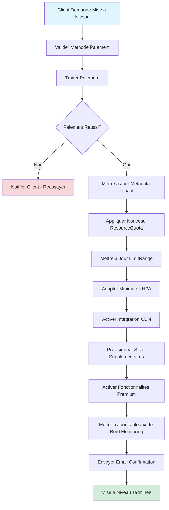
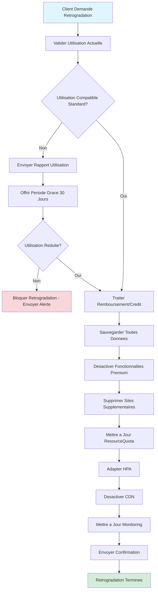

# Niveaux de Tarification et Allocation des Ressources

## Vue d'ensemble

Collect & Verything propose trois niveaux d'abonnement (Standard, Premium, Business) avec des allocations de ressources, fonctionnalites et SLA differencies. La tarification est concue pour evoluer des petites entreprises aux operations d'entreprise avec des options de facturation flexibles.

## Matrice de Comparaison des Niveaux

| Fonctionnalite | Standard | Premium | Business |
|---------|----------|---------|----------|
| **Prix Mensuel** | 49,99 EUR | 124,99 EUR | A partir de 149,99 EUR |
| **Prix Annuel** | 499 EUR (16% reduction) | 1249 EUR (16% reduction) | Tarification personnalisee |
| **Economies Annuelles** | 2 mois gratuits | 2 mois gratuits | Negociable |
| **Sites E-commerce** | 1 | 3 | Jusqu'a 10 |
| **Domaines Personnalises** | 1 | 3 | Jusqu'a 10 |
| **Coeurs CPU** | 2 | 6 | 12+ |
| **RAM** | 4 Go | 12 Go | 24+ Go |
| **Stockage** | 50 Go | 150 Go | 300+ Go |
| **Replicas de Pod** | 2-3 | 3-6 | 6-15 |
| **Utilisateurs Concurrents Max** | 200 | 1 000 | 5 000+ |
| **Limite Taux API** | 500 req/min | 3 000 req/min | 15 000 req/min |
| **Produits Max** | 2 000 | 15 000 | Illimite |
| **Commandes/Mois** | 5 000 | 30 000 | Illimite |
| **Stockage Objet (Total)** | 25 Go | 100 Go | 500+ Go |
| **- Bucket Products** | 15 Go | 60 Go | 300+ Go |
| **- Bucket SAV** | 5 Go | 20 Go | 100+ Go |
| **- Bucket Newsletters** | 5 Go | 20 Go | 100+ Go |
| **CDN** | Non | CloudFlare 100Go/mois | CDN Premium (illimite) |
| **Sauvegardes** | Quotidiennes | Toutes les heures | Temps reel |
| **SLA Disponibilite** | 99,5% | 99,9% | 99,95% |
| **Support** | Email | Email + Chat | Telephone 24/7 + Gestionnaire Dedie |
| **Temps de Reponse** | 48 heures | 12 heures | 2 heures |

## Comparaison Fonctionnalites par Niveau

### Fonctionnalites de Base (Tous Niveaux)

Tous les niveaux incluent les fonctionnalites de base suivantes :

- **Selection Theme**
  - Standard : Themes predefinis uniquement
  - Premium : Themes personnalisables avec couleurs de marque
  - Business : Themes entierement personnalisables + options marque blanche

- **Interface d'Administration**
  - Gestion utilisateurs
  - Controle d'acces base sur les roles (RBAC)
  - Journalisation activites
  - Gestion parametres

- **Gestion Clients**
  - Profils clients
  - Historique commandes
  - Informations contact
  - Historique communications

- **Gestion Produits**
  - Catalogue produits
  - Suivi inventaire
  - Categories et tags
  - Variantes produits

- **Gestion Ventes**
  - Traitement commandes
  - Integration paiement
  - Historique transactions
  - Traitement remboursements

- **Facturation**
  - Generation automatique factures
  - Export PDF
  - Modeles factures
  - Calcul taxes

- **Statistiques**
  - Standard : Tableaux de bord basiques (ventes, commandes, clients)
  - Premium : Analyses avancees avec rapports personnalises
  - Business : Analyses temps reel + insights predictifs

- **Support Client (SAV)**
  - Gestion tickets
  - Integration email
  - Base de connaissances
  - Suivi reponses

### Fonctionnalites Premium Supplementaires

Le niveau Premium ajoute :
- **Gestion Multi-sites** : Gerer jusqu'a 3 sites e-commerce depuis un seul tableau de bord
- **Integration CDN** : CDN CloudFlare avec 100Go/mois de bande passante
- **Analyses Avancees** : Rapports personnalises, suivi conversions, segmentation clients
- **Marketing Email** : Campagnes automatisees, tests A/B, segmentation avancee
- **Support Prioritaire** : Email et chat en direct avec temps de reponse de 12 heures
- **Sauvegardes Toutes les Heures** : Sauvegardes automatisees toutes les heures avec retention de 30 jours

### Fonctionnalites Business Supplementaires

Le niveau Business ajoute :
- **Echelle Entreprise** : Jusqu'a 10 sites e-commerce et domaines
- **CDN Premium** : Bande passante illimitee avec emplacements edge mondiaux
- **Options Marque Blanche** : Personnalisation marque, retrait branding plateforme
- **Infrastructure Dediee** : Cluster base de donnees dedie en option
- **Support 24/7** : Support telephonique avec gestionnaire de compte dedie
- **Reponse 2 Heures** : Reponse garantie sous 2 heures pour problemes critiques
- **Sauvegardes Temps Reel** : Sauvegarde continue avec recuperation point-in-time
- **Integrations Personnalisees** : Integration ERP, CRM, logiciels comptables
- **Securite Avancee** : WAF, protection DDoS, audits securite
- **Support Conformite** : Assistance conformite SOC 2, PCI-DSS

## Niveau Standard

### Public Cible
- Petites entreprises et startups
- Proprietaires d'un seul site e-commerce
- Test et evaluation
- Trafic faible a modere (< 200 utilisateurs concurrents)

### Tarification
- **Mensuel** : 49,99 EUR
- **Annuel** : 499 EUR (economise 99,88 EUR - 16% reduction, equivalent a 2 mois gratuits)

### Allocation Ressources

#### Quota Ressources Kubernetes
```yaml
apiVersion: v1
kind: ResourceQuota
metadata:
  name: standard-quota
  namespace: e-commerce-tenant-{{tenant_id}}
spec:
  hard:
    requests.cpu: "2"
    requests.memory: "4Gi"
    limits.cpu: "4"
    limits.memory: "8Gi"
    persistentvolumeclaims: "3"
    services.loadbalancers: "1"
    pods: "15"
    requests.storage: "50Gi"
```

#### Autoscaler Horizontal de Pods
```yaml
apiVersion: autoscaling/v2
kind: HorizontalPodAutoscaler
metadata:
  name: api-gateway-hpa
  namespace: e-commerce-tenant-{{tenant_id}}
spec:
  scaleTargetRef:
    apiVersion: apps/v1
    kind: Deployment
    name: api-gateway
  minReplicas: 2
  maxReplicas: 3
  metrics:
  - type: Resource
    resource:
      name: cpu
      target:
        type: Utilization
        averageUtilization: 70
  - type: Resource
    resource:
      name: memory
      target:
        type: Utilization
        averageUtilization: 75
  behavior:
    scaleDown:
      stabilizationWindowSeconds: 300
      policies:
      - type: Percent
        value: 50
        periodSeconds: 60
```

#### Ressources par Service
```yaml
resources:
  requests:
    cpu: 200m
    memory: 256Mi
  limits:
    cpu: 400m
    memory: 512Mi
```

### Limites Fonctionnalites

#### Configuration Base de Donnees
- **Connexions max par service** : 10
- **Timeout requete** : 30 secondes
- **Taille requete max** : 1 Mo
- **Pooling connexions** : Active
- **Seuil log requete lente** : 2 secondes

#### Stockage Objet (MinIO)
```yaml
buckets:
  products:
    quota: 15GB
    max_file_size: 5MB
    allowed_types: [image/jpeg, image/png, image/webp, image/gif]
  sav:
    quota: 5GB
    max_file_size: 10MB
    allowed_types: [application/pdf, image/*, text/plain]
  newsletters:
    quota: 5GB
    max_file_size: 2MB
    allowed_types: [text/html, image/*, application/pdf]

presigned_url_expiry: 3600  # 1 heure
```

#### Configuration RabbitMQ
```yaml
rabbitmq:
  max_message_size: 1MB
  queue_max_length: 5000
  message_ttl: 86400000  # 24 heures
  max_priority: 10
  consumer_timeout: 1800000  # 30 minutes
```

#### Limitation de Debit
```yaml
apiVersion: networking.k8s.io/v1
kind: Ingress
metadata:
  name: tenant-ingress
  namespace: e-commerce-tenant-{{tenant_id}}
  annotations:
    nginx.ingress.kubernetes.io/rate-limit: "500"
    nginx.ingress.kubernetes.io/limit-rps: "8"  # 500/60 secondes
    nginx.ingress.kubernetes.io/limit-connections: "50"
    nginx.ingress.kubernetes.io/limit-burst-multiplier: "2"
```

### Support et SLA

#### Garantie Disponibilite
- **SLA** : 99,5% (maximum 3,6 heures d'arret par mois)
- **Compensation** : 5% credit mensuel par 0,1% en dessous du SLA
- **Maintenance planifiee** : Exclue du calcul SLA

#### Canaux Support
- **Email** : support@collectverything.com
- **Temps de reponse** : Dans les 48 heures
- **Disponibilite** : Lundi-Vendredi, 9h00-18h00 CET
- **Langues** : Anglais, Francais

#### Monitoring
```yaml
monitoring:
  grafana_dashboard: basic
  metrics_retention: 30 days
  alerts:
    - type: email
      events: [critical_errors, service_down]
  reports: monthly_summary
```

## Niveau Premium

### Public Cible
- Entreprises en croissance
- Vendeurs multi-canaux
- Sites trafic moyen (200-1 000 utilisateurs concurrents)
- Entreprises necessitant analyses avancees

### Tarification
- **Mensuel** : 124,99 EUR
- **Annuel** : 1249 EUR (economise 249,88 EUR - 16% reduction, equivalent a 2 mois gratuits)

### Allocation Ressources

#### Quota Ressources Kubernetes
```yaml
apiVersion: v1
kind: ResourceQuota
metadata:
  name: premium-quota
  namespace: e-commerce-tenant-{{tenant_id}}
spec:
  hard:
    requests.cpu: "6"
    requests.memory: "12Gi"
    limits.cpu: "12"
    limits.memory: "24Gi"
    persistentvolumeclaims: "9"  # 3 sites x 3 PVCs
    services.loadbalancers: "3"
    pods: "50"
    requests.storage: "150Gi"
```

#### Autoscaler Horizontal de Pods
```yaml
apiVersion: autoscaling/v2
kind: HorizontalPodAutoscaler
metadata:
  name: api-gateway-hpa
  namespace: e-commerce-tenant-{{tenant_id}}
spec:
  scaleTargetRef:
    apiVersion: apps/v1
    kind: Deployment
    name: api-gateway
  minReplicas: 3
  maxReplicas: 6
  metrics:
  - type: Resource
    resource:
      name: cpu
      target:
        type: Utilization
        averageUtilization: 70
  - type: Resource
    resource:
      name: memory
      target:
        type: Utilization
        averageUtilization: 75
  - type: Pods
    pods:
      metric:
        name: http_requests_per_second
      target:
        type: AverageValue
        averageValue: "100"
  behavior:
    scaleUp:
      stabilizationWindowSeconds: 60
      policies:
      - type: Percent
        value: 100
        periodSeconds: 60
    scaleDown:
      stabilizationWindowSeconds: 300
      policies:
      - type: Percent
        value: 50
        periodSeconds: 60
```

#### Ressources par Service
```yaml
resources:
  requests:
    cpu: 500m
    memory: 512Mi
  limits:
    cpu: 1000m
    memory: 1Gi
```

### Limites Fonctionnalites

#### Configuration Base de Donnees
- **Connexions max par service** : 30
- **Timeout requete** : 60 secondes
- **Taille requete max** : 10 Mo
- **Pooling connexions** : Active avec optimisation
- **Seuil log requete lente** : 1 seconde
- **Replicas lecture** : 1 replica pour requetes reporting

#### Stockage Objet (MinIO)
```yaml
buckets:
  products:
    quota: 60GB
    max_file_size: 25MB
    allowed_types: [image/*, video/mp4, video/webm]
    cdn_enabled: true
    cdn_bandwidth: 100GB/month
  sav:
    quota: 20GB
    max_file_size: 50MB
    allowed_types: [application/*, image/*, text/*, video/*]
  newsletters:
    quota: 20GB
    max_file_size: 10MB
    allowed_types: [text/html, image/*, application/pdf]

presigned_url_expiry: 7200  # 2 heures
cdn_integration: cloudflare
```

#### Configuration RabbitMQ
```yaml
rabbitmq:
  max_message_size: 10MB
  queue_max_length: 30000
  message_ttl: 604800000  # 7 jours
  max_priority: 10
  consumer_timeout: 3600000  # 60 minutes
  dead_letter_exchange: enabled
```

#### Limitation de Debit
```yaml
apiVersion: networking.k8s.io/v1
kind: Ingress
metadata:
  name: tenant-ingress
  namespace: e-commerce-tenant-{{tenant_id}}
  annotations:
    nginx.ingress.kubernetes.io/rate-limit: "3000"
    nginx.ingress.kubernetes.io/limit-rps: "50"  # 3000/60 secondes
    nginx.ingress.kubernetes.io/limit-connections: "200"
    nginx.ingress.kubernetes.io/limit-burst-multiplier: "3"
```

#### Configuration CDN
```yaml
apiVersion: networking.k8s.io/v1
kind: Ingress
metadata:
  name: tenant-cdn-ingress
  namespace: e-commerce-tenant-{{tenant_id}}
  annotations:
    nginx.ingress.kubernetes.io/enable-cors: "true"
    nginx.ingress.kubernetes.io/cors-allow-origin: "*"
    external-dns.alpha.kubernetes.io/cloudflare-proxied: "true"
    external-dns.alpha.kubernetes.io/ttl: "300"
spec:
  ingressClassName: nginx
  rules:
  - host: "{{custom_domain}}"
    http:
      paths:
      - path: /static
        pathType: Prefix
        backend:
          service:
            name: minio-service
            port:
              number: 9000
```

### Support et SLA

#### Garantie Disponibilite
- **SLA** : 99,9% (maximum 43 minutes d'arret par mois)
- **Compensation** : 10% credit mensuel par 0,1% en dessous du SLA
- **Maintenance planifiee** : Maximum 2 heures/mois, annoncee 7 jours a l'avance

#### Canaux Support
- **Email** : premium-support@collectverything.com
- **Chat en Direct** : Disponible 12h00-22h00 CET, 7 jours/semaine
- **Temps de reponse** : Dans les 12 heures
- **Langues** : Anglais, Francais, Allemand, Espagnol

#### Monitoring
```yaml
monitoring:
  grafana_dashboard: advanced
  metrics_retention: 90 days
  alerts:
    - type: email
      events: [all_errors, performance_degradation, quota_warnings]
    - type: slack
      events: [critical_errors, service_down]
  reports:
    - weekly_performance
    - monthly_detailed
  custom_dashboards: 3
```

## Niveau Business

### Public Cible
- Entreprises
- Operations e-commerce a fort trafic (1 000+ utilisateurs concurrents)
- Operations multi-sites d'entreprise
- Entreprises avec exigences de conformite

### Tarification
- **A partir de** : 149,99 EUR/mois
- **Tarification personnalisee** basee sur :
  - Nombre de sites (1-10)
  - Ressources requises (CPU, RAM, stockage)
  - Fonctionnalites supplementaires (infrastructure dediee, integrations personnalisees)
  - Exigences SLA support

### Allocation Ressources

#### Quota Ressources Kubernetes
```yaml
apiVersion: v1
kind: ResourceQuota
metadata:
  name: business-quota
  namespace: e-commerce-tenant-{{tenant_id}}
spec:
  hard:
    requests.cpu: "12"
    requests.memory: "24Gi"
    limits.cpu: "24"
    limits.memory: "48Gi"
    persistentvolumeclaims: "30"  # 10 sites x 3 PVCs
    services.loadbalancers: "10"
    pods: "100"
    requests.storage: "300Gi"
```

Note : Les ressources sont entierement personnalisables selon les exigences client. Les valeurs indiquees sont la base minimum.

#### Autoscaler Horizontal de Pods
```yaml
apiVersion: autoscaling/v2
kind: HorizontalPodAutoscaler
metadata:
  name: api-gateway-hpa
  namespace: e-commerce-tenant-{{tenant_id}}
spec:
  scaleTargetRef:
    apiVersion: apps/v1
    kind: Deployment
    name: api-gateway
  minReplicas: 6
  maxReplicas: 15
  metrics:
  - type: Resource
    resource:
      name: cpu
      target:
        type: Utilization
        averageUtilization: 70
  - type: Resource
    resource:
      name: memory
      target:
        type: Utilization
        averageUtilization: 75
  - type: Pods
    pods:
      metric:
        name: http_requests_per_second
      target:
        type: AverageValue
        averageValue: "200"
  - type: External
    external:
      metric:
        name: queue_depth
      target:
        type: AverageValue
        averageValue: "100"
  behavior:
    scaleUp:
      stabilizationWindowSeconds: 30
      policies:
      - type: Percent
        value: 100
        periodSeconds: 30
      - type: Pods
        value: 4
        periodSeconds: 30
      selectPolicy: Max
    scaleDown:
      stabilizationWindowSeconds: 300
      policies:
      - type: Percent
        value: 25
        periodSeconds: 60
```

#### Ressources par Service
```yaml
resources:
  requests:
    cpu: 1000m
    memory: 1Gi
  limits:
    cpu: 2000m
    memory: 2Gi
```

### Limites Fonctionnalites

#### Configuration Base de Donnees
- **Connexions max par service** : 100
- **Timeout requete** : 300 secondes
- **Taille requete max** : 100 Mo
- **Pooling connexions** : Avance avec equilibrage charge
- **Seuil log requete lente** : 500ms
- **Replicas lecture** : 3 replicas avec basculement automatique
- **Recuperation point-in-time** : 30 jours
- **Cluster dedie en option** : MySQL InnoDB Cluster avec 5 instances

```yaml
# Cluster Base de Donnees Dedie en Option
apiVersion: mysql.oracle.com/v2
kind: InnoDBCluster
metadata:
  name: tenant-dedicated-mysql
  namespace: e-commerce-tenant-{{tenant_id}}
spec:
  instances: 5
  router:
    instances: 3
  secretName: mysql-cluster-secret
  tlsUseSelfSigned: true
  podSpec:
    resources:
      requests:
        cpu: "4"
        memory: "8Gi"
      limits:
        cpu: "8"
        memory: "16Gi"
  datadirVolumeClaimTemplate:
    accessModes:
      - ReadWriteOnce
    resources:
      requests:
        storage: 100Gi
```

#### Stockage Objet (MinIO)
```yaml
buckets:
  products:
    quota: 300GB  # Extensible a 1To+
    max_file_size: 500MB
    allowed_types: [*/*]  # Tous types autorises
    cdn_enabled: true
    cdn_bandwidth: unlimited
    versioning: enabled
  sav:
    quota: 100GB  # Extensible
    max_file_size: 500MB
    allowed_types: [*/*]
    versioning: enabled
  newsletters:
    quota: 100GB  # Extensible
    max_file_size: 100MB
    allowed_types: [*/*]
    versioning: enabled

presigned_url_expiry: 86400  # 24 heures
cdn_integration: cloudflare_enterprise
replication: enabled  # Replication inter-regions
```

#### Configuration RabbitMQ
```yaml
rabbitmq:
  max_message_size: 100MB
  queue_max_length: unlimited
  message_ttl: 2592000000  # 30 jours
  max_priority: 255
  consumer_timeout: 7200000  # 2 heures
  dead_letter_exchange: enabled
  federation: enabled  # Federation messages multi-regions
  high_availability: true
  cluster_nodes: 3
```

#### Limitation de Debit
```yaml
apiVersion: networking.k8s.io/v1
kind: Ingress
metadata:
  name: tenant-ingress
  namespace: e-commerce-tenant-{{tenant_id}}
  annotations:
    nginx.ingress.kubernetes.io/rate-limit: "15000"
    nginx.ingress.kubernetes.io/limit-rps: "250"  # 15000/60 secondes
    nginx.ingress.kubernetes.io/limit-connections: "1000"
    nginx.ingress.kubernetes.io/limit-burst-multiplier: "5"
    nginx.ingress.kubernetes.io/limit-whitelist: "{{trusted_ips}}"
```

#### Configuration CDN Entreprise
```yaml
apiVersion: networking.k8s.io/v1
kind: Ingress
metadata:
  name: tenant-cdn-ingress
  namespace: e-commerce-tenant-{{tenant_id}}
  annotations:
    external-dns.alpha.kubernetes.io/cloudflare-proxied: "true"
    external-dns.alpha.kubernetes.io/ttl: "120"
    # Fonctionnalites Cloudflare Enterprise
    cloudflare.com/argo-tunnel: "true"
    cloudflare.com/load-balancing: "true"
    cloudflare.com/waf: "enabled"
    cloudflare.com/ddos-protection: "advanced"
    cloudflare.com/rate-limiting: "advanced"
spec:
  ingressClassName: nginx
  tls:
  - hosts:
    - "{{custom_domain}}"
    secretName: "{{domain}}-tls"
  rules:
  - host: "{{custom_domain}}"
    http:
      paths:
      - path: /
        pathType: Prefix
        backend:
          service:
            name: api-gateway
            port:
              number: 80
```

### Fonctionnalites Entreprise

#### Deploiement Multi-Region (Option)
```yaml
apiVersion: argoproj.io/v1alpha1
kind: ApplicationSet
metadata:
  name: business-tenant-multi-region
  namespace: argocd
spec:
  generators:
  - list:
      elements:
      - cluster: eu-west-1
        region: europe
        datacenter: paris
      - cluster: us-east-1
        region: north-america
        datacenter: virginia
      - cluster: ap-southeast-1
        region: asia-pacific
        datacenter: singapore
  template:
    metadata:
      name: '{{tenant_id}}-{{region}}'
    spec:
      project: e-commerce-business
      source:
        repoURL: https://github.com/org/e-commerce-infra
        targetRevision: main
        path: helm/e-commerce-platform
        helm:
          values: |
            tenant:
              id: {{tenant_id}}
              tier: business
              region: {{region}}
              datacenter: {{datacenter}}
      destination:
        server: '{{cluster}}'
        namespace: 'e-commerce-tenant-{{tenant_id}}'
      syncPolicy:
        automated:
          prune: true
          selfHeal: true
```

#### Fonctionnalites Securite
```yaml
# Pare-feu Application Web
apiVersion: networking.k8s.io/v1
kind: NetworkPolicy
metadata:
  name: tenant-waf-policy
  namespace: e-commerce-tenant-{{tenant_id}}
spec:
  podSelector:
    matchLabels:
      app: api-gateway
  policyTypes:
  - Ingress
  - Egress
  ingress:
  - from:
    - namespaceSelector:
        matchLabels:
          name: ingress-nginx
    ports:
    - protocol: TCP
      port: 80
    - protocol: TCP
      port: 443
  egress:
  - to:
    - namespaceSelector: {}
    ports:
    - protocol: TCP
      port: 3306  # MySQL
    - protocol: TCP
      port: 5672  # RabbitMQ
    - protocol: TCP
      port: 9000  # MinIO

---
# Politique Securite Pod
apiVersion: policy/v1beta1
kind: PodSecurityPolicy
metadata:
  name: tenant-restricted
spec:
  privileged: false
  allowPrivilegeEscalation: false
  requiredDropCapabilities:
    - ALL
  volumes:
    - 'configMap'
    - 'emptyDir'
    - 'projected'
    - 'secret'
    - 'downwardAPI'
    - 'persistentVolumeClaim'
  runAsUser:
    rule: 'MustRunAsNonRoot'
  seLinux:
    rule: 'RunAsAny'
  fsGroup:
    rule: 'RunAsAny'
  readOnlyRootFilesystem: true
```

### Support et SLA

#### Garantie Disponibilite
- **SLA** : 99,95% (maximum 21 minutes d'arret par mois)
- **Compensation** : 25% credit mensuel par 0,1% en dessous du SLA
- **Maintenance planifiee** : Maximum 1 heure/mois, annoncee 14 jours a l'avance
- **Maintenance urgence** : Notification immediate avec rapport post-mortem

#### Canaux Support
- **Email** : enterprise-support@collectverything.com
- **Chat en Direct** : 24/7/365
- **Telephone** : +33 1 XX XX XX XX (24/7/365)
- **Gestionnaire de Compte Dedie** : Contact nomme avec ligne directe
- **Revues Trimestrielles** : Sessions planification strategique et optimisation
- **Slack Connect** : Canal direct vers equipe ingenierie (option)

#### Temps de Reponse par Severite
```yaml
support_sla:
  critical:
    definition: "Service en panne, fonctionnalite majeure indisponible"
    response_time: 2 hours
    resolution_target: 4 hours
    escalation: immediate
  high:
    definition: "Fonctionnalite significative alteree"
    response_time: 4 hours
    resolution_target: 8 hours
    escalation: 6 hours
  medium:
    definition: "Problemes fonctionnalite mineurs"
    response_time: 8 hours
    resolution_target: 24 hours
    escalation: 16 hours
  low:
    definition: "Questions generales, demandes fonctionnalites"
    response_time: 12 hours
    resolution_target: 48 hours
    escalation: 24 hours
```

#### Monitoring et Observabilite
```yaml
monitoring:
  grafana_dashboard: enterprise_custom
  metrics_retention: 365 days
  logs_retention: 90 days
  trace_sampling: 100%

  alerts:
    channels:
      - type: email
        events: all
      - type: slack
        events: [critical, high]
      - type: pagerduty
        events: [critical]
      - type: sms
        events: [critical]

  reports:
    - type: daily_health_check
      recipients: [ops_team, account_manager]
    - type: weekly_performance
      recipients: [ops_team, account_manager, client_contact]
    - type: monthly_executive_summary
      recipients: [all_stakeholders]
    - type: quarterly_business_review
      recipients: [executive_team]

  custom_dashboards: unlimited
  api_access: full_prometheus_api

  apm_integration:
    - datadog
    - new_relic
    - elastic_apm
```

## Surveillance et Application des Ressources

### Mecanismes d'Application des Quotas

#### Limites Niveau Namespace
```yaml
apiVersion: v1
kind: LimitRange
metadata:
  name: tenant-limits
  namespace: e-commerce-tenant-{{tenant_id}}
spec:
  limits:
  # Limites conteneur
  - max:
      cpu: "2"
      memory: "4Gi"
    min:
      cpu: "50m"
      memory: "64Mi"
    default:
      cpu: "500m"
      memory: "512Mi"
    defaultRequest:
      cpu: "200m"
      memory: "256Mi"
    type: Container

  # Limites pod
  - max:
      cpu: "4"
      memory: "8Gi"
    type: Pod

  # Limites PVC
  - max:
      storage: "100Gi"
    min:
      storage: "1Gi"
    type: PersistentVolumeClaim
```

#### Classe Stockage avec Provisionnement Specifique au Tier
```yaml
apiVersion: storage.k8s.io/v1
kind: StorageClass
metadata:
  name: tier-{{tier}}-storage
provisioner: kubernetes.io/aws-ebs
parameters:
  type: gp3
  iops: "{{tier_iops}}"  # Standard: 3000, Premium: 10000, Business: 16000
  throughput: "{{tier_throughput}}"  # Standard: 125, Premium: 500, Business: 1000
  encrypted: "true"
allowVolumeExpansion: true
volumeBindingMode: WaitForFirstConsumer
```

### Collecte Metriques Utilisation

#### ServiceMonitor Prometheus
```yaml
apiVersion: monitoring.coreos.com/v1
kind: ServiceMonitor
metadata:
  name: tenant-metrics
  namespace: e-commerce-tenant-{{tenant_id}}
spec:
  selector:
    matchLabels:
      app.kubernetes.io/instance: "{{tenant_id}}"
  endpoints:
  - port: metrics
    interval: 30s
    path: /metrics
```

#### Requetes Prometheus Critiques

```promql
# Utilisation CPU par tenant (coeurs)
sum(rate(container_cpu_usage_seconds_total{namespace=~"e-commerce-tenant-.*"}[5m])) by (namespace)

# Utilisation memoire par tenant (Go)
sum(container_memory_usage_bytes{namespace=~"e-commerce-tenant-.*"}) by (namespace) / 1024^3

# Requetes API par minute par tenant
sum(rate(http_requests_total{namespace=~"e-commerce-tenant-.*"}[1m])) by (namespace) * 60

# Utilisation stockage par tenant (Go)
sum(kubelet_volume_stats_used_bytes{namespace=~"e-commerce-tenant-.*"}) by (namespace) / 1024^3

# Nombre pods par tenant
count(kube_pod_info{namespace=~"e-commerce-tenant-.*"}) by (namespace)

# Connexions concurrentes par tenant
sum(nginx_ingress_controller_nginx_process_connections{namespace=~"e-commerce-tenant-.*",state="active"}) by (namespace)

# Utilisation bucket MinIO par tenant (Go)
sum(minio_bucket_usage_total_bytes{namespace=~"e-commerce-tenant-.*"}) by (namespace, bucket) / 1024^3

# Profondeur file RabbitMQ par tenant
sum(rabbitmq_queue_messages{namespace=~"e-commerce-tenant-.*"}) by (namespace, queue)

# Connexions base de donnees par service
sum(mysql_global_status_threads_connected{namespace=~"e-commerce-tenant-.*"}) by (namespace, service)
```

### Avertissement et Application de Quota

#### Regles d'Alerte Prometheus
```yaml
apiVersion: monitoring.coreos.com/v1
kind: PrometheusRule
metadata:
  name: tenant-quota-alerts
  namespace: monitoring
spec:
  groups:
  - name: resource-quotas
    interval: 30s
    rules:
    # Avertissements quota CPU
    - alert: TenantCPUQuotaWarning
      expr: |
        sum(rate(container_cpu_usage_seconds_total{namespace=~"e-commerce-tenant-.*"}[5m])) by (namespace) /
        sum(kube_resourcequota{namespace=~"e-commerce-tenant-.*",resource="requests.cpu",type="hard"}) by (namespace) > 0.80
      for: 5m
      labels:
        severity: warning
        tier: "{{ $labels.tier }}"
      annotations:
        summary: "Tenant {{ $labels.namespace }} approche quota CPU"
        description: "Utilisation CPU a {{ $value | humanizePercentage }} du quota"
        action: "Envisager mise a niveau tier ou optimisation charge de travail"

    - alert: TenantCPUQuotaExceeded
      expr: |
        sum(rate(container_cpu_usage_seconds_total{namespace=~"e-commerce-tenant-.*"}[5m])) by (namespace) /
        sum(kube_resourcequota{namespace=~"e-commerce-tenant-.*",resource="requests.cpu",type="hard"}) by (namespace) > 0.95
      for: 2m
      labels:
        severity: critical
        tier: "{{ $labels.tier }}"
      annotations:
        summary: "Tenant {{ $labels.namespace }} a depasse quota CPU"
        description: "Utilisation CPU a {{ $value | humanizePercentage }} du quota - limitation peut survenir"
        action: "Mise a niveau immediate requise"

    # Avertissements quota memoire
    - alert: TenantMemoryQuotaWarning
      expr: |
        sum(container_memory_usage_bytes{namespace=~"e-commerce-tenant-.*"}) by (namespace) /
        sum(kube_resourcequota{namespace=~"e-commerce-tenant-.*",resource="requests.memory",type="hard"}) by (namespace) > 0.80
      for: 5m
      labels:
        severity: warning
      annotations:
        summary: "Tenant {{ $labels.namespace }} approche quota memoire"
        description: "Utilisation memoire a {{ $value | humanizePercentage }} du quota"

    # Avertissements quota stockage
    - alert: TenantStorageQuotaWarning
      expr: |
        sum(kubelet_volume_stats_used_bytes{namespace=~"e-commerce-tenant-.*"}) by (namespace) /
        sum(kube_resourcequota{namespace=~"e-commerce-tenant-.*",resource="requests.storage",type="hard"}) by (namespace) > 0.80
      for: 10m
      labels:
        severity: warning
      annotations:
        summary: "Tenant {{ $labels.namespace }} approche quota stockage"
        description: "Utilisation stockage a {{ $value | humanizePercentage }} du quota"

    # Avertissements limite taux API
    - alert: TenantAPIRateLimitWarning
      expr: |
        sum(rate(http_requests_total{namespace=~"e-commerce-tenant-.*"}[1m])) by (namespace) * 60 /
        on(namespace) group_left(tier) label_replace(
          kube_namespace_labels{label_tier=~"standard|premium|business"},
          "api_limit",
          "$1",
          "label_tier",
          "(standard=500|premium=3000|business=15000)"
        ) > 0.90
      for: 2m
      labels:
        severity: warning
      annotations:
        summary: "Tenant {{ $labels.namespace }} approche limite taux API"
        description: "Requetes API a {{ $value | humanizePercentage }} de la limite"

    # Limites nombre produits
    - alert: TenantProductLimitWarning
      expr: |
        sum(mysql_product_count{namespace=~"e-commerce-tenant-.*"}) by (namespace) /
        on(namespace) group_left(tier) label_replace(
          kube_namespace_labels{label_tier=~"standard|premium"},
          "product_limit",
          "$1",
          "label_tier",
          "(standard=2000|premium=15000)"
        ) > 0.90
      labels:
        severity: warning
      annotations:
        summary: "Tenant {{ $labels.namespace }} approche limite produits"
        description: "Nombre produits a {{ $value | humanizePercentage }} de la limite tier"
```

### Integration Facturation

#### Service Collecte Donnees Utilisation
```yaml
apiVersion: v1
kind: ConfigMap
metadata:
  name: billing-collector-config
  namespace: monitoring
data:
  config.yaml: |
    collection_interval: 3600  # 1 heure

    metrics:
      - name: cpu_usage
        query: 'sum(rate(container_cpu_usage_seconds_total{namespace=~"e-commerce-tenant-.*"}[1h])) by (namespace)'
        unit: core_hours

      - name: memory_usage
        query: 'avg_over_time(sum(container_memory_usage_bytes{namespace=~"e-commerce-tenant-.*"}[1h]) by (namespace)[1h:5m]) / 1024^3'
        unit: gb_hours

      - name: storage_usage
        query: 'avg_over_time(sum(kubelet_volume_stats_used_bytes{namespace=~"e-commerce-tenant-.*"}[1h]) by (namespace)[1h:5m]) / 1024^3'
        unit: gb

      - name: api_requests
        query: 'sum(increase(http_requests_total{namespace=~"e-commerce-tenant-.*"}[1h])) by (namespace)'
        unit: requests

      - name: cdn_bandwidth
        query: 'sum(increase(cloudflare_bandwidth_bytes{namespace=~"e-commerce-tenant-.*"}[1h])) by (namespace) / 1024^3'
        unit: gb

      - name: object_storage
        query: 'sum(minio_bucket_usage_total_bytes{namespace=~"e-commerce-tenant-.*"}) by (namespace, bucket) / 1024^3'
        unit: gb

    export:
      format: json
      destination: s3://billing-data/usage-reports/
      encryption: enabled
```

#### Exemple Rapport Facturation Mensuel
```json
{
  "tenant_id": "acme-corp-a7f3b2",
  "tenant_name": "ACME Corporation",
  "billing_period": "2025-02",
  "period_start": "2025-02-01T00:00:00Z",
  "period_end": "2025-02-28T23:59:59Z",
  "tier": "premium",
  "sites_count": 3,

  "base_charges": {
    "monthly_fee": 124.99,
    "currency": "EUR"
  },

  "resource_usage": {
    "cpu": {
      "allocated_cores": 6,
      "used_core_hours": 4032,
      "quota_core_hours": 4032,
      "overage_core_hours": 0,
      "overage_charge": 0.00
    },
    "memory": {
      "allocated_gb": 12,
      "used_gb_hours": 8064,
      "quota_gb_hours": 8064,
      "overage_gb_hours": 0,
      "overage_charge": 0.00
    },
    "storage": {
      "allocated_gb": 150,
      "average_used_gb": 142,
      "quota_gb": 150,
      "overage_gb": 0,
      "overage_charge": 0.00
    },
    "api_requests": {
      "total_requests": 78500000,
      "quota_requests": 120960000,
      "overage_requests": 0,
      "overage_charge": 0.00
    },
    "cdn_bandwidth": {
      "total_gb": 87,
      "quota_gb": 100,
      "overage_gb": 0,
      "overage_charge": 0.00
    },
    "object_storage": {
      "products": {
        "average_gb": 58,
        "quota_gb": 60
      },
      "sav": {
        "average_gb": 18,
        "quota_gb": 20
      },
      "newsletters": {
        "average_gb": 14,
        "quota_gb": 20
      },
      "total_used_gb": 90,
      "total_quota_gb": 100,
      "overage_gb": 0,
      "overage_charge": 0.00
    }
  },

  "performance_metrics": {
    "average_concurrent_users": 687,
    "peak_concurrent_users": 1243,
    "average_response_time_ms": 145,
    "uptime_percentage": 99.94,
    "sla_compliance": true
  },

  "total_charges": {
    "base_fee": 124.99,
    "overage_charges": 0.00,
    "total": 124.99,
    "currency": "EUR"
  },

  "payment_status": "paid",
  "invoice_number": "INV-2025-02-A7F3B2",
  "payment_method": "credit_card",
  "next_billing_date": "2025-03-01"
}
```

## Workflows de Migration de Niveau

### Processus de Mise a Niveau

#### Mise a Niveau Standard vers Premium



**Script d'Automation** :
```yaml
apiVersion: batch/v1
kind: Job
metadata:
  name: tier-upgrade-{{tenant_id}}
  namespace: platform-admin
spec:
  template:
    spec:
      serviceAccountName: tenant-admin
      containers:
      - name: upgrade-executor
        image: platform/tier-manager:latest
        env:
        - name: TENANT_ID
          value: "{{tenant_id}}"
        - name: SOURCE_TIER
          value: "standard"
        - name: TARGET_TIER
          value: "premium"
        - name: PAYMENT_CONFIRMED
          value: "true"
        command:
        - /bin/sh
        - -c
        - |
          echo "Debut mise a niveau tier pour tenant: $TENANT_ID"

          # Mettre a jour labels namespace
          kubectl label namespace e-commerce-tenant-$TENANT_ID tier=premium --overwrite

          # Appliquer nouveau quota ressources
          kubectl apply -f /configs/premium-quota.yaml -n e-commerce-tenant-$TENANT_ID

          # Mettre a jour limit ranges
          kubectl apply -f /configs/premium-limits.yaml -n e-commerce-tenant-$TENANT_ID

          # Mettre a jour configurations HPA
          for deployment in api-gateway auth-service products-service baskets-service orders-service; do
            kubectl apply -f /configs/hpa/$deployment-premium.yaml -n e-commerce-tenant-$TENANT_ID
          done

          # Activer CDN
          kubectl apply -f /configs/cdn/cloudflare-config.yaml -n e-commerce-tenant-$TENANT_ID

          # Provisionner namespaces sites supplementaires (2 sites de plus)
          for i in 2 3; do
            kubectl create namespace e-commerce-tenant-$TENANT_ID-site-$i
            kubectl apply -f /configs/site-template.yaml -n e-commerce-tenant-$TENANT_ID-site-$i
          done

          # Activer fonctionnalites premium en base de donnees
          mysql -h mysql-cluster -u admin -p$MYSQL_PASSWORD e-commerce-tenant-$TENANT_ID <<EOF
          UPDATE tenant_config SET
            tier = 'premium',
            max_sites = 3,
            max_products = 15000,
            max_orders_per_month = 30000,
            cdn_enabled = true,
            advanced_analytics = true
          WHERE tenant_id = '$TENANT_ID';
          EOF

          # Mettre a jour monitoring
          kubectl apply -f /configs/monitoring/premium-dashboards.yaml -n e-commerce-tenant-$TENANT_ID

          # Envoyer notification
          curl -X POST https://notifications.internal/send \
            -H "Content-Type: application/json" \
            -d "{
              \"tenant_id\": \"$TENANT_ID\",
              \"type\": \"tier_upgrade\",
              \"from_tier\": \"standard\",
              \"to_tier\": \"premium\",
              \"timestamp\": \"$(date -u +%Y-%m-%dT%H:%M:%SZ)\"
            }"

          echo "Mise a niveau tier terminee avec succes"
      restartPolicy: OnFailure
```

**Garantie Zero Temps d'Arret** :
- Quotas ressources appliques sans redemarrages pods
- HPA adapte progressivement selon demande
- Aucune interruption service pendant mise a niveau

#### Mise a Niveau Premium vers Business

Processus similaire avec etapes supplementaires :
- Provisionnement cluster base de donnees dedie en option
- Configuration deploiement multi-region (si demande)
- Configuration securite avancee
- Attribution gestionnaire compte
- Session planification integrations personnalisees

### Processus de Retrogradation

#### Retrogradation Premium vers Standard



**Validation Pre-Retrogradation** :
```bash
#!/bin/bash
# Script validation retrogradation

TENANT_ID=$1
TARGET_TIER="standard"

echo "Validation faisabilite retrogradation pour tenant: $TENANT_ID"

# Verifier nombre sites actuel
SITE_COUNT=$(kubectl get namespaces -l tenant=$TENANT_ID,type=site --no-headers | wc -l)
if [ $SITE_COUNT -gt 1 ]; then
  echo "ERREUR: Tenant a $SITE_COUNT sites. Tier Standard autorise 1 site."
  echo "ACTION: Reduire a 1 site avant retrogradation."
  exit 1
fi

# Verifier nombre produits
PRODUCT_COUNT=$(mysql -h mysql-cluster -u admin -p$MYSQL_PASSWORD -N -e \
  "SELECT COUNT(*) FROM e-commerce-tenant-$TENANT_ID.products;")
if [ $PRODUCT_COUNT -gt 2000 ]; then
  echo "ERREUR: Tenant a $PRODUCT_COUNT produits. Tier Standard autorise 2000 produits."
  echo "ACTION: Reduire catalogue produits avant retrogradation."
  exit 1
fi

# Verifier utilisation stockage
STORAGE_GB=$(kubectl exec -n monitoring prometheus-0 -- \
  promtool query instant 'sum(kubelet_volume_stats_used_bytes{namespace="e-commerce-tenant-'$TENANT_ID'"}) / 1024^3' | \
  grep -oP '\d+\.\d+' | head -1)
if (( $(echo "$STORAGE_GB > 50" | bc -l) )); then
  echo "ERREUR: Tenant utilise ${STORAGE_GB}Go stockage. Tier Standard autorise 50Go."
  echo "ACTION: Reduire utilisation stockage avant retrogradation."
  exit 1
fi

# Verifier utilisateurs concurrents moyens
AVG_USERS=$(kubectl exec -n monitoring prometheus-0 -- \
  promtool query instant 'avg_over_time(nginx_ingress_controller_nginx_process_connections{namespace="e-commerce-tenant-'$TENANT_ID'",state="active"}[7d])' | \
  grep -oP '\d+' | head -1)
if [ $AVG_USERS -gt 200 ]; then
  echo "AVERTISSEMENT: Utilisateurs concurrents moyens ($AVG_USERS) depasse capacite tier Standard (200)."
  echo "Degradation performance peut survenir."
fi

echo "Validation reussie. Retrogradation peut continuer."
exit 0
```

**Gestion Periode de Grace** :
- Preavis 30 jours avant application
- Rapports utilisation quotidiens envoyes au client
- Rappels automatises jours 7, 14, 21, 28
- Avertissement final 24 heures avant application quota

## Comparaison Concurrentielle

### Positionnement Marche

| Fournisseur | Niveau Entree | Niveau Milieu | Niveau Entreprise |
|----------|------------|----------|-----------------|
| **Collect & Verything** | 49,99 EUR/mois | 124,99 EUR/mois | 149,99+ EUR/mois |
| Shopify | 29 USD/mois | 79 USD/mois | 299 USD/mois |
| WooCommerce (hebergement) | 25 EUR/mois | 100 EUR/mois | 400+ EUR/mois |
| BigCommerce | 29,95 USD/mois | 79,95 USD/mois | 299,95 USD/mois |
| Magento Commerce | N/A | N/A | 2000+ USD/mois |

### Comparaison Fonctionnalites

#### vs. Shopify

**Avantages** :
- Pas de frais transaction (Shopify facture 0,5-2% sauf avec Shopify Payments)
- Produits illimites sur tier Business (Shopify illimite tous tiers)
- Option auto-hebergee avec controle complet donnees
- Capacites personnalisation open-source
- Souverainete donnees europeenne (conformite RGPD)

**Desavantages** :
- Ecosysteme applications plus petit
- Moins integrations preconstruites
- Necessite plus connaissances techniques
- Pas ecosysteme materiel point de vente

#### vs. WooCommerce

**Avantages** :
- Infrastructure entierement geree (pas maintenance WordPress)
- Multi-tenancy et evolutivite integrees
- SLA disponibilite garantis
- Support professionnel inclus
- Architecture microservices pour meilleures performances

**Desavantages** :
- Prix entree plus eleve
- Moins flexibilite personnalisation profonde
- Ecosysteme plugins plus petit
- Pas open-source

#### vs. BigCommerce

**Avantages** :
- Tarification plus previsible (BigCommerce a seuils ventes)
- Meilleure valeur tier milieu (fonctionnalites similaires, prix inferieur)
- Options hebergement europeennes
- Infrastructure personnalisee pour tier Business

**Desavantages** :
- Moins fonctionnalites integrees niveau entree
- Reseau partenaires plus petit
- Plateforme moins mature (plus recente)

#### vs. Magento Commerce

**Avantages** :
- 93% cout entree inferieur
- Mise sur marche plus rapide
- Infrastructure geree incluse
- Meilleur focus petites/moyennes entreprises

**Desavantages** :
- Moins fonctionnalites entreprise
- Communaute developpeurs plus petite
- Pas adapte tres grandes entreprises (10 000+ SKUs)

### Resume Proposition Valeur

**Tier Standard** :
- **Meilleur pour** : Startups, entreprises mono-produit, tests
- **Valeur cle** : Cout entree faible avec fonctionnalites professionnelles
- **ROI** : Seuil rentabilite a environ 15 000 EUR revenu mensuel

**Tier Premium** :
- **Meilleur pour** : Entreprises croissance, vendeurs multi-canaux
- **Valeur cle** : Fonctionnalites avancees, CDN, sites multiples
- **ROI** : Seuil rentabilite a environ 50 000 EUR revenu mensuel

**Tier Business** :
- **Meilleur pour** : Entreprises etablies, operations gros volumes
- **Valeur cle** : Echelle illimitee, support dedie, conformite
- **ROI** : Seuil rentabilite a environ 200 000 EUR revenu mensuel

## Checklist Implementation

### Provisionnement Nouveau Tenant

#### Configuration Tier Standard
```yaml
- [ ] Creer namespace tenant : e-commerce-tenant-{{tenant_id}}
- [ ] Appliquer ResourceQuota (2 CPU, 4Go RAM, 50Go stockage)
- [ ] Appliquer LimitRange pour limites pod/conteneur
- [ ] Deployer microservices principaux (13 services)
- [ ] Creer bases de donnees MySQL (13 bases)
- [ ] Provisionner buckets MinIO (3 buckets : 15Go, 5Go, 5Go)
- [ ] Configurer exchanges et queues RabbitMQ
- [ ] Configurer ingress Nginx avec limitation debit (500 req/min)
- [ ] Configurer HPA (2-3 replicas)
- [ ] Activer monitoring (tableau de bord Grafana basique)
- [ ] Configurer notifications email
- [ ] Configurer sauvegardes quotidiennes
- [ ] Attribuer domaine personnalise
- [ ] Envoyer email bienvenue avec identifiants
- [ ] Planifier appel onboarding (optionnel)
```

#### Configuration Tier Premium
```yaml
- [ ] Toutes etapes tier Standard
- [ ] Creer 3 namespaces sites
- [ ] Provisionner domaines supplementaires (3 total)
- [ ] Mettre a jour ResourceQuota (6 CPU, 12Go RAM, 150Go stockage)
- [ ] Configurer HPA (3-6 replicas)
- [ ] Configurer integration CDN CloudFlare
- [ ] Activer analyses avancees
- [ ] Configurer sauvegardes toutes les heures
- [ ] Configurer replica lecture bases de donnees
- [ ] Activer support chat en direct
- [ ] Configurer alertes Slack
- [ ] Provisionner retention metriques 90 jours
- [ ] Envoyer guide onboarding premium
```

#### Configuration Tier Business
```yaml
- [ ] Toutes etapes tier Premium
- [ ] Provisionner jusqu'a 10 namespaces sites
- [ ] Mettre a jour ResourceQuota (12+ CPU, 24+ Go RAM, 300+ Go stockage)
- [ ] Configurer HPA (6-15 replicas)
- [ ] Optionnel : Deployer cluster MySQL dedie
- [ ] Optionnel : Configurer deploiement multi-region
- [ ] Configurer CDN CloudFlare Enterprise
- [ ] Activer WAF et protection DDoS
- [ ] Configurer sauvegardes temps reel
- [ ] Configurer 3 replicas lecture bases de donnees
- [ ] Activer support telephonique 24/7
- [ ] Attribuer gestionnaire compte dedie
- [ ] Configurer escalade PagerDuty
- [ ] Provisionner retention metriques 365 jours
- [ ] Planifier revue trimestrielle
- [ ] Configurer integrations personnalisees (selon besoins)
- [ ] Realiser audit securite
- [ ] Fournir documentation conformite
```

### Configuration Monitoring

#### Monitoring Tier Standard
```bash
# Creer tableau de bord Grafana basique
kubectl apply -f - <<EOF
apiVersion: v1
kind: ConfigMap
metadata:
  name: grafana-dashboard-standard
  namespace: e-commerce-tenant-{{tenant_id}}
  labels:
    grafana_dashboard: "1"
data:
  standard-dashboard.json: |
    {
      "dashboard": {
        "title": "{{tenant_name}} - Tier Standard",
        "panels": [
          {
            "title": "Utilisation CPU",
            "targets": [{
              "expr": "sum(rate(container_cpu_usage_seconds_total{namespace=\"e-commerce-tenant-{{tenant_id}}\"}[5m]))"
            }]
          },
          {
            "title": "Utilisation Memoire (Go)",
            "targets": [{
              "expr": "sum(container_memory_usage_bytes{namespace=\"e-commerce-tenant-{{tenant_id}}\"}) / 1024^3"
            }]
          },
          {
            "title": "Requetes API/min",
            "targets": [{
              "expr": "sum(rate(http_requests_total{namespace=\"e-commerce-tenant-{{tenant_id}}\"}[1m])) * 60"
            }]
          },
          {
            "title": "Utilisation Stockage (Go)",
            "targets": [{
              "expr": "sum(kubelet_volume_stats_used_bytes{namespace=\"e-commerce-tenant-{{tenant_id}}\"}) / 1024^3"
            }]
          }
        ]
      }
    }
EOF
```

#### Configuration Alerte Email
```yaml
apiVersion: v1
kind: ConfigMap
metadata:
  name: alertmanager-config
  namespace: monitoring
data:
  config.yml: |
    route:
      group_by: ['namespace', 'alertname']
      group_wait: 10s
      group_interval: 5m
      repeat_interval: 12h
      receiver: 'email-standard'
      routes:
      - match:
          namespace: e-commerce-tenant-{{tenant_id}}
          severity: critical
        receiver: 'email-standard'

    receivers:
    - name: 'email-standard'
      email_configs:
      - to: '{{tenant_email}}'
        from: 'alerts@collectverything.com'
        smarthost: 'smtp.sendgrid.net:587'
        auth_username: 'apikey'
        auth_password: '{{sendgrid_api_key}}'
        headers:
          Subject: '[Collect & Verything] Alerte: {{ .GroupLabels.alertname }}'
```

## Rationale Strategie Tarification

### Analyse Structure Couts

#### Couts Infrastructure (par tenant/mois)

**Tier Standard** :
```
Noeuds workers Kubernetes (partages) :    5,00 EUR
Base de donnees MySQL (cluster partage) : 3,00 EUR
Stockage MinIO (25Go) :                   2,00 EUR
RabbitMQ (partage) :                      1,50 EUR
Reseau/Equilibreur charge :               2,00 EUR
Monitoring/Journalisation :               1,00 EUR
Sauvegardes (quotidiennes) :              1,50 EUR
Overhead support :                        3,00 EUR
------------------------------------------
Total cout infrastructure :              19,00 EUR
Tarification (49,99 EUR) :               30,99 EUR marge brute (62%)
```

**Tier Premium** :
```
Noeuds workers Kubernetes (partages) :   15,00 EUR
Base de donnees MySQL (avec replica) :   10,00 EUR
Stockage MinIO (100Go) :                  8,00 EUR
RabbitMQ (partage) :                      3,00 EUR
CDN (CloudFlare 100Go) :                 10,00 EUR
Reseau/Equilibreur charge :               5,00 EUR
Monitoring/Journalisation (ameliore) :    3,00 EUR
Sauvegardes (toutes les heures) :         5,00 EUR
Overhead support :                        8,00 EUR
------------------------------------------
Total cout infrastructure :              67,00 EUR
Tarification (124,99 EUR) :              57,99 EUR marge brute (46%)
```

**Tier Business (base)** :
```
Noeuds workers Kubernetes (dedies) :     50,00 EUR
Base de donnees MySQL (3 replicas) :     30,00 EUR
Stockage MinIO (500Go) :                 40,00 EUR
RabbitMQ (cluster HA) :                  15,00 EUR
CDN (CloudFlare Enterprise) :            50,00 EUR
Reseau/Equilibreur charge :              15,00 EUR
Monitoring/Journalisation (stack complet): 10,00 EUR
Sauvegardes (temps reel) :               15,00 EUR
Support 24/7 + gestionnaire compte :     50,00 EUR
Securite/Conformite :                    10,00 EUR
------------------------------------------
Total cout infrastructure :             285,00 EUR
Tarification (debut 149,99 EUR) :  Tarification personnalisee requise pour rentabilite
Tarification Business typique :         400-800 EUR/mois
```

### Philosophie Tarification

1. **Tier Standard** : Optimise pour volume, marge elevee pour supporter developpement plateforme
2. **Tier Premium** : Proposition valeur equilibree, marge moderee
3. **Tier Business** : Tarification personnalisee basee sur consommation ressources reelle et besoins support

### Rationale Reduction Annuelle

**16% reduction = 2 mois gratuits** :
- Ameliore previsibilite flux tresorerie
- Reduit desabonnement (engagement)
- Diminue amortissement cout acquisition client
- Standard : 499 EUR/an vs 599,88 EUR (economise 100,88 EUR)
- Premium : 1249 EUR/an vs 1499,88 EUR (economise 250,88 EUR)

### Ecarts Tarification Concurrentielle

**Opportunite 1 : Segment Marche Intermediaire**
- Shopify Plus commence a environ 2000 USD/mois
- Magento Commerce commence a environ 2000+ USD/mois
- Notre tier Business (400-800 EUR) comble ecart

**Opportunite 2 : Marche Europeen**
- Tarification EUR (pas incertitude taux change)
- Hebergement europeen conforme RGPD
- Support local en langues europeennes
- Avantage tarif 10-15% vs concurrents USD

**Opportunite 3 : Tarification Transparente**
- Pas frais transaction caches
- Chemins mise a niveau clairs
- Couts previsibles
- Pas frais depassement surprises (quotas, pas limitation)

## Synthese

### Guide Reference Rapide

**Choisir Bon Tier** :

```
┌─────────────────────────────────────────────────────────┐
│  Arbre Decision                                         │
├─────────────────────────────────────────────────────────┤
│                                                         │
│  Demarrage / Test ?                                     │
│  └─→ STANDARD (49,99 EUR/mois)                          │
│                                                         │
│  Entreprise croissance / Canaux multiples ?             │
│  └─→ PREMIUM (124,99 EUR/mois)                          │
│                                                         │
│  Entreprise etablie / Fort trafic ?                     │
│  └─→ BUSINESS (149,99+ EUR/mois, personnalise)          │
│                                                         │
└─────────────────────────────────────────────────────────┘
```

**Indicateurs Utilisation** :

```
Standard :     < 200 utilisateurs concurrents, < 5 000 commandes/mois, 1 site
Premium :      200-1 000 utilisateurs concurrents, 5k-30k commandes/mois, jusqu'a 3 sites
Business :     1 000+ utilisateurs concurrents, 30k+ commandes/mois, jusqu'a 10 sites
```

**Differenciateurs Cles** :

| Tier | Valeur Unique |
|------|--------------|
| Standard | Entree abordable, fonctionnalites professionnelles |
| Premium | CDN inclus, multi-sites, analyses avancees |
| Business | Echelle illimitee, support dedie, conformite |

### Prochaines Etapes

Pour implementation :
1. Revoir manifests Kubernetes dans `k8s/overlays/{tier}/`
2. Configurer monitoring dans `k8s/base/monitoring/`
3. Configurer integration facturation (voir `docs/business/04-billing-system.md`)
4. Tester workflows migration tier
5. Preparer documentation client

Pour ventes/marketing :
1. Creer page tarification basee sur matrice comparaison tiers
2. Developper calculateurs ROI pour chaque tier
3. Preparer battle cards concurrentielles
4. Concevoir campagnes mise a niveau tier
5. Creer etudes de cas pour chaque tier

---

**Version Document** : 2.0
**Derniere Mise a Jour** : 2025-02-03
**Auteur** : Equipe Plateforme
**Planning Revue** : Trimestriel
