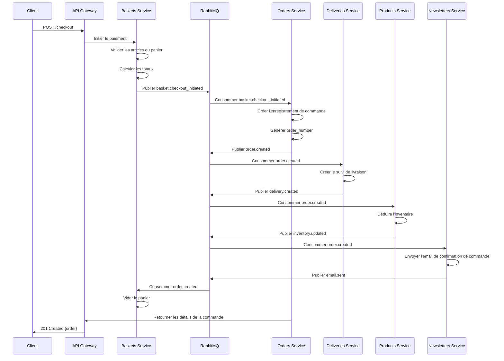
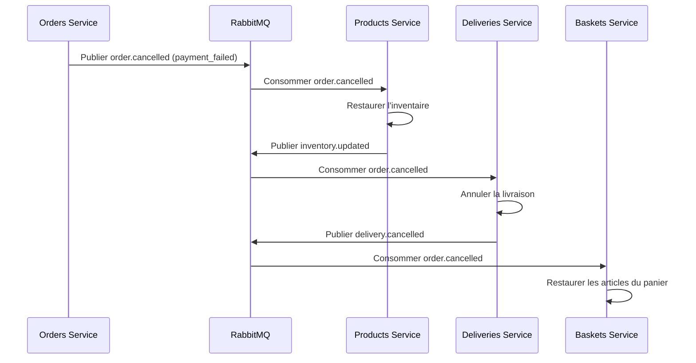
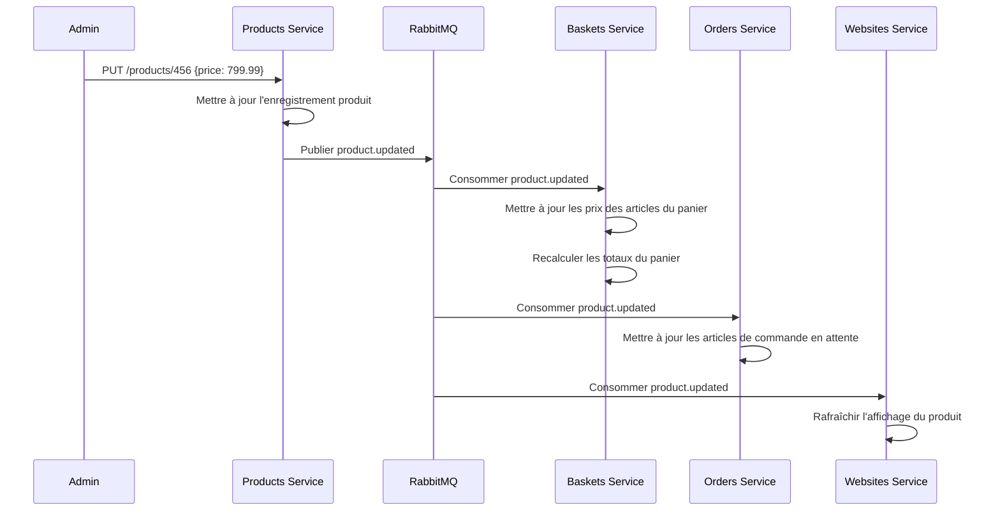
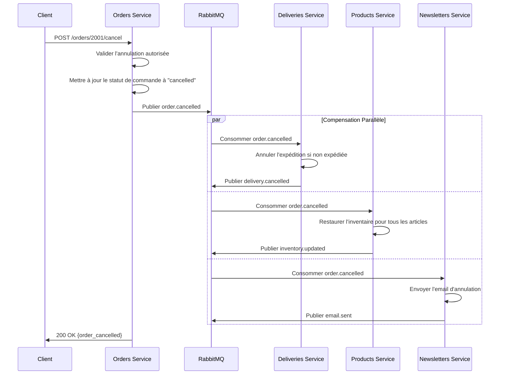
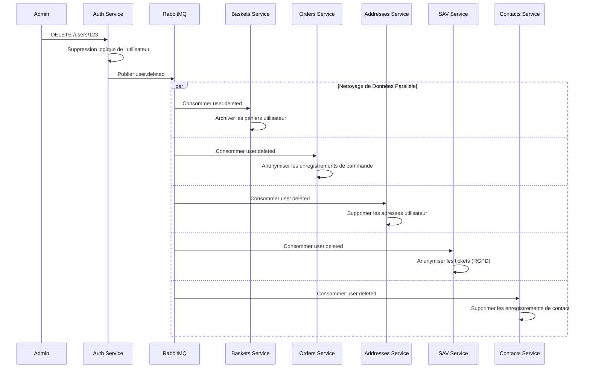
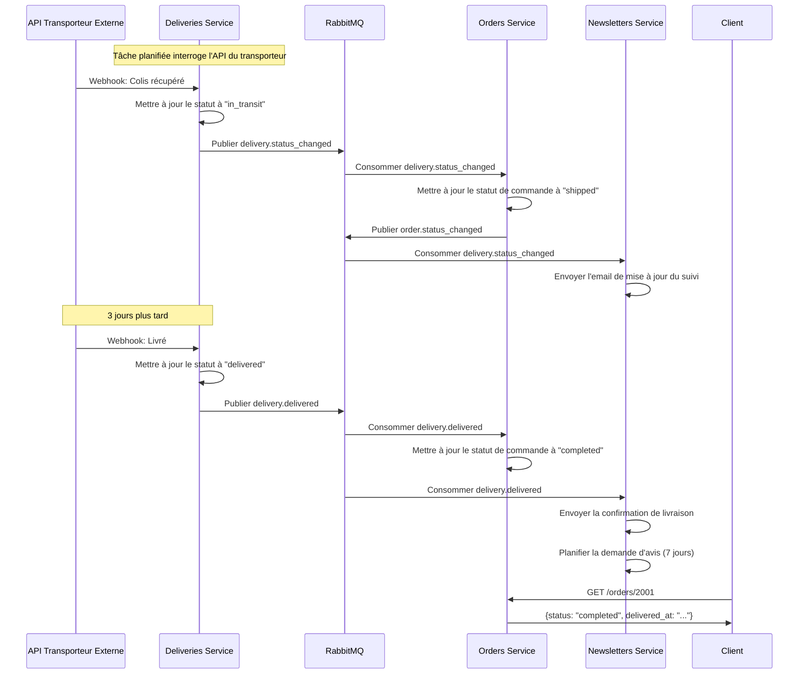

# Relations de Base de Données et Communication Inter-Services

## Table des Matières
- [Vue d'ensemble](#vue-densemble)
- [Architecture de Communication](#architecture-de-communication)
- [Catalogue d'Événements RabbitMQ](#catalogue-dévénements-rabbitmq)
- [Workflows Inter-Services](#workflows-inter-services)
- [Modèles de Cohérence des Données](#modèles-de-cohérence-des-données)
- [Gestion des Erreurs et Logique de Réessai](#gestion-des-erreurs-et-logique-de-réessai)
- [Spécifications des Charges Utiles d'Événements](#spécifications-des-charges-utiles-dévénements)

## Vue d'ensemble

Ce document détaille comment les services communiquent et maintiennent la cohérence des données dans une architecture entièrement asynchrone pilotée par événements. Toute communication inter-services s'effectue via le courtier de messages RabbitMQ, implémentant la cohérence éventuelle et les modèles saga.

**Principes Clés :**
- Aucune connexion directe aux bases de données entre services
- Toutes les communications via les échanges topic RabbitMQ
- Gestionnaires de messages idempotents
- Modèle saga pour les transactions distribuées
- Event sourcing pour la piste d'audit

## Architecture de Communication

### Topologie RabbitMQ

```mermaid
graph TB
    subgraph "API Gateway"
        AG[API Gateway<br/>Port 8100]
    end

    subgraph "RabbitMQ Broker"
        EX[microservices_exchange<br/>Type: topic]

        Q_AUTH[auth.queue]
        Q_ADDR[addresses.queue]
        Q_PROD[products.queue]
        Q_BASK[baskets.queue]
        Q_ORD[orders.queue]
        Q_DEL[deliveries.queue]
        Q_NEWS[newsletters.queue]
        Q_SAV[sav.queue]
        Q_CONT[contacts.queue]
        Q_QUES[questions.queue]
        Q_WEB[websites.queue]
    end

    subgraph "Microservices"
        AUTH[auth-service]
        ADDR[addresses-service]
        PROD[products-service]
        BASK[baskets-service]
        ORD[orders-service]
        DEL[deliveries-service]
        NEWS[newsletters-service]
        SAV[sav-service]
        CONT[contacts-service]
        QUES[questions-service]
        WEB[websites-service]
    end

    AG -->|Requête HTTP| EX

    EX -->|Clé de Routage| Q_AUTH
    EX -->|Clé de Routage| Q_ADDR
    EX -->|Clé de Routage| Q_PROD
    EX -->|Clé de Routage| Q_BASK
    EX -->|Clé de Routage| Q_ORD
    EX -->|Clé de Routage| Q_DEL
    EX -->|Clé de Routage| Q_NEWS
    EX -->|Clé de Routage| Q_SAV
    EX -->|Clé de Routage| Q_CONT
    EX -->|Clé de Routage| Q_QUES
    EX -->|Clé de Routage| Q_WEB

    Q_AUTH -->|Consomme| AUTH
    Q_ADDR -->|Consomme| ADDR
    Q_PROD -->|Consomme| PROD
    Q_BASK -->|Consomme| BASK
    Q_ORD -->|Consomme| ORD
    Q_DEL -->|Consomme| DEL
    Q_NEWS -->|Consomme| NEWS
    Q_SAV -->|Consomme| SAV
    Q_CONT -->|Consomme| CONT
    Q_QUES -->|Consomme| QUES
    Q_WEB -->|Consomme| WEB

    AUTH -.->|Publie Événements| EX
    ADDR -.->|Publie Événements| EX
    PROD -.->|Publie Événements| EX
    BASK -.->|Publie Événements| EX
    ORD -.->|Publie Événements| EX
    DEL -.->|Publie Événements| EX
    NEWS -.->|Publie Événements| EX
    SAV -.->|Publie Événements| EX
    CONT -.->|Publie Événements| EX
    QUES -.->|Publie Événements| EX
    WEB -.->|Publie Événements| EX
```



### Configuration de l'Échange
```
Nom: microservices_exchange
Type: topic
Durable: true
Auto-delete: false
Internal: false
```

### Modèle de Clé de Routage
```
<service>.<entité>.<action>

Exemples :
- auth.user.created
- products.product.updated
- orders.order.created
- deliveries.delivery.shipped
```

### Configuration des Files d'Attente
Chaque service dispose d'une file d'attente dédiée :
```
Durable: true
Auto-delete: false
Exclusive: false
Prefetch: 10 messages
Message TTL: 3600 secondes (1 heure)
Max Retry: 3 tentatives
```

## Catalogue d'Événements RabbitMQ

### Événements du Service d'Authentification

#### user.created
**Éditeur :** auth-service
**Abonnés :** Tous les services (pour le cache utilisateur local)
**Clé de Routage :** `auth.user.created`

**Charge Utile :**
```json
{
  "event_id": "uuid-v4",
  "event_type": "user.created",
  "timestamp": "2025-10-03T10:30:00Z",
  "version": "1.0",
  "data": {
    "user_id": 123,
    "email": "user@example.com",
    "name": "John Doe",
    "created_at": "2025-10-03T10:30:00Z"
  },
  "metadata": {
    "correlation_id": "request-uuid",
    "causation_id": "causing-event-uuid",
    "user_agent": "Mozilla/5.0...",
    "ip_address": "192.168.1.1"
  }
}
```

**Abonnés :**
- baskets-service : Créer un panier vide pour le nouvel utilisateur
- addresses-service : Initialiser le carnet d'adresses
- orders-service : Activer la passation de commandes
- sav-service : Activer la création de tickets
- contacts-service : Ajouter à la gestion des contacts

---

#### user.updated
**Éditeur :** auth-service
**Abonnés :** Tous les services avec cache utilisateur
**Clé de Routage :** `auth.user.updated`

**Charge Utile :**
```json
{
  "event_id": "uuid-v4",
  "event_type": "user.updated",
  "timestamp": "2025-10-03T10:35:00Z",
  "version": "1.0",
  "data": {
    "user_id": 123,
    "updated_fields": {
      "name": "John Smith",
      "email": "john.smith@example.com"
    },
    "updated_at": "2025-10-03T10:35:00Z"
  },
  "metadata": {
    "correlation_id": "request-uuid",
    "causation_id": "causing-event-uuid"
  }
}
```

**Abonnés :**
- Tous les services : Invalider les données utilisateur en cache
- newsletters-service : Mettre à jour les informations des abonnés
- contacts-service : Synchroniser les enregistrements de contacts

---

#### user.deleted
**Éditeur :** auth-service
**Abonnés :** Tous les services
**Clé de Routage :** `auth.user.deleted`

**Charge Utile :**
```json
{
  "event_id": "uuid-v4",
  "event_type": "user.deleted",
  "timestamp": "2025-10-03T11:00:00Z",
  "version": "1.0",
  "data": {
    "user_id": 123,
    "deleted_at": "2025-10-03T11:00:00Z",
    "soft_delete": true
  },
  "metadata": {
    "correlation_id": "request-uuid"
  }
}
```

**Abonnés :**
- baskets-service : Archiver les paniers utilisateur
- orders-service : Anonymiser l'historique des commandes
- addresses-service : Supprimer les adresses
- sav-service : Anonymiser les tickets de support

---

#### role.assigned
**Éditeur :** auth-service
**Abonnés :** Services avec accès basé sur les rôles
**Clé de Routage :** `auth.role.assigned`

**Charge Utile :**
```json
{
  "event_id": "uuid-v4",
  "event_type": "role.assigned",
  "timestamp": "2025-10-03T10:40:00Z",
  "version": "1.0",
  "data": {
    "user_id": 123,
    "role_id": 5,
    "role_name": "customer_service_agent",
    "permissions": ["tickets.view", "tickets.update"]
  }
}
```

**Abonnés :**
- sav-service : Mettre à jour le pool d'affectation des agents
- contacts-service : Accorder l'accès aux contacts

---

### Événements du Service Produits

#### product.created
**Éditeur :** products-service
**Abonnés :** baskets-service, orders-service, websites-service
**Clé de Routage :** `products.product.created`

**Charge Utile :**
```json
{
  "event_id": "uuid-v4",
  "event_type": "product.created",
  "timestamp": "2025-10-03T09:00:00Z",
  "version": "1.0",
  "data": {
    "product_id": 456,
    "name": "Laptop Pro 15",
    "ref": "LAP-PRO-15-001",
    "price_ht": 999.99,
    "stock": 50,
    "brand_id": 10,
    "vat_rate": 20.0,
    "created_at": "2025-10-03T09:00:00Z"
  }
}
```

**Abonnés :**
- baskets-service : Activer l'ajout de produits aux paniers
- orders-service : Activer la commande de produits
- websites-service : Afficher le produit sur le site

---

#### product.updated
**Éditeur :** products-service
**Abonnés :** baskets-service, orders-service
**Clé de Routage :** `products.product.updated`

**Charge Utile :**
```json
{
  "event_id": "uuid-v4",
  "event_type": "product.updated",
  "timestamp": "2025-10-03T09:30:00Z",
  "version": "1.0",
  "data": {
    "product_id": 456,
    "updated_fields": {
      "price_ht": 899.99,
      "stock": 45
    },
    "updated_at": "2025-10-03T09:30:00Z"
  }
}
```

**Abonnés :**
- baskets-service : Mettre à jour les prix des articles du panier
- orders-service : Ajuster les calculs des commandes en attente

---

#### product.deleted
**Éditeur :** products-service
**Abonnés :** baskets-service, orders-service
**Clé de Routage :** `products.product.deleted`

**Charge Utile :**
```json
{
  "event_id": "uuid-v4",
  "event_type": "product.deleted",
  "timestamp": "2025-10-03T10:00:00Z",
  "version": "1.0",
  "data": {
    "product_id": 456,
    "deleted_at": "2025-10-03T10:00:00Z",
    "soft_delete": true
  }
}
```

**Abonnés :**
- baskets-service : Retirer des paniers actifs, marquer comme indisponible
- orders-service : Marquer le produit comme arrêté

---

#### inventory.updated
**Éditeur :** products-service
**Abonnés :** baskets-service, orders-service
**Clé de Routage :** `products.inventory.updated`

**Charge Utile :**
```json
{
  "event_id": "uuid-v4",
  "event_type": "inventory.updated",
  "timestamp": "2025-10-03T12:00:00Z",
  "version": "1.0",
  "data": {
    "product_id": 456,
    "previous_stock": 50,
    "new_stock": 35,
    "change": -15,
    "reason": "order_placed"
  }
}
```

**Abonnés :**
- baskets-service : Valider la disponibilité des articles du panier
- orders-service : Mettre à jour le statut de traitement des commandes

---

### Événements du Service Paniers

#### basket.created
**Éditeur :** baskets-service
**Abonnés :** orders-service (pour le suivi)
**Clé de Routage :** `baskets.basket.created`

**Charge Utile :**
```json
{
  "event_id": "uuid-v4",
  "event_type": "basket.created",
  "timestamp": "2025-10-03T11:00:00Z",
  "version": "1.0",
  "data": {
    "basket_id": 789,
    "user_id": 123,
    "amount": 0.00,
    "created_at": "2025-10-03T11:00:00Z"
  }
}
```

---

#### basket.item_added
**Éditeur :** baskets-service
**Abonnés :** products-service (pour les analyses)
**Clé de Routage :** `baskets.item.added`

**Charge Utile :**
```json
{
  "event_id": "uuid-v4",
  "event_type": "basket.item_added",
  "timestamp": "2025-10-03T11:05:00Z",
  "version": "1.0",
  "data": {
    "basket_id": 789,
    "basket_item_id": 1001,
    "product_id": 456,
    "quantity": 2,
    "unit_price": 899.99,
    "total": 1799.98
  }
}
```

**Abonnés :**
- products-service : Suivre la popularité des produits, réserver l'inventaire

---

#### basket.item_removed
**Éditeur :** baskets-service
**Abonnés :** products-service
**Clé de Routage :** `baskets.item.removed`

**Charge Utile :**
```json
{
  "event_id": "uuid-v4",
  "event_type": "basket.item_removed",
  "timestamp": "2025-10-03T11:10:00Z",
  "version": "1.0",
  "data": {
    "basket_id": 789,
    "basket_item_id": 1001,
    "product_id": 456,
    "quantity": 2
  }
}
```

**Abonnés :**
- products-service : Libérer l'inventaire réservé

---

#### basket.checkout_initiated
**Éditeur :** baskets-service
**Abonnés :** orders-service (critique)
**Clé de Routage :** `baskets.checkout.initiated`

**Charge Utile :**
```json
{
  "event_id": "uuid-v4",
  "event_type": "basket.checkout_initiated",
  "timestamp": "2025-10-03T11:20:00Z",
  "version": "1.0",
  "data": {
    "basket_id": 789,
    "user_id": 123,
    "items": [
      {
        "product_id": 456,
        "quantity": 2,
        "unit_price_ht": 899.99,
        "vat_rate": 20.0
      }
    ],
    "promo_codes": ["WELCOME10"],
    "total_amount_ht": 1799.98,
    "total_discount": 179.99,
    "vat_amount": 359.99,
    "total_amount_ttc": 1979.98,
    "billing_address_id": 50,
    "shipping_address_id": 51
  },
  "metadata": {
    "correlation_id": "checkout-uuid-v4",
    "requires_response": true,
    "response_queue": "baskets.checkout.response"
  }
}
```

**Abonnés :**
- orders-service : Créer une commande à partir du panier

---

#### basket.abandoned
**Éditeur :** baskets-service (tâche planifiée)
**Abonnés :** newsletters-service (pour le remarketing)
**Clé de Routage :** `baskets.basket.abandoned`

**Charge Utile :**
```json
{
  "event_id": "uuid-v4",
  "event_type": "basket.abandoned",
  "timestamp": "2025-10-03T13:00:00Z",
  "version": "1.0",
  "data": {
    "basket_id": 789,
    "user_id": 123,
    "total_amount": 1979.98,
    "item_count": 2,
    "last_updated": "2025-10-02T11:20:00Z",
    "abandoned_duration_hours": 24
  }
}
```

**Abonnés :**
- newsletters-service : Déclencher la campagne email d'abandon de panier

---

### Événements du Service Commandes

#### order.created
**Éditeur :** orders-service
**Abonnés :** deliveries-service, products-service, newsletters-service, baskets-service
**Clé de Routage :** `orders.order.created`

**Charge Utile :**
```json
{
  "event_id": "uuid-v4",
  "event_type": "order.created",
  "timestamp": "2025-10-03T11:25:00Z",
  "version": "1.0",
  "data": {
    "order_id": 2001,
    "order_number": "ORD-2025-10-03-2001",
    "user_id": 123,
    "status_id": 1,
    "status_name": "pending",
    "items": [
      {
        "order_item_id": 3001,
        "product_id": 456,
        "quantity": 2,
        "unit_price_ht": 899.99,
        "vat_rate": 20.0,
        "total_ht": 1799.98,
        "vat_amount": 359.99,
        "total_ttc": 2159.97
      }
    ],
    "total_amount_ht": 1799.98,
    "total_amount_ttc": 2159.97,
    "total_discount": 179.99,
    "vat_amount": 359.99,
    "billing_address_id": 50,
    "shipping_address_id": 51,
    "created_at": "2025-10-03T11:25:00Z"
  },
  "metadata": {
    "correlation_id": "checkout-uuid-v4",
    "causation_id": "basket.checkout_initiated-event-id"
  }
}
```

**Abonnés :**
- deliveries-service : Créer le suivi de livraison
- products-service : Déduire le stock de l'inventaire
- newsletters-service : Envoyer l'email de confirmation de commande
- baskets-service : Vider le panier après une commande réussie

---

#### order.status_changed
**Éditeur :** orders-service
**Abonnés :** deliveries-service, newsletters-service, sav-service
**Clé de Routage :** `orders.order.status_changed`

**Charge Utile :**
```json
{
  "event_id": "uuid-v4",
  "event_type": "order.status_changed",
  "timestamp": "2025-10-03T12:00:00Z",
  "version": "1.0",
  "data": {
    "order_id": 2001,
    "order_number": "ORD-2025-10-03-2001",
    "user_id": 123,
    "previous_status": "pending",
    "new_status": "confirmed",
    "changed_at": "2025-10-03T12:00:00Z"
  }
}
```

**Abonnés :**
- deliveries-service : Mettre à jour le statut de livraison
- newsletters-service : Envoyer l'email de mise à jour du statut
- sav-service : Lier aux tickets de support associés

---

#### order.cancelled
**Éditeur :** orders-service
**Abonnés :** deliveries-service, products-service, newsletters-service
**Clé de Routage :** `orders.order.cancelled`

**Charge Utile :**
```json
{
  "event_id": "uuid-v4",
  "event_type": "order.cancelled",
  "timestamp": "2025-10-03T13:00:00Z",
  "version": "1.0",
  "data": {
    "order_id": 2001,
    "order_number": "ORD-2025-10-03-2001",
    "user_id": 123,
    "items": [
      {
        "product_id": 456,
        "quantity": 2
      }
    ],
    "cancellation_reason": "customer_request",
    "cancelled_at": "2025-10-03T13:00:00Z"
  }
}
```

**Abonnés :**
- deliveries-service : Annuler l'expédition
- products-service : Restaurer l'inventaire
- newsletters-service : Envoyer la confirmation d'annulation

---

### Événements du Service Livraisons

#### delivery.created
**Éditeur :** deliveries-service
**Abonnés :** orders-service
**Clé de Routage :** `deliveries.delivery.created`

**Charge Utile :**
```json
{
  "event_id": "uuid-v4",
  "event_type": "delivery.created",
  "timestamp": "2025-10-03T11:30:00Z",
  "version": "1.0",
  "data": {
    "delivery_id": 5001,
    "tracking_number": "TRACK-2025-10-03-5001",
    "order_id": 2001,
    "status_id": 1,
    "status_name": "pending",
    "delivery_method": "standard",
    "estimated_delivery_date": "2025-10-10T00:00:00Z",
    "shipping_cost": 9.99
  }
}
```

**Abonnés :**
- orders-service : Mettre à jour la commande avec les informations de livraison

---

#### delivery.shipped
**Éditeur :** deliveries-service
**Abonnés :** orders-service, newsletters-service
**Clé de Routage :** `deliveries.delivery.shipped`

**Charge Utile :**
```json
{
  "event_id": "uuid-v4",
  "event_type": "delivery.shipped",
  "timestamp": "2025-10-04T08:00:00Z",
  "version": "1.0",
  "data": {
    "delivery_id": 5001,
    "tracking_number": "TRACK-2025-10-03-5001",
    "order_id": 2001,
    "carrier_name": "DHL Express",
    "carrier_tracking_number": "DHL123456789",
    "shipped_at": "2025-10-04T08:00:00Z",
    "estimated_delivery_date": "2025-10-08T00:00:00Z"
  }
}
```

**Abonnés :**
- orders-service : Mettre à jour le statut de la commande à "shipped"
- newsletters-service : Envoyer l'email de notification d'expédition

---

#### delivery.delivered
**Éditeur :** deliveries-service
**Abonnés :** orders-service, newsletters-service
**Clé de Routage :** `deliveries.delivery.delivered`

**Charge Utile :**
```json
{
  "event_id": "uuid-v4",
  "event_type": "delivery.delivered",
  "timestamp": "2025-10-07T14:30:00Z",
  "version": "1.0",
  "data": {
    "delivery_id": 5001,
    "tracking_number": "TRACK-2025-10-03-5001",
    "order_id": 2001,
    "actual_delivery_date": "2025-10-07T14:30:00Z",
    "recipient_name": "John Doe",
    "delivery_notes": "Left at front door"
  }
}
```

**Abonnés :**
- orders-service : Mettre à jour le statut de la commande à "completed"
- newsletters-service : Envoyer la confirmation de livraison, demander un avis

---

### Événements du Service SAV

#### ticket.created
**Éditeur :** sav-service
**Abonnés :** newsletters-service
**Clé de Routage :** `sav.ticket.created`

**Charge Utile :**
```json
{
  "event_id": "uuid-v4",
  "event_type": "ticket.created",
  "timestamp": "2025-10-03T15:00:00Z",
  "version": "1.0",
  "data": {
    "ticket_id": 7001,
    "ticket_number": "TIC-2025-10-03-7001",
    "user_id": 123,
    "subject": "Product defect",
    "priority": "high",
    "status": "open",
    "order_id": 2001,
    "category": "product_issue"
  }
}
```

**Abonnés :**
- newsletters-service : Envoyer l'email de confirmation de ticket

---

#### ticket.assigned
**Éditeur :** sav-service
**Abonnés :** auth-service (pour la notification de l'agent)
**Clé de Routage :** `sav.ticket.assigned`

**Charge Utile :**
```json
{
  "event_id": "uuid-v4",
  "event_type": "ticket.assigned",
  "timestamp": "2025-10-03T15:10:00Z",
  "version": "1.0",
  "data": {
    "ticket_id": 7001,
    "ticket_number": "TIC-2025-10-03-7001",
    "assigned_to": 999,
    "assigned_by": 888,
    "assigned_at": "2025-10-03T15:10:00Z"
  }
}
```

---

#### ticket.resolved
**Éditeur :** sav-service
**Abonnés :** newsletters-service
**Clé de Routage :** `sav.ticket.resolved`

**Charge Utile :**
```json
{
  "event_id": "uuid-v4",
  "event_type": "ticket.resolved",
  "timestamp": "2025-10-04T10:00:00Z",
  "version": "1.0",
  "data": {
    "ticket_id": 7001,
    "ticket_number": "TIC-2025-10-03-7001",
    "user_id": 123,
    "resolved_at": "2025-10-04T10:00:00Z",
    "resolution_time_hours": 19
  }
}
```

**Abonnés :**
- newsletters-service : Envoyer la notification de résolution

---

### Événements du Service Newsletters

#### email.sent
**Éditeur :** newsletters-service
**Abonnés :** contacts-service (pour le suivi)
**Clé de Routage :** `newsletters.email.sent`

**Charge Utile :**
```json
{
  "event_id": "uuid-v4",
  "event_type": "email.sent",
  "timestamp": "2025-10-03T12:00:00Z",
  "version": "1.0",
  "data": {
    "email_id": "uuid-v4",
    "recipient": "user@example.com",
    "user_id": 123,
    "template": "order_confirmation",
    "subject": "Your order has been confirmed",
    "campaign_id": 100,
    "sent_at": "2025-10-03T12:00:00Z"
  }
}
```

---

#### campaign.completed
**Éditeur :** newsletters-service
**Abonnés :** contacts-service
**Clé de Routage :** `newsletters.campaign.completed`

**Charge Utile :**
```json
{
  "event_id": "uuid-v4",
  "event_type": "campaign.completed",
  "timestamp": "2025-10-03T16:00:00Z",
  "version": "1.0",
  "data": {
    "campaign_id": 100,
    "campaign_name": "October Promotion",
    "emails_sent": 5000,
    "completed_at": "2025-10-03T16:00:00Z"
  }
}
```

---

## Workflows Inter-Services

### 1. Workflow de Paiement (Panier vers Commande)



**Flux d'Événements :**
1. `basket.checkout_initiated` -> orders-service
2. `order.created` -> deliveries-service, products-service, newsletters-service, baskets-service
3. `delivery.created` -> orders-service (mise à jour)
4. `inventory.updated` -> baskets-service, orders-service (validation)
5. `email.sent` -> contacts-service (suivi)

**Scénario de Rollback (Paiement Échoué) :**


---

### 2. Propagation de Mise à Jour de Produit



---

### 3. Saga d'Annulation de Commande



---

### 4. Cascade de Suppression d'Utilisateur



---

### 5. Workflow de Suivi de Livraison



---

## Modèles de Cohérence des Données

### Cohérence Éventuelle

Les services atteignent la cohérence grâce au traitement asynchrone des événements :

**Chronologie :**
```
T0: Commande créée dans orders-service
T1: Événement order.created publié sur RabbitMQ
T2: Deliveries-service consomme l'événement, crée la livraison (T2 = T1 + 50ms)
T3: Products-service consomme l'événement, déduit l'inventaire (T3 = T1 + 100ms)
T4: Newsletters-service envoie l'email (T4 = T1 + 500ms)
```

**Fenêtre de Cohérence :** Généralement < 1 seconde pour les opérations critiques

---

### Idempotence

Tous les gestionnaires de messages doivent être idempotents en utilisant ces stratégies :

#### 1. Déduplication par ID d'Événement
```php
public function handle(array $message): void
{
    $eventId = $message['event_id'];

    // Vérifier si déjà traité
    if (ProcessedEvent::where('event_id', $eventId)->exists()) {
        Log::info("Event {$eventId} already processed, skipping");
        return;
    }

    DB::transaction(function () use ($message, $eventId) {
        // Traiter le message
        $this->processOrder($message['data']);

        // Marquer comme traité
        ProcessedEvent::create(['event_id' => $eventId]);
    });
}
```

#### 2. Idempotence Naturelle
```php
public function updateUserCache(array $userData): void
{
    // Upsert est naturellement idempotent
    User::updateOrCreate(
        ['id' => $userData['user_id']],
        [
            'email' => $userData['email'],
            'name' => $userData['name']
        ]
    );
}
```

#### 3. Idempotence Basée sur la Version
```php
public function updateInventory(int $productId, int $quantity, string $version): void
{
    $product = Product::lockForUpdate()->find($productId);

    if ($product->version === $version) {
        $product->stock -= $quantity;
        $product->version = Str::uuid(); // Nouvelle version
        $product->save();
    }
    // Si les versions ne correspondent pas, la mise à jour a déjà été appliquée
}
```

---

### Implémentation du Modèle Saga

Les workflows complexes utilisent le modèle saga avec des transactions de compensation :

**Saga de Paiement de Commande :**
```php
class CheckoutSaga
{
    private array $compensations = [];

    public function execute(array $basketData): Order
    {
        try {
            // Étape 1: Créer la commande
            $order = $this->createOrder($basketData);
            $this->compensations[] = fn() => $this->cancelOrder($order);

            // Étape 2: Réserver l'inventaire
            $this->reserveInventory($order->items);
            $this->compensations[] = fn() => $this->releaseInventory($order->items);

            // Étape 3: Créer la livraison
            $delivery = $this->createDelivery($order);
            $this->compensations[] = fn() => $this->cancelDelivery($delivery);

            // Étape 4: Traiter le paiement (service externe)
            $payment = $this->processPayment($order);
            $this->compensations[] = fn() => $this->refundPayment($payment);

            // Succès - valider tout
            $this->clearCompensations();
            return $order;

        } catch (Exception $e) {
            // Échec - exécuter les compensations dans l'ordre inverse
            $this->compensate();
            throw $e;
        }
    }

    private function compensate(): void
    {
        foreach (array_reverse($this->compensations) as $compensation) {
            try {
                $compensation();
            } catch (Exception $e) {
                Log::error("Compensation failed: " . $e->getMessage());
            }
        }
    }
}
```

---

### Stratégies de Synchronisation de Données

#### 1. Synchronisation du Cache Utilisateur
Les services maintiennent un cache utilisateur local pour les performances :

```php
// Le service Auth publie les événements utilisateur
Event::dispatch(new UserCreated($user));
Event::dispatch(new UserUpdated($user));
Event::dispatch(new UserDeleted($user));

// Les autres services synchronisent le cache local
class SyncUserCacheHandler
{
    public function handleUserCreated(array $userData): void
    {
        User::create([
            'id' => $userData['user_id'],
            'email' => $userData['email'],
            'name' => $userData['name']
        ]);
    }

    public function handleUserUpdated(array $userData): void
    {
        User::where('id', $userData['user_id'])
            ->update($userData['updated_fields']);
    }

    public function handleUserDeleted(array $userData): void
    {
        User::where('id', $userData['user_id'])->delete();
    }
}
```

#### 2. Synchronisation des Données Produit
Les paniers et les commandes cachent les données produit :

```php
class SyncProductDataHandler
{
    public function handleProductUpdated(array $productData): void
    {
        // Mettre à jour les articles du panier avec le nouveau prix
        BasketItem::where('product_id', $productData['product_id'])
            ->each(function ($item) use ($productData) {
                $item->update([
                    'unit_price' => $productData['updated_fields']['price_ht'] ?? $item->unit_price
                ]);
            });

        // Recalculer les totaux du panier
        $this->recalculateBasketTotals($item->basket_id);
    }
}
```

---

## Gestion des Erreurs et Logique de Réessai

### Configuration des Réessais

```yaml
retry_policy:
  max_attempts: 3
  backoff_strategy: exponential
  initial_delay: 1s
  max_delay: 60s
  multiplier: 2

dead_letter_queue:
  enabled: true
  queue: dead_letter_queue
  ttl: 7 days
```

### Implémentation de la Logique de Réessai

```php
class RabbitMQConsumer
{
    private int $maxRetries = 3;

    public function consume(AMQPMessage $message): void
    {
        try {
            $data = json_decode($message->getBody(), true);
            $retryCount = $message->get('application_headers')['x-retry-count'] ?? 0;

            // Traiter le message
            $this->handler->handle($data);

            // Acquitter le succès
            $message->ack();

        } catch (Exception $e) {
            $retryCount++;

            if ($retryCount < $this->maxRetries) {
                // Remettre en file d'attente avec backoff exponentiel
                $delay = pow(2, $retryCount) * 1000; // millisecondes
                $this->requeueWithDelay($message, $delay, $retryCount);
            } else {
                // Nombre maximum de réessais dépassé, envoyer à la file d'attente des lettres mortes
                $this->sendToDeadLetterQueue($message, $e);
                $message->ack(); // Retirer de la file d'attente d'origine
            }
        }
    }

    private function requeueWithDelay(
        AMQPMessage $message,
        int $delayMs,
        int $retryCount
    ): void {
        $headers = new AMQPTable([
            'x-retry-count' => $retryCount,
            'x-delay' => $delayMs
        ]);

        $message->set('application_headers', $headers);

        $this->channel->basic_publish(
            $message,
            'delayed_exchange',
            $message->getRoutingKey()
        );

        $message->ack(); // Retirer de la file d'attente d'origine
    }

    private function sendToDeadLetterQueue(
        AMQPMessage $message,
        Exception $error
    ): void {
        $data = json_decode($message->getBody(), true);

        FailedMessage::create([
            'message_id' => $data['event_id'],
            'queue' => $message->getRoutingKey(),
            'payload' => $message->getBody(),
            'error_message' => $error->getMessage(),
            'error_trace' => $error->getTraceAsString(),
            'retry_count' => $this->maxRetries,
            'failed_at' => now()
        ]);

        Log::error("Message failed after {$this->maxRetries} retries", [
            'event_id' => $data['event_id'],
            'error' => $error->getMessage()
        ]);
    }
}
```

### Catégories d'Erreurs et Gestion

| Type d'Erreur | Stratégie de Réessai | Lettre Morte | Exemple |
|---------------|----------------------|--------------|---------|
| Réseau Transitoire | Oui (backoff exponentiel) | Après 3 réessais | Timeout de connexion à la base de données |
| Charge Utile Invalide | Non | Immédiat | JSON malformé |
| Logique Métier | Non | Immédiat | Produit introuvable |
| Service Externe | Oui (avec disjoncteur) | Après 5 réessais | Timeout de passerelle de paiement |
| Concurrence | Oui (avec jitter) | Après 3 réessais | Conflit de verrouillage optimiste |

---

### Modèle Disjoncteur

```php
class CircuitBreaker
{
    private int $failureThreshold = 5;
    private int $timeout = 60; // secondes
    private string $state = 'closed'; // closed, open, half_open

    public function call(callable $operation)
    {
        if ($this->state === 'open') {
            if ($this->shouldAttemptReset()) {
                $this->state = 'half_open';
            } else {
                throw new CircuitBreakerOpenException();
            }
        }

        try {
            $result = $operation();
            $this->onSuccess();
            return $result;
        } catch (Exception $e) {
            $this->onFailure();
            throw $e;
        }
    }

    private function onSuccess(): void
    {
        if ($this->state === 'half_open') {
            $this->state = 'closed';
            $this->resetFailureCount();
        }
    }

    private function onFailure(): void
    {
        $this->incrementFailureCount();

        if ($this->getFailureCount() >= $this->failureThreshold) {
            $this->state = 'open';
            $this->setOpenTimestamp();
        }
    }
}
```

---

## Spécifications des Charges Utiles d'Événements

### Schéma Standard d'Événement

Tous les événements suivent cette structure :

```json
{
  "event_id": "uuid-v4",
  "event_type": "service.entity.action",
  "timestamp": "ISO 8601 datetime",
  "version": "semantic version (e.g., 1.0, 2.1)",
  "data": {
    "entity_specific_fields": "..."
  },
  "metadata": {
    "correlation_id": "uuid pour le traçage des requêtes",
    "causation_id": "uuid de l'événement qui a causé cet événement",
    "user_id": "utilisateur qui a déclenché l'action (optionnel)",
    "ip_address": "IP du client (optionnel)",
    "user_agent": "user agent du client (optionnel)"
  }
}
```

### Versioning des Événements

Lorsque les schémas d'événements évoluent :

**Version 1.0 :**
```json
{
  "event_type": "products.product.updated",
  "version": "1.0",
  "data": {
    "product_id": 456,
    "price_ht": 899.99
  }
}
```

**Version 2.0 (ajoute la devise) :**
```json
{
  "event_type": "products.product.updated",
  "version": "2.0",
  "data": {
    "product_id": 456,
    "price_ht": 899.99,
    "currency": "EUR"
  }
}
```

**Les consommateurs doivent gérer plusieurs versions :**
```php
public function handle(array $event): void
{
    $version = $event['version'];

    match($version) {
        '1.0' => $this->handleV1($event),
        '2.0' => $this->handleV2($event),
        default => throw new UnsupportedVersionException($version)
    };
}
```

---

## Surveillance et Observabilité

### Suivi des Messages

Les messages sont suivis dans la table `messages_broker.messages` :

```sql
SELECT
    message_id,
    type,
    queue,
    status,
    retry_count,
    created_at,
    consumed_at,
    TIMESTAMPDIFF(SECOND, published_at, consumed_at) as processing_time_seconds
FROM messages
WHERE DATE(created_at) = CURDATE()
ORDER BY created_at DESC;
```

### Métriques Clés

```yaml
message_throughput:
  metric: messages_per_second
  alert_threshold: < 100 msg/s

processing_latency:
  metric: time_from_publish_to_consume
  alert_threshold: > 5 seconds

retry_rate:
  metric: (retried_messages / total_messages) * 100
  alert_threshold: > 5%

dead_letter_rate:
  metric: (dead_letter_messages / total_messages) * 100
  alert_threshold: > 1%

queue_depth:
  metric: messages_in_queue
  alert_threshold: > 1000 messages
```

### Traçage Distribué

Les ID de corrélation permettent le traçage des requêtes à travers les services :

```php
// L'API Gateway génère correlation_id
$correlationId = Str::uuid();

// Passé dans les métadonnées de l'événement
$event = [
    'event_id' => Str::uuid(),
    'metadata' => [
        'correlation_id' => $correlationId
    ]
];

// Tous les événements suivants maintiennent correlation_id
// Permet un traçage complet de la requête dans les logs
Log::info("Processing order", [
    'correlation_id' => $correlationId,
    'order_id' => $order->id
]);
```

---

## Meilleures Pratiques

### Conception d'Événements

1. **Les événements sont des faits, pas des commandes :** Nommer les événements au passé (ex. `order.created`, pas `create.order`)
2. **Inclure toutes les données nécessaires :** Éviter de demander aux consommateurs de faire des requêtes supplémentaires
3. **Garder les événements immuables :** Ne jamais modifier les événements publiés
4. **Versionner les événements :** Supporter plusieurs versions pendant les périodes de migration

### Conception de Consommateurs

1. **Gestionnaires idempotents :** Tous les gestionnaires doivent gérer en toute sécurité les messages en double
2. **Traitement rapide :** Viser < 100ms de temps de traitement par message
3. **Dégradation gracieuse :** Les services continuent de fonctionner si le traitement des événements échoue
4. **Isolation des erreurs :** La gestion échouée d'un message ne fait pas planter le consommateur

### Performance

1. **Traitement par lots :** Grouper les opérations liées lorsque possible
2. **Pooling de connexions :** Réutiliser les connexions RabbitMQ
3. **Optimisation du prefetch :** Ajuster le nombre de prefetch en fonction de la vitesse de traitement
4. **Compression de messages :** Compresser les grandes charges utiles (> 10KB)

### Sécurité

1. **Chiffrer les données sensibles :** Les informations personnelles dans les messages doivent être chiffrées
2. **Valider les charges utiles :** Validation de schéma avant le traitement
3. **Authentification :** Vérifier l'authenticité de la source du message
4. **Piste d'audit :** Enregistrer tout le traitement des messages pour la conformité
