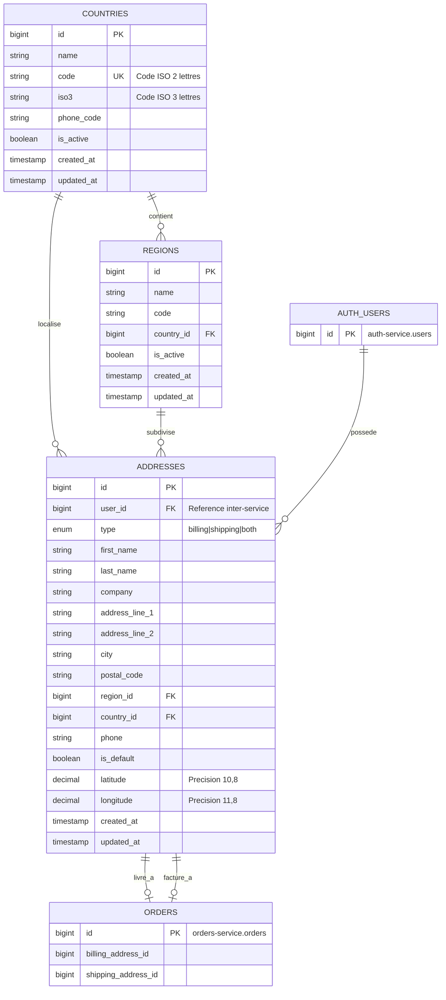

# Base de donnees du Service Addresses

## Table des matieres
- [Vue d'ensemble](#vue-densemble)
- [Informations de base de donnees](#informations-de-base-de-donnees)
- [Diagramme de relations entre entites](#diagramme-de-relations-entre-entites)
- [Specifications des tables](#specifications-des-tables)
- [Regles metier](#regles-metier)
- [Evenements RabbitMQ](#evenements-rabbitmq)
- [References inter-services](#references-inter-services)
- [Strategie d'indexation](#strategie-dindexation)
- [Motifs de requetes](#motifs-de-requetes)
- [Integrite des donnees](#integrite-des-donnees)

## Vue d'ensemble

Le service addresses gere les donnees geographiques et les adresses utilisateurs avec prise en charge de plusieurs types d'adresses (facturation, livraison ou les deux). Il fournit une structure hierarchique de pays, regions et adresses avec capacites de geolocalisation.

**Objectif:** Gestion centralisee des adresses et validation geographique pour la plateforme e-commerce

**Capacites cles:**
- Gestion des pays et regions (etats/provinces) avec normes ISO
- Support multi-types d'adresses (facturation, livraison, les deux)
- Designation d'adresse par defaut par utilisateur
- Stockage de geolocalisation (latitude/longitude)
- Association de numero de telephone avec les adresses
- Reference d'adresse inter-services pour commandes et livraisons

## Informations de base de donnees

**Nom de base de donnees:** addresses_service
**Port externe:** 3333 (acces developpement)
**Jeu de caracteres:** utf8mb4
**Collation:** utf8mb4_unicode_ci
**Moteur:** InnoDB

**Details de connexion:**
```env
DB_HOST=addresses-mysql
DB_PORT=3306
DB_DATABASE=addresses_service
DB_USERNAME=root
DB_PASSWORD=rootpass
```

**Acces externe:**
```bash
mysql -h 127.0.0.1 -P 3333 -u root -p addresses_service
# Mot de passe: rootpass
```

## Diagramme de relations entre entites



## Specifications des tables

### 1. countries

Definitions de pays geographiques suivant les normes ISO 3166.

**Colonnes:**

| Colonne | Type | Contraintes | Description |
|---------|------|-------------|-------------|
| id | BIGINT UNSIGNED | PRIMARY KEY, AUTO_INCREMENT | Identifiant unique de pays |
| name | VARCHAR(255) | NOT NULL | Nom complet du pays |
| code | VARCHAR(2) | NOT NULL, UNIQUE | Code ISO 3166-1 alpha-2 |
| iso3 | VARCHAR(3) | NULL | Code ISO 3166-1 alpha-3 |
| phone_code | VARCHAR(10) | NULL | Indicatif telephonique international |
| is_active | BOOLEAN | DEFAULT TRUE | Statut de disponibilite du pays |
| created_at | TIMESTAMP | NULL | Horodatage de creation d'enregistrement |
| updated_at | TIMESTAMP | NULL | Horodatage de modification d'enregistrement |

**Index:**
- PRIMARY KEY (id)
- UNIQUE KEY (code)
- INDEX (code, is_active)

**Donnees d'exemple:**
```sql
INSERT INTO countries (name, code, iso3, phone_code, is_active) VALUES
('Etats-Unis', 'US', 'USA', '+1', true),
('Canada', 'CA', 'CAN', '+1', true),
('Royaume-Uni', 'GB', 'GBR', '+44', true),
('France', 'FR', 'FRA', '+33', true);
```

---

### 2. regions

Etats, provinces ou divisions administratives au sein des pays.

**Colonnes:**

| Colonne | Type | Contraintes | Description |
|---------|------|-------------|-------------|
| id | BIGINT UNSIGNED | PRIMARY KEY, AUTO_INCREMENT | Identifiant unique de region |
| name | VARCHAR(255) | NOT NULL | Nom complet de la region |
| code | VARCHAR(255) | NULL | Abbreviation/code de la region |
| country_id | BIGINT UNSIGNED | FOREIGN KEY, NOT NULL | Reference a countries.id |
| is_active | BOOLEAN | DEFAULT TRUE | Statut de disponibilite de la region |
| created_at | TIMESTAMP | NULL | Horodatage de creation d'enregistrement |
| updated_at | TIMESTAMP | NULL | Horodatage de modification d'enregistrement |

**Cles etrangeres:**
- country_id REFERENCES countries(id) ON DELETE CASCADE

**Index:**
- PRIMARY KEY (id)
- FOREIGN KEY (country_id)
- INDEX (country_id, is_active)
- UNIQUE KEY (country_id, code)

**Donnees d'exemple:**
```sql
INSERT INTO regions (name, code, country_id) VALUES
('Californie', 'CA', 1),
('New York', 'NY', 1),
('Ontario', 'ON', 2),
('Quebec', 'QC', 2);
```

---

### 3. addresses

Adresses utilisateurs avec classification de type et support de geolocalisation.

**Colonnes:**

| Colonne | Type | Contraintes | Description |
|---------|------|-------------|-------------|
| id | BIGINT UNSIGNED | PRIMARY KEY, AUTO_INCREMENT | Identifiant unique d'adresse |
| user_id | BIGINT UNSIGNED | NOT NULL | Reference inter-service vers auth-service.users |
| type | ENUM | NOT NULL, DEFAULT 'both' | Type d'adresse: 'billing', 'shipping', 'both' |
| first_name | VARCHAR(255) | NOT NULL | Prenom du destinataire |
| last_name | VARCHAR(255) | NOT NULL | Nom du destinataire |
| company | VARCHAR(255) | NULL | Nom de l'entreprise (optionnel) |
| address_line_1 | VARCHAR(255) | NOT NULL | Adresse rue principale |
| address_line_2 | VARCHAR(255) | NULL | Ligne d'adresse secondaire (appt, suite) |
| city | VARCHAR(255) | NOT NULL | Nom de la ville |
| postal_code | VARCHAR(20) | NOT NULL | Code postal/ZIP |
| region_id | BIGINT UNSIGNED | FOREIGN KEY, NULL | Reference a regions.id |
| country_id | BIGINT UNSIGNED | FOREIGN KEY, NOT NULL | Reference a countries.id |
| phone | VARCHAR(255) | NULL | Numero de telephone de contact |
| is_default | BOOLEAN | DEFAULT FALSE | Indicateur d'adresse par defaut par utilisateur |
| latitude | DECIMAL(10,8) | NULL | Latitude geographique (-90 a 90) |
| longitude | DECIMAL(11,8) | NULL | Longitude geographique (-180 a 180) |
| created_at | TIMESTAMP | NULL | Horodatage de creation d'enregistrement |
| updated_at | TIMESTAMP | NULL | Horodatage de modification d'enregistrement |

**Cles etrangeres:**
- region_id REFERENCES regions(id) ON DELETE SET NULL
- country_id REFERENCES countries(id) ON DELETE CASCADE

**Index:**
- PRIMARY KEY (id)
- FOREIGN KEY (region_id)
- FOREIGN KEY (country_id)
- INDEX (user_id, type)
- INDEX (user_id, is_default)
- INDEX (country_id, region_id)

**Valeurs d'enumeration:**
- type: 'billing', 'shipping', 'both'

**Donnees d'exemple:**
```sql
INSERT INTO addresses (user_id, type, first_name, last_name, address_line_1, city, postal_code, country_id, region_id, is_default) VALUES
(1, 'both', 'Jean', 'Dupont', '123 Rue Principale', 'Paris', '75001', 4, NULL, true),
(1, 'shipping', 'Jean', 'Dupont', '456 Avenue du Travail', 'Lyon', '69001', 4, NULL, false);
```

## Regles metier

### Classification des types d'adresse

**Definitions de types:**
- **billing:** Adresse utilisee exclusivement pour facturation
- **shipping:** Adresse utilisee exclusivement pour livraison
- **both:** Adresse utilisable pour facturation et livraison

**Logique de type:**
```php
// Constantes de modele
Address::TYPE_BILLING  = 'billing'
Address::TYPE_SHIPPING = 'shipping'
Address::TYPE_BOTH     = 'both'

// Portees de requete
Address::billing()->get();   // Renvoie les adresses avec type 'billing' OU 'both'
Address::shipping()->get();  // Renvoie les adresses avec type 'shipping' OU 'both'
```

### Gestion de l'adresse par defaut

**Regles:**
- Chaque utilisateur peut avoir UNE adresse par defaut
- Definir is_default=true sur nouvelle adresse efface automatiquement le defaut precedent
- L'adresse par defaut est renvoyee en premier dans les listes d'adresses
- Si aucun defaut n'existe, la premiere adresse devient le defaut implicite

**Implementation:**
```php
// Avant d'enregistrer une nouvelle adresse par defaut
if ($address->is_default) {
    Address::where('user_id', $address->user_id)
        ->where('id', '!=', $address->id)
        ->update(['is_default' => false]);
}
```

### Donnees de geolocalisation

**Precision des coordonnees:**
- Latitude: DECIMAL(10,8) - Plage: -90.00000000 a 90.00000000
- Longitude: DECIMAL(11,8) - Plage: -180.00000000 a 180.00000000

**Utilisation:**
- Geocodage optionnel d'adresses pour optimisation de livraison
- Calcul de distance entre adresses
- Affichage sur carte et planification d'itineraire
- Integration avec delivery-service pour logistique

### Optionalite de la region

**Comportement:**
- region_id est nullable (certains pays n'utilisent pas de regions)
- ON DELETE SET NULL preserve l'adresse si region supprimee
- L'application valide que la region appartient au pays specifie

### Reference utilisateur inter-services

**Important:**
- user_id reference auth-service.users.id
- AUCUNE contrainte de cle etrangere de base de donnees (frontiere de microservice)
- Coherence des donnees maintenue via evenements RabbitMQ
- Le service valide l'existence de l'utilisateur via appels API ou cache d'evenements

## Evenements RabbitMQ

### Evenements publies

#### 1. AddressCreated

**Cle de routage:** `address.created`

**Charge utile:**
```json
{
  "event": "AddressCreated",
  "timestamp": "2025-10-03T12:34:56Z",
  "data": {
    "address_id": 123,
    "user_id": 456,
    "type": "both",
    "first_name": "Jean",
    "last_name": "Dupont",
    "address_line_1": "123 Rue Principale",
    "address_line_2": null,
    "city": "Paris",
    "postal_code": "75001",
    "region_id": null,
    "country_id": 4,
    "phone": "+33-6-12-34-56-78",
    "is_default": true,
    "latitude": 48.85661400,
    "longitude": 2.35222190
  }
}
```

**Abonnes:**
- orders-service (met en cache l'adresse pour creation de commande)
- deliveries-service (utilise pour routage de livraison)

---

#### 2. AddressUpdated

**Cle de routage:** `address.updated`

**Charge utile:**
```json
{
  "event": "AddressUpdated",
  "timestamp": "2025-10-03T13:45:10Z",
  "data": {
    "address_id": 123,
    "user_id": 456,
    "changes": {
      "city": {"old": "Paris", "new": "Lyon"},
      "postal_code": {"old": "75001", "new": "69001"}
    },
    "full_address": {
      "address_id": 123,
      "type": "both",
      "first_name": "Jean",
      "last_name": "Dupont",
      "address_line_1": "123 Rue Principale",
      "city": "Lyon",
      "postal_code": "69001",
      "region_id": null,
      "country_id": 4,
      "is_default": true
    }
  }
}
```

**Abonnes:**
- orders-service (met a jour les donnees d'adresse en cache)
- deliveries-service (met a jour les adresses de livraison)

---

#### 3. AddressDeleted

**Cle de routage:** `address.deleted`

**Charge utile:**
```json
{
  "event": "AddressDeleted",
  "timestamp": "2025-10-03T14:20:30Z",
  "data": {
    "address_id": 123,
    "user_id": 456,
    "type": "billing",
    "deleted_at": "2025-10-03T14:20:30Z"
  }
}
```

**Abonnes:**
- orders-service (marque l'adresse comme indisponible)
- deliveries-service (signale les livraisons utilisant l'adresse supprimee)

---

#### 4. DefaultAddressChanged

**Cle de routage:** `address.default.changed`

**Charge utile:**
```json
{
  "event": "DefaultAddressChanged",
  "timestamp": "2025-10-03T15:10:45Z",
  "data": {
    "user_id": 456,
    "previous_default_id": 100,
    "new_default_id": 123
  }
}
```

**Abonnes:**
- baskets-service (met a jour l'adresse par defaut de paiement)
- orders-service (met a jour le defaut utilisateur pour futures commandes)

### Evenements consommes

#### 1. UserCreated

**Source:** auth-service
**Cle de routage:** `user.created`
**Action:** Aucune action directe (adresses creees a la demande)

---

#### 2. UserDeleted

**Source:** auth-service
**Cle de routage:** `user.deleted`
**Action:**
- Supprimer toutes les adresses pour user_id
- Publier evenements AddressDeleted pour chaque adresse supprimee

```php
// Gestionnaire d'evenement
$addresses = Address::where('user_id', $userId)->get();
foreach ($addresses as $address) {
    $this->publishEvent('address.deleted', $address);
    $address->delete();
}
```

## References inter-services

### Reference par d'autres services

**orders-service:**
- Stocke billing_address_id et shipping_address_id
- Met en cache l'instantane d'adresse au moment de la creation de commande
- S'abonne a AddressUpdated pour commandes actuelles

**deliveries-service:**
- Utilise l'adresse de livraison des commandes
- Calcule les itineraires de livraison utilisant la geolocalisation
- Valide les zones de livraison

**baskets-service:**
- Suggere les adresses par defaut pendant le paiement
- Pre-remplit les formulaires d'adresse

### References vers d'autres services

**auth-service:**
- user_id reference auth-service.users.id
- AUCUNE contrainte FK de base de donnees (isolation de microservice)
- Valide l'existence de l'utilisateur via evenements UserCreated/UserDeleted

## Strategie d'indexation

### Index critiques pour performance

**1. Recherches d'adresses utilisateur**
```sql
INDEX idx_user_type (user_id, type)
```
Optimise les requetes: "Obtenir toutes les adresses de facturation pour l'utilisateur X"

**2. Recuperation d'adresse par defaut**
```sql
INDEX idx_user_default (user_id, is_default)
```
Optimise les requetes: "Obtenir l'adresse par defaut de l'utilisateur"

**3. Requetes geographiques**
```sql
INDEX idx_geographic (country_id, region_id)
```
Optimise les requetes: "Obtenir toutes les adresses en Californie, USA"

**4. Activation de pays**
```sql
INDEX idx_country_active (code, is_active)
```
Optimise les requetes: "Obtenir les pays actifs pour menu deroulant"

**5. Recherches de regions**
```sql
INDEX idx_region_country (country_id, is_active)
UNIQUE KEY idx_region_unique (country_id, code)
```
Optimise les requetes: "Obtenir les regions pour pays" et garantit codes de region uniques par pays

## Motifs de requetes

### Requetes courantes

**1. Obtenir l'adresse par defaut de l'utilisateur**
```php
$address = Address::where('user_id', $userId)
    ->where('is_default', true)
    ->first();
```

**2. Obtenir toutes les adresses de livraison pour l'utilisateur**
```php
$addresses = Address::forUser($userId)
    ->shipping()
    ->with(['country', 'region'])
    ->get();
```

**3. Obtenir les adresses de facturation dans pays actifs**
```php
$addresses = Address::billing()
    ->whereHas('country', function($query) {
        $query->where('is_active', true);
    })
    ->with(['country', 'region'])
    ->get();
```

**4. Obtenir les regions actives pour pays**
```php
$regions = Region::where('country_id', $countryId)
    ->where('is_active', true)
    ->orderBy('name')
    ->get();
```

**5. Rechercher les adresses par code postal**
```php
$addresses = Address::where('postal_code', 'LIKE', $postalCode . '%')
    ->where('country_id', $countryId)
    ->with(['country', 'region'])
    ->get();
```

**6. Recherche d'adresse basee sur la distance**
```php
// Trouver les adresses dans un rayon (necessite geolocalisation)
$addresses = Address::whereNotNull('latitude')
    ->whereNotNull('longitude')
    ->selectRaw("*,
        (6371 * acos(cos(radians(?)) * cos(radians(latitude)) *
        cos(radians(longitude) - radians(?)) +
        sin(radians(?)) * sin(radians(latitude)))) AS distance",
        [$lat, $lng, $lat])
    ->having('distance', '<', $radiusKm)
    ->orderBy('distance')
    ->get();
```

### Requetes optimisees avec chargement anticipe

**Eviter probleme N+1:**
```php
// MAUVAIS: Requetes N+1
$addresses = Address::all();
foreach ($addresses as $address) {
    echo $address->country->name; // +1 requete par adresse
    echo $address->region->name;  // +1 requete par adresse
}

// BON: Chargement anticipe
$addresses = Address::with(['country', 'region'])->get();
foreach ($addresses as $address) {
    echo $address->country->name; // Aucune requete supplementaire
    echo $address->region->name;  // Aucune requete supplementaire
}
```

## Integrite des donnees

### Integrite interne au service

**Contraintes de cles etrangeres:**
- regions.country_id → countries.id (CASCADE DELETE)
- addresses.country_id → countries.id (CASCADE DELETE)
- addresses.region_id → regions.id (SET NULL a la suppression)

**Comportement en cascade:**
```sql
-- Supprimer pays supprime toutes les regions et adresses
DELETE FROM countries WHERE id = 1;
-- Cascade vers:
--   - Toutes les regions dans ce pays (CASCADE)
--   - Toutes les adresses dans ce pays (CASCADE)

-- Supprimer region preserve les adresses mais annule region_id
DELETE FROM regions WHERE id = 10;
-- Resulte en:
--   - Les adresses conservent country_id mais region_id devient NULL
```

### Integrite inter-services

**Coherence pilotee par evenements:**

1. **Flux de suppression d'utilisateur:**
```
auth-service: DELETE user(id=456)
    |
    v
auth-service: PUBLISH UserDeleted(user_id=456)
    |
    v
addresses-service: CONSUME UserDeleted
    |
    v
addresses-service: DELETE addresses WHERE user_id=456
    |
    v
addresses-service: PUBLISH AddressDeleted pour chaque adresse
    |
    v
orders-service/deliveries-service: UPDATE references
```

2. **Validation d'adresse:**
- Le service valide l'existence de l'utilisateur via donnees utilisateur en cache
- Si utilisateur absent du cache, interroge auth-service via API Gateway
- Rejette la creation d'adresse pour utilisateurs inexistants

### Idempotence

Tous les gestionnaires de messages sont idempotents:
```php
// Exemple: Gestionnaire UserDeleted
public function handleUserDeleted($event) {
    $userId = $event['data']['user_id'];

    // Idempotent: sur d'executer plusieurs fois
    $addresses = Address::where('user_id', $userId)->get();

    if ($addresses->isEmpty()) {
        return; // Deja traite
    }

    foreach ($addresses as $address) {
        $this->publishEvent('address.deleted', $address);
        $address->delete();
    }
}
```

### Validation des donnees

**Verifications niveau application:**
```php
// Regles de validation d'adresse
'user_id' => 'required|integer',
'type' => 'required|in:billing,shipping,both',
'first_name' => 'required|string|max:255',
'last_name' => 'required|string|max:255',
'address_line_1' => 'required|string|max:255',
'city' => 'required|string|max:255',
'postal_code' => 'required|string|max:20',
'country_id' => 'required|exists:countries,id',
'region_id' => 'nullable|exists:regions,id',
'phone' => 'nullable|string|max:255',
'latitude' => 'nullable|numeric|between:-90,90',
'longitude' => 'nullable|numeric|between:-180,180',
```

**Validation personnalisee:**
```php
// S'assurer que la region appartient au pays
public function validateRegionCountry($regionId, $countryId) {
    if ($regionId) {
        $region = Region::find($regionId);
        if (!$region || $region->country_id !== $countryId) {
            throw new ValidationException('La region n\'appartient pas au pays');
        }
    }
}
```

## Considerations de performance

### Strategie de mise en cache

**Pays et regions:**
```php
// Mettre en cache les pays (changent rarement)
Cache::remember('countries.active', 3600, function() {
    return Country::where('is_active', true)->get();
});

// Mettre en cache les regions par pays
Cache::remember('regions.country.' . $countryId, 3600, function() use ($countryId) {
    return Region::where('country_id', $countryId)
        ->where('is_active', true)
        ->get();
});
```

**Adresse par defaut utilisateur:**
```php
// Mettre en cache l'adresse par defaut de l'utilisateur
Cache::remember('address.default.' . $userId, 600, function() use ($userId) {
    return Address::forUser($userId)->default()->first();
});

// Invalider lors de la mise a jour
Cache::forget('address.default.' . $userId);
```

### Optimisation des requetes

**Pagination:**
```php
// Paginer les grands ensembles de resultats
$addresses = Address::forUser($userId)
    ->with(['country', 'region'])
    ->paginate(20);
```

**Chargement selectif de colonnes:**
```php
// Charger uniquement les colonnes necessaires
$addresses = Address::select('id', 'user_id', 'type', 'city', 'country_id')
    ->where('user_id', $userId)
    ->get();
```

### Reglage de base de donnees

**Configuration MySQL recommandee:**
```ini
# Optimisations my.cnf
innodb_buffer_pool_size = 1G
innodb_log_file_size = 256M
query_cache_type = 1
query_cache_size = 64M
```

## Sauvegarde et recuperation

**Commande de sauvegarde:**
```bash
# Sauvegarder base de donnees addresses
docker-compose exec addresses-mysql mysqldump -u root -prootpass addresses_service > addresses_backup.sql

# Restaurer depuis sauvegarde
docker-compose exec -T addresses-mysql mysql -u root -prootpass addresses_service < addresses_backup.sql
```

**Priorite des tables critiques:**
1. addresses (donnees utilisateur - priorite la plus elevee)
2. countries (donnees de reference - priorite moyenne)
3. regions (donnees de reference - priorite moyenne)

## Considerations de securite

**Confidentialite des donnees:**
- Les adresses contiennent des IIP (Informations d'Identification Personnelle)
- Conformite RGPD: Supprimer les adresses sur demande de suppression d'utilisateur
- Chiffrer les champs sensibles en production (telephone, entreprise)

**Controle d'acces:**
- Les utilisateurs peuvent acceder uniquement a leurs propres adresses
- Les roles administrateur peuvent voir/gerer toutes les adresses
- API Gateway applique l'authentification JWT

**Prevention d'injection SQL:**
- Toutes les requetes utilisent la liaison de parametres Eloquent ORM
- Aucun SQL brut avec entree utilisateur
- Instructions preparees pour toutes les operations de base de donnees

## Migration et ensemencement

**Executer les migrations:**
```bash
docker-compose exec addresses-service php artisan migrate
```

**Ensemencer les donnees de developpement:**
```bash
docker-compose exec addresses-service php artisan db:seed
```

**Annuler:**
```bash
docker-compose exec addresses-service php artisan migrate:rollback
```

## Surveillance

**Metriques cles:**
- Adresses par utilisateur (moyenne, max)
- Frequence de mise a jour de l'adresse par defaut
- Distribution geographique des adresses
- Performance des requetes (temps de reponse moyen)
- Delai de publication d'evenement

**Requete de verification de sante:**
```sql
-- Verifier sante de la base de donnees
SELECT
    (SELECT COUNT(*) FROM countries) as country_count,
    (SELECT COUNT(*) FROM regions) as region_count,
    (SELECT COUNT(*) FROM addresses) as address_count,
    (SELECT COUNT(*) FROM addresses WHERE is_default = true) as default_addresses;
```
