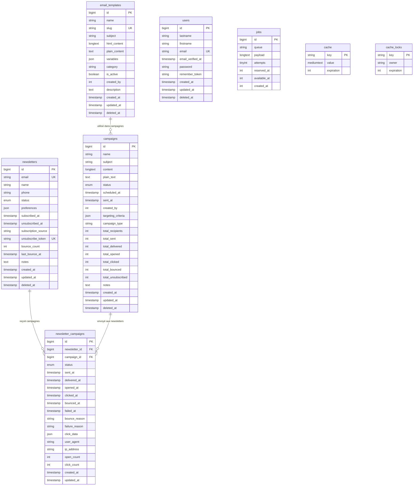

# Documentation de la Base de Données du Service Newsletters

## Table des Matières
- [Vue d'Ensemble](#vue-densemble)
- [Configuration de la Base de Données](#configuration-de-la-base-de-données)
- [Diagramme des Relations entre Entités](#diagramme-des-relations-entre-entités)
- [Spécifications des Tables](#spécifications-des-tables)
- [Gestion des Campagnes Email](#gestion-des-campagnes-email)
- [Suivi et Analytique Email](#suivi-et-analytique-email)
- [Système de Templates](#système-de-templates)
- [Intégration MinIO](#intégration-minio)
- [Événements RabbitMQ Publiés](#événements-rabbitmq-publiés)
- [Relations Inter-Services](#relations-inter-services)
- [Index et Performance](#index-et-performance)
- [Sauvegarde et Maintenance](#sauvegarde-et-maintenance)

## Vue d'Ensemble

Le service newsletters-service gère les campagnes de marketing par email, la gestion des abonnés et le suivi de la livraison des emails pour la plateforme e-commerce. Il fournit une orchestration complète des campagnes email avec un suivi analytique détaillé (ouvertures, clics, rebonds) et un système de templates flexible avec des variables dynamiques.

**Détails du Service :**
- Nom de la Base de Données : `newsletters_service_db`
- Port Externe : 3321 (pour le débogage et les clients de base de données)
- Port Conteneur : 3306
- Port Service : 8009
- Framework : Laravel 12 avec PHP 8.3+
- Stockage Objet : Bucket MinIO 'newsletters' pour templates et assets

**Responsabilités Principales :**
- Gestion des listes d'abonnés avec suivi des préférences
- Création, planification et envoi de campagnes email
- Suivi de la livraison des emails (envoyés, ouverts, cliqués, rebondis)
- Gestion de templates avec substitution de variables dynamiques
- Analytique et rapports email
- Gestion des tokens de désinscription pour opt-out en un clic
- Surveillance du taux de rebond et gestion du statut des abonnés

## Configuration de la Base de Données

**Détails de Connexion (depuis .env) :**
```env
DB_CONNECTION=mysql
DB_HOST=newsletters-mysql
DB_PORT=3306
DB_DATABASE=newsletters_service_db
DB_USERNAME=newsletters_user
DB_PASSWORD=newsletters_password

# Accès externe pour débogage
EXTERNAL_PORT=3321
```

**Configuration du Service Docker :**
```yaml
newsletters-mysql:
  image: mysql:8.0
  ports:
    - "3321:3306"
  environment:
    MYSQL_DATABASE: newsletters_service_db
    MYSQL_USER: newsletters_user
    MYSQL_PASSWORD: newsletters_password
    MYSQL_ROOT_PASSWORD: root_password
```

**Jeu de Caractères et Collation :**
```sql
CHARACTER SET: utf8mb4
COLLATION: utf8mb4_unicode_ci
```

**Configuration MinIO :**
```env
MINIO_ENDPOINT=http://minio:9000
MINIO_ACCESS_KEY=admin
MINIO_SECRET_KEY=adminpass123
MINIO_BUCKET=newsletters
MINIO_REGION=us-east-1
```

## Diagramme des Relations entre Entités



## Spécifications des Tables

### Tables Principales

#### newsletters
Gestion des abonnés avec préférences et suivi de statut.

**Colonnes :**
| Colonne | Type | Contraintes | Description |
|---------|------|-------------|-------------|
| id | BIGINT UNSIGNED | PRIMARY KEY, AUTO_INCREMENT | Identifiant unique abonné |
| email | VARCHAR(255) | NOT NULL, UNIQUE, INDEXED | Adresse email abonné |
| name | VARCHAR(255) | NULLABLE | Nom complet abonné |
| phone | VARCHAR(255) | NULLABLE | Numéro de téléphone abonné |
| status | ENUM | NOT NULL, INDEXED | Statut abonnement (subscribed, unsubscribed, pending, bounced) |
| preferences | JSON | NULLABLE | Préférences et intérêts abonné |
| subscribed_at | TIMESTAMP | NULLABLE, INDEXED | Horodatage abonnement |
| unsubscribed_at | TIMESTAMP | NULLABLE | Horodatage désinscription |
| subscription_source | VARCHAR(255) | NULLABLE | Source abonnement (website, checkout, api, etc.) |
| unsubscribe_token | VARCHAR(255) | NULLABLE, UNIQUE | Token pour désinscription en un clic |
| bounce_count | INT | NOT NULL, DEFAULT 0 | Nombre de rebonds email |
| last_bounce_at | TIMESTAMP | NULLABLE | Horodatage dernier rebond |
| notes | TEXT | NULLABLE | Notes admin sur abonné |
| created_at | TIMESTAMP | NULLABLE, INDEXED | Horodatage création enregistrement |
| updated_at | TIMESTAMP | NULLABLE | Horodatage dernière mise à jour |
| deleted_at | TIMESTAMP | NULLABLE | Horodatage suppression douce |

**Index :**
```sql
PRIMARY KEY (id)
UNIQUE KEY newsletters_email_unique (email)
UNIQUE KEY newsletters_unsubscribe_token_unique (unsubscribe_token)
INDEX newsletters_status_index (status)
INDEX newsletters_subscribed_at_index (subscribed_at)
INDEX newsletters_created_at_index (created_at)
```

**Règles Métier :**
- Email doit être unique parmi tous les abonnés
- Transitions de statut : pending -> subscribed -> unsubscribed
- Statut bounced automatiquement défini après 3+ rebonds
- Token désinscription généré au premier abonnement
- Désinscription en un clic utilise unsubscribe_token pour sécurité
- Préférences stockées en JSON pour gestion flexible des catégories
- Source abonnement suit origine pour analytique

**Flux de Travail Statut :**
```
pending -> subscribed (via confirmation email)
subscribed -> unsubscribed (demande utilisateur)
subscribed -> bounced (seuil 3+ rebonds)
bounced -> subscribed (réactivation manuelle après vérification)
```

**Exemple de Données :**
```json
{
  "id": 1,
  "email": "subscriber@example.com",
  "name": "Jane Doe",
  "phone": "+1234567890",
  "status": "subscribed",
  "preferences": {
    "categories": ["new_products", "promotions", "newsletters"],
    "frequency": "weekly",
    "topics": ["electronics", "books"]
  },
  "subscribed_at": "2025-10-03T10:00:00Z",
  "unsubscribed_at": null,
  "subscription_source": "checkout",
  "unsubscribe_token": "a1b2c3d4e5f6g7h8i9j0",
  "bounce_count": 0,
  "last_bounce_at": null,
  "notes": null,
  "created_at": "2025-10-03T10:00:00Z",
  "updated_at": "2025-10-03T10:00:00Z",
  "deleted_at": null
}
```

---

#### campaigns
Orchestration et suivi de campagnes email.

**Colonnes :**
| Colonne | Type | Contraintes | Description |
|---------|------|-------------|-------------|
| id | BIGINT UNSIGNED | PRIMARY KEY, AUTO_INCREMENT | Identifiant unique campagne |
| name | VARCHAR(255) | NOT NULL | Nom campagne (référence interne) |
| subject | VARCHAR(255) | NOT NULL | Ligne objet email |
| content | LONGTEXT | NOT NULL | Contenu email HTML |
| plain_text | TEXT | NULLABLE | Version texte brut email |
| status | ENUM | NOT NULL, INDEXED | Statut campagne (draft, scheduled, sending, sent, cancelled, failed) |
| scheduled_at | TIMESTAMP | NULLABLE, INDEXED | Heure envoi planifié campagne |
| sent_at | TIMESTAMP | NULLABLE, INDEXED | Heure achèvement envoi réel campagne |
| created_by | INT | NULLABLE, INDEXED | ID utilisateur ayant créé campagne |
| targeting_criteria | JSON | NULLABLE | Critères sélection destinataires |
| campaign_type | VARCHAR(255) | NOT NULL, INDEXED, DEFAULT 'newsletter' | Catégorie campagne (newsletter, promotional, transactional, etc.) |
| total_recipients | INT | NOT NULL, DEFAULT 0 | Total destinataires sélectionnés |
| total_sent | INT | NOT NULL, DEFAULT 0 | Total emails envoyés avec succès |
| total_delivered | INT | NOT NULL, DEFAULT 0 | Total emails livrés (sans rebond) |
| total_opened | INT | NOT NULL, DEFAULT 0 | Total ouvertures uniques |
| total_clicked | INT | NOT NULL, DEFAULT 0 | Total clics uniques |
| total_bounced | INT | NOT NULL, DEFAULT 0 | Total rebonds |
| total_unsubscribed | INT | NOT NULL, DEFAULT 0 | Total désinscriptions depuis cette campagne |
| notes | TEXT | NULLABLE | Notes et description campagne |
| created_at | TIMESTAMP | NULLABLE | Horodatage création enregistrement |
| updated_at | TIMESTAMP | NULLABLE | Horodatage dernière mise à jour |
| deleted_at | TIMESTAMP | NULLABLE | Horodatage suppression douce |

**Index :**
```sql
PRIMARY KEY (id)
INDEX campaigns_status_index (status)
INDEX campaigns_scheduled_at_index (scheduled_at)
INDEX campaigns_sent_at_index (sent_at)
INDEX campaigns_campaign_type_index (campaign_type)
INDEX campaigns_created_by_index (created_by)
```

**Règles Métier :**
- Progression de statut : draft -> scheduled -> sending -> sent
- Statut peut transiter vers cancelled ou failed à tout moment
- Campagnes planifiées mises en file pour envoi à scheduled_at
- Contenu supporte HTML avec substitution de variables de template
- Version texte brut auto-générée si non fournie
- Critères de ciblage filtrent destinataires par préférences, statut, etc.
- Métriques campagne mises à jour en temps réel lors événements
- Suppression douce préserve historique campagne pour analytique

**Flux de Travail Statut Campagne :**
```
draft -> scheduled (utilisateur planifie campagne)
scheduled -> sending (worker file commence envoi)
sending -> sent (tous emails traités)
sending -> failed (erreur critique pendant envoi)
* -> cancelled (annulation utilisateur)
```

**Exemple Critères Ciblage :**
```json
{
  "status": ["subscribed"],
  "preferences.categories": ["promotions"],
  "subscription_source": ["website", "checkout"],
  "exclude_bounced": true,
  "min_subscribed_days": 7
}
```

**Exemple de Données :**
```json
{
  "id": 1,
  "name": "Lancement Produit Octobre 2025",
  "subject": "Nouveaux Produits Passionnants Arrivés !",
  "content": "<html><body><h1>Nouveaux Produits</h1>...</body></html>",
  "plain_text": "Nouveaux Produits\n\n...",
  "status": "sent",
  "scheduled_at": "2025-10-03T10:00:00Z",
  "sent_at": "2025-10-03T10:05:00Z",
  "created_by": 1,
  "targeting_criteria": {
    "status": ["subscribed"],
    "preferences.categories": ["new_products"]
  },
  "campaign_type": "newsletter",
  "total_recipients": 5000,
  "total_sent": 4998,
  "total_delivered": 4950,
  "total_opened": 2475,
  "total_clicked": 1237,
  "total_bounced": 48,
  "total_unsubscribed": 12,
  "notes": "Campagne lancement produit Q4 2025",
  "created_at": "2025-10-01T14:00:00Z",
  "updated_at": "2025-10-03T12:00:00Z",
  "deleted_at": null
}
```

---

#### newsletter_campaigns
Table pivot suivant les livraisons email individuelles avec suivi détaillé.

**Colonnes :**
| Colonne | Type | Contraintes | Description |
|---------|------|-------------|-------------|
| id | BIGINT UNSIGNED | PRIMARY KEY, AUTO_INCREMENT | Identifiant unique enregistrement livraison |
| newsletter_id | BIGINT UNSIGNED | NOT NULL, INDEXED, FK | Identifiant abonné |
| campaign_id | BIGINT UNSIGNED | NOT NULL, INDEXED, FK | Identifiant campagne |
| status | ENUM | NOT NULL, INDEXED | Statut livraison (pending, sent, delivered, opened, clicked, bounced, failed) |
| sent_at | TIMESTAMP | NULLABLE, INDEXED | Horodatage envoi email |
| delivered_at | TIMESTAMP | NULLABLE | Horodatage livraison email (sans rebond) |
| opened_at | TIMESTAMP | NULLABLE, INDEXED | Horodatage première ouverture email |
| clicked_at | TIMESTAMP | NULLABLE, INDEXED | Horodatage premier clic lien |
| bounced_at | TIMESTAMP | NULLABLE | Horodatage rebond |
| failed_at | TIMESTAMP | NULLABLE | Horodatage échec |
| bounce_reason | VARCHAR(255) | NULLABLE | Raison rebond (hard bounce, soft bounce, etc.) |
| failure_reason | VARCHAR(255) | NULLABLE | Raison échec |
| click_data | JSON | NULLABLE | Données suivi clics détaillées |
| user_agent | VARCHAR(255) | NULLABLE | User agent depuis ouverture/clic |
| ip_address | VARCHAR(255) | NULLABLE | Adresse IP depuis ouverture/clic |
| open_count | INT | NOT NULL, DEFAULT 0 | Nombre total ouvertures |
| click_count | INT | NOT NULL, DEFAULT 0 | Nombre total clics |
| created_at | TIMESTAMP | NULLABLE | Horodatage création enregistrement |
| updated_at | TIMESTAMP | NULLABLE | Horodatage dernière mise à jour |

**Index :**
```sql
PRIMARY KEY (id)
INDEX newsletter_campaigns_newsletter_id_campaign_id_index (newsletter_id, campaign_id)
INDEX newsletter_campaigns_status_index (status)
INDEX newsletter_campaigns_sent_at_index (sent_at)
INDEX newsletter_campaigns_opened_at_index (opened_at)
INDEX newsletter_campaigns_clicked_at_index (clicked_at)
UNIQUE KEY unique_newsletter_campaign (newsletter_id, campaign_id)
FOREIGN KEY (newsletter_id) REFERENCES newsletters(id) ON DELETE CASCADE
FOREIGN KEY (campaign_id) REFERENCES campaigns(id) ON DELETE CASCADE
```

**Règles Métier :**
- Contrainte unique empêche envois dupliqués au même abonné par campagne
- Progression de statut : pending -> sent -> delivered -> opened -> clicked
- Statut bounced ou failed termine progression
- opened_at et clicked_at enregistrent première occurrence uniquement
- open_count et click_count suivent actions répétées
- click_data stocke URL, horodatage et contexte pour chaque clic
- Suppression cascade clé étrangère supprime enregistrements si newsletter ou campagne supprimée
- User agent et IP collectés pour analytique (anonymisés après 90 jours)

**Flux de Travail Statut Livraison :**
```
pending -> sent (email envoyé au MTA)
sent -> delivered (MTA confirme livraison)
delivered -> opened (pixel suivi chargé)
opened -> clicked (lien cliqué)

sent -> bounced (MTA signale rebond)
sent -> failed (erreur envoi)
```

**Structure Données Clic :**
```json
{
  "clicks": [
    {
      "url": "https://example.com/product/123",
      "timestamp": "2025-10-03T10:15:00Z",
      "click_id": "c1b2c3d4",
      "link_text": "Voir Produit"
    },
    {
      "url": "https://example.com/unsubscribe",
      "timestamp": "2025-10-03T10:16:00Z",
      "click_id": "d2c3d4e5",
      "link_text": "Se Désinscrire"
    }
  ]
}
```

**Exemple de Données :**
```json
{
  "id": 1,
  "newsletter_id": 1,
  "campaign_id": 1,
  "status": "clicked",
  "sent_at": "2025-10-03T10:05:00Z",
  "delivered_at": "2025-10-03T10:05:30Z",
  "opened_at": "2025-10-03T10:15:00Z",
  "clicked_at": "2025-10-03T10:16:00Z",
  "bounced_at": null,
  "failed_at": null,
  "bounce_reason": null,
  "failure_reason": null,
  "click_data": {
    "clicks": [
      {
        "url": "https://example.com/product/123",
        "timestamp": "2025-10-03T10:16:00Z"
      }
    ]
  },
  "user_agent": "Mozilla/5.0 (Windows NT 10.0; Win64; x64)",
  "ip_address": "192.168.1.100",
  "open_count": 3,
  "click_count": 2,
  "created_at": "2025-10-03T10:05:00Z",
  "updated_at": "2025-10-03T10:16:00Z"
}
```

---

#### email_templates
Templates email réutilisables avec substitution de variables dynamiques.

**Colonnes :**
| Colonne | Type | Contraintes | Description |
|---------|------|-------------|-------------|
| id | BIGINT UNSIGNED | PRIMARY KEY, AUTO_INCREMENT | Identifiant unique template |
| name | VARCHAR(255) | NOT NULL | Nom template (lisible humain) |
| slug | VARCHAR(255) | NOT NULL, UNIQUE, INDEXED | Slug template (identifiant lisible machine) |
| subject | VARCHAR(255) | NOT NULL | Ligne objet email par défaut |
| html_content | LONGTEXT | NOT NULL | Contenu template HTML avec variables |
| plain_content | TEXT | NULLABLE | Contenu template texte brut |
| variables | JSON | NULLABLE | Variables disponibles pour substitution |
| category | VARCHAR(255) | NOT NULL, INDEXED, DEFAULT 'newsletter' | Catégorie template (newsletter, transactional, promotional) |
| is_active | BOOLEAN | NOT NULL, INDEXED, DEFAULT TRUE | Statut actif template |
| created_by | INT | NULLABLE | ID utilisateur ayant créé template |
| description | TEXT | NULLABLE | Description et notes utilisation template |
| created_at | TIMESTAMP | NULLABLE | Horodatage création enregistrement |
| updated_at | TIMESTAMP | NULLABLE | Horodatage dernière mise à jour |
| deleted_at | TIMESTAMP | NULLABLE | Horodatage suppression douce |

**Index :**
```sql
PRIMARY KEY (id)
UNIQUE KEY email_templates_slug_unique (slug)
INDEX email_templates_slug_index (slug)
INDEX email_templates_category_index (category)
INDEX email_templates_is_active_index (is_active)
```

**Règles Métier :**
- Slug doit être unique et compatible URL (minuscules, tirets)
- Templates supportent substitution variables utilisant doubles accolades {{variable}}
- Variables définies en JSON pour validation et suggestions éditeur
- Contenu HTML doit être responsive et compatible clients email
- Version texte brut auto-générée si non fournie
- Seuls templates actifs disponibles pour création campagne
- Suppression douce préserve templates utilisés dans campagnes historiques
- Templates stockés dans MinIO pour contrôle version et gestion assets

**Substitution Variables :**
```html
<!-- Contenu HTML Template -->
<h1>Bonjour {{subscriber_name}} !</h1>
<p>Découvrez nos derniers {{product_category}} :</p>
<a href="{{product_url}}">{{product_name}}</a>
<p>Prix : {{product_price}}</p>

<!-- Variables JSON -->
{
  "subscriber_name": {
    "type": "string",
    "required": true,
    "description": "Prénom abonné"
  },
  "product_category": {
    "type": "string",
    "required": true,
    "description": "Nom catégorie produit"
  },
  "product_url": {
    "type": "string",
    "required": true,
    "description": "URL page détail produit"
  },
  "product_name": {
    "type": "string",
    "required": true,
    "description": "Nom produit"
  },
  "product_price": {
    "type": "string",
    "required": true,
    "description": "Prix produit formaté"
  }
}
```

**Exemple de Données :**
```json
{
  "id": 1,
  "name": "Annonce Lancement Produit",
  "slug": "annonce-lancement-produit",
  "subject": "Présentation {{product_name}} - Disponible Maintenant !",
  "html_content": "<html><body><h1>Bonjour {{subscriber_name}} !</h1>...</body></html>",
  "plain_content": "Bonjour {{subscriber_name}} !\n\n...",
  "variables": {
    "subscriber_name": {
      "type": "string",
      "required": true
    },
    "product_name": {
      "type": "string",
      "required": true
    },
    "product_url": {
      "type": "string",
      "required": true
    }
  },
  "category": "promotional",
  "is_active": true,
  "created_by": 1,
  "description": "Template pour annonces lancement nouveaux produits",
  "created_at": "2025-09-01T10:00:00Z",
  "updated_at": "2025-09-15T14:30:00Z",
  "deleted_at": null
}
```

---

### Tables Laravel Standard

#### users
Cache local données utilisateur depuis auth-service pour optimisation performance.

**Colonnes :**
| Colonne | Type | Contraintes | Description |
|---------|------|-------------|-------------|
| id | BIGINT UNSIGNED | PRIMARY KEY | Identifiant utilisateur (synchronisé depuis auth-service) |
| lastname | VARCHAR(255) | NOT NULL | Nom famille utilisateur |
| firstname | VARCHAR(255) | NOT NULL | Prénom utilisateur |
| email | VARCHAR(255) | NOT NULL, UNIQUE | Adresse email utilisateur |
| email_verified_at | TIMESTAMP | NULLABLE | Horodatage vérification email |
| password | VARCHAR(255) | NOT NULL | Hash mot de passe (non utilisé dans newsletters-service) |
| remember_token | VARCHAR(100) | NULLABLE | Token souvenir (non utilisé dans newsletters-service) |
| created_at | TIMESTAMP | NULLABLE | Horodatage création enregistrement |
| updated_at | TIMESTAMP | NULLABLE | Horodatage dernière synchronisation |
| deleted_at | TIMESTAMP | NULLABLE | Horodatage suppression douce |

**Règles Métier :**
- Synchronisé depuis auth-service via événements RabbitMQ
- Modèle cohérence éventuelle (mises à jour sous 1 seconde)
- Supporte liaison abonné-utilisateur pour personnalisation
- Champ password non utilisé (authentification gérée par auth-service)

---

#### jobs
File pour envoi et traitement email asynchrone.

**Colonnes :**
| Colonne | Type | Contraintes | Description |
|---------|------|-------------|-------------|
| id | BIGINT UNSIGNED | PRIMARY KEY, AUTO_INCREMENT | Identifiant job |
| queue | VARCHAR(255) | NOT NULL, INDEXED | Nom file (email, campaign, tracking) |
| payload | LONGTEXT | NOT NULL | Données job sérialisées |
| attempts | TINYINT UNSIGNED | NOT NULL | Compteur tentatives exécution |
| reserved_at | INT UNSIGNED | NULLABLE | Horodatage réservation job |
| available_at | INT UNSIGNED | NOT NULL | Horodatage disponibilité job |
| created_at | INT UNSIGNED | NOT NULL | Horodatage création job |

**Règles Métier :**
- File email : Envoi email individuel (priorité)
- File campaign : Orchestration campagne
- File tracking : Traitement événements ouverture/clic
- Maximum 3 tentatives avant déplacement vers failed_jobs

---

#### cache
Cache application pour optimisation performance.

**Colonnes :**
| Colonne | Type | Contraintes | Description |
|---------|------|-------------|-------------|
| key | VARCHAR(255) | PRIMARY KEY | Clé cache |
| value | MEDIUMTEXT | NOT NULL | Valeur cachée sérialisée |
| expiration | INT | NOT NULL | Horodatage expiration |

**Règles Métier :**
- Stocke listes destinataires campagne pendant envoi
- Cache comptages abonnés pour tableau de bord
- TTL : 5 minutes pour comptages, 1 heure pour listes

---

#### cache_locks
Verrouillage distribué pour opérations concurrentes.

**Colonnes :**
| Colonne | Type | Contraintes | Description |
|---------|------|-------------|-------------|
| key | VARCHAR(255) | PRIMARY KEY | Clé verrouillage |
| owner | VARCHAR(255) | NOT NULL | Identifiant propriétaire verrouillage |
| expiration | INT | NOT NULL | Horodatage expiration verrouillage |

**Règles Métier :**
- Empêche envois campagne dupliqués
- Verrouillages durant traitement rebond
- Expiration verrouillage 5 minutes

---

## Gestion des Campagnes Email

### Flux de Travail Création Campagne

#### 1. Création Brouillon
```php
// Créer brouillon campagne
$campaign = Campaign::create([
    'name' => 'Lancement Produit Octobre',
    'subject' => 'Nouveaux Produits Disponibles !',
    'content' => $htmlContent,
    'plain_text' => $plainText,
    'status' => 'draft',
    'campaign_type' => 'promotional',
    'created_by' => auth()->id()
]);
```

#### 2. Sélection Destinataires
```php
// Appliquer critères ciblage
$recipients = Newsletter::where('status', 'subscribed')
    ->whereJsonContains('preferences->categories', 'new_products')
    ->where('bounce_count', '<', 3)
    ->get();

$campaign->update([
    'total_recipients' => $recipients->count(),
    'targeting_criteria' => [
        'status' => ['subscribed'],
        'preferences.categories' => ['new_products'],
        'max_bounce_count' => 2
    ]
]);
```

#### 3. Planification Campagne
```php
// Planifier campagne
$campaign->update([
    'status' => 'scheduled',
    'scheduled_at' => now()->addHours(24)
]);

// Dispatcher en file à heure planifiée
SendScheduledCampaign::dispatch($campaign)
    ->delay($campaign->scheduled_at);
```

#### 4. Envoi Campagne
```php
// Worker file traite campagne
public function handle(Campaign $campaign): void
{
    $campaign->update(['status' => 'sending']);

    $recipients = $this->getRecipients($campaign);

    foreach ($recipients as $newsletter) {
        // Créer enregistrement livraison
        NewsletterCampaign::create([
            'newsletter_id' => $newsletter->id,
            'campaign_id' => $campaign->id,
            'status' => 'pending'
        ]);

        // Mettre email individuel en file
        SendCampaignEmail::dispatch($campaign, $newsletter);
    }
}
```

#### 5. Envoi Email Individuel
```php
public function handle(Campaign $campaign, Newsletter $newsletter): void
{
    try {
        // Personnaliser contenu
        $content = $this->substituteVariables(
            $campaign->content,
            $newsletter
        );

        // Envoyer email avec suivi
        Mail::to($newsletter->email)
            ->send(new CampaignEmail(
                $campaign,
                $content,
                $this->generateTrackingPixel($newsletter, $campaign),
                $this->wrapLinksWithTracking($content, $newsletter, $campaign)
            ));

        // Mettre à jour enregistrement livraison
        NewsletterCampaign::where([
            'newsletter_id' => $newsletter->id,
            'campaign_id' => $campaign->id
        ])->update([
            'status' => 'sent',
            'sent_at' => now()
        ]);

        // Mettre à jour compteurs campagne
        $campaign->increment('total_sent');

    } catch (Exception $e) {
        // Gérer échec envoi
        NewsletterCampaign::where([
            'newsletter_id' => $newsletter->id,
            'campaign_id' => $campaign->id
        ])->update([
            'status' => 'failed',
            'failed_at' => now(),
            'failure_reason' => $e->getMessage()
        ]);

        Log::error('Échec envoi email campagne', [
            'campaign_id' => $campaign->id,
            'newsletter_id' => $newsletter->id,
            'error' => $e->getMessage()
        ]);
    }
}
```

#### 6. Achèvement Campagne
```php
// Vérifier si tous emails traités
public function checkCampaignCompletion(Campaign $campaign): void
{
    $pending = NewsletterCampaign::where('campaign_id', $campaign->id)
        ->where('status', 'pending')
        ->count();

    if ($pending === 0) {
        $campaign->update([
            'status' => 'sent',
            'sent_at' => now()
        ]);

        // Publier événement achèvement
        event(new CampaignSent($campaign));
    }
}
```

---

### Annulation Campagne

```php
public function cancelCampaign(Campaign $campaign): void
{
    if (!in_array($campaign->status, ['draft', 'scheduled', 'sending'])) {
        throw new CampaignException('Campagne ne peut être annulée');
    }

    // Annuler envois en attente
    NewsletterCampaign::where('campaign_id', $campaign->id)
        ->where('status', 'pending')
        ->delete();

    $campaign->update([
        'status' => 'cancelled',
        'notes' => $campaign->notes . "\nAnnulée à " . now()
    ]);
}
```

---

## Suivi et Analytique Email

### Implémentation Pixel Suivi

#### Suivi Ouverture
```php
// Générer pixel suivi
public function generateTrackingPixel(Newsletter $newsletter, Campaign $campaign): string
{
    $token = base64_encode(json_encode([
        'newsletter_id' => $newsletter->id,
        'campaign_id' => $campaign->id,
        'timestamp' => now()->timestamp
    ]));

    return sprintf(
        '',
        config('app.url'),
        $token
    );
}

// Suivre événement ouverture
public function trackOpen(string $token, Request $request): Response
{
    $data = json_decode(base64_decode($token), true);

    $record = NewsletterCampaign::where([
        'newsletter_id' => $data['newsletter_id'],
        'campaign_id' => $data['campaign_id']
    ])->first();

    if ($record && $record->status !== 'opened') {
        $record->update([
            'status' => 'opened',
            'opened_at' => now(),
            'user_agent' => $request->userAgent(),
            'ip_address' => $request->ip()
        ]);

        Campaign::find($data['campaign_id'])->increment('total_opened');
    }

    // Incrémenter compteur ouvertures pour ouvertures répétées
    $record->increment('open_count');

    // Retourner pixel transparent 1x1
    return response(base64_decode(
        'R0lGODlhAQABAIAAAAAAAP///yH5BAEAAAAALAAAAAABAAEAAAIBRAA7'
    ))->header('Content-Type', 'image/gif');
}
```

---

### Suivi Clics

```php
// Encapsuler liens avec suivi
public function wrapLinksWithTracking(
    string $content,
    Newsletter $newsletter,
    Campaign $campaign
): string {
    $dom = new DOMDocument();
    $dom->loadHTML($content);

    foreach ($dom->getElementsByTagName('a') as $link) {
        $originalUrl = $link->getAttribute('href');

        // Ignorer liens désinscription
        if (str_contains($originalUrl, '/unsubscribe')) {
            continue;
        }

        $trackingUrl = $this->generateTrackingUrl(
            $originalUrl,
            $newsletter,
            $campaign
        );

        $link->setAttribute('href', $trackingUrl);
    }

    return $dom->saveHTML();
}

// Générer URL suivi
public function generateTrackingUrl(
    string $url,
    Newsletter $newsletter,
    Campaign $campaign
): string {
    $token = base64_encode(json_encode([
        'newsletter_id' => $newsletter->id,
        'campaign_id' => $campaign->id,
        'url' => $url,
        'timestamp' => now()->timestamp
    ]));

    return route('track.click', ['token' => $token]);
}

// Suivre événement clic
public function trackClick(string $token, Request $request): RedirectResponse
{
    $data = json_decode(base64_decode($token), true);

    $record = NewsletterCampaign::where([
        'newsletter_id' => $data['newsletter_id'],
        'campaign_id' => $data['campaign_id']
    ])->first();

    if ($record) {
        // Enregistrer premier clic
        if (!$record->clicked_at) {
            $record->update([
                'status' => 'clicked',
                'clicked_at' => now()
            ]);

            Campaign::find($data['campaign_id'])->increment('total_clicked');
        }

        // Ajouter clic à click_data
        $clickData = $record->click_data ?? ['clicks' => []];
        $clickData['clicks'][] = [
            'url' => $data['url'],
            'timestamp' => now()->toIso8601String()
        ];

        $record->update(['click_data' => $clickData]);
        $record->increment('click_count');
    }

    // Rediriger vers URL originale
    return redirect($data['url']);
}
```

---

### Gestion Rebonds

```php
// Traiter notification rebond (webhook depuis fournisseur email)
public function handleBounce(Request $request): JsonResponse
{
    $email = $request->input('email');
    $bounceType = $request->input('type'); // hard, soft
    $reason = $request->input('reason');

    $newsletter = Newsletter::where('email', $email)->first();

    if (!$newsletter) {
        return response()->json(['status' => 'ignored'], 200);
    }

    // Mettre à jour compteur rebonds abonné
    $newsletter->increment('bounce_count');
    $newsletter->update(['last_bounce_at' => now()]);

    // Mettre à jour enregistrement livraison
    $recentCampaign = NewsletterCampaign::where('newsletter_id', $newsletter->id)
        ->whereNotNull('sent_at')
        ->whereNull('bounced_at')
        ->latest('sent_at')
        ->first();

    if ($recentCampaign) {
        $recentCampaign->update([
            'status' => 'bounced',
            'bounced_at' => now(),
            'bounce_reason' => $bounceType . ': ' . $reason
        ]);

        Campaign::find($recentCampaign->campaign_id)->increment('total_bounced');
    }

    // Désinscrire automatiquement après 3 hard bounces
    if ($bounceType === 'hard' && $newsletter->bounce_count >= 3) {
        $newsletter->update([
            'status' => 'bounced',
            'notes' => 'Désinscrit automatiquement suite rebonds hard répétés'
        ]);
    }

    return response()->json(['status' => 'processed'], 200);
}
```

---

### Requêtes Analytiques

#### Rapport Performance Campagne
```sql
SELECT
    c.id,
    c.name,
    c.sent_at,
    c.total_recipients,
    c.total_sent,
    c.total_delivered,
    c.total_opened,
    c.total_clicked,
    c.total_bounced,
    c.total_unsubscribed,
    ROUND((c.total_delivered / c.total_sent) * 100, 2) AS delivery_rate,
    ROUND((c.total_opened / c.total_delivered) * 100, 2) AS open_rate,
    ROUND((c.total_clicked / c.total_opened) * 100, 2) AS click_through_rate,
    ROUND((c.total_bounced / c.total_sent) * 100, 2) AS bounce_rate
FROM campaigns c
WHERE c.status = 'sent'
ORDER BY c.sent_at DESC
LIMIT 10;
```

#### Score Engagement Abonné
```sql
SELECT
    n.id,
    n.email,
    COUNT(nc.id) AS campaigns_received,
    SUM(CASE WHEN nc.opened_at IS NOT NULL THEN 1 ELSE 0 END) AS total_opens,
    SUM(CASE WHEN nc.clicked_at IS NOT NULL THEN 1 ELSE 0 END) AS total_clicks,
    ROUND(
        (SUM(CASE WHEN nc.opened_at IS NOT NULL THEN 1 ELSE 0 END) /
         COUNT(nc.id)) * 100,
        2
    ) AS engagement_rate
FROM newsletters n
LEFT JOIN newsletter_campaigns nc ON n.id = nc.newsletter_id
WHERE n.status = 'subscribed'
GROUP BY n.id, n.email
HAVING campaigns_received > 0
ORDER BY engagement_rate DESC
LIMIT 100;
```

---

## Système de Templates

### Moteur Substitution Variables

```php
public function substituteVariables(string $content, Newsletter $newsletter): string
{
    $variables = [
        'subscriber_name' => $newsletter->name ?? 'Client Estimé',
        'subscriber_email' => $newsletter->email,
        'unsubscribe_url' => $this->generateUnsubscribeUrl($newsletter),
        'preferences_url' => route('preferences', $newsletter->id),
        'company_name' => config('app.name'),
        'company_address' => config('company.address'),
        'current_year' => date('Y')
    ];

    // Remplacer variables dans contenu
    foreach ($variables as $key => $value) {
        $content = str_replace('{{'.$key.'}}', $value, $content);
    }

    return $content;
}
```

---

### Validation Template

```php
public function validateTemplate(EmailTemplate $template): array
{
    $errors = [];

    // Vérifier variables requises
    preg_match_all('/{{(\w+)}}/', $template->html_content, $matches);
    $usedVariables = array_unique($matches[1]);

    $definedVariables = array_keys($template->variables ?? []);

    $undefinedVariables = array_diff($usedVariables, $definedVariables);

    if (!empty($undefinedVariables)) {
        $errors[] = 'Variables non définies : ' . implode(', ', $undefinedVariables);
    }

    // Valider structure HTML
    libxml_use_internal_errors(true);
    $dom = new DOMDocument();
    $dom->loadHTML($template->html_content);

    if (libxml_get_last_error()) {
        $errors[] = 'Structure HTML invalide';
    }

    // Vérifier lien désinscription
    if (!str_contains($template->html_content, '{{unsubscribe_url}}')) {
        $errors[] = 'Template doit inclure lien désinscription';
    }

    return $errors;
}
```

---

## Intégration MinIO

### Structure Bucket
```
newsletters/
├── templates/
│   ├── {template-slug}/
│   │   ├── v{version}/
│   │   │   ├── index.html
│   │   │   ├── plain.txt
│   │   │   └── metadata.json
│   │   └── assets/
│   │       ├── logo.png
│   │       ├── header.jpg
│   │       └── styles.css
├── campaigns/
│   ├── {campaign-id}/
│   │   ├── content.html
│   │   ├── recipients.csv
│   │   └── report.json
└── assets/
    ├── images/
    └── attachments/
```

### Stockage Template

```php
// Stocker template dans MinIO
public function storeTemplate(EmailTemplate $template): void
{
    $s3 = Storage::disk('minio');
    $basePath = "templates/{$template->slug}/v{$template->version}";

    // Stocker contenu HTML
    $s3->put("{$basePath}/index.html", $template->html_content);

    // Stocker texte brut
    $s3->put("{$basePath}/plain.txt", $template->plain_content);

    // Stocker métadonnées
    $s3->put("{$basePath}/metadata.json", json_encode([
        'template_id' => $template->id,
        'version' => $template->version,
        'variables' => $template->variables,
        'created_at' => $template->created_at,
        'created_by' => $template->created_by
    ]));

    // Générer URL présignée pour aperçu
    $previewUrl = $s3->temporaryUrl(
        "{$basePath}/index.html",
        now()->addHours(1)
    );

    $template->update(['preview_url' => $previewUrl]);
}

// Charger template depuis MinIO
public function loadTemplate(string $slug, int $version = null): array
{
    $s3 = Storage::disk('minio');

    // Obtenir dernière version si non spécifiée
    if (!$version) {
        $versions = $s3->allDirectories("templates/{$slug}");
        $version = max(array_map(
            fn($v) => (int)str_replace('v', '', basename($v)),
            $versions
        ));
    }

    $basePath = "templates/{$slug}/v{$version}";

    return [
        'html' => $s3->get("{$basePath}/index.html"),
        'plain' => $s3->get("{$basePath}/plain.txt"),
        'metadata' => json_decode($s3->get("{$basePath}/metadata.json"), true)
    ];
}
```

---

### Gestion Assets

```php
// Téléverser assets template
public function uploadAsset(Request $request, EmailTemplate $template): JsonResponse
{
    $file = $request->file('asset');
    $s3 = Storage::disk('minio');

    $path = "templates/{$template->slug}/assets/{$file->hashName()}";

    $s3->put($path, file_get_contents($file), 'public');

    // Générer URL publique permanente
    $url = $s3->url($path);

    return response()->json([
        'url' => $url,
        'path' => $path,
        'filename' => $file->getClientOriginalName()
    ]);
}
```

---

## Événements RabbitMQ Publiés

### Configuration Exchange
```yaml
exchange: microservices_exchange
type: topic
durable: true
```

### Événements Publiés

#### 1. CampaignScheduled
Publié quand campagne est planifiée pour envoi.

**Clé Routage :** `newsletters.campaign.scheduled`

**Charge Utile :**
```json
{
  "event_id": "a1b2c3d4-e5f6-47g8-h9i0-j1k2l3m4n5o6",
  "event_type": "campaign.scheduled",
  "timestamp": "2025-10-03T10:00:00Z",
  "version": "1.0",
  "data": {
    "campaign_id": 1,
    "campaign_name": "Lancement Produit Octobre",
    "scheduled_at": "2025-10-04T10:00:00Z",
    "total_recipients": 5000,
    "campaign_type": "promotional"
  }
}
```

---

#### 2. CampaignSent
Publié quand envoi campagne est terminé.

**Clé Routage :** `newsletters.campaign.sent`

**Charge Utile :**
```json
{
  "event_id": "b2c3d4e5-f6g7-58h9-i0j1-k2l3m4n5o6p7",
  "event_type": "campaign.sent",
  "timestamp": "2025-10-04T10:30:00Z",
  "version": "1.0",
  "data": {
    "campaign_id": 1,
    "campaign_name": "Lancement Produit Octobre",
    "sent_at": "2025-10-04T10:30:00Z",
    "total_recipients": 5000,
    "total_sent": 4998,
    "total_failed": 2
  }
}
```

---

#### 3. EmailOpened
Publié quand abonné ouvre email.

**Clé Routage :** `newsletters.email.opened`

**Charge Utile :**
```json
{
  "event_id": "c3d4e5f6-g7h8-69i0-j1k2-l3m4n5o6p7q8",
  "event_type": "email.opened",
  "timestamp": "2025-10-04T11:00:00Z",
  "version": "1.0",
  "data": {
    "newsletter_id": 1,
    "campaign_id": 1,
    "email": "subscriber@example.com",
    "opened_at": "2025-10-04T11:00:00Z"
  }
}
```

---

#### 4. EmailClicked
Publié quand abonné clique lien dans email.

**Clé Routage :** `newsletters.email.clicked`

**Charge Utile :**
```json
{
  "event_id": "d4e5f6g7-h8i9-70j1-k2l3-m4n5o6p7q8r9",
  "event_type": "email.clicked",
  "timestamp": "2025-10-04T11:05:00Z",
  "version": "1.0",
  "data": {
    "newsletter_id": 1,
    "campaign_id": 1,
    "email": "subscriber@example.com",
    "clicked_url": "https://example.com/product/123",
    "clicked_at": "2025-10-04T11:05:00Z"
  }
}
```

---

#### 5. SubscriberUnsubscribed
Publié quand abonné se désinscrit.

**Clé Routage :** `newsletters.subscriber.unsubscribed`

**Charge Utile :**
```json
{
  "event_id": "e5f6g7h8-i9j0-81k2-l3m4-n5o6p7q8r9s0",
  "event_type": "subscriber.unsubscribed",
  "timestamp": "2025-10-04T12:00:00Z",
  "version": "1.0",
  "data": {
    "newsletter_id": 1,
    "email": "subscriber@example.com",
    "unsubscribed_at": "2025-10-04T12:00:00Z",
    "reason": "too_frequent",
    "campaign_id": 1
  }
}
```

---

## Relations Inter-Services

### Clés Étrangères Logiques

#### Références user_id
```sql
-- campaigns.created_by
FOREIGN KEY (logique): created_by -> auth_service_db.users.id

-- email_templates.created_by
FOREIGN KEY (logique): created_by -> auth_service_db.users.id
```

---

## Index et Performance

### Objectifs Performance Requêtes
```yaml
subscriber_lookup: < 10ms
campaign_metrics: < 50ms
tracking_event: < 20ms
analytics_report: < 500ms
```

### Optimisation Utilisation Index

```sql
-- Recherche abonné optimisée
SELECT * FROM newsletters
WHERE email = 'subscriber@example.com'
AND status = 'subscribed';
-- Utilise: newsletters_email_unique + newsletters_status_index

-- Métriques campagne optimisées
SELECT * FROM campaigns
WHERE status = 'sent'
AND sent_at >= DATE_SUB(NOW(), INTERVAL 30 DAY)
ORDER BY sent_at DESC;
-- Utilise: campaigns_status_index + campaigns_sent_at_index

-- Requête engagement optimisée
SELECT * FROM newsletter_campaigns
WHERE campaign_id = 1
AND status IN ('opened', 'clicked')
ORDER BY opened_at DESC;
-- Utilise: newsletter_campaigns_campaign_id_index + newsletter_campaigns_status_index
```

---

## Sauvegarde et Maintenance

### Stratégie Sauvegarde

```bash
#!/bin/bash
# Sauvegarde quotidienne à 3h du matin
TIMESTAMP=$(date +%Y%m%d_%H%M%S)
BACKUP_DIR="/backups/newsletters-service"
BACKUP_FILE="${BACKUP_DIR}/newsletters_service_db_${TIMESTAMP}.sql"

mkdir -p ${BACKUP_DIR}

docker exec newsletters-mysql mysqldump \
  --user=newsletters_user \
  --password=newsletters_password \
  --single-transaction \
  --routines \
  --triggers \
  --databases newsletters_service_db \
  > ${BACKUP_FILE}

gzip ${BACKUP_FILE}

# Rétention: 30 jours
find ${BACKUP_DIR} -name "*.sql.gz" -mtime +30 -delete

echo "Sauvegarde complétée: ${BACKUP_FILE}.gz"
```

---

### Tâches Maintenance

#### Nettoyer Données Expirées
```sql
-- Supprimer anciennes données suivi (90 jours)
DELETE FROM newsletter_campaigns
WHERE sent_at < DATE_SUB(NOW(), INTERVAL 90 DAY);

-- Archiver anciennes campagnes
UPDATE campaigns
SET deleted_at = NOW()
WHERE status = 'sent'
AND sent_at < DATE_SUB(NOW(), INTERVAL 365 DAY);

-- Nettoyer enregistrements rebonds
UPDATE newsletters
SET bounce_count = 0,
    last_bounce_at = NULL
WHERE status = 'bounced'
AND last_bounce_at < DATE_SUB(NOW(), INTERVAL 180 DAY);
```

---

## Documentation Associée

- [Architecture Globale Base de Données](../00-global-database-architecture.md)
- [Documentation Stockage Objet MinIO](../../minio/MINIO.md)
- [Guide Message Broker RabbitMQ](../../architecture/rabbitmq-architecture.md)
- [Documentation API](../../api/README.md)

---

**Version Document :** 1.0
**Dernière Mise à Jour :** 2025-10-03
**Mainteneur :** Équipe Développement
