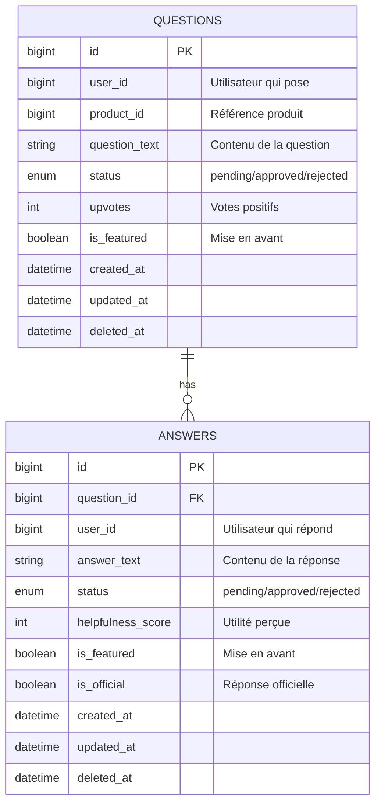
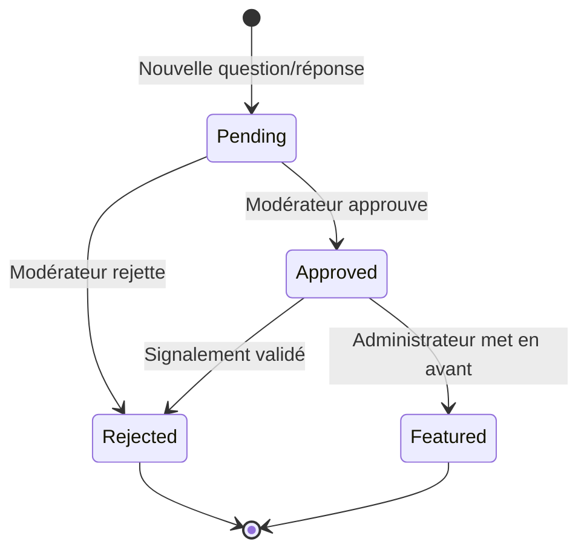

# Documentation de la Base de Données du Service Questions

## Table des Matières

- [Vue d'Ensemble](#vue-densemble)
- [Configuration de la Base de Données](#configuration-de-la-base-de-données)
- [Diagramme des Relations entre Entités](#diagramme-des-relations-entre-entités)
- [Schémas des Tables](#schémas-des-tables)
  - [Table questions](#table-questions)
  - [Table answers](#table-answers)
- [Règles Métier](#règles-métier)
- [Exemples de Requêtes](#exemples-de-requêtes)
- [Maintenance et Optimisation](#maintenance-et-optimisation)

---

## Vue d'Ensemble

Le **Service Questions** gère un système de Questions et Réponses (Q&R) axé sur les produits où les clients peuvent :
- Poser des questions sur des produits spécifiques
- Répondre aux questions posées par d'autres utilisateurs
- Voter pour la pertinence des réponses
- Signaler le contenu inapproprié
- Modérer le contenu généré par les utilisateurs

Ce service est conçu pour favoriser l'engagement communautaire et fournir des informations sur les produits provenant de vraies expériences clients.

---

## Configuration de la Base de Données

### Connexion Docker

```yaml
services:
  questions-mysql:
    image: mysql:8.0
    container_name: questions-mysql
    environment:
      MYSQL_DATABASE: questions_db
      MYSQL_ROOT_PASSWORD: root_password
      MYSQL_USER: questions_user
      MYSQL_PASSWORD: questions_pass
    ports:
      - "3316:3306"
    volumes:
      - questions_mysql_data:/var/lib/mysql
    networks:
      - ecommerce-network
    healthcheck:
      test: ["CMD", "mysqladmin", "ping", "-h", "localhost"]
      interval: 10s
      timeout: 5s
      retries: 5
```

### Configuration Laravel (.env)

```dotenv
DB_CONNECTION=mysql
DB_HOST=questions-mysql
DB_PORT=3306
DB_DATABASE=questions_db
DB_USERNAME=questions_user
DB_PASSWORD=questions_pass
```

---

## Diagramme des Relations entre Entités



---

## Schémas des Tables

### Table `questions`

Stocke toutes les questions posées par les utilisateurs sur les produits.

#### Définition du Schéma

```php
Schema::create('questions', function (Blueprint $table) {
    $table->id();
    $table->unsignedBigInteger('user_id')->comment('Référence à l\'utilisateur dans le service auth');
    $table->unsignedBigInteger('product_id')->comment('Référence au produit dans le service produits');
    $table->text('question_text')->comment('Contenu de la question');
    $table->enum('status', ['pending', 'approved', 'rejected'])->default('pending')->comment('Statut de modération');
    $table->integer('upvotes')->default(0)->comment('Nombre de votes positifs');
    $table->boolean('is_featured')->default(false)->comment('Mise en avant sur la page produit');
    $table->timestamps();
    $table->softDeletes();

    // Index
    $table->index('user_id');
    $table->index('product_id');
    $table->index(['status', 'created_at']);
    $table->index('is_featured');
});
```

#### Spécifications des Colonnes

| Colonne | Type | Nullable | Par Défaut | Description |
|---------|------|----------|------------|-------------|
| `id` | BIGINT UNSIGNED | Non | AUTO_INCREMENT | Clé primaire |
| `user_id` | BIGINT UNSIGNED | Non | - | Référence à l'utilisateur (service auth) |
| `product_id` | BIGINT UNSIGNED | Non | - | Référence au produit (service produits) |
| `question_text` | TEXT | Non | - | Contenu de la question |
| `status` | ENUM | Non | 'pending' | Statut de modération : pending, approved, rejected |
| `upvotes` | INTEGER | Non | 0 | Nombre de votes positifs reçus |
| `is_featured` | BOOLEAN | Non | false | Mise en avant sur la page produit |
| `created_at` | TIMESTAMP | Oui | NULL | Horodatage de création |
| `updated_at` | TIMESTAMP | Oui | NULL | Horodatage de dernière mise à jour |
| `deleted_at` | TIMESTAMP | Oui | NULL | Horodatage de suppression logique |

#### Index

- **PRIMARY** : `id`
- **INDEX** : `user_id` - Recherche par utilisateur
- **INDEX** : `product_id` - Recherche par produit
- **INDEX** : `(status, created_at)` - File de modération
- **INDEX** : `is_featured` - Questions mises en avant

#### Contraintes

- `status` doit être l'une des valeurs : 'pending', 'approved', 'rejected'
- `upvotes` doit être >= 0
- `question_text` ne peut pas être vide

#### Exemple de Données

```sql
INSERT INTO questions (user_id, product_id, question_text, status, upvotes, is_featured, created_at, updated_at) VALUES
(101, 5001, 'Cette veste est-elle imperméable pour la randonnée sous la pluie ?', 'approved', 15, true, '2025-01-15 09:30:00', '2025-01-15 14:22:00'),
(102, 5001, 'Quelle est la température minimale pour laquelle cette veste est conçue ?', 'approved', 8, false, '2025-01-16 11:45:00', '2025-01-16 11:45:00'),
(103, 5002, 'Ce sac à dos dispose-t-il d\'une poche pour ordinateur portable ?', 'pending', 0, false, '2025-01-17 08:15:00', '2025-01-17 08:15:00'),
(104, 5003, 'Les bâtons sont-ils vendus par paire ou individuellement ?', 'approved', 23, true, '2025-01-14 16:20:00', '2025-01-14 18:50:00'),
(105, 5004, 'Peut-on laver cette tente en machine ?', 'rejected', 0, false, '2025-01-18 10:05:00', '2025-01-18 10:30:00');
```

---

### Table `answers`

Stocke toutes les réponses aux questions, avec support des réponses officielles (équipe) et communautaires (clients).

#### Définition du Schéma

```php
Schema::create('answers', function (Blueprint $table) {
    $table->id();
    $table->foreignId('question_id')->constrained('questions')->onDelete('cascade')->comment('Référence à la question');
    $table->unsignedBigInteger('user_id')->comment('Référence à l\'utilisateur dans le service auth');
    $table->text('answer_text')->comment('Contenu de la réponse');
    $table->enum('status', ['pending', 'approved', 'rejected'])->default('pending')->comment('Statut de modération');
    $table->integer('helpfulness_score')->default(0)->comment('Score d\'utilité (upvotes - downvotes)');
    $table->boolean('is_featured')->default(false)->comment('Mise en avant comme meilleure réponse');
    $table->boolean('is_official')->default(false)->comment('Réponse de l\'équipe officielle');
    $table->timestamps();
    $table->softDeletes();

    // Index
    $table->index('question_id');
    $table->index('user_id');
    $table->index(['status', 'created_at']);
    $table->index('is_featured');
    $table->index('is_official');
});
```

#### Spécifications des Colonnes

| Colonne | Type | Nullable | Par Défaut | Description |
|---------|------|----------|------------|-------------|
| `id` | BIGINT UNSIGNED | Non | AUTO_INCREMENT | Clé primaire |
| `question_id` | BIGINT UNSIGNED | Non | - | Clé étrangère vers questions |
| `user_id` | BIGINT UNSIGNED | Non | - | Référence à l'utilisateur (service auth) |
| `answer_text` | TEXT | Non | - | Contenu de la réponse |
| `status` | ENUM | Non | 'pending' | Statut de modération : pending, approved, rejected |
| `helpfulness_score` | INTEGER | Non | 0 | Score d'utilité (upvotes - downvotes) |
| `is_featured` | BOOLEAN | Non | false | Mise en avant comme meilleure réponse |
| `is_official` | BOOLEAN | Non | false | Indique une réponse de l'équipe officielle |
| `created_at` | TIMESTAMP | Oui | NULL | Horodatage de création |
| `updated_at` | TIMESTAMP | Oui | NULL | Horodatage de dernière mise à jour |
| `deleted_at` | TIMESTAMP | Oui | NULL | Horodatage de suppression logique |

#### Clés Étrangères

- **question_id** : Référence `questions(id)` ON DELETE CASCADE
  - Lorsqu'une question est supprimée, toutes les réponses associées sont également supprimées

#### Index

- **PRIMARY** : `id`
- **FOREIGN KEY** : `question_id` → `questions(id)`
- **INDEX** : `user_id` - Recherche par utilisateur
- **INDEX** : `(status, created_at)` - File de modération
- **INDEX** : `is_featured` - Réponses mises en avant
- **INDEX** : `is_official` - Réponses officielles

#### Contraintes

- `status` doit être l'une des valeurs : 'pending', 'approved', 'rejected'
- `helpfulness_score` peut être négatif
- `answer_text` ne peut pas être vide
- Seule une réponse par question peut avoir `is_featured = true`

#### Exemple de Données

```sql
INSERT INTO answers (question_id, user_id, answer_text, status, helpfulness_score, is_featured, is_official, created_at, updated_at) VALUES
(1, 201, 'Oui, j\'ai utilisé cette veste lors de plusieurs randonnées sous la pluie et elle m\'a gardé au sec !', 'approved', 12, true, false, '2025-01-15 10:15:00', '2025-01-15 14:22:00'),
(1, 202, 'Attention, la capuche n\'est pas ajustable et peut laisser passer l\'eau par temps venteux.', 'approved', 5, false, false, '2025-01-15 11:30:00', '2025-01-15 11:30:00'),
(1, 999, 'Cette veste utilise une membrane Gore-Tex qui est imperméable jusqu\'à 28 000 mm d\'eau et respirante. Elle est conçue pour la randonnée sous la pluie.', 'approved', 18, false, true, '2025-01-15 14:00:00', '2025-01-15 14:00:00'),
(2, 203, 'Je l\'utilise par -5°C sans problème avec une couche de base thermique.', 'approved', 7, true, false, '2025-01-16 12:20:00', '2025-01-16 12:20:00'),
(4, 204, 'Ils sont vendus par paire, comme indiqué dans la description du produit.', 'approved', 15, true, false, '2025-01-14 17:00:00', '2025-01-14 18:50:00');
```

---

## Règles Métier

### Workflow de Modération



#### Statuts de Modération

1. **pending** - Contenu nouvellement créé en attente de révision
2. **approved** - Contenu approuvé et visible publiquement
3. **rejected** - Contenu rejeté et caché (violation des directives)

### Système de Votes

#### Questions - Upvotes
- Les utilisateurs peuvent voter positivement pour une question
- Le compteur `upvotes` augmente avec chaque vote
- Les questions populaires (upvotes élevés) sont mises en avant dans l'interface
- Aucune downvote n'est autorisé pour les questions

#### Réponses - Score d'Utilité
- Les utilisateurs peuvent voter "utile" (upvote) ou "inutile" (downvote)
- `helpfulness_score = total_upvotes - total_downvotes`
- Les réponses avec un score positif élevé sont mises en avant
- Les réponses avec des scores négatifs peuvent être cachées automatiquement

### Questions Mises en Avant

**Critères de sélection** :
- Statut approuvé
- Score de votes positifs élevé (>= 10)
- Contenu informatif et bien formulé
- Pertinence pour le produit

**Limite** : Maximum 5 questions mises en avant par produit

### Réponses Mises en Avant (Meilleures Réponses)

**Critères de sélection** :
- Statut approuvé
- Score d'utilité élevé (>= 8)
- Contenu informatif et complet
- Vérification factuelle

**Limite** : Une seule réponse mise en avant par question

### Réponses Officielles

- Marquées avec `is_official = true`
- Créées uniquement par les membres de l'équipe (vérification par rôle)
- Priorisées dans l'affichage au-dessus des réponses communautaires
- Pas de modération requise (publication automatique)
- Peuvent coexister avec les réponses mises en avant (communautaires)

### Règles de Suppression

#### Questions
- **Suppression logique** (`deleted_at`) : Préservation pour l'audit
- Déclenche la suppression en cascade de toutes les réponses associées
- Les références restent intactes pour les données historiques

#### Réponses
- **Suppression logique** (`deleted_at`) : Préservation pour l'audit
- N'affecte pas la question parente
- Recalcul des statistiques de réponses sur la question

---

## Exemples de Requêtes

### Créer une Nouvelle Question

```php
use App\Models\Question;

$question = Question::create([
    'user_id' => auth()->id(),
    'product_id' => $productId,
    'question_text' => 'Ce produit est-il compatible avec les accessoires de la génération précédente ?',
    'status' => 'pending',
]);

// Notification envoyée à l'équipe de modération via RabbitMQ
```

### Récupérer les Questions Approuvées pour un Produit

```php
use App\Models\Question;

$questions = Question::where('product_id', $productId)
    ->where('status', 'approved')
    ->withCount('answers')
    ->orderByDesc('is_featured')
    ->orderByDesc('upvotes')
    ->orderByDesc('created_at')
    ->get();
```

**Requête SQL** :

```sql
SELECT q.*, COUNT(a.id) as answers_count
FROM questions q
LEFT JOIN answers a ON q.id = a.question_id AND a.status = 'approved' AND a.deleted_at IS NULL
WHERE q.product_id = 5001
  AND q.status = 'approved'
  AND q.deleted_at IS NULL
GROUP BY q.id
ORDER BY q.is_featured DESC, q.upvotes DESC, q.created_at DESC;
```

### Ajouter une Réponse

```php
use App\Models\Answer;

$answer = Answer::create([
    'question_id' => $questionId,
    'user_id' => auth()->id(),
    'answer_text' => 'Oui, j\'ai testé les deux et ils fonctionnent parfaitement ensemble.',
    'status' => 'pending',
    'is_official' => false,
]);

// Notification envoyée à l'auteur de la question via RabbitMQ
```

### Ajouter une Réponse Officielle

```php
use App\Models\Answer;

// Vérifier que l'utilisateur a le rôle 'support_team' ou 'admin'
if (auth()->user()->hasRole(['support_team', 'admin'])) {
    $officialAnswer = Answer::create([
        'question_id' => $questionId,
        'user_id' => auth()->id(),
        'answer_text' => 'Selon nos spécifications techniques, ce produit est rétrocompatible avec tous les accessoires de la série X depuis 2022.',
        'status' => 'approved', // Publication automatique
        'is_official' => true,
    ]);
}
```

### Voter pour l'Utilité d'une Réponse (Upvote)

```php
use App\Models\Answer;

$answer = Answer::findOrFail($answerId);
$answer->increment('helpfulness_score');

// Stocker le vote dans un cache ou une table séparée pour éviter les votes multiples
Cache::put("answer_vote_{$answerId}_user_" . auth()->id(), 'upvote', now()->addYear());
```

### Signaler l'Utilité d'une Réponse (Downvote)

```php
use App\Models\Answer;

$answer = Answer::findOrFail($answerId);
$answer->decrement('helpfulness_score');

Cache::put("answer_vote_{$answerId}_user_" . auth()->id(), 'downvote', now()->addYear());

// Si le score descend en dessous d'un seuil (-5), signaler pour révision
if ($answer->helpfulness_score <= -5) {
    // Envoyer un événement de modération via RabbitMQ
}
```

### Approuver du Contenu (Administrateur)

```php
use App\Models\Question;

$question = Question::findOrFail($questionId);
$question->update(['status' => 'approved']);

// Notification envoyée à l'auteur de la question
```

### Mettre en Avant une Question Populaire

```php
use App\Models\Question;

// Limiter à 5 questions mises en avant par produit
$currentFeaturedCount = Question::where('product_id', $productId)
    ->where('is_featured', true)
    ->count();

if ($currentFeaturedCount < 5) {
    $question = Question::findOrFail($questionId);
    $question->update(['is_featured' => true]);
}
```

### Mettre en Avant une Meilleure Réponse

```php
use App\Models\Answer;

$questionId = $answer->question_id;

// Retirer toute mise en avant existante pour cette question
Answer::where('question_id', $questionId)
    ->where('is_featured', true)
    ->update(['is_featured' => false]);

// Mettre en avant la nouvelle meilleure réponse
$answer->update(['is_featured' => true]);
```

### Récupérer les Questions en Attente de Modération

```php
use App\Models\Question;

$pendingQuestions = Question::where('status', 'pending')
    ->with('user') // Eager load des informations utilisateur depuis le service auth
    ->orderBy('created_at', 'asc')
    ->paginate(20);
```

**Requête SQL** :

```sql
SELECT * FROM questions
WHERE status = 'pending'
  AND deleted_at IS NULL
ORDER BY created_at ASC
LIMIT 20 OFFSET 0;
```

### Récupérer les Statistiques Q&R pour un Produit

```php
$productId = 5001;

$stats = [
    'total_questions' => Question::where('product_id', $productId)
        ->where('status', 'approved')
        ->count(),

    'total_answers' => Answer::whereHas('question', function ($query) use ($productId) {
            $query->where('product_id', $productId);
        })
        ->where('status', 'approved')
        ->count(),

    'avg_answers_per_question' => Answer::whereHas('question', function ($query) use ($productId) {
            $query->where('product_id', $productId);
        })
        ->where('status', 'approved')
        ->count() / max(1, Question::where('product_id', $productId)->where('status', 'approved')->count()),
];
```

### Rechercher des Questions par Mot-Clé

```php
use App\Models\Question;

$keyword = 'imperméable';

$questions = Question::where('status', 'approved')
    ->where('question_text', 'LIKE', "%{$keyword}%")
    ->orWhereHas('answers', function ($query) use ($keyword) {
        $query->where('status', 'approved')
            ->where('answer_text', 'LIKE', "%{$keyword}%");
    })
    ->distinct()
    ->get();
```

**Note** : Pour une recherche en texte intégral de meilleure qualité, envisagez d'utiliser MySQL Full-Text Search ou Elasticsearch.

---

## Maintenance et Optimisation

### Stratégie de Sauvegarde

```bash
#!/bin/bash
# Sauvegarde de la base de données du service questions

BACKUP_DIR="/backups/questions-service"
TIMESTAMP=$(date +%Y%m%d_%H%M%S)

docker exec questions-mysql mysqldump \
  -u questions_user \
  -pquestions_pass \
  questions_db \
  --single-transaction \
  --routines \
  --triggers \
  > "${BACKUP_DIR}/questions_db_${TIMESTAMP}.sql"

# Compresser la sauvegarde
gzip "${BACKUP_DIR}/questions_db_${TIMESTAMP}.sql"

# Conserver uniquement les 7 derniers jours de sauvegardes
find ${BACKUP_DIR} -name "questions_db_*.sql.gz" -mtime +7 -delete
```

### Recommandations d'Index

Les index suivants sont **déjà créés** dans les migrations du schéma :

#### Table `questions`
- `INDEX(user_id)` - Recherche par utilisateur
- `INDEX(product_id)` - Recherche par produit
- `INDEX(status, created_at)` - File de modération
- `INDEX(is_featured)` - Questions mises en avant

#### Table `answers`
- `INDEX(question_id)` - Recherche de réponses par question
- `INDEX(user_id)` - Recherche par utilisateur
- `INDEX(status, created_at)` - File de modération
- `INDEX(is_featured)` - Réponses mises en avant
- `INDEX(is_official)` - Réponses officielles

### Index Supplémentaires (Optionnels)

Pour des cas d'usage à haut trafic, envisagez ces index composites supplémentaires :

```sql
-- Recherche combinée de questions approuvées et mises en avant pour un produit
CREATE INDEX idx_questions_product_status_featured
ON questions(product_id, status, is_featured, upvotes);

-- Recherche combinée de réponses approuvées pour une question avec classement par utilité
CREATE INDEX idx_answers_question_status_score
ON answers(question_id, status, helpfulness_score);

-- Recherche de contenu en attente de modération avec tri par date
CREATE INDEX idx_questions_pending_moderation
ON questions(status, created_at)
WHERE status = 'pending' AND deleted_at IS NULL;

CREATE INDEX idx_answers_pending_moderation
ON answers(status, created_at)
WHERE status = 'pending' AND deleted_at IS NULL;
```

### Index de Recherche en Texte Intégral (Optionnel)

Pour une recherche de contenu améliorée :

```sql
-- Index de recherche en texte intégral pour le contenu des questions
ALTER TABLE questions
ADD FULLTEXT INDEX idx_fulltext_question_text (question_text);

-- Index de recherche en texte intégral pour le contenu des réponses
ALTER TABLE answers
ADD FULLTEXT INDEX idx_fulltext_answer_text (answer_text);
```

**Requête d'utilisation** :

```sql
SELECT * FROM questions
WHERE MATCH(question_text) AGAINST('imperméable randonnée' IN NATURAL LANGUAGE MODE)
  AND status = 'approved'
  AND deleted_at IS NULL;
```

### Tâches de Maintenance Régulière

#### 1. Nettoyage du Contenu Rejeté

```sql
-- Supprimer définitivement le contenu rejeté depuis plus de 90 jours
DELETE FROM questions
WHERE status = 'rejected'
  AND updated_at < DATE_SUB(NOW(), INTERVAL 90 DAY);

DELETE FROM answers
WHERE status = 'rejected'
  AND updated_at < DATE_SUB(NOW(), INTERVAL 90 DAY);
```

#### 2. Recalcul des Statistiques

```bash
# Script artisan pour recalculer les scores d'utilité
php artisan questions:recalculate-scores
```

**Implémentation** :

```php
namespace App\Console\Commands;

use Illuminate\Console\Command;
use App\Models\Answer;
use Illuminate\Support\Facades\Cache;

class RecalculateHelpfulnessScores extends Command
{
    protected $signature = 'questions:recalculate-scores';
    protected $description = 'Recalcule les scores d\'utilité de toutes les réponses';

    public function handle()
    {
        $answers = Answer::all();

        foreach ($answers as $answer) {
            $upvotes = Cache::get("answer_upvotes_{$answer->id}", 0);
            $downvotes = Cache::get("answer_downvotes_{$answer->id}", 0);

            $answer->update([
                'helpfulness_score' => $upvotes - $downvotes
            ]);
        }

        $this->info('Recalcul des scores d\'utilité terminé.');
    }
}
```

#### 3. Surveillance des Performances

```sql
-- Identifier les produits avec le plus d'activité Q&R
SELECT
    product_id,
    COUNT(DISTINCT q.id) as total_questions,
    COUNT(DISTINCT a.id) as total_answers,
    AVG(q.upvotes) as avg_question_upvotes,
    AVG(a.helpfulness_score) as avg_answer_score
FROM questions q
LEFT JOIN answers a ON q.id = a.question_id
WHERE q.status = 'approved' AND q.deleted_at IS NULL
GROUP BY product_id
ORDER BY total_questions DESC
LIMIT 20;
```

```sql
-- Identifier les utilisateurs les plus actifs
SELECT
    user_id,
    COUNT(*) as total_contributions,
    SUM(CASE WHEN type = 'question' THEN 1 ELSE 0 END) as questions_asked,
    SUM(CASE WHEN type = 'answer' THEN 1 ELSE 0 END) as answers_given
FROM (
    SELECT user_id, 'question' as type FROM questions WHERE status = 'approved'
    UNION ALL
    SELECT user_id, 'answer' as type FROM answers WHERE status = 'approved'
) contributions
GROUP BY user_id
ORDER BY total_contributions DESC
LIMIT 20;
```

#### 4. Détection de Contenu Suspect

```sql
-- Détecter les questions avec un nombre anormalement élevé de signalements
SELECT q.*, COUNT(r.id) as report_count
FROM questions q
LEFT JOIN content_reports r ON r.content_type = 'question' AND r.content_id = q.id
WHERE q.status = 'approved'
GROUP BY q.id
HAVING report_count >= 5
ORDER BY report_count DESC;
```

**Note** : Nécessite une table `content_reports` (non implémentée dans ce schéma de base).

---

### Optimisation des Requêtes

#### Exemple 1 : Éviter N+1

**Mauvais** :

```php
$questions = Question::where('product_id', $productId)->get();

foreach ($questions as $question) {
    echo $question->answers->count(); // Requête N+1
}
```

**Bon** :

```php
$questions = Question::where('product_id', $productId)
    ->withCount('answers')
    ->get();

foreach ($questions as $question) {
    echo $question->answers_count; // Aucune requête supplémentaire
}
```

#### Exemple 2 : Pagination pour les Grandes Listes

```php
// Paginer les questions au lieu de récupérer toutes les lignes
$questions = Question::where('product_id', $productId)
    ->where('status', 'approved')
    ->orderByDesc('upvotes')
    ->paginate(20);
```

#### Exemple 3 : Utiliser la Mise en Cache

```php
use Illuminate\Support\Facades\Cache;

$cacheKey = "product_{$productId}_questions";

$questions = Cache::remember($cacheKey, 600, function () use ($productId) {
    return Question::where('product_id', $productId)
        ->where('status', 'approved')
        ->with('answers')
        ->get();
});

// Invalider le cache lorsqu'une nouvelle question est ajoutée
Cache::forget($cacheKey);
```

---

### Surveillance et Alertes

#### Métriques à Surveiller

1. **Volume de Modération**
   - Questions en attente > 100 → Alerte équipe modération
   - Réponses en attente > 200 → Alerte équipe modération

2. **Scores Faibles**
   - Réponses avec `helpfulness_score < -10` → Vérification automatique
   - Questions avec `upvotes = 0` après 7 jours → Vérification de qualité

3. **Performances de la Base de Données**
   - Temps de requête moyen > 500ms → Optimisation requise
   - Utilisation CPU > 80% pendant > 5min → Investigation

#### Script de Surveillance

```bash
#!/bin/bash
# Surveillance du service questions

PENDING_QUESTIONS=$(docker exec questions-mysql mysql -u questions_user -pquestions_pass questions_db -se "SELECT COUNT(*) FROM questions WHERE status='pending' AND deleted_at IS NULL;")

if [ "$PENDING_QUESTIONS" -gt 100 ]; then
    echo "⚠️ Alerte : $PENDING_QUESTIONS questions en attente de modération"
    # Envoyer une notification (Slack, email, etc.)
fi

PENDING_ANSWERS=$(docker exec questions-mysql mysql -u questions_user -pquestions_pass questions_db -se "SELECT COUNT(*) FROM answers WHERE status='pending' AND deleted_at IS NULL;")

if [ "$PENDING_ANSWERS" -gt 200 ]; then
    echo "⚠️ Alerte : $PENDING_ANSWERS réponses en attente de modération"
fi
```

---

## Conclusion

Le **Service Questions** fournit un système de Questions et Réponses robuste et modulaire pour l'engagement communautaire autour des produits. Grâce à la modération de contenu, aux mécanismes de vote et au support des réponses officielles, ce service favorise un contenu informatif de haute qualité qui aide les clients à prendre des décisions d'achat éclairées.

**Points Clés** :
- ✅ Workflow de modération à trois états (pending/approved/rejected)
- ✅ Support des votes (upvotes pour questions, helpfulness_score pour réponses)
- ✅ Questions et réponses mises en avant
- ✅ Réponses officielles vs communautaires
- ✅ Suppression logique pour la préservation de l'historique
- ✅ Optimisations d'index pour les performances
- ✅ Support de la recherche en texte intégral

**Améliorations Futures** :
- Système de badges et de réputation pour les contributeurs actifs
- Détection automatisée de spam avec apprentissage automatique
- Support multilingue pour les questions et réponses
- Notifications en temps réel via WebSocket
- Tableau de bord d'analyse pour les insights sur les produits
