# Documentation de la Base de Données du Service SAV

## Table des Matières
- [Vue d'Ensemble](#vue-densemble)
- [Configuration de la Base de Données](#configuration-de-la-base-de-données)
- [Diagramme des Relations entre Entités](#diagramme-des-relations-entre-entités)
- [Spécifications des Tables](#spécifications-des-tables)
- [Machine à États Statut Ticket](#machine-à-états-statut-ticket)
- [Système de Priorité et SLA](#système-de-priorité-et-sla)
- [Intégration MinIO](#intégration-minio)
- [Événements RabbitMQ Publiés](#événements-rabbitmq-publiés)
- [Relations Inter-Services](#relations-inter-services)
- [Index et Performance](#index-et-performance)
- [Considérations de Sécurité](#considérations-de-sécurité)
- [Sauvegarde et Maintenance](#sauvegarde-et-maintenance)

## Vue d'Ensemble

Le service sav-service (Service Après-Vente / Service Client) gère les tickets de support client, les messages et les pièces jointes pour la plateforme e-commerce. Il fournit une gestion complète du cycle de vie des tickets depuis la création jusqu'à la résolution et la clôture.

**Détails du Service :**
- Nom de la Base de Données : `sav_service_db`
- Port Externe : 3322 (pour le débogage et les clients de base de données)
- Port Conteneur : 3306
- Port Service : 8008
- Framework : Laravel 12 avec PHP 8.3+
- Stockage : Stockage compatible S3 MinIO (bucket : 'sav')

**Responsabilités Principales :**
- Gestion des tickets de support client
- Fil de conversation multi-parties (client et agent)
- Gestion des pièces jointes via stockage objet MinIO
- Suivi SLA basé sur priorité
- Attribution de tickets et distribution de charge agents
- Notes internes et réponses publiques
- Suivi de tickets liés aux commandes
- Mises à jour de statut en temps réel via événements RabbitMQ

## Configuration de la Base de Données

**Détails de Connexion (depuis .env) :**
```env
DB_CONNECTION=mysql
DB_HOST=sav-db
DB_PORT=3306
DB_DATABASE=sav_service_db
DB_USERNAME=root
DB_PASSWORD=root

# Accès externe pour débogage
EXTERNAL_PORT=3322
```

**Configuration du Service Docker :**
```yaml
sav-mysql:
  image: mysql:8.0
  ports:
    - "3322:3306"
  environment:
    MYSQL_DATABASE: sav_service_db
    MYSQL_ROOT_PASSWORD: root_password
```

**Jeu de Caractères et Collation :**
```sql
CHARACTER SET: utf8mb4
COLLATION: utf8mb4_unicode_ci
```

## Diagramme des Relations entre Entités


## Spécifications des Tables

### support_tickets

Table principale gérant les tickets de support client avec suivi complet du cycle de vie.

**Colonnes :**

| Colonne | Type | Contraintes | Description |
|---------|------|-------------|-------------|
| id | BIGINT UNSIGNED | PRIMARY KEY, AUTO_INCREMENT | Identifiant unique ticket |
| ticket_number | VARCHAR(255) | UNIQUE, NOT NULL | Référence ticket lisible humain (TKT-xxxxx) |
| user_id | BIGINT UNSIGNED | NOT NULL, INDEXED | ID client depuis auth-service |
| subject | VARCHAR(255) | NOT NULL | Ligne objet ticket |
| description | TEXT | NOT NULL | Description détaillée problème |
| priority | ENUM | NOT NULL, DEFAULT 'medium', INDEXED | low, medium, high, urgent |
| status | ENUM | NOT NULL, DEFAULT 'open', INDEXED | open, in_progress, waiting_customer, resolved, closed |
| category | VARCHAR(255) | NULLABLE | Catégorisation ticket (ex: 'billing', 'shipping', 'product') |
| assigned_to | BIGINT UNSIGNED | NULLABLE, INDEXED | ID utilisateur agent responsable ticket |
| order_id | BIGINT UNSIGNED | NULLABLE, INDEXED | Commande liée depuis orders-service |
| metadata | JSON | NULLABLE | Données structurées supplémentaires (tags, champs personnalisés) |
| resolved_at | TIMESTAMP | NULLABLE | Quand ticket marqué résolu |
| closed_at | TIMESTAMP | NULLABLE | Quand ticket définitivement fermé |
| created_at | TIMESTAMP | NOT NULL | Horodatage création ticket |
| updated_at | TIMESTAMP | NOT NULL | Horodatage dernière modification |

**Index :**
- PRIMARY KEY (id)
- UNIQUE (ticket_number)
- INDEX (user_id) - Recherche rapide tickets client
- INDEX (status) - Filtrer tickets par statut
- INDEX (priority) - Requêtes basées priorité
- INDEX (assigned_to) - Requêtes charge travail agent
- INDEX (order_id) - Recherche tickets liés commande

**Règles Métier :**
- Numéro ticket auto-généré à création : `TKT-{UNIQUE_ID}`
- Priorité détermine attentes temps réponse SLA
- Transitions statut suivent machine à états (voir diagramme ci-dessous)
- resolved_at automatiquement défini quand statut passe à 'resolved'
- closed_at automatiquement défini quand statut passe à 'closed'
- assigned_to déclenche changement statut à 'in_progress' si actuellement 'open'

### ticket_messages

Fil conversation pour tickets supportant messages clients publics et notes internes agents.

**Colonnes :**

| Colonne | Type | Contraintes | Description |
|---------|------|-------------|-------------|
| id | BIGINT UNSIGNED | PRIMARY KEY, AUTO_INCREMENT | Identifiant unique message |
| ticket_id | BIGINT UNSIGNED | FOREIGN KEY, NOT NULL, INDEXED | Référence ticket parent |
| sender_id | BIGINT UNSIGNED | NOT NULL, INDEXED | ID utilisateur depuis auth-service |
| sender_type | ENUM | NOT NULL | customer, agent |
| message | TEXT | NOT NULL | Contenu message |
| is_internal | BOOLEAN | NOT NULL, DEFAULT false | Notes internes agent (non visibles client) |
| read_at | TIMESTAMP | NULLABLE | Quand message lu par destinataire |
| created_at | TIMESTAMP | NOT NULL | Horodatage création message |
| updated_at | TIMESTAMP | NOT NULL | Horodatage dernière modification |

**Clés Étrangères :**
- ticket_id REFERENCES support_tickets(id) ON DELETE CASCADE

**Index :**
- PRIMARY KEY (id)
- INDEX (ticket_id) - Recherche rapide messages par ticket
- INDEX (sender_id) - Requêtes basées expéditeur

**Règles Métier :**
- Messages is_internal=true visibles uniquement agents
- Nouveau message client déclenche changement statut de 'waiting_customer' à 'in_progress'
- read_at suit accusé lecture message pour calculs compteur non lus
- Suppression cascade quand ticket parent supprimé

### ticket_attachments

Pièces jointes associées aux tickets ou messages spécifiques, stockées dans stockage objet MinIO.

**Colonnes :**

| Colonne | Type | Contraintes | Description |
|---------|------|-------------|-------------|
| id | BIGINT UNSIGNED | PRIMARY KEY, AUTO_INCREMENT | Identifiant unique pièce jointe |
| ticket_id | BIGINT UNSIGNED | FOREIGN KEY, NOT NULL, INDEXED | Référence ticket parent |
| message_id | BIGINT UNSIGNED | FOREIGN KEY, NULLABLE, INDEXED | Association message optionnelle |
| original_name | VARCHAR(255) | NOT NULL | Nom fichier téléversé original |
| filename | VARCHAR(255) | NOT NULL | Nom fichier stocké nettoyé |
| file_path | VARCHAR(255) | NOT NULL | Clé/chemin stockage objet MinIO |
| mime_type | VARCHAR(255) | NOT NULL | Type MIME fichier |
| file_size | INT UNSIGNED | NOT NULL | Taille fichier en octets |
| created_at | TIMESTAMP | NOT NULL | Horodatage téléversement |
| updated_at | TIMESTAMP | NOT NULL | Horodatage dernière modification |

**Clés Étrangères :**
- ticket_id REFERENCES support_tickets(id) ON DELETE CASCADE
- message_id REFERENCES ticket_messages(id) ON DELETE CASCADE

**Index :**
- PRIMARY KEY (id)
- INDEX (ticket_id) - Recherche rapide pièces jointes par ticket
- INDEX (message_id) - Pièces jointes spécifiques message

**Règles Métier :**
- Fichiers physiquement stockés dans bucket MinIO 'sav'
- file_path contient clé objet MinIO pour récupération
- Types MIME supportés validés au téléversement (voir section Intégration MinIO)
- Hook démarrage modèle supprime objet MinIO quand enregistrement supprimé
- Taille fichier maximum appliquée (configurable, défaut 10MB)
- message_id nullable permet pièces jointes niveau ticket non liées à message spécifique

### Tables Standard Laravel

**users :** Table référence utilisateur minimale (synchronisée depuis auth-service)
- id, email, firstname, lastname

**jobs :** Table jobs file Laravel pour traitement asynchrone
- id, queue, payload, attempts, reserved_at, available_at, created_at

**cache :** Stockage cache Laravel
- key, value, expiration

**cache_locks :** Verrous cache Laravel pour opérations atomiques
- key, owner, expiration

## Machine à États Statut Ticket

Le cycle de vie ticket suit machine à états stricte avec transitions définies :

```mermaid
stateDiagram-v2
    [*] --> open: Ticket Créé

    open --> in_progress: Attribué à Agent
    open --> closed: Invalide/Dupliqué

    in_progress --> waiting_customer: Agent Demande Info
    in_progress --> resolved: Agent Résout Problème
    in_progress --> open: Non Attribué

    waiting_customer --> in_progress: Client Répond
    waiting_customer --> closed: Pas Réponse (Auto-fermeture)

    resolved --> closed: Confirmé par Client
    resolved --> in_progress: Client Réouvre

    closed --> [*]: État Final

    note right of open
        Priorité: low, medium, high, urgent
        Minuteur SLA Démarre
    end note

    note right of in_progress
        État Travail Actif
        Attribution Agent Requise
    end note

    note right of waiting_customer
        En Pause - Attente Client
        Auto-fermeture après 7 jours
    end note

    note right of resolved
        Solution Fournie
        Fenêtre Confirmation Client 24h
    end note

    note right of closed
        État Final Permanent
        Pas Autres Transitions
    end note
```



**Définitions États :**

1. **open** : État initial quand ticket créé
   - Attente attribution agent
   - Minuteur SLA commence
   - Visible dans file non attribués

2. **in_progress** : Travail actif par agent attribué
   - Agent activement enquête/résout
   - Peut transiter vers waiting_customer ou resolved
   - Attribution agent requise pour cet état

3. **waiting_customer** : Attente réponse client
   - Agent demandé informations supplémentaires
   - Minuteur SLA en pause
   - Auto-fermeture après 7 jours inactivité

4. **resolved** : Solution fournie, attente confirmation
   - Agent marqué ticket comme résolu
   - Fenêtre confirmation client 24 heures
   - Auto-fermeture si pas réponse ou réouverture

5. **closed** : État final permanent
   - Pas autres transitions état autorisées
   - Enregistrement historique maintenu
   - Peut être référencé mais non modifié

**Déclencheurs Transition :**

| Depuis État | Vers État | Déclencheur | Automatisé |
|------------|----------|---------|-----------|
| open | in_progress | Attribution agent | Oui |
| open | closed | Marqué invalide/dupliqué | Non |
| in_progress | waiting_customer | Agent demande info | Non |
| in_progress | resolved | Agent fournit solution | Non |
| waiting_customer | in_progress | Client répond | Oui |
| waiting_customer | closed | 7 jours pas réponse | Oui |
| resolved | closed | Client confirme ou timeout 24h | Oui/Non |
| resolved | in_progress | Client réouvre | Non |

## Système de Priorité et SLA

Les tickets support utilisent système priorité 4 niveaux avec cibles SLA (Accord Niveau Service) correspondantes.

**Niveaux Priorité :**

| Priorité | Libellé | SLA Réponse | SLA Résolution | Description |
|----------|-------|--------------|----------------|-------------|
| low | Basse | 48 heures | 7 jours | Demandes générales, problèmes mineurs |
| medium | Moyenne | 24 heures | 3 jours | Demandes support standard (défaut) |
| high | Haute | 4 heures | 1 jour | Impact significatif sur client |
| urgent | Urgente | 1 heure | 4 heures | Problèmes critiques, échecs paiement, blocages commande |

**Règles Minuteur SLA :**

1. **Heure Début** : Horodatage création ticket (created_at)
2. **Conditions Pause** : Statut = 'waiting_customer' (en pause jusqu'à réponse client)
3. **Heures Ouverture** : 24/7 continu (pas ajustements heures ouverture)
4. **Conditions Arrêt** : Statut atteint 'resolved' ou 'closed'

**Gestion Dépassement SLA :**
- Notifications escalade automatisées via événements RabbitMQ
- Auto-upgrade priorité si SLA réponse dépassé (ex: medium -> high)
- Visibilité tableau de bord pour managers surveiller conformité SLA
- Données historiques dépassement SLA suivies dans champ metadata JSON

**Logique Attribution Priorité :**

Priorité par défaut est 'medium'. Auto-upgrade vers priorité supérieure basé sur :
- Valeur commande > 500 EUR : high
- Tickets échec paiement : urgent
- Indicateur client VIP : +1 niveau priorité
- Problème répété (>3 tickets même catégorie) : high
- Remplacement manuel agent toujours permis

## Intégration MinIO

Le service SAV utilise stockage objet compatible S3 MinIO pour gestion pièces jointes tickets.

**Configuration Bucket :**
- Nom Bucket : `sav`
- Région : us-east-1
- Accès : Privé (URLs présignées pour accès temporaire)
- Versionnage : Activé
- Cycle de Vie : Pas auto-suppression (gestion manuelle)

**Connexion MinIO :**
```env
AWS_ACCESS_KEY_ID=admin
AWS_SECRET_ACCESS_KEY=adminpass123
AWS_DEFAULT_REGION=us-east-1
AWS_BUCKET=sav
AWS_ENDPOINT=http://minio:9000
AWS_USE_PATH_STYLE_ENDPOINT=true
```

**Flux de Travail Téléversement Fichier :**

1. **Requête Client** : Requête téléversement avec fichier vers API service SAV
2. **Validation** : Vérifier type fichier, taille et scanner malware
3. **Nettoyage** : Générer nom fichier sûr, préserver original_name
4. **Stockage** : Téléverser vers bucket MinIO avec chemin structuré
5. **Enregistrement BDD** : Créer enregistrement ticket_attachments avec chemin MinIO
6. **Réponse** : Retourner ID pièce jointe et URL présignée pour accès

**Structure Chemin Fichier :**
```
sav/
├── tickets/
│   ├── {ticket_id}/
│   │   ├── {filename_hash}.{extension}
│   │   └── ...
│   └── ...
└── temp/
    └── {upload_session_id}/
```

**Types Fichiers Autorisés :**

| Catégorie | Types MIME | Taille Max |
|----------|------------|----------|
| Images | image/jpeg, image/png, image/gif, image/webp | 5 MB |
| Documents | application/pdf | 10 MB |
| Office | application/msword, .docx, .xlsx, text/csv | 10 MB |
| Texte | text/plain | 2 MB |
| Archives | application/zip (restreint) | 20 MB |

**Types Fichiers Bloqués :**
- Exécutables : .exe, .bat, .sh, .cmd
- Scripts : .js, .php, .py (sauf dans archives)
- Formats dangereux : .iso, .dmg, .app

**Mesures Sécurité :**
1. **Validation Type Fichier** : Vérifier type MIME correspond extension fichier
2. **Scan Virus** : Intégration ClamAV optionnelle pour fichiers téléversés
3. **URLs Présignées** : URLs accès temporaires (expiration 15 minutes)
4. **Contrôle Accès** : URLs validées contre autorisation user_id
5. **Disposition Contenu** : Forcer téléchargement pour types fichiers inconnus

**Génération URL Présignée :**
```php
// Générer URL accès temporaire 15 minutes
$url = Storage::disk('s3')->temporaryUrl(
    $attachment->file_path,
    now()->addMinutes(15)
);
```

**Suppression Pièce Jointe :**
- Suppression BDD déclenche suppression objet MinIO via hook démarrage modèle
- Job nettoyage orphelins exécuté hebdomadairement pour supprimer objets MinIO inutilisés
- Support suppression douce : Marquer comme supprimé mais préserver fichier 30 jours

## Événements RabbitMQ Publiés

Le service SAV publie événements vers RabbitMQ pour coordination inter-services et notification.

**Configuration Exchange :**
- Exchange : `sav_exchange`
- Type : topic
- Durable : true

**Événements Publiés :**

### TicketCreated
Publié quand nouveau ticket support créé.

**Clé Routage :** `sav.ticket.created`

**Charge Utile :**
```json
{
  "event": "TicketCreated",
  "timestamp": "2025-10-03T10:30:00Z",
  "data": {
    "ticket_id": 123,
    "ticket_number": "TKT-ABC123",
    "user_id": 456,
    "subject": "Commande non reçue",
    "priority": "high",
    "status": "open",
    "order_id": 789,
    "category": "shipping"
  }
}
```

**Consommateurs :**
- **notifications-service** : Envoyer email confirmation au client
- **analytics-service** : Suivre métriques volume support

### TicketAssigned
Publié quand ticket attribué à un agent.

**Clé Routage :** `sav.ticket.assigned`

**Charge Utile :**
```json
{
  "event": "TicketAssigned",
  "timestamp": "2025-10-03T10:35:00Z",
  "data": {
    "ticket_id": 123,
    "ticket_number": "TKT-ABC123",
    "assigned_to": 10,
    "assigned_by": 5,
    "previous_status": "open",
    "new_status": "in_progress"
  }
}
```

**Consommateurs :**
- **notifications-service** : Notifier agent attribué
- **analytics-service** : Suivre charge travail agent

### TicketStatusChanged
Publié lors toute transition statut ticket.

**Clé Routage :** `sav.ticket.status_changed`

**Charge Utile :**
```json
{
  "event": "TicketStatusChanged",
  "timestamp": "2025-10-03T11:00:00Z",
  "data": {
    "ticket_id": 123,
    "ticket_number": "TKT-ABC123",
    "user_id": 456,
    "previous_status": "in_progress",
    "new_status": "waiting_customer",
    "changed_by": 10,
    "reason": "Demandé informations expédition supplémentaires"
  }
}
```

**Consommateurs :**
- **notifications-service** : Notifier client changement statut
- **analytics-service** : Suivre métriques cycle de vie ticket

### TicketResolved
Publié quand ticket marqué comme résolu.

**Clé Routage :** `sav.ticket.resolved`

**Charge Utile :**
```json
{
  "event": "TicketResolved",
  "timestamp": "2025-10-03T12:00:00Z",
  "data": {
    "ticket_id": 123,
    "ticket_number": "TKT-ABC123",
    "user_id": 456,
    "resolved_by": 10,
    "resolution_time_minutes": 90,
    "sla_met": true,
    "category": "shipping"
  }
}
```

**Consommateurs :**
- **notifications-service** : Envoyer confirmation résolution au client
- **analytics-service** : Calculer conformité SLA et performance agent

### MessageAdded
Publié quand nouveau message ajouté à un ticket.

**Clé Routage :** `sav.ticket.message_added`

**Charge Utile :**
```json
{
  "event": "MessageAdded",
  "timestamp": "2025-10-03T10:45:00Z",
  "data": {
    "ticket_id": 123,
    "ticket_number": "TKT-ABC123",
    "message_id": 567,
    "sender_id": 10,
    "sender_type": "agent",
    "is_internal": false,
    "has_attachments": true,
    "attachment_count": 2
  }
}
```

**Consommateurs :**
- **notifications-service** : Notification temps réel au client ou agent
- **websocket-service** : Notification push pour mises à jour live

### TicketSLABreach
Publié quand ticket dépasse seuils SLA.

**Clé Routage :** `sav.ticket.sla_breach`

**Charge Utile :**
```json
{
  "event": "TicketSLABreach",
  "timestamp": "2025-10-03T13:00:00Z",
  "data": {
    "ticket_id": 123,
    "ticket_number": "TKT-ABC123",
    "priority": "high",
    "sla_type": "response",
    "expected_minutes": 240,
    "actual_minutes": 300,
    "assigned_to": 10
  }
}
```

**Consommateurs :**
- **notifications-service** : Alerte escalade aux managers
- **analytics-service** : Suivi conformité SLA

## Relations Inter-Services

Le service SAV a références clés étrangères vers autres microservices via synchronisation RabbitMQ.

**Références Externes :**

### auth-service
- **support_tickets.user_id** : Client ayant créé ticket
- **support_tickets.assigned_to** : ID utilisateur agent gérant ticket
- **ticket_messages.sender_id** : Utilisateur ayant envoyé message

**Synchronisation :**
- Événements création/mise à jour utilisateur consommés depuis auth-service
- Données utilisateur minimales cachées localement (id, email, firstname, lastname)
- Validation token JWT pour requêtes authentifiées

### orders-service
- **support_tickets.order_id** : Commande liée pour problèmes spécifiques commande

**Synchronisation :**
- Événements commande consommés pour contexte (commande livrée, paiement échoué)
- Validation order_id avant création ticket
- Enrichissement détails commande dans métadonnées ticket

**Cohérence Données :**
- Références utilisateur et commande validées via requêtes RabbitMQ
- Références douces (pas clés étrangères BDD vers services externes)
- Dégradation gracieuse si service externe indisponible
- Jobs réconciliation périodiques pour cohérence données

**Exemple Flux Création Ticket :**
1. Client crée ticket via API avec order_id
2. Service SAV valide order_id via requête RabbitMQ vers orders-service
3. Si valide, ticket créé avec enrichissement métadonnées commande
4. Événement TicketCreated publié pour notification inter-services
5. notifications-service envoie email confirmation utilisant données utilisateur auth-service

## Index et Performance

**Optimisation Requêtes :**

La schéma BDD inclut index stratégiques pour modèles requêtes courants :

1. **Recherche Tickets Client**
   - Index : support_tickets(user_id)
   - Requête : "Afficher tous tickets pour client X"
   - Performance : Scan index O(log n)

2. **Filtrage Basé Statut**
   - Index : support_tickets(status)
   - Requête : "Lister tous tickets ouverts" ou "Afficher tickets in_progress"
   - Performance : Filtrage statut rapide pour vues tableau de bord

3. **File Priorité**
   - Index : support_tickets(priority)
   - Requête : "Obtenir tickets urgents" ou "Trier par priorité"
   - Performance : Tri basé priorité efficace

4. **Charge Travail Agent**
   - Index : support_tickets(assigned_to)
   - Requête : "Afficher tickets attribués à agent X"
   - Performance : Requêtes spécifiques agent rapides

5. **Tickets Liés Commande**
   - Index : support_tickets(order_id)
   - Requête : "Trouver tous tickets pour commande Y"
   - Performance : Corrélation commande-ticket rapide

6. **Fil Conversation Ticket**
   - Index : ticket_messages(ticket_id)
   - Requête : "Charger tous messages pour ticket Z"
   - Performance : Récupération messages rapide pour vue conversation

7. **Récupération Pièces Jointes**
   - Index : ticket_attachments(ticket_id, message_id)
   - Requête : "Obtenir pièces jointes pour ticket ou message spécifique"
   - Performance : Chargement pièces jointes efficace

**Opportunités Index Composite :**

Pour modèles requêtes avancés, considérer ajout :
- `support_tickets(status, priority)` - Files priorité filtrées statut
- `support_tickets(assigned_to, status)` - Charge travail agent par statut
- `ticket_messages(ticket_id, created_at)` - Tri chronologique messages

**Objectifs Performance Requêtes :**
- Recherche ticket unique : < 5ms
- Liste tickets (50 enregistrements) : < 50ms
- Chargement fil messages : < 20ms
- Recherche texte intégral (futur) : < 200ms

**Surveillance :**
- Log requêtes lentes activé (requêtes > 100ms)
- Analyse plan exécution requêtes pour prévention N+1
- Cache Redis pour tickets fréquemment accédés

## Considérations de Sécurité

**Authentification et Autorisation :**
1. **Validation Token JWT** : Toutes requêtes valident JWT depuis auth-service
2. **Accès Basé Rôle** : Clients voient uniquement leurs tickets, agents voient tickets attribués
3. **Accès Admin** : Visibilité complète tickets restreinte au rôle admin
4. **Limitation Taux API** : 60 requêtes par minute par utilisateur

**Protection Données :**
1. **Chiffrement PII** : Données sensibles dans métadonnées JSON chiffrées au repos
2. **Pièces Jointes Sécurisées** : URLs présignées MinIO avec expiration 15 minutes
3. **Prévention Injection SQL** : Requêtes paramétrées ORM Eloquent
4. **Protection XSS** : Contenu message nettoyé avant stockage et affichage

**Piste Audit :**
- Tous changements statut enregistrés dans métadonnées JSON
- Actions agent enregistrées avec user_id et horodatage
- Accès fichiers enregistré pour conformité (qui accédé quelle pièce jointe)

**Conformité RGPD :**
- Suppression utilisateur supprime en cascade tous tickets et messages
- Droit accès : Point de terminaison export pour historique tickets utilisateur
- Rétention données : Tickets fermés conservés 7 ans (configurable)

## Sauvegarde et Maintenance

**Stratégie Sauvegarde BDD :**
```bash
# Sauvegarde automatisée quotidienne
docker-compose exec mysql mysqldump -u root -proot_password sav_service_db > backups/sav_$(date +%Y%m%d).sql

# Sauvegarde incrémentale binlog toutes 6 heures
docker-compose exec mysql mysqlbinlog /var/lib/mysql/binlog > backups/sav_binlog_$(date +%Y%m%d_%H%M).log
```

**Sauvegarde MinIO :**
- Snapshot complet bucket hebdomadaire via `mc mirror` vers région sauvegarde
- Versionnage activé pour récupération fichiers
- Job nettoyage fichiers orphelins supprime pièces jointes non liées

**Tâches Maintenance :**

1. **Jobs Hebdomadaires :**
   - Nettoyage pièces jointes orphelines (objets MinIO sans enregistrement BDD)
   - Audit et rapport dépassement SLA
   - Nettoyage table cache (anciennes entrées supprimées)

2. **Jobs Mensuels :**
   - Optimisation BDD (ANALYZE TABLE, OPTIMIZE TABLE)
   - Archiver anciens tickets fermés (>1 an) vers stockage froid
   - Export données analytiques agrégées

3. **Sur Demande :**
   - Fusion tickets (consolidation tickets dupliqués)
   - Mise à jour statut en masse pour changements massifs
   - Export données pour demandes clients

**Liste Vérification Surveillance :**
- [ ] Utilisation pool connexions BDD
- [ ] Taux croissance taille tables
- [ ] Statistiques utilisation index
- [ ] Identification requêtes lentes
- [ ] Capacité stockage MinIO
- [ ] Taux livraison messages RabbitMQ
- [ ] Métriques conformité SLA

**Procédures Récupération :**
1. **Corruption BDD** : Restaurer depuis dernière sauvegarde automatisée, rejouer binlog
2. **Suppression Accidentelle** : Restaurer tickets spécifiques depuis sauvegarde utilisant ticket_id
3. **Perte Données MinIO** : Restaurer depuis snapshot bucket hebdomadaire
4. **Panne Service** : File messages RabbitMQ conserve événements non traités

---

**Version Document :** 1.0
**Dernière Mise à Jour :** 2025-10-03
**Mainteneur :** Équipe DevOps
**Cycle Révision :** Trimestriel
