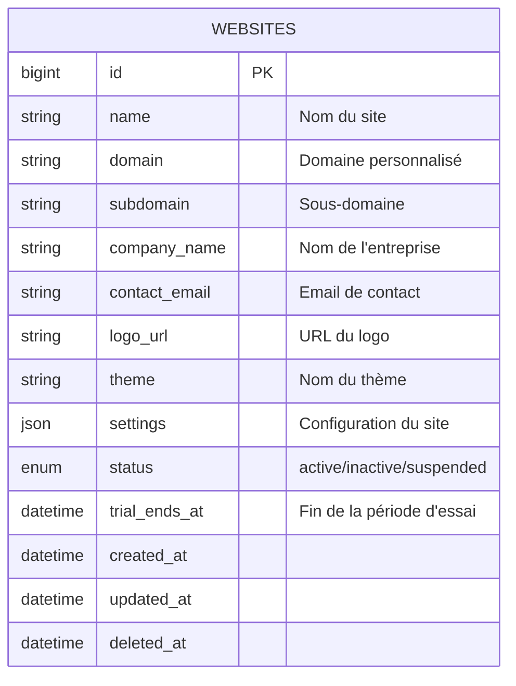
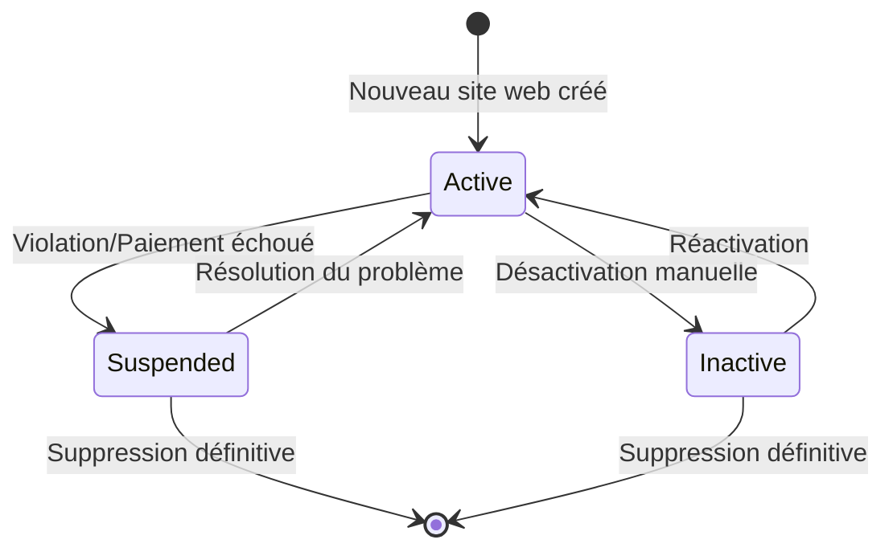

# Documentation de la Base de Données du Service Websites

## Table des Matières

- [Vue d'Ensemble](#vue-densemble)
- [Configuration de la Base de Données](#configuration-de-la-base-de-données)
- [Diagramme des Relations entre Entités](#diagramme-des-relations-entre-entités)
- [Schémas des Tables](#schémas-des-tables)
  - [Table websites](#table-websites)
- [Règles Métier](#règles-métier)
- [Exemples de Requêtes](#exemples-de-requêtes)
- [Maintenance et Optimisation](#maintenance-et-optimisation)

---

## Vue d'Ensemble

Le **Service Websites** gère la configuration multi-tenant pour une architecture SaaS B2B e-commerce. Chaque enregistrement représente une instance de site web indépendante avec :
- Configuration de domaine et branding
- Paramètres par défaut du site
- Données métier
- État du site et gestion d'abonnement
- Thème et personnalisation

Ce service permet à plusieurs entreprises d'exploiter des boutiques e-commerce indépendantes sur une infrastructure partagée avec une isolation complète des données.

---

## Configuration de la Base de Données

### Connexion Docker

```yaml
services:
  websites-mysql:
    image: mysql:8.0
    container_name: websites-mysql
    environment:
      MYSQL_DATABASE: websites_db
      MYSQL_ROOT_PASSWORD: root_password
      MYSQL_USER: websites_user
      MYSQL_PASSWORD: websites_pass
    ports:
      - "3317:3306"
    volumes:
      - websites_mysql_data:/var/lib/mysql
    networks:
      - ecommerce-network
    healthcheck:
      test: ["CMD", "mysqladmin", "ping", "-h", "localhost"]
      interval: 10s
      timeout: 5s
      retries: 5
```

### Configuration Laravel (.env)

```dotenv
DB_CONNECTION=mysql
DB_HOST=websites-mysql
DB_PORT=3306
DB_DATABASE=websites_db
DB_USERNAME=websites_user
DB_PASSWORD=websites_pass
```

---

## Diagramme des Relations entre Entités



**Note** : Le service websites est une table autonome sans relations de clés étrangères. Il sert de source de vérité pour la résolution de tenant dans toute la plateforme.

---

## Schémas des Tables

### Table `websites`

Stocke toutes les configurations de site web pour l'architecture multi-tenant. Chaque ligne représente un tenant indépendant (site web client).

#### Définition du Schéma

```php
Schema::create('websites', function (Blueprint $table) {
    $table->id();
    $table->string('name')->comment('Nom d\'affichage du site web');
    $table->string('domain')->unique()->nullable()->comment('Domaine personnalisé (ex: shop.example.com)');
    $table->string('subdomain')->unique()->comment('Sous-domaine de la plateforme (ex: acme.platform.com)');
    $table->string('company_name')->comment('Nom légal de l\'entreprise');
    $table->string('contact_email')->comment('Email de contact principal');
    $table->string('logo_url')->nullable()->comment('URL du logo (stockée dans MinIO)');
    $table->string('theme')->default('default')->comment('Nom du thème appliqué');
    $table->json('settings')->nullable()->comment('Configuration personnalisée du site (JSON)');
    $table->enum('status', ['active', 'inactive', 'suspended'])->default('active')->comment('Statut du site');
    $table->timestamp('trial_ends_at')->nullable()->comment('Fin de la période d\'essai gratuite');
    $table->timestamps();
    $table->softDeletes();

    // Index
    $table->index('domain');
    $table->index('subdomain');
    $table->index('status');
    $table->index('trial_ends_at');
});
```

#### Spécifications des Colonnes

| Colonne | Type | Nullable | Par Défaut | Description |
|---------|------|----------|------------|-------------|
| `id` | BIGINT UNSIGNED | Non | AUTO_INCREMENT | Clé primaire |
| `name` | VARCHAR(255) | Non | - | Nom d'affichage du site web |
| `domain` | VARCHAR(255) | Oui | NULL | Domaine personnalisé (doit être unique) |
| `subdomain` | VARCHAR(255) | Non | - | Sous-domaine de la plateforme (doit être unique) |
| `company_name` | VARCHAR(255) | Non | - | Nom légal de l'entreprise |
| `contact_email` | VARCHAR(255) | Non | - | Email de contact principal |
| `logo_url` | VARCHAR(255) | Oui | NULL | URL du logo (stockée dans MinIO) |
| `theme` | VARCHAR(255) | Non | 'default' | Nom du thème appliqué |
| `settings` | JSON | Oui | NULL | Configuration personnalisée du site |
| `status` | ENUM | Non | 'active' | Statut du site : active, inactive, suspended |
| `trial_ends_at` | TIMESTAMP | Oui | NULL | Fin de la période d'essai gratuite |
| `created_at` | TIMESTAMP | Oui | NULL | Horodatage de création |
| `updated_at` | TIMESTAMP | Oui | NULL | Horodatage de dernière mise à jour |
| `deleted_at` | TIMESTAMP | Oui | NULL | Horodatage de suppression logique |

#### Index

- **PRIMARY** : `id`
- **UNIQUE** : `domain` - Garantit qu'aucun domaine personnalisé en double n'est autorisé
- **UNIQUE** : `subdomain` - Garantit qu'aucun sous-domaine en double n'est autorisé
- **INDEX** : `status` - Recherche rapide par statut de site
- **INDEX** : `trial_ends_at` - Identification des périodes d'essai arrivant à expiration

#### Contraintes

- `domain` doit être unique s'il est fourni (peut être NULL)
- `subdomain` doit être unique et ne peut pas être NULL
- `status` doit être l'une des valeurs : 'active', 'inactive', 'suspended'
- `contact_email` doit être un format email valide
- `settings` doit être un JSON valide si fourni

#### Exemple de Données

```sql
INSERT INTO websites (name, domain, subdomain, company_name, contact_email, logo_url, theme, settings, status, trial_ends_at, created_at, updated_at) VALUES
(
    'Acme Electronics Store',
    'shop.acme-electronics.com',
    'acme-electronics',
    'Acme Electronics Corp.',
    'support@acme-electronics.com',
    'https://minio.platform.com/websites/acme-logo.png',
    'modern-dark',
    '{"currency": "USD", "language": "en", "timezone": "America/New_York", "payment_methods": ["stripe", "paypal"], "shipping_regions": ["US", "CA", "MX"]}',
    'active',
    NULL,
    '2024-06-01 10:00:00',
    '2024-12-15 14:30:00'
),
(
    'GreenLeaf Organics',
    NULL,
    'greenleaf-organics',
    'GreenLeaf Organics Ltd.',
    'hello@greenleaf.com',
    'https://minio.platform.com/websites/greenleaf-logo.png',
    'eco-friendly',
    '{"currency": "EUR", "language": "fr", "timezone": "Europe/Paris", "payment_methods": ["stripe"], "shipping_regions": ["FR", "BE", "DE"]}',
    'active',
    '2025-01-31 23:59:59',
    '2025-01-01 09:00:00',
    '2025-01-01 09:00:00'
),
(
    'TechGear Pro',
    'store.techgear.io',
    'techgear-pro',
    'TechGear Solutions Inc.',
    'sales@techgear.io',
    NULL,
    'default',
    '{"currency": "GBP", "language": "en", "timezone": "Europe/London", "payment_methods": ["stripe", "klarna"], "shipping_regions": ["UK"]}',
    'inactive',
    NULL,
    '2024-08-15 12:00:00',
    '2025-01-10 08:15:00'
),
(
    'FashionHub',
    'shop.fashionhub.com',
    'fashionhub',
    'FashionHub Enterprises',
    'info@fashionhub.com',
    'https://minio.platform.com/websites/fashionhub-logo.png',
    'luxury',
    '{"currency": "USD", "language": "en", "timezone": "America/Los_Angeles", "payment_methods": ["stripe", "paypal", "apple_pay"], "shipping_regions": ["US", "CA"]}',
    'suspended',
    NULL,
    '2024-03-20 14:30:00',
    '2025-01-05 11:00:00'
);
```

---

## Règles Métier

### Gestion des Statuts



#### Statuts de Site

1. **active** - Site opérationnel et accessible
   - Accepte les commandes
   - Tous les services fonctionnels
   - Apparaît dans les listings publics

2. **inactive** - Désactivé temporairement par le propriétaire
   - Aucune commande ne peut être passée
   - Affiche une page "Bientôt disponible" aux visiteurs
   - Les données sont préservées
   - Peut être réactivé à tout moment

3. **suspended** - Suspendu par la plateforme
   - Violation des conditions d'utilisation
   - Paiement échoué
   - Problèmes de sécurité
   - Nécessite une action administrative pour réactiver

### Période d'Essai Gratuite

- Les nouveaux sites web reçoivent `trial_ends_at` défini à 30 jours après la création
- Lorsque `trial_ends_at` est passé et qu'aucun abonnement actif n'existe, le site passe à 'inactive'
- Les notifications de rappel sont envoyées à `trial_ends_at - 7 jours`, `trial_ends_at - 3 jours`, `trial_ends_at - 1 jour`
- Le traitement de paiement se produit lors de l'inscription ou avant `trial_ends_at`

### Configuration du Domaine

#### Domaine Personnalisé vs Sous-Domaine

- **Sous-domaine** (obligatoire) : `[subdomain].platform.com`
  - Utilisé pour l'accès initial et de secours
  - Doit être unique sur toute la plateforme
  - Format : minuscules, tirets autorisés, pas de caractères spéciaux

- **Domaine Personnalisé** (optionnel) : `shop.example.com`
  - Nécessite une vérification DNS
  - Certificat SSL provisionné automatiquement
  - Peut être ajouté/modifié après la création du site

#### Règles de Validation du Domaine

```php
// Validation du sous-domaine
$subdomain = strtolower(trim($subdomain));
if (!preg_match('/^[a-z0-9-]+$/', $subdomain)) {
    throw new ValidationException('Le sous-domaine doit contenir uniquement des lettres minuscules, des chiffres et des tirets');
}

// Validation du domaine personnalisé
if ($domain && !filter_var("http://{$domain}", FILTER_VALIDATE_URL)) {
    throw new ValidationException('Format de domaine personnalisé invalide');
}
```

### Configuration des Paramètres (JSON)

Le champ `settings` stocke une configuration spécifique au site web au format JSON. Structure recommandée :

```json
{
  "currency": "USD",
  "language": "en",
  "timezone": "America/New_York",
  "payment_methods": ["stripe", "paypal", "apple_pay"],
  "shipping_regions": ["US", "CA", "MX"],
  "tax_settings": {
    "enabled": true,
    "rate": 8.5,
    "included_in_prices": false
  },
  "analytics": {
    "google_analytics_id": "UA-XXXXXXXXX-X",
    "facebook_pixel_id": "123456789"
  },
  "features": {
    "wishlist_enabled": true,
    "reviews_enabled": true,
    "live_chat_enabled": false
  },
  "seo": {
    "meta_title": "Acme Electronics - Quality Tech Products",
    "meta_description": "Shop the latest electronics and gadgets",
    "meta_keywords": ["electronics", "gadgets", "technology"]
  },
  "social_media": {
    "facebook": "https://facebook.com/acme-electronics",
    "twitter": "https://twitter.com/acme_electronics",
    "instagram": "https://instagram.com/acmeelectronics"
  }
}
```

### Gestion des Thèmes

Les thèmes disponibles sont définis au niveau de la plateforme :

- **default** - Thème standard de la plateforme
- **modern-dark** - Variante sombre avec design moderne
- **eco-friendly** - Palette verte avec éléments naturels
- **luxury** - Design haut de gamme avec typographie élégante
- **minimal** - Design épuré et minimaliste

Les thèmes personnalisés peuvent être développés sur demande.

### Règles de Suppression

- **Suppression logique** (`deleted_at`) : Par défaut
  - Préserve les données pour l'audit et la récupération
  - Le site devient inaccessible immédiatement
  - Les données peuvent être restaurées dans les 90 jours

- **Suppression définitive** : Effectuée après 90 jours
  - Supprime définitivement toutes les données associées
  - Action irréversible
  - Notification envoyée 30 jours avant la suppression définitive

---

## Exemples de Requêtes

### Créer un Nouveau Site Web

```php
use App\Models\Website;

$website = Website::create([
    'name' => 'Boutique de Mode Parisienne',
    'subdomain' => 'boutique-mode-paris',
    'company_name' => 'Paris Fashion SAS',
    'contact_email' => 'contact@boutique-mode-paris.fr',
    'theme' => 'luxury',
    'settings' => [
        'currency' => 'EUR',
        'language' => 'fr',
        'timezone' => 'Europe/Paris',
        'payment_methods' => ['stripe'],
        'shipping_regions' => ['FR', 'BE', 'LU'],
    ],
    'status' => 'active',
    'trial_ends_at' => now()->addDays(30),
]);

// Publier un événement via RabbitMQ
event(new WebsiteCreated($website));
```

### Récupérer un Site Web par Domaine

```php
use App\Models\Website;

$domain = request()->getHost(); // ex: shop.acme-electronics.com

$website = Website::where('domain', $domain)
    ->orWhere('subdomain', explode('.', $domain)[0])
    ->where('status', 'active')
    ->firstOrFail();
```

**Requête SQL** :

```sql
SELECT * FROM websites
WHERE (domain = 'shop.acme-electronics.com' OR subdomain = 'acme-electronics')
  AND status = 'active'
  AND deleted_at IS NULL
LIMIT 1;
```

### Mettre à Jour les Paramètres du Site Web

```php
use App\Models\Website;

$website = Website::findOrFail($websiteId);

$website->update([
    'settings' => array_merge($website->settings, [
        'features' => [
            'wishlist_enabled' => true,
            'reviews_enabled' => true,
            'live_chat_enabled' => true,
        ]
    ])
]);
```

### Ajouter un Domaine Personnalisé

```php
use App\Models\Website;

$website = Website::findOrFail($websiteId);

// Vérifier la disponibilité du domaine
if (Website::where('domain', $customDomain)->exists()) {
    throw new \Exception('Ce domaine est déjà utilisé par un autre site web');
}

$website->update(['domain' => $customDomain]);

// Déclencher le provisionnement SSL via un job en arrière-plan
dispatch(new ProvisionSSLCertificate($website));
```

### Lister Tous les Sites Web Actifs

```php
use App\Models\Website;

$activeWebsites = Website::where('status', 'active')
    ->orderBy('created_at', 'desc')
    ->paginate(20);
```

**Requête SQL** :

```sql
SELECT * FROM websites
WHERE status = 'active'
  AND deleted_at IS NULL
ORDER BY created_at DESC
LIMIT 20 OFFSET 0;
```

### Identifier les Périodes d'Essai Arrivant à Expiration

```php
use App\Models\Website;
use Carbon\Carbon;

$expiringSoon = Website::where('status', 'active')
    ->whereNotNull('trial_ends_at')
    ->whereBetween('trial_ends_at', [Carbon::now(), Carbon::now()->addDays(7)])
    ->get();

foreach ($expiringSoon as $website) {
    // Envoyer un email de rappel via le service newsletters
    dispatch(new SendTrialExpirationReminder($website));
}
```

**Requête SQL** :

```sql
SELECT * FROM websites
WHERE status = 'active'
  AND trial_ends_at IS NOT NULL
  AND trial_ends_at BETWEEN NOW() AND DATE_ADD(NOW(), INTERVAL 7 DAY)
  AND deleted_at IS NULL;
```

### Suspendre un Site Web

```php
use App\Models\Website;

$website = Website::findOrFail($websiteId);

$website->update([
    'status' => 'suspended',
    'settings' => array_merge($website->settings, [
        'suspension_reason' => 'Paiement échoué',
        'suspended_at' => now(),
    ])
]);

// Publier un événement via RabbitMQ
event(new WebsiteSuspended($website));
```

### Réactiver un Site Web Suspendu

```php
use App\Models\Website;

$website = Website::findOrFail($websiteId);

// Vérifier que le problème est résolu (ex: paiement reçu)
if ($website->hasActiveSubscription()) {
    $website->update([
        'status' => 'active',
        'settings' => array_merge($website->settings, [
            'suspension_reason' => null,
            'suspended_at' => null,
            'reactivated_at' => now(),
        ])
    ]);

    event(new WebsiteReactivated($website));
}
```

### Rechercher des Sites Web par Nom d'Entreprise

```php
use App\Models\Website;

$keyword = 'electronics';

$websites = Website::where('company_name', 'LIKE', "%{$keyword}%")
    ->orWhere('name', 'LIKE', "%{$keyword}%")
    ->where('status', '!=', 'suspended')
    ->get();
```

**Requête SQL** :

```sql
SELECT * FROM websites
WHERE (company_name LIKE '%electronics%' OR name LIKE '%electronics%')
  AND status != 'suspended'
  AND deleted_at IS NULL;
```

### Récupérer les Paramètres de Configuration d'un Site Web

```php
use App\Models\Website;

$website = Website::findOrFail($websiteId);

$currency = $website->settings['currency'] ?? 'USD';
$language = $website->settings['language'] ?? 'en';
$timezone = $website->settings['timezone'] ?? 'UTC';

// Utiliser les paramètres pour configurer l'application
app()->setLocale($language);
config(['app.timezone' => $timezone]);
```

### Récupérer les Statistiques de la Plateforme

```php
$stats = [
    'total_websites' => Website::count(),
    'active_websites' => Website::where('status', 'active')->count(),
    'inactive_websites' => Website::where('status', 'inactive')->count(),
    'suspended_websites' => Website::where('status', 'suspended')->count(),
    'trial_websites' => Website::whereNotNull('trial_ends_at')
        ->where('trial_ends_at', '>', now())
        ->count(),
    'custom_domains' => Website::whereNotNull('domain')->count(),
];
```

**Requête SQL** :

```sql
SELECT
    COUNT(*) as total_websites,
    SUM(CASE WHEN status = 'active' THEN 1 ELSE 0 END) as active_websites,
    SUM(CASE WHEN status = 'inactive' THEN 1 ELSE 0 END) as inactive_websites,
    SUM(CASE WHEN status = 'suspended' THEN 1 ELSE 0 END) as suspended_websites,
    SUM(CASE WHEN trial_ends_at IS NOT NULL AND trial_ends_at > NOW() THEN 1 ELSE 0 END) as trial_websites,
    SUM(CASE WHEN domain IS NOT NULL THEN 1 ELSE 0 END) as custom_domains
FROM websites
WHERE deleted_at IS NULL;
```

---

## Maintenance et Optimisation

### Stratégie de Sauvegarde

```bash
#!/bin/bash
# Sauvegarde de la base de données du service websites

BACKUP_DIR="/backups/websites-service"
TIMESTAMP=$(date +%Y%m%d_%H%M%S)

docker exec websites-mysql mysqldump \
  -u websites_user \
  -pwebsites_pass \
  websites_db \
  --single-transaction \
  --routines \
  --triggers \
  > "${BACKUP_DIR}/websites_db_${TIMESTAMP}.sql"

# Compresser la sauvegarde
gzip "${BACKUP_DIR}/websites_db_${TIMESTAMP}.sql"

# Conserver uniquement les 30 derniers jours de sauvegardes
find ${BACKUP_DIR} -name "websites_db_*.sql.gz" -mtime +30 -delete
```

### Recommandations d'Index

Les index suivants sont **déjà créés** dans les migrations du schéma :

- `INDEX(domain)` - Recherche rapide par domaine personnalisé
- `INDEX(subdomain)` - Recherche rapide par sous-domaine
- `INDEX(status)` - Filtrage par statut de site
- `INDEX(trial_ends_at)` - Identification des périodes d'essai arrivant à expiration

### Index Supplémentaires (Optionnels)

Pour des cas d'usage à haut trafic, envisagez ces index composites supplémentaires :

```sql
-- Recherche de sites actifs avec domaines personnalisés
CREATE INDEX idx_websites_active_custom_domain
ON websites(status, domain)
WHERE domain IS NOT NULL AND deleted_at IS NULL;

-- Recherche de sites en période d'essai actifs
CREATE INDEX idx_websites_active_trial
ON websites(status, trial_ends_at)
WHERE trial_ends_at IS NOT NULL AND deleted_at IS NULL;

-- Recherche par nom d'entreprise
CREATE INDEX idx_websites_company_name
ON websites(company_name);
```

### Index de Recherche en Texte Intégral (Optionnel)

Pour une recherche de contenu améliorée :

```sql
-- Index de recherche en texte intégral pour le nom du site web et le nom de l'entreprise
ALTER TABLE websites
ADD FULLTEXT INDEX idx_fulltext_name_company (name, company_name);
```

**Requête d'utilisation** :

```sql
SELECT * FROM websites
WHERE MATCH(name, company_name) AGAINST('fashion boutique' IN NATURAL LANGUAGE MODE)
  AND deleted_at IS NULL;
```

### Tâches de Maintenance Régulière

#### 1. Traiter les Périodes d'Essai Expirées

```bash
# Commande artisan pour désactiver les sites avec périodes d'essai expirées sans abonnement actif
php artisan websites:process-expired-trials
```

**Implémentation** :

```php
namespace App\Console\Commands;

use Illuminate\Console\Command;
use App\Models\Website;
use Carbon\Carbon;

class ProcessExpiredTrials extends Command
{
    protected $signature = 'websites:process-expired-trials';
    protected $description = 'Désactive les sites web avec périodes d\'essai expirées sans abonnement actif';

    public function handle()
    {
        $expiredWebsites = Website::where('status', 'active')
            ->whereNotNull('trial_ends_at')
            ->where('trial_ends_at', '<', Carbon::now())
            ->get();

        foreach ($expiredWebsites as $website) {
            // Vérifier si le site a un abonnement actif (via un service externe ou une table liée)
            if (!$website->hasActiveSubscription()) {
                $website->update(['status' => 'inactive']);

                // Envoyer une notification au propriétaire du site
                dispatch(new SendTrialExpiredNotification($website));

                $this->info("Site désactivé : {$website->subdomain}");
            }
        }

        $this->info('Traitement des périodes d\'essai expirées terminé.');
    }
}
```

#### 2. Nettoyer les Sites Supprimés Logiquement

```sql
-- Supprimer définitivement les sites supprimés logiquement depuis plus de 90 jours
DELETE FROM websites
WHERE deleted_at IS NOT NULL
  AND deleted_at < DATE_SUB(NOW(), INTERVAL 90 DAY);
```

**Tâche Programmée** :

```php
// Dans App\Console\Kernel.php
protected function schedule(Schedule $schedule)
{
    $schedule->command('websites:cleanup-deleted')->monthly();
}
```

#### 3. Surveillance des Domaines Personnalisés

```bash
# Script pour vérifier la validité des certificats SSL pour les domaines personnalisés
php artisan websites:check-ssl-certificates
```

**Implémentation** :

```php
namespace App\Console\Commands;

use Illuminate\Console\Command;
use App\Models\Website;

class CheckSSLCertificates extends Command
{
    protected $signature = 'websites:check-ssl-certificates';
    protected $description = 'Vérifie la validité des certificats SSL des domaines personnalisés';

    public function handle()
    {
        $websitesWithDomains = Website::whereNotNull('domain')
            ->where('status', 'active')
            ->get();

        foreach ($websitesWithDomains as $website) {
            $certificate = $this->getSSLCertificate($website->domain);

            if ($certificate && $certificate['expires_in_days'] < 30) {
                // Déclencher le renouvellement SSL
                dispatch(new RenewSSLCertificate($website));

                $this->warn("Certificat SSL arrive à expiration pour : {$website->domain}");
            }
        }

        $this->info('Vérification des certificats SSL terminée.');
    }

    private function getSSLCertificate($domain)
    {
        // Logique pour récupérer les informations sur le certificat SSL
        // Ceci est un espace réservé - implémentation réelle nécessaire
        return null;
    }
}
```

#### 4. Audit d'Utilisation des Paramètres

```sql
-- Récupérer les devises les plus utilisées
SELECT
    JSON_UNQUOTE(JSON_EXTRACT(settings, '$.currency')) as currency,
    COUNT(*) as usage_count
FROM websites
WHERE deleted_at IS NULL
GROUP BY currency
ORDER BY usage_count DESC;

-- Récupérer les langues les plus utilisées
SELECT
    JSON_UNQUOTE(JSON_EXTRACT(settings, '$.language')) as language,
    COUNT(*) as usage_count
FROM websites
WHERE deleted_at IS NULL
GROUP BY language
ORDER BY usage_count DESC;

-- Récupérer les méthodes de paiement les plus utilisées
SELECT
    JSON_EXTRACT(settings, '$.payment_methods') as payment_methods,
    COUNT(*) as usage_count
FROM websites
WHERE deleted_at IS NULL
GROUP BY payment_methods
ORDER BY usage_count DESC;
```

---

### Optimisation des Requêtes

#### Exemple 1 : Mise en Cache de la Recherche de Site Web

**Mauvais** :

```php
// Recherche de base de données à chaque requête
$website = Website::where('domain', request()->getHost())->first();
```

**Bon** :

```php
use Illuminate\Support\Facades\Cache;

$domain = request()->getHost();
$cacheKey = "website_domain_{$domain}";

$website = Cache::remember($cacheKey, 3600, function () use ($domain) {
    return Website::where('domain', $domain)
        ->orWhere('subdomain', explode('.', $domain)[0])
        ->where('status', 'active')
        ->firstOrFail();
});

// Invalider le cache lors de la mise à jour du site web
Cache::forget($cacheKey);
```

#### Exemple 2 : Traitement par Lot des Notifications d'Expiration de Période d'Essai

**Mauvais** :

```php
$expiringSoon = Website::where('trial_ends_at', '<=', now()->addDays(7))->get();

foreach ($expiringSoon as $website) {
    Mail::to($website->contact_email)->send(new TrialExpirationReminder($website));
}
```

**Bon** :

```php
use Illuminate\Support\Facades\Bus;

$expiringSoon = Website::where('trial_ends_at', '<=', now()->addDays(7))->get();

$jobs = $expiringSoon->map(function ($website) {
    return new SendTrialExpirationReminder($website);
});

Bus::batch($jobs)->dispatch();
```

#### Exemple 3 : Pagination Efficace

```php
// Utiliser la pagination curseur pour les grandes tables
$websites = Website::where('status', 'active')
    ->orderBy('id')
    ->cursorPaginate(50);
```

---

### Surveillance et Alertes

#### Métriques à Surveiller

1. **Expirations de Périodes d'Essai**
   - Sites avec `trial_ends_at` dans les 7 prochains jours sans abonnement → Alerte équipe commerciale

2. **Croissance du Nombre de Sites**
   - Suivre les créations de sites par jour/semaine/mois
   - Alerte si la croissance dépasse la capacité de la plateforme

3. **Suspensions de Sites**
   - Sites suspendus > 10 par jour → Investigation requise
   - Taux de suspension > 5% → Révision des politiques

4. **Performances de la Base de Données**
   - Temps de requête moyen > 100ms → Optimisation requise
   - Utilisation CPU > 80% pendant > 5min → Investigation

#### Script de Surveillance

```bash
#!/bin/bash
# Surveillance du service websites

TRIAL_EXPIRING=$(docker exec websites-mysql mysql -u websites_user -pwebsites_pass websites_db -se "SELECT COUNT(*) FROM websites WHERE trial_ends_at <= DATE_ADD(NOW(), INTERVAL 7 DAY) AND trial_ends_at > NOW() AND status='active' AND deleted_at IS NULL;")

if [ "$TRIAL_EXPIRING" -gt 50 ]; then
    echo "⚠️ Alerte : $TRIAL_EXPIRING sites web avec période d'essai arrivant à expiration dans les 7 prochains jours"
    # Envoyer une notification (Slack, email, etc.)
fi

SUSPENDED_TODAY=$(docker exec websites-mysql mysql -u websites_user -pwebsites_pass websites_db -se "SELECT COUNT(*) FROM websites WHERE status='suspended' AND updated_at >= CURDATE() AND deleted_at IS NULL;")

if [ "$SUSPENDED_TODAY" -gt 10 ]; then
    echo "⚠️ Alerte : $SUSPENDED_TODAY sites web suspendus aujourd'hui"
fi
```

---

## Conclusion

Le **Service Websites** fournit la couche de gestion multi-tenant fondamentale pour une plateforme e-commerce SaaS B2B. Grâce à une configuration flexible, une gestion d'abonnement et un support de domaine personnalisé, ce service permet à plusieurs entreprises d'exploiter des boutiques en ligne indépendantes avec une isolation complète.

**Points Clés** :
- ✅ Architecture multi-tenant avec isolation des données
- ✅ Support de domaine personnalisé avec provisionnement SSL
- ✅ Configuration flexible via des paramètres JSON
- ✅ Gestion des périodes d'essai gratuites
- ✅ Statuts de site (active/inactive/suspended)
- ✅ Suppression logique pour la préservation de l'historique
- ✅ Optimisations d'index pour les performances

**Améliorations Futures** :
- Système de facturation et de gestion d'abonnement intégré
- Support multilingue avec détection de langue automatique
- Constructeur de thèmes avec personnalisation en temps réel
- Tableau de bord d'analyse pour les propriétaires de sites
- Système de sauvegarde et de restauration automatisé
- Vérification de domaine personnalisé avec API DNS
- Intégration CDN pour des performances mondiales
