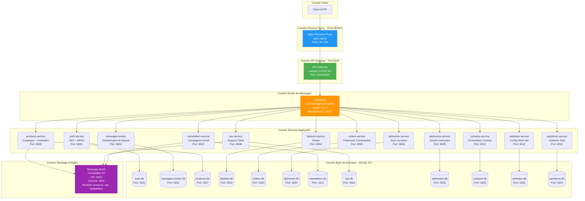

# Documentation de l'Architecture Docker Compose

## Table des Matieres

1. [Apercu](#apercu)
2. [Diagramme d'Architecture](#diagramme-darchitecture)
3. [Inventaire des Conteneurs](#inventaire-des-conteneurs)
4. [Details de Configuration des Services](#details-de-configuration-des-services)
5. [Architecture Reseau](#architecture-reseau)
6. [Volumes et Persistance](#volumes-et-persistance)
7. [Developpement avec Docker Watch](#developpement-avec-docker-watch)
8. [Configuration du Reverse Proxy Nginx](#configuration-du-reverse-proxy-nginx)
9. [Structure des Dockerfiles](#structure-des-dockerfiles)
10. [Variables d'Environnement](#variables-denvironnement)
11. [Commandes Courantes](#commandes-courantes)

## Apercu

### Resume de l'Infrastructure

La plateforme e-commerce fonctionne sur Docker Compose avec une architecture de microservices entierement asynchrone. Toute la communication entre services transite par le broker de messages RabbitMQ, garantissant un decouplage complet et un traitement asynchrone.

**Nombre Total de Conteneurs**: 27
- 13 Services d'Application Laravel
- 11 Conteneurs de Base de Donnees MySQL
- 1 Broker de Messages RabbitMQ (avec interface de gestion)
- 1 Serveur de Stockage d'Objets MinIO
- 1 Reverse Proxy Nginx

**Reseau**: Reseau bridge `microservices-network` pour la communication interne des services

**Volumes**: 13 volumes persistants pour les bases de donnees et services avec etat

### Flux de Communication

```
Requete Client
    |
    v
Nginx (ports 80/443)
    |
    v
API Gateway (port 8100)
    |
    v
RabbitMQ (ports 5672/15672)
    |
    v
Microservices (traitement asynchrone)
    |
    |-- Bases de donnees MySQL (isolees par service)
    |-- Stockage MinIO (products, sav, newsletters)
    v
Reponse via RabbitMQ
```

Toutes les requetes HTTP entrent par Nginx, qui route vers l'API Gateway. Le gateway orchestre la communication des services via les exchanges et queues RabbitMQ, permettant un veritable traitement asynchrone.

## Diagramme d'Architecture



## Inventaire des Conteneurs

### Liste Complete des Conteneurs (27 Total)

| Categorie | Nom Conteneur | Image | Port Interne | Port Externe | Objectif |
|----------|---------------|-------|---------------|---------------|---------|
| **Reverse Proxy** |
| Proxy | nginx | nginx:alpine | 80, 443 | 80, 443 | Point d'entree HTTP/HTTPS |
| **Services Principaux** |
| Gateway | api-gateway | custom/php:8.3-fpm | 8000 | 8100 | Point d'entree API unique |
| Auth | auth-service | custom/php:8.3-fpm | 8001 | - | Authentification JWT + RBAC |
| Broker | messages-broker | custom/php:8.3-fpm | 8002 | - | Gestionnaire messages RabbitMQ |
| **Services Metier** |
| Products | products-service | custom/php:8.3-fpm | 8003 | - | Catalogue produits + inventaire |
| Baskets | baskets-service | custom/php:8.3-fpm | 8004 | - | Gestion panier |
| Orders | orders-service | custom/php:8.3-fpm | 8005 | - | Traitement commandes |
| Deliveries | deliveries-service | custom/php:8.3-fpm | 8006 | - | Suivi livraison |
| Newsletters | newsletters-service | custom/php:8.3-fpm | 8007 | - | Campagnes email |
| SAV | sav-service | custom/php:8.3-fpm | 8008 | - | Tickets support client |
| Addresses | addresses-service | custom/php:8.3-fpm | 8009 | - | Validation adresses |
| Contacts | contacts-service | custom/php:8.3-fpm | 8010 | - | Gestion formulaires contact |
| Questions | questions-service | custom/php:8.3-fpm | 8011 | - | Systeme FAQ |
| Websites | websites-service | custom/php:8.3-fpm | 8012 | - | Configuration multi-site |
| **Bases de Donnees** |
| Auth DB | auth-db | mysql:8.0 | 3306 | 3331 | auth_service_db |
| Broker DB | messages-broker-db | mysql:8.0 | 3306 | 3332 | messages_broker |
| Products DB | products-db | mysql:8.0 | 3306 | 3307 | products_service_db |
| Baskets DB | baskets-db | mysql:8.0 | 3306 | 3319 | baskets_service_db |
| Orders DB | orders-db | mysql:8.0 | 3306 | 3330 | orders_service_db |
| Deliveries DB | deliveries-db | mysql:8.0 | 3306 | 3320 | deliveries_service_db |
| Newsletters DB | newsletters-db | mysql:8.0 | 3306 | 3321 | newsletters_service_db |
| SAV DB | sav-db | mysql:8.0 | 3306 | 3322 | sav_service_db |
| Addresses DB | addresses-db | mysql:8.0 | 3306 | 3333 | addresses_service |
| Contacts DB | contacts-db | mysql:8.0 | 3306 | 3323 | contacts_service_db |
| Websites DB | websites-db | mysql:8.0 | 3306 | 3325 | websites_service_db |
| Questions DB | questions-db | mysql:8.0 | 3306 | 3324 | questions_service_db |
| **Infrastructure** |
| Message Queue | rabbitmq | rabbitmq:3.12-management-alpine | 5672, 15672 | 5672, 15672 | AMQP + Interface de gestion |
| Stockage Objets | minio | minio/minio:latest | 9000, 9001 | 9000, 9001 | Stockage compatible S3 |

## Details de Configuration des Services

### API Gateway

**Conteneur**: `api-gateway`
**Build Context**: `./services/api-gateway/Dockerfile`
**Ports**: `8100:8000` (externe:interne)

**Variables d'Environnement**:
```bash
APP_ENV=local
CONTAINER_ROLE=app
RABBITMQ_HOST=rabbitmq
RABBITMQ_PORT=5672
RABBITMQ_USER=guest
RABBITMQ_PASSWORD=guest
RABBITMQ_VHOST=/

# URLs des services (reseau Docker interne)
AUTH_SERVICE_URL=http://auth-service:8001
ADDRESSES_SERVICE_URL=http://addresses-service:8009
PRODUCTS_SERVICE_URL=http://products-service:8003
BASKETS_SERVICE_URL=http://baskets-service:8005
ORDERS_SERVICE_URL=http://orders-service:8004
DELIVERIES_SERVICE_URL=http://deliveries-service:8006
NEWSLETTERS_SERVICE_URL=http://newsletters-service:8007
SAV_SERVICE_URL=http://sav-service:8008
MESSAGES_BROKER_URL=http://messages-broker:8002
```

**Volumes**:
- `./services/api-gateway:/var/www/api-gateway` (bind mount code source)
- `/var/www/api-gateway/vendor` (volume anonyme pour dependances)

**Dependances**: `rabbitmq`

**Configuration Watch**:
```yaml
- action: sync          # Hot-reload sur changements fichiers
  path: services/api-gateway
  target: /var/www/api-gateway
  ignore: [vendor/]

- action: rebuild       # Rebuild sur changements dependances
  path: services/api-gateway/composer.json
```

### Auth Service

**Conteneur**: `auth-service`
**Build Context**: `./services/auth-service/Dockerfile`
**Port Interne**: `8001`

**Variables d'Environnement**:
```bash
APP_ENV=local
CONTAINER_ROLE=app
DB_HOST=auth-db            # Modele base-de-donnees-par-service
```

**Volumes**:
- `./services/auth-service:/var/www/auth-service`
- `/var/www/auth-service/vendor`

**Dependances**: `auth-db`

**Base de Donnees**: `auth-db`
- Image: `mysql:8.0`
- Base de donnees: `auth_service_db`
- Mot de passe root: `root`
- Port externe: `3331:3306`

### Products Service

**Conteneur**: `products-service`
**Build Context**: `./services/products-service/Dockerfile`
**Port Interne**: `8003`

**Variables d'Environnement**:
```bash
APP_ENV=local
CONTAINER_ROLE=app
DB_HOST=products-db

# Configuration MinIO
MINIO_ENDPOINT=minio:9000
MINIO_ACCESS_KEY=admin
MINIO_SECRET_KEY=adminpass123
MINIO_BUCKET=products
MINIO_USE_SSL=false
```

**Volumes**:
- `./services/products-service:/var/www/products-service`
- `./shared:/var/www/shared` (bibliotheque partagee)
- `/var/www/products-service/vendor`

**Dependances**: `products-db`, `minio`

**Base de Donnees**: `products-db`
- Port externe: `3307:3306`

### SAV Service (Support Client)

**Conteneur**: `sav-service`
**Build Context**: `./services/sav-service/Dockerfile`
**Port Interne**: `8008`

**Variables d'Environnement**:
```bash
APP_ENV=local
CONTAINER_ROLE=app
DB_HOST=sav-db

# Configuration RabbitMQ
RABBITMQ_HOST=rabbitmq
RABBITMQ_PORT=5672
RABBITMQ_USER=guest
RABBITMQ_PASSWORD=guest
RABBITMQ_VHOST=/
RABBITMQ_EXCHANGE=sav_exchange
RABBITMQ_QUEUE=sav_queue

# Configuration MinIO
MINIO_ENDPOINT=minio:9000
MINIO_ACCESS_KEY=admin
MINIO_SECRET_KEY=adminpass123
MINIO_BUCKET=sav
MINIO_USE_SSL=false
```

**Volumes**:
- `./services/sav-service:/var/www/sav-service`
- `./shared:/var/www/shared`
- `/var/www/sav-service/vendor`

**Dependances**: `sav-db`, `rabbitmq`, `minio`

**Base de Donnees**: `sav-db`
- Port externe: `3322:3306`
- Volume persistant: `sav-db-data`

### Newsletters Service

**Conteneur**: `newsletters-service`
**Build Context**: `./services/newsletters-service/Dockerfile`
**Port Interne**: `8007`

**Variables d'Environnement**:
```bash
APP_ENV=local
CONTAINER_ROLE=app
DB_HOST=newsletters-db

# Configuration RabbitMQ
RABBITMQ_HOST=rabbitmq
RABBITMQ_PORT=5672
RABBITMQ_USER=guest
RABBITMQ_PASSWORD=guest
RABBITMQ_VHOST=/

# Configuration MinIO
MINIO_ENDPOINT=minio:9000
MINIO_ACCESS_KEY=admin
MINIO_SECRET_KEY=adminpass123
MINIO_BUCKET=newsletters
MINIO_USE_SSL=false
```

**Volumes**:
- `./services/newsletters-service:/var/www/newsletters-service`
- `./shared:/var/www/shared`
- `/var/www/newsletters-service/vendor`

**Dependances**: `newsletters-db`, `rabbitmq`, `minio`

**Base de Donnees**: `newsletters-db`
- Port externe: `3321:3306`
- Volume persistant: `newsletters-db-data`

### Broker de Messages RabbitMQ

**Conteneur**: `rabbitmq`
**Image**: `rabbitmq:3.12-management-alpine`
**Politique de Redemarrage**: `unless-stopped`

**Ports**:
- `5672:5672` (protocole AMQP)
- `15672:15672` (Interface de gestion)

**Variables d'Environnement**:
```bash
RABBITMQ_DEFAULT_USER=guest
RABBITMQ_DEFAULT_PASS=guest
RABBITMQ_DEFAULT_VHOST=/
```

**Volume**: `rabbitmq-data:/var/lib/rabbitmq`

**Interface de Gestion**: http://localhost:15672 (guest/guest)

### Stockage d'Objets MinIO

**Conteneur**: `minio`
**Image**: `minio/minio:latest`
**Nom Conteneur**: `minio-storage`
**Politique de Redemarrage**: `unless-stopped`

**Ports**:
- `9000:9000` (API compatible S3)
- `9001:9001` (Console Web)

**Variables d'Environnement**:
```bash
MINIO_ROOT_USER=admin
MINIO_ROOT_PASSWORD=adminpass123
```

**Volume**: `minio-data:/data`

**Commande**: `server /data --console-address ":9001"`

**Health Check**:
```bash
test: ["CMD", "curl", "-f", "http://localhost:9000/minio/health/live"]
interval: 30s
timeout: 20s
retries: 3
```

**Buckets**:
- `products` - Images et medias produits
- `sav` - Pieces jointes tickets support
- `newsletters` - Templates et assets campagnes email

**Console**: http://localhost:9001 (admin/adminpass123)

### Reverse Proxy Nginx

**Conteneur**: `nginx`
**Image**: `nginx:alpine`

**Ports**:
- `80:80` (HTTP)
- `443:443` (HTTPS)

**Volumes**:
- `./docker/nginx/conf.d:/etc/nginx/conf.d` (configuration)
- Montages source services pour ressources statiques

**Dependances**: Tous les services applicatifs

**Configuration Watch**:
```yaml
- action: sync
  path: docker/nginx/conf.d
  target: /etc/nginx/conf.d
```

## Architecture Reseau

### Reseau Bridge

**Nom Reseau**: `microservices-network`
**Driver**: `bridge`

Tous les conteneurs se connectent a ce reseau bridge unique, permettant:
- Resolution DNS interne via noms de conteneurs
- Decouverte de services sans IPs codees en dur
- Isolation reseau de l'hote

### DNS Interne

Le serveur DNS embarque de Docker resout les noms de conteneurs:

```bash
# Depuis n'importe quel conteneur:
ping rabbitmq              # resout vers l'IP du conteneur RabbitMQ
ping products-service      # resout vers l'IP du conteneur products-service
ping auth-db              # resout vers l'IP du conteneur auth-db
```

### Strategie de Mappage de Ports

**Ports Externes** (acces machine hote):
```
80, 443         - Nginx (HTTP/HTTPS)
8100            - API Gateway
5672, 15672     - RabbitMQ (AMQP + Gestion)
9000, 9001      - MinIO (API + Console)
3307-3333       - Bases de donnees MySQL (debug uniquement)
```

**Ports Internes** (conteneur-a-conteneur):
```
8000-8012       - Services applicatifs
3306            - MySQL (port standard, isole par conteneur)
```

### Modeles de Communication

**Client vers API**:
```
Client Externe -> Nginx:80 -> API Gateway:8000
```

**Service a Service** (via RabbitMQ):
```
Service A -> RabbitMQ:5672 (publication) -> Exchange -> Queue -> Service B (consommation)
```

**Service vers Base de Donnees**:
```
auth-service -> auth-db:3306 (reseau interne)
```

**Service vers MinIO**:
```
products-service -> minio:9000 (API S3)
```

## Volumes et Persistance

### Volumes Nommes (13 Total)

Tous les volumes nommes utilisent le driver `local` de Docker par defaut:

```yaml
volumes:
  # Volumes Base de Donnees
  auth-db-data:          # Base de donnees service Auth
  addresses-db-data:     # Base de donnees service Addresses
  products-db-data:      # Base de donnees service Products
  baskets-db-data:       # Base de donnees service Baskets
  orders-db-data:        # Base de donnees service Orders
  deliveries-db-data:    # Base de donnees service Deliveries
  newsletters-db-data:   # Base de donnees service Newsletters
  sav-db-data:          # Base de donnees service SAV
  contacts-db-data:      # Base de donnees service Contacts
  websites-db-data:      # Base de donnees service Websites
  questions-db-data:     # Base de donnees service Questions

  # Volumes Infrastructure
  rabbitmq-data:         # Messages et etat RabbitMQ
  minio-data:           # Buckets stockage objets MinIO
```

### Bind Mounts (Developpement)

Les repertoires de code source sont montes pour le hot-reload pendant le developpement:

```yaml
# Exemple: Service Products
volumes:
  - ./services/products-service:/var/www/products-service  # Code source
  - ./shared:/var/www/shared                              # Bibliotheque partagee
  - /var/www/products-service/vendor                      # Volume anonyme
```

**Volumes Anonymes**: Protegent les repertoires `vendor/` d'etre ecrases par les bind mounts hote, preservant les dependances installees dans le conteneur.

### Garanties de Persistance

**Bases de Donnees**: Toutes les bases MySQL utilisent des volumes nommes garantissant que les donnees survivent a la recreation des conteneurs:
```bash
docker-compose down      # Donnees preservees dans volumes
docker-compose up        # Donnees restaurees depuis volumes
```

**Stockage d'Objets**: Les donnees MinIO persistent dans le volume `minio-data`:
```bash
docker volume inspect e-commerce-back_minio-data
```

**File de Messages**: L'etat et les messages RabbitMQ persistent dans `rabbitmq-data`.

## Developpement avec Docker Watch

### Apercu de la Fonctionnalite Watch

Docker Compose Watch permet la synchronisation automatique et le rebuild pendant le developpement, eliminant les redemarrages manuels de conteneurs.

### Strategie: Sync

**Objectif**: Hot-reload des changements de code source
**Declencheur**: Modifications de fichiers dans les chemins surveilles
**Action**: Fichiers instantanement synchronises vers le conteneur

**Exemple** (Service Auth):
```yaml
develop:
  watch:
    - action: sync
      path: services/auth-service
      target: /var/www/auth-service
      ignore:
        - vendor/
```

**Effet**: Modifier `services/auth-service/app/Http/Controllers/AuthController.php` sur l'hote, changements immediatement disponibles dans le conteneur sans redemarrage.

### Strategie: Rebuild

**Objectif**: Rebuild du conteneur sur changements de dependances
**Declencheur**: Changements dans `composer.json`
**Action**: Rebuild complet de l'image et recreation du conteneur

**Exemple**:
```yaml
develop:
  watch:
    - action: rebuild
      path: services/auth-service/composer.json
```

**Effet**: Installer nouveau package Composer, watch rebuild automatiquement l'image du service.

### Demarrage du Mode Watch

**Commande**:
```bash
docker-compose up --watch

# Ou via Makefile:
make dev
```

**Avantages**:
- Synchronisation code en temps reel
- Pas de redemarrages manuels de conteneurs
- Gestion automatique des dependances
- Amelioration de l'efficacite du workflow de developpement

**Sortie**:
```
[+] Running watch for [auth-service products-service ...]
Syncing "services/auth-service" to "/var/www/auth-service"
File changed: app/Http/Controllers/AuthController.php
Synced in 23ms
```

## Configuration du Reverse Proxy Nginx

### Fichier de Configuration

**Emplacement**: `./docker/nginx/conf.d/default.conf`

### Definition Upstream

```nginx
upstream api_gateway {
    server api-gateway:8000;
}
```

Definit la cible backend en utilisant le DNS Docker (`api-gateway` resout vers l'IP du conteneur).

### Bloc Server

```nginx
server {
    listen 80;
    server_name localhost;

    # Toutes les requetes routees par l'API Gateway
    # Le Gateway orchestre la communication des services via RabbitMQ

    # ... blocs location
}
```

### Blocs Location

**Routes API V1** (correspondance exacte):
```nginx
location /v1/ {
    proxy_pass http://api_gateway/v1/;
    proxy_set_header Host $host;
    proxy_set_header X-Real-IP $remote_addr;
    proxy_set_header X-Forwarded-For $proxy_add_x_forwarded_for;
    proxy_set_header X-Forwarded-Proto $scheme;
    proxy_set_header X-Request-ID $request_id;
}
```

**Routes API** (retire le prefixe `/api/`):
```nginx
location /api/ {
    proxy_pass http://api_gateway/v1/;
    proxy_set_header Host $host;
    proxy_set_header X-Real-IP $remote_addr;
    proxy_set_header X-Forwarded-For $proxy_add_x_forwarded_for;
    proxy_set_header X-Forwarded-Proto $scheme;
    proxy_set_header X-Request-ID $request_id;
}
```

**Redirection Racine**:
```nginx
location / {
    return 301 /api/;
}
```

### Flux de Requete

```
GET http://localhost/api/auth/login
    |
    v
Nginx recoit la requete
    |
    v
Correspond au location /api/
    |
    v
Reecrit en /v1/auth/login
    |
    v
Proxy vers api-gateway:8000/v1/auth/login
    |
    v
Defini headers: Host, X-Real-IP, X-Forwarded-For, X-Request-ID
    |
    v
API Gateway traite via RabbitMQ
    |
    v
Reponse retournee par la chaine de proxy
```

### En-tetes Personnalises

**X-Request-ID**: Identifiant unique pour tracage requete entre services
**X-Real-IP**: Adresse IP client originale
**X-Forwarded-For**: Chaine d'IPs proxy
**X-Forwarded-Proto**: Protocole requete original (http/https)

## Structure des Dockerfiles

### Configuration de Base

Tous les Dockerfiles des services suivent un modele multi-etapes utilisant PHP 8.3 FPM comme base:

```dockerfile
FROM php:8.3-fpm AS base

ARG BUILD_DATE
ARG VCS_REF
ENV SERVICE_NAME=auth-service

LABEL maintainer="Equipe DevOps <devops@votreentreprise.com>" \
      org.label-schema.name="auth-service" \
      org.label-schema.description="Service Authentification E-commerce" \
      org.label-schema.build-date="${BUILD_DATE}" \
      org.label-schema.vcs-ref="${VCS_REF}"
```

### Dependances Systeme

```dockerfile
RUN apt-get update && apt-get install -y \
    git curl libpng-dev libxml2-dev zip unzip default-mysql-client \
    nginx supervisor libonig-dev libfreetype6-dev libjpeg62-turbo-dev \
    libzip-dev libicu-dev build-essential netcat-traditional \
    && rm -rf /var/lib/apt/lists/*
```

**Packages Installes**:
- `git`, `curl`, `zip`, `unzip` - Controle de version et archivage
- `default-mysql-client` - Outils CLI MySQL
- `nginx` - Serveur web
- `supervisor` - Gestionnaire de processus
- `lib*-dev` - Dependances extensions PHP
- `netcat-traditional` - Debogage reseau

### Extensions PHP

```dockerfile
RUN docker-php-ext-configure gd --with-freetype --with-jpeg \
    && docker-php-ext-configure intl \
    && docker-php-ext-install \
    pdo_mysql mbstring exif pcntl bcmath gd zip intl sockets opcache

RUN pecl install redis && docker-php-ext-enable redis
```

**Extensions Installees**:
- `pdo_mysql` - Connectivite base de donnees
- `mbstring` - Gestion chaines multi-octets
- `exif` - Metadonnees images
- `pcntl` - Controle processus
- `bcmath` - Mathematiques precision arbitraire
- `gd` - Traitement images
- `zip` - Gestion archives
- `intl` - Internationalisation
- `sockets` - Sockets reseau
- `opcache` - Cache opcode
- `redis` - Client Redis

### Installation Composer

```dockerfile
COPY --from=composer:2.6 /usr/bin/composer /usr/bin/composer
ENV COMPOSER_ALLOW_SUPERUSER=1
```

Utilise l'image officielle Composer pour le binaire, autorise execution superutilisateur dans le conteneur.

### Installation Dependances (Strategie de Cache)

```dockerfile
WORKDIR /var/www

# Copie d'abord les fichiers de dependances pour cache des couches
COPY shared/composer.json shared/composer.lock ./shared/
COPY services/auth-service/composer.json services/auth-service/composer.lock ./services/auth-service/

# Install dependances (cache si fichiers inchanges)
RUN cd shared && composer install --no-dev --no-autoloader --no-scripts --no-interaction
RUN cd services/auth-service && composer install --no-dev --no-autoloader --no-scripts --no-interaction

# Copie code source application
COPY shared/ ./shared/
COPY services/auth-service/ ./services/auth-service/

# Genere autoloader optimise
RUN cd shared && composer dump-autoload --optimize
RUN cd services/auth-service && composer dump-autoload --optimize
```

**Optimisation Cache Couches**: Fichiers de dependances copies separement, permettant a Docker de cacher les operations `composer install` couteuses.

### Fichiers de Configuration

```dockerfile
COPY docker/config/nginx.conf /etc/nginx/nginx.conf
COPY docker/config/php.ini /usr/local/etc/php/conf.d/99-custom.ini
COPY docker/config/opcache.ini /usr/local/etc/php/conf.d/opcache.ini
COPY services/auth-service/docker/supervisord.conf /etc/supervisor/conf.d/supervisord.conf
```

### Entrypoint et Permissions

```dockerfile
COPY docker/scripts/entrypoint.sh /usr/local/bin/entrypoint.sh
RUN chmod +x /usr/local/bin/entrypoint.sh

RUN mkdir -p /var/log/supervisor /var/log/nginx /run/nginx \
    && mkdir -p /var/www/services/auth-service/storage/{app,framework/{cache,sessions,views},logs} \
    && groupadd -r appgroup && useradd -r -g appgroup appuser \
    && chown -R appuser:appgroup /var/www /var/log /run/nginx
```

**Utilisateur Non-Root**: Cree `appuser:appgroup` pour bonnes pratiques de securite.

### Health Check

```dockerfile
HEALTHCHECK --interval=30s --timeout=10s --start-period=60s --retries=3 \
    CMD curl -f http://localhost:8000/api/health || exit 1
```

**Parametres**:
- Interval: Verification toutes les 30 secondes
- Timeout: Attendre 10 secondes pour reponse
- Start Period: Attendre 60 secondes avant premiere verification
- Retries: 3 echecs avant marquage unhealthy

### Configuration Finale

```dockerfile
EXPOSE 8000 9090

USER appuser

ENV SERVICE_NAME=auth-service
ENV CONTAINER_ROLE=app

ENTRYPOINT ["/usr/local/bin/entrypoint.sh"]
CMD ["supervisord", "-c", "/etc/supervisor/conf.d/supervisord.conf"]
```

**Ports Exposes**:
- `8000` - HTTP Application
- `9090` - Metriques/monitoring

**Gestionnaire de Processus**: Supervisord gere les processus Nginx + PHP-FPM.

## Variables d'Environnement

### Variables Specifiques aux Services

Chaque service recoit des variables d'environnement via `docker-compose.yml`:

**Variables Communes**:
```bash
APP_ENV=local                # Environnement application
CONTAINER_ROLE=app           # Role conteneur (app/queue/scheduler)
DB_HOST=<service>-db        # Nom hote base de donnees (DNS interne)
```

**Variables RabbitMQ** (services utilisant le broker de messages):
```bash
RABBITMQ_HOST=rabbitmq
RABBITMQ_PORT=5672
RABBITMQ_USER=guest
RABBITMQ_PASSWORD=guest
RABBITMQ_VHOST=/
RABBITMQ_EXCHANGE=<service>_exchange
RABBITMQ_QUEUE=<service>_queue
```

**Variables MinIO** (services utilisant stockage objets):
```bash
MINIO_ENDPOINT=minio:9000
MINIO_ACCESS_KEY=admin
MINIO_SECRET_KEY=adminpass123
MINIO_BUCKET=<service-bucket>
MINIO_USE_SSL=false
```

### Fichier .env Racine

**Emplacement**: `/Users/kbrdn1/Projects/MNS/e-commerce-back/.env`

Contient la configuration centralisee heritee par tous les services:

**Hotes Base de Donnees** (DNS interne):
```bash
DB_AUTH_HOST=auth-db
DB_MESSAGES_BROKER_HOST=messages-broker-db
DB_ADDRESSES_HOST=addresses-db
DB_PRODUCTS_HOST=products-db
DB_BASKETS_HOST=baskets-db
DB_ORDERS_HOST=orders-db
DB_DELIVERIES_HOST=deliveries-db
DB_NEWSLETTERS_HOST=newsletters-db
DB_SAV_HOST=sav-db
DB_CONTACTS_HOST=contacts-db
DB_WEBSITES_HOST=websites-db
DB_QUESTIONS_HOST=questions-db
```

**Ports Externes Base de Donnees** (acces hote):
```bash
DB_AUTH_EXTERNAL_PORT=3331
DB_MESSAGES_BROKER_EXTERNAL_PORT=3332
DB_ADDRESSES_EXTERNAL_PORT=3333
DB_PRODUCTS_EXTERNAL_PORT=3307
DB_BASKETS_EXTERNAL_PORT=3319
DB_ORDERS_EXTERNAL_PORT=3330
DB_DELIVERIES_EXTERNAL_PORT=3320
DB_NEWSLETTERS_EXTERNAL_PORT=3321
DB_SAV_EXTERNAL_PORT=3322
DB_CONTACTS_EXTERNAL_PORT=3323
DB_WEBSITES_EXTERNAL_PORT=3325
DB_QUESTIONS_EXTERNAL_PORT=3324
```

**URLs Services** (reseau Docker interne):
```bash
API_GATEWAY_URL=http://api-gateway:8000
AUTH_SERVICE_URL=http://auth-service:8001
MESSAGES_BROKER_URL=http://messages-broker:8002
PRODUCTS_SERVICE_URL=http://products-service:8003
BASKETS_SERVICE_URL=http://baskets-service:8005
ORDERS_SERVICE_URL=http://orders-service:8004
DELIVERIES_SERVICE_URL=http://deliveries-service:8006
NEWSLETTERS_SERVICE_URL=http://newsletters-service:8007
SAV_SERVICE_URL=http://sav-service:8008
ADDRESSES_SERVICE_URL=http://addresses-service:8009
CONTACTS_SERVICE_URL=http://contacts-service:8010
QUESTIONS_SERVICE_URL=http://questions-service:8011
WEBSITES_SERVICE_URL=http://websites-service:8012
```

**Configuration RabbitMQ**:
```bash
RABBITMQ_HOST=rabbitmq
RABBITMQ_PORT=5672
RABBITMQ_USER=guest
RABBITMQ_PASSWORD=guest
RABBITMQ_VHOST=/
RABBITMQ_MANAGEMENT_PORT=15672
RABBITMQ_EXCHANGE_NAME=microservices_exchange
RABBITMQ_EXCHANGE_TYPE=topic
RABBITMQ_QUEUE_DURABLE=true
MESSAGE_BROKER_PREFETCH_COUNT=10
MESSAGE_BROKER_RETRY_ATTEMPTS=3
```

**Configuration MinIO**:
```bash
MINIO_ENDPOINT=minio:9000
MINIO_ROOT_USER=admin
MINIO_ROOT_PASSWORD=adminpass123
MINIO_USE_SSL=false
MINIO_REGION=us-east-1
MINIO_CONSOLE_PORT=9001
MINIO_BUCKET_PRODUCTS=products
MINIO_BUCKET_SAV=sav
MINIO_BUCKET_NEWSLETTERS=newsletters
```

**Configuration JWT**:
```bash
JWT_SECRET=your-jwt-secret-key-here
JWT_TTL=1440                    # 24 heures en minutes
JWT_REFRESH_TTL=20160           # 14 jours en minutes
JWT_ALGO=HS256
```

## Commandes Courantes

### Operations Docker Compose

**Demarrer Tous les Services**:
```bash
make docker-start

# Equivalent a:
docker-compose up -d
```

**Installation Premiere Fois** (build + migrate + seed):
```bash
make docker-install

# Effectue:
# 1. docker-compose build
# 2. docker-compose up -d
# 3. Sleep 15 secondes (demarrage base de donnees)
# 4. Lance migrations sur tous les services
# 5. Lance seeders sur tous les services
```

**Developpement avec Hot-Reload**:
```bash
make dev

# Equivalent a:
docker-compose up --watch
```

**Voir Etat des Services**:
```bash
make docker-status

# Equivalent a:
docker-compose ps
```

**Voir les Logs**:
```bash
# Tous les services
docker-compose logs -f

# Service specifique
docker-compose logs -f auth-service

# 100 dernieres lignes
docker-compose logs --tail=100 products-service
```

**Arreter Services** (preserver donnees):
```bash
make docker-stop

# Equivalent a:
docker-compose stop
```

**Arreter et Supprimer Conteneurs** (preserver volumes):
```bash
make docker-down

# Equivalent a:
docker-compose down
```

**Nettoyage Complet** (supprimer volumes):
```bash
make docker-clean

# Equivalent a:
docker-compose down -v --rmi all
docker system prune -f
```

**Arret d'Urgence**:
```bash
make docker-kill

# Equivalent a:
docker-compose kill
docker-compose down --remove-orphans
```

### Gestion des Services

**Acceder au Shell du Service**:
```bash
make SERVICE_NAME=auth-service shell

# Equivalent a:
docker-compose exec auth-service bash
```

**Lancer Commandes Artisan**:
```bash
# Migrations
docker-compose exec auth-service php artisan migrate

# Seeders
docker-compose exec auth-service php artisan db:seed

# Fresh migration avec seeds
docker-compose exec auth-service php artisan migrate:fresh --seed

# Commandes personnalisees
docker-compose exec auth-service php artisan newsletters:process-scheduled
```

**Installer Dependances Composer**:
```bash
make SERVICE_NAME=auth-service composer-install

# Equivalent a:
docker-compose exec auth-service composer install
```

**Lancer Tests**:
```bash
# Tous les services
make test-docker

# Service specifique
make SERVICE_NAME=auth-service test-service

# Equivalent a:
docker-compose exec auth-service php artisan test
```

**Vider Caches**:
```bash
make clear-cache

# Lance sur tous les services:
docker-compose exec <service> php artisan cache:clear
```

### Operations Base de Donnees

**Migrer Tous les Services**:
```bash
make migrate-all
```

**Seeder Tous les Services**:
```bash
make seed-all
```

**Fresh Migration avec Seeds** (destructif):
```bash
make fresh-all
```

**Sauvegarder Bases de Donnees**:
```bash
make backup-docker

# Cree dumps dans ./backups/ avec timestamp
```

**Acces Direct Base de Donnees**:
```bash
# Via port externe
mysql -h 127.0.0.1 -P 3331 -u root -proot auth_service_db

# Via Docker exec
docker-compose exec auth-db mysql -u root -proot auth_service_db
```

### Operations MinIO

**Workflow Complet MinIO**:
```bash
make minio-workflow

# Effectue:
# 1. Demarre MinIO
# 2. Cree buckets (products, sav, newsletters)
# 3. Valide Phase 1 (26 verifications)
# 4. Lance tests integration
```

**Demarrer MinIO**:
```bash
make minio-start
```

**Creer Buckets**:
```bash
make minio-setup
```

**Valider Configuration MinIO**:
```bash
make minio-validate
```

**Lancer Tests Integration**:
```bash
make minio-test
```

**Ouvrir Console MinIO**:
```bash
make minio-console

# Ouvre http://localhost:9001
# Identifiants: admin/adminpass123
```

**Nettoyer Buckets**:
```bash
make minio-clean
```

### Verifications Sante

**Sante Services Docker**:
```bash
make health-docker

# Curl chaque endpoint /health de service
```

**Utilisation Ressources**:
```bash
make stats

# Equivalent a:
docker stats --no-stream
```

### Monitoring

**Interface de Gestion RabbitMQ**:
```
http://localhost:15672
Identifiants: guest/guest
```

**Console MinIO**:
```
http://localhost:9001
Identifiants: admin/adminpass123
```

**Endpoints Services**:
```bash
make docker-endpoints

# Affiche:
# - API Gateway: http://localhost
# - Gestion RabbitMQ: http://localhost:15672
# - Services: http://localhost/api/{service}/
```

### Commandes Depannage

**Rebuild Service**:
```bash
docker-compose build --no-cache auth-service
docker-compose up -d auth-service
```

**Redemarrer Service Unique**:
```bash
docker-compose restart auth-service
```

**Voir Logs Conteneur**:
```bash
docker-compose logs -f --tail=100 auth-service
```

**Inspecter Reseau**:
```bash
docker network inspect e-commerce-back_microservices-network
```

**Inspecter Volume**:
```bash
docker volume inspect e-commerce-back_auth-db-data
```

**Verifier Sante Conteneur**:
```bash
docker inspect --format='{{.State.Health.Status}}' <nom-conteneur>
```

**Executer Commandes Personnalisees**:
```bash
# Verifier version PHP
docker-compose exec auth-service php -v

# Verifier version Laravel
docker-compose exec auth-service php artisan --version

# Lister extensions installees
docker-compose exec auth-service php -m
```

### Exporter Configuration

**Exporter Tous les Fichiers .env**:
```bash
make export-env

# Cree ZIP horodate dans repertoire exports/
```

---

## Resume

Cette architecture Docker Compose fournit une plateforme microservices complete avec:

- 27 conteneurs orchestres via docker-compose.yml
- Communication entierement asynchrone via RabbitMQ
- Isolation base-de-donnees-par-service avec MySQL 8.0
- Stockage objets compatible S3 via MinIO
- Developpement hot-reload avec Docker Watch
- Verifications sante et monitoring complets
- Modeles Dockerfile prets pour production
- Reverse proxy Nginx pour point d'entree unique

L'architecture supporte des workflows de developpement fluides tout en maintenant la preparedness au deploiement production grace aux chemins de migration Kubernetes documentes dans les guides infrastructure complementaires.
