# Architecture Infrastructure Complète - Kubernetes Production

## Table des Matières

1. [Vue d'ensemble](#vue-densemble)
2. [Diagramme d'Architecture](#diagramme-darchitecture)
3. [Couches d'Infrastructure](#couches-dinfrastructure)
4. [Structure Kustomize](#structure-kustomize)
5. [Couche Base de Données](#couche-base-de-données)
6. [Courtier de Messages](#courtier-de-messages)
7. [Stockage Objet](#stockage-objet)
8. [Couche de Cache](#couche-de-cache)
9. [Stack de Surveillance](#stack-de-surveillance)
10. [Couche de Sécurité](#couche-de-sécurité)
11. [GitOps avec ArgoCD](#gitops-avec-argocd)
12. [Scalabilité et Haute Disponibilité](#scalabilité-et-haute-disponibilité)

---

## Vue d'ensemble

Ce document décrit l'infrastructure Kubernetes complète prête pour la production pour la plateforme de microservices e-commerce. L'architecture est conçue pour la haute disponibilité, la scalabilité, la sécurité et l'observabilité.

### Spécifications de la Plateforme

- **Version Kubernetes**: 1.28+
- **Namespace Principal**: e-commerce
- **Namespaces de Support**: e-commerce-messaging, monitoring, argocd
- **Total Services**: 13 microservices + API Gateway
- **Bases de Données**: 11 instances MySQL isolées (base-par-service)
- **Courtier de Messages**: Cluster RabbitMQ (3 réplicas)
- **Stockage Objet**: MinIO distribué (4 nœuds prévus, 1 nœud actuellement)
- **Cache**: Redis (avec support cluster futur)
- **Méthode de Déploiement**: Kustomize + ArgoCD (GitOps)

---

## Diagramme d'Architecture

```mermaid
graph TB
    subgraph "Couche Externe"
        CLIENT[Clients: Web/Mobile/API]
        DNS[DNS & Load Balancer]
    end

    subgraph "Couche Ingress - namespace traefik"
        TRAEFIK[Contrôleur Ingress Traefik<br/>Terminaison SSL/TLS]
        CERT[Cert-Manager<br/>Let's Encrypt]
    end

    subgraph "Couche Sécurité - Multiples Namespaces"
        FAIL2BAN[Fail2Ban<br/>Prévention Intrusion]
        VAULT[Opérateur Secrets Externes<br/>Intégration HashiCorp Vault]
        CILIUM[Politiques Réseau Cilium<br/>Réseau Zero Trust]
        OPA[OPA Gatekeeper<br/>Application Politiques]
    end

    subgraph "Couche API Gateway - namespace e-commerce"
        GATEWAY[Service API Gateway<br/>Port 8100<br/>Routeur & Orchestrateur Requêtes]
    end

    subgraph "Couche Application - namespace e-commerce"
        subgraph "Services Coeur"
            AUTH[Service Auth<br/>JWT + RBAC]
            PRODUCTS[Service Produits<br/>Gestion Catalogue]
            BASKETS[Service Paniers<br/>Gestion Panier]
            ORDERS[Service Commandes<br/>Traitement Commandes]
        end

        subgraph "Services Métier"
            DELIVERIES[Service Livraisons<br/>Suivi Expéditions]
            PAYMENTS[Service Paiements<br/>Implémentation Future]
            ADDRESSES[Service Adresses<br/>Validation Adresses]
            WEBSITES[Service Sites Web<br/>Config Multi-site]
        end

        subgraph "Services Support"
            SAV[Service SAV<br/>Support Client]
            CONTACTS[Service Contacts<br/>Formulaires Contact]
            NEWSLETTERS[Service Newsletters<br/>Campagnes Email]
            QUESTIONS[Service Questions<br/>Système FAQ]
            BROKER[Service Courtier Messages<br/>Coordination RabbitMQ]
        end
    end

    subgraph "Couche Données - namespace e-commerce"
        subgraph "Bases MySQL - StatefulSets"
            AUTHDB[(Auth MySQL<br/>Deployment)]
            PRODUCTDB[(Produits MySQL<br/>Deployment)]
            BASKETDB[(Paniers MySQL<br/>Deployment)]
            ORDERDB[(Commandes MySQL<br/>Deployment)]
            DELIVERYDB[(Livraisons MySQL<br/>Deployment)]
            ADDRESSDB[(Adresses MySQL<br/>Deployment)]
            WEBSITEDB[(Sites Web MySQL<br/>Deployment)]
            SAVDB[(SAV MySQL<br/>Deployment)]
            CONTACTDB[(Contacts MySQL<br/>Deployment)]
            NEWSLETTERDB[(Newsletters MySQL<br/>Deployment)]
            QUESTIONDB[(Questions MySQL<br/>Deployment)]
        end

        REDIS[(Cache Redis<br/>Deployment<br/>Futur: Cluster 6 nœuds)]
    end

    subgraph "Couche Messagerie - namespace e-commerce-messaging"
        RABBITMQ[Cluster RabbitMQ<br/>3 Réplicas<br/>Files Quorum]
        RABBITMQ_MGMT[UI Gestion RabbitMQ<br/>Port 15672]
    end

    subgraph "Couche Stockage - namespace e-commerce-messaging"
        MINIO[Stockage Objet MinIO<br/>Actuel: 1 nœud<br/>Futur: Distribué 4 nœuds]
        MINIO_CONSOLE[Console MinIO<br/>Port 9001]
        BUCKETS[Buckets:<br/>products, sav, newsletters]
    end

    subgraph "Couche Surveillance - namespace monitoring"
        PROMETHEUS[Prometheus<br/>2 Réplicas<br/>Rétention 30j]
        GRAFANA[Tableaux Grafana<br/>Visualisation Métriques]
        JAEGER[Jaeger<br/>Traçage Distribué]
        FLUENTBIT[FluentBit<br/>Agrégation Logs]
        ALERTMANAGER[AlertManager<br/>2 Réplicas<br/>Alertes Email/Slack]
        NODE_EXPORTER[Node Exporter<br/>Métriques Matériel]
        KUBE_STATE[Kube State Metrics<br/>Métriques Ressources K8s]
    end

    subgraph "Couche GitOps - namespace argocd"
        ARGOCD[Serveur ArgoCD<br/>Déploiement GitOps]
        GIT_REPO[Dépôt Git<br/>Source de Vérité]
        CONTAINER_REG[Registre Conteneurs<br/>Images Docker]
    end

    CLIENT --> DNS
    DNS --> TRAEFIK
    TRAEFIK --> CERT
    TRAEFIK --> FAIL2BAN
    TRAEFIK --> GATEWAY

    VAULT -.->|Injection Secrets| GATEWAY
    VAULT -.->|Injection Secrets| AUTH
    CILIUM -.->|Politique Réseau| GATEWAY
    OPA -.->|Validation Politique| GATEWAY

    GATEWAY --> AUTH
    GATEWAY --> PRODUCTS
    GATEWAY --> BASKETS
    GATEWAY --> ORDERS
    GATEWAY --> DELIVERIES
    GATEWAY --> ADDRESSES
    GATEWAY --> WEBSITES
    GATEWAY --> SAV
    GATEWAY --> CONTACTS
    GATEWAY --> NEWSLETTERS
    GATEWAY --> QUESTIONS
    GATEWAY --> BROKER

    AUTH --> RABBITMQ
    PRODUCTS --> RABBITMQ
    BASKETS --> RABBITMQ
    ORDERS --> RABBITMQ
    DELIVERIES --> RABBITMQ
    ADDRESSES --> RABBITMQ
    WEBSITES --> RABBITMQ
    SAV --> RABBITMQ
    CONTACTS --> RABBITMQ
    NEWSLETTERS --> RABBITMQ
    QUESTIONS --> RABBITMQ
    BROKER --> RABBITMQ

    AUTH --> AUTHDB
    PRODUCTS --> PRODUCTDB
    BASKETS --> BASKETDB
    ORDERS --> ORDERDB
    DELIVERIES --> DELIVERYDB
    ADDRESSES --> ADDRESSDB
    WEBSITES --> WEBSITEDB
    SAV --> SAVDB
    CONTACTS --> CONTACTDB
    NEWSLETTERS --> NEWSLETTERDB
    QUESTIONS --> QUESTIONDB

    AUTH --> REDIS
    PRODUCTS --> REDIS
    BASKETS --> REDIS
    ORDERS --> REDIS

    PRODUCTS --> MINIO
    SAV --> MINIO
    NEWSLETTERS --> MINIO
    MINIO --> BUCKETS
    MINIO --> MINIO_CONSOLE

    PROMETHEUS --> GATEWAY
    PROMETHEUS --> AUTH
    PROMETHEUS --> RABBITMQ
    PROMETHEUS --> MINIO
    PROMETHEUS --> NODE_EXPORTER
    PROMETHEUS --> KUBE_STATE
    GRAFANA --> PROMETHEUS
    JAEGER --> AUTH
    JAEGER --> GATEWAY
    FLUENTBIT --> REDIS
    ALERTMANAGER --> PROMETHEUS

    ARGOCD --> GIT_REPO
    ARGOCD --> CONTAINER_REG
    ARGOCD -.->|Déploie| GATEWAY
    ARGOCD -.->|Déploie| AUTH
    ARGOCD -.->|Déploie| RABBITMQ
    ARGOCD -.->|Déploie| PROMETHEUS

    classDef external fill:#e1f5ff,stroke:#01579b,stroke-width:2px
    classDef ingress fill:#fff3e0,stroke:#e65100,stroke-width:2px
    classDef security fill:#fce4ec,stroke:#880e4f,stroke-width:2px
    classDef gateway fill:#f3e5f5,stroke:#4a148c,stroke-width:2px
    classDef service fill:#e8f5e9,stroke:#1b5e20,stroke-width:2px
    classDef database fill:#fff9c4,stroke:#f57f17,stroke-width:2px
    classDef messaging fill:#ede7f6,stroke:#311b92,stroke-width:2px
    classDef storage fill:#e0f2f1,stroke:#004d40,stroke-width:2px
    classDef monitoring fill:#ffe0b2,stroke:#e65100,stroke-width:2px
    classDef gitops fill:#f1f8e9,stroke:#33691e,stroke-width:2px

    class CLIENT,DNS external
    class TRAEFIK,CERT ingress
    class FAIL2BAN,VAULT,CILIUM,OPA security
    class GATEWAY gateway
    class AUTH,PRODUCTS,BASKETS,ORDERS,DELIVERIES,ADDRESSES,WEBSITES,SAV,CONTACTS,NEWSLETTERS,QUESTIONS,BROKER service
    class AUTHDB,PRODUCTDB,BASKETDB,ORDERDB,DELIVERYDB,ADDRESSDB,WEBSITEDB,SAVDB,CONTACTDB,NEWSLETTERDB,QUESTIONDB,REDIS database
    class RABBITMQ,RABBITMQ_MGMT messaging
    class MINIO,MINIO_CONSOLE,BUCKETS storage
    class PROMETHEUS,GRAFANA,JAEGER,FLUENTBIT,ALERTMANAGER,NODE_EXPORTER,KUBE_STATE monitoring
    class ARGOCD,GIT_REPO,CONTAINER_REG gitops
```



---

## Couches d'Infrastructure

### 1. Couche Externe

**Composants:**
- Clients Web/Mobile
- Consommateurs API externes
- Résolution DNS
- Load Balancer Cloud/On-premise

**Objectif:**
- Point d'entrée pour tout le trafic
- Routage DNS vers cluster Kubernetes
- Équilibrage de charge externe (si basé cloud)

### 2. Couche Ingress

**Composants:**
- **Contrôleur Ingress Traefik**: Reverse proxy moderne avec SSL/TLS automatique
- **Cert-Manager**: Gestion automatique certificats avec Let's Encrypt

**Configuration:**
- Terminaison SSL/TLS au niveau ingress
- Renouvellement automatique certificats
- Redirection HTTP vers HTTPS
- Routage basé sur l'hôte et le chemin

### 3. Couche Sécurité

**Composants:**

#### Fail2Ban (Prévention Intrusion)
- Surveille les logs d'accès ingress
- Bannit les IPs avec activité suspecte
- Application limitation débit
- Mitigation DDoS

#### Opérateur Secrets Externes
- Intégration avec HashiCorp Vault ou AWS Secrets Manager
- Synchronisation automatique secrets
- Aucun secret stocké dans Git
- Support rotation

#### Politiques Réseau Cilium
- Modèle réseau zero-trust
- Politiques réseau Layer 3/4/7
- Capacités service mesh (optionnel)
- Chiffrement en transit

#### OPA Gatekeeper
- Application politique en tant que code
- Validation contrôle admission
- Application conformité
- Meilleures pratiques sécurité

### 4. Couche API Gateway

**Composant:** Service API Gateway

**Responsabilités:**
- Point d'entrée unique pour tous microservices
- Routage et orchestration requêtes
- Validation authentification/autorisation
- Limitation débit
- Transformation requête/réponse
- Coordination découverte services

**Configuration:**
- Port 8100 (HTTP)
- Type service ClusterIP
- Communique avec tous microservices via RabbitMQ
- Métriques exposées sur port 9090

### 5. Couche Application

**13 Microservices organisés en 3 domaines:**

#### Services Cœur (Chemin critique client)
- **Service Auth**: Authentification JWT, permissions basées rôles (Spatie)
- **Service Produits**: Catalogue produits, gestion inventaire
- **Service Paniers**: Opérations panier achat
- **Service Commandes**: Gestion cycle vie commandes

#### Services Métier (Support opérationnel)
- **Service Livraisons**: Suivi et gestion expéditions
- **Service Adresses**: Validation et stockage adresses
- **Service Sites Web**: Configuration multi-site
- **Service Paiements**: Traitement paiements futur (prévu)

#### Services Support (Engagement client)
- **Service SAV**: Tickets support client
- **Service Contacts**: Gestion formulaires contact
- **Service Newsletters**: Gestion campagnes email
- **Service Questions**: Système FAQ
- **Service Courtier Messages**: Coordination RabbitMQ

**Caractéristiques Services Communes:**
- Framework Laravel 12
- PHP 8.3+
- Pattern base-par-service
- Communication async via RabbitMQ
- Contrôles santé sur endpoint /health
- Métriques exposées sur endpoint /metrics

---

## Structure Kustomize

La plateforme utilise Kustomize pour la gestion configuration spécifique environnement:

```
k8s/
├── base/                           # Configurations base
│   ├── namespace.yaml              # namespace e-commerce
│   ├── configmaps/
│   │   ├── global-config.yaml      # Variables environnement partagées
│   │   └── mysql-init-configmap.yaml  # Initialisation base données
│   ├── secrets/
│   │   └── secrets-template.yaml   # Templates secrets (pas dans Git)
│   ├── services/                   # Toutes définitions services
│   │   ├── redis.yaml
│   │   ├── rabbitmq.yaml
│   │   ├── addresses-mysql.yaml
│   │   ├── auth-mysql.yaml
│   │   ├── baskets-mysql.yaml
│   │   ├── contacts-mysql.yaml
│   │   ├── deliveries-mysql.yaml
│   │   ├── newsletters-mysql.yaml
│   │   ├── orders-mysql.yaml
│   │   ├── products-mysql.yaml
│   │   ├── questions-mysql.yaml
│   │   ├── sav-mysql.yaml
│   │   └── websites-mysql.yaml
│   ├── minio-deployment.yaml      # Stockage objet MinIO
│   └── kustomization.yaml         # Kustomization base
│
├── overlays/
│   ├── development/               # Environnement développement
│   │   ├── kustomization.yaml
│   │   ├── patches/
│   │   │   ├── namespace-dev.yaml
│   │   │   ├── environment-config.yaml
│   │   │   ├── resource-limits.yaml
│   │   │   └── replica-counts.yaml
│   │   └── replicas-config.yaml
│   │
│   ├── staging/                   # Environnement staging
│   │   ├── kustomization.yaml
│   │   └── patches/
│   │       ├── environment-config.yaml
│   │       ├── resource-limits.yaml
│   │       └── replica-counts.yaml
│   │
│   └── production/                # Environnement production
│       ├── kustomization.yaml
│       └── patches/
│           ├── environment-config.yaml
│           ├── resource-limits.yaml  # Limites plus élevées
│           └── replica-counts.yaml  # Réplicas plus élevés
│
└── manifests/                     # Infrastructure support
    ├── messaging/
    │   └── rabbitmq-cluster.yaml  # CRD RabbitMQ Operator
    ├── monitoring/
    │   ├── prometheus-stack.yaml  # Prometheus Operator
    │   └── grafana-dashboards.yaml
    ├── security/
    │   ├── external-secrets.yaml  # Opérateur Secrets Externes
    │   ├── network-policies.yaml  # Définitions NetworkPolicy
    │   └── rbac.yaml              # Contrôle Accès Basé Rôles
    └── argocd/
        ├── argocd-install.yaml    # Installation ArgoCD
        └── applications.yaml      # Applications ArgoCD

```

### Stratégie Patching Environnement

**Développement:**
- Namespace: e-commerce-dev
- Réplicas: 1 par service
- Limites ressources: Basse (256Mi RAM, 100m CPU)
- Stockage: emptyDir (éphémère)
- Ingress: dev.votredomaine.com

**Staging:**
- Namespace: e-commerce-staging
- Réplicas: 2 par service
- Limites ressources: Moyenne (512Mi RAM, 250m CPU)
- Stockage: PersistentVolume (conservé)
- Ingress: staging.votredomaine.com

**Production:**
- Namespace: e-commerce-prod
- Réplicas: 3+ par service (HPA activé)
- Limites ressources: Haute (1Gi+ RAM, 500m+ CPU)
- Stockage: PersistentVolume avec sauvegardes
- Ingress: www.votredomaine.com
- Haute disponibilité: Déploiement multi-zone

### Commandes Kustomize

```bash
# Construire configuration pour environnement
kustomize build k8s/overlays/development
kustomize build k8s/overlays/staging
kustomize build k8s/overlays/production

# Appliquer au cluster
kubectl apply -k k8s/overlays/development
kubectl apply -k k8s/overlays/production

# Voir différences
kubectl diff -k k8s/overlays/staging
```

---

## Couche Base de Données

### Pattern Base-Par-Service

Chaque microservice a une base de données MySQL 8.0 isolée pour l'autonomie des données et l'indépendance des services.

**11 Déploiements MySQL:**

| Service | Nom Base Données | Déploiement | Stockage |
|---------|------------------|-------------|----------|
| Auth | auth_db | auth-service-mysql | emptyDir (dev) / PV (prod) |
| Produits | products_db | products-service-mysql | emptyDir / PV |
| Paniers | baskets_db | baskets-service-mysql | emptyDir / PV |
| Commandes | orders_db | orders-service-mysql | emptyDir / PV |
| Livraisons | deliveries_db | deliveries-service-mysql | emptyDir / PV |
| Adresses | addresses_db | addresses-service-mysql | emptyDir / PV |
| Sites Web | websites_db | websites-service-mysql | emptyDir / PV |
| SAV | sav_db | sav-service-mysql | emptyDir / PV |
| Contacts | contacts_db | contacts-service-mysql | emptyDir / PV |
| Newsletters | newsletters_db | newsletters-service-mysql | emptyDir / PV |
| Questions | questions_db | questions-service-mysql | emptyDir / PV |

### Configuration Déploiement MySQL

**Configuration Base (Exemple: auth-service-mysql):**

```yaml
apiVersion: apps/v1
kind: Deployment
metadata:
  name: auth-service-mysql
  namespace: e-commerce
spec:
  replicas: 1
  selector:
    matchLabels:
      app: auth-service-mysql
  template:
    spec:
      containers:
      - name: mysql
        image: mysql:8.0
        args:
        - --default-authentication-plugin=mysql_native_password
        - --skip-log-bin
        env:
        - name: MYSQL_ROOT_PASSWORD
          valueFrom:
            secretKeyRef:
              name: auth-mysql-secret
              key: root-password
        - name: MYSQL_DATABASE
          value: "auth_db"
        - name: MYSQL_USER
          valueFrom:
            secretKeyRef:
              name: auth-mysql-secret
              key: username
        - name: MYSQL_PASSWORD
          valueFrom:
            secretKeyRef:
              name: auth-mysql-secret
              key: password
        ports:
        - containerPort: 3306
        resources:
          requests:
            memory: 256Mi
            cpu: 100m
          limits:
            memory: 512Mi
            cpu: 500m
        volumeMounts:
        - name: mysql-storage
          mountPath: /var/lib/mysql
        - name: init-script
          mountPath: /docker-entrypoint-initdb.d
        livenessProbe:
          exec:
            command: ["mysqladmin", "ping", "-h", "localhost"]
          initialDelaySeconds: 60
          periodSeconds: 10
        readinessProbe:
          exec:
            command: ["mysqladmin", "ping", "-h", "localhost"]
          initialDelaySeconds: 45
          periodSeconds: 10
      volumes:
      - name: mysql-storage
        persistentVolumeClaim:
          claimName: auth-mysql-pvc
      - name: init-script
        configMap:
          name: mysql-init-script
```

### Initialisation Base de Données

**ConfigMap pour scripts initialisation:**

```yaml
apiVersion: v1
kind: ConfigMap
metadata:
  name: mysql-init-script
  namespace: e-commerce
data:
  01-init.sql: |
    CREATE DATABASE IF NOT EXISTS auth_db;
    GRANT ALL PRIVILEGES ON auth_db.* TO 'auth_user'@'%';
    FLUSH PRIVILEGES;
```

### Considérations Production

**Migration StatefulSet (Futur):**
- Convertir Deployments en StatefulSets pour déploiement ordonné
- Identités réseau stables pour pods base données
- Déploiement et scaling ordonnés, gracieux

**Stratégie Sauvegarde:**
- Sauvegardes quotidiennes automatiques vers S3/MinIO
- Capacité récupération point-in-time
- Rétention sauvegarde: 30 jours
- Tester procédures restauration mensuellement

**Haute Disponibilité:**
- Cluster MySQL avec réplication (amélioration future)
- Réplicas lecture pour services lecture intensive
- Basculement automatique

**Surveillance:**
- MySQL Exporter pour métriques Prometheus
- Surveillance performance requêtes
- Analyse journal requêtes lentes
- Surveillance pool connexions

---

## Courtier de Messages

### Configuration Cluster RabbitMQ

**Déploiement:** CRD RabbitMQ Operator (Custom Resource Definition)

**Spécifications:**
- **Réplicas**: 3 nœuds pour haute disponibilité
- **Image**: rabbitmq:3.12-management
- **Clustering**: Découverte pairs Kubernetes
- **Files Quorum**: Réplication données entre nœuds
- **Gestion Partition**: Mode auto-guérison

**Fonctionnalités Clés:**

#### Plugins Gestion
- rabbitmq_management - UI Web sur port 15672
- rabbitmq_prometheus - Métriques sur port 15692
- rabbitmq_peer_discovery_k8s - Découverte service Kubernetes
- rabbitmq_federation - Messagerie cross-cluster
- rabbitmq_shovel - Pelletage messages

#### Configuration Performance
```
heartbeat = 60
frame_max = 131072
channel_max = 2047
queue_master_locator = min-masters
vm_memory_high_watermark.relative = 0.8
disk_free_limit.relative = 2.0
```

#### Allocation Ressources
- **Requêtes**: 500m CPU, 1Gi RAM
- **Limites**: 1000m CPU, 2Gi RAM
- **Stockage**: 20Gi volume persistant par réplica

#### Haute Disponibilité
- Anti-affinité pod: Répartir sur différents nœuds
- Files quorum: Élection leader automatique
- Clustering: Découverte et adhésion nœud automatique

### Configuration Service RabbitMQ

**Service Principal:**
- Type: ClusterIP
- Port 5672: Protocole AMQP
- Port 15672: UI Gestion
- Port 15692: Métriques Prometheus

**Accès UI Gestion:**
- Interne: http://rabbitmq-cluster.e-commerce-messaging.svc.cluster.local:15672
- Externe: Via ingress (si configuré)
- Identifiants: Gérés via secrets Kubernetes

### Architecture File Messages

**Types Exchange:**
- **Direct**: Messagerie point-à-point
- **Topic**: Patterns clé routage
- **Fanout**: Diffusion vers toutes files
- **Headers**: Routage basé attributs

**Configuration File:**
- Files quorum pour toutes charges production
- Acquittement message automatique
- Files dead letter pour messages échoués
- TTL (Time To Live) pour expiration message

### Politique Réseau

Le cluster RabbitMQ a des politiques réseau restrictives:

**Ingress:**
- Port 5672: Depuis namespace e-commerce uniquement
- Port 15672, 15692: Depuis namespace monitoring
- Port 25672, 4369: Communication inter-cluster

**Egress:**
- Résolution DNS (port 53)
- Communication inter-cluster

---

## Stockage Objet

### Configuration MinIO

**Déploiement Actuel:** Déploiement single-node
**Plan Futur:** Cluster distribué 4 nœuds

**Spécifications:**
- **Image**: minio/minio:latest
- **Port API**: 9000 (compatible S3)
- **Port Console**: 9001 (UI Web)
- **Stockage**: 10Gi PersistentVolumeClaim

**Configuration Bucket:**

| Bucket | Objectif | Services | Politique |
|--------|----------|----------|-----------|
| products | Images produits, assets | products-service | Lecture publique |
| sav | Pièces jointes support | sav-service | Privé |
| newsletters | Templates email, images | newsletters-service | Lecture publique |

**Allocation Ressources:**
- **Requêtes**: 100m CPU, 256Mi RAM
- **Limites**: 200m CPU, 512Mi RAM

### Job Setup MinIO

Job Kubernetes pour création automatique buckets:

```yaml
apiVersion: batch/v1
kind: Job
metadata:
  name: minio-setup-buckets
spec:
  template:
    spec:
      containers:
      - name: mc
        image: minio/mc:latest
        command:
        - /bin/sh
        - -c
        - |
          mc alias set myminio http://minio:9000 admin adminpass123
          mc mb myminio/products --ignore-existing
          mc mb myminio/sav --ignore-existing
          mc mb myminio/newsletters --ignore-existing
          mc anonymous set download myminio/products
          mc anonymous set download myminio/sav
          mc anonymous set download myminio/newsletters
      restartPolicy: OnFailure
```

### API Compatible S3

**Intégration dans Services:**
- SDK AWS pour PHP
- URLs pré-signées pour accès temporaire
- Support versioning objet
- Politiques cycle vie pour rétention données

**Améliorations Futures:**
- Mode distribué avec 4 nœuds
- Codage effacement pour protection données
- Réplication cross-région
- Intégration CDN pour assets publics

---

## Couche de Cache

### Configuration Redis

**Actuel:** Instance Redis unique
**Futur:** Cluster Redis (6 nœuds: 3 masters + 3 réplicas)

**Spécifications:**
- **Image**: redis:7-alpine
- **Port**: 6379
- **Authentification**: Protégé par mot de passe via secrets Kubernetes

**Allocation Ressources:**
- **Requêtes**: 100m CPU, 128Mi RAM
- **Limites**: 200m CPU, 256Mi RAM

**Cas d'Usage:**
- Stockage sessions (auth-service)
- Cache catalogue produits (products-service)
- État temporaire panier (baskets-service)
- Cache traitement commandes (orders-service)
- Agrégation logs (FluentBit → Redis Streams)

**Configuration:**
```yaml
command:
- redis-server
- --requirepass
- $(REDIS_PASSWORD)
volumeMounts:
- name: redis-data
  mountPath: /data
```

**Contrôles Santé:**
- Probe liveness: redis-cli ping
- Probe readiness: redis-cli ping
- Délai initial: 30s pour liveness, 5s pour readiness

### Cluster Redis Futur

**Architecture:**
- 3 nœuds master (shardés)
- 3 nœuds replica (1 par master)
- Basculement automatique
- Sharding données avec slots hash

**Bénéfices:**
- Haute disponibilité
- Scalabilité horizontale
- Basculement automatique
- Partitionnement données

---

## Stack de Surveillance

### Prometheus

**Déploiement:** Prometheus Operator via Helm (kube-prometheus-stack)

**Configuration:**
- **Réplicas**: 2 pour haute disponibilité
- **Rétention**: 30 jours
- **Stockage**: 50Gi par réplica
- **Ressources**: 1-2 CPU, 2-4Gi RAM

**Cibles Scraping:**
- Microservices e-commerce (port 9090)
- Cluster RabbitMQ (port 15692)
- Bases MySQL (via mysql-exporter)
- MinIO (via métriques minio)
- Node Exporter (métriques matériel)
- Kube State Metrics (ressources Kubernetes)

**Service Monitors:**

```yaml
apiVersion: monitoring.coreos.com/v1
kind: ServiceMonitor
metadata:
  name: e-commerce-services
spec:
  namespaceSelector:
    matchNames: [e-commerce, e-commerce-dev, e-commerce-staging, e-commerce-prod]
  selector:
    matchLabels:
      component: microservice
  endpoints:
  - port: metrics
    path: /metrics
    interval: 30s
```

### Grafana

**Configuration:**
- **Réplicas**: 1 (stateful)
- **Stockage**: 10Gi volume persistant
- **Ressources**: 250m-500m CPU, 256Mi-512Mi RAM

**Sources Données:**
- Prometheus (métriques)
- Loki (logs - futur)

**Catégories Tableaux Bord:**
- Tableau bord aperçu e-commerce
- Tableaux bord par service
- Tableau bord messagerie RabbitMQ
- Tableau bord base données MySQL
- Infrastructure (nœuds, pods, ressources)

**Accès:**
- Interne: http://grafana.monitoring.svc.cluster.local:3000
- Externe: https://grafana.votredomaine.com (via Ingress)

### AlertManager

**Configuration:**
- **Réplicas**: 2 pour haute disponibilité
- **Rétention**: 120 heures
- **Stockage**: 5Gi par réplica

**Routage Alertes:**

| Sévérité | Destinataire | Canaux |
|----------|--------------|--------|
| Critique | critical-alerts | Email + Slack |
| Avertissement | warning-alerts | Email |
| Info | web.hook | Webhook uniquement |

**Exemples Alertes:**
- Utilisation mémoire élevée (>80%)
- Boucles crash pod
- Échecs connexion base données
- File RabbitMQ en arriéré
- Temps réponse API >1s

### Jaeger (Traçage Distribué)

**Objectif:** Traçage requête end-to-end entre microservices

**Points Intégration:**
- API Gateway: Traçage entrée requête
- Microservices: Traces service-à-service
- RabbitMQ: Propagation contexte trace message

**Fonctionnalités:**
- Visualisation flux requête
- Identification goulots étranglement performance
- Cartographie dépendances services
- Analyse trace erreur

### FluentBit (Agrégation Logs)

**Architecture:**
- DaemonSet sur chaque nœud
- Collecte logs conteneur
- Transfère vers Redis Streams
- Futur: Backend Elasticsearch/Loki

**Sources Logs:**
- Logs application (logs Laravel)
- Stdout/stderr conteneur
- Logs accès Nginx
- Logs RabbitMQ

---

## Couche de Sécurité

### Opérateur Secrets Externes

**Objectif:** Synchroniser secrets depuis gestionnaires secrets externes

**Backends Supportés:**
- HashiCorp Vault
- AWS Secrets Manager
- Azure Key Vault
- Google Secret Manager

**Exemple ExternalSecret:**

```yaml
apiVersion: external-secrets.io/v1beta1
kind: ExternalSecret
metadata:
  name: database-credentials
spec:
  refreshInterval: 1h
  secretStoreRef:
    name: vault-backend
    kind: SecretStore
  target:
    name: mysql-secret
    creationPolicy: Owner
  data:
  - secretKey: root-password
    remoteRef:
      key: database/mysql
      property: root_password
  - secretKey: username
    remoteRef:
      key: database/mysql
      property: username
  - secretKey: password
    remoteRef:
      key: database/mysql
      property: password
```

**Bénéfices:**
- Aucun secret dans dépôts Git
- Gestion secrets centralisée
- Support rotation automatique
- Journalisation audit

### Politiques Réseau

**Refus Total par Défaut:**
```yaml
apiVersion: networking.k8s.io/v1
kind: NetworkPolicy
metadata:
  name: deny-all-default
  namespace: e-commerce
spec:
  podSelector: {}
  policyTypes:
  - Ingress
  - Egress
```

**Règles Autorisation Sélectives:**

1. **Résolution DNS**: Tous pods peuvent résoudre DNS
2. **Ingress API Gateway**: Uniquement depuis namespace Traefik
3. **Microservices vers Bases**: Uniquement vers leur base spécifique
4. **Microservices vers RabbitMQ**: Uniquement port AMQP 5672
5. **Scraping Surveillance**: Prometheus depuis namespace monitoring

**Communication Inter-Service:**
- API Gateway → Microservices: Autorisé
- Microservices → Microservices: Refusé (doit passer par Gateway)
- Microservices → RabbitMQ: Autorisé (messagerie async)

### RBAC (Contrôle Accès Basé Rôles)

**ServiceAccounts:**
- Un par microservice
- Permissions minimales (principe moindre privilège)
- Montage token auto désactivé si non nécessaire

**Rôles:**
- Développeur: Accès lecture seule non-production
- Opérateur: Accès complet développement/staging
- Admin: Accès complet tous environnements

### Standards Sécurité Pod

**Application:**
- Baseline: Namespaces développement
- Restricted: Namespaces production

**Politiques:**
- Aucun conteneur privilégié
- Aucun réseau/IPC/PID hôte
- Système fichiers racine lecture seule si possible
- Application utilisateur non-root

---

## GitOps avec ArgoCD

### Installation ArgoCD

**Déploiement:** Opérateur ArgoCD dans namespace argocd

**Composants:**
- Serveur ArgoCD (API + UI)
- Contrôleur Application (sync)
- Serveur Repo (opérations Git)
- Redis (mise en cache)
- Dex (intégration SSO)

### Définitions Application

**Application Plateforme E-commerce:**

```yaml
apiVersion: argoproj.io/v1alpha1
kind: Application
metadata:
  name: e-commerce-production
  namespace: argocd
spec:
  project: default
  source:
    repoURL: https://github.com/votreorg/e-commerce-back.git
    targetRevision: main
    path: k8s/overlays/production
  destination:
    server: https://kubernetes.default.svc
    namespace: e-commerce-prod
  syncPolicy:
    automated:
      prune: true
      selfHeal: true
    syncOptions:
    - CreateNamespace=true
```

**Stratégies Sync:**

| Environnement | Politique Sync | Nettoyage | Auto-Correction |
|---------------|----------------|-----------|-----------------|
| Développement | Manuel | Non | Non |
| Staging | Automatisé | Oui | Oui |
| Production | Automatisé | Oui | Oui (avec approbation) |

### Workflow GitOps

1. **Développeur** commit code dans dépôt Git
2. **Pipeline CI** construit image Docker, pousse vers registre
3. **Développeur** met à jour manifestes Kustomize avec nouveau tag image
4. **ArgoCD** détecte changement dans Git
5. **ArgoCD** synchronise changements vers cluster Kubernetes
6. **ArgoCD** surveille santé application
7. **ArgoCD** rollback en cas échec (si configuré)

**Bénéfices:**
- Git comme source unique vérité
- Infrastructure déclarative
- Piste audit (historique Git)
- Rollback facile (revert Git)
- Support multi-cluster

---

## Scalabilité et Haute Disponibilité

### Horizontal Pod Autoscaler (HPA)

**Configuration par service:**

```yaml
apiVersion: autoscaling/v2
kind: HorizontalPodAutoscaler
metadata:
  name: auth-service-hpa
spec:
  scaleTargetRef:
    apiVersion: apps/v1
    kind: Deployment
    name: auth-service
  minReplicas: 3
  maxReplicas: 10
  metrics:
  - type: Resource
    resource:
      name: cpu
      target:
        type: Utilization
        averageUtilization: 70
  - type: Resource
    resource:
      name: memory
      target:
        type: Utilization
        averageUtilization: 80
```

**Stratégie Autoscaling:**

| Service | Min Réplicas | Max Réplicas | Cible CPU | Cible Mémoire |
|---------|--------------|--------------|-----------|---------------|
| API Gateway | 3 | 15 | 70% | 80% |
| Service Auth | 3 | 10 | 70% | 80% |
| Service Produits | 3 | 12 | 70% | 80% |
| Service Commandes | 3 | 10 | 70% | 80% |
| Autres | 2 | 8 | 70% | 80% |

### Pod Disruption Budgets

**Assurer disponibilité pendant maintenance:**

```yaml
apiVersion: policy/v1
kind: PodDisruptionBudget
metadata:
  name: auth-service-pdb
spec:
  minAvailable: 2
  selector:
    matchLabels:
      app: auth-service
```

### Déploiement Multi-Zone

**Règles Affinité Nœud:**
- Répartir pods entre zones disponibilité
- Préférer différents nœuds pour même service
- Persistence base données épinglée à zone spécifique

### Haute Disponibilité Base Données

**Améliorations Futures:**
- Cluster MySQL InnoDB (3 nœuds)
- Réplicas lecture pour services lecture intensive
- Sauvegarde automatique vers S3/MinIO
- Récupération point-in-time

### Haute Disponibilité RabbitMQ

**Actuel:** Cluster 3 nœuds avec files quorum

**Configuration:**
- Basculement automatique
- Réplication messages entre nœuds
- Élection leader en cas échec nœud

### Équilibrage Charge

**Niveau Service:**
- Service Kubernetes: Round-robin vers pods
- Affinité session si nécessaire (sessionAffinity: ClientIP)

**Niveau Ingress:**
- Traefik: Algorithmes équilibrage charge (wrr, drr)
- Contrôles santé avant routage
- Patterns circuit breaker

---

## Checklist Déploiement

### Pré-Production

- [ ] Tous secrets migrés vers Opérateur Secrets Externes
- [ ] Politiques réseau testées et validées
- [ ] Rôles et comptes service RBAC configurés
- [ ] Certificats SSL/TLS provisionnés
- [ ] Sauvegardes base données configurées et testées
- [ ] Tableaux bord surveillance créés
- [ ] Règles alerte configurées et testées
- [ ] Plan reprise après sinistre documenté
- [ ] Tests charge complétés
- [ ] Scan sécurité (images conteneur, manifestes)

### Déploiement Production

- [ ] Applications ArgoCD configurées
- [ ] Enregistrements DNS mis à jour
- [ ] Règles ingress configurées
- [ ] HPA et PDB configurés
- [ ] Quotas ressources définis par namespace
- [ ] Vérification sauvegarde programmée
- [ ] Documentation runbook complète
- [ ] Rotation astreinte établie
- [ ] Plan réponse incident prêt

### Post-Déploiement

- [ ] Contrôles santé réussis
- [ ] Métriques collectées
- [ ] Logs agrégés et consultables
- [ ] Traces visibles dans Jaeger
- [ ] Notifications alerte fonctionnelles
- [ ] Baseline performance établie
- [ ] Surveillance coûts activée
- [ ] Documentation mise à jour

---

## Conclusion

Cette infrastructure Kubernetes prête production fournit:

- **Haute Disponibilité**: Déploiements multi-réplicas, configurations cluster
- **Scalabilité**: HPA, déploiement multi-zone, équilibrage charge
- **Sécurité**: Politiques réseau, RBAC, gestion secrets, réseau zero-trust
- **Observabilité**: Surveillance complète, logs, traçage
- **GitOps**: Infrastructure déclarative, déploiements automatisés
- **Reprise Sinistre**: Sauvegardes, capacités rollback, réponse incident

L'architecture supporte les 13 microservices avec isolation complète, communication async via RabbitMQ, stockage objet distribué, et surveillance complète pour une plateforme e-commerce résiliente.
