# Architecture d'Infrastructure Simplifiee

## Vue d'Ensemble

Ce document fournit une vue d'ensemble non technique de l'infrastructure Kubernetes de la plateforme e-commerce. Il est concu pour les parties prenantes, la direction et les membres de l'equipe qui ont besoin de comprendre le systeme sans details techniques approfondis.

---

## Qu'est-ce que cette Plateforme ?

Une plateforme e-commerce a microservices fonctionnant sur Kubernetes qui fournit :

- Capacites de vente en ligne (produits, panier, paiement)
- Authentification et autorisation des clients
- Gestion des commandes et suivi des livraisons
- Outils de support client et de communication
- Capacites de newsletter et marketing

---

## Architecture en un Coup d'Oeil

```mermaid
graph TB
    subgraph "Utilisateurs & Clients"
        USERS[Navigateurs Web<br/>Applications Mobiles<br/>Clients API]
    end

    subgraph "Point d'Entree"
        INGRESS[Point d'Entree Securise<br/>Chiffrement SSL/TLS]
    end

    subgraph "Passerelle API"
        GATEWAY[Hub Central<br/>Routeur de Requetes]
    end

    subgraph "Services Principaux - Achat Client"
        AUTH[Connexion Utilisateur<br/>Securite]
        PRODUCTS[Catalogue Produits<br/>Inventaire]
        CART[Panier d'Achat]
        ORDERS[Traitement Commandes]
    end

    subgraph "Services Metier - Operations"
        DELIVERY[Suivi Expeditions]
        ADDRESS[Gestion Adresses]
        SITES[Support Multi-sites]
    end

    subgraph "Services Support - Communication"
        SUPPORT[Support Client<br/>Tickets]
        CONTACT[Formulaires Contact]
        EMAIL[Campagnes Email]
        FAQ[Systeme FAQ]
    end

    subgraph "Stockage Donnees"
        DATABASES[(Bases de Donnees Individuelles<br/>11 MySQL Isolees)]
        CACHE[(Cache Rapide<br/>Redis)]
        FILES[Stockage Fichiers<br/>Images & Documents<br/>MinIO]
    end

    subgraph "Communication"
        MESSAGING[File de Messages<br/>Cluster RabbitMQ<br/>3 Noeuds]
    end

    subgraph "Surveillance & Operations"
        MONITOR[Surveillance Sante<br/>Metriques Performance<br/>Alertes]
    end

    USERS --> INGRESS
    INGRESS --> GATEWAY

    GATEWAY --> AUTH
    GATEWAY --> PRODUCTS
    GATEWAY --> CART
    GATEWAY --> ORDERS
    GATEWAY --> DELIVERY
    GATEWAY --> ADDRESS
    GATEWAY --> SITES
    GATEWAY --> SUPPORT
    GATEWAY --> CONTACT
    GATEWAY --> EMAIL
    GATEWAY --> FAQ

    AUTH --> DATABASES
    PRODUCTS --> DATABASES
    CART --> DATABASES
    ORDERS --> DATABASES
    DELIVERY --> DATABASES
    ADDRESS --> DATABASES
    SITES --> DATABASES
    SUPPORT --> DATABASES
    CONTACT --> DATABASES
    EMAIL --> DATABASES
    FAQ --> DATABASES

    AUTH --> CACHE
    PRODUCTS --> CACHE
    CART --> CACHE
    ORDERS --> CACHE

    PRODUCTS --> FILES
    SUPPORT --> FILES
    EMAIL --> FILES

    AUTH -.->|Messages Async| MESSAGING
    PRODUCTS -.->|Messages Async| MESSAGING
    CART -.->|Messages Async| MESSAGING
    ORDERS -.->|Messages Async| MESSAGING
    DELIVERY -.->|Messages Async| MESSAGING
    ADDRESS -.->|Messages Async| MESSAGING
    SITES -.->|Messages Async| MESSAGING
    SUPPORT -.->|Messages Async| MESSAGING
    CONTACT -.->|Messages Async| MESSAGING
    EMAIL -.->|Messages Async| MESSAGING
    FAQ -.->|Messages Async| MESSAGING

    MONITOR -.->|Observe| GATEWAY
    MONITOR -.->|Observe| AUTH
    MONITOR -.->|Observe| PRODUCTS
    MONITOR -.->|Observe| DATABASES
    MONITOR -.->|Observe| MESSAGING

    classDef users fill:#e1f5ff,stroke:#01579b,stroke-width:2px
    classDef entry fill:#fff3e0,stroke:#e65100,stroke-width:2px
    classDef gateway fill:#f3e5f5,stroke:#4a148c,stroke-width:2px
    classDef core fill:#c8e6c9,stroke:#2e7d32,stroke-width:2px
    classDef business fill:#b3e5fc,stroke:#0277bd,stroke-width:2px
    classDef support fill:#f8bbd0,stroke:#c2185b,stroke-width:2px
    classDef data fill:#fff9c4,stroke:#f57f17,stroke-width:2px
    classDef messaging fill:#ede7f6,stroke:#5e35b1,stroke-width:2px
    classDef monitoring fill:#ffe0b2,stroke:#ef6c00,stroke-width:2px

    class USERS users
    class INGRESS entry
    class GATEWAY gateway
    class AUTH,PRODUCTS,CART,ORDERS core
    class DELIVERY,ADDRESS,SITES business
    class SUPPORT,CONTACT,EMAIL,FAQ support
    class DATABASES,CACHE,FILES data
    class MESSAGING messaging
    class MONITOR monitoring
```

---

## Composants Cles Expliques

### 1. Point d'Entree - La Porte d'Entree

**Ce qu'il fait :**
- Recoit tout le trafic entrant des utilisateurs
- Fournit des connexions HTTPS securisees (chiffrement SSL/TLS)
- Route les requetes vers la Passerelle API

**Pourquoi c'est important :**
- Point de controle unique pour la securite
- Garantit que toute communication est chiffree
- Protege contre les attaques web courantes

### 2. Passerelle API - Le Controleur de Trafic

**Ce qu'elle fait :**
- Agit comme un hub central pour toutes les requetes
- Valide l'authentification des utilisateurs
- Route les requetes vers le service approprie
- Combine les reponses de plusieurs services

**Pourquoi c'est important :**
- Simplifie la communication client (un point de terminaison au lieu de 13)
- Securite et journalisation centralisees
- Plus facile a gerer et surveiller

### 3. Services Principaux - Experience d'Achat

Quatre services critiques qui gerent le parcours d'achat client :

#### Connexion Utilisateur & Securite (Service Auth)
- Inscription et connexion utilisateur
- Gestion des mots de passe
- Controle des permissions (admin, client, etc.)
- Gestion des sessions

#### Catalogue Produits (Service Products)
- Listes de produits et recherche
- Suivi inventaire
- Images et descriptions produits
- Informations tarification

#### Panier d'Achat (Service Baskets)
- Ajouter/retirer articles du panier
- Mettre a jour quantites
- Calculer totaux
- Conserver panier entre sessions

#### Traitement Commandes (Service Orders)
- Convertir panier en commande
- Suivi statut commande
- Historique commandes
- Coordination paiement (futur)

### 4. Services Metier - Operations

Trois services qui supportent les operations commerciales :

#### Suivi Expeditions (Service Deliveries)
- Mises a jour statut livraison
- Numeros de suivi
- Dates estimees de livraison
- Integration avec fournisseurs expedition

#### Gestion Adresses (Service Addresses)
- Carnet d'adresses client
- Validation adresses
- Adresses facturation et livraison
- Support pays/regions

#### Support Multi-sites (Service Websites)
- Configurations multiples boutiques
- Parametres specifiques au site
- Capacites multi-locataires

### 5. Services Support - Engagement Client

Quatre services pour la communication et le support client :

#### Support Client (Service SAV)
- Creation tickets support
- Suivi statut tickets
- Gestion pieces jointes
- Affectation agents

#### Formulaires Contact (Service Contacts)
- Demandes generales
- Routage messages
- Notifications email

#### Campagnes Email (Service Newsletters)
- Abonnements newsletter
- Gestion modeles email
- Planification campagnes
- Gestion abonnes

#### Systeme FAQ (Service Questions)
- Questions frequentes
- Base de connaissances
- Fonctionnalite recherche

### 6. Stockage Donnees - Trois Types

#### Bases de Donnees Individuelles (11 instances MySQL)
- Chaque service a sa propre base de donnees isolee
- Independence et securite des donnees
- Facile a dimensionner et sauvegarder individuellement

#### Cache Rapide (Redis)
- Stockage temporaire pour la vitesse
- Sessions utilisateur
- Donnees panier
- Cache catalogue produits

#### Stockage Fichiers (MinIO)
- Images produits
- Pieces jointes tickets support
- Modeles email
- Stockage documents

### 7. File de Messages - Communication Async

**Ce qu'elle fait :**
- Les services communiquent de maniere asynchrone
- Les messages sont mis en file si un service est occupe
- Aucun service n'attend la reponse d'un autre
- Livraison de messages fiable

**Pourquoi c'est important :**
- Systeme reste reactif meme sous charge
- Services peuvent traiter a leur propre rythme
- Pas de point de defaillance unique dans la communication
- Meilleure scalabilite

**Configuration :**
- Cluster 3 noeuds pour la fiabilite
- Si un noeud tombe, les autres continuent
- Messages repliques entre noeuds

### 8. Surveillance & Operations

**Ce qu'elle surveille :**
- Sante services (tout fonctionne ?)
- Metriques performance (quelle rapidite reponses ?)
- Taux erreurs (qu'est-ce qui echoue ?)
- Utilisation ressources (CPU, memoire, stockage)

**Capacites :**
- Tableaux de bord temps reel
- Alertes automatisees via email/Slack
- Donnees historiques pour analyse tendances
- Tracage distribue (suivre requete entre services)

---

## Flux Metier

### Flux Inscription Client

1. Client visite site web
2. Clique "S'inscrire"
3. Requete va a la Passerelle API
4. Passerelle route vers Service Auth
5. Service Auth valide donnees
6. Cree utilisateur en Base Auth
7. Envoie email bienvenue (via Service Newsletters)
8. Retourne succes au client

### Flux Achat Produit

1. Client parcourt produits (Service Products)
2. Ajoute articles au panier (Service Baskets)
3. Consulte panier et procede au paiement
4. Entre adresse livraison (Service Addresses)
5. Confirme commande (Service Orders)
6. Paiement traite (futur Service Payment)
7. Confirmation commande envoyee (Service Newsletters)
8. Suivi livraison initie (Service Deliveries)

### Flux Support Client

1. Client soumet ticket support
2. Requete a Passerelle API
3. Passerelle route vers Service SAV
4. Ticket cree en Base SAV
5. Piece jointe stockee dans MinIO
6. Notification envoyee a equipe support
7. Agent repond au ticket
8. Client recoit notification email

---

## Avantages Infrastructure

### Scalabilite

**Ce que ca signifie :**
- Systeme peut gerer plus d'utilisateurs en ajoutant ressources
- Chaque service scale independamment
- Scaling automatique base sur la demande

**Valeur business :**
- Gerer pics trafic (soldes, vacances)
- Pas d'arret pendant croissance
- Payer uniquement pour ressources necessaires

### Haute Disponibilite

**Ce que ca signifie :**
- Multiples copies de chaque service actives
- Si une tombe, d'autres prennent relais
- Pas de point de defaillance unique

**Valeur business :**
- Objectif disponibilite 99.9%
- Interruptions service minimales
- Confiance et satisfaction client

### Securite

**Ce que ca signifie :**
- Communication chiffree (HTTPS)
- Isolation reseau (services ne peuvent pas s'acceder directement)
- Controle acces base sur roles
- Secrets geres exterieurement (pas dans code)

**Valeur business :**
- Protection donnees clients
- Conformite reglementations (RGPD, PCI-DSS)
- Risque reduit violations donnees

### Observabilite

**Ce que ca signifie :**
- Visibilite temps reel sante systeme
- Metriques performance et tendances
- Alertes automatisees pour problemes

**Valeur business :**
- Resolution proactive problemes
- Prise decision basee donnees
- Experience client amelioree

---

## Strategie Deploiement

### Environnements

**Developpement :**
- Pour tester nouvelles fonctionnalites
- Ressources minimales
- Iteration rapide

**Staging :**
- Tests pre-production
- Configuration type production
- Tests acceptation utilisateur

**Production :**
- Systeme client en ligne
- Configuration haute disponibilite
- Ressources et surveillance maximales

### Deploiement Automatise (GitOps)

**Comment ca fonctionne :**
1. Developpeurs commitent changements code dans Git
2. Tests automatises executent
3. Images Docker construites
4. Configuration mise a jour dans Git
5. ArgoCD detecte changements
6. Changements deployes automatiquement vers Kubernetes
7. Verifications sante confirment succes

**Avantages :**
- Deploiements plus rapides
- Moins erreurs humaines
- Retour arriere facile si problemes
- Piste audit complete

---

## Besoins Ressources

### Environnement Developpement

- **Services** : 1 replique chacun
- **Memoire** : ~256Mi par service
- **CPU** : ~100m par service
- **Total** : ~4Gi RAM, 1.5 coeurs CPU

### Environnement Staging

- **Services** : 2 repliques chacun
- **Memoire** : ~512Mi par service
- **CPU** : ~250m par service
- **Total** : ~12Gi RAM, 6 coeurs CPU

### Environnement Production

- **Services** : 3-10 repliques (auto-scaling)
- **Memoire** : 512Mi-2Gi par service
- **CPU** : 250m-1000m par service
- **Total** : 24-80Gi RAM, 12-40 coeurs CPU
- **Stockage** : 500Gi+ pour bases donnees et fichiers

---

## Objectifs Performance

| Metrique | Objectif | Notes |
|----------|----------|-------|
| Temps Reponse API | < 500ms | 95e percentile |
| Debit | 1000 req/s | Par service |
| Disponibilite | 99.9% | ~8 heures arret/an |
| Temps Requete BD | < 100ms | Moyenne |
| Temps Chargement Page | < 2s | Chargement page complet |

---

## Mesures Securite

### Securite Reseau

- Toute communication chiffree (TLS 1.3)
- Services isoles par politiques reseau
- Seuls ports necessaires exposes
- Detection et prevention intrusions

### Authentification & Autorisation

- Authentification basee tokens JWT
- Controle acces base sur roles (RBAC)
- Authentification multi-facteurs (futur)
- Politiques expiration session

### Securite Donnees

- Chiffrement base donnees au repos
- Secrets stockes dans coffre-fort externe
- Scanning securite regulier
- Conformite reglementations donnees

### Surveillance Securite

- Suivi tentatives connexion echouees
- Alertes activite suspecte
- Journaux audit pour toutes actions
- Revisions securite regulieres

---

## Reprise Apres Sinistre

### Strategie Sauvegarde

- **Bases Donnees** : Sauvegardes automatisees quotidiennes, retention 30 jours
- **Fichiers** : Replication continue vers stockage secondaire
- **Configuration** : Depot Git (controle version)

### Objectifs Temps Reprise

- **Services Critiques** (Auth, Orders) : < 15 minutes
- **Services Standard** : < 1 heure
- **Systeme Complet** : < 4 heures

### Capacites Basculement

- Deploiement multi-zones (regions cloud)
- Remplacement automatique pods en cas echec
- Promotion replique base donnees
- Basculement cluster file messages

---

## Optimisation Couts

### Efficacite Ressources

- Scaling automatique vers bas pendant faible trafic
- Composants infrastructure partages
- Quotas ressources par environnement
- Scaling planifie (heures bureau vs. nuits/week-ends)

### Surveillance Couts

- Suivre utilisation ressources par service
- Identifier opportunites optimisation
- Dimensionner conteneurs base utilisation reelle
- Utiliser instances spot si approprie

---

## Ameliorations Futures

### Court terme (3-6 mois)

- Integration service paiement
- Recherche produits avancee (Elasticsearch)
- Support application mobile
- Strategies caching ameliorees

### Moyen terme (6-12 mois)

- Cluster Redis (6 noeuds)
- Stockage distribue MinIO (4 noeuds)
- Service mesh (Istio/Linkerd)
- Observabilite avancee (OpenTelemetry)

### Long terme (12+ mois)

- Deploiement multi-regions
- Recommandations produits IA
- Analytique temps reel
- Detection fraude avancee

---

## Resume

La plateforme e-commerce exploite Kubernetes pour fournir :

- **13 microservices specialises** pour differentes fonctions metier
- **Infrastructure securisee et scalable** qui grandit avec la demande
- **Haute disponibilite** avec arrets minimaux
- **Surveillance complete** pour resolution proactive problemes
- **Deploiement automatise** pour versions plus rapides et sures
- **Securite renforcee** pour proteger donnees clients

Cette architecture supporte les besoins commerciaux actuels tout en offrant la flexibilite pour scaler et ajouter nouvelles fonctionnalites au fur et a mesure de la croissance de l'entreprise.

---

## Glossaire

**Passerelle API** : Point d'entree central qui route requetes vers services appropries

**Kubernetes** : Plateforme orchestration conteneurs qui gere deploiement et scaling services

**Microservice** : Petit service independant concentre sur une fonction metier specifique

**RabbitMQ** : Systeme file messages pour communication async services

**Redis** : Cache en memoire pour acces donnees rapide

**MinIO** : Stockage objets compatible S3 pour fichiers

**ArgoCD** : Outil GitOps pour deploiements automatises

**Prometheus** : Systeme collecte metriques et surveillance

**Grafana** : Outil visualisation tableaux de bord

**StatefulSet** : Ressource Kubernetes pour applications avec etat (bases donnees)

**Deployment** : Ressource Kubernetes pour applications sans etat (services)

**HPA** : Horizontal Pod Autoscaler - scale automatiquement repliques service

**Network Policy** : Regles pare-feu controlant communication services
