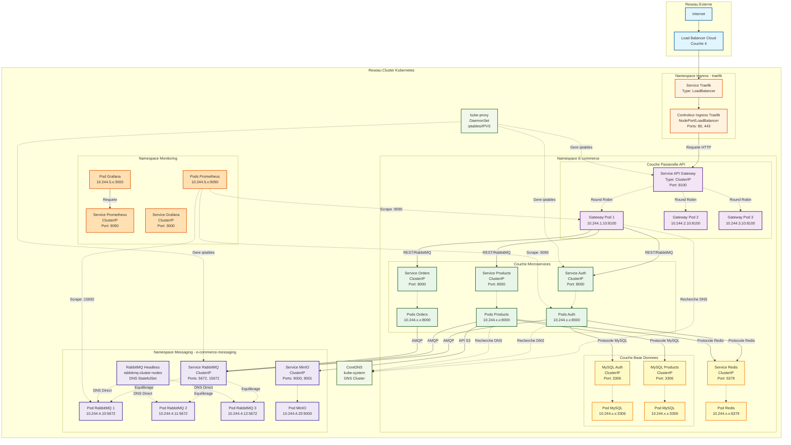

# Architecture Reseau - Kubernetes

## Table des Matieres

1. [Vue d'Ensemble](#vue-densemble)
2. [Diagramme Architecture Reseau](#diagramme-architecture-reseau)
3. [Couches Reseau](#couches-reseau)
4. [Decouverte Services](#decouverte-services)
5. [Politiques Reseau](#politiques-reseau)
6. [Equilibrage Charge](#equilibrage-charge)
7. [Resolution DNS](#resolution-dns)
8. [Considerations Service Mesh](#considerations-service-mesh)
9. [Securite Reseau](#securite-reseau)
10. [Exemples Flux Trafic](#exemples-flux-trafic)

---

## Vue d'Ensemble

Ce document detaille l'architecture reseau de la plateforme e-commerce sur Kubernetes. L'architecture implemente un modele reseau zero-trust avec regles d'autorisation explicites, decouverte de services et multiples couches d'equilibrage de charge.

### Exigences Reseau

- **Isolation** : Services communiquent uniquement avec points terminaison autorises
- **Securite** : Modele zero-trust avec politiques deny-all par defaut
- **Scalabilite** : Decouverte services et equilibrage charge efficaces
- **Observabilite** : Surveillance et tracage trafic reseau
- **Performance** : Communication service-a-service faible latence

---

## Diagramme Architecture Reseau



---

## Couches Reseau

### Couche 1 : Reseau Externe

**Composants :**
- Trafic Internet
- Load balancer fournisseur cloud (si applicable)
- Resolution DNS vers cluster

**Responsabilites :**
- Router trafic externe vers cluster Kubernetes
- Fournir adresses IP externes
- Protection DDoS (niveau fournisseur cloud)

### Couche 2 : Couche Ingress

**Composants :**
- Controleur Ingress Traefik
- Type service : LoadBalancer ou NodePort

**Flux Trafic :**
1. Requete externe arrive sur IP load balancer
2. Routee vers service Traefik (NodePort 30080/30443 ou LoadBalancer)
3. Traefik termine SSL/TLS
4. Route base sur regles host/path vers services backend

**Configuration Service :**
```yaml
apiVersion: v1
kind: Service
metadata:
  name: traefik
  namespace: traefik
spec:
  type: LoadBalancer  # ou NodePort
  ports:
  - name: web
    port: 80
    targetPort: 8000
  - name: websecure
    port: 443
    targetPort: 8443
  selector:
    app: traefik
```

### Couche 3 : Couche Passerelle API

**Composants :**
- Service Passerelle API (ClusterIP)
- Multiples pods passerelle (3+ repliques)

**Configuration Reseau :**
- Type Service : ClusterIP
- Port : 8100 (HTTP)
- DNS Interne : api-gateway.e-commerce.svc.cluster.local

**Modele Trafic :**
- Ingress → Service API Gateway → Round-robin vers Pods Gateway
- Pods Gateway → Microservices (via RabbitMQ pour async, HTTP direct pour sync)

### Couche 4 : Couche Microservices

**Composants :**
- 13 microservices
- Chacun avec service ClusterIP
- Multiples pods par service (2-10 repliques)

**Configuration Reseau :**
- Type Service : ClusterIP (interne uniquement)
- Port : 8000 (HTTP)
- Port Metriques : 9090 (Prometheus)

**Nommage Service :**
- auth-service.e-commerce.svc.cluster.local
- products-service.e-commerce.svc.cluster.local
- orders-service.e-commerce.svc.cluster.local
- etc.

### Couche 5 : Couche Donnees

**Composants :**
- 11 bases donnees MySQL
- Cache Redis
- Chacun avec service ClusterIP

**Configuration Reseau :**

**Services MySQL :**
- Type Service : ClusterIP
- Port : 3306
- DNS Interne : {service}-mysql.e-commerce.svc.cluster.local

**Service Redis :**
- Type Service : ClusterIP
- Port : 6379
- DNS Interne : redis.e-commerce.svc.cluster.local

### Couche 6 : Couche Messaging

**Composants :**
- Cluster RabbitMQ (3 repliques)
- Stockage objets MinIO

**Configuration Reseau :**

**RabbitMQ :**
- Type Service : ClusterIP
- Ports : 5672 (AMQP), 15672 (Management), 15692 (Metriques)
- DNS Interne : rabbitmq-cluster.e-commerce-messaging.svc.cluster.local
- Service Headless : Pour communication pod-a-pod StatefulSet

**MinIO :**
- Type Service : ClusterIP
- Ports : 9000 (API), 9001 (Console)
- DNS Interne : minio.e-commerce-messaging.svc.cluster.local

---

## Decouverte Services

### CoreDNS

**Service DNS Kubernetes :**
- Execute dans namespace kube-system
- Cree automatiquement enregistrements DNS pour tous services
- Pods interrogent CoreDNS pour resolution services

**Format Enregistrement DNS :**

```
{service-name}.{namespace}.svc.{cluster-domain}
```

**Exemples :**
```
auth-service.e-commerce.svc.cluster.local          → 10.96.1.10 (ClusterIP)
products-service.e-commerce.svc.cluster.local      → 10.96.1.20 (ClusterIP)
rabbitmq-cluster.e-commerce-messaging.svc.cluster.local → 10.96.2.10 (ClusterIP)
```

### Types Services

#### ClusterIP (Defaut)

**Objectif :** Acces service interne uniquement

**Caracteristiques :**
- IP virtuelle assignee depuis CIDR cluster (ex. 10.96.0.0/12)
- Accessible uniquement dans cluster
- Enregistrement DNS cree automatiquement
- Regles iptables/IPVS pour equilibrage charge

**Utilisation :**
- Tous microservices
- Bases donnees
- Composants infrastructure internes

**Exemple :**
```yaml
apiVersion: v1
kind: Service
metadata:
  name: auth-service
  namespace: e-commerce
spec:
  type: ClusterIP
  selector:
    app: auth-service
  ports:
  - name: http
    port: 8000
    targetPort: 8000
```

#### Service Headless

**Objectif :** Communication directe pod-a-pod (StatefulSets)

**Caracteristiques :**
- ClusterIP : None
- DNS retourne IPs pods directement, pas IP service
- Chaque pod obtient son propre enregistrement DNS

**Utilisation :**
- Cluster RabbitMQ (StatefulSet)
- Clusters base donnees (futur)

**Enregistrements DNS :**
```
rabbitmq-cluster-0.rabbitmq-cluster-nodes.e-commerce-messaging.svc.cluster.local
rabbitmq-cluster-1.rabbitmq-cluster-nodes.e-commerce-messaging.svc.cluster.local
rabbitmq-cluster-2.rabbitmq-cluster-nodes.e-commerce-messaging.svc.cluster.local
```

**Exemple :**
```yaml
apiVersion: v1
kind: Service
metadata:
  name: rabbitmq-cluster-nodes
  namespace: e-commerce-messaging
spec:
  clusterIP: None  # Headless
  selector:
    app.kubernetes.io/name: rabbitmq-cluster
  ports:
  - name: amqp
    port: 5672
  - name: clustering
    port: 25672
```

#### NodePort

**Objectif :** Acces externe via IPs noeuds

**Caracteristiques :**
- Alloue port sur chaque noeud (plage 30000-32767)
- Trafic vers NodeIP:NodePort → Service → Pods

**Utilisation :**
- Acces ingress developpement/tests
- Alternative LoadBalancer dans configurations on-premise

#### LoadBalancer

**Objectif :** Integration load balancer fournisseur cloud

**Caracteristiques :**
- Provisionne load balancer externe (AWS ELB, GCP LB, Azure LB)
- IP externe assignee
- Combine avec NodePort en interne

**Utilisation :**
- Controleur ingress Traefik (production)
- Exposition service directe (rare)

---

## Politiques Reseau

### Modele Zero-Trust

**Par defaut :** Refuser tout trafic ingress et egress

```yaml
apiVersion: networking.k8s.io/v1
kind: NetworkPolicy
metadata:
  name: deny-all-default
  namespace: e-commerce
spec:
  podSelector: {}
  policyTypes:
  - Ingress
  - Egress
```

### Categories Politiques

#### 1. Resolution DNS (Autoriser Tous Pods)

```yaml
apiVersion: networking.k8s.io/v1
kind: NetworkPolicy
metadata:
  name: allow-dns
  namespace: e-commerce
spec:
  podSelector: {}
  policyTypes:
  - Egress
  egress:
  - to: []  # Toute destination
    ports:
    - protocol: UDP
      port: 53
    - protocol: TCP
      port: 53
```

**Objectif :** Tous pods peuvent resoudre noms DNS

#### 2. Ingress Passerelle API (Depuis Traefik)

```yaml
apiVersion: networking.k8s.io/v1
kind: NetworkPolicy
metadata:
  name: allow-api-gateway-ingress
  namespace: e-commerce
spec:
  podSelector:
    matchLabels:
      app: api-gateway
  policyTypes:
  - Ingress
  ingress:
  - from:
    - namespaceSelector:
        matchLabels:
          name: traefik
    ports:
    - protocol: TCP
      port: 8100
  - from:
    - namespaceSelector:
        matchLabels:
          name: monitoring
    ports:
    - protocol: TCP
      port: 9090
```

**Objectif :** Passerelle API accepte trafic uniquement depuis Traefik et monitoring

#### 3. Egress Passerelle API (Vers Microservices)

```yaml
apiVersion: networking.k8s.io/v1
kind: NetworkPolicy
metadata:
  name: allow-api-gateway-egress
  namespace: e-commerce
spec:
  podSelector:
    matchLabels:
      app: api-gateway
  policyTypes:
  - Egress
  egress:
  - to:
    - podSelector:
        matchLabels:
          component: microservice
    ports:
    - protocol: TCP
      port: 8000
  - to:
    - namespaceSelector:
        matchLabels:
          name: e-commerce-messaging
      podSelector:
        matchLabels:
          app.kubernetes.io/name: rabbitmq-cluster
    ports:
    - protocol: TCP
      port: 5672
```

**Objectif :** Gateway peut communiquer avec microservices et RabbitMQ

#### 4. Microservices vers Bases Donnees

```yaml
apiVersion: networking.k8s.io/v1
kind: NetworkPolicy
metadata:
  name: allow-microservices-database
  namespace: e-commerce
spec:
  podSelector:
    matchLabels:
      component: microservice
  policyTypes:
  - Egress
  egress:
  - to:
    - podSelector:
        matchLabels:
          component: database
    ports:
    - protocol: TCP
      port: 3306  # MySQL
  - to:
    - podSelector:
        matchLabels:
          app: redis
    ports:
    - protocol: TCP
      port: 6379  # Redis
```

**Objectif :** Microservices peuvent acceder bases donnees et cache

#### 5. Microservices vers RabbitMQ

```yaml
apiVersion: networking.k8s.io/v1
kind: NetworkPolicy
metadata:
  name: allow-microservices-rabbitmq
  namespace: e-commerce
spec:
  podSelector:
    matchLabels:
      component: microservice
  policyTypes:
  - Egress
  egress:
  - to:
    - namespaceSelector:
        matchLabels:
          name: e-commerce-messaging
      podSelector:
        matchLabels:
          app.kubernetes.io/name: rabbitmq-cluster
    ports:
    - protocol: TCP
      port: 5672
```

**Objectif :** Microservices peuvent publier/consommer messages

#### 6. Scraping Surveillance

```yaml
apiVersion: networking.k8s.io/v1
kind: NetworkPolicy
metadata:
  name: allow-monitoring-scraping
  namespace: e-commerce
spec:
  podSelector: {}
  policyTypes:
  - Ingress
  ingress:
  - from:
    - namespaceSelector:
        matchLabels:
          name: monitoring
    ports:
    - protocol: TCP
      port: 9090  # Point terminaison metriques
```

**Objectif :** Prometheus peut scraper metriques de tous services

### Points Application Politique

**Regles Ingress :**
- Qui peut envoyer trafic VERS ce pod ?
- Specifier namespaces et pods sources
- Specifier ports autorises

**Regles Egress :**
- Ou ce pod peut-il envoyer trafic VERS ?
- Specifier namespaces et pods destination
- Specifier ports autorises

**Bonnes Pratiques :**
- Commencer avec deny-all
- Ajouter regles allow specifiques
- Documenter objectif de chaque politique
- Tester politiques d'abord en staging
- Utiliser labels pour selection flexible

---

## Equilibrage Charge

### Niveau 1 : Load Balancer Externe

**Type :** Fournisseur cloud (AWS ELB, GCP LB, Azure LB)

**Caracteristiques :**
- Couche 4 (TCP/UDP) ou Couche 7 (HTTP/HTTPS)
- Verifications sante vers noeuds Kubernetes
- Terminaison SSL/TLS (optionnel)
- Protection DDoS

**Configuration :**
```yaml
apiVersion: v1
kind: Service
metadata:
  name: traefik
  namespace: traefik
  annotations:
    service.beta.kubernetes.io/aws-load-balancer-type: "nlb"
    service.beta.kubernetes.io/aws-load-balancer-cross-zone-load-balancing-enabled: "true"
spec:
  type: LoadBalancer
  externalTrafficPolicy: Local  # Preserver IP source
  ports:
  - name: web
    port: 80
  - name: websecure
    port: 443
```

### Niveau 2 : Controleur Ingress (Traefik)

**Type :** Load balancer niveau application (Couche 7)

**Capacites :**
- Routage base sur host (api.example.com → API Gateway)
- Routage base sur path (/api/v1/* → API Gateway)
- Terminaison SSL/TLS avec gestion certificats automatique
- Limitation debit et circuit breaking
- Algorithmes equilibrage charge : Round Robin, Weighted Round Robin

**Configuration :**
```yaml
apiVersion: networking.k8s.io/v1
kind: Ingress
metadata:
  name: api-gateway-ingress
  namespace: e-commerce
  annotations:
    traefik.ingress.kubernetes.io/router.entrypoints: websecure
    traefik.ingress.kubernetes.io/router.tls: "true"
    cert-manager.io/cluster-issuer: letsencrypt-prod
spec:
  ingressClassName: traefik
  tls:
  - hosts:
    - api.yourdomain.com
    secretName: api-tls-cert
  rules:
  - host: api.yourdomain.com
    http:
      paths:
      - path: /
        pathType: Prefix
        backend:
          service:
            name: api-gateway
            port:
              number: 8100
```

### Niveau 3 : Service Kubernetes (ClusterIP)

**Type :** Load balancer interne (Couche 4)

**Mecanisme :** kube-proxy + iptables/IPVS

**Algorithmes :**
- **Round Robin** (defaut) : Distribution egale vers tous pods
- **Affinite Session** : Router depuis meme IP client vers meme pod

**Comment ca fonctionne :**
1. Service assigne ClusterIP (IP virtuelle)
2. kube-proxy surveille points terminaison service (IPs pods)
3. Cree regles iptables/IPVS pour equilibrage charge
4. Trafic vers ClusterIP distribue vers IPs pods

**Exemple Affinite Session :**
```yaml
apiVersion: v1
kind: Service
metadata:
  name: auth-service
spec:
  sessionAffinity: ClientIP
  sessionAffinityConfig:
    clientIP:
      timeoutSeconds: 3600
  selector:
    app: auth-service
  ports:
  - port: 8000
```

### Niveau 4 : Equilibrage Charge Niveau Application

**Client RabbitMQ :**
- Connexion cluster RabbitMQ
- Bibliotheque client gere echecs noeuds
- Reconnexion automatique

**Exemple (PHP) :**
```php
$connection = new AMQPStreamConnection(
    ['rabbitmq-cluster-0', 'rabbitmq-cluster-1', 'rabbitmq-cluster-2'],
    5672,
    'guest',
    'guest'
);
```

---

## Resolution DNS

### Configuration CoreDNS

**Emplacement :** namespace kube-system

**Corefile :**
```
.:53 {
    errors
    health {
       lameduck 5s
    }
    ready
    kubernetes cluster.local in-addr.arpa ip6.arpa {
       pods insecure
       fallthrough in-addr.arpa ip6.arpa
       ttl 30
    }
    prometheus :9153
    forward . /etc/resolv.conf {
       max_concurrent 1000
    }
    cache 30
    loop
    reload
    loadbalance
}
```

### Flux Requete DNS

**Exemple :** Pod doit se connecter a auth-service

1. **Configuration DNS Pod :**
   - nameserver : 10.96.0.10 (ClusterIP CoreDNS)
   - search : e-commerce.svc.cluster.local svc.cluster.local cluster.local

2. **Processus Requete :**
   ```
   Pod → Requete "auth-service"
   → CoreDNS ajoute domaine recherche → "auth-service.e-commerce.svc.cluster.local"
   → CoreDNS recherche service → Retourne ClusterIP 10.96.1.10
   → Pod se connecte a 10.96.1.10:8000
   → iptables kube-proxy route vers IP pod
   ```

3. **Enregistrement DNS Pod :**
   ```
   10-244-1-15.e-commerce.pod.cluster.local → 10.244.1.15 (IP Pod)
   ```

### Cache DNS

**Parametres TTL :**
- Enregistrements service : 30 secondes
- Enregistrements pod : 30 secondes
- Recherches externes : Transmises au DNS amont

**Avantages Cache :**
- Reduit charge CoreDNS
- Resolution plus rapide pour requetes frequentes
- Configurable par type requete

---

## Considerations Service Mesh

### Etat Actuel

**Pas de Service Mesh Deploye**

**Capacites Fournies par Kubernetes :**
- Decouverte services via CoreDNS
- Equilibrage charge via kube-proxy
- Politiques reseau pour securite

**Limitations :**
- Pas mTLS automatique (mutual TLS) entre services
- Gestion trafic limitee (retries, timeouts, circuit breaking)
- Observabilite basique (necessite instrumentation application)

### Options Service Mesh Futures

#### Istio

**Avantages :**
- Ensemble fonctionnalites complet
- Gestion trafic robuste
- mTLS integre
- Observabilite avancee

**Inconvenients :**
- Configuration complexe
- Intensif en ressources
- Courbe apprentissage raide

#### Linkerd

**Avantages :**
- Leger
- Plus simple qu'Istio
- Bonne performance
- Plus facile a operer

**Inconvenients :**
- Moins fonctionnalites qu'Istio
- Moins integrations ecosysteme

#### Cilium Service Mesh

**Avantages :**
- Base eBPF (haute performance)
- Integre avec politiques reseau
- Overhead inferieur aux meshes sidecar

**Inconvenients :**
- Technologie plus recente
- Necessite versions kernel recentes

### Quand Adopter Service Mesh

**Considerer si :**
- Besoin mTLS automatique entre tous services
- Necessite gestion trafic avancee (canary, blue-green)
- Besoin observabilite detaillee service-a-service
- Implementation architecture zero-trust
- Gestion 20+ microservices

**Statut Actuel :**
- Plateforme fonctionne bien avec reseau Kubernetes natif
- Politiques reseau fournissent securite suffisante
- Observabilite niveau application via OpenTelemetry (futur)
- Service mesh peut etre ajoute plus tard sans refonte majeure

---

## Securite Reseau

### Couches Securite

#### 1. Securite Perimetre

**Regles Pare-feu :**
- Autoriser uniquement ports 80, 443 depuis internet
- Bloquer tout autre trafic entrant
- Autoriser sortant pour pulls images, DNS

**Protection DDoS :**
- Niveau fournisseur cloud
- Limitation debit au controleur ingress

#### 2. Securite Ingress

**Fonctionnalites Traefik :**
- Terminaison SSL/TLS avec chiffrements forts
- Redirection HTTP vers HTTPS
- En-tetes HSTS
- Limitation debit par IP
- Liste blanche IP (points terminaison admin)

**Gestion Certificats :**
- Cert-Manager pour certificats Let's Encrypt automatiques
- Renouvellement auto avant expiration
- Support certificats wildcard

#### 3. Politiques Reseau (Micro-segmentation)

**Principes :**
- Deny-all par defaut
- Regles allow explicites
- Isolation namespace
- Selection basee labels

**Avantages :**
- Reseau zero-trust
- Limiter rayon explosion compromissions
- Exigences conformite (PCI-DSS, RGPD)

#### 4. Securite Pod

**Standards Securite Pod :**
- Baseline : Securite basique
- Restricted : Hautement restreint (production)

**Application :**
```yaml
apiVersion: v1
kind: Namespace
metadata:
  name: e-commerce-prod
  labels:
    pod-security.kubernetes.io/enforce: restricted
    pod-security.kubernetes.io/audit: restricted
    pod-security.kubernetes.io/warn: restricted
```

**Exigences :**
- Pas conteneurs privilegies
- Pas host network/PID/IPC
- Utilisateur non-root
- Systeme fichiers racine lecture seule (si possible)
- Supprimer toutes capacites, ajouter uniquement requises

#### 5. Gestion Secrets

**Operateur External Secrets :**
- Secrets stockes dans HashiCorp Vault
- Synchronises vers secrets Kubernetes
- Rotation automatique
- Journalisation audit

**Jamais dans Git :**
- Secrets NE sont PAS dans depots Git
- Templates secrets uniquement
- Injectes au moment deploiement

#### 6. RBAC (Controle Acces Base Roles)

**Comptes Service :**
- Un par microservice
- Permissions minimales
- Pas montage token compte service par defaut

**Acces Humain :**
- Developpeur : Lecture seule dev/staging
- Operateur : Acces complet dev/staging, limite production
- Admin : Acces complet tous environnements

---

## Exemples Flux Trafic

### Exemple 1 : Connexion Client

**Requete Externe vers Service Auth :**

```
1. Client (Navigateur) → HTTPS → api.yourdomain.com/auth/login
   └─ DNS : api.yourdomain.com → IP Load Balancer (ex. 52.10.20.30)

2. Cloud Load Balancer (52.10.20.30:443)
   └─ Verification sante passe → Transmettre Service Traefik

3. Service Traefik (LoadBalancer/NodePort)
   └─ NodeIP:NodePort ou IP LoadBalancer → Pods Traefik

4. Controleur Ingress Traefik
   ├─ Terminer SSL/TLS
   ├─ Matcher regle ingress : host=api.yourdomain.com, path=/auth/*
   └─ Transmettre a : api-gateway.e-commerce.svc.cluster.local:8100

5. Resolution CoreDNS
   └─ api-gateway.e-commerce.svc.cluster.local → 10.96.1.5 (ClusterIP)

6. Service API Gateway (10.96.1.5:8100)
   ├─ Regles iptables kube-proxy
   └─ Round-robin vers pod : 10.244.1.10:8100

7. Pod API Gateway (10.244.1.10)
   ├─ Valider requete
   ├─ Router vers auth-service
   └─ Publier message RabbitMQ OU appel HTTP

8. RabbitMQ (Async) ou Auth Service (Sync)
   └─ auth-service.e-commerce.svc.cluster.local → 10.96.1.15

9. Pod Auth Service (10.244.2.20:8000)
   ├─ Traiter connexion
   ├─ Requete : auth-service-mysql.e-commerce.svc.cluster.local:3306
   └─ Cache session : redis.e-commerce.svc.cluster.local:6379

10. Reponse retour par chaine :
    Pod Auth → API Gateway → Traefik → Load Balancer → Client
```

### Exemple 2 : Scraping Metriques Prometheus

**Surveillance Services Internes :**

```
1. Pod Prometheus (10.244.5.10) dans namespace monitoring
   └─ Config scrape : http://auth-service.e-commerce.svc.cluster.local:9090/metrics

2. Resolution CoreDNS
   └─ auth-service.e-commerce.svc.cluster.local → 10.96.1.15

3. Verification Politique Reseau
   ├─ Source : namespace monitoring, pod Prometheus
   ├─ Destination : namespace e-commerce, port 9090
   └─ Politique : allow-monitoring-scraping → AUTORISER

4. Auth Service (10.96.1.15:9090)
   └─ kube-proxy → Round-robin vers pod : 10.244.2.20:9090

5. Pod Auth Service (10.244.2.20)
   └─ Retourner metriques format Prometheus

6. Prometheus
   └─ Stocker metriques en base donnees series temporelles
```

### Exemple 3 : Communication Cluster RabbitMQ

**Messaging Inter-Cluster :**

```
1. Pod RabbitMQ 1 (rabbitmq-cluster-0, 10.244.4.10)
   └─ Besoin sync avec autres membres cluster

2. Requete DNS Service Headless
   └─ rabbitmq-cluster-nodes.e-commerce-messaging.svc.cluster.local

3. CoreDNS Retourne Toutes IPs Pods
   ├─ rabbitmq-cluster-0.rabbitmq-cluster-nodes... → 10.244.4.10
   ├─ rabbitmq-cluster-1.rabbitmq-cluster-nodes... → 10.244.4.11
   └─ rabbitmq-cluster-2.rabbitmq-cluster-nodes... → 10.244.4.12

4. Pod RabbitMQ 1 se connecte directement Pods 2 et 3
   ├─ 10.244.4.10 → 10.244.4.11:25672 (port clustering)
   └─ 10.244.4.10 → 10.244.4.12:25672

5. Verification Politique Reseau
   ├─ Source : pod rabbitmq-cluster
   ├─ Destination : pod rabbitmq-cluster, port 25672
   └─ Politique : allow-rabbitmq-cluster → AUTORISER

6. Synchronisation Cluster
   └─ Replication queue quorum, election leader
```

---

## Depannage Reseau

### Problemes Courants

#### 1. Service Non Accessible

**Etapes Diagnostic :**
```bash
# Verifier service existe
kubectl get svc -n e-commerce auth-service

# Verifier points terminaison (pods derriere service)
kubectl get endpoints -n e-commerce auth-service

# Verifier statut pod
kubectl get pods -n e-commerce -l app=auth-service

# Tester resolution DNS depuis autre pod
kubectl run -it --rm debug --image=busybox --restart=Never -- nslookup auth-service.e-commerce.svc.cluster.local

# Tester connectivite
kubectl run -it --rm debug --image=busybox --restart=Never -- wget -O- http://auth-service.e-commerce.svc.cluster.local:8000/health
```

#### 2. Politique Reseau Bloquant Trafic

**Etapes Diagnostic :**
```bash
# Lister toutes politiques reseau namespace
kubectl get networkpolicies -n e-commerce

# Decrire politique specifique
kubectl describe networkpolicy allow-microservices-database -n e-commerce

# Verifier labels pods (politiques utilisent selecteurs)
kubectl get pods -n e-commerce --show-labels

# Retirer temporairement politique pour tests (PAS en production)
kubectl delete networkpolicy deny-all-default -n e-commerce
```

#### 3. Echecs Resolution DNS

**Etapes Diagnostic :**
```bash
# Verifier pods CoreDNS
kubectl get pods -n kube-system -l k8s-app=kube-dns

# Verifier logs CoreDNS
kubectl logs -n kube-system -l k8s-app=kube-dns

# Tester depuis pod
kubectl exec -it <pod-name> -n e-commerce -- nslookup kubernetes.default

# Verifier configuration DNS pod
kubectl exec -it <pod-name> -n e-commerce -- cat /etc/resolv.conf
```

#### 4. Load Balancer Ne Distribue Pas

**Etapes Diagnostic :**
```bash
# Verifier points terminaison service
kubectl get endpoints auth-service -n e-commerce

# Verifier logs kube-proxy
kubectl logs -n kube-system -l k8s-app=kube-proxy

# Verifier regles iptables (sur noeud)
sudo iptables-save | grep auth-service

# Tester requetes multiples
for i in {1..10}; do curl -s http://api-gateway.e-commerce.svc.cluster.local:8100/health | grep hostname; done
```

---

## Resume

L'architecture reseau de la plateforme e-commerce fournit :

- **Decouverte Services** : Decouverte services automatique basee DNS via CoreDNS
- **Equilibrage Charge** : Equilibrage charge multi-niveaux du fournisseur cloud au niveau pod
- **Securite** : Modele reseau zero-trust avec deny par defaut et politiques allow explicites
- **Isolation** : Isolation basee namespace et politique reseau
- **Scalabilite** : Communication service-a-service efficace avec overhead minimal
- **Observabilite** : Surveillance trafic reseau via Prometheus et potentiel service mesh

L'architecture equilibre simplicite et securite, fournissant reseau pret production sans overhead d'un service mesh, tout en maintenant capacite d'en adopter un dans futur si exigences evoluent.
