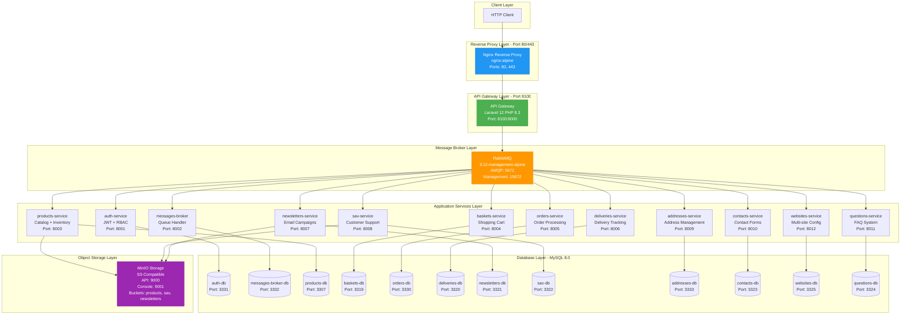

# Docker Compose Architecture Documentation

## Table of Contents

1. [Overview](#overview)
2. [Architecture Diagram](#architecture-diagram)
3. [Container Inventory](#container-inventory)
4. [Service Configuration Details](#service-configuration-details)
5. [Networking Architecture](#networking-architecture)
6. [Volumes and Persistence](#volumes-and-persistence)
7. [Development with Docker Watch](#development-with-docker-watch)
8. [Nginx Reverse Proxy Configuration](#nginx-reverse-proxy-configuration)
9. [Dockerfile Structure](#dockerfile-structure)
10. [Environment Variables](#environment-variables)
11. [Common Commands](#common-commands)

## Overview

### Infrastructure Summary

The e-commerce platform runs on Docker Compose with a fully asynchronous microservices architecture. All service communication flows through RabbitMQ message broker, ensuring complete decoupling and asynchronous processing.

**Total Container Count**: 27
- 13 Laravel Application Services
- 11 MySQL Database Containers
- 1 RabbitMQ Message Broker (with management UI)
- 1 MinIO Object Storage Server
- 1 Nginx Reverse Proxy

**Network**: Bridge network `microservices-network` for internal service communication

**Volumes**: 13 persistent volumes for databases and stateful services

### Communication Flow

```
Client Request
    |
    v
Nginx (ports 80/443)
    |
    v
API Gateway (port 8100)
    |
    v
RabbitMQ (ports 5672/15672)
    |
    v
Microservices (async processing)
    |
    |-- MySQL Databases (isolated per service)
    |-- MinIO Storage (products, sav, newsletters)
    v
Response via RabbitMQ
```

All HTTP requests enter through Nginx, which routes to API Gateway. The gateway orchestrates service communication via RabbitMQ exchanges and queues, enabling true asynchronous processing.

## Architecture Diagram



## Container Inventory

### Complete Container List (27 Total)

| Category | Container Name | Image | Internal Port | External Port | Purpose |
|----------|---------------|-------|---------------|---------------|---------|
| **Reverse Proxy** |
| Proxy | nginx | nginx:alpine | 80, 443 | 80, 443 | HTTP/HTTPS entry point |
| **Core Services** |
| Gateway | api-gateway | custom/php:8.3-fpm | 8000 | 8100 | Single API entry point |
| Auth | auth-service | custom/php:8.3-fpm | 8001 | - | JWT authentication + RBAC |
| Broker | messages-broker | custom/php:8.3-fpm | 8002 | - | RabbitMQ message handler |
| **Business Services** |
| Products | products-service | custom/php:8.3-fpm | 8003 | - | Product catalog + inventory |
| Baskets | baskets-service | custom/php:8.3-fpm | 8004 | - | Shopping cart management |
| Orders | orders-service | custom/php:8.3-fpm | 8005 | - | Order processing |
| Deliveries | deliveries-service | custom/php:8.3-fpm | 8006 | - | Delivery tracking |
| Newsletters | newsletters-service | custom/php:8.3-fpm | 8007 | - | Email campaigns |
| SAV | sav-service | custom/php:8.3-fpm | 8008 | - | Customer support tickets |
| Addresses | addresses-service | custom/php:8.3-fpm | 8009 | - | Address validation |
| Contacts | contacts-service | custom/php:8.3-fpm | 8010 | - | Contact form handling |
| Questions | questions-service | custom/php:8.3-fpm | 8011 | - | FAQ system |
| Websites | websites-service | custom/php:8.3-fpm | 8012 | - | Multi-site configuration |
| **Databases** |
| Auth DB | auth-db | mysql:8.0 | 3306 | 3331 | auth_service_db |
| Broker DB | messages-broker-db | mysql:8.0 | 3306 | 3332 | messages_broker |
| Products DB | products-db | mysql:8.0 | 3306 | 3307 | products_service_db |
| Baskets DB | baskets-db | mysql:8.0 | 3306 | 3319 | baskets_service_db |
| Orders DB | orders-db | mysql:8.0 | 3306 | 3330 | orders_service_db |
| Deliveries DB | deliveries-db | mysql:8.0 | 3306 | 3320 | deliveries_service_db |
| Newsletters DB | newsletters-db | mysql:8.0 | 3306 | 3321 | newsletters_service_db |
| SAV DB | sav-db | mysql:8.0 | 3306 | 3322 | sav_service_db |
| Addresses DB | addresses-db | mysql:8.0 | 3306 | 3333 | addresses_service |
| Contacts DB | contacts-db | mysql:8.0 | 3306 | 3323 | contacts_service_db |
| Websites DB | websites-db | mysql:8.0 | 3306 | 3325 | websites_service_db |
| Questions DB | questions-db | mysql:8.0 | 3306 | 3324 | questions_service_db |
| **Infrastructure** |
| Message Queue | rabbitmq | rabbitmq:3.12-management-alpine | 5672, 15672 | 5672, 15672 | AMQP + Management UI |
| Object Storage | minio | minio/minio:latest | 9000, 9001 | 9000, 9001 | S3-compatible storage |

## Service Configuration Details

### API Gateway

**Container**: `api-gateway`
**Build Context**: `./services/api-gateway/Dockerfile`
**Ports**: `8100:8000` (external:internal)

**Environment Variables**:
```bash
APP_ENV=local
CONTAINER_ROLE=app
RABBITMQ_HOST=rabbitmq
RABBITMQ_PORT=5672
RABBITMQ_USER=guest
RABBITMQ_PASSWORD=guest
RABBITMQ_VHOST=/

# Service URLs (internal Docker network)
AUTH_SERVICE_URL=http://auth-service:8001
ADDRESSES_SERVICE_URL=http://addresses-service:8009
PRODUCTS_SERVICE_URL=http://products-service:8003
BASKETS_SERVICE_URL=http://baskets-service:8005
ORDERS_SERVICE_URL=http://orders-service:8004
DELIVERIES_SERVICE_URL=http://deliveries-service:8006
NEWSLETTERS_SERVICE_URL=http://newsletters-service:8007
SAV_SERVICE_URL=http://sav-service:8008
MESSAGES_BROKER_URL=http://messages-broker:8002
```

**Volumes**:
- `./services/api-gateway:/var/www/api-gateway` (source code bind mount)
- `/var/www/api-gateway/vendor` (anonymous volume for dependencies)

**Dependencies**: `rabbitmq`

**Watch Configuration**:
```yaml
- action: sync          # Hot-reload on file changes
  path: services/api-gateway
  target: /var/www/api-gateway
  ignore: [vendor/]

- action: rebuild       # Rebuild on dependency changes
  path: services/api-gateway/composer.json
```

### Auth Service

**Container**: `auth-service`
**Build Context**: `./services/auth-service/Dockerfile`
**Internal Port**: `8001`

**Environment Variables**:
```bash
APP_ENV=local
CONTAINER_ROLE=app
DB_HOST=auth-db            # Database-per-service pattern
```

**Volumes**:
- `./services/auth-service:/var/www/auth-service`
- `/var/www/auth-service/vendor`

**Dependencies**: `auth-db`

**Database**: `auth-db`
- Image: `mysql:8.0`
- Database: `auth_service_db`
- Root Password: `root`
- External Port: `3331:3306`

### Products Service

**Container**: `products-service`
**Build Context**: `./services/products-service/Dockerfile`
**Internal Port**: `8003`

**Environment Variables**:
```bash
APP_ENV=local
CONTAINER_ROLE=app
DB_HOST=products-db

# MinIO Configuration
MINIO_ENDPOINT=minio:9000
MINIO_ACCESS_KEY=admin
MINIO_SECRET_KEY=adminpass123
MINIO_BUCKET=products
MINIO_USE_SSL=false
```

**Volumes**:
- `./services/products-service:/var/www/products-service`
- `./shared:/var/www/shared` (shared library)
- `/var/www/products-service/vendor`

**Dependencies**: `products-db`, `minio`

**Database**: `products-db`
- External Port: `3307:3306`

### SAV Service (Customer Support)

**Container**: `sav-service`
**Build Context**: `./services/sav-service/Dockerfile`
**Internal Port**: `8008`

**Environment Variables**:
```bash
APP_ENV=local
CONTAINER_ROLE=app
DB_HOST=sav-db

# RabbitMQ Configuration
RABBITMQ_HOST=rabbitmq
RABBITMQ_PORT=5672
RABBITMQ_USER=guest
RABBITMQ_PASSWORD=guest
RABBITMQ_VHOST=/
RABBITMQ_EXCHANGE=sav_exchange
RABBITMQ_QUEUE=sav_queue

# MinIO Configuration
MINIO_ENDPOINT=minio:9000
MINIO_ACCESS_KEY=admin
MINIO_SECRET_KEY=adminpass123
MINIO_BUCKET=sav
MINIO_USE_SSL=false
```

**Volumes**:
- `./services/sav-service:/var/www/sav-service`
- `./shared:/var/www/shared`
- `/var/www/sav-service/vendor`

**Dependencies**: `sav-db`, `rabbitmq`, `minio`

**Database**: `sav-db`
- External Port: `3322:3306`
- Persistent Volume: `sav-db-data`

### Newsletters Service

**Container**: `newsletters-service`
**Build Context**: `./services/newsletters-service/Dockerfile`
**Internal Port**: `8007`

**Environment Variables**:
```bash
APP_ENV=local
CONTAINER_ROLE=app
DB_HOST=newsletters-db

# RabbitMQ Configuration
RABBITMQ_HOST=rabbitmq
RABBITMQ_PORT=5672
RABBITMQ_USER=guest
RABBITMQ_PASSWORD=guest
RABBITMQ_VHOST=/

# MinIO Configuration
MINIO_ENDPOINT=minio:9000
MINIO_ACCESS_KEY=admin
MINIO_SECRET_KEY=adminpass123
MINIO_BUCKET=newsletters
MINIO_USE_SSL=false
```

**Volumes**:
- `./services/newsletters-service:/var/www/newsletters-service`
- `./shared:/var/www/shared`
- `/var/www/newsletters-service/vendor`

**Dependencies**: `newsletters-db`, `rabbitmq`, `minio`

**Database**: `newsletters-db`
- External Port: `3321:3306`
- Persistent Volume: `newsletters-db-data`

### RabbitMQ Message Broker

**Container**: `rabbitmq`
**Image**: `rabbitmq:3.12-management-alpine`
**Restart Policy**: `unless-stopped`

**Ports**:
- `5672:5672` (AMQP protocol)
- `15672:15672` (Management UI)

**Environment Variables**:
```bash
RABBITMQ_DEFAULT_USER=guest
RABBITMQ_DEFAULT_PASS=guest
RABBITMQ_DEFAULT_VHOST=/
```

**Volume**: `rabbitmq-data:/var/lib/rabbitmq`

**Management UI**: http://localhost:15672 (guest/guest)

### MinIO Object Storage

**Container**: `minio`
**Image**: `minio/minio:latest`
**Container Name**: `minio-storage`
**Restart Policy**: `unless-stopped`

**Ports**:
- `9000:9000` (S3-compatible API)
- `9001:9001` (Web Console)

**Environment Variables**:
```bash
MINIO_ROOT_USER=admin
MINIO_ROOT_PASSWORD=adminpass123
```

**Volume**: `minio-data:/data`

**Command**: `server /data --console-address ":9001"`

**Health Check**:
```bash
test: ["CMD", "curl", "-f", "http://localhost:9000/minio/health/live"]
interval: 30s
timeout: 20s
retries: 3
```

**Buckets**:
- `products` - Product images and media
- `sav` - Support ticket attachments
- `newsletters` - Email campaign templates and assets

**Console**: http://localhost:9001 (admin/adminpass123)

### Nginx Reverse Proxy

**Container**: `nginx`
**Image**: `nginx:alpine`

**Ports**:
- `80:80` (HTTP)
- `443:443` (HTTPS)

**Volumes**:
- `./docker/nginx/conf.d:/etc/nginx/conf.d` (configuration)
- Service source mounts for static assets

**Dependencies**: All application services

**Watch Configuration**:
```yaml
- action: sync
  path: docker/nginx/conf.d
  target: /etc/nginx/conf.d
```

## Networking Architecture

### Bridge Network

**Network Name**: `microservices-network`
**Driver**: `bridge`

All containers connect to this single bridge network, enabling:
- Internal DNS resolution via container names
- Service discovery without hardcoded IPs
- Network isolation from host

### Internal DNS

Docker's embedded DNS server resolves container names:

```bash
# From any container:
ping rabbitmq              # resolves to RabbitMQ container IP
ping products-service      # resolves to products-service container IP
ping auth-db              # resolves to auth-db container IP
```

### Port Mapping Strategy

**External Ports** (host machine access):
```
80, 443         - Nginx (HTTP/HTTPS)
8100            - API Gateway
5672, 15672     - RabbitMQ (AMQP + Management)
9000, 9001      - MinIO (API + Console)
3307-3333       - MySQL databases (debugging only)
```

**Internal Ports** (container-to-container):
```
8000-8012       - Application services
3306            - MySQL (standard port, isolated per container)
```

### Communication Patterns

**Client to API**:
```
External Client -> Nginx:80 -> API Gateway:8000
```

**Service to Service** (via RabbitMQ):
```
Service A -> RabbitMQ:5672 (publish) -> Exchange -> Queue -> Service B (consume)
```

**Service to Database**:
```
auth-service -> auth-db:3306 (internal network)
```

**Service to MinIO**:
```
products-service -> minio:9000 (S3 API)
```

## Volumes and Persistence

### Named Volumes (13 Total)

All named volumes use Docker's default `local` driver:

```yaml
volumes:
  # Database Volumes
  auth-db-data:          # Auth service database
  addresses-db-data:     # Addresses service database
  products-db-data:      # Products service database
  baskets-db-data:       # Baskets service database
  orders-db-data:        # Orders service database
  deliveries-db-data:    # Deliveries service database
  newsletters-db-data:   # Newsletters service database
  sav-db-data:          # SAV service database
  contacts-db-data:      # Contacts service database
  websites-db-data:      # Websites service database
  questions-db-data:     # Questions service database

  # Infrastructure Volumes
  rabbitmq-data:         # RabbitMQ messages and state
  minio-data:           # MinIO object storage buckets
```

### Bind Mounts (Development)

Source code directories are mounted for hot-reload during development:

```yaml
# Example: Products Service
volumes:
  - ./services/products-service:/var/www/products-service  # Source code
  - ./shared:/var/www/shared                              # Shared library
  - /var/www/products-service/vendor                      # Anonymous volume
```

**Anonymous Volumes**: Protect `vendor/` directories from being overwritten by host bind mounts, preserving container-installed dependencies.

### Persistence Guarantees

**Databases**: All MySQL databases use named volumes ensuring data survives container recreation:
```bash
docker-compose down      # Data preserved in volumes
docker-compose up        # Data restored from volumes
```

**Object Storage**: MinIO data persists in `minio-data` volume:
```bash
docker volume inspect e-commerce-back_minio-data
```

**Message Queue**: RabbitMQ state and messages persist in `rabbitmq-data`.

## Development with Docker Watch

### Watch Feature Overview

Docker Compose Watch enables automatic synchronization and rebuilding during development, eliminating manual container restarts.

### Strategy: Sync

**Purpose**: Hot-reload source code changes
**Trigger**: File modifications in watched paths
**Action**: Files instantly synced to container

**Example** (Auth Service):
```yaml
develop:
  watch:
    - action: sync
      path: services/auth-service
      target: /var/www/auth-service
      ignore:
        - vendor/
```

**Effect**: Edit `services/auth-service/app/Http/Controllers/AuthController.php` on host, changes immediately available in container without restart.

### Strategy: Rebuild

**Purpose**: Rebuild container on dependency changes
**Trigger**: Changes to `composer.json`
**Action**: Full image rebuild and container recreation

**Example**:
```yaml
develop:
  watch:
    - action: rebuild
      path: services/auth-service/composer.json
```

**Effect**: Install new Composer package, watch automatically rebuilds the service image.

### Starting Watch Mode

**Command**:
```bash
docker-compose up --watch

# Or via Makefile:
make dev
```

**Benefits**:
- Real-time code synchronization
- No manual container restarts
- Automatic dependency management
- Improved development workflow efficiency

**Output**:
```
[+] Running watch for [auth-service products-service ...]
Syncing "services/auth-service" to "/var/www/auth-service"
File changed: app/Http/Controllers/AuthController.php
Synced in 23ms
```

## Nginx Reverse Proxy Configuration

### Configuration File

**Location**: `./docker/nginx/conf.d/default.conf`

### Upstream Definition

```nginx
upstream api_gateway {
    server api-gateway:8000;
}
```

Defines backend target using Docker DNS (`api-gateway` resolves to container IP).

### Server Block

```nginx
server {
    listen 80;
    server_name localhost;

    # All requests route through API Gateway
    # Gateway orchestrates service communication via RabbitMQ

    # ... location blocks
}
```

### Location Blocks

**V1 API Routes** (exact match):
```nginx
location /v1/ {
    proxy_pass http://api_gateway/v1/;
    proxy_set_header Host $host;
    proxy_set_header X-Real-IP $remote_addr;
    proxy_set_header X-Forwarded-For $proxy_add_x_forwarded_for;
    proxy_set_header X-Forwarded-Proto $scheme;
    proxy_set_header X-Request-ID $request_id;
}
```

**API Routes** (strip `/api/` prefix):
```nginx
location /api/ {
    proxy_pass http://api_gateway/v1/;
    proxy_set_header Host $host;
    proxy_set_header X-Real-IP $remote_addr;
    proxy_set_header X-Forwarded-For $proxy_add_x_forwarded_for;
    proxy_set_header X-Forwarded-Proto $scheme;
    proxy_set_header X-Request-ID $request_id;
}
```

**Root Redirect**:
```nginx
location / {
    return 301 /api/;
}
```

### Request Flow

```
GET http://localhost/api/auth/login
    |
    v
Nginx receives request
    |
    v
Matches /api/ location
    |
    v
Rewrites to /v1/auth/login
    |
    v
Proxies to api-gateway:8000/v1/auth/login
    |
    v
Sets headers: Host, X-Real-IP, X-Forwarded-For, X-Request-ID
    |
    v
API Gateway processes via RabbitMQ
    |
    v
Response returned through proxy chain
```

### Custom Headers

**X-Request-ID**: Unique identifier for request tracing across services
**X-Real-IP**: Original client IP address
**X-Forwarded-For**: Chain of proxy IPs
**X-Forwarded-Proto**: Original request protocol (http/https)

## Dockerfile Structure

### Base Configuration

All service Dockerfiles follow a multi-stage pattern using PHP 8.3 FPM as base:

```dockerfile
FROM php:8.3-fpm AS base

ARG BUILD_DATE
ARG VCS_REF
ENV SERVICE_NAME=auth-service

LABEL maintainer="DevOps Team <devops@yourcompany.com>" \
      org.label-schema.name="auth-service" \
      org.label-schema.description="E-commerce Authentication Service" \
      org.label-schema.build-date="${BUILD_DATE}" \
      org.label-schema.vcs-ref="${VCS_REF}"
```

### System Dependencies

```dockerfile
RUN apt-get update && apt-get install -y \
    git curl libpng-dev libxml2-dev zip unzip default-mysql-client \
    nginx supervisor libonig-dev libfreetype6-dev libjpeg62-turbo-dev \
    libzip-dev libicu-dev build-essential netcat-traditional \
    && rm -rf /var/lib/apt/lists/*
```

**Installed Packages**:
- `git`, `curl`, `zip`, `unzip` - Version control and archiving
- `default-mysql-client` - MySQL CLI tools
- `nginx` - Web server
- `supervisor` - Process manager
- `lib*-dev` - PHP extension dependencies
- `netcat-traditional` - Network debugging

### PHP Extensions

```dockerfile
RUN docker-php-ext-configure gd --with-freetype --with-jpeg \
    && docker-php-ext-configure intl \
    && docker-php-ext-install \
    pdo_mysql mbstring exif pcntl bcmath gd zip intl sockets opcache

RUN pecl install redis && docker-php-ext-enable redis
```

**Installed Extensions**:
- `pdo_mysql` - Database connectivity
- `mbstring` - Multibyte string handling
- `exif` - Image metadata
- `pcntl` - Process control
- `bcmath` - Arbitrary precision math
- `gd` - Image processing
- `zip` - Archive handling
- `intl` - Internationalization
- `sockets` - Network sockets
- `opcache` - Opcode caching
- `redis` - Redis client

### Composer Installation

```dockerfile
COPY --from=composer:2.6 /usr/bin/composer /usr/bin/composer
ENV COMPOSER_ALLOW_SUPERUSER=1
```

Uses official Composer image for binary, allows superuser execution in container.

### Dependency Installation (Caching Strategy)

```dockerfile
WORKDIR /var/www

# Copy dependency files first for layer caching
COPY shared/composer.json shared/composer.lock ./shared/
COPY services/auth-service/composer.json services/auth-service/composer.lock ./services/auth-service/

# Install dependencies (cached if files unchanged)
RUN cd shared && composer install --no-dev --no-autoloader --no-scripts --no-interaction
RUN cd services/auth-service && composer install --no-dev --no-autoloader --no-scripts --no-interaction

# Copy application source
COPY shared/ ./shared/
COPY services/auth-service/ ./services/auth-service/

# Generate optimized autoloader
RUN cd shared && composer dump-autoload --optimize
RUN cd services/auth-service && composer dump-autoload --optimize
```

**Layer Caching Optimization**: Dependency files copied separately, allowing Docker to cache expensive `composer install` operations.

### Configuration Files

```dockerfile
COPY docker/config/nginx.conf /etc/nginx/nginx.conf
COPY docker/config/php.ini /usr/local/etc/php/conf.d/99-custom.ini
COPY docker/config/opcache.ini /usr/local/etc/php/conf.d/opcache.ini
COPY services/auth-service/docker/supervisord.conf /etc/supervisor/conf.d/supervisord.conf
```

### Entrypoint and Permissions

```dockerfile
COPY docker/scripts/entrypoint.sh /usr/local/bin/entrypoint.sh
RUN chmod +x /usr/local/bin/entrypoint.sh

RUN mkdir -p /var/log/supervisor /var/log/nginx /run/nginx \
    && mkdir -p /var/www/services/auth-service/storage/{app,framework/{cache,sessions,views},logs} \
    && groupadd -r appgroup && useradd -r -g appgroup appuser \
    && chown -R appuser:appgroup /var/www /var/log /run/nginx
```

**Non-Root User**: Creates `appuser:appgroup` for security best practices.

### Health Check

```dockerfile
HEALTHCHECK --interval=30s --timeout=10s --start-period=60s --retries=3 \
    CMD curl -f http://localhost:8000/api/health || exit 1
```

**Parameters**:
- Interval: Check every 30 seconds
- Timeout: Wait 10 seconds for response
- Start Period: Wait 60 seconds before first check
- Retries: 3 failures before marking unhealthy

### Final Configuration

```dockerfile
EXPOSE 8000 9090

USER appuser

ENV SERVICE_NAME=auth-service
ENV CONTAINER_ROLE=app

ENTRYPOINT ["/usr/local/bin/entrypoint.sh"]
CMD ["supervisord", "-c", "/etc/supervisor/conf.d/supervisord.conf"]
```

**Exposed Ports**:
- `8000` - Application HTTP
- `9090` - Metrics/monitoring

**Process Manager**: Supervisord manages Nginx + PHP-FPM processes.

## Environment Variables

### Service-Specific Variables

Each service receives environment variables via `docker-compose.yml`:

**Common Variables**:
```bash
APP_ENV=local                # Application environment
CONTAINER_ROLE=app           # Container role (app/queue/scheduler)
DB_HOST=<service>-db        # Database hostname (internal DNS)
```

**RabbitMQ Variables** (services using message broker):
```bash
RABBITMQ_HOST=rabbitmq
RABBITMQ_PORT=5672
RABBITMQ_USER=guest
RABBITMQ_PASSWORD=guest
RABBITMQ_VHOST=/
RABBITMQ_EXCHANGE=<service>_exchange
RABBITMQ_QUEUE=<service>_queue
```

**MinIO Variables** (services using object storage):
```bash
MINIO_ENDPOINT=minio:9000
MINIO_ACCESS_KEY=admin
MINIO_SECRET_KEY=adminpass123
MINIO_BUCKET=<service-bucket>
MINIO_USE_SSL=false
```

### Root .env File

**Location**: `/Users/kbrdn1/Projects/MNS/e-commerce-back/.env`

Contains centralized configuration inherited by all services:

**Database Hosts** (internal DNS):
```bash
DB_AUTH_HOST=auth-db
DB_MESSAGES_BROKER_HOST=messages-broker-db
DB_ADDRESSES_HOST=addresses-db
DB_PRODUCTS_HOST=products-db
DB_BASKETS_HOST=baskets-db
DB_ORDERS_HOST=orders-db
DB_DELIVERIES_HOST=deliveries-db
DB_NEWSLETTERS_HOST=newsletters-db
DB_SAV_HOST=sav-db
DB_CONTACTS_HOST=contacts-db
DB_WEBSITES_HOST=websites-db
DB_QUESTIONS_HOST=questions-db
```

**Database External Ports** (host access):
```bash
DB_AUTH_EXTERNAL_PORT=3331
DB_MESSAGES_BROKER_EXTERNAL_PORT=3332
DB_ADDRESSES_EXTERNAL_PORT=3333
DB_PRODUCTS_EXTERNAL_PORT=3307
DB_BASKETS_EXTERNAL_PORT=3319
DB_ORDERS_EXTERNAL_PORT=3330
DB_DELIVERIES_EXTERNAL_PORT=3320
DB_NEWSLETTERS_EXTERNAL_PORT=3321
DB_SAV_EXTERNAL_PORT=3322
DB_CONTACTS_EXTERNAL_PORT=3323
DB_WEBSITES_EXTERNAL_PORT=3325
DB_QUESTIONS_EXTERNAL_PORT=3324
```

**Service URLs** (internal Docker network):
```bash
API_GATEWAY_URL=http://api-gateway:8000
AUTH_SERVICE_URL=http://auth-service:8001
MESSAGES_BROKER_URL=http://messages-broker:8002
PRODUCTS_SERVICE_URL=http://products-service:8003
BASKETS_SERVICE_URL=http://baskets-service:8005
ORDERS_SERVICE_URL=http://orders-service:8004
DELIVERIES_SERVICE_URL=http://deliveries-service:8006
NEWSLETTERS_SERVICE_URL=http://newsletters-service:8007
SAV_SERVICE_URL=http://sav-service:8008
ADDRESSES_SERVICE_URL=http://addresses-service:8009
CONTACTS_SERVICE_URL=http://contacts-service:8010
QUESTIONS_SERVICE_URL=http://questions-service:8011
WEBSITES_SERVICE_URL=http://websites-service:8012
```

**RabbitMQ Configuration**:
```bash
RABBITMQ_HOST=rabbitmq
RABBITMQ_PORT=5672
RABBITMQ_USER=guest
RABBITMQ_PASSWORD=guest
RABBITMQ_VHOST=/
RABBITMQ_MANAGEMENT_PORT=15672
RABBITMQ_EXCHANGE_NAME=microservices_exchange
RABBITMQ_EXCHANGE_TYPE=topic
RABBITMQ_QUEUE_DURABLE=true
MESSAGE_BROKER_PREFETCH_COUNT=10
MESSAGE_BROKER_RETRY_ATTEMPTS=3
```

**MinIO Configuration**:
```bash
MINIO_ENDPOINT=minio:9000
MINIO_ROOT_USER=admin
MINIO_ROOT_PASSWORD=adminpass123
MINIO_USE_SSL=false
MINIO_REGION=us-east-1
MINIO_CONSOLE_PORT=9001
MINIO_BUCKET_PRODUCTS=products
MINIO_BUCKET_SAV=sav
MINIO_BUCKET_NEWSLETTERS=newsletters
```

**JWT Configuration**:
```bash
JWT_SECRET=your-jwt-secret-key-here
JWT_TTL=1440                    # 24 hours in minutes
JWT_REFRESH_TTL=20160           # 14 days in minutes
JWT_ALGO=HS256
```

## Common Commands

### Docker Compose Operations

**Start All Services**:
```bash
make docker-start

# Equivalent to:
docker-compose up -d
```

**First-Time Installation** (build + migrate + seed):
```bash
make docker-install

# Performs:
# 1. docker-compose build
# 2. docker-compose up -d
# 3. Sleep 15 seconds (database startup)
# 4. Run migrations on all services
# 5. Run seeders on all services
```

**Development with Hot-Reload**:
```bash
make dev

# Equivalent to:
docker-compose up --watch
```

**View Service Status**:
```bash
make docker-status

# Equivalent to:
docker-compose ps
```

**View Logs**:
```bash
# All services
docker-compose logs -f

# Specific service
docker-compose logs -f auth-service

# Last 100 lines
docker-compose logs --tail=100 products-service
```

**Stop Services** (preserve data):
```bash
make docker-stop

# Equivalent to:
docker-compose stop
```

**Stop and Remove Containers** (preserve volumes):
```bash
make docker-down

# Equivalent to:
docker-compose down
```

**Complete Cleanup** (remove volumes):
```bash
make docker-clean

# Equivalent to:
docker-compose down -v --rmi all
docker system prune -f
```

**Emergency Stop**:
```bash
make docker-kill

# Equivalent to:
docker-compose kill
docker-compose down --remove-orphans
```

### Service Management

**Access Service Shell**:
```bash
make SERVICE_NAME=auth-service shell

# Equivalent to:
docker-compose exec auth-service bash
```

**Run Artisan Commands**:
```bash
# Migrations
docker-compose exec auth-service php artisan migrate

# Seeders
docker-compose exec auth-service php artisan db:seed

# Fresh migration with seeds
docker-compose exec auth-service php artisan migrate:fresh --seed

# Custom commands
docker-compose exec auth-service php artisan newsletters:process-scheduled
```

**Install Composer Dependencies**:
```bash
make SERVICE_NAME=auth-service composer-install

# Equivalent to:
docker-compose exec auth-service composer install
```

**Run Tests**:
```bash
# All services
make test-docker

# Specific service
make SERVICE_NAME=auth-service test-service

# Equivalent to:
docker-compose exec auth-service php artisan test
```

**Clear Caches**:
```bash
make clear-cache

# Runs on all services:
docker-compose exec <service> php artisan cache:clear
```

### Database Operations

**Migrate All Services**:
```bash
make migrate-all
```

**Seed All Services**:
```bash
make seed-all
```

**Fresh Migration with Seeds** (destructive):
```bash
make fresh-all
```

**Backup Databases**:
```bash
make backup-docker

# Creates dumps in ./backups/ with timestamp
```

**Direct Database Access**:
```bash
# Via external port
mysql -h 127.0.0.1 -P 3331 -u root -proot auth_service_db

# Via Docker exec
docker-compose exec auth-db mysql -u root -proot auth_service_db
```

### MinIO Operations

**Complete MinIO Workflow**:
```bash
make minio-workflow

# Performs:
# 1. Start MinIO
# 2. Create buckets (products, sav, newsletters)
# 3. Validate Phase 1 (26 checks)
# 4. Run integration tests
```

**Start MinIO**:
```bash
make minio-start
```

**Create Buckets**:
```bash
make minio-setup
```

**Validate MinIO Configuration**:
```bash
make minio-validate
```

**Run Integration Tests**:
```bash
make minio-test
```

**Open MinIO Console**:
```bash
make minio-console

# Opens http://localhost:9001
# Credentials: admin/adminpass123
```

**Clean Buckets**:
```bash
make minio-clean
```

### Health Checks

**Docker Services Health**:
```bash
make health-docker

# Curls each service /health endpoint
```

**Resource Usage**:
```bash
make stats

# Equivalent to:
docker stats --no-stream
```

### Monitoring

**RabbitMQ Management UI**:
```
http://localhost:15672
Credentials: guest/guest
```

**MinIO Console**:
```
http://localhost:9001
Credentials: admin/adminpass123
```

**Service Endpoints**:
```bash
make docker-endpoints

# Shows:
# - API Gateway: http://localhost
# - RabbitMQ Management: http://localhost:15672
# - Services: http://localhost/api/{service}/
```

### Troubleshooting Commands

**Rebuild Service**:
```bash
docker-compose build --no-cache auth-service
docker-compose up -d auth-service
```

**Restart Single Service**:
```bash
docker-compose restart auth-service
```

**View Container Logs**:
```bash
docker-compose logs -f --tail=100 auth-service
```

**Inspect Network**:
```bash
docker network inspect e-commerce-back_microservices-network
```

**Inspect Volume**:
```bash
docker volume inspect e-commerce-back_auth-db-data
```

**Check Container Health**:
```bash
docker inspect --format='{{.State.Health.Status}}' <container-name>
```

**Execute Custom Commands**:
```bash
# Check PHP version
docker-compose exec auth-service php -v

# Check Laravel version
docker-compose exec auth-service php artisan --version

# List installed extensions
docker-compose exec auth-service php -m
```

### Export Configuration

**Export All .env Files**:
```bash
make export-env

# Creates timestamped ZIP in exports/ directory
```

---

## Summary

This Docker Compose architecture provides a complete microservices platform with:

- 27 containers orchestrated via docker-compose.yml
- Fully asynchronous communication through RabbitMQ
- Database-per-service isolation with MySQL 8.0
- S3-compatible object storage via MinIO
- Hot-reload development with Docker Watch
- Comprehensive health checks and monitoring
- Production-ready Dockerfile patterns
- Nginx reverse proxy for single entry point

The architecture supports seamless development workflows while maintaining production deployment readiness through Kubernetes migration paths documented in complementary infrastructure guides.
