# Complete Infrastructure Architecture - Production Kubernetes

## Table of Contents

1. [Overview](#overview)
2. [Architecture Diagram](#architecture-diagram)
3. [Infrastructure Layers](#infrastructure-layers)
4. [Kustomize Structure](#kustomize-structure)
5. [Database Layer](#database-layer)
6. [Message Broker](#message-broker)
7. [Object Storage](#object-storage)
8. [Caching Layer](#caching-layer)
9. [Monitoring Stack](#monitoring-stack)
10. [Security Layer](#security-layer)
11. [GitOps with ArgoCD](#gitops-with-argocd)
12. [Scalability & High Availability](#scalability--high-availability)

---

## Overview

This document describes the complete production-ready Kubernetes infrastructure for the e-commerce microservices platform. The architecture is designed for high availability, scalability, security, and observability.

### Platform Specifications

- **Kubernetes Version**: 1.28+
- **Primary Namespace**: e-commerce
- **Supporting Namespaces**: e-commerce-messaging, monitoring, argocd
- **Total Services**: 13 microservices + API Gateway
- **Databases**: 11 isolated MySQL instances (database-per-service)
- **Message Broker**: RabbitMQ cluster (3 replicas)
- **Object Storage**: MinIO distributed (4 nodes planned, 1 node currently)
- **Cache**: Redis (with future cluster support)
- **Deployment Method**: Kustomize + ArgoCD (GitOps)

---

## Architecture Diagram

```mermaid
graph TB
    subgraph "External Layer"
        CLIENT[Clients: Web/Mobile/API]
        DNS[DNS & Load Balancer]
    end

    subgraph "Ingress Layer - traefik namespace"
        TRAEFIK[Traefik Ingress Controller<br/>SSL/TLS Termination]
        CERT[Cert-Manager<br/>Let's Encrypt]
    end

    subgraph "Security Layer - Multiple Namespaces"
        FAIL2BAN[Fail2Ban<br/>Intrusion Prevention]
        VAULT[External Secrets Operator<br/>HashiCorp Vault Integration]
        CILIUM[Cilium Network Policies<br/>Zero Trust Networking]
        OPA[OPA Gatekeeper<br/>Policy Enforcement]
    end

    subgraph "API Gateway Layer - e-commerce namespace"
        GATEWAY[API Gateway Service<br/>Port 8100<br/>Request Router & Orchestrator]
    end

    subgraph "Application Layer - e-commerce namespace"
        subgraph "Core Services"
            AUTH[Auth Service<br/>JWT + RBAC]
            PRODUCTS[Products Service<br/>Catalog Management]
            BASKETS[Baskets Service<br/>Cart Management]
            ORDERS[Orders Service<br/>Order Processing]
        end

        subgraph "Business Services"
            DELIVERIES[Deliveries Service<br/>Shipment Tracking]
            PAYMENTS[Payments Service<br/>Future Implementation]
            ADDRESSES[Addresses Service<br/>Address Validation]
            WEBSITES[Websites Service<br/>Multi-site Config]
        end

        subgraph "Support Services"
            SAV[SAV Service<br/>Customer Support]
            CONTACTS[Contacts Service<br/>Contact Forms]
            NEWSLETTERS[Newsletters Service<br/>Email Campaigns]
            QUESTIONS[Questions Service<br/>FAQ System]
            BROKER[Messages Broker Service<br/>RabbitMQ Coordination]
        end
    end

    subgraph "Data Layer - e-commerce namespace"
        subgraph "MySQL Databases - StatefulSets"
            AUTHDB[(Auth MySQL<br/>Deployment)]
            PRODUCTDB[(Products MySQL<br/>Deployment)]
            BASKETDB[(Baskets MySQL<br/>Deployment)]
            ORDERDB[(Orders MySQL<br/>Deployment)]
            DELIVERYDB[(Deliveries MySQL<br/>Deployment)]
            ADDRESSDB[(Addresses MySQL<br/>Deployment)]
            WEBSITEDB[(Websites MySQL<br/>Deployment)]
            SAVDB[(SAV MySQL<br/>Deployment)]
            CONTACTDB[(Contacts MySQL<br/>Deployment)]
            NEWSLETTERDB[(Newsletters MySQL<br/>Deployment)]
            QUESTIONDB[(Questions MySQL<br/>Deployment)]
        end

        REDIS[(Redis Cache<br/>Deployment<br/>Future: 6-node Cluster)]
    end

    subgraph "Messaging Layer - e-commerce-messaging namespace"
        RABBITMQ[RabbitMQ Cluster<br/>3 Replicas<br/>Quorum Queues]
        RABBITMQ_MGMT[RabbitMQ Management UI<br/>Port 15672]
    end

    subgraph "Storage Layer - e-commerce-messaging namespace"
        MINIO[MinIO Object Storage<br/>Current: 1 node<br/>Future: 4-node Distributed]
        MINIO_CONSOLE[MinIO Console<br/>Port 9001]
        BUCKETS[Buckets:<br/>products, sav, newsletters]
    end

    subgraph "Monitoring Layer - monitoring namespace"
        PROMETHEUS[Prometheus<br/>2 Replicas<br/>30d Retention]
        GRAFANA[Grafana Dashboards<br/>Metrics Visualization]
        JAEGER[Jaeger<br/>Distributed Tracing]
        FLUENTBIT[FluentBit<br/>Log Aggregation]
        ALERTMANAGER[AlertManager<br/>2 Replicas<br/>Email/Slack Alerts]
        NODE_EXPORTER[Node Exporter<br/>Hardware Metrics]
        KUBE_STATE[Kube State Metrics<br/>K8s Resource Metrics]
    end

    subgraph "GitOps Layer - argocd namespace"
        ARGOCD[ArgoCD Server<br/>GitOps Deployment]
        GIT_REPO[Git Repository<br/>Source of Truth]
        CONTAINER_REG[Container Registry<br/>Docker Images]
    end

    CLIENT --> DNS
    DNS --> TRAEFIK
    TRAEFIK --> CERT
    TRAEFIK --> FAIL2BAN
    TRAEFIK --> GATEWAY

    VAULT -.->|Secrets Injection| GATEWAY
    VAULT -.->|Secrets Injection| AUTH
    CILIUM -.->|Network Policy| GATEWAY
    OPA -.->|Policy Validation| GATEWAY

    GATEWAY --> AUTH
    GATEWAY --> PRODUCTS
    GATEWAY --> BASKETS
    GATEWAY --> ORDERS
    GATEWAY --> DELIVERIES
    GATEWAY --> ADDRESSES
    GATEWAY --> WEBSITES
    GATEWAY --> SAV
    GATEWAY --> CONTACTS
    GATEWAY --> NEWSLETTERS
    GATEWAY --> QUESTIONS
    GATEWAY --> BROKER

    AUTH --> RABBITMQ
    PRODUCTS --> RABBITMQ
    BASKETS --> RABBITMQ
    ORDERS --> RABBITMQ
    DELIVERIES --> RABBITMQ
    ADDRESSES --> RABBITMQ
    WEBSITES --> RABBITMQ
    SAV --> RABBITMQ
    CONTACTS --> RABBITMQ
    NEWSLETTERS --> RABBITMQ
    QUESTIONS --> RABBITMQ
    BROKER --> RABBITMQ

    AUTH --> AUTHDB
    PRODUCTS --> PRODUCTDB
    BASKETS --> BASKETDB
    ORDERS --> ORDERDB
    DELIVERIES --> DELIVERYDB
    ADDRESSES --> ADDRESSDB
    WEBSITES --> WEBSITEDB
    SAV --> SAVDB
    CONTACTS --> CONTACTDB
    NEWSLETTERS --> NEWSLETTERDB
    QUESTIONS --> QUESTIONDB

    AUTH --> REDIS
    PRODUCTS --> REDIS
    BASKETS --> REDIS
    ORDERS --> REDIS

    PRODUCTS --> MINIO
    SAV --> MINIO
    NEWSLETTERS --> MINIO
    MINIO --> BUCKETS
    MINIO --> MINIO_CONSOLE

    PROMETHEUS --> GATEWAY
    PROMETHEUS --> AUTH
    PROMETHEUS --> RABBITMQ
    PROMETHEUS --> MINIO
    PROMETHEUS --> NODE_EXPORTER
    PROMETHEUS --> KUBE_STATE
    GRAFANA --> PROMETHEUS
    JAEGER --> AUTH
    JAEGER --> GATEWAY
    FLUENTBIT --> REDIS
    ALERTMANAGER --> PROMETHEUS

    ARGOCD --> GIT_REPO
    ARGOCD --> CONTAINER_REG
    ARGOCD -.->|Deploy| GATEWAY
    ARGOCD -.->|Deploy| AUTH
    ARGOCD -.->|Deploy| RABBITMQ
    ARGOCD -.->|Deploy| PROMETHEUS

    classDef external fill:#e1f5ff,stroke:#01579b,stroke-width:2px
    classDef ingress fill:#fff3e0,stroke:#e65100,stroke-width:2px
    classDef security fill:#fce4ec,stroke:#880e4f,stroke-width:2px
    classDef gateway fill:#f3e5f5,stroke:#4a148c,stroke-width:2px
    classDef service fill:#e8f5e9,stroke:#1b5e20,stroke-width:2px
    classDef database fill:#fff9c4,stroke:#f57f17,stroke-width:2px
    classDef messaging fill:#ede7f6,stroke:#311b92,stroke-width:2px
    classDef storage fill:#e0f2f1,stroke:#004d40,stroke-width:2px
    classDef monitoring fill:#ffe0b2,stroke:#e65100,stroke-width:2px
    classDef gitops fill:#f1f8e9,stroke:#33691e,stroke-width:2px

    class CLIENT,DNS external
    class TRAEFIK,CERT ingress
    class FAIL2BAN,VAULT,CILIUM,OPA security
    class GATEWAY gateway
    class AUTH,PRODUCTS,BASKETS,ORDERS,DELIVERIES,ADDRESSES,WEBSITES,SAV,CONTACTS,NEWSLETTERS,QUESTIONS,BROKER service
    class AUTHDB,PRODUCTDB,BASKETDB,ORDERDB,DELIVERYDB,ADDRESSDB,WEBSITEDB,SAVDB,CONTACTDB,NEWSLETTERDB,QUESTIONDB,REDIS database
    class RABBITMQ,RABBITMQ_MGMT messaging
    class MINIO,MINIO_CONSOLE,BUCKETS storage
    class PROMETHEUS,GRAFANA,JAEGER,FLUENTBIT,ALERTMANAGER,NODE_EXPORTER,KUBE_STATE monitoring
    class ARGOCD,GIT_REPO,CONTAINER_REG gitops
```



---

## Infrastructure Layers

### 1. External Layer

**Components:**
- Web/Mobile clients
- External API consumers
- DNS resolution
- Cloud/On-premise Load Balancer

**Purpose:**
- Entry point for all traffic
- DNS routing to Kubernetes cluster
- External load balancing (if cloud-based)

### 2. Ingress Layer

**Components:**
- **Traefik Ingress Controller**: Modern reverse proxy with automatic SSL/TLS
- **Cert-Manager**: Automated certificate management with Let's Encrypt

**Configuration:**
- SSL/TLS termination at ingress
- Automatic certificate renewal
- HTTP to HTTPS redirect
- Host-based and path-based routing

### 3. Security Layer

**Components:**

#### Fail2Ban (Intrusion Prevention)
- Monitors ingress access logs
- Bans IPs with suspicious activity
- Rate limiting enforcement
- DDoS mitigation

#### External Secrets Operator
- Integration with HashiCorp Vault or AWS Secrets Manager
- Automatic secret synchronization
- No secrets stored in Git
- Rotation support

#### Cilium Network Policies
- Zero-trust networking model
- Layer 3/4/7 network policies
- Service mesh capabilities (optional)
- Encryption in transit

#### OPA Gatekeeper
- Policy as code enforcement
- Admission control validation
- Compliance enforcement
- Security best practices

### 4. API Gateway Layer

**Component:** API Gateway Service

**Responsibilities:**
- Single entry point for all microservices
- Request routing and orchestration
- Authentication/authorization validation
- Rate limiting
- Request/response transformation
- Service discovery coordination

**Configuration:**
- Port 8100 (HTTP)
- ClusterIP service type
- Communicates with all microservices via RabbitMQ
- Metrics exposed on port 9090

### 5. Application Layer

**13 Microservices organized in 3 domains:**

#### Core Services (Customer-facing critical path)
- **Auth Service**: JWT authentication, role-based permissions (Spatie)
- **Products Service**: Product catalog, inventory management
- **Baskets Service**: Shopping cart operations
- **Orders Service**: Order lifecycle management

#### Business Services (Operational support)
- **Deliveries Service**: Shipment tracking and management
- **Addresses Service**: Address validation and storage
- **Websites Service**: Multi-site configuration
- **Payments Service**: Future payment processing (planned)

#### Support Services (Customer engagement)
- **SAV Service**: Customer support tickets
- **Contacts Service**: Contact form handling
- **Newsletters Service**: Email campaign management
- **Questions Service**: FAQ system
- **Messages Broker Service**: RabbitMQ coordination

**Common Service Characteristics:**
- Laravel 12 framework
- PHP 8.3+
- Database-per-service pattern
- Async communication via RabbitMQ
- Health checks on /health endpoint
- Metrics exposed on /metrics endpoint

---

## Kustomize Structure

The platform uses Kustomize for environment-specific configuration management:

```
k8s/
├── base/                           # Base configurations
│   ├── namespace.yaml              # e-commerce namespace
│   ├── configmaps/
│   │   ├── global-config.yaml      # Shared environment variables
│   │   └── mysql-init-configmap.yaml  # Database initialization
│   ├── secrets/
│   │   └── secrets-template.yaml   # Secret templates (not in Git)
│   ├── services/                   # All service definitions
│   │   ├── redis.yaml
│   │   ├── rabbitmq.yaml
│   │   ├── addresses-mysql.yaml
│   │   ├── auth-mysql.yaml
│   │   ├── baskets-mysql.yaml
│   │   ├── contacts-mysql.yaml
│   │   ├── deliveries-mysql.yaml
│   │   ├── newsletters-mysql.yaml
│   │   ├── orders-mysql.yaml
│   │   ├── products-mysql.yaml
│   │   ├── questions-mysql.yaml
│   │   ├── sav-mysql.yaml
│   │   └── websites-mysql.yaml
│   ├── minio-deployment.yaml      # MinIO object storage
│   └── kustomization.yaml         # Base kustomization
│
├── overlays/
│   ├── development/               # Development environment
│   │   ├── kustomization.yaml
│   │   ├── patches/
│   │   │   ├── namespace-dev.yaml
│   │   │   ├── environment-config.yaml
│   │   │   ├── resource-limits.yaml
│   │   │   └── replica-counts.yaml
│   │   └── replicas-config.yaml
│   │
│   ├── staging/                   # Staging environment
│   │   ├── kustomization.yaml
│   │   └── patches/
│   │       ├── environment-config.yaml
│   │       ├── resource-limits.yaml
│   │       └── replica-counts.yaml
│   │
│   └── production/                # Production environment
│       ├── kustomization.yaml
│       └── patches/
│           ├── environment-config.yaml
│           ├── resource-limits.yaml  # Higher limits
│           └── replica-counts.yaml  # Higher replicas
│
└── manifests/                     # Supporting infrastructure
    ├── messaging/
    │   └── rabbitmq-cluster.yaml  # RabbitMQ Operator CRD
    ├── monitoring/
    │   ├── prometheus-stack.yaml  # Prometheus Operator
    │   └── grafana-dashboards.yaml
    ├── security/
    │   ├── external-secrets.yaml  # External Secrets Operator
    │   ├── network-policies.yaml  # NetworkPolicy definitions
    │   └── rbac.yaml              # Role-Based Access Control
    └── argocd/
        ├── argocd-install.yaml    # ArgoCD installation
        └── applications.yaml      # ArgoCD Applications

```

### Environment Patching Strategy

**Development:**
- Namespace: e-commerce-dev
- Replicas: 1 per service
- Resource limits: Low (256Mi RAM, 100m CPU)
- Storage: emptyDir (ephemeral)
- Ingress: dev.yourdomain.com

**Staging:**
- Namespace: e-commerce-staging
- Replicas: 2 per service
- Resource limits: Medium (512Mi RAM, 250m CPU)
- Storage: PersistentVolume (retained)
- Ingress: staging.yourdomain.com

**Production:**
- Namespace: e-commerce-prod
- Replicas: 3+ per service (HPA enabled)
- Resource limits: High (1Gi+ RAM, 500m+ CPU)
- Storage: PersistentVolume with backups
- Ingress: www.yourdomain.com
- High availability: Multi-zone deployment

### Kustomize Commands

```bash
# Build configuration for environment
kustomize build k8s/overlays/development
kustomize build k8s/overlays/staging
kustomize build k8s/overlays/production

# Apply to cluster
kubectl apply -k k8s/overlays/development
kubectl apply -k k8s/overlays/production

# View differences
kubectl diff -k k8s/overlays/staging
```

---

## Database Layer

### Database-Per-Service Pattern

Each microservice has an isolated MySQL 8.0 database for data autonomy and service independence.

**11 MySQL Deployments:**

| Service | Database Name | Deployment | Storage |
|---------|---------------|------------|---------|
| Auth | auth_db | auth-service-mysql | emptyDir (dev) / PV (prod) |
| Products | products_db | products-service-mysql | emptyDir / PV |
| Baskets | baskets_db | baskets-service-mysql | emptyDir / PV |
| Orders | orders_db | orders-service-mysql | emptyDir / PV |
| Deliveries | deliveries_db | deliveries-service-mysql | emptyDir / PV |
| Addresses | addresses_db | addresses-service-mysql | emptyDir / PV |
| Websites | websites_db | websites-service-mysql | emptyDir / PV |
| SAV | sav_db | sav-service-mysql | emptyDir / PV |
| Contacts | contacts_db | contacts-service-mysql | emptyDir / PV |
| Newsletters | newsletters_db | newsletters-service-mysql | emptyDir / PV |
| Questions | questions_db | questions-service-mysql | emptyDir / PV |

### MySQL Deployment Configuration

**Base Configuration (Example: auth-service-mysql):**

```yaml
apiVersion: apps/v1
kind: Deployment
metadata:
  name: auth-service-mysql
  namespace: e-commerce
spec:
  replicas: 1
  selector:
    matchLabels:
      app: auth-service-mysql
  template:
    spec:
      containers:
      - name: mysql
        image: mysql:8.0
        args:
        - --default-authentication-plugin=mysql_native_password
        - --skip-log-bin
        env:
        - name: MYSQL_ROOT_PASSWORD
          valueFrom:
            secretKeyRef:
              name: auth-mysql-secret
              key: root-password
        - name: MYSQL_DATABASE
          value: "auth_db"
        - name: MYSQL_USER
          valueFrom:
            secretKeyRef:
              name: auth-mysql-secret
              key: username
        - name: MYSQL_PASSWORD
          valueFrom:
            secretKeyRef:
              name: auth-mysql-secret
              key: password
        ports:
        - containerPort: 3306
        resources:
          requests:
            memory: 256Mi
            cpu: 100m
          limits:
            memory: 512Mi
            cpu: 500m
        volumeMounts:
        - name: mysql-storage
          mountPath: /var/lib/mysql
        - name: init-script
          mountPath: /docker-entrypoint-initdb.d
        livenessProbe:
          exec:
            command: ["mysqladmin", "ping", "-h", "localhost"]
          initialDelaySeconds: 60
          periodSeconds: 10
        readinessProbe:
          exec:
            command: ["mysqladmin", "ping", "-h", "localhost"]
          initialDelaySeconds: 45
          periodSeconds: 10
      volumes:
      - name: mysql-storage
        persistentVolumeClaim:
          claimName: auth-mysql-pvc
      - name: init-script
        configMap:
          name: mysql-init-script
```

### Database Initialization

**ConfigMap for initialization scripts:**

```yaml
apiVersion: v1
kind: ConfigMap
metadata:
  name: mysql-init-script
  namespace: e-commerce
data:
  01-init.sql: |
    CREATE DATABASE IF NOT EXISTS auth_db;
    GRANT ALL PRIVILEGES ON auth_db.* TO 'auth_user'@'%';
    FLUSH PRIVILEGES;
```

### Production Considerations

**StatefulSet Migration (Future):**
- Convert Deployments to StatefulSets for ordered deployment
- Stable network identities for database pods
- Ordered, graceful deployment and scaling

**Backup Strategy:**
- Automated daily backups to S3/MinIO
- Point-in-time recovery capability
- Backup retention: 30 days
- Test restore procedures monthly

**High Availability:**
- MySQL cluster with replication (future enhancement)
- Read replicas for read-heavy services
- Automated failover

**Monitoring:**
- MySQL Exporter for Prometheus metrics
- Query performance monitoring
- Slow query log analysis
- Connection pool monitoring

---

## Message Broker

### RabbitMQ Cluster Configuration

**Deployment:** RabbitMQ Operator CRD (Custom Resource Definition)

**Specifications:**
- **Replicas**: 3 nodes for high availability
- **Image**: rabbitmq:3.12-management
- **Clustering**: Kubernetes peer discovery
- **Quorum Queues**: Data replication across nodes
- **Partition Handling**: Autoheal mode

**Key Features:**

#### Management Plugins
- rabbitmq_management - Web UI on port 15672
- rabbitmq_prometheus - Metrics on port 15692
- rabbitmq_peer_discovery_k8s - Kubernetes service discovery
- rabbitmq_federation - Cross-cluster messaging
- rabbitmq_shovel - Message shoveling

#### Performance Configuration
```
heartbeat = 60
frame_max = 131072
channel_max = 2047
queue_master_locator = min-masters
vm_memory_high_watermark.relative = 0.8
disk_free_limit.relative = 2.0
```

#### Resource Allocation
- **Requests**: 500m CPU, 1Gi RAM
- **Limits**: 1000m CPU, 2Gi RAM
- **Storage**: 20Gi persistent volume per replica

#### High Availability
- Pod anti-affinity: Spread across different nodes
- Quorum queues: Automatic leader election
- Clustering: Automatic node discovery and joining

### RabbitMQ Service Configuration

**Main Service:**
- Type: ClusterIP
- Port 5672: AMQP protocol
- Port 15672: Management UI
- Port 15692: Prometheus metrics

**Management UI Access:**
- Internal: http://rabbitmq-cluster.e-commerce-messaging.svc.cluster.local:15672
- External: Through ingress (if configured)
- Credentials: Managed via Kubernetes secrets

### Message Queue Architecture

**Exchange Types:**
- **Direct**: Point-to-point messaging
- **Topic**: Routing key patterns
- **Fanout**: Broadcast to all queues
- **Headers**: Attribute-based routing

**Queue Configuration:**
- Quorum queues for all production workloads
- Automatic message acknowledgment
- Dead letter queues for failed messages
- TTL (Time To Live) for message expiration

### Network Policy

RabbitMQ cluster has restrictive network policies:

**Ingress:**
- Port 5672: From e-commerce namespace only
- Port 15672, 15692: From monitoring namespace
- Port 25672, 4369: Inter-cluster communication

**Egress:**
- DNS resolution (port 53)
- Inter-cluster communication

---

## Object Storage

### MinIO Configuration

**Current Deployment:** Single-node deployment
**Future Plan:** 4-node distributed cluster

**Specifications:**
- **Image**: minio/minio:latest
- **API Port**: 9000 (S3-compatible)
- **Console Port**: 9001 (Web UI)
- **Storage**: 10Gi PersistentVolumeClaim

**Bucket Configuration:**

| Bucket | Purpose | Services | Policy |
|--------|---------|----------|--------|
| products | Product images, assets | products-service | Public read |
| sav | Support attachments | sav-service | Private |
| newsletters | Email templates, images | newsletters-service | Public read |

**Resource Allocation:**
- **Requests**: 100m CPU, 256Mi RAM
- **Limits**: 200m CPU, 512Mi RAM

### MinIO Setup Job

Kubernetes Job for automatic bucket creation:

```yaml
apiVersion: batch/v1
kind: Job
metadata:
  name: minio-setup-buckets
spec:
  template:
    spec:
      containers:
      - name: mc
        image: minio/mc:latest
        command:
        - /bin/sh
        - -c
        - |
          mc alias set myminio http://minio:9000 admin adminpass123
          mc mb myminio/products --ignore-existing
          mc mb myminio/sav --ignore-existing
          mc mb myminio/newsletters --ignore-existing
          mc anonymous set download myminio/products
          mc anonymous set download myminio/sav
          mc anonymous set download myminio/newsletters
      restartPolicy: OnFailure
```

### S3-Compatible API

**Integration in Services:**
- AWS SDK for PHP
- Presigned URLs for temporary access
- Object versioning support
- Lifecycle policies for data retention

**Future Enhancements:**
- Distributed mode with 4 nodes
- Erasure coding for data protection
- Cross-region replication
- Integration with CDN for public assets

---

## Caching Layer

### Redis Configuration

**Current:** Single Redis instance
**Future:** Redis Cluster (6 nodes: 3 masters + 3 replicas)

**Specifications:**
- **Image**: redis:7-alpine
- **Port**: 6379
- **Authentication**: Password-protected via Kubernetes secrets

**Resource Allocation:**
- **Requests**: 100m CPU, 128Mi RAM
- **Limits**: 200m CPU, 256Mi RAM

**Use Cases:**
- Session storage (auth-service)
- Product catalog cache (products-service)
- Shopping cart temporary state (baskets-service)
- Order processing cache (orders-service)
- Log aggregation (FluentBit → Redis Streams)

**Configuration:**
```yaml
command:
- redis-server
- --requirepass
- $(REDIS_PASSWORD)
volumeMounts:
- name: redis-data
  mountPath: /data
```

**Health Checks:**
- Liveness probe: redis-cli ping
- Readiness probe: redis-cli ping
- Initial delay: 30s for liveness, 5s for readiness

### Future Redis Cluster

**Architecture:**
- 3 master nodes (sharded)
- 3 replica nodes (1 per master)
- Automatic failover
- Data sharding with hash slots

**Benefits:**
- High availability
- Horizontal scalability
- Automatic failover
- Data partitioning

---

## Monitoring Stack

### Prometheus

**Deployment:** Prometheus Operator via Helm (kube-prometheus-stack)

**Configuration:**
- **Replicas**: 2 for high availability
- **Retention**: 30 days
- **Storage**: 50Gi per replica
- **Resources**: 1-2 CPU, 2-4Gi RAM

**Scrape Targets:**
- E-commerce microservices (port 9090)
- RabbitMQ cluster (port 15692)
- MySQL databases (via mysql-exporter)
- MinIO (via minio metrics)
- Node Exporter (hardware metrics)
- Kube State Metrics (Kubernetes resources)

**Service Monitors:**

```yaml
apiVersion: monitoring.coreos.com/v1
kind: ServiceMonitor
metadata:
  name: e-commerce-services
spec:
  namespaceSelector:
    matchNames: [e-commerce, e-commerce-dev, e-commerce-staging, e-commerce-prod]
  selector:
    matchLabels:
      component: microservice
  endpoints:
  - port: metrics
    path: /metrics
    interval: 30s
```

### Grafana

**Configuration:**
- **Replicas**: 1 (stateful)
- **Storage**: 10Gi persistent volume
- **Resources**: 250m-500m CPU, 256Mi-512Mi RAM

**Datasources:**
- Prometheus (metrics)
- Loki (logs - future)

**Dashboard Categories:**
- E-commerce overview dashboard
- Per-service dashboards
- RabbitMQ messaging dashboard
- MySQL database dashboard
- Infrastructure (nodes, pods, resources)

**Access:**
- Internal: http://grafana.monitoring.svc.cluster.local:3000
- External: https://grafana.yourdomain.com (via Ingress)

### AlertManager

**Configuration:**
- **Replicas**: 2 for high availability
- **Retention**: 120 hours
- **Storage**: 5Gi per replica

**Alert Routing:**

| Severity | Receiver | Channels |
|----------|----------|----------|
| Critical | critical-alerts | Email + Slack |
| Warning | warning-alerts | Email |
| Info | web.hook | Webhook only |

**Alert Examples:**
- High memory usage (>80%)
- Pod crash loops
- Database connection failures
- RabbitMQ queue backlog
- API response time >1s

### Jaeger (Distributed Tracing)

**Purpose:** End-to-end request tracing across microservices

**Integration Points:**
- API Gateway: Request entry tracing
- Microservices: Service-to-service traces
- RabbitMQ: Message trace context propagation

**Features:**
- Request flow visualization
- Performance bottleneck identification
- Service dependency mapping
- Error trace analysis

### FluentBit (Log Aggregation)

**Architecture:**
- DaemonSet on each node
- Collects container logs
- Forwards to Redis Streams
- Future: Elasticsearch/Loki backend

**Log Sources:**
- Application logs (Laravel logs)
- Container stdout/stderr
- Nginx access logs
- RabbitMQ logs

---

## Security Layer

### External Secrets Operator

**Purpose:** Synchronize secrets from external secret managers

**Supported Backends:**
- HashiCorp Vault
- AWS Secrets Manager
- Azure Key Vault
- Google Secret Manager

**Example ExternalSecret:**

```yaml
apiVersion: external-secrets.io/v1beta1
kind: ExternalSecret
metadata:
  name: database-credentials
spec:
  refreshInterval: 1h
  secretStoreRef:
    name: vault-backend
    kind: SecretStore
  target:
    name: mysql-secret
    creationPolicy: Owner
  data:
  - secretKey: root-password
    remoteRef:
      key: database/mysql
      property: root_password
  - secretKey: username
    remoteRef:
      key: database/mysql
      property: username
  - secretKey: password
    remoteRef:
      key: database/mysql
      property: password
```

**Benefits:**
- No secrets in Git repositories
- Centralized secret management
- Automatic rotation support
- Audit logging

### Network Policies

**Default Deny All:**
```yaml
apiVersion: networking.k8s.io/v1
kind: NetworkPolicy
metadata:
  name: deny-all-default
  namespace: e-commerce
spec:
  podSelector: {}
  policyTypes:
  - Ingress
  - Egress
```

**Selective Allow Rules:**

1. **DNS Resolution**: All pods can resolve DNS
2. **API Gateway Ingress**: Only from Traefik namespace
3. **Microservices to Databases**: Only to their specific database
4. **Microservices to RabbitMQ**: Only AMQP port 5672
5. **Monitoring Scraping**: Prometheus from monitoring namespace

**Inter-Service Communication:**
- API Gateway → Microservices: Allowed
- Microservices → Microservices: Denied (must go through Gateway)
- Microservices → RabbitMQ: Allowed (async messaging)

### RBAC (Role-Based Access Control)

**Service Accounts:**
- One per microservice
- Minimal permissions (principle of least privilege)
- Token auto-mount disabled where not needed

**Roles:**
- Developer: Read-only access to non-production
- Operator: Full access to development/staging
- Admin: Full access to all environments

### Pod Security Standards

**Enforcement:**
- Baseline: Development namespaces
- Restricted: Production namespaces

**Policies:**
- No privileged containers
- No host network/IPC/PID
- Read-only root filesystem where possible
- Non-root user enforcement

---

## GitOps with ArgoCD

### ArgoCD Installation

**Deployment:** ArgoCD Operator in argocd namespace

**Components:**
- ArgoCD Server (API + UI)
- Application Controller (sync)
- Repo Server (Git operations)
- Redis (caching)
- Dex (SSO integration)

### Application Definitions

**E-commerce Platform Application:**

```yaml
apiVersion: argoproj.io/v1alpha1
kind: Application
metadata:
  name: e-commerce-production
  namespace: argocd
spec:
  project: default
  source:
    repoURL: https://github.com/yourorg/e-commerce-back.git
    targetRevision: main
    path: k8s/overlays/production
  destination:
    server: https://kubernetes.default.svc
    namespace: e-commerce-prod
  syncPolicy:
    automated:
      prune: true
      selfHeal: true
    syncOptions:
    - CreateNamespace=true
```

**Sync Strategies:**

| Environment | Sync Policy | Prune | Self-Heal |
|-------------|-------------|-------|-----------|
| Development | Manual | No | No |
| Staging | Automated | Yes | Yes |
| Production | Automated | Yes | Yes (with approval) |

### GitOps Workflow

1. **Developer** commits code to Git repository
2. **CI Pipeline** builds Docker image, pushes to registry
3. **Developer** updates Kustomize manifests with new image tag
4. **ArgoCD** detects change in Git
5. **ArgoCD** syncs changes to Kubernetes cluster
6. **ArgoCD** monitors application health
7. **ArgoCD** rolls back on failure (if configured)

**Benefits:**
- Git as single source of truth
- Declarative infrastructure
- Audit trail (Git history)
- Easy rollback (Git revert)
- Multi-cluster support

---

## Scalability & High Availability

### Horizontal Pod Autoscaler (HPA)

**Configuration per service:**

```yaml
apiVersion: autoscaling/v2
kind: HorizontalPodAutoscaler
metadata:
  name: auth-service-hpa
spec:
  scaleTargetRef:
    apiVersion: apps/v1
    kind: Deployment
    name: auth-service
  minReplicas: 3
  maxReplicas: 10
  metrics:
  - type: Resource
    resource:
      name: cpu
      target:
        type: Utilization
        averageUtilization: 70
  - type: Resource
    resource:
      name: memory
      target:
        type: Utilization
        averageUtilization: 80
```

**Autoscaling Strategy:**

| Service | Min Replicas | Max Replicas | CPU Target | Memory Target |
|---------|--------------|--------------|------------|---------------|
| API Gateway | 3 | 15 | 70% | 80% |
| Auth Service | 3 | 10 | 70% | 80% |
| Products Service | 3 | 12 | 70% | 80% |
| Orders Service | 3 | 10 | 70% | 80% |
| Others | 2 | 8 | 70% | 80% |

### Pod Disruption Budgets

**Ensure availability during maintenance:**

```yaml
apiVersion: policy/v1
kind: PodDisruptionBudget
metadata:
  name: auth-service-pdb
spec:
  minAvailable: 2
  selector:
    matchLabels:
      app: auth-service
```

### Multi-Zone Deployment

**Node Affinity Rules:**
- Spread pods across availability zones
- Prefer different nodes for same service
- Database persistence pinned to specific zone

### Database High Availability

**Future Enhancements:**
- MySQL InnoDB Cluster (3 nodes)
- Read replicas for read-heavy services
- Automated backup to S3/MinIO
- Point-in-time recovery

### RabbitMQ High Availability

**Current:** 3-node cluster with quorum queues

**Configuration:**
- Automatic failover
- Message replication across nodes
- Leader election on node failure

### Load Balancing

**Service Level:**
- Kubernetes Service: Round-robin to pods
- Session affinity where needed (sessionAffinity: ClientIP)

**Ingress Level:**
- Traefik: Load balancing algorithms (wrr, drr)
- Health checks before routing
- Circuit breaker patterns

---

## Deployment Checklist

### Pre-Production

- [ ] All secrets migrated to External Secrets Operator
- [ ] Network policies tested and validated
- [ ] RBAC roles and service accounts configured
- [ ] SSL/TLS certificates provisioned
- [ ] Database backups configured and tested
- [ ] Monitoring dashboards created
- [ ] Alert rules configured and tested
- [ ] Disaster recovery plan documented
- [ ] Load testing completed
- [ ] Security scanning (container images, manifests)

### Production Deployment

- [ ] ArgoCD applications configured
- [ ] DNS records updated
- [ ] Ingress rules configured
- [ ] HPA and PDB configured
- [ ] Resource quotas set per namespace
- [ ] Backup verification scheduled
- [ ] Runbook documentation complete
- [ ] On-call rotation established
- [ ] Incident response plan ready

### Post-Deployment

- [ ] Health checks passing
- [ ] Metrics being collected
- [ ] Logs aggregated and searchable
- [ ] Traces visible in Jaeger
- [ ] Alert notifications working
- [ ] Performance baseline established
- [ ] Cost monitoring enabled
- [ ] Documentation updated

---

## Conclusion

This production-ready Kubernetes infrastructure provides:

- **High Availability**: Multi-replica deployments, cluster configurations
- **Scalability**: HPA, multi-zone deployment, load balancing
- **Security**: Network policies, RBAC, secrets management, zero-trust networking
- **Observability**: Comprehensive monitoring, logging, tracing
- **GitOps**: Declarative infrastructure, automated deployments
- **Disaster Recovery**: Backups, rollback capabilities, incident response

The architecture supports the 13 microservices with full isolation, async communication via RabbitMQ, distributed object storage, and comprehensive monitoring for a resilient e-commerce platform.
