# Simplified Infrastructure Architecture

## Overview

This document provides a high-level, non-technical overview of the e-commerce platform's Kubernetes infrastructure. It's designed for stakeholders, management, and team members who need to understand the system without deep technical details.

---

## What is This Platform?

An e-commerce microservices platform running on Kubernetes that provides:

- Online shopping capabilities (products, cart, checkout)
- Customer authentication and authorization
- Order management and delivery tracking
- Customer support and communication tools
- Newsletter and marketing capabilities

---

## Architecture at a Glance

```mermaid
graph TB
    subgraph "Users & Clients"
        USERS[Web Browsers<br/>Mobile Apps<br/>API Clients]
    end

    subgraph "Entry Point"
        INGRESS[Secure Entry Point<br/>SSL/TLS Encryption]
    end

    subgraph "API Gateway"
        GATEWAY[Central Hub<br/>Request Router]
    end

    subgraph "Core Services - Customer Shopping"
        AUTH[User Login<br/>Security]
        PRODUCTS[Product Catalog<br/>Inventory]
        CART[Shopping Cart]
        ORDERS[Order Processing]
    end

    subgraph "Business Services - Operations"
        DELIVERY[Shipment Tracking]
        ADDRESS[Address Management]
        SITES[Multi-site Support]
    end

    subgraph "Support Services - Communication"
        SUPPORT[Customer Support<br/>Tickets]
        CONTACT[Contact Forms]
        EMAIL[Email Campaigns]
        FAQ[FAQ System]
    end

    subgraph "Data Storage"
        DATABASES[(Individual Databases<br/>11 Isolated MySQL)]
        CACHE[(Fast Cache<br/>Redis)]
        FILES[File Storage<br/>Images & Documents<br/>MinIO]
    end

    subgraph "Communication"
        MESSAGING[Message Queue<br/>RabbitMQ Cluster<br/>3 Nodes]
    end

    subgraph "Monitoring & Operations"
        MONITOR[Health Monitoring<br/>Performance Metrics<br/>Alerts]
    end

    USERS --> INGRESS
    INGRESS --> GATEWAY

    GATEWAY --> AUTH
    GATEWAY --> PRODUCTS
    GATEWAY --> CART
    GATEWAY --> ORDERS
    GATEWAY --> DELIVERY
    GATEWAY --> ADDRESS
    GATEWAY --> SITES
    GATEWAY --> SUPPORT
    GATEWAY --> CONTACT
    GATEWAY --> EMAIL
    GATEWAY --> FAQ

    AUTH --> DATABASES
    PRODUCTS --> DATABASES
    CART --> DATABASES
    ORDERS --> DATABASES
    DELIVERY --> DATABASES
    ADDRESS --> DATABASES
    SITES --> DATABASES
    SUPPORT --> DATABASES
    CONTACT --> DATABASES
    EMAIL --> DATABASES
    FAQ --> DATABASES

    AUTH --> CACHE
    PRODUCTS --> CACHE
    CART --> CACHE
    ORDERS --> CACHE

    PRODUCTS --> FILES
    SUPPORT --> FILES
    EMAIL --> FILES

    AUTH -.->|Async Messages| MESSAGING
    PRODUCTS -.->|Async Messages| MESSAGING
    CART -.->|Async Messages| MESSAGING
    ORDERS -.->|Async Messages| MESSAGING
    DELIVERY -.->|Async Messages| MESSAGING
    ADDRESS -.->|Async Messages| MESSAGING
    SITES -.->|Async Messages| MESSAGING
    SUPPORT -.->|Async Messages| MESSAGING
    CONTACT -.->|Async Messages| MESSAGING
    EMAIL -.->|Async Messages| MESSAGING
    FAQ -.->|Async Messages| MESSAGING

    MONITOR -.->|Observes| GATEWAY
    MONITOR -.->|Observes| AUTH
    MONITOR -.->|Observes| PRODUCTS
    MONITOR -.->|Observes| DATABASES
    MONITOR -.->|Observes| MESSAGING

    classDef users fill:#e1f5ff,stroke:#01579b,stroke-width:2px
    classDef entry fill:#fff3e0,stroke:#e65100,stroke-width:2px
    classDef gateway fill:#f3e5f5,stroke:#4a148c,stroke-width:2px
    classDef core fill:#c8e6c9,stroke:#2e7d32,stroke-width:2px
    classDef business fill:#b3e5fc,stroke:#0277bd,stroke-width:2px
    classDef support fill:#f8bbd0,stroke:#c2185b,stroke-width:2px
    classDef data fill:#fff9c4,stroke:#f57f17,stroke-width:2px
    classDef messaging fill:#ede7f6,stroke:#5e35b1,stroke-width:2px
    classDef monitoring fill:#ffe0b2,stroke:#ef6c00,stroke-width:2px

    class USERS users
    class INGRESS entry
    class GATEWAY gateway
    class AUTH,PRODUCTS,CART,ORDERS core
    class DELIVERY,ADDRESS,SITES business
    class SUPPORT,CONTACT,EMAIL,FAQ support
    class DATABASES,CACHE,FILES data
    class MESSAGING messaging
    class MONITOR monitoring
```

---

## Key Components Explained

### 1. Entry Point - The Front Door

**What it does:**
- Receives all incoming traffic from users
- Provides secure HTTPS connections (SSL/TLS encryption)
- Routes requests to the API Gateway

**Why it matters:**
- Single point of control for security
- Ensures all communication is encrypted
- Protects against common web attacks

### 2. API Gateway - The Traffic Controller

**What it does:**
- Acts as a central hub for all requests
- Validates user authentication
- Routes requests to the correct service
- Combines responses from multiple services

**Why it matters:**
- Simplifies client communication (one endpoint instead of 13)
- Centralized security and logging
- Easier to manage and monitor

### 3. Core Services - Shopping Experience

Four critical services that handle the customer shopping journey:

#### User Login & Security (Auth Service)
- User registration and login
- Password management
- Permission control (admin, customer, etc.)
- Session management

#### Product Catalog (Products Service)
- Product listings and search
- Inventory tracking
- Product images and descriptions
- Pricing information

#### Shopping Cart (Baskets Service)
- Add/remove items from cart
- Update quantities
- Calculate totals
- Persist cart across sessions

#### Order Processing (Orders Service)
- Convert cart to order
- Order status tracking
- Order history
- Payment coordination (future)

### 4. Business Services - Operations

Three services that support business operations:

#### Shipment Tracking (Deliveries Service)
- Delivery status updates
- Tracking numbers
- Estimated delivery dates
- Integration with shipping providers

#### Address Management (Addresses Service)
- Customer address book
- Address validation
- Billing and shipping addresses
- Country/region support

#### Multi-site Support (Websites Service)
- Multiple store configurations
- Site-specific settings
- Multi-tenant capabilities

### 5. Support Services - Customer Engagement

Four services for customer communication and support:

#### Customer Support (SAV Service)
- Support ticket creation
- Ticket status tracking
- Attachment handling
- Agent assignment

#### Contact Forms (Contacts Service)
- General inquiries
- Message routing
- Email notifications

#### Email Campaigns (Newsletters Service)
- Newsletter subscriptions
- Email template management
- Campaign scheduling
- Subscriber management

#### FAQ System (Questions Service)
- Frequently asked questions
- Knowledge base
- Search functionality

### 6. Data Storage - Three Types

#### Individual Databases (11 MySQL instances)
- Each service has its own isolated database
- Data independence and security
- Easy to scale and backup individually

#### Fast Cache (Redis)
- Temporary data storage for speed
- User sessions
- Shopping cart data
- Product catalog cache

#### File Storage (MinIO)
- Product images
- Support ticket attachments
- Email templates
- Document storage

### 7. Message Queue - Async Communication

**What it does:**
- Services communicate asynchronously
- Messages are queued if a service is busy
- No service waits for another to respond
- Reliable message delivery

**Why it matters:**
- System remains responsive even under load
- Services can process at their own pace
- No single point of failure in communication
- Better scalability

**Configuration:**
- 3-node cluster for reliability
- If one node fails, others continue
- Messages are replicated across nodes

### 8. Monitoring & Operations

**What it monitors:**
- Service health (is everything running?)
- Performance metrics (how fast are responses?)
- Error rates (what's failing?)
- Resource usage (CPU, memory, storage)

**Capabilities:**
- Real-time dashboards
- Automated alerts via email/Slack
- Historical data for trend analysis
- Distributed tracing (track a request across services)

---

## Business Flows

### Customer Registration Flow

1. Customer visits website
2. Clicks "Sign Up"
3. Request goes to API Gateway
4. Gateway routes to Auth Service
5. Auth Service validates data
6. Creates user in Auth Database
7. Sends welcome email (via Newsletters Service)
8. Returns success to customer

### Product Purchase Flow

1. Customer browses products (Products Service)
2. Adds items to cart (Baskets Service)
3. Views cart and proceeds to checkout
4. Enters delivery address (Addresses Service)
5. Confirms order (Orders Service)
6. Payment processed (future Payment Service)
7. Order confirmation sent (Newsletters Service)
8. Delivery tracking initiated (Deliveries Service)

### Customer Support Flow

1. Customer submits support ticket
2. Request to API Gateway
3. Gateway routes to SAV Service
4. Ticket created in SAV Database
5. Attachment stored in MinIO
6. Notification sent to support team
7. Agent responds to ticket
8. Customer receives email notification

---

## Infrastructure Benefits

### Scalability

**What it means:**
- System can handle more users by adding more resources
- Each service scales independently
- Automatic scaling based on demand

**Business value:**
- Handle traffic spikes (sales events, holidays)
- No downtime during growth
- Pay only for resources needed

### High Availability

**What it means:**
- Multiple copies of each service running
- If one fails, others take over
- No single point of failure

**Business value:**
- 99.9% uptime target
- Minimal service interruptions
- Customer trust and satisfaction

### Security

**What it means:**
- Encrypted communication (HTTPS)
- Network isolation (services can't access each other directly)
- Role-based access control
- Secrets managed externally (not in code)

**Business value:**
- Customer data protection
- Compliance with regulations (GDPR, PCI-DSS)
- Reduced risk of data breaches

### Observability

**What it means:**
- Real-time visibility into system health
- Performance metrics and trends
- Automated alerts for issues

**Business value:**
- Proactive issue resolution
- Data-driven decision making
- Improved customer experience

---

## Deployment Strategy

### Environments

**Development:**
- For testing new features
- Minimal resources
- Rapid iteration

**Staging:**
- Pre-production testing
- Production-like configuration
- User acceptance testing

**Production:**
- Live customer-facing system
- High availability configuration
- Maximum resources and monitoring

### Automated Deployment (GitOps)

**How it works:**
1. Developers commit code changes to Git
2. Automated tests run
3. Docker images built
4. Configuration updated in Git
5. ArgoCD detects changes
6. Changes automatically deployed to Kubernetes
7. Health checks confirm success

**Benefits:**
- Faster deployments
- Fewer human errors
- Easy rollback if issues occur
- Complete audit trail

---

## Resource Requirements

### Development Environment

- **Services**: 1 replica each
- **Memory**: ~256Mi per service
- **CPU**: ~100m per service
- **Total**: ~4Gi RAM, 1.5 CPU cores

### Staging Environment

- **Services**: 2 replicas each
- **Memory**: ~512Mi per service
- **CPU**: ~250m per service
- **Total**: ~12Gi RAM, 6 CPU cores

### Production Environment

- **Services**: 3-10 replicas (auto-scaling)
- **Memory**: 512Mi-2Gi per service
- **CPU**: 250m-1000m per service
- **Total**: 24-80Gi RAM, 12-40 CPU cores
- **Storage**: 500Gi+ for databases and files

---

## Performance Targets

| Metric | Target | Notes |
|--------|--------|-------|
| API Response Time | < 500ms | 95th percentile |
| Throughput | 1000 req/s | Per service |
| Uptime | 99.9% | ~8 hours downtime/year |
| Database Query Time | < 100ms | Average |
| Page Load Time | < 2s | Complete page load |

---

## Security Measures

### Network Security

- All communication encrypted (TLS 1.3)
- Services isolated by network policies
- Only necessary ports exposed
- Intrusion detection and prevention

### Authentication & Authorization

- JWT token-based authentication
- Role-based access control (RBAC)
- Multi-factor authentication (future)
- Session timeout policies

### Data Security

- Database encryption at rest
- Secrets stored in external vault
- Regular security scanning
- Compliance with data regulations

### Monitoring Security

- Failed login attempt tracking
- Suspicious activity alerts
- Audit logs for all actions
- Regular security reviews

---

## Disaster Recovery

### Backup Strategy

- **Databases**: Daily automated backups, 30-day retention
- **Files**: Continuous replication to secondary storage
- **Configuration**: Git repository (version controlled)

### Recovery Time Objectives

- **Critical Services** (Auth, Orders): < 15 minutes
- **Standard Services**: < 1 hour
- **Full System**: < 4 hours

### Failover Capabilities

- Multi-zone deployment (cloud regions)
- Automatic pod replacement on failure
- Database replica promotion
- Message queue cluster failover

---

## Cost Optimization

### Resource Efficiency

- Automatic scaling down during low traffic
- Shared infrastructure components
- Resource quotas per environment
- Scheduled scaling (business hours vs. nights/weekends)

### Monitoring Costs

- Track resource usage per service
- Identify optimization opportunities
- Right-size containers based on actual usage
- Use spot instances where appropriate

---

## Future Enhancements

### Short-term (3-6 months)

- Payment service integration
- Advanced product search (Elasticsearch)
- Mobile app support
- Enhanced caching strategies

### Medium-term (6-12 months)

- Redis cluster (6 nodes)
- MinIO distributed storage (4 nodes)
- Service mesh (Istio/Linkerd)
- Advanced observability (OpenTelemetry)

### Long-term (12+ months)

- Multi-region deployment
- AI-powered product recommendations
- Real-time analytics
- Advanced fraud detection

---

## Summary

The e-commerce platform leverages Kubernetes to provide:

- **13 specialized microservices** for different business functions
- **Secure, scalable infrastructure** that grows with demand
- **High availability** with minimal downtime
- **Comprehensive monitoring** for proactive issue resolution
- **Automated deployment** for faster, safer releases
- **Strong security** to protect customer data

This architecture supports current business needs while providing flexibility to scale and add new features as the business grows.

---

## Glossary

**API Gateway**: Central entry point that routes requests to appropriate services

**Kubernetes**: Container orchestration platform that manages service deployment and scaling

**Microservice**: Small, independent service focused on a specific business function

**RabbitMQ**: Message queue system for async service communication

**Redis**: In-memory cache for fast data access

**MinIO**: S3-compatible object storage for files

**ArgoCD**: GitOps tool for automated deployments

**Prometheus**: Metrics collection and monitoring system

**Grafana**: Dashboard visualization tool

**StatefulSet**: Kubernetes resource for stateful applications (databases)

**Deployment**: Kubernetes resource for stateless applications (services)

**HPA**: Horizontal Pod Autoscaler - automatically scales service replicas

**Network Policy**: Firewall rules that control service communication
