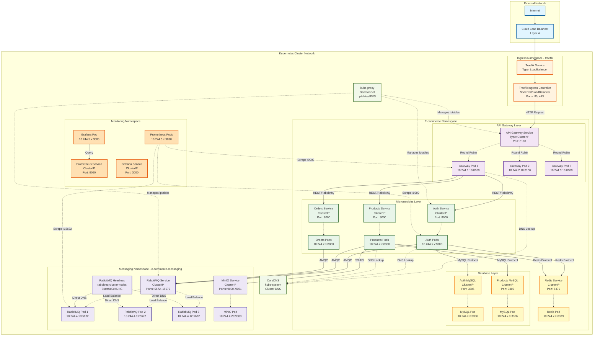

# Networking Architecture - Kubernetes

## Table of Contents

1. [Overview](#overview)
2. [Network Architecture Diagram](#network-architecture-diagram)
3. [Network Layers](#network-layers)
4. [Service Discovery](#service-discovery)
5. [Network Policies](#network-policies)
6. [Load Balancing](#load-balancing)
7. [DNS Resolution](#dns-resolution)
8. [Service Mesh Considerations](#service-mesh-considerations)
9. [Network Security](#network-security)
10. [Traffic Flow Examples](#traffic-flow-examples)

---

## Overview

This document details the networking architecture of the e-commerce platform on Kubernetes. The architecture implements a zero-trust network model with explicit allow rules, service discovery, and multiple layers of load balancing.

### Network Requirements

- **Isolation**: Services only communicate with authorized endpoints
- **Security**: Zero-trust model with default deny-all policies
- **Scalability**: Efficient service discovery and load balancing
- **Observability**: Network traffic monitoring and tracing
- **Performance**: Low-latency service-to-service communication

---

## Network Architecture Diagram



---

## Network Layers

### Layer 1: External Network

**Components:**
- Internet traffic
- Cloud provider load balancer (if applicable)
- DNS resolution to cluster

**Responsibilities:**
- Route external traffic to Kubernetes cluster
- Provide external IP addresses
- DDoS protection (cloud provider level)

### Layer 2: Ingress Layer

**Components:**
- Traefik Ingress Controller
- Service type: LoadBalancer or NodePort

**Traffic Flow:**
1. External request arrives at load balancer IP
2. Routed to Traefik service (NodePort 30080/30443 or LoadBalancer)
3. Traefik terminates SSL/TLS
4. Routes based on host/path rules to backend services

**Service Configuration:**
```yaml
apiVersion: v1
kind: Service
metadata:
  name: traefik
  namespace: traefik
spec:
  type: LoadBalancer  # or NodePort
  ports:
  - name: web
    port: 80
    targetPort: 8000
  - name: websecure
    port: 443
    targetPort: 8443
  selector:
    app: traefik
```

### Layer 3: API Gateway Layer

**Components:**
- API Gateway service (ClusterIP)
- Multiple gateway pods (3+ replicas)

**Network Configuration:**
- Service Type: ClusterIP
- Port: 8100 (HTTP)
- Internal DNS: api-gateway.e-commerce.svc.cluster.local

**Traffic Pattern:**
- Ingress → API Gateway Service → Round-robin to Gateway Pods
- Gateway Pods → Microservices (via RabbitMQ for async, direct HTTP for sync)

### Layer 4: Microservices Layer

**Components:**
- 13 microservices
- Each with ClusterIP service
- Multiple pods per service (2-10 replicas)

**Network Configuration:**
- Service Type: ClusterIP (internal only)
- Port: 8000 (HTTP)
- Metrics Port: 9090 (Prometheus)

**Service Naming:**
- auth-service.e-commerce.svc.cluster.local
- products-service.e-commerce.svc.cluster.local
- orders-service.e-commerce.svc.cluster.local
- etc.

### Layer 5: Data Layer

**Components:**
- 11 MySQL databases
- Redis cache
- Each with ClusterIP service

**Network Configuration:**

**MySQL Services:**
- Service Type: ClusterIP
- Port: 3306
- Internal DNS: {service}-mysql.e-commerce.svc.cluster.local

**Redis Service:**
- Service Type: ClusterIP
- Port: 6379
- Internal DNS: redis.e-commerce.svc.cluster.local

### Layer 6: Messaging Layer

**Components:**
- RabbitMQ cluster (3 replicas)
- MinIO object storage

**Network Configuration:**

**RabbitMQ:**
- Service Type: ClusterIP
- Ports: 5672 (AMQP), 15672 (Management), 15692 (Metrics)
- Internal DNS: rabbitmq-cluster.e-commerce-messaging.svc.cluster.local
- Headless Service: For StatefulSet pod-to-pod communication

**MinIO:**
- Service Type: ClusterIP
- Ports: 9000 (API), 9001 (Console)
- Internal DNS: minio.e-commerce-messaging.svc.cluster.local

---

## Service Discovery

### CoreDNS

**Kubernetes DNS Service:**
- Runs in kube-system namespace
- Automatically creates DNS records for all services
- Pods query CoreDNS for service resolution

**DNS Record Format:**

```
{service-name}.{namespace}.svc.{cluster-domain}
```

**Examples:**
```
auth-service.e-commerce.svc.cluster.local          → 10.96.1.10 (ClusterIP)
products-service.e-commerce.svc.cluster.local      → 10.96.1.20 (ClusterIP)
rabbitmq-cluster.e-commerce-messaging.svc.cluster.local → 10.96.2.10 (ClusterIP)
```

### Service Types

#### ClusterIP (Default)

**Purpose:** Internal service access only

**Characteristics:**
- Virtual IP assigned from cluster CIDR (e.g., 10.96.0.0/12)
- Only accessible within cluster
- DNS record created automatically
- iptables/IPVS rules for load balancing

**Usage:**
- All microservices
- Databases
- Internal infrastructure components

**Example:**
```yaml
apiVersion: v1
kind: Service
metadata:
  name: auth-service
  namespace: e-commerce
spec:
  type: ClusterIP
  selector:
    app: auth-service
  ports:
  - name: http
    port: 8000
    targetPort: 8000
```

#### Headless Service

**Purpose:** Direct pod-to-pod communication (StatefulSets)

**Characteristics:**
- ClusterIP: None
- DNS returns pod IPs directly, not service IP
- Each pod gets its own DNS record

**Usage:**
- RabbitMQ cluster (StatefulSet)
- Database clusters (future)

**DNS Records:**
```
rabbitmq-cluster-0.rabbitmq-cluster-nodes.e-commerce-messaging.svc.cluster.local
rabbitmq-cluster-1.rabbitmq-cluster-nodes.e-commerce-messaging.svc.cluster.local
rabbitmq-cluster-2.rabbitmq-cluster-nodes.e-commerce-messaging.svc.cluster.local
```

**Example:**
```yaml
apiVersion: v1
kind: Service
metadata:
  name: rabbitmq-cluster-nodes
  namespace: e-commerce-messaging
spec:
  clusterIP: None  # Headless
  selector:
    app.kubernetes.io/name: rabbitmq-cluster
  ports:
  - name: amqp
    port: 5672
  - name: clustering
    port: 25672
```

#### NodePort

**Purpose:** External access via node IPs

**Characteristics:**
- Allocates a port on every node (30000-32767 range)
- Traffic to NodeIP:NodePort → Service → Pods

**Usage:**
- Development/testing ingress access
- Alternative to LoadBalancer in on-premise setups

#### LoadBalancer

**Purpose:** Cloud provider load balancer integration

**Characteristics:**
- Provisions external load balancer (AWS ELB, GCP LB, Azure LB)
- External IP assigned
- Combines with NodePort internally

**Usage:**
- Traefik ingress controller (production)
- Direct service exposure (rare)

---

## Network Policies

### Zero-Trust Model

**Default:** Deny all ingress and egress traffic

```yaml
apiVersion: networking.k8s.io/v1
kind: NetworkPolicy
metadata:
  name: deny-all-default
  namespace: e-commerce
spec:
  podSelector: {}
  policyTypes:
  - Ingress
  - Egress
```

### Policy Categories

#### 1. DNS Resolution (Allow All Pods)

```yaml
apiVersion: networking.k8s.io/v1
kind: NetworkPolicy
metadata:
  name: allow-dns
  namespace: e-commerce
spec:
  podSelector: {}
  policyTypes:
  - Egress
  egress:
  - to: []  # Any destination
    ports:
    - protocol: UDP
      port: 53
    - protocol: TCP
      port: 53
```

**Purpose:** All pods can resolve DNS names

#### 2. API Gateway Ingress (From Traefik)

```yaml
apiVersion: networking.k8s.io/v1
kind: NetworkPolicy
metadata:
  name: allow-api-gateway-ingress
  namespace: e-commerce
spec:
  podSelector:
    matchLabels:
      app: api-gateway
  policyTypes:
  - Ingress
  ingress:
  - from:
    - namespaceSelector:
        matchLabels:
          name: traefik
    ports:
    - protocol: TCP
      port: 8100
  - from:
    - namespaceSelector:
        matchLabels:
          name: monitoring
    ports:
    - protocol: TCP
      port: 9090
```

**Purpose:** API Gateway accepts traffic only from Traefik and monitoring

#### 3. API Gateway Egress (To Microservices)

```yaml
apiVersion: networking.k8s.io/v1
kind: NetworkPolicy
metadata:
  name: allow-api-gateway-egress
  namespace: e-commerce
spec:
  podSelector:
    matchLabels:
      app: api-gateway
  policyTypes:
  - Egress
  egress:
  - to:
    - podSelector:
        matchLabels:
          component: microservice
    ports:
    - protocol: TCP
      port: 8000
  - to:
    - namespaceSelector:
        matchLabels:
          name: e-commerce-messaging
      podSelector:
        matchLabels:
          app.kubernetes.io/name: rabbitmq-cluster
    ports:
    - protocol: TCP
      port: 5672
```

**Purpose:** Gateway can communicate with microservices and RabbitMQ

#### 4. Microservices to Databases

```yaml
apiVersion: networking.k8s.io/v1
kind: NetworkPolicy
metadata:
  name: allow-microservices-database
  namespace: e-commerce
spec:
  podSelector:
    matchLabels:
      component: microservice
  policyTypes:
  - Egress
  egress:
  - to:
    - podSelector:
        matchLabels:
          component: database
    ports:
    - protocol: TCP
      port: 3306  # MySQL
  - to:
    - podSelector:
        matchLabels:
          app: redis
    ports:
    - protocol: TCP
      port: 6379  # Redis
```

**Purpose:** Microservices can access databases and cache

#### 5. Microservices to RabbitMQ

```yaml
apiVersion: networking.k8s.io/v1
kind: NetworkPolicy
metadata:
  name: allow-microservices-rabbitmq
  namespace: e-commerce
spec:
  podSelector:
    matchLabels:
      component: microservice
  policyTypes:
  - Egress
  egress:
  - to:
    - namespaceSelector:
        matchLabels:
          name: e-commerce-messaging
      podSelector:
        matchLabels:
          app.kubernetes.io/name: rabbitmq-cluster
    ports:
    - protocol: TCP
      port: 5672
```

**Purpose:** Microservices can publish/consume messages

#### 6. Monitoring Scraping

```yaml
apiVersion: networking.k8s.io/v1
kind: NetworkPolicy
metadata:
  name: allow-monitoring-scraping
  namespace: e-commerce
spec:
  podSelector: {}
  policyTypes:
  - Ingress
  ingress:
  - from:
    - namespaceSelector:
        matchLabels:
          name: monitoring
    ports:
    - protocol: TCP
      port: 9090  # Metrics endpoint
```

**Purpose:** Prometheus can scrape metrics from all services

### Policy Enforcement Points

**Ingress Rules:**
- Who can send traffic TO this pod?
- Specify source namespaces and pods
- Specify allowed ports

**Egress Rules:**
- Where can this pod send traffic TO?
- Specify destination namespaces and pods
- Specify allowed ports

**Best Practices:**
- Start with deny-all
- Add specific allow rules
- Document the purpose of each policy
- Test policies in staging first
- Use labels for flexible selection

---

## Load Balancing

### Level 1: External Load Balancer

**Type:** Cloud provider (AWS ELB, GCP LB, Azure LB)

**Characteristics:**
- Layer 4 (TCP/UDP) or Layer 7 (HTTP/HTTPS)
- Health checks to Kubernetes nodes
- SSL/TLS termination (optional)
- DDoS protection

**Configuration:**
```yaml
apiVersion: v1
kind: Service
metadata:
  name: traefik
  namespace: traefik
  annotations:
    service.beta.kubernetes.io/aws-load-balancer-type: "nlb"
    service.beta.kubernetes.io/aws-load-balancer-cross-zone-load-balancing-enabled: "true"
spec:
  type: LoadBalancer
  externalTrafficPolicy: Local  # Preserve source IP
  ports:
  - name: web
    port: 80
  - name: websecure
    port: 443
```

### Level 2: Ingress Controller (Traefik)

**Type:** Application-level load balancer (Layer 7)

**Capabilities:**
- Host-based routing (api.example.com → API Gateway)
- Path-based routing (/api/v1/* → API Gateway)
- SSL/TLS termination with automatic certificate management
- Rate limiting and circuit breaking
- Load balancing algorithms: Round Robin, Weighted Round Robin

**Configuration:**
```yaml
apiVersion: networking.k8s.io/v1
kind: Ingress
metadata:
  name: api-gateway-ingress
  namespace: e-commerce
  annotations:
    traefik.ingress.kubernetes.io/router.entrypoints: websecure
    traefik.ingress.kubernetes.io/router.tls: "true"
    cert-manager.io/cluster-issuer: letsencrypt-prod
spec:
  ingressClassName: traefik
  tls:
  - hosts:
    - api.yourdomain.com
    secretName: api-tls-cert
  rules:
  - host: api.yourdomain.com
    http:
      paths:
      - path: /
        pathType: Prefix
        backend:
          service:
            name: api-gateway
            port:
              number: 8100
```

### Level 3: Kubernetes Service (ClusterIP)

**Type:** Internal load balancer (Layer 4)

**Mechanism:** kube-proxy + iptables/IPVS

**Algorithms:**
- **Round Robin** (default): Equal distribution to all pods
- **Session Affinity**: Route from same client IP to same pod

**How it works:**
1. Service assigned a ClusterIP (virtual IP)
2. kube-proxy watches service endpoints (pod IPs)
3. Creates iptables/IPVS rules for load balancing
4. Traffic to ClusterIP distributed to pod IPs

**Session Affinity Example:**
```yaml
apiVersion: v1
kind: Service
metadata:
  name: auth-service
spec:
  sessionAffinity: ClientIP
  sessionAffinityConfig:
    clientIP:
      timeoutSeconds: 3600
  selector:
    app: auth-service
  ports:
  - port: 8000
```

### Level 4: Application-Level Load Balancing

**RabbitMQ Client:**
- Connection to RabbitMQ cluster
- Client library handles node failures
- Automatic reconnection

**Example (PHP):***
```php
$connection = new AMQPStreamConnection(
    ['rabbitmq-cluster-0', 'rabbitmq-cluster-1', 'rabbitmq-cluster-2'],
    5672,
    'guest',
    'guest'
);
```

---

## DNS Resolution

### CoreDNS Configuration

**Location:** kube-system namespace

**Corefile:**
```
.:53 {
    errors
    health {
       lameduck 5s
    }
    ready
    kubernetes cluster.local in-addr.arpa ip6.arpa {
       pods insecure
       fallthrough in-addr.arpa ip6.arpa
       ttl 30
    }
    prometheus :9153
    forward . /etc/resolv.conf {
       max_concurrent 1000
    }
    cache 30
    loop
    reload
    loadbalance
}
```

### DNS Query Flow

**Example:** Pod needs to connect to auth-service

1. **Pod DNS Configuration:**
   - nameserver: 10.96.0.10 (CoreDNS ClusterIP)
   - search: e-commerce.svc.cluster.local svc.cluster.local cluster.local

2. **Query Process:**
   ```
   Pod → Query "auth-service"
   → CoreDNS adds search domain → "auth-service.e-commerce.svc.cluster.local"
   → CoreDNS looks up service → Returns ClusterIP 10.96.1.10
   → Pod connects to 10.96.1.10:8000
   → kube-proxy iptables routes to pod IP
   ```

3. **Pod DNS Record:**
   ```
   10-244-1-15.e-commerce.pod.cluster.local → 10.244.1.15 (Pod IP)
   ```

### DNS Caching

**TTL Settings:**
- Service records: 30 seconds
- Pod records: 30 seconds
- External lookups: Forwarded to upstream DNS

**Cache Benefits:**
- Reduces CoreDNS load
- Faster resolution for frequent queries
- Configurable per query type

---

## Service Mesh Considerations

### Current State

**No Service Mesh Deployed**

**Capabilities Provided by Kubernetes:**
- Service discovery via CoreDNS
- Load balancing via kube-proxy
- Network policies for security

**Limitations:**
- No automatic mTLS (mutual TLS) between services
- Limited traffic management (retries, timeouts, circuit breaking)
- Basic observability (requires application instrumentation)

### Future Service Mesh Options

#### Istio

**Pros:**
- Comprehensive feature set
- Strong traffic management
- Built-in mTLS
- Advanced observability

**Cons:**
- Complex setup
- Resource intensive
- Steeper learning curve

#### Linkerd

**Pros:**
- Lightweight
- Simpler than Istio
- Good performance
- Easier to operate

**Cons:**
- Fewer features than Istio
- Less ecosystem integrations

#### Cilium Service Mesh

**Pros:**
- eBPF-based (high performance)
- Integrated with network policies
- Lower overhead than sidecar-based meshes

**Cons:**
- Newer technology
- Requires newer kernel versions

### When to Adopt Service Mesh

**Consider if:**
- Need automatic mTLS between all services
- Require advanced traffic management (canary, blue-green)
- Need detailed service-to-service observability
- Implementing zero-trust architecture
- Managing 20+ microservices

**Current Status:**
- Platform works well with native Kubernetes networking
- Network policies provide sufficient security
- Application-level observability via OpenTelemetry (future)
- Service mesh can be added later without major refactoring

---

## Network Security

### Security Layers

#### 1. Perimeter Security

**Firewall Rules:**
- Allow only ports 80, 443 from internet
- Block all other inbound traffic
- Allow outbound for image pulls, DNS

**DDoS Protection:**
- Cloud provider level
- Rate limiting at ingress controller

#### 2. Ingress Security

**Traefik Features:**
- SSL/TLS termination with strong ciphers
- HTTP to HTTPS redirect
- HSTS headers
- Rate limiting per IP
- IP whitelisting (admin endpoints)

**Certificate Management:**
- Cert-Manager for automatic Let's Encrypt certificates
- Auto-renewal before expiration
- Support for wildcard certificates

#### 3. Network Policies (Micro-segmentation)

**Principles:**
- Default deny all
- Explicit allow rules
- Namespace isolation
- Label-based selection

**Benefits:**
- Zero-trust networking
- Limit blast radius of compromises
- Compliance requirements (PCI-DSS, GDPR)

#### 4. Pod Security

**Pod Security Standards:**
- Baseline: Basic security
- Restricted: Highly restricted (production)

**Enforcement:**
```yaml
apiVersion: v1
kind: Namespace
metadata:
  name: e-commerce-prod
  labels:
    pod-security.kubernetes.io/enforce: restricted
    pod-security.kubernetes.io/audit: restricted
    pod-security.kubernetes.io/warn: restricted
```

**Requirements:**
- No privileged containers
- No host network/PID/IPC
- Non-root user
- Read-only root filesystem (where possible)
- Drop all capabilities, add only required

#### 5. Secrets Management

**External Secrets Operator:**
- Secrets stored in HashiCorp Vault
- Synchronized to Kubernetes secrets
- Automatic rotation
- Audit logging

**Never in Git:**
- Secrets are NOT in Git repositories
- Secret templates only
- Injected at deploy time

#### 6. RBAC (Role-Based Access Control)

**Service Accounts:**
- One per microservice
- Minimal permissions
- No default service account token mounting

**Human Access:**
- Developer: Read-only to dev/staging
- Operator: Full access to dev/staging, limited to production
- Admin: Full access to all environments

---

## Traffic Flow Examples

### Example 1: Customer Login

**External Request to Auth Service:**

```
1. Client (Browser) → HTTPS → api.yourdomain.com/auth/login
   └─ DNS: api.yourdomain.com → Load Balancer IP (e.g., 52.10.20.30)

2. Cloud Load Balancer (52.10.20.30:443)
   └─ Health check passes → Forward to Traefik Service

3. Traefik Service (LoadBalancer/NodePort)
   └─ NodeIP:NodePort or LoadBalancer IP → Traefik Pods

4. Traefik Ingress Controller
   ├─ Terminate SSL/TLS
   ├─ Match ingress rule: host=api.yourdomain.com, path=/auth/*
   └─ Forward to: api-gateway.e-commerce.svc.cluster.local:8100

5. CoreDNS Resolution
   └─ api-gateway.e-commerce.svc.cluster.local → 10.96.1.5 (ClusterIP)

6. API Gateway Service (10.96.1.5:8100)
   ├─ kube-proxy iptables rules
   └─ Round-robin to pod: 10.244.1.10:8100

7. API Gateway Pod (10.244.1.10)
   ├─ Validate request
   ├─ Route to auth-service
   └─ Publish message to RabbitMQ OR HTTP call

8. RabbitMQ (Async) or Auth Service (Sync)
   └─ auth-service.e-commerce.svc.cluster.local → 10.96.1.15

9. Auth Service Pod (10.244.2.20:8000)
   ├─ Process login
   ├─ Query: auth-service-mysql.e-commerce.svc.cluster.local:3306
   └─ Cache session: redis.e-commerce.svc.cluster.local:6379

10. Response back through chain:
    Auth Pod → API Gateway → Traefik → Load Balancer → Client
```

### Example 2: Prometheus Scraping Metrics

**Monitoring Internal Services:**

```
1. Prometheus Pod (10.244.5.10) in monitoring namespace
   └─ Scrape config: http://auth-service.e-commerce.svc.cluster.local:9090/metrics

2. CoreDNS Resolution
   └─ auth-service.e-commerce.svc.cluster.local → 10.96.1.15

3. Network Policy Check
   ├─ Source: monitoring namespace, Prometheus pod
   ├─ Destination: e-commerce namespace, port 9090
   └─ Policy: allow-monitoring-scraping → ALLOW

4. Auth Service (10.96.1.15:9090)
   └─ kube-proxy → Round-robin to pod: 10.244.2.20:9090

5. Auth Service Pod (10.244.2.20)
   └─ Return metrics in Prometheus format

6. Prometheus
   └─ Store metrics in time-series database
```

### Example 3: RabbitMQ Cluster Communication

**Inter-Cluster Messaging:**

```
1. RabbitMQ Pod 1 (rabbitmq-cluster-0, 10.244.4.10)
   └─ Need to sync with other cluster members

2. Headless Service DNS Query
   └─ rabbitmq-cluster-nodes.e-commerce-messaging.svc.cluster.local

3. CoreDNS Returns All Pod IPs
   ├─ rabbitmq-cluster-0.rabbitmq-cluster-nodes... → 10.244.4.10
   ├─ rabbitmq-cluster-1.rabbitmq-cluster-nodes... → 10.244.4.11
   └─ rabbitmq-cluster-2.rabbitmq-cluster-nodes... → 10.244.4.12

4. RabbitMQ Pod 1 connects directly to Pod 2 and Pod 3
   ├─ 10.244.4.10 → 10.244.4.11:25672 (clustering port)
   └─ 10.244.4.10 → 10.244.4.12:25672

5. Network Policy Check
   ├─ Source: rabbitmq-cluster pod
   ├─ Destination: rabbitmq-cluster pod, port 25672
   └─ Policy: allow-rabbitmq-cluster → ALLOW

6. Cluster Synchronization
   └─ Quorum queue replication, leader election
```

---

## Network Troubleshooting

### Common Issues

#### 1. Service Not Reachable

**Diagnostic Steps:**
```bash
# Check service exists
kubectl get svc -n e-commerce auth-service

# Check endpoints (pods backing service)
kubectl get endpoints -n e-commerce auth-service

# Check pod status
kubectl get pods -n e-commerce -l app=auth-service

# Test DNS resolution from another pod
kubectl run -it --rm debug --image=busybox --restart=Never -- nslookup auth-service.e-commerce.svc.cluster.local

# Test connectivity
kubectl run -it --rm debug --image=busybox --restart=Never -- wget -O- http://auth-service.e-commerce.svc.cluster.local:8000/health
```

#### 2. Network Policy Blocking Traffic

**Diagnostic Steps:**
```bash
# List all network policies in namespace
kubectl get networkpolicies -n e-commerce

# Describe specific policy
kubectl describe networkpolicy allow-microservices-database -n e-commerce

# Check pod labels (policies use selectors)
kubectl get pods -n e-commerce --show-labels

# Temporarily remove policy for testing (NOT in production)
kubectl delete networkpolicy deny-all-default -n e-commerce
```

#### 3. DNS Resolution Failures

**Diagnostic Steps:**
```bash
# Check CoreDNS pods
kubectl get pods -n kube-system -l k8s-app=kube-dns

# Check CoreDNS logs
kubectl logs -n kube-system -l k8s-app=kube-dns

# Test from pod
kubectl exec -it <pod-name> -n e-commerce -- nslookup kubernetes.default

# Check pod DNS configuration
kubectl exec -it <pod-name> -n e-commerce -- cat /etc/resolv.conf
```

#### 4. Load Balancer Not Distributing

**Diagnostic Steps:**
```bash
# Check service endpoints
kubectl get endpoints auth-service -n e-commerce

# Check kube-proxy logs
kubectl logs -n kube-system -l k8s-app=kube-proxy

# Check iptables rules (on node)
sudo iptables-save | grep auth-service

# Test multiple requests
for i in {1..10}; do curl -s http://api-gateway.e-commerce.svc.cluster.local:8100/health | grep hostname; done
```

---

## Summary

The e-commerce platform networking architecture provides:

- **Service Discovery**: Automatic DNS-based service discovery via CoreDNS
- **Load Balancing**: Multi-level load balancing from cloud provider to pod level
- **Security**: Zero-trust network model with default deny and explicit allow policies
- **Isolation**: Namespace and network policy-based isolation
- **Scalability**: Efficient service-to-service communication with minimal overhead
- **Observability**: Network traffic monitoring via Prometheus and potential for service mesh

The architecture balances simplicity with security, providing production-ready networking without the overhead of a service mesh, while maintaining the ability to adopt one in the future if requirements evolve.
