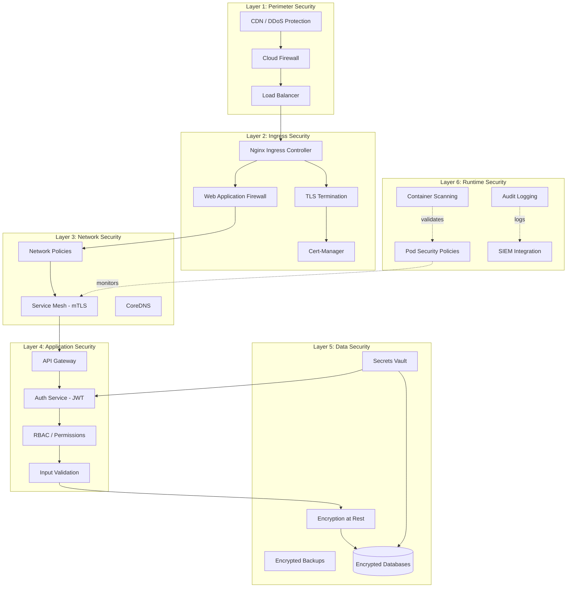
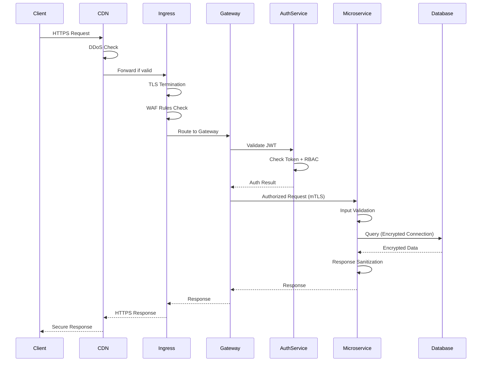
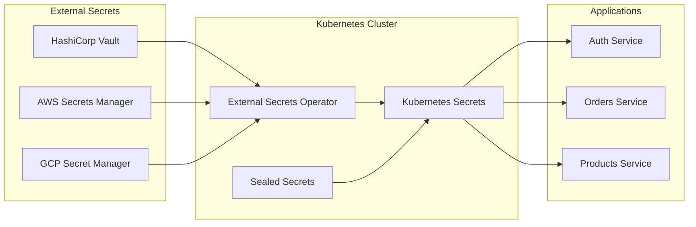

# Security Architecture - E-Commerce Microservices Platform

## Table of Contents

1. [Security Overview](#security-overview)
2. [Multi-Layer Security Diagram](#multi-layer-security-diagram)
3. [Secrets Management](#secrets-management)
4. [RBAC Kubernetes](#rbac-kubernetes)
5. [Network Policies](#network-policies)
6. [Pod Security Standards](#pod-security-standards)
7. [Image Security](#image-security)
8. [TLS/SSL Management](#tlsssl-management)
9. [Audit Logging](#audit-logging)
10. [Compliance](#compliance)
11. [Vulnerability Management](#vulnerability-management)
12. [Incident Response](#incident-response)

---

## Security Overview

### Defense in Depth

The platform implements a multi-layered security strategy where each layer provides independent protection:

**Security Layers:**
- **Perimeter Layer**: Firewall, DDoS protection, CDN
- **Ingress Layer**: TLS termination, Web Application Firewall (WAF)
- **Network Layer**: Network Policies, service mesh with mTLS
- **Application Layer**: JWT authentication, RBAC, input validation
- **Data Layer**: Encryption at rest, encrypted backups

### Zero-Trust Architecture

**Principles:**
- Never trust, always verify
- Assume breach mentality
- Least privilege access
- Micro-segmentation
- Continuous verification

**Implementation:**
- No implicit trust between services
- All service-to-service communication authenticated
- Network policies enforce segmentation
- Identity-based access control

### Principle of Least Privilege

**Applied to:**
- ServiceAccounts: Minimal permissions per service
- RBAC: Role-specific access only
- Network Policies: Only required traffic allowed
- Container Security: Non-root users, read-only filesystems
- Secrets Access: Only services that need them

---

## Multi-Layer Security Diagram



### Security Flow



---

## Secrets Management

### Architecture Overview



### External Secrets Operator

**Installation:**

```yaml
# external-secrets-operator.yaml
apiVersion: v1
kind: Namespace
metadata:
  name: external-secrets
---
apiVersion: helm.cattle.io/v1
kind: HelmChart
metadata:
  name: external-secrets
  namespace: kube-system
spec:
  chart: external-secrets
  repo: https://charts.external-secrets.io
  targetNamespace: external-secrets
  valuesContent: |-
    installCRDs: true
    webhook:
      port: 9443
```

**SecretStore Configuration (HashiCorp Vault):**

```yaml
# vault-secret-store.yaml
apiVersion: external-secrets.io/v1beta1
kind: SecretStore
metadata:
  name: vault-backend
  namespace: e-commerce
spec:
  provider:
    vault:
      server: "https://vault.example.com"
      path: "secret"
      version: "v2"
      auth:
        kubernetes:
          mountPath: "kubernetes"
          role: "e-commerce-role"
          serviceAccountRef:
            name: external-secrets-sa
```

**ExternalSecret Resource:**

```yaml
# database-credentials-external-secret.yaml
apiVersion: external-secrets.io/v1beta1
kind: ExternalSecret
metadata:
  name: mysql-credentials
  namespace: e-commerce
spec:
  refreshInterval: 1h
  secretStoreRef:
    name: vault-backend
    kind: SecretStore
  target:
    name: mysql-secret
    creationPolicy: Owner
  data:
  - secretKey: username
    remoteRef:
      key: database/mysql
      property: username
  - secretKey: password
    remoteRef:
      key: database/mysql
      property: password
  - secretKey: root-password
    remoteRef:
      key: database/mysql
      property: root-password
```

### AWS Secrets Manager Integration

```yaml
# aws-secrets-manager-store.yaml
apiVersion: external-secrets.io/v1beta1
kind: SecretStore
metadata:
  name: aws-secrets-manager
  namespace: e-commerce
spec:
  provider:
    aws:
      service: SecretsManager
      region: us-east-1
      auth:
        jwt:
          serviceAccountRef:
            name: external-secrets-sa
---
apiVersion: external-secrets.io/v1beta1
kind: ExternalSecret
metadata:
  name: jwt-secret
  namespace: e-commerce
spec:
  refreshInterval: 12h
  secretStoreRef:
    name: aws-secrets-manager
    kind: SecretStore
  target:
    name: jwt-secret
    creationPolicy: Owner
  data:
  - secretKey: JWT_SECRET
    remoteRef:
      key: /e-commerce/production/jwt-secret
      property: secret
```

### Sealed Secrets (Bitnami)

**Controller Installation:**

```bash
# Install sealed-secrets controller
kubectl apply -f https://github.com/bitnami-labs/sealed-secrets/releases/download/v0.24.0/controller.yaml

# Install kubeseal CLI
wget https://github.com/bitnami-labs/sealed-secrets/releases/download/v0.24.0/kubeseal-0.24.0-linux-amd64.tar.gz
tar -xvzf kubeseal-0.24.0-linux-amd64.tar.gz
sudo install -m 755 kubeseal /usr/local/bin/kubeseal
```

**Creating Sealed Secrets:**

```bash
# Create a regular secret file
kubectl create secret generic rabbitmq-credentials \
  --from-literal=username=ecommerce \
  --from-literal=password=SecurePass123! \
  --dry-run=client -o yaml > rabbitmq-secret.yaml

# Seal the secret
kubeseal --format=yaml < rabbitmq-secret.yaml > rabbitmq-sealed-secret.yaml

# Apply sealed secret (safe to commit to git)
kubectl apply -f rabbitmq-sealed-secret.yaml
```

**Sealed Secret Example:**

```yaml
# rabbitmq-sealed-secret.yaml
apiVersion: bitnami.com/v1alpha1
kind: SealedSecret
metadata:
  name: rabbitmq-credentials
  namespace: e-commerce
spec:
  encryptedData:
    username: AgBxK8jP... (encrypted)
    password: AgCmQw9... (encrypted)
  template:
    metadata:
      name: rabbitmq-credentials
      namespace: e-commerce
    type: Opaque
```

### Secret Rotation

**Automated Rotation with External Secrets:**

```yaml
# auto-rotate-secret.yaml
apiVersion: external-secrets.io/v1beta1
kind: ExternalSecret
metadata:
  name: database-password
  namespace: e-commerce
  annotations:
    reloader.stakater.com/match: "true"
spec:
  refreshInterval: 24h  # Check for updates every 24h
  secretStoreRef:
    name: vault-backend
    kind: SecretStore
  target:
    name: db-password
    creationPolicy: Owner
    template:
      type: Opaque
      metadata:
        annotations:
          reloader.stakater.com/match: "true"
  data:
  - secretKey: password
    remoteRef:
      key: database/orders-db
      property: password
```

**Reloader for Automatic Pod Restart:**

```yaml
# reloader-deployment.yaml
apiVersion: apps/v1
kind: Deployment
metadata:
  name: orders-service
  namespace: e-commerce
  annotations:
    reloader.stakater.com/auto: "true"  # Auto-reload on secret change
spec:
  template:
    spec:
      containers:
      - name: orders-service
        image: orders-service:latest
        envFrom:
        - secretRef:
            name: db-password
```

---

## RBAC Kubernetes

### ServiceAccounts per Service

```yaml
# service-accounts.yaml
---
apiVersion: v1
kind: ServiceAccount
metadata:
  name: auth-service-sa
  namespace: e-commerce
---
apiVersion: v1
kind: ServiceAccount
metadata:
  name: orders-service-sa
  namespace: e-commerce
---
apiVersion: v1
kind: ServiceAccount
metadata:
  name: products-service-sa
  namespace: e-commerce
---
apiVersion: v1
kind: ServiceAccount
metadata:
  name: gateway-sa
  namespace: e-commerce
```

### Roles and ClusterRoles

**Namespace-Specific Role:**

```yaml
# orders-service-role.yaml
apiVersion: rbac.authorization.k8s.io/v1
kind: Role
metadata:
  name: orders-service-role
  namespace: e-commerce
rules:
# Read ConfigMaps
- apiGroups: [""]
  resources: ["configmaps"]
  verbs: ["get", "list", "watch"]
# Read Secrets (only specific ones)
- apiGroups: [""]
  resources: ["secrets"]
  resourceNames: ["orders-db-secret", "rabbitmq-credentials"]
  verbs: ["get"]
# Read own Service
- apiGroups: [""]
  resources: ["services"]
  resourceNames: ["orders-service"]
  verbs: ["get"]
```

**ClusterRole for External Secrets Operator:**

```yaml
# external-secrets-cluster-role.yaml
apiVersion: rbac.authorization.k8s.io/v1
kind: ClusterRole
metadata:
  name: external-secrets-operator
rules:
- apiGroups: [""]
  resources: ["secrets"]
  verbs: ["get", "list", "watch", "create", "update", "patch", "delete"]
- apiGroups: ["external-secrets.io"]
  resources: ["externalsecrets", "secretstores", "clustersecretstores"]
  verbs: ["get", "list", "watch", "create", "update", "patch", "delete"]
- apiGroups: [""]
  resources: ["events"]
  verbs: ["create", "patch"]
```

### RoleBindings

```yaml
# orders-service-rolebinding.yaml
apiVersion: rbac.authorization.k8s.io/v1
kind: RoleBinding
metadata:
  name: orders-service-binding
  namespace: e-commerce
roleRef:
  apiGroup: rbac.authorization.k8s.io
  kind: Role
  name: orders-service-role
subjects:
- kind: ServiceAccount
  name: orders-service-sa
  namespace: e-commerce
```

**ClusterRoleBinding:**

```yaml
# external-secrets-cluster-rolebinding.yaml
apiVersion: rbac.authorization.k8s.io/v1
kind: ClusterRoleBinding
metadata:
  name: external-secrets-operator-binding
roleRef:
  apiGroup: rbac.authorization.k8s.io
  kind: ClusterRole
  name: external-secrets-operator
subjects:
- kind: ServiceAccount
  name: external-secrets-sa
  namespace: external-secrets
```

### Minimal Permissions Example

```yaml
# gateway-minimal-permissions.yaml
apiVersion: rbac.authorization.k8s.io/v1
kind: Role
metadata:
  name: gateway-role
  namespace: e-commerce
rules:
# Only read its own configuration
- apiGroups: [""]
  resources: ["configmaps"]
  resourceNames: ["gateway-config"]
  verbs: ["get", "watch"]
# Only read JWT secret
- apiGroups: [""]
  resources: ["secrets"]
  resourceNames: ["jwt-secret"]
  verbs: ["get"]
# Discover services for routing
- apiGroups: [""]
  resources: ["services", "endpoints"]
  verbs: ["get", "list", "watch"]
```

---

## Network Policies

### Default Deny All

```yaml
# default-deny-all.yaml
apiVersion: networking.k8s.io/v1
kind: NetworkPolicy
metadata:
  name: default-deny-all
  namespace: e-commerce
spec:
  podSelector: {}  # Applies to all pods in namespace
  policyTypes:
  - Ingress
  - Egress
```

### Whitelist Approach - API Gateway

```yaml
# gateway-network-policy.yaml
apiVersion: networking.k8s.io/v1
kind: NetworkPolicy
metadata:
  name: gateway-network-policy
  namespace: e-commerce
spec:
  podSelector:
    matchLabels:
      app: api-gateway
  policyTypes:
  - Ingress
  - Egress

  # Ingress: Accept from Ingress Controller only
  ingress:
  - from:
    - namespaceSelector:
        matchLabels:
          name: ingress-nginx
    - podSelector:
        matchLabels:
          app.kubernetes.io/name: ingress-nginx
    ports:
    - protocol: TCP
      port: 8100

  # Egress: Allow to microservices and RabbitMQ
  egress:
  # DNS resolution
  - to:
    - namespaceSelector:
        matchLabels:
          name: kube-system
    - podSelector:
        matchLabels:
          k8s-app: kube-dns
    ports:
    - protocol: UDP
      port: 53

  # RabbitMQ
  - to:
    - podSelector:
        matchLabels:
          app: rabbitmq
    ports:
    - protocol: TCP
      port: 5672

  # All microservices
  - to:
    - podSelector:
        matchLabels:
          tier: backend
    ports:
    - protocol: TCP
      port: 9000
```

### Microservice Network Policy

```yaml
# orders-service-network-policy.yaml
apiVersion: networking.k8s.io/v1
kind: NetworkPolicy
metadata:
  name: orders-service-network-policy
  namespace: e-commerce
spec:
  podSelector:
    matchLabels:
      app: orders-service
  policyTypes:
  - Ingress
  - Egress

  # Ingress: Only from Gateway
  ingress:
  - from:
    - podSelector:
        matchLabels:
          app: api-gateway
    ports:
    - protocol: TCP
      port: 9000

  # Egress rules
  egress:
  # DNS
  - to:
    - namespaceSelector:
        matchLabels:
          name: kube-system
    ports:
    - protocol: UDP
      port: 53

  # MySQL database
  - to:
    - podSelector:
        matchLabels:
          app: orders-mysql
    ports:
    - protocol: TCP
      port: 3306

  # RabbitMQ
  - to:
    - podSelector:
        matchLabels:
          app: rabbitmq
    ports:
    - protocol: TCP
      port: 5672

  # MinIO (for file uploads if needed)
  - to:
    - podSelector:
        matchLabels:
          app: minio
    ports:
    - protocol: TCP
      port: 9000
```

### Database Network Policy

```yaml
# mysql-network-policy.yaml
apiVersion: networking.k8s.io/v1
kind: NetworkPolicy
metadata:
  name: mysql-network-policy
  namespace: e-commerce
spec:
  podSelector:
    matchLabels:
      app: orders-mysql
  policyTypes:
  - Ingress
  - Egress

  # Ingress: Only from orders-service
  ingress:
  - from:
    - podSelector:
        matchLabels:
          app: orders-service
    ports:
    - protocol: TCP
      port: 3306

  # Egress: DNS only
  egress:
  - to:
    - namespaceSelector:
        matchLabels:
          name: kube-system
    ports:
    - protocol: UDP
      port: 53
```

### RabbitMQ Network Policy

```yaml
# rabbitmq-network-policy.yaml
apiVersion: networking.k8s.io/v1
kind: NetworkPolicy
metadata:
  name: rabbitmq-network-policy
  namespace: e-commerce
spec:
  podSelector:
    matchLabels:
      app: rabbitmq
  policyTypes:
  - Ingress
  - Egress

  # Ingress: All backend services
  ingress:
  # AMQP from all backend services
  - from:
    - podSelector:
        matchLabels:
          tier: backend
    ports:
    - protocol: TCP
      port: 5672

  # Management UI (restricted to monitoring namespace)
  - from:
    - namespaceSelector:
        matchLabels:
          name: monitoring
    ports:
    - protocol: TCP
      port: 15672

  # Egress: DNS only
  egress:
  - to:
    - namespaceSelector:
        matchLabels:
          name: kube-system
    ports:
    - protocol: UDP
      port: 53
```

### Egress Controls - External APIs

```yaml
# external-api-egress-policy.yaml
apiVersion: networking.k8s.io/v1
kind: NetworkPolicy
metadata:
  name: external-api-egress
  namespace: e-commerce
spec:
  podSelector:
    matchLabels:
      app: payments-service
  policyTypes:
  - Egress

  egress:
  # DNS
  - to:
    - namespaceSelector:
        matchLabels:
          name: kube-system
    ports:
    - protocol: UDP
      port: 53

  # Allow HTTPS to payment gateway (Stripe API example)
  - to:
    - namespaceSelector: {}
    ports:
    - protocol: TCP
      port: 443
    # Optional: Add CIDR blocks for specific IPs
    # podSelector: {}
    # - to:
    #   - ipBlock:
    #       cidr: 54.187.205.235/32  # Stripe IP example
```

---

## Pod Security Standards

### Pod Security Admission

**Namespace Configuration:**

```yaml
# namespace-with-pod-security.yaml
apiVersion: v1
kind: Namespace
metadata:
  name: e-commerce
  labels:
    pod-security.kubernetes.io/enforce: restricted
    pod-security.kubernetes.io/audit: restricted
    pod-security.kubernetes.io/warn: restricted
```

### Restricted Profile Enforcement

**Pod Security Context:**

```yaml
# orders-service-deployment-secure.yaml
apiVersion: apps/v1
kind: Deployment
metadata:
  name: orders-service
  namespace: e-commerce
spec:
  replicas: 3
  selector:
    matchLabels:
      app: orders-service
  template:
    metadata:
      labels:
        app: orders-service
        tier: backend
    spec:
      serviceAccountName: orders-service-sa

      # Pod-level security context
      securityContext:
        runAsNonRoot: true
        runAsUser: 1000
        runAsGroup: 3000
        fsGroup: 2000
        seccompProfile:
          type: RuntimeDefault

      containers:
      - name: orders-service
        image: orders-service:v1.0.0

        # Container-level security context
        securityContext:
          allowPrivilegeEscalation: false
          readOnlyRootFilesystem: true
          runAsNonRoot: true
          runAsUser: 1000
          capabilities:
            drop:
            - ALL

        # Writable volume for Laravel cache/logs
        volumeMounts:
        - name: cache
          mountPath: /var/www/html/storage/framework/cache
        - name: logs
          mountPath: /var/www/html/storage/logs
        - name: tmp
          mountPath: /tmp

        resources:
          requests:
            memory: "256Mi"
            cpu: "250m"
          limits:
            memory: "512Mi"
            cpu: "500m"

      volumes:
      - name: cache
        emptyDir: {}
      - name: logs
        emptyDir: {}
      - name: tmp
        emptyDir: {}
```

### Non-Root Containers

**Dockerfile Example:**

```dockerfile
# services/orders-service/Dockerfile
FROM php:8.3-fpm-alpine

# Create non-root user
RUN addgroup -g 1000 laravel && \
    adduser -D -u 1000 -G laravel laravel

# Install dependencies
RUN apk add --no-cache \
    nginx \
    supervisor \
    mysql-client

# Copy application
WORKDIR /var/www/html
COPY --chown=laravel:laravel . .

# Install composer dependencies
RUN composer install --no-dev --optimize-autoloader

# Set proper permissions
RUN chown -R laravel:laravel /var/www/html/storage /var/www/html/bootstrap/cache

# Switch to non-root user
USER laravel

EXPOSE 9000

CMD ["php-fpm"]
```

### Read-Only Root Filesystem

```yaml
# Complete example with read-only root
apiVersion: apps/v1
kind: Deployment
metadata:
  name: products-service
  namespace: e-commerce
spec:
  template:
    spec:
      securityContext:
        runAsNonRoot: true
        runAsUser: 1000
        fsGroup: 2000

      containers:
      - name: products-service
        image: products-service:v1.0.0

        securityContext:
          allowPrivilegeEscalation: false
          readOnlyRootFilesystem: true
          runAsNonRoot: true
          runAsUser: 1000
          capabilities:
            drop: ["ALL"]

        # Mount writable volumes only where needed
        volumeMounts:
        - name: storage-cache
          mountPath: /var/www/html/storage/framework/cache
        - name: storage-logs
          mountPath: /var/www/html/storage/logs
        - name: storage-sessions
          mountPath: /var/www/html/storage/framework/sessions
        - name: storage-views
          mountPath: /var/www/html/storage/framework/views
        - name: tmp
          mountPath: /tmp
        - name: php-tmp
          mountPath: /var/run/php-fpm

      volumes:
      - name: storage-cache
        emptyDir: {}
      - name: storage-logs
        emptyDir: {}
      - name: storage-sessions
        emptyDir: {}
      - name: storage-views
        emptyDir: {}
      - name: tmp
        emptyDir: {}
      - name: php-tmp
        emptyDir: {}
```

### Security Contexts Best Practices

```yaml
# security-contexts-template.yaml
apiVersion: v1
kind: Pod
metadata:
  name: secure-pod
spec:
  # Pod-level security
  securityContext:
    runAsNonRoot: true        # Prevent root execution
    runAsUser: 1000           # Specific UID
    runAsGroup: 3000          # Specific GID
    fsGroup: 2000             # Volume ownership
    supplementalGroups: [4000]
    seccompProfile:
      type: RuntimeDefault    # Seccomp profile

  containers:
  - name: app
    image: app:latest

    # Container-level security
    securityContext:
      allowPrivilegeEscalation: false  # No privilege escalation
      readOnlyRootFilesystem: true     # Immutable root
      runAsNonRoot: true
      runAsUser: 1000
      capabilities:
        drop:
        - ALL                  # Drop all capabilities
        add:
        - NET_BIND_SERVICE     # Only add required ones
```

---

## Image Security

### Container Scanning with Trivy

**CI/CD Integration (GitHub Actions):**

```yaml
# .github/workflows/security-scan.yml
name: Security Scan

on:
  push:
    branches: [main, dev]
  pull_request:
    branches: [main]

jobs:
  trivy-scan:
    runs-on: ubuntu-latest
    steps:
    - name: Checkout code
      uses: actions/checkout@v3

    - name: Build Docker image
      run: |
        docker build -t orders-service:${{ github.sha }} \
          -f services/orders-service/Dockerfile \
          services/orders-service

    - name: Run Trivy vulnerability scanner
      uses: aquasecurity/trivy-action@master
      with:
        image-ref: 'orders-service:${{ github.sha }}'
        format: 'sarif'
        output: 'trivy-results.sarif'
        severity: 'CRITICAL,HIGH'
        exit-code: '1'  # Fail on vulnerabilities

    - name: Upload Trivy results to GitHub Security
      uses: github/codeql-action/upload-sarif@v2
      if: always()
      with:
        sarif_file: 'trivy-results.sarif'
```

**Kubernetes Job for Scheduled Scanning:**

```yaml
# trivy-scanner-cronjob.yaml
apiVersion: batch/v1
kind: CronJob
metadata:
  name: trivy-image-scanner
  namespace: security
spec:
  schedule: "0 2 * * *"  # Daily at 2 AM
  jobTemplate:
    spec:
      template:
        spec:
          serviceAccountName: trivy-scanner-sa
          containers:
          - name: trivy
            image: aquasec/trivy:latest
            command:
            - trivy
            - image
            - --severity
            - CRITICAL,HIGH
            - --exit-code
            - "1"
            - --format
            - json
            - --output
            - /reports/trivy-report.json
            - orders-service:latest
            volumeMounts:
            - name: reports
              mountPath: /reports

          volumes:
          - name: reports
            persistentVolumeClaim:
              claimName: trivy-reports-pvc

          restartPolicy: OnFailure
```

### Image Signing with Cosign

**Sign Images:**

```bash
# Generate key pair
cosign generate-key-pair

# Sign image
cosign sign --key cosign.key registry.example.com/orders-service:v1.0.0

# Verify signature
cosign verify --key cosign.pub registry.example.com/orders-service:v1.0.0
```

**Admission Controller for Signature Verification:**

```yaml
# cosign-policy-webhook.yaml
apiVersion: admissionregistration.k8s.io/v1
kind: ValidatingWebhookConfiguration
metadata:
  name: cosign-policy-webhook
webhooks:
- name: image-signature.cosign.io
  clientConfig:
    service:
      name: cosign-policy-webhook
      namespace: cosign-system
      path: "/validate"
  rules:
  - apiGroups: [""]
    apiVersions: ["v1"]
    operations: ["CREATE", "UPDATE"]
    resources: ["pods"]
  admissionReviewVersions: ["v1"]
  sideEffects: None
  failurePolicy: Fail  # Reject unsigned images
```

### Private Registry

**Harbor Registry Setup:**

```yaml
# harbor-values.yaml (Helm values)
expose:
  type: ingress
  tls:
    enabled: true
    certSource: secret
    secret:
      secretName: harbor-tls
  ingress:
    hosts:
      core: registry.example.com
    annotations:
      cert-manager.io/cluster-issuer: letsencrypt-prod

persistence:
  enabled: true
  persistentVolumeClaim:
    registry:
      size: 100Gi
    database:
      size: 10Gi

# Enable vulnerability scanning
trivy:
  enabled: true

# Enable image signing
notary:
  enabled: true
```

**Pull Secret Configuration:**

```bash
# Create pull secret
kubectl create secret docker-registry harbor-pull-secret \
  --docker-server=registry.example.com \
  --docker-username=robot$ecommerce \
  --docker-password=<token> \
  --namespace=e-commerce

# Use in deployment
kubectl patch serviceaccount default \
  -p '{"imagePullSecrets": [{"name": "harbor-pull-secret"}]}' \
  -n e-commerce
```

### Image Pull Policies

```yaml
# image-pull-policy-deployment.yaml
apiVersion: apps/v1
kind: Deployment
metadata:
  name: orders-service
  namespace: e-commerce
spec:
  template:
    spec:
      # Use pull secret
      imagePullSecrets:
      - name: harbor-pull-secret

      containers:
      - name: orders-service
        # Always use specific tags, never :latest
        image: registry.example.com/e-commerce/orders-service:v1.2.3

        # Always pull to ensure latest patches
        imagePullPolicy: Always

        # Or use IfNotPresent for stable tags
        # imagePullPolicy: IfNotPresent
```

---

## TLS/SSL Management

### Cert-Manager Installation

```yaml
# cert-manager-install.yaml
apiVersion: v1
kind: Namespace
metadata:
  name: cert-manager
---
apiVersion: helm.cattle.io/v1
kind: HelmChart
metadata:
  name: cert-manager
  namespace: kube-system
spec:
  chart: cert-manager
  repo: https://charts.jetstack.io
  targetNamespace: cert-manager
  valuesContent: |-
    installCRDs: true
    global:
      leaderElection:
        namespace: cert-manager
```

### Let's Encrypt ClusterIssuers

**Production Issuer:**

```yaml
# letsencrypt-prod-issuer.yaml
apiVersion: cert-manager.io/v1
kind: ClusterIssuer
metadata:
  name: letsencrypt-prod
spec:
  acme:
    server: https://acme-v02.api.letsencrypt.org/directory
    email: admin@example.com
    privateKeySecretRef:
      name: letsencrypt-prod-account-key
    solvers:
    # HTTP01 challenge
    - http01:
        ingress:
          class: nginx
    # DNS01 challenge for wildcard certs
    - dns01:
        cloudflare:
          email: admin@example.com
          apiTokenSecretRef:
            name: cloudflare-api-token
            key: api-token
      selector:
        dnsZones:
        - example.com
```

**Staging Issuer (for testing):**

```yaml
# letsencrypt-staging-issuer.yaml
apiVersion: cert-manager.io/v1
kind: ClusterIssuer
metadata:
  name: letsencrypt-staging
spec:
  acme:
    server: https://acme-staging-v02.api.letsencrypt.org/directory
    email: admin@example.com
    privateKeySecretRef:
      name: letsencrypt-staging-account-key
    solvers:
    - http01:
        ingress:
          class: nginx
```

### Certificate Resources

**Ingress with Automatic Certificate:**

```yaml
# ingress-with-tls.yaml
apiVersion: networking.k8s.io/v1
kind: Ingress
metadata:
  name: ecommerce-ingress
  namespace: e-commerce
  annotations:
    cert-manager.io/cluster-issuer: letsencrypt-prod
    nginx.ingress.kubernetes.io/ssl-redirect: "true"
    nginx.ingress.kubernetes.io/force-ssl-redirect: "true"
spec:
  ingressClassName: nginx
  tls:
  - hosts:
    - api.example.com
    - www.example.com
    secretName: ecommerce-tls-cert  # cert-manager creates this
  rules:
  - host: api.example.com
    http:
      paths:
      - path: /
        pathType: Prefix
        backend:
          service:
            name: api-gateway
            port:
              number: 8100
```

**Wildcard Certificate:**

```yaml
# wildcard-certificate.yaml
apiVersion: cert-manager.io/v1
kind: Certificate
metadata:
  name: wildcard-cert
  namespace: e-commerce
spec:
  secretName: wildcard-tls-secret
  issuerRef:
    name: letsencrypt-prod
    kind: ClusterIssuer
  commonName: "*.example.com"
  dnsNames:
  - "*.example.com"
  - example.com
```

### Mutual TLS (mTLS) Between Services

**Service Mesh Approach (Istio):**

```yaml
# istio-mtls-policy.yaml
apiVersion: security.istio.io/v1beta1
kind: PeerAuthentication
metadata:
  name: default-mtls
  namespace: e-commerce
spec:
  mtls:
    mode: STRICT  # Enforce mTLS for all traffic
---
apiVersion: networking.istio.io/v1beta1
kind: DestinationRule
metadata:
  name: default-mtls-dr
  namespace: e-commerce
spec:
  host: "*.e-commerce.svc.cluster.local"
  trafficPolicy:
    tls:
      mode: ISTIO_MUTUAL  # Use Istio-managed certificates
```

**Manual mTLS with Certificate Resources:**

```yaml
# service-mtls-certificate.yaml
apiVersion: cert-manager.io/v1
kind: Certificate
metadata:
  name: orders-service-mtls
  namespace: e-commerce
spec:
  secretName: orders-service-mtls-cert
  duration: 2160h  # 90 days
  renewBefore: 360h  # Renew 15 days before expiry
  subject:
    organizations:
    - e-commerce
  commonName: orders-service.e-commerce.svc.cluster.local
  isCA: false
  privateKey:
    algorithm: RSA
    encoding: PKCS1
    size: 2048
  usages:
  - server auth
  - client auth
  dnsNames:
  - orders-service.e-commerce.svc.cluster.local
  - orders-service
  issuerRef:
    name: internal-ca-issuer
    kind: ClusterIssuer
```

---

## Audit Logging

### Kubernetes Audit Logs

**Audit Policy:**

```yaml
# audit-policy.yaml
apiVersion: audit.k8s.io/v1
kind: Policy
rules:
# Log all requests at Metadata level
- level: Metadata
  omitStages:
  - RequestReceived

# Log secrets, configmaps at Request level (includes request body)
- level: Request
  resources:
  - group: ""
    resources: ["secrets", "configmaps"]

# Log authentication and authorization
- level: RequestResponse
  verbs: ["create", "update", "patch", "delete"]
  resources:
  - group: ""
    resources: ["serviceaccounts"]
  - group: "rbac.authorization.k8s.io"
    resources: ["roles", "rolebindings", "clusterroles", "clusterrolebindings"]

# Log pod exec and attach
- level: RequestResponse
  resources:
  - group: ""
    resources: ["pods/exec", "pods/attach", "pods/portforward"]

# Don't log read-only URLs
- level: None
  verbs: ["get", "list", "watch"]
  resources:
  - group: ""
    resources: ["events", "nodes", "nodes/status", "persistentvolumes", "persistentvolumeclaims"]
```

**API Server Configuration:**

```yaml
# kube-apiserver.yaml (static pod manifest)
apiVersion: v1
kind: Pod
metadata:
  name: kube-apiserver
  namespace: kube-system
spec:
  containers:
  - name: kube-apiserver
    image: k8s.gcr.io/kube-apiserver:v1.28.0
    command:
    - kube-apiserver
    - --audit-policy-file=/etc/kubernetes/audit-policy.yaml
    - --audit-log-path=/var/log/kubernetes/audit.log
    - --audit-log-maxage=30
    - --audit-log-maxbackup=10
    - --audit-log-maxsize=100
    volumeMounts:
    - name: audit-policy
      mountPath: /etc/kubernetes/audit-policy.yaml
      readOnly: true
    - name: audit-logs
      mountPath: /var/log/kubernetes
  volumes:
  - name: audit-policy
    hostPath:
      path: /etc/kubernetes/audit-policy.yaml
      type: File
  - name: audit-logs
    hostPath:
      path: /var/log/kubernetes
      type: DirectoryOrCreate
```

### Application Logs - Centralized Logging

**Fluent Bit DaemonSet:**

```yaml
# fluent-bit-daemonset.yaml
apiVersion: v1
kind: ServiceAccount
metadata:
  name: fluent-bit
  namespace: logging
---
apiVersion: rbac.authorization.k8s.io/v1
kind: ClusterRole
metadata:
  name: fluent-bit
rules:
- apiGroups: [""]
  resources: ["namespaces", "pods"]
  verbs: ["get", "list", "watch"]
---
apiVersion: rbac.authorization.k8s.io/v1
kind: ClusterRoleBinding
metadata:
  name: fluent-bit
roleRef:
  apiGroup: rbac.authorization.k8s.io
  kind: ClusterRole
  name: fluent-bit
subjects:
- kind: ServiceAccount
  name: fluent-bit
  namespace: logging
---
apiVersion: apps/v1
kind: DaemonSet
metadata:
  name: fluent-bit
  namespace: logging
spec:
  selector:
    matchLabels:
      app: fluent-bit
  template:
    metadata:
      labels:
        app: fluent-bit
    spec:
      serviceAccountName: fluent-bit
      containers:
      - name: fluent-bit
        image: fluent/fluent-bit:2.1
        volumeMounts:
        - name: varlog
          mountPath: /var/log
          readOnly: true
        - name: varlibdockercontainers
          mountPath: /var/lib/docker/containers
          readOnly: true
        - name: fluent-bit-config
          mountPath: /fluent-bit/etc/
      volumes:
      - name: varlog
        hostPath:
          path: /var/log
      - name: varlibdockercontainers
        hostPath:
          path: /var/lib/docker/containers
      - name: fluent-bit-config
        configMap:
          name: fluent-bit-config
```

**Fluent Bit Configuration:**

```yaml
# fluent-bit-configmap.yaml
apiVersion: v1
kind: ConfigMap
metadata:
  name: fluent-bit-config
  namespace: logging
data:
  fluent-bit.conf: |
    [SERVICE]
        Flush         5
        Daemon        Off
        Log_Level     info
        Parsers_File  parsers.conf

    [INPUT]
        Name              tail
        Path              /var/log/containers/*.log
        Parser            docker
        Tag               kube.*
        Refresh_Interval  5
        Mem_Buf_Limit     50MB
        Skip_Long_Lines   On

    [FILTER]
        Name                kubernetes
        Match               kube.*
        Kube_URL            https://kubernetes.default.svc:443
        Kube_CA_File        /var/run/secrets/kubernetes.io/serviceaccount/ca.crt
        Kube_Token_File     /var/run/secrets/kubernetes.io/serviceaccount/token
        Kube_Tag_Prefix     kube.var.log.containers.
        Merge_Log           On
        Keep_Log            Off

    [OUTPUT]
        Name                elasticsearch
        Match               *
        Host                elasticsearch.logging.svc.cluster.local
        Port                9200
        Logstash_Format     On
        Logstash_Prefix     k8s-logs
        Retry_Limit         False

  parsers.conf: |
    [PARSER]
        Name   docker
        Format json
        Time_Key time
        Time_Format %Y-%m-%dT%H:%M:%S.%LZ
        Time_Keep On
```

### SIEM Integration

**Elastic Stack (ELK):**

```yaml
# elasticsearch-deployment.yaml
apiVersion: apps/v1
kind: StatefulSet
metadata:
  name: elasticsearch
  namespace: logging
spec:
  serviceName: elasticsearch
  replicas: 3
  selector:
    matchLabels:
      app: elasticsearch
  template:
    metadata:
      labels:
        app: elasticsearch
    spec:
      containers:
      - name: elasticsearch
        image: docker.elastic.co/elasticsearch/elasticsearch:8.10.0
        env:
        - name: discovery.type
          value: "zen"
        - name: cluster.name
          value: "k8s-logs"
        - name: ES_JAVA_OPTS
          value: "-Xms2g -Xmx2g"
        - name: xpack.security.enabled
          value: "true"
        - name: xpack.security.audit.enabled
          value: "true"
        ports:
        - containerPort: 9200
          name: http
        - containerPort: 9300
          name: transport
        volumeMounts:
        - name: data
          mountPath: /usr/share/elasticsearch/data
  volumeClaimTemplates:
  - metadata:
      name: data
    spec:
      accessModes: ["ReadWriteOnce"]
      storageClassName: fast-ssd
      resources:
        requests:
          storage: 100Gi
```

**Kibana Deployment:**

```yaml
# kibana-deployment.yaml
apiVersion: apps/v1
kind: Deployment
metadata:
  name: kibana
  namespace: logging
spec:
  replicas: 1
  selector:
    matchLabels:
      app: kibana
  template:
    metadata:
      labels:
        app: kibana
    spec:
      containers:
      - name: kibana
        image: docker.elastic.co/kibana/kibana:8.10.0
        env:
        - name: ELASTICSEARCH_HOSTS
          value: "http://elasticsearch.logging.svc.cluster.local:9200"
        - name: ELASTICSEARCH_USERNAME
          value: "elastic"
        - name: ELASTICSEARCH_PASSWORD
          valueFrom:
            secretKeyRef:
              name: elasticsearch-credentials
              key: password
        ports:
        - containerPort: 5601
          name: http
```

---

## Compliance

### GDPR Considerations

**Data Protection Measures:**

1. **Data Encryption**
   - At rest: Encrypted volumes for databases
   - In transit: TLS for all communications
   - Backup encryption

2. **Right to Access**
   ```yaml
   # API endpoint for user data export
   GET /api/v1/users/{id}/export
   ```

3. **Right to Erasure (Right to be Forgotten)**
   ```yaml
   # Data deletion endpoint
   DELETE /api/v1/users/{id}/data
   ```

4. **Data Retention Policies**
   ```yaml
   # CronJob for automated data cleanup
   apiVersion: batch/v1
   kind: CronJob
   metadata:
     name: gdpr-data-cleanup
     namespace: e-commerce
   spec:
     schedule: "0 3 * * 0"  # Weekly on Sunday
     jobTemplate:
       spec:
         template:
           spec:
             containers:
             - name: cleanup
               image: data-cleanup:latest
               command:
               - /scripts/gdpr-cleanup.sh
               env:
               - name: RETENTION_DAYS
                 value: "365"
             restartPolicy: OnFailure
   ```

5. **Audit Trails**
   - Log all data access
   - Track consent changes
   - Record data processing activities

### PCI-DSS (Payment Card Industry)

**If handling payments directly:**

1. **Network Segmentation**
   ```yaml
   # Separate namespace for payment processing
   apiVersion: v1
   kind: Namespace
   metadata:
     name: pci-zone
     labels:
       pod-security.kubernetes.io/enforce: restricted
   ```

2. **Encryption Requirements**
   - TLS 1.2+ only
   - Strong cipher suites
   - Certificate rotation

3. **Access Control**
   ```yaml
   # Strict RBAC for payment services
   apiVersion: rbac.authorization.k8s.io/v1
   kind: Role
   metadata:
     name: payment-service-role
     namespace: pci-zone
   rules:
   - apiGroups: [""]
     resources: ["secrets"]
     resourceNames: ["payment-gateway-credentials"]
     verbs: ["get"]
   ```

4. **Logging and Monitoring**
   - All access logged
   - Failed login attempts tracked
   - Alerts on suspicious activity

### ISO 27001

**Information Security Management:**

1. **Access Control Policy**
   - RBAC enforcement
   - Multi-factor authentication
   - Regular access reviews

2. **Change Management**
   ```yaml
   # GitOps workflow with approval process
   # All changes via Pull Requests
   # Automated testing before merge
   # Deployment approval gates
   ```

3. **Business Continuity**
   - Disaster recovery plan
   - Regular backups
   - Tested restore procedures

4. **Incident Management**
   - Incident response playbook
   - Communication plan
   - Post-incident reviews

### SOC 2

**Service Organization Control:**

1. **Security**
   - Access controls
   - Encryption
   - Firewall rules

2. **Availability**
   - High availability design
   - Load balancing
   - Auto-scaling

3. **Processing Integrity**
   - Data validation
   - Error handling
   - Transaction logging

4. **Confidentiality**
   - Data classification
   - Access restrictions
   - Secure disposal

5. **Privacy**
   - Privacy policy
   - Consent management
   - Data minimization

**Compliance ConfigMap:**

```yaml
# compliance-config.yaml
apiVersion: v1
kind: ConfigMap
metadata:
  name: compliance-config
  namespace: e-commerce
data:
  gdpr.enabled: "true"
  gdpr.retention-days: "365"
  pci-dss.enabled: "false"  # Set to true if handling cards
  iso27001.enabled: "true"
  soc2.enabled: "true"
  audit-logging.level: "detailed"
  data-encryption.required: "true"
  mfa.required: "true"
```

---

## Vulnerability Management

### CVE Scanning

**Trivy Operator for Continuous Scanning:**

```yaml
# trivy-operator-install.yaml
apiVersion: v1
kind: Namespace
metadata:
  name: trivy-system
---
apiVersion: helm.cattle.io/v1
kind: HelmChart
metadata:
  name: trivy-operator
  namespace: kube-system
spec:
  chart: trivy-operator
  repo: https://aquasecurity.github.io/helm-charts/
  targetNamespace: trivy-system
  valuesContent: |-
    trivy:
      ignoreUnfixed: true
      severity: CRITICAL,HIGH

    operator:
      vulnerabilityReportsPlugin: Trivy

    serviceMonitor:
      enabled: true
```

**VulnerabilityReport Custom Resource:**

```yaml
# Example VulnerabilityReport (auto-generated by operator)
apiVersion: aquasecurity.github.io/v1alpha1
kind: VulnerabilityReport
metadata:
  name: orders-service-6d8f9b7c5d-abc123
  namespace: e-commerce
report:
  artifact:
    repository: orders-service
    tag: v1.0.0
  registry:
    server: registry.example.com
  scanner:
    name: Trivy
    version: 0.45.0
  summary:
    criticalCount: 0
    highCount: 2
    mediumCount: 5
    lowCount: 12
  vulnerabilities:
  - vulnerabilityID: CVE-2023-12345
    severity: HIGH
    title: "Arbitrary code execution in xyz package"
    fixedVersion: "1.2.3"
    installedVersion: "1.2.0"
```

### Patch Management

**Automated Patch Workflow:**

```yaml
# renovate.json (for automated dependency updates)
{
  "$schema": "https://docs.renovatebot.com/renovate-schema.json",
  "extends": ["config:base"],
  "kubernetes": {
    "fileMatch": ["k8s/.+\\.yaml$"],
    "ignorePaths": ["k8s/secrets/"]
  },
  "docker": {
    "enabled": true,
    "pinDigests": true
  },
  "schedule": ["before 6am on monday"],
  "automerge": false,
  "prConcurrentLimit": 5,
  "vulnerabilityAlerts": {
    "enabled": true,
    "labels": ["security"],
    "assignees": ["@security-team"]
  }
}
```

**CronJob for Security Updates:**

```yaml
# security-update-check.yaml
apiVersion: batch/v1
kind: CronJob
metadata:
  name: security-update-check
  namespace: security
spec:
  schedule: "0 6 * * *"  # Daily at 6 AM
  jobTemplate:
    spec:
      template:
        spec:
          serviceAccountName: security-scanner
          containers:
          - name: update-checker
            image: update-checker:latest
            command:
            - /scripts/check-updates.sh
            env:
            - name: SEVERITY_THRESHOLD
              value: "HIGH"
            - name: SLACK_WEBHOOK
              valueFrom:
                secretKeyRef:
                  name: slack-webhook
                  key: url
          restartPolicy: OnFailure
```

### Security Updates

**GitOps Update Strategy:**

```yaml
# argocd-application.yaml
apiVersion: argoproj.io/v1alpha1
kind: Application
metadata:
  name: e-commerce
  namespace: argocd
spec:
  project: default
  source:
    repoURL: https://github.com/org/e-commerce-k8s
    targetRevision: main
    path: k8s/overlays/production
  destination:
    server: https://kubernetes.default.svc
    namespace: e-commerce
  syncPolicy:
    automated:
      prune: true
      selfHeal: true
      allowEmpty: false
    syncOptions:
    - CreateNamespace=true
    retry:
      limit: 5
      backoff:
        duration: 5s
        factor: 2
        maxDuration: 3m
```

---

## Incident Response

### Incident Response Plan

**Phase 1: Detection**

```yaml
# alertmanager-config.yaml
apiVersion: v1
kind: ConfigMap
metadata:
  name: alertmanager-config
  namespace: monitoring
data:
  alertmanager.yml: |
    global:
      resolve_timeout: 5m
      slack_api_url: 'https://hooks.slack.com/services/XXX'

    route:
      group_by: ['alertname', 'cluster', 'service']
      group_wait: 10s
      group_interval: 10s
      repeat_interval: 12h
      receiver: 'security-team'
      routes:
      - match:
          severity: critical
        receiver: 'pagerduty'
        continue: true
      - match:
          severity: warning
        receiver: 'slack'

    receivers:
    - name: 'security-team'
      email_configs:
      - to: 'security@example.com'
        send_resolved: true

    - name: 'pagerduty'
      pagerduty_configs:
      - service_key: '<pagerduty-key>'
        description: '{{ .CommonAnnotations.summary }}'

    - name: 'slack'
      slack_configs:
      - channel: '#security-alerts'
        text: '{{ range .Alerts }}{{ .Annotations.description }}{{ end }}'
```

**Security Alerts:**

```yaml
# prometheus-rules-security.yaml
apiVersion: monitoring.coreos.com/v1
kind: PrometheusRule
metadata:
  name: security-alerts
  namespace: monitoring
spec:
  groups:
  - name: security
    interval: 30s
    rules:
    - alert: UnauthorizedAccessAttempt
      expr: rate(nginx_ingress_controller_requests{status="401"}[5m]) > 10
      for: 2m
      labels:
        severity: warning
      annotations:
        summary: "High rate of 401 responses"
        description: "{{ $value }} unauthorized requests per second"

    - alert: PodSecurityViolation
      expr: pod_security_policy_error > 0
      for: 1m
      labels:
        severity: critical
      annotations:
        summary: "Pod Security Policy violation detected"

    - alert: SuspiciousNetworkActivity
      expr: rate(network_policy_drops[5m]) > 100
      for: 5m
      labels:
        severity: warning
      annotations:
        summary: "High rate of network policy drops"

    - alert: HighPrivilegeContainerDetected
      expr: kube_pod_container_status_privileged == 1
      labels:
        severity: critical
      annotations:
        summary: "Privileged container running"
        description: "Pod {{ $labels.pod }} in {{ $labels.namespace }} is running privileged"
```

### Phase 2: Containment

**Network Isolation:**

```yaml
# incident-isolation-policy.yaml
apiVersion: networking.k8s.io/v1
kind: NetworkPolicy
metadata:
  name: incident-isolation
  namespace: e-commerce
spec:
  podSelector:
    matchLabels:
      incident: "isolated"
  policyTypes:
  - Ingress
  - Egress
  # Complete isolation - no ingress or egress allowed
```

**Scale Down Compromised Service:**

```bash
# Emergency scale down
kubectl scale deployment/compromised-service --replicas=0 -n e-commerce

# Apply isolation label
kubectl label pod compromised-pod incident=isolated -n e-commerce
```

### Phase 3: Forensics

**Capture Pod State:**

```bash
# Create forensic snapshot
kubectl get pod suspicious-pod -n e-commerce -o yaml > pod-snapshot.yaml
kubectl describe pod suspicious-pod -n e-commerce > pod-describe.txt
kubectl logs suspicious-pod -n e-commerce --all-containers=true > pod-logs.txt
kubectl logs suspicious-pod -n e-commerce --previous > pod-previous-logs.txt

# Export events
kubectl get events -n e-commerce --sort-by='.lastTimestamp' > events.txt
```

**Forensic Container:**

```yaml
# forensic-sidecar.yaml
apiVersion: v1
kind: Pod
metadata:
  name: forensic-analysis
  namespace: e-commerce
spec:
  containers:
  - name: forensic-tools
    image: forensic-tools:latest
    command: ["/bin/sh", "-c", "sleep 3600"]
    volumeMounts:
    - name: evidence
      mountPath: /evidence
    securityContext:
      capabilities:
        add: ["SYS_ADMIN", "SYS_PTRACE"]
  volumes:
  - name: evidence
    persistentVolumeClaim:
      claimName: forensic-evidence-pvc
```

### Phase 4: Recovery

**Backup and Restore:**

```yaml
# velero-backup-schedule.yaml
apiVersion: velero.io/v1
kind: Schedule
metadata:
  name: daily-backup
  namespace: velero
spec:
  schedule: "0 1 * * *"  # Daily at 1 AM
  template:
    includedNamespaces:
    - e-commerce
    - e-commerce-staging
    excludedResources:
    - events
    - events.events.k8s.io
    storageLocation: default
    volumeSnapshotLocations:
    - default
    ttl: 720h  # 30 days
```

**Restore Procedure:**

```bash
# List backups
velero backup get

# Restore from specific backup
velero restore create --from-backup daily-backup-20231201010000

# Restore specific namespace
velero restore create --from-backup daily-backup-20231201010000 \
  --include-namespaces e-commerce

# Check restore status
velero restore describe <restore-name>
```

### Phase 5: Post-Incident Review

**Incident Report Template:**

```yaml
# incident-report.yaml
incident_id: INC-2023-001
date: 2023-12-01
severity: high
status: resolved

timeline:
  detection: "2023-12-01T10:15:00Z"
  containment: "2023-12-01T10:30:00Z"
  eradication: "2023-12-01T11:45:00Z"
  recovery: "2023-12-01T13:00:00Z"
  closure: "2023-12-01T15:00:00Z"

affected_systems:
  - orders-service
  - payments-service

impact:
  users_affected: 1500
  downtime_minutes: 45
  data_compromised: false

root_cause: |
  Outdated dependency with known CVE-2023-12345 vulnerability
  exploited through API endpoint /api/v1/orders/export

actions_taken:
  - Isolated affected pods
  - Applied emergency patch
  - Rotated all credentials
  - Reviewed audit logs

preventive_measures:
  - Implement automated dependency scanning
  - Add rate limiting to export endpoints
  - Enhance monitoring for anomalous traffic patterns
  - Update incident response playbook

lessons_learned: |
  Need faster patch deployment pipeline
  Require pre-approval for high-risk endpoints
  Improve communication during incidents
```

---

## Security Checklist

### Pre-Production Security Validation

```yaml
# security-checklist.yaml
cluster_security:
  ✓ RBAC enabled and configured
  ✓ Pod Security Standards enforced (restricted profile)
  ✓ Network Policies in place (default deny)
  ✓ Audit logging enabled
  ✓ API server secured

secrets_management:
  ✓ External Secrets Operator configured
  ✓ Vault/cloud secrets manager integrated
  ✓ No hardcoded secrets in code
  ✓ Sealed Secrets for GitOps
  ✓ Secret rotation automated

image_security:
  ✓ Images scanned for vulnerabilities (Trivy)
  ✓ Images signed (Cosign)
  ✓ Private registry configured
  ✓ Image pull policies set correctly
  ✓ Non-root containers enforced

network_security:
  ✓ TLS/SSL certificates configured
  ✓ Ingress with WAF enabled
  ✓ mTLS between services
  ✓ Network Policies tested
  ✓ Egress controls in place

application_security:
  ✓ JWT authentication implemented
  ✓ RBAC permissions configured
  ✓ Input validation in all endpoints
  ✓ SQL injection prevention
  ✓ XSS protection enabled

data_security:
  ✓ Encryption at rest enabled
  ✓ Encrypted database connections
  ✓ Backup encryption configured
  ✓ Data retention policies defined
  ✓ GDPR compliance measures

monitoring_logging:
  ✓ Centralized logging (ELK/Loki)
  ✓ Security alerts configured
  ✓ Audit logs forwarded to SIEM
  ✓ Anomaly detection enabled
  ✓ Incident response plan tested

compliance:
  ✓ GDPR requirements met
  ✓ PCI-DSS if applicable
  ✓ ISO 27001 controls implemented
  ✓ SOC 2 compliance validated
  ✓ Regular security audits scheduled
```

---

## Conclusion

This security architecture implements defense-in-depth across all layers of the Kubernetes e-commerce platform. Regular reviews, automated scanning, and continuous monitoring ensure ongoing security posture improvement.

**Key Takeaways:**

1. **Multi-Layer Defense**: Security at perimeter, network, application, and data layers
2. **Zero-Trust Model**: No implicit trust, continuous verification
3. **Automated Security**: Scanning, patching, and monitoring automated
4. **Compliance Ready**: GDPR, PCI-DSS, ISO 27001, SOC 2 considerations
5. **Incident Preparedness**: Clear response plan and forensic capabilities

**Next Steps:**

1. Implement secrets management (External Secrets Operator + Vault)
2. Deploy Network Policies for all services
3. Configure cert-manager with Let's Encrypt
4. Set up centralized logging (ELK stack)
5. Implement automated vulnerability scanning
6. Conduct security audit and penetration testing
7. Train team on incident response procedures

**References:**

- [Kubernetes Security Best Practices](https://kubernetes.io/docs/concepts/security/)
- [CIS Kubernetes Benchmark](https://www.cisecurity.org/benchmark/kubernetes)
- [OWASP Kubernetes Security Cheat Sheet](https://cheatsheetseries.owasp.org/cheatsheets/Kubernetes_Security_Cheat_Sheet.html)
- [NIST Cybersecurity Framework](https://www.nist.gov/cyberframework)
